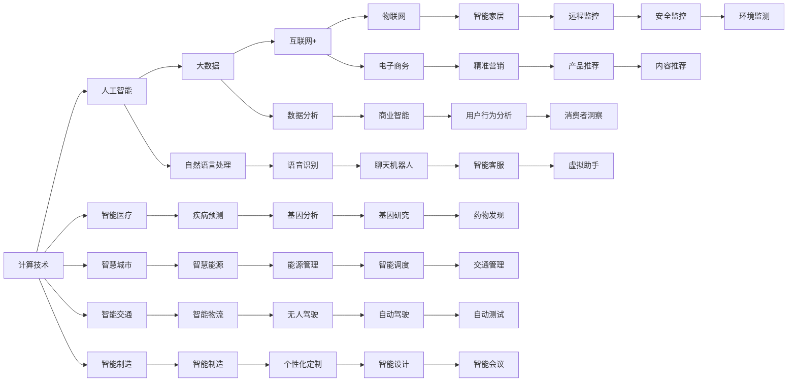

                 

# 推动社会进步的动力：人类计算的积极影响

## 1. 背景介绍

### 1.1 问题由来

在过去几十年中，计算技术以其惊人的速度和广泛的应用，深刻地改变了社会的方方面面。从医疗、教育到交通、通信，计算技术的进步极大地提升了人类生活的效率和质量。然而，随着计算能力的提升和数据量的激增，也带来了一些新的挑战，如隐私保护、伦理问题等。本文将探讨人类计算如何积极影响社会，同时讨论其中面临的挑战和可能的解决方案。

### 1.2 问题核心关键点

人类计算的核心关键点包括：

- 计算技术如何提升人类生活质量
- 计算技术如何改变社会结构和经济发展
- 计算技术带来的隐私和伦理问题
- 如何平衡技术进步与伦理道德的冲突

这些关键点构成了本文的主线，通过对这些问题的探讨，我们将全面分析计算技术在现代社会中的积极影响。

## 2. 核心概念与联系

### 2.1 核心概念概述

为了更好地理解计算技术对社会的影响，我们需要了解以下几个核心概念：

- 计算技术：指使用计算机和软件工具，通过自动化处理和分析数据，实现信息处理、决策支持等功能的技术。
- 人工智能（AI）：指使计算机具有类似人类智能的自主学习、推理、决策等能力。
- 大数据：指数据量巨大、结构复杂、增长速度快的数据集合，通过计算技术进行存储、处理和分析。
- 互联网+：指互联网与传统行业的深度融合，推动各行各业创新转型。
- 物联网（IoT）：指通过网络将各种物理设备连接起来，实现智能互联和实时监控。

这些概念之间通过数据、算法和应用场景相互联系，共同推动了人类社会的进步。

### 2.2 核心概念原理和架构的 Mermaid 流程图(Mermaid 流程节点中不要有括号、逗号等特殊字符)



这个图展示了计算技术、人工智能、大数据、互联网+和物联网如何通过不同的应用场景，对社会的各个方面产生积极影响。

## 3. 核心算法原理 & 具体操作步骤

### 3.1 算法原理概述

计算技术的核心算法原理主要包括以下几个方面：

- 并行计算：通过同时执行多个计算任务，提高处理速度。
- 分布式计算：将计算任务分散到多台计算机上并行处理，扩展计算能力。
- 云计算：通过互联网提供弹性计算资源，按需使用。
- 数据挖掘和机器学习：从大量数据中提取有价值的信息，训练模型进行预测和决策。
- 人工智能和深度学习：通过算法模拟人脑神经系统，实现智能决策和自动化。

### 3.2 算法步骤详解

计算技术的应用步骤通常包括以下几个关键环节：

1. **数据采集和存储**：使用传感器、API等技术，收集和存储各种数据。
2. **数据清洗和预处理**：清洗和转换原始数据，使其适合进一步分析。
3. **数据挖掘和分析**：使用算法从数据中提取模式和趋势，进行分析和预测。
4. **模型训练和优化**：使用机器学习算法训练模型，并进行参数调整和优化。
5. **结果展示和应用**：将分析结果可视化，指导决策和业务应用。

### 3.3 算法优缺点

计算技术在推动社会进步的同时，也存在一些问题和挑战：

- **优点**：
  - 提升效率：自动化处理和分析大量数据，大大提升工作效率。
  - 增强决策：基于数据驱动的决策，更加客观和准确。
  - 促进创新：推动各行各业创新转型，实现新业务模式。

- **缺点**：
  - 数据隐私：数据收集和分析过程中，可能涉及个人隐私和敏感信息。
  - 伦理问题：算法决策可能存在偏见和歧视，影响公平性。
  - 技术门槛：计算技术复杂度高，对技术水平要求高。

### 3.4 算法应用领域

计算技术已经广泛应用在各个领域，以下是一些典型的应用场景：

- **医疗**：智能诊断、健康管理、药物研发。
- **教育**：在线教育、智能辅导、数据分析。
- **金融**：风险评估、投资分析、客户服务。
- **交通**：智能交通管理、自动驾驶、交通数据分析。
- **制造**：智能制造、供应链优化、质量控制。
- **零售**：精准营销、客户分析、库存管理。

## 4. 数学模型和公式 & 详细讲解 & 举例说明（备注：数学公式请使用latex格式，latex嵌入文中独立段落使用 $$，段落内使用 $)
### 4.1 数学模型构建

计算技术的数学模型通常基于以下基本假设：

- 数据独立同分布（i.i.d.）：假设数据集中的每个样本都是独立的，且服从相同的分布。
- 线性模型：假设数据与输出之间存在线性关系，可以表示为 $y = wx + b$。
- 正则化：通过引入正则项，防止模型过拟合，如L1正则化、L2正则化。
- 损失函数：用于衡量模型预测输出与真实标签之间的差异，如均方误差（MSE）、交叉熵（Cross-Entropy）。

### 4.2 公式推导过程

以线性回归模型为例，推导其损失函数和梯度计算公式：

假设已知数据集 $D=\{(x_i,y_i)\}_{i=1}^N$，其中 $x_i \in \mathbb{R}^d$，$y_i \in \mathbb{R}$。线性回归模型的参数为 $w \in \mathbb{R}^d$ 和 $b \in \mathbb{R}$。损失函数为均方误差（MSE），即：

$$
\mathcal{L}(w,b) = \frac{1}{2N}\sum_{i=1}^N (y_i - wx_i - b)^2
$$

对于单个样本 $i$，其损失函数为：

$$
\mathcal{L}_i(w,b) = \frac{1}{2} (y_i - wx_i - b)^2
$$

梯度计算公式为：

$$
\frac{\partial \mathcal{L}}{\partial w} = \frac{1}{N}\sum_{i=1}^N (y_i - wx_i - b)x_i
$$

$$
\frac{\partial \mathcal{L}}{\partial b} = \frac{1}{N}\sum_{i=1}^N (y_i - wx_i - b)
$$

### 4.3 案例分析与讲解

以智能诊断为例，使用计算技术对医疗数据进行分析，可以提升诊断的准确性和效率。通过机器学习算法训练模型，可以对病人的症状进行分类，预测可能的疾病，辅助医生做出诊断。例如，可以使用逻辑回归模型对病人症状进行分类，其训练公式为：

$$
\mathcal{L}(w,b) = -\frac{1}{N}\sum_{i=1}^N [y_i\log \hat{y_i} + (1-y_i)\log(1-\hat{y_i})]
$$

其中 $\hat{y_i} = sigmoid(wx_i + b)$，$y_i \in \{0,1\}$ 表示样本是否患病，$sigmoid$ 函数将输出映射到 $[0,1]$ 区间。

## 5. 项目实践：代码实例和详细解释说明
### 5.1 开发环境搭建

为了进行计算技术的项目实践，需要准备以下开发环境：

1. 安装Python：建议使用Anaconda环境，可以方便地管理Python版本和依赖。
2. 安装必要的Python库：如NumPy、Pandas、Scikit-Learn等，这些库提供了丰富的数据处理和分析工具。
3. 安装机器学习框架：如Scikit-Learn、TensorFlow、PyTorch等，这些框架提供了各种机器学习算法和模型。
4. 安装云计算服务：如AWS、Google Cloud、阿里云等，提供弹性计算资源和数据存储服务。

### 5.2 源代码详细实现

以智能诊断项目为例，使用Scikit-Learn库进行机器学习模型的训练。首先，定义数据集：

```python
import pandas as pd
from sklearn.model_selection import train_test_split

# 加载数据集
data = pd.read_csv('diabetes.csv')

# 数据预处理
data = data.dropna()
X = data.drop('outcome', axis=1)
y = data['outcome']

# 数据划分
X_train, X_test, y_train, y_test = train_test_split(X, y, test_size=0.2, random_state=42)
```

然后，定义和训练模型：

```python
from sklearn.linear_model import LogisticRegression

# 定义模型
model = LogisticRegression()

# 训练模型
model.fit(X_train, y_train)
```

最后，评估模型性能：

```python
from sklearn.metrics import accuracy_score

# 评估模型
y_pred = model.predict(X_test)
accuracy = accuracy_score(y_test, y_pred)
print(f"Accuracy: {accuracy}")
```

### 5.3 代码解读与分析

在上述代码中，我们使用了Scikit-Learn库进行线性回归模型的训练和评估。首先，从CSV文件中加载数据集，并进行了预处理，去掉了缺失值。然后，使用train_test_split函数将数据集划分为训练集和测试集。接下来，定义了LogisticRegression模型，并使用训练集进行训练。最后，使用测试集评估模型的准确率。

## 6. 实际应用场景

### 6.1 智能医疗

计算技术在医疗领域的应用非常广泛，包括智能诊断、健康管理、药物研发等。通过计算技术，可以实现：

- 智能诊断：基于病人的症状和病历，使用机器学习算法进行疾病诊断。
- 健康管理：通过穿戴设备收集健康数据，进行实时监控和预警。
- 药物研发：使用计算技术加速新药筛选和设计，提高研发效率。

### 6.2 智慧城市

智慧城市是计算技术在城市管理中的应用，通过传感器、物联网等技术，实现城市智能化管理。具体应用包括：

- 智能交通：通过交通监控设备收集数据，进行实时交通分析和调度。
- 智能安防：通过视频监控和传感器，实现实时安全监控和预警。
- 智能能源：通过智能电网和传感器，实现能源消耗监控和管理。

### 6.3 智能制造

智能制造是计算技术在制造业中的应用，通过计算技术实现生产过程的智能化和自动化。具体应用包括：

- 智能生产：通过传感器和设备，实现生产过程的实时监控和优化。
- 智能供应链：通过计算技术优化供应链管理，提高效率和降低成本。
- 质量控制：通过机器视觉和计算技术，实现产品质量的实时检测和分析。

### 6.4 未来应用展望

未来，计算技术将继续在各个领域发挥重要作用。以下是一些可能的应用方向：

- **智慧教育**：通过计算技术，实现个性化教育、在线辅导和数据分析。
- **智能金融**：通过计算技术进行风险评估、投资分析和客户服务。
- **智能零售**：通过计算技术进行精准营销、客户分析和库存管理。
- **智能农业**：通过计算技术进行农业生产管理、病虫害监测和农作物分析。
- **智能家居**：通过计算技术实现智能家电控制、家庭安全和环境监控。

## 7. 工具和资源推荐
### 7.1 学习资源推荐

为了帮助开发者系统掌握计算技术，以下是一些优质的学习资源：

1. 《Python机器学习》：Hands-On Machine Learning with Scikit-Learn、TensorFlow等库的使用。
2. 《深度学习》：Ian Goodfellow等人著，介绍了深度学习的基本原理和应用。
3. 《机器学习实战》：Peter Harrington著，提供了大量的机器学习实战项目。
4. Coursera《机器学习》课程：Andrew Ng教授主讲，系统介绍了机器学习的基本概念和算法。
5. Kaggle竞赛：通过参加Kaggle数据科学竞赛，实践和提升机器学习技能。

### 7.2 开发工具推荐

计算技术开发需要使用多种工具，以下是一些常用的开发工具：

1. Python：编程语言，支持多种库和框架，广泛用于数据科学和机器学习。
2. R语言：统计分析和数据可视化工具，适合进行数据处理和分析。
3. SQL：数据库管理语言，用于数据存储和查询。
4. Jupyter Notebook：交互式编程环境，支持Python、R等多种语言。
5. GitHub：代码托管平台，支持版本控制和协作开发。

### 7.3 相关论文推荐

计算技术的研究涉及多个领域，以下是一些相关的论文：

1. "Deep Learning" by Ian Goodfellow et al.：深度学习的经典教材，涵盖了深度学习的基本理论和应用。
2. "Google's BERT: Pre-training of Deep Bidirectional Transformers for Language Understanding" by Jacob Devlin et al.：介绍BERT模型的设计和应用，展示了预训练技术对语言理解任务的影响。
3. "AlphaGo Zero" by David Silver et al.：介绍AlphaGo Zero算法，展示了深度学习在智能游戏中的应用。
4. "ImageNet Classification with Deep Convolutional Neural Networks" by Alex Krizhevsky et al.：介绍深度卷积神经网络在图像分类中的应用。
5. "Reinforcement Learning: An Introduction" by Richard S. Sutton and Andrew G. Barto：介绍了强化学习的基本概念和应用。

## 8. 总结：未来发展趋势与挑战

### 8.1 研究成果总结

计算技术在推动社会进步方面已经取得了显著成果，主要体现在：

- 提升了效率：自动化处理和分析大量数据，大大提升了工作效率。
- 增强了决策：基于数据驱动的决策，更加客观和准确。
- 促进了创新：推动各行各业创新转型，实现新业务模式。

### 8.2 未来发展趋势

未来，计算技术的发展趋势主要包括以下几个方面：

- **更高效的算法**：通过优化算法，提高计算速度和效率。
- **更智能的模型**：通过深度学习和大数据技术，实现更智能的决策和预测。
- **更广泛的应用**：将计算技术应用于更多领域，实现全面智能化。
- **更安全的系统**：通过安全技术保障计算系统的安全性。
- **更便捷的用户体验**：通过人机交互技术提升用户体验。

### 8.3 面临的挑战

计算技术在推动社会进步的同时，也面临着一些挑战：

- **数据隐私**：数据收集和分析过程中，可能涉及个人隐私和敏感信息。
- **伦理问题**：算法决策可能存在偏见和歧视，影响公平性。
- **技术门槛**：计算技术复杂度高，对技术水平要求高。

### 8.4 研究展望

为了克服这些挑战，未来的研究需要关注以下几个方面：

- **隐私保护**：加强数据隐私保护，防止数据泄露和滥用。
- **公平性**：开发公平的算法，减少算法偏见和歧视。
- **用户友好**：提高计算技术的易用性，降低技术门槛。
- **伦理规范**：建立计算技术的伦理规范，指导算法设计和应用。

## 9. 附录：常见问题与解答

**Q1：计算技术如何提升效率？**

A：计算技术通过自动化处理和分析大量数据，大大提升了工作效率。例如，使用机器学习算法可以对大量数据进行分类和分析，快速识别模式和趋势。

**Q2：计算技术如何增强决策？**

A：计算技术通过数据分析和建模，提供基于数据的决策支持。例如，通过机器学习算法可以对历史数据进行分析，预测未来趋势，辅助决策。

**Q3：计算技术如何促进创新？**

A：计算技术推动各行各业创新转型，实现新业务模式。例如，通过大数据分析和机器学习算法，可以实现个性化推荐、智能制造等新业务模式。

**Q4：计算技术面临的隐私挑战是什么？**

A：数据收集和分析过程中，可能涉及个人隐私和敏感信息。需要采取数据加密、匿名化等技术手段，保护数据隐私。

**Q5：如何平衡技术进步与伦理道德的冲突？**

A：在开发和应用计算技术时，需要遵循伦理道德规范，避免算法的偏见和歧视。同时，需要加强人工干预和审核，确保技术应用符合社会价值观和伦理道德。

---

作者：禅与计算机程序设计艺术 / Zen and the Art of Computer Programming

