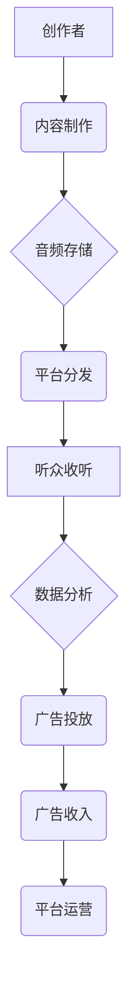

> 播客，音频内容，商业化，技术架构，数据分析，用户体验，市场趋势

## 1. 背景介绍

音频内容正以惊人的速度席卷全球，播客作为其重要组成部分，正在迅速崛起。从最初的科技爱好者和独立创作者的聚集地，播客已发展成为涵盖各个领域的丰富内容平台，吸引了越来越多的听众和创作者。

随着播客行业的蓬勃发展，商业化模式也逐渐成为行业关注的焦点。如何将播客内容转化为可持续的商业价值，是众多播客创作者和平台运营商面临的共同挑战。

## 2. 核心概念与联系

**2.1 播客内容生态系统**

播客内容生态系统是一个由创作者、平台、听众和广告商组成的复杂网络。

* **创作者:** 播客节目制作人和主持人，他们创作并发布音频内容。
* **平台:** 提供播客托管、分发和播放服务的平台，例如 Apple Podcasts、Spotify、喜马拉雅FM 等。
* **听众:** 消费播客内容的用户，他们通过手机、电脑或智能音箱等设备收听播客节目。
* **广告商:** 通过赞助、广告投放等方式支持播客内容的制作和传播。

**2.2 播客商业化模式**

播客商业化模式主要包括以下几种：

* **广告收入:** 通过在播客节目中插入广告，向广告商收取费用。
* **会员订阅:** 创作者提供付费会员服务，会员可以获得独家内容、提前收听节目等权益。
* **赞助合作:** 与品牌或企业合作，在播客节目中进行产品推广或品牌植入。
* **电商销售:** 创作者通过播客节目推广自己的产品或服务，并引导听众进行购买。

**2.3 技术架构**

播客商业化需要强大的技术支持，包括：

* **音频内容存储和分发:** 需要高效的音频存储和分发系统，确保播客内容能够快速、稳定地传递给听众。
* **数据分析和用户行为追踪:** 需要收集和分析用户收听数据，了解听众的喜好和行为模式，以便更好地进行内容创作和商业化运营。
* **广告管理和投放:** 需要建立完善的广告管理系统，实现精准广告投放，提高广告收益。
* **会员管理和支付系统:** 需要提供安全的会员管理和支付系统，保障会员权益和资金安全。

**Mermaid 流程图**



## 3. 核心算法原理 & 具体操作步骤

**3.1 算法原理概述**

播客商业化涉及到多个算法，例如推荐算法、广告匹配算法、用户行为分析算法等。这些算法的核心目的是通过数据分析和模式识别，实现个性化推荐、精准广告投放、用户行为预测等功能，从而提高用户体验和商业效益。

**3.2 算法步骤详解**

* **推荐算法:**

    1. 收集用户收听历史、评分、评论等数据。
    2. 基于用户兴趣和行为模式，构建用户画像。
    3. 利用协同过滤、内容过滤、深度学习等算法，推荐符合用户偏好的播客节目。

* **广告匹配算法:**

    1. 收集广告商的广告信息、目标受众等数据。
    2. 分析用户收听数据，识别用户兴趣和行为特征。
    3. 利用机器学习算法，匹配广告和用户，实现精准广告投放。

* **用户行为分析算法:**

    1. 收集用户收听时长、跳出率、点赞数等数据。
    2. 利用统计分析和机器学习算法，分析用户行为模式。
    3. 识别用户活跃度、忠诚度等指标，为内容创作和商业化运营提供参考。

**3.3 算法优缺点**

* **推荐算法:**

    * 优点: 可以提供个性化推荐，提高用户体验。
    * 缺点: 可能存在推荐偏差，导致用户接触到有限的內容。

* **广告匹配算法:**

    * 优点: 可以提高广告点击率和转化率。
    * 缺点: 可能导致用户广告疲劳，影响用户体验。

* **用户行为分析算法:**

    * 优点: 可以帮助平台运营商了解用户需求，优化内容和服务。
    * 缺点: 需要收集大量用户数据，可能存在隐私安全问题。

**3.4 算法应用领域**

* **内容推荐:** 为用户推荐符合其兴趣的播客节目。
* **广告投放:** 为广告商精准投放广告，提高广告效果。
* **用户运营:** 了解用户行为模式，优化用户体验和留存率。
* **市场分析:** 分析播客行业趋势，为创作者和平台运营商提供决策参考。

## 4. 数学模型和公式 & 详细讲解 & 举例说明

**4.1 数学模型构建**

推荐算法通常采用协同过滤模型，该模型基于用户的历史行为数据，预测用户对特定播客节目的评分或偏好程度。

**4.2 公式推导过程**

协同过滤模型的评分预测公式如下：

$$
\hat{r}_{u,i} = \bar{r}_u + \frac{\sum_{j \in N(u)} (r_{u,j} - \bar{r}_u) \cdot (r_{j,i} - \bar{r}_j)}{\sum_{j \in N(u)} (r_{u,j} - \bar{r}_u)^2}
$$

其中：

* $\hat{r}_{u,i}$: 用户 $u$ 对播客节目 $i$ 的预测评分。
* $\bar{r}_u$: 用户 $u$ 的平均评分。
* $r_{u,j}$: 用户 $u$ 对播客节目 $j$ 的实际评分。
* $r_{j,i}$: 用户 $j$ 对播客节目 $i$ 的实际评分。
* $N(u)$: 用户 $u$ 评分过的播客节目集合。

**4.3 案例分析与讲解**

假设用户 Alice 评分过三个播客节目，分别是节目 A、B 和 C，其评分分别为 4、3 和 5。节目 B 和 C 都有用户 Bob 评分过，Bob 对节目 B 的评分为 2，对节目 C 的评分为 4。

根据上述公式，我们可以预测 Alice 对节目 B 的评分：

$$
\hat{r}_{Alice,B} = 3.67 + \frac{(4-3.67) \cdot (2-3.67)}{(4-3.67)^2} = 3.33
$$

## 5. 项目实践：代码实例和详细解释说明

**5.1 开发环境搭建**

* 操作系统: Ubuntu 20.04
* 编程语言: Python 3.8
* 开发工具: VS Code

**5.2 源代码详细实现**

```python
import pandas as pd

# 加载用户评分数据
data = pd.read_csv('user_ratings.csv')

# 计算用户平均评分
data['avg_rating'] = data.groupby('user_id')['rating'].transform('mean')

# 计算用户评分与平均评分的偏差
data['rating_deviation'] = data['rating'] - data['avg_rating']

# 计算节目评分与平均评分的偏差
data['item_rating_deviation'] = data.groupby('item_id')['rating'].transform('mean')

# 预测用户对特定节目的评分
def predict_rating(user_id, item_id):
    user_data = data[data['user_id'] == user_id]
    item_data = data[data['item_id'] == item_id]
    
    # 计算预测评分
    predicted_rating = user_data['avg_rating'].iloc[0] + (
        (user_data['rating_deviation'].iloc[0] * item_data['rating_deviation'].iloc[0]) / 
        (user_data['rating_deviation'].iloc[0] ** 2)
    )
    return predicted_rating

# 示例
user_id = 1
item_id = 2
predicted_rating = predict_rating(user_id, item_id)
print(f'用户 {user_id} 对节目 {item_id} 的预测评分为: {predicted_rating}')
```

**5.3 代码解读与分析**

该代码实现了一个简单的协同过滤推荐算法。

* 首先，加载用户评分数据，并计算用户平均评分和评分偏差。
* 然后，定义一个 `predict_rating` 函数，用于预测用户对特定节目的评分。
* 最后，使用示例数据演示了代码的运行结果。

**5.4 运行结果展示**

运行代码后，会输出用户对特定节目的预测评分。

## 6. 实际应用场景

**6.1 播客推荐系统**

* 为用户推荐符合其兴趣的播客节目，提高用户粘性和留存率。
* 根据用户收听历史和行为模式，个性化推荐节目内容，提升用户体验。

**6.2 精准广告投放**

* 分析用户收听数据，识别用户兴趣和行为特征，精准匹配广告内容。
* 提高广告点击率和转化率，为广告商提供更有效的广告投放方案。

**6.3 用户行为分析**

* 分析用户收听时长、跳出率、点赞数等数据，了解用户行为模式。
* 优化内容创作和运营策略，提高用户参与度和互动性。

**6.4 未来应用展望**

* **人工智能驱动的个性化推荐:** 利用深度学习等人工智能技术，实现更精准、更个性化的播客推荐。
* **沉浸式音频体验:** 通过增强现实 (AR) 和虚拟现实 (VR) 技术，打造更沉浸式的音频体验。
* **音频内容创作工具:** 开发更便捷、更强大的音频内容创作工具，降低创作者门槛。

## 7. 工具和资源推荐

**7.1 学习资源推荐**

* **书籍:**
    * 《推荐系统实践》
    * 《机器学习》
* **在线课程:**
    * Coursera: 机器学习
    * Udacity: 深度学习

**7.2 开发工具推荐**

* **音频编辑软件:** Audacity, Adobe Audition
* **播客托管平台:** Libsyn, Buzzsprout
* **数据分析工具:** Python (Pandas, Scikit-learn), R

**7.3 相关论文推荐**

* 《协同过滤推荐算法综述》
* 《深度学习在推荐系统中的应用》

## 8. 总结：未来发展趋势与挑战

**8.1 研究成果总结**

播客商业化研究取得了显著进展，推荐算法、广告匹配算法、用户行为分析算法等技术不断成熟。

**8.2 未来发展趋势**

* 人工智能驱动的个性化推荐
* 沉浸式音频体验
* 音频内容创作工具

**8.3 面临的挑战**

* 数据隐私安全
* 内容质量控制
* 盈利模式创新

**8.4 研究展望**

未来研究将重点关注以下方面:

* 开发更安全、更可靠的数据分析和隐私保护技术。
* 探索新的播客商业化模式，提高创作者收入和平台盈利能力。
* 研究音频内容的交互性和沉浸式体验，打造更丰富的音频内容生态系统。

## 9. 附录：常见问题与解答

**9.1 如何提高播客节目推荐的准确性?**

* 收集更多用户数据，包括收听历史、评分、评论等。
* 利用更先进的推荐算法，例如深度学习算法。
* 结合用户画像和内容特征，实现更精准的推荐。

**9.2 如何解决播客广告疲劳问题