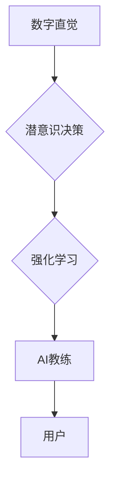

> 数字直觉，潜意识决策，强化学习，AI教练，决策优化，神经网络，机器学习，数据分析

## 1. 背景介绍

在当今数据爆炸的时代，我们每天都面临着海量的决策。从日常生活的琐碎事，到重大的人生抉择，决策无处不在。然而，我们的理性思维往往局限于有限的认知能力和经验，难以处理复杂多变的决策场景。潜意识，作为我们思维的另一部分，却蕴藏着丰富的直觉和洞察力。

数字直觉训练营旨在帮助你开发和强化潜意识决策能力，从而提升决策效率和准确性。通过结合人工智能技术和强化学习原理，我们构建了一个AI辅助的潜意识决策强化教练，帮助你探索和挖掘潜意识的智慧，最终实现更明智的决策。

## 2. 核心概念与联系

### 2.1 数字直觉

数字直觉是指在不依赖于逻辑推理和分析的情况下，通过直觉和感觉来判断数字信息和数据趋势的能力。它是一种基于经验和潜意识积累的快速反应和判断能力，能够帮助我们快速识别数字模式和潜在关系。

### 2.2 潜意识决策

潜意识决策是指我们无意识地进行的决策过程。这些决策往往基于我们的经验、情感、信念和价值观等因素，而我们并不能完全意识到这些因素的影响。潜意识决策通常比理性决策更快、更直接，但也更容易受到情绪和偏见的影响。

### 2.3 强化学习

强化学习是一种机器学习方法，它通过奖励和惩罚机制来训练智能体，使其在特定环境中学习最优策略。在数字直觉训练营中，强化学习被用来训练AI教练，帮助用户提升数字直觉和决策能力。

**核心概念与联系流程图**



## 3. 核心算法原理 & 具体操作步骤

### 3.1 算法原理概述

数字直觉训练营的核心算法基于强化学习和神经网络技术。

* **强化学习:** AI教练通过与用户进行交互，收集用户决策和结果反馈，并根据这些反馈调整自己的策略，最终学习到最优的指导策略。
* **神经网络:** 神经网络被用来模拟用户的潜意识决策过程，并识别用户的决策模式和偏好。

### 3.2 算法步骤详解

1. **数据收集:** AI教练收集用户的决策数据，包括决策内容、时间、结果等信息。
2. **数据预处理:** 对收集到的数据进行清洗、转换和特征提取，以便于神经网络的训练。
3. **神经网络训练:** 使用神经网络模型训练，学习用户的决策模式和偏好。
4. **策略优化:** 使用强化学习算法优化AI教练的指导策略，使其能够更好地引导用户的决策。
5. **用户交互:** AI教练根据用户的决策情况提供个性化的指导和反馈，帮助用户提升数字直觉和决策能力。

### 3.3 算法优缺点

**优点:**

* **个性化指导:** AI教练可以根据用户的决策模式和偏好提供个性化的指导。
* **数据驱动:** 算法基于用户的真实决策数据进行训练和优化，具有更高的准确性和有效性。
* **持续学习:** AI教练可以不断学习和进化，随着用户的决策数据积累，其指导策略也会不断提升。

**缺点:**

* **数据依赖:** 算法的性能取决于收集到的数据质量和数量。
* **黑盒问题:** 神经网络模型的决策过程较为复杂，难以解释其背后的决策逻辑。
* **伦理问题:** AI教练的指导可能会影响用户的独立思考和决策能力，需要谨慎考虑伦理问题。

### 3.4 算法应用领域

数字直觉训练营的核心算法可以应用于以下领域:

* **金融投资:** 帮助投资者识别市场趋势和投资机会。
* **商业决策:** 帮助企业决策者做出更明智的商业决策。
* **医疗诊断:** 帮助医生更快、更准确地诊断疾病。
* **教育培训:** 帮助学生提升学习效率和解决问题的能力。

## 4. 数学模型和公式 & 详细讲解 & 举例说明

### 4.1 数学模型构建

数字直觉训练营的核心数学模型基于强化学习的Q-learning算法。

**Q-learning算法的目标是学习一个状态-动作价值函数Q(s,a)，该函数表示在状态s下执行动作a的期望回报。**

**状态空间:** 用户当前的决策环境，例如市场数据、用户偏好等。

**动作空间:** 用户可以采取的决策，例如买入、卖出、持有等。

**奖励函数:** 根据用户的决策结果给予奖励或惩罚，例如收益、损失等。

### 4.2 公式推导过程

Q-learning算法的更新公式如下:

$$Q(s,a) = Q(s,a) + \alpha [r + \gamma \max_{a'} Q(s',a') - Q(s,a)]$$

其中:

* $Q(s,a)$: 状态s下执行动作a的价值函数。
* $\alpha$: 学习率，控制学习速度。
* $r$: 当前状态下获得的奖励。
* $\gamma$: 折扣因子，控制未来奖励的权重。
* $s'$: 执行动作a后进入的下一个状态。
* $a'$: 在下一个状态s'下可以采取的动作。

### 4.3 案例分析与讲解

假设一个用户在股票市场上进行投资决策。

* 状态空间: 用户当前持有的股票数量、市场价格、用户风险偏好等。
* 动作空间: 买入、卖出、持有等。
* 奖励函数: 根据股票价格变化给予奖励或惩罚，例如股票价格上涨给予正向奖励，下跌给予负向奖励。

通过Q-learning算法，AI教练可以学习到不同状态下执行不同动作的期望回报，并根据这些回报建议用户进行投资决策。

## 5. 项目实践：代码实例和详细解释说明

### 5.1 开发环境搭建

* Python 3.x
* TensorFlow 或 PyTorch 深度学习框架
* NumPy 科学计算库
* Matplotlib 数据可视化库

### 5.2 源代码详细实现

```python
import tensorflow as tf

# 定义Q-learning模型
class QLearningModel(tf.keras.Model):
    def __init__(self, state_size, action_size):
        super(QLearningModel, self).__init__()
        self.dense1 = tf.keras.layers.Dense(64, activation='relu')
        self.dense2 = tf.keras.layers.Dense(action_size)

    def call(self, state):
        x = self.dense1(state)
        return self.dense2(x)

# 训练Q-learning模型
model = QLearningModel(state_size, action_size)
optimizer = tf.keras.optimizers.Adam(learning_rate=0.001)
loss_fn = tf.keras.losses.MeanSquaredError()

# ... 训练循环 ...

# 使用训练好的模型进行预测
state = ...
action_probs = model(state)
action = tf.random.categorical(action_probs, num_samples=1)[0, 0]
```

### 5.3 代码解读与分析

* **模型定义:** 使用TensorFlow框架定义了一个Q-learning模型，包含两层全连接神经网络。
* **训练循环:** 使用训练数据进行模型训练，优化目标是最小化状态-动作价值函数的误差。
* **预测:** 使用训练好的模型预测用户在特定状态下采取的动作概率。

### 5.4 运行结果展示

训练完成后，可以将模型应用于实际场景，例如股票市场投资决策。通过观察模型的预测结果和用户决策的实际效果，可以评估模型的性能和有效性。

## 6. 实际应用场景

### 6.1 金融投资

数字直觉训练营可以帮助投资者识别市场趋势和投资机会，提升投资决策的准确性和效率。

### 6.2 商业决策

企业决策者可以使用数字直觉训练营来分析市场数据、客户行为和竞争对手信息，做出更明智的商业决策。

### 6.3 医疗诊断

数字直觉训练营可以帮助医生更快、更准确地诊断疾病，提高医疗诊断的效率和准确性。

### 6.4 未来应用展望

数字直觉训练营的应用场景还在不断扩展，未来可能应用于教育、娱乐、游戏等领域，帮助人们提升学习效率、体验娱乐和游戏乐趣。

## 7. 工具和资源推荐

### 7.1 学习资源推荐

* **强化学习书籍:**
    * Reinforcement Learning: An Introduction by Richard S. Sutton and Andrew G. Barto
    * Deep Reinforcement Learning Hands-On by Maxim Lapan
* **在线课程:**
    * Coursera: Reinforcement Learning Specialization
    * Udacity: Deep Reinforcement Learning Nanodegree

### 7.2 开发工具推荐

* **Python:** 
    * TensorFlow
    * PyTorch
* **数据可视化工具:**
    * Matplotlib
    * Seaborn

### 7.3 相关论文推荐

* Deep Q-Network (DQN)
* Dueling Network Architectures for Deep Reinforcement Learning
* Proximal Policy Optimization Algorithms

## 8. 总结：未来发展趋势与挑战

### 8.1 研究成果总结

数字直觉训练营的研究成果表明，结合人工智能技术和强化学习原理，可以有效地提升用户的数字直觉和决策能力。

### 8.2 未来发展趋势

* **更精准的个性化指导:** 通过更深入的用户数据分析和模型优化，提供更精准的个性化指导。
* **多模态数据融合:** 将文本、图像、音频等多模态数据融合到模型中，提升模型的理解能力和决策准确性。
* **解释性AI:** 研究更可解释的强化学习算法，帮助用户理解模型的决策逻辑。

### 8.3 面临的挑战

* **数据隐私保护:** 确保用户数据的安全和隐私。
* **算法公平性:** 避免算法产生偏见，确保决策公平公正。
* **伦理问题:** 谨慎考虑AI教练对用户决策能力的影响，避免过度依赖AI。

### 8.4 研究展望

未来，数字直觉训练营的研究将继续探索人工智能和强化学习在决策辅助领域的应用，致力于帮助人们提升决策能力，做出更明智的选择。

## 9. 附录：常见问题与解答

**Q1: 数字直觉训练营需要多少时间才能看到效果？**

**A1:** 训练时间取决于用户的学习进度和投入程度。一般来说，需要持续练习和训练一段时间才能看到明显的提升。

**Q2: 数字直觉训练营适合所有人群吗？**

**A2:** 数字直觉训练营可以帮助所有希望提升决策能力的人群，但对于初学者来说，需要一定的学习时间和耐心。

**Q3: 数字直觉训练营会取代人类的决策能力吗？**

**A3:** 数字直觉训练营旨在辅助人类决策，而不是取代人类的决策能力。AI教练可以提供建议和指导，但最终的决策权仍然掌握在人类手中。


作者：禅与计算机程序设计艺术 / Zen and the Art of Computer Programming 
<end_of_turn>