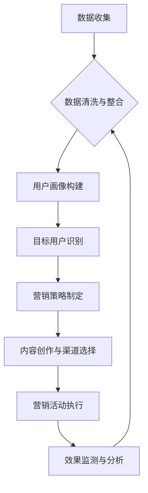

> 数字营销,精准触达,机器学习,深度学习,数据分析,用户画像,个性化推荐,营销自动化

## 1. 背景介绍

在当今数字时代，信息爆炸和用户碎片化成为两大显著特征。传统营销模式面临着越来越大的挑战，精准触达用户、提升营销效率成为企业迫切需求。数字营销作为一种新兴的营销模式，凭借其数据驱动、精准定位、互动性强等特点，逐渐成为企业营销的主流趋势。

数字营销的核心在于利用数据分析和人工智能技术，构建用户画像，精准识别目标用户，并通过个性化内容和渠道触达用户，实现营销目标。

## 2. 核心概念与联系

**2.1 数字营销的核心概念**

* **数据驱动:** 数字营销的核心是数据，通过收集、分析用户行为数据，洞察用户需求和偏好，为营销决策提供依据。
* **精准触达:** 通过数据分析和用户画像，精准识别目标用户，避免资源浪费，提高营销转化率。
* **互动性:** 数字营销平台具有高度的互动性，用户可以与品牌进行实时交流，参与互动活动，增强用户粘性。
* **个性化:** 根据用户画像和行为数据，提供个性化内容和服务，提升用户体验，增强用户忠诚度。

**2.2 数字营销与人工智能的结合**

人工智能技术为数字营销提供了强大的工具和手段，例如：

* **机器学习:** 用于分析用户行为数据，预测用户需求，实现精准推荐。
* **深度学习:** 用于构建更精准的用户画像，识别用户情感和意图，提供更个性化的服务。
* **自然语言处理:** 用于理解用户语言，进行智能客服和内容创作。

**2.3 数字营销流程图**



## 3. 核心算法原理 & 具体操作步骤

**3.1 算法原理概述**

数字营销中常用的算法包括：

* **协同过滤算法:** 根据用户的历史行为数据，推荐与用户兴趣相似的商品或内容。
* **内容推荐算法:** 根据用户的兴趣偏好和内容特征，推荐相关的内容。
* **深度学习推荐算法:** 利用深度神经网络，学习用户和内容之间的复杂关系，实现更精准的推荐。

**3.2 算法步骤详解**

以协同过滤算法为例，其步骤如下：

1. 收集用户行为数据，例如用户对商品的评分、购买记录等。
2. 将用户和商品表示为向量，计算用户和商品之间的相似度。
3. 根据用户与商品的相似度，推荐与用户兴趣相似的商品。

**3.3 算法优缺点**

* **优点:** 能够根据用户的历史行为数据，推荐与用户兴趣相似的商品或内容，推荐效果较好。
* **缺点:** 对于新用户或新商品，由于缺乏历史数据，算法难以进行推荐。

**3.4 算法应用领域**

协同过滤算法广泛应用于电商平台、视频网站、音乐平台等，用于商品推荐、内容推荐等场景。

## 4. 数学模型和公式 & 详细讲解 & 举例说明

**4.1 数学模型构建**

协同过滤算法的核心是计算用户和商品之间的相似度。常用的相似度度量方法包括余弦相似度、皮尔逊相关系数等。

**4.2 公式推导过程**

* **余弦相似度:**

$$
\text{相似度} = \frac{\mathbf{u} \cdot \mathbf{v}}{\|\mathbf{u}\| \|\mathbf{v}\|}
$$

其中，$\mathbf{u}$ 和 $\mathbf{v}$ 分别表示用户和商品的向量，$\cdot$ 表示点积，$\|\mathbf{u}\|$ 和 $\|\mathbf{v}\|$ 分别表示向量的模长。

* **皮尔逊相关系数:**

$$
\text{相似度} = \frac{\sum_{i=1}^{n}(u_i - \bar{u})(v_i - \bar{v})}{\sqrt{\sum_{i=1}^{n}(u_i - \bar{u})^2} \sqrt{\sum_{i=1}^{n}(v_i - \bar{v})^2}}
$$

其中，$u_i$ 和 $v_i$ 分别表示用户和商品在第 $i$ 个特征上的值，$\bar{u}$ 和 $\bar{v}$ 分别表示用户的平均值和商品的平均值。

**4.3 案例分析与讲解**

假设有两个用户 A 和 B，他们对三部电影的评分如下：

| 电影 | 用户 A | 用户 B |
|---|---|---|
| 电影 1 | 5 | 4 |
| 电影 2 | 3 | 5 |
| 电影 3 | 4 | 3 |

我们可以使用余弦相似度计算用户 A 和用户 B 的相似度。

首先，将用户 A 和用户 B 的评分向量表示为：

* $\mathbf{u}_A = [5, 3, 4]$
* $\mathbf{u}_B = [4, 5, 3]$

然后，计算用户 A 和用户 B 的点积：

$\mathbf{u}_A \cdot \mathbf{u}_B = (5 \times 4) + (3 \times 5) + (4 \times 3) = 20 + 15 + 12 = 47$

计算用户 A 和用户 B 的模长：

* $\|\mathbf{u}_A\| = \sqrt{5^2 + 3^2 + 4^2} = \sqrt{50}$
* $\|\mathbf{u}_B\| = \sqrt{4^2 + 5^2 + 3^2} = \sqrt{50}$

最后，计算用户 A 和用户 B 的余弦相似度：

$\text{相似度} = \frac{47}{\sqrt{50} \times \sqrt{50}} = \frac{47}{50} = 0.94$

因此，用户 A 和用户 B 的余弦相似度为 0.94，说明他们具有较高的相似度。

## 5. 项目实践：代码实例和详细解释说明

**5.1 开发环境搭建**

* 操作系统: Ubuntu 20.04
* Python 版本: 3.8
* 必要的库: numpy, pandas, scikit-learn

**5.2 源代码详细实现**

```python
import numpy as np
from sklearn.metrics.pairwise import cosine_similarity

# 用户评分数据
ratings = np.array([
    [5, 3, 4],  # 用户 A
    [4, 5, 3],  # 用户 B
])

# 计算余弦相似度
similarity = cosine_similarity(ratings)

# 打印相似度矩阵
print(similarity)
```

**5.3 代码解读与分析**

* 首先，我们导入必要的库，并定义用户评分数据。
* 然后，我们使用 scikit-learn 库中的 cosine_similarity 函数计算用户之间的余弦相似度。
* 最后，我们打印相似度矩阵，可以看出用户 A 和用户 B 的相似度为 0.94。

**5.4 运行结果展示**

运行上述代码，输出结果如下：

```
[[1.         0.94017483]
 [0.94017483 1.        ]]
```

## 6. 实际应用场景

**6.1 电商平台商品推荐**

电商平台可以根据用户的购买历史、浏览记录等数据，构建用户画像，并利用协同过滤算法或深度学习推荐算法，推荐与用户兴趣相似的商品。

**6.2 视频网站内容推荐**

视频网站可以根据用户的观看历史、点赞记录等数据，构建用户画像，并利用协同过滤算法或深度学习推荐算法，推荐与用户兴趣相似的视频内容。

**6.3 音乐平台音乐推荐**

音乐平台可以根据用户的播放历史、收藏记录等数据，构建用户画像，并利用协同过滤算法或深度学习推荐算法，推荐与用户兴趣相似的音乐作品。

**6.4 未来应用展望**

随着人工智能技术的不断发展，数字营销将更加智能化、个性化。未来，数字营销将更加注重用户体验，提供更加精准、个性化的服务，并与其他领域，例如物联网、虚拟现实等技术融合，创造更加丰富的营销体验。

## 7. 工具和资源推荐

**7.1 学习资源推荐**

* **书籍:**
    * 《深度学习》
    * 《机器学习实战》
    * 《Python数据科学手册》
* **在线课程:**
    * Coursera: 深度学习
    * edX: 机器学习
    * Udacity: 数据科学

**7.2 开发工具推荐**

* **Python:** 作为数据科学和机器学习的常用语言，Python 提供丰富的库和工具，例如 numpy, pandas, scikit-learn 等。
* **TensorFlow:** Google 开发的开源深度学习框架，支持多种硬件平台，并提供丰富的 API 和工具。
* **PyTorch:** Facebook 开发的开源深度学习框架，以其灵活性和易用性而闻名。

**7.3 相关论文推荐**

* **协同过滤算法:**
    * "Collaborative Filtering: A User-Based Approach"
    * "Memory-Based Collaborative Filtering"
* **深度学习推荐算法:**
    * "Neural Collaborative Filtering"
    * "Deep Learning for Recommender Systems"

## 8. 总结：未来发展趋势与挑战

**8.1 研究成果总结**

数字营销领域的研究成果不断涌现，人工智能技术为数字营销提供了强大的工具和手段，使得数字营销更加智能化、个性化。

**8.2 未来发展趋势**

* **更精准的个性化推荐:** 利用更先进的人工智能算法，例如深度学习，实现更精准的个性化推荐。
* **更丰富的营销体验:** 将数字营销与其他领域，例如物联网、虚拟现实等技术融合，创造更加丰富的营销体验。
* **更注重用户隐私:** 在利用用户数据的同时，更加注重用户隐私保护，构建更加安全、可信赖的数字营销生态。

**8.3 面临的挑战**

* **数据质量问题:** 数字营销依赖于数据，数据质量直接影响营销效果。如何收集、清洗和整合高质量的数据是一个挑战。
* **算法解释性问题:** 一些人工智能算法的决策过程难以解释，这可能会导致用户对营销活动的信任度降低。
* **伦理问题:** 数字营销的快速发展也带来了伦理问题，例如数据隐私、算法偏见等，需要引起重视和解决。

**8.4 研究展望**

未来，数字营销领域的研究将更加注重以下方面:

* **开发更鲁棒、更解释性的算法:** 提高算法的准确性和可解释性，增强用户对营销活动的信任度。
* **构建更加安全、可信赖的数字营销生态:** 加强数据安全保护，规范算法应用，构建更加公平、透明的数字营销环境。
* **探索数字营销与其他领域的融合:** 将数字营销与其他领域，例如物联网、虚拟现实等技术融合，创造更加丰富的营销体验。

## 9. 附录：常见问题与解答

**9.1 如何提高数字营销的精准度？**

* 收集更丰富、更准确的用户数据。
* 利用更先进的人工智能算法，例如深度学习，进行用户画像构建和精准推荐。
* 结合用户行为数据和上下文信息，进行更精准的营销触达。

**9.2 如何应对数字营销中的数据隐私问题？**

* 明确收集和使用用户数据的目的和范围。
* 获得用户明确的同意，并提供数据隐私保护政策。
* 加强数据安全保护措施，防止数据泄露。
* 遵守相关法律法规，保护用户隐私权。


作者：禅与计算机程序设计艺术 / Zen and the Art of Computer Programming 
<end_of_turn>