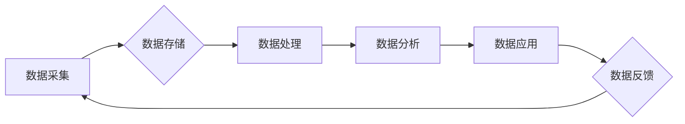

> 数据资产,软件2.0,数据估值,数据价值,人工智能,机器学习,数据模型,数据标准

## 1. 背景介绍

在数字化时代，数据已成为企业最宝贵的资产之一。数据蕴含着巨大的价值，能够帮助企业洞察市场趋势、优化运营效率、开发创新产品和服务。然而，如何有效地识别、量化和管理数据资产，一直是企业面临的挑战。

传统的软件开发模式以功能和性能为核心，数据往往被视为辅助工具。随着软件2.0时代的到来，数据驱动成为核心驱动力，数据资产的价值得到越来越多的重视。软件2.0强调数据智能化、自动化和可扩展性，通过人工智能、机器学习等技术，将数据转化为有价值的洞察和决策支持。

## 2. 核心概念与联系

**2.1 数据资产的概念**

数据资产是指企业在经营活动中收集、积累和存储的各种数据，包括结构化数据、非结构化数据和半结构化数据。这些数据具有价值，能够为企业带来经济效益、社会效益和环境效益。

**2.2 软件2.0的特征**

软件2.0是指基于云计算、大数据、人工智能等新技术的软件开发模式。其主要特征包括：

* **数据驱动:** 数据成为软件的核心驱动力，软件开发流程围绕数据进行优化。
* **智能化:** 利用人工智能、机器学习等技术，赋予软件智能化能力，实现自动化决策和智能服务。
* **可扩展性:** 软件架构更加灵活和可扩展，能够根据业务需求进行快速调整和扩展。

**2.3 数据资产估值新标准**

软件2.0催生了数据资产估值的新标准，不再仅仅依赖于数据的数量和类型，而是更加注重数据的价值和利用价值。

**2.4 数据资产估值模型**

数据资产估值模型通常包括以下几个方面：

* **数据质量评估:** 评估数据的准确性、完整性、一致性和时效性。
* **数据价值分析:** 评估数据的潜在价值，包括商业价值、战略价值和社会价值。
* **数据利用场景分析:** 分析数据在不同场景下的应用价值，例如市场分析、产品开发、风险管理等。

**2.5 数据资产管理体系**

数据资产管理体系是指企业建立的数据资产管理流程、制度和技术体系，包括数据采集、存储、处理、分析、共享和保护等环节。

**Mermaid 流程图**



## 3. 核心算法原理 & 具体操作步骤

**3.1 算法原理概述**

数据资产估值算法通常基于机器学习和深度学习技术，通过训练模型，学习数据与价值之间的关系，并预测数据的潜在价值。常见的算法包括：

* **回归算法:** 用于预测数据的连续数值，例如数据的市场价值。
* **分类算法:** 用于将数据分类到不同的类别，例如数据的敏感程度。
* **聚类算法:** 用于将数据分组，例如将数据按照行业进行分类。

**3.2 算法步骤详解**

1. **数据准备:** 收集和清洗数据，并进行特征工程，提取数据中的关键特征。
2. **模型选择:** 根据数据特点和估值目标，选择合适的算法模型。
3. **模型训练:** 使用训练数据训练模型，并调整模型参数，使模型的预测精度达到最佳。
4. **模型评估:** 使用测试数据评估模型的性能，例如准确率、召回率和F1-score。
5. **模型部署:** 将训练好的模型部署到生产环境中，用于对新数据的估值。

**3.3 算法优缺点**

* **优点:**

    * 能够自动学习数据与价值之间的关系，提高估值准确性。
    * 可以处理海量数据，并进行快速估值。
    * 可以根据数据特点和估值目标进行灵活调整。

* **缺点:**

    * 需要大量的训练数据，否则模型的预测精度会降低。
    * 模型的训练过程需要专业知识和技术支持。
    * 模型的解释性较差，难以理解模型的决策过程。

**3.4 算法应用领域**

数据资产估值算法广泛应用于以下领域：

* **金融行业:** 评估客户信用风险、预测股票价格、识别欺诈交易等。
* **零售行业:** 预测客户购买行为、优化库存管理、个性化推荐商品等。
* **医疗行业:** 预测疾病风险、辅助诊断、个性化治疗方案等。

## 4. 数学模型和公式 & 详细讲解 & 举例说明

**4.1 数学模型构建**

数据资产估值模型通常采用回归模型，例如线性回归模型或逻辑回归模型。

**4.2 公式推导过程**

线性回归模型的公式如下：

$$y = \beta_0 + \beta_1x_1 + \beta_2x_2 + ... + \beta_nx_n + \epsilon$$

其中：

* $y$ 是数据资产的价值
* $x_1, x_2, ..., x_n$ 是数据的特征
* $\beta_0, \beta_1, \beta_2, ..., \beta_n$ 是模型参数
* $\epsilon$ 是误差项

**4.3 案例分析与讲解**

假设我们要评估一个客户的信用风险，可以使用线性回归模型，将客户的收入、年龄、信用历史等特征作为输入，预测客户的违约概率。

**举例说明:**

假设我们收集了100个客户的数据，并训练了一个线性回归模型。模型的训练结果如下：

* $\beta_0 = 0.2$
* $\beta_1 = 0.05$
* $\beta_2 = -0.01$

其中，$\beta_0$ 是模型的截距，$\beta_1$ 是收入的系数，$\beta_2$ 是年龄的系数。

这意味着，客户的收入每增加1元，其违约概率增加0.05%，而客户的年龄每增加1岁，其违约概率降低0.01%。

## 5. 项目实践：代码实例和详细解释说明

**5.1 开发环境搭建**

* 操作系统: Ubuntu 20.04
* Python 版本: 3.8
* 必要的库: pandas, scikit-learn, matplotlib

**5.2 源代码详细实现**

```python
import pandas as pd
from sklearn.linear_model import LinearRegression
from sklearn.model_selection import train_test_split
import matplotlib.pyplot as plt

# 加载数据
data = pd.read_csv('credit_risk_data.csv')

# 划分训练集和测试集
X = data[['income', 'age']]
y = data['default']
X_train, X_test, y_train, y_test = train_test_split(X, y, test_size=0.2, random_state=42)

# 创建线性回归模型
model = LinearRegression()

# 训练模型
model.fit(X_train, y_train)

# 预测测试集结果
y_pred = model.predict(X_test)

# 评估模型性能
from sklearn.metrics import mean_squared_error, r2_score
mse = mean_squared_error(y_test, y_pred)
r2 = r2_score(y_test, y_pred)
print(f'Mean Squared Error: {mse}')
print(f'R-squared: {r2}')

# 可视化预测结果
plt.scatter(y_test, y_pred)
plt.xlabel('Actual Default')
plt.ylabel('Predicted Default')
plt.title('Linear Regression Model')
plt.show()
```

**5.3 代码解读与分析**

* 代码首先加载数据，并划分训练集和测试集。
* 然后创建线性回归模型，并使用训练集训练模型。
* 接着使用测试集预测结果，并评估模型性能。
* 最后使用可视化工具展示预测结果。

**5.4 运行结果展示**

运行代码后，会输出模型的性能指标，例如均方误差和R-squared值。还会生成一个散点图，展示实际值和预测值之间的关系。

## 6. 实际应用场景

**6.1 金融行业**

* 评估客户信用风险，为贷款审批提供决策支持。
* 预测股票价格，帮助投资者进行投资决策。
* 识别欺诈交易，降低金融机构的风险损失。

**6.2 零售行业**

* 预测客户购买行为，优化商品推荐和库存管理。
* 个性化营销，提高客户忠诚度和销售额。
* 分析市场趋势，帮助企业制定营销策略。

**6.3 医疗行业**

* 预测疾病风险，帮助医生进行早期诊断和治疗。
* 辅助诊断，提高诊断准确率。
* 个性化治疗方案，提高治疗效果。

**6.4 未来应用展望**

随着人工智能和机器学习技术的不断发展，数据资产估值将更加精准和智能化。未来，数据资产估值将应用于更多领域，例如教育、能源、交通等，为企业和社会带来更大的价值。

## 7. 工具和资源推荐

**7.1 学习资源推荐**

* **书籍:**
    * 《数据科学实战》
    * 《机器学习》
    * 《深度学习》
* **在线课程:**
    * Coursera: 数据科学与机器学习
    * edX: 深度学习
    * Udemy: 数据科学与分析

**7.2 开发工具推荐**

* **Python:** 数据科学和机器学习的常用编程语言。
* **pandas:** 数据分析和处理库。
* **scikit-learn:** 机器学习库。
* **TensorFlow:** 深度学习框架。
* **PyTorch:** 深度学习框架。

**7.3 相关论文推荐**

* 《数据资产估值方法研究》
* 《基于机器学习的数据资产估值模型》
* 《数据资产管理体系构建与实践》

## 8. 总结：未来发展趋势与挑战

**8.1 研究成果总结**

数据资产估值是一个新兴的研究领域，近年来取得了显著进展。机器学习和深度学习技术为数据资产估值提供了强大的工具，使得数据资产估值更加精准和智能化。

**8.2 未来发展趋势**

* **更加精准的数据资产估值:** 随着人工智能和机器学习技术的不断发展，数据资产估值将更加精准和智能化。
* **更加广泛的数据资产应用:** 数据资产估值将应用于更多领域，例如教育、能源、交通等，为企业和社会带来更大的价值。
* **数据资产估值标准的制定:** 随着数据资产的价值越来越被重视，数据资产估值标准的制定将成为一个重要的课题。

**8.3 面临的挑战**

* **数据质量问题:** 数据资产估值依赖于高质量的数据，而现实中数据质量往往存在问题，例如不完整、不准确、不一致等。
* **模型解释性问题:** 许多机器学习模型的决策过程难以解释，这使得数据资产估值结果难以被接受。
* **数据隐私问题:** 数据资产估值需要使用大量的敏感数据，如何保护数据隐私是一个重要的挑战。

**8.4 研究展望**

未来，数据资产估值研究将继续深入，重点关注以下几个方面:

* **提高数据质量:** 研究数据清洗、数据整合和数据标准化等技术，提高数据质量。
* **增强模型解释性:** 研究可解释机器学习模型，提高数据资产估值结果的可解释性。
* **保障数据隐私:** 研究数据匿名化、数据加密和联邦学习等技术，保障数据隐私。


## 9. 附录：常见问题与解答

**9.1 数据资产估值需要哪些数据？**

数据资产估值需要根据具体的估值目标和行业特点，收集相关的业务数据、财务数据、市场数据等。

**9.2 数据资产估