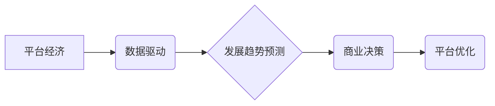

> 平台经济、数据驱动、预测模型、机器学习、趋势分析、数据可视化、商业智能

## 1. 背景介绍

平台经济作为一种新型的经济模式，以其连接用户、提供商和资源的独特优势，迅速崛起并成为全球经济发展的重要驱动力。从出行、餐饮到教育、金融，平台经济已渗透到生活的方方面面。数据作为平台经济的核心资产，蕴藏着丰富的商业价值和发展潜力。

随着平台经济的蓬勃发展，数据量呈指数级增长，如何有效利用数据驱动平台经济发展趋势预测，成为一个亟待解决的关键问题。准确预测平台经济发展趋势，可以帮助平台方制定更精准的商业策略，优化资源配置，提升用户体验，最终实现可持续发展。

## 2. 核心概念与联系

**2.1 平台经济**

平台经济是指通过搭建线上平台，连接用户和提供商，实现资源共享和价值创造的经济模式。平台方通过提供平台服务，从中获取收益，并通过数据分析和算法优化，不断提升平台效率和用户体验。

**2.2 数据驱动**

数据驱动是指以数据为基础，利用数据分析、机器学习等技术，为决策提供依据，从而推动业务发展。在平台经济中，数据驱动是指利用平台产生的海量数据，进行分析和挖掘，以预测用户行为、优化平台运营、开发新产品和服务等。

**2.3 发展趋势预测**

发展趋势预测是指通过分析历史数据、市场趋势和外部环境变化，预测未来一段时间内的发展方向和趋势。在平台经济中，发展趋势预测可以帮助平台方了解用户需求变化、市场竞争格局、政策法规调整等，从而制定更有效的战略规划。

**2.4 核心概念架构**



## 3. 核心算法原理 & 具体操作步骤

**3.1 算法原理概述**

平台经济发展趋势预测主要依赖于机器学习算法，其中常用的算法包括：

* **回归算法:** 用于预测连续型变量，例如用户活跃度、交易额等。
* **分类算法:** 用于预测离散型变量，例如用户流失、用户转化率等。
* **时间序列分析:** 用于预测时间相关数据，例如用户访问量、商品销量等。

**3.2 算法步骤详解**

1. **数据收集和预处理:** 收集平台产生的相关数据，进行清洗、转换和特征工程，构建训练模型的数据集。
2. **模型选择和训练:** 根据预测目标和数据特点，选择合适的机器学习算法，并进行模型训练，调整模型参数，提高预测精度。
3. **模型评估和优化:** 使用测试数据评估模型性能，并根据评估结果进行模型优化，例如调整算法参数、增加特征维度等。
4. **模型部署和监控:** 将训练好的模型部署到生产环境，并进行持续监控，及时更新模型参数，保证预测结果的准确性。

**3.3 算法优缺点**

* **优点:** 能够准确预测平台经济发展趋势，为平台方提供数据支持，帮助制定更有效的策略。
* **缺点:** 需要大量的数据支持，算法模型的构建和训练需要专业技术人员，预测结果受数据质量和模型参数的影响较大。

**3.4 算法应用领域**

* **用户行为预测:** 预测用户注册、登录、消费、流失等行为，帮助平台方优化用户运营策略。
* **市场趋势分析:** 预测市场需求变化、竞争格局、政策法规调整等，帮助平台方制定市场策略。
* **产品开发:** 预测用户需求变化，帮助平台方开发新产品和服务。
* **资源配置:** 预测平台资源需求，帮助平台方优化资源配置，提高运营效率。

## 4. 数学模型和公式 & 详细讲解 & 举例说明

**4.1 数学模型构建**

平台经济发展趋势预测模型通常采用回归模型或分类模型，其数学模型可以表示为：

* **回归模型:**  $y = f(x_1, x_2, ..., x_n) + \epsilon$

其中：

* $y$ 是预测变量，例如用户活跃度、交易额等。
* $x_1, x_2, ..., x_n$ 是输入特征，例如用户年龄、性别、消费习惯等。
* $f$ 是回归函数，例如线性回归、逻辑回归等。
* $\epsilon$ 是误差项。

* **分类模型:** $P(y = c|x) = \frac{e^{w_c \cdot x + b_c}}{\sum_{k=1}^{K} e^{w_k \cdot x + b_k}}$

其中：

* $y$ 是分类变量，例如用户流失、用户转化率等。
* $x$ 是输入特征。
* $w_c$ 和 $b_c$ 是分类器参数。
* $K$ 是类别数。

**4.2 公式推导过程**

回归模型和分类模型的公式推导过程较为复杂，涉及到概率论、统计学和机器学习等多个领域。

**4.3 案例分析与讲解**

假设我们想要预测电商平台用户的购买行为，可以使用回归模型预测用户的购买金额，可以使用分类模型预测用户是否会购买商品。

* **回归模型:** 可以使用用户历史购买记录、浏览记录、购物车信息等特征，预测用户的购买金额。
* **分类模型:** 可以使用用户年龄、性别、职业、兴趣爱好等特征，预测用户是否会购买商品。

## 5. 项目实践：代码实例和详细解释说明

**5.1 开发环境搭建**

* 操作系统: Ubuntu 20.04
* Python 版本: 3.8
* 必要的库: pandas, numpy, scikit-learn, matplotlib

**5.2 源代码详细实现**

```python
import pandas as pd
from sklearn.model_selection import train_test_split
from sklearn.linear_model import LinearRegression
from sklearn.metrics import mean_squared_error

# 加载数据
data = pd.read_csv('user_data.csv')

# 划分训练集和测试集
X = data[['age', 'gender', 'income']]
y = data['purchase_amount']
X_train, X_test, y_train, y_test = train_test_split(X, y, test_size=0.2, random_state=42)

# 创建线性回归模型
model = LinearRegression()

# 训练模型
model.fit(X_train, y_train)

# 预测测试集数据
y_pred = model.predict(X_test)

# 计算模型精度
mse = mean_squared_error(y_test, y_pred)
print(f'Mean Squared Error: {mse}')
```

**5.3 代码解读与分析**

* 代码首先加载用户数据，然后将数据分为特征变量 (X) 和目标变量 (y)。
* 使用 `train_test_split` 函数将数据划分为训练集和测试集。
* 创建线性回归模型，并使用 `fit` 方法训练模型。
* 使用训练好的模型预测测试集数据，并计算模型精度。

**5.4 运行结果展示**

运行代码后，会输出模型的均方误差 (MSE) 值，MSE 值越小，模型精度越高。

## 6. 实际应用场景

**6.1 用户个性化推荐**

根据用户的历史行为数据，预测用户可能感兴趣的商品或服务，提供个性化推荐，提升用户体验和转化率。

**6.2 营销活动优化**

预测用户对不同营销活动的响应程度，优化营销策略，提高营销活动效果。

**6.3 风险控制**

预测用户违约风险、欺诈风险等，帮助平台方进行风险控制，降低损失。

**6.4 未来应用展望**

随着人工智能技术的不断发展，平台经济发展趋势预测将更加精准、高效。未来，平台经济发展趋势预测将应用于更广泛的领域，例如：

* **智能客服:** 利用自然语言处理技术，预测用户问题类型，提供更精准的客服服务。
* **自动驾驶:** 利用机器学习算法，预测道路状况和交通流量，提高自动驾驶系统的安全性。
* **医疗诊断:** 利用深度学习算法，预测疾病风险，辅助医生进行诊断。

## 7. 工具和资源推荐

**7.1 学习资源推荐**

* **书籍:**
    * 《机器学习》 - 周志华
    * 《深度学习》 - Ian Goodfellow
* **在线课程:**
    * Coursera: Machine Learning
    * edX: Artificial Intelligence

**7.2 开发工具推荐**

* **Python:** 
    * scikit-learn: 机器学习库
    * TensorFlow: 深度学习库
    * PyTorch: 深度学习库

**7.3 相关论文推荐**

* **《Recurrent Neural Networks for Sequence Prediction》**
* **《Attention Is All You Need》**
* **《BERT: Pre-training of Deep Bidirectional Transformers for Language Understanding》**

## 8. 总结：未来发展趋势与挑战

**8.1 研究成果总结**

平台经济发展趋势预测的研究取得了显著进展，机器学习算法在预测平台经济发展趋势方面发挥了重要作用。

**8.2 未来发展趋势**

* **模型更加精准:** 随着算法的不断改进和数据量的增加，平台经济发展趋势预测模型将更加精准。
* **应用场景更加广泛:** 平台经济发展趋势预测将应用于更多领域，例如智能客服、自动驾驶、医疗诊断等。
* **数据安全和隐私保护:** 数据安全和隐私保护将成为平台经济发展趋势预测研究的重要课题。

**8.3 面临的挑战**

* **数据质量:** 数据质量直接影响预测模型的精度，需要不断提高数据质量。
* **算法复杂度:** 一些平台经济发展趋势预测模型过于复杂，难以理解和解释。
* **伦理问题:** 平台经济发展趋势预测可能会带来伦理问题，例如算法偏见、数据滥用等。

**8.4 研究展望**

未来，平台经济发展趋势预测研究将继续深入，重点关注以下几个方面:

* **开发更鲁棒、更解释性的算法模型。**
* **探索新的数据来源和数据融合方法。**
* **加强数据安全和隐私保护研究。**
* **探讨平台经济发展趋势预测的伦理问题。**

## 9. 附录：常见问题与解答

**9.1 如何选择合适的平台经济发展趋势预测模型？**

选择合适的平台经济发展趋势预测模型需要根据具体应用场景和数据特点进行选择。例如，如果需要预测连续型变量，可以使用回归模型；如果需要预测离散型变量，可以使用分类模型。

**9.2 如何提高平台经济发展趋势预测模型的精度？**

提高平台经济发展趋势预测模型的精度可以通过以下方法：

* 提高数据质量
* 增加特征维度
* 优化模型参数
* 使用更先进的算法模型

**9.3 平台经济发展趋势预测会带来哪些伦理问题？**

平台经济发展趋势预测可能会带来以下伦理问题：

* **算法偏见:** 算法模型可能会存在偏见，导致预测结果不公平。
* **数据滥用:** 平台方可能会滥用用户数据，侵犯用户隐私。
* **决策透明度:** 算法模型的决策过程可能难以理解，缺乏透明度。


作者：禅与计算机程序设计艺术 / Zen and the Art of Computer Programming 
<end_of_turn>