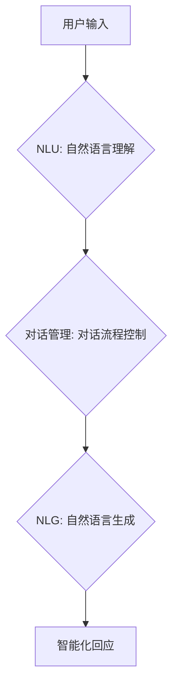

> 智能化回应，CUI，自然语言处理，对话系统，机器学习，用户体验

## 1. 背景介绍

随着人工智能技术的飞速发展，智能化交互方式逐渐成为人们关注的焦点。传统的命令行界面（CLI）和图形用户界面（GUI）模式，由于其操作方式相对僵化，难以满足用户日益增长的个性化需求。因此，基于自然语言的交互方式，即对话式用户界面（CUI），逐渐成为未来交互体验的重要趋势。

CUI的核心在于能够理解用户的自然语言输入，并提供相应的智能化回应。这需要结合自然语言处理（NLP）、机器学习（ML）等多项技术，构建能够进行流畅、自然的对话系统的技术架构。

## 2. 核心概念与联系

CUI的核心概念包括：

* **自然语言理解（NLU）：** 能够理解用户输入的自然语言，将其转换为机器可理解的结构化数据。
* **对话管理（Dialogue Management）：** 负责控制对话流程，根据用户输入和对话上下文，选择合适的回应并进行交互。
* **自然语言生成（NLG）：** 将机器理解的结构化数据转换为自然流畅的文本，作为对用户的回应。

**Mermaid 流程图：**



## 3. 核心算法原理 & 具体操作步骤

### 3.1  算法原理概述

智能化回应的实现主要依赖于机器学习算法，其中包括：

* **词嵌入技术：** 将单词映射到低维向量空间，捕捉单词之间的语义关系。
* **序列标注模型：** 用于识别用户输入中的实体、关系等信息。
* **循环神经网络（RNN）：** 用于处理序列数据，例如文本，能够捕捉文本中的上下文信息。
* **Transformer模型：** 基于注意力机制，能够更有效地捕捉长距离依赖关系，在自然语言处理任务中取得了优异的性能。

### 3.2  算法步骤详解

1. **数据预处理：** 对用户输入数据进行清洗、分词、词性标注等预处理操作，以便后续算法的训练和使用。
2. **特征提取：** 使用词嵌入技术等方法，将文本数据转换为机器可理解的特征向量。
3. **模型训练：** 使用训练数据，训练机器学习模型，例如RNN或Transformer模型，使其能够预测用户输入的意图和期望的回应。
4. **模型评估：** 使用测试数据评估模型的性能，例如准确率、召回率等指标。
5. **模型部署：** 将训练好的模型部署到实际应用环境中，用于处理用户输入并生成智能化回应。

### 3.3  算法优缺点

**优点：**

* 能够理解用户的自然语言输入，提供更人性化的交互体验。
* 可以根据对话上下文进行智能化回应，提供更精准的帮助。
* 可以通过不断学习和训练，不断提升回应的质量。

**缺点：**

* 需要大量的训练数据，训练成本较高。
* 对于复杂或模糊的自然语言输入，模型可能难以理解。
* 模型的回应可能缺乏个性化和情感表达。

### 3.4  算法应用领域

智能化回应技术在多个领域都有广泛的应用，例如：

* **客服机器人：** 自动处理用户咨询，提供快速、高效的客户服务。
* **虚拟助理：** 帮助用户完成日常任务，例如日程安排、信息查询等。
* **教育机器人：** 为学生提供个性化的学习辅导，提高学习效率。
* **游戏交互：** 增强游戏体验，提供更沉浸式的互动方式。

## 4. 数学模型和公式 & 详细讲解 & 举例说明

### 4.1  数学模型构建

智能化回应的数学模型通常基于概率论和统计学，例如：

* **隐马尔可夫模型（HMM）：** 用于建模对话流程，预测用户下一个意图。
* **条件随机场（CRF）：** 用于序列标注任务，例如识别用户输入中的实体和关系。
* **贝叶斯网络：** 用于表示知识和推理关系，例如用户意图与回应之间的关系。

### 4.2  公式推导过程

例如，使用HMM模型建模对话流程，其状态转移概率矩阵为：

$$
P(s_t|s_{t-1})
$$

其中，$s_t$表示对话在时间步$t$的状态，$s_{t-1}$表示对话在时间步$t-1$的状态。

### 4.3  案例分析与讲解

假设一个简单的对话场景：用户输入“今天天气怎么样？”，模型需要预测用户意图和相应的回应。

使用HMM模型，我们可以将对话状态定义为：

* $s_1$: 用户询问天气
* $s_2$: 模型提供天气信息

状态转移概率矩阵可以定义为：

$$
P(s_t|s_{t-1}) = \begin{cases}
P(s_1|s_0) & \text{if } t=1 \\
P(s_2|s_1) & \text{if } t=2
\end{cases}
$$

其中，$P(s_1|s_0)$表示用户从初始状态$s_0$转移到询问天气状态$s_1$的概率，$P(s_2|s_1)$表示模型从询问天气状态$s_1$转移到提供天气信息状态$s_2$的概率。

## 5. 项目实践：代码实例和详细解释说明

### 5.1  开发环境搭建

* Python 3.x
* TensorFlow 或 PyTorch 等深度学习框架
* NLTK、spaCy 等自然语言处理库

### 5.2  源代码详细实现

```python
# 使用TensorFlow构建一个简单的智能化回应模型

import tensorflow as tf

# 定义模型结构
model = tf.keras.Sequential([
    tf.keras.layers.Embedding(input_dim=vocab_size, output_dim=embedding_dim),
    tf.keras.layers.LSTM(units=128),
    tf.keras.layers.Dense(units=vocab_size, activation='softmax')
])

# 编译模型
model.compile(optimizer='adam', loss='sparse_categorical_crossentropy', metrics=['accuracy'])

# 训练模型
model.fit(train_data, train_labels, epochs=10)

# 使用模型生成回应
user_input = "今天天气怎么样？"
response = model.predict(user_input)
```

### 5.3  代码解读与分析

* **Embedding层：** 将单词映射到低维向量空间，捕捉单词之间的语义关系。
* **LSTM层：** 用于处理序列数据，例如文本，能够捕捉文本中的上下文信息。
* **Dense层：** 全连接层，用于预测下一个单词。
* **softmax激活函数：** 将预测结果转换为概率分布，表示每个单词出现的概率。

### 5.4  运行结果展示

模型训练完成后，可以输入用户查询，例如“今天天气怎么样？”，模型会根据训练数据预测相应的回应，例如“今天天气晴朗”。

## 6. 实际应用场景

### 6.1  智能客服机器人

智能客服机器人可以利用智能化回应技术，自动处理用户咨询，例如订单查询、退换货等，提高客服效率，降低人工成本。

### 6.2  虚拟助理

虚拟助理可以帮助用户完成日常任务，例如日程安排、信息查询、天气预报等，解放用户双手，提高生活效率。

### 6.3  教育机器人

教育机器人可以为学生提供个性化的学习辅导，例如讲解知识点、解答问题、进行练习等，提高学生的学习兴趣和效率。

### 6.4  未来应用展望

随着人工智能技术的不断发展，智能化回应技术将在更多领域得到应用，例如：

* **医疗保健：** 智能化问诊系统，辅助医生诊断疾病。
* **金融服务：** 智能化理财顾问，提供个性化的投资建议。
* **娱乐休闲：** 智能化游戏角色，提供更沉浸式的游戏体验。

## 7. 工具和资源推荐

### 7.1  学习资源推荐

* **书籍：**
    * 《深度学习》
    * 《自然语言处理》
* **在线课程：**
    * Coursera
    * edX
    * Udacity

### 7.2  开发工具推荐

* **TensorFlow:** 开源深度学习框架
* **PyTorch:** 开源深度学习框架
* **NLTK:** 自然语言处理库
* **spaCy:** 自然语言处理库

### 7.3  相关论文推荐

* **BERT: Pre-training of Deep Bidirectional Transformers for Language Understanding**
* **GPT-3: Language Models are Few-Shot Learners**
* **XLNet: Generalized Autoregressive Pretraining for Language Understanding**

## 8. 总结：未来发展趋势与挑战

### 8.1  研究成果总结

智能化回应技术取得了显著的进展，能够理解和生成更自然、更流畅的文本。

### 8.2  未来发展趋势

* **更强大的模型：** 发展更强大的深度学习模型，例如Transformer模型的升级版，能够处理更复杂、更长文本。
* **更个性化的回应：** 基于用户行为和偏好，提供更个性化的智能化回应。
* **多模态交互：** 将文本、语音、图像等多模态信息融合，实现更丰富的交互体验。

### 8.3  面临的挑战

* **数据获取和标注：** 训练智能化回应模型需要大量的标注数据，数据获取和标注成本较高。
* **模型解释性和可信度：** 深度学习模型的决策过程难以解释，如何提高模型的解释性和可信度是一个挑战。
* **伦理和安全问题：** 智能化回应技术可能存在伦理和安全问题，例如数据隐私泄露、恶意攻击等，需要加强相关研究和监管。

### 8.4  研究展望

未来，智能化回应技术将继续朝着更智能、更人性化、更安全的方向发展，为人们的生活和工作带来更多便利和价值。

## 9. 附录：常见问题与解答

* **Q：如何训练智能化回应模型？**

* **A：** 需要准备大量的文本数据，并使用深度学习框架进行模型训练。

* **Q：如何评估智能化回应模型的性能？**

* **A：** 可以使用准确率、召回率等指标进行评估。

* **Q：智能化回应模型有哪些应用场景？**

* **A：** 智能客服机器人、虚拟助理、教育机器人等。


作者：禅与计算机程序设计艺术 / Zen and the Art of Computer Programming 
<end_of_turn>