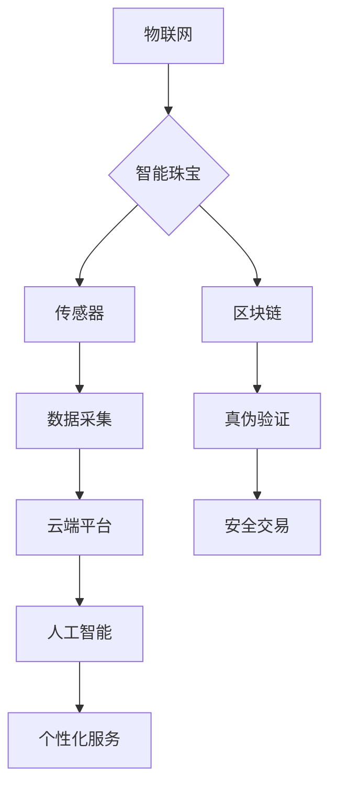

> 智能珠宝，物联网，区块链，人工智能，奢侈品，个性化定制，数据安全，用户体验

## 1. 背景介绍

珠宝一直以来都是人类文明中重要的文化符号，代表着财富、地位和身份。随着科技的飞速发展，智能珠宝应运而生，将传统珠宝与先进科技相结合，赋予珠宝全新的功能和价值。智能珠宝不仅具备美观的外形，更融合了物联网、人工智能、区块链等前沿技术，为用户提供个性化定制、安全保障、互动体验等多重价值。

智能珠宝的兴起，标志着科技与奢侈品的一次深度融合。它不仅改变了人们对珠宝的认知，也为珠宝行业带来了新的发展机遇。

## 2. 核心概念与联系

智能珠宝的核心概念包括：

* **物联网 (IoT):** 智能珠宝通过传感器和网络连接，可以收集佩戴者的健康数据、位置信息、环境数据等，并与云端进行数据交互。
* **人工智能 (AI):**  人工智能算法可以分析收集到的数据，为用户提供个性化的服务，例如健康监测、运动指导、情感分析等。
* **区块链 (Blockchain):** 区块链技术可以保障珠宝的真伪性和可追溯性，为用户提供安全可靠的交易保障。

**核心概念架构图:**



## 3. 核心算法原理 & 具体操作步骤

### 3.1  算法原理概述

智能珠宝的核心算法主要包括数据采集、数据分析、个性化服务和安全保障等方面。

* **数据采集算法:**  利用传感器收集佩戴者的生理数据、环境数据等，并进行数据预处理和格式转换。
* **数据分析算法:**  采用机器学习、深度学习等算法对收集到的数据进行分析，识别佩戴者的健康状况、情绪状态、行为模式等。
* **个性化服务算法:**  根据数据分析结果，为用户提供个性化的健康建议、运动指导、情感支持等服务。
* **安全保障算法:**  利用区块链技术对珠宝的真伪性进行验证，保障交易安全。

### 3.2  算法步骤详解

**数据采集算法步骤:**

1.  **传感器数据获取:**  智能珠宝内置多种传感器，例如心率传感器、温度传感器、加速度传感器等，收集佩戴者的生理数据和环境数据。
2.  **数据预处理:**  对采集到的原始数据进行清洗、去噪、格式转换等处理，去除无效数据，提高数据质量。
3.  **数据格式转换:**  将预处理后的数据转换为适合云端平台处理的格式，例如JSON、CSV等。

**数据分析算法步骤:**

1.  **数据上传:**  经过格式转换的数据被上传到云端平台。
2.  **数据存储:**  云端平台将数据存储在数据库中，并进行数据备份和安全保护。
3.  **数据分析:**  利用机器学习、深度学习等算法对数据进行分析，识别佩戴者的健康状况、情绪状态、行为模式等。

**个性化服务算法步骤:**

1.  **分析结果输出:**  数据分析算法输出分析结果，例如佩戴者的心率异常、情绪低落等。
2.  **个性化服务推荐:**  根据分析结果，为用户提供个性化的健康建议、运动指导、情感支持等服务。
3.  **服务反馈:**  用户可以对服务进行反馈，帮助算法模型不断优化和改进。

### 3.3  算法优缺点

**优点:**

* **个性化定制:**  智能珠宝可以根据用户的需求和喜好进行个性化定制，例如材质、款式、功能等。
* **健康监测:**  智能珠宝可以监测佩戴者的健康数据，例如心率、睡眠、血压等，帮助用户了解自己的健康状况。
* **安全保障:**  区块链技术可以保障珠宝的真伪性和可追溯性，防止假冒伪劣产品。
* **互动体验:**  智能珠宝可以与手机、智能手表等设备进行连接，提供丰富的互动体验。

**缺点:**

* **技术复杂性:**  智能珠宝的开发需要整合多种先进技术，技术难度较高。
* **成本高昂:**  智能珠宝的生产成本较高，价格相对昂贵。
* **数据安全:**  智能珠宝收集用户的个人数据，需要加强数据安全保护。
* **用户接受度:**  部分用户对智能珠宝的接受度较低，需要进行有效的宣传推广。

### 3.4  算法应用领域

智能珠宝的应用领域非常广泛，包括：

* **奢侈品行业:**  为高端珠宝品牌提供个性化定制、安全保障和互动体验。
* **医疗健康行业:**  用于健康监测、疾病预防和康复治疗。
* **时尚潮流行业:**  作为时尚配饰，展现个性和潮流。
* **教育科研行业:**  用于数据采集、分析和研究。

## 4. 数学模型和公式 & 详细讲解 & 举例说明

### 4.1  数学模型构建

智能珠宝的算法模型通常基于机器学习和深度学习，例如回归模型、分类模型、聚类模型等。

**回归模型:** 用于预测连续数值，例如佩戴者的心率、体温等。

**分类模型:** 用于分类数据，例如识别佩戴者的情绪状态、健康状况等。

**聚类模型:** 用于将数据进行分组，例如根据佩戴者的行为模式进行用户画像。

### 4.2  公式推导过程

机器学习和深度学习算法的推导过程非常复杂，涉及大量的数学公式和概率论知识。

**举例说明:**

**线性回归模型:**

$$
y = \theta_0 + \theta_1 x_1 + \theta_2 x_2 + ... + \theta_n x_n + \epsilon
$$

其中:

* $y$ 是预测值
* $\theta_0, \theta_1, ..., \theta_n$ 是模型参数
* $x_1, x_2, ..., x_n$ 是输入特征
* $\epsilon$ 是误差项

### 4.3  案例分析与讲解

**案例:**

利用机器学习算法对智能珠宝收集到的心率数据进行分析，预测佩戴者的睡眠质量。

**分析:**

1.  收集佩戴者在不同睡眠状态下的心率数据。
2.  将数据进行预处理和特征提取。
3.  选择合适的机器学习算法，例如支持向量机 (SVM) 或随机森林 (RF)。
4.  训练模型，并评估模型的预测精度。

**讲解:**

通过训练模型，可以建立一个心率与睡眠质量之间的映射关系。当佩戴者佩戴智能珠宝时，算法可以根据其心率数据预测其睡眠质量。

## 5. 项目实践：代码实例和详细解释说明

### 5.1  开发环境搭建

智能珠宝的开发环境通常包括：

* **硬件平台:**  智能珠宝本身，例如手表、戒指等。
* **软件平台:**  云端平台、开发工具、数据分析工具等。

**示例:**

使用Arduino开发板作为硬件平台，使用Python语言进行软件开发，并利用AWS云平台进行数据存储和分析。

### 5.2  源代码详细实现

```python
# 数据采集代码示例

import time
import Adafruit_Sensor

# 定义传感器类型
sensor = Adafruit_Sensor.Sensor()

# 获取传感器数据
while True:
    data = sensor.read()
    print(data)
    time.sleep(1)
```

### 5.3  代码解读与分析

* **导入库:**  导入必要的库函数，例如Adafruit_Sensor库用于控制传感器。
* **定义传感器:**  定义传感器类型，例如心率传感器。
* **获取数据:**  使用传感器读取数据，并打印到控制台。
* **循环执行:**  使用循环语句不断读取传感器数据。

### 5.4  运行结果展示

运行代码后，控制台将显示传感器采集到的数据，例如心率、温度等。

## 6. 实际应用场景

### 6.1  奢侈品行业

智能珠宝可以为高端珠宝品牌提供个性化定制、安全保障和互动体验。例如，用户可以定制珠宝的材质、款式、功能等，并通过区块链技术验证珠宝的真伪性。

### 6.2  医疗健康行业

智能珠宝可以用于健康监测、疾病预防和康复治疗。例如，智能戒指可以监测佩戴者的心率、血压、睡眠等数据，并提供健康建议。

### 6.3  时尚潮流行业

智能珠宝可以作为时尚配饰，展现个性和潮流。例如，智能项链可以根据用户的音乐喜好改变颜色或闪烁频率。

### 6.4  未来应用展望

智能珠宝的未来应用前景广阔，例如：

* **虚拟现实 (VR) 和增强现实 (AR) 融合:**  智能珠宝可以与VR/AR设备结合，提供更加沉浸式的体验。
* **人工智能 (AI) 赋能:**  人工智能算法可以进一步提升智能珠宝的功能，例如更精准的健康监测、更个性化的服务。
* **可穿戴设备生态系统:**  智能珠宝可以与其他可穿戴设备进行互联互通，构建更加完善的健康管理和生活服务生态系统。

## 7. 工具和资源推荐

### 7.1  学习资源推荐

* **在线课程:**  Coursera、edX、Udacity等平台提供机器学习、深度学习等相关课程。
* **书籍:**  《深度学习》、《机器学习实战》等书籍可以帮助读者深入了解相关知识。
* **开源项目:**  TensorFlow、PyTorch等开源项目可以帮助读者实践机器学习和深度学习算法。

### 7.2  开发工具推荐

* **Arduino IDE:**  用于开发基于Arduino开发板的智能珠宝。
* **Python:**  用于开发智能珠宝的软件逻辑和数据分析。
* **AWS Cloud:**  用于存储和分析智能珠宝收集到的数据。

### 7.3  相关论文推荐

* **"Smart Jewelry: A Survey"**
* **"Blockchain-Based Authentication for Luxury Goods"**
* **"Wearable Sensors for Health Monitoring"**

## 8. 总结：未来发展趋势与挑战

### 8.1  研究成果总结

智能珠宝的研发取得了显著成果，在健康监测、安全保障、个性化定制等方面展现出巨大的潜力。

### 8.2  未来发展趋势

智能珠宝将朝着更加智能化、个性化、安全化的方向发展，例如：

* **更强大的人工智能:**  人工智能算法将更加智能化，能够提供更精准的健康监测、更个性化的服务。
* **更丰富的功能:**  智能珠宝将具备更多功能，例如支付、身份验证、娱乐等。
* **更安全的保障:**  区块链技术将进一步加强智能珠宝的安全保障，防止假冒伪劣产品。

### 8.3  面临的挑战

智能珠宝的发展也面临着一些挑战，例如：

* **技术复杂性:**  智能珠宝的开发需要整合多种先进技术，技术难度较高。
* **成本高昂:**  智能珠宝的生产成本较高，价格相对昂贵。
* **数据安全:**  智能珠宝收集用户的个人数据，需要加强数据安全保护。
* **用户接受度:**  部分用户对智能珠宝的接受度较低，需要进行有效的宣传推广。

### 8.4  研究展望

未来，我们将继续致力于智能珠宝的研发，探索其在更多领域的应用，为用户提供更加智能、便捷、安全的生活体验。

## 9. 附录：常见问题与解答

**常见问题:**

* **智能珠宝的安全性如何保障？**

**解答:**  智能珠宝采用区块链技术进行数据加密和存储，并使用生物识别技术进行身份验证，确保数据的安全性和隐私性。

* **智能珠宝的电池续航时间如何？**

**解答:**  智能珠宝的电池续航时间取决于其功能和使用频率，一般情况下可以持续使用几天到几周。

* **智能珠宝的维修保养如何进行？**