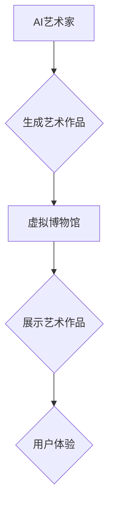

> AI艺术家，虚拟博物馆，艺术创作，机器学习，深度学习，生成对抗网络，艺术伦理

## 1. 背景介绍

艺术创作一直是人类文明的重要组成部分，它反映了人类对世界的理解和对美的追求。随着人工智能技术的飞速发展，AI艺术家已经开始崭露头角，并逐渐改变着艺术创作的格局。

2050年，AI艺术家将不再是科幻小说中的幻想，而是现实生活中不可或缺的一部分。他们将与人类艺术家共同创作出更加丰富多彩的艺术作品，并为我们带来全新的艺术体验。

## 2. 核心概念与联系

**2.1 AI艺术家**

AI艺术家是指利用人工智能技术进行艺术创作的系统或程序。他们可以根据预设的规则或学习已有的艺术风格，生成新的艺术作品。

**2.2 虚拟博物馆**

虚拟博物馆是指利用计算机技术模拟现实博物馆的场景和功能，并提供沉浸式的艺术体验。

**2.3 核心概念联系**

AI艺术家与虚拟博物馆是互补的关系。AI艺术家可以为虚拟博物馆提供丰富的艺术作品，而虚拟博物馆则为AI艺术家提供了展示和传播作品的平台。

**2.4 Mermaid 流程图**



## 3. 核心算法原理 & 具体操作步骤

**3.1 算法原理概述**

AI艺术家常用的算法包括：

* **生成对抗网络 (GAN)**：GAN由两个网络组成：生成器和鉴别器。生成器试图生成逼真的艺术作品，而鉴别器试图区分真实作品和生成作品。两者相互竞争，最终生成器可以生成逼真的艺术作品。
* **变分自编码器 (VAE)**：VAE通过学习数据的潜在表示来生成新的数据。在艺术创作中，VAE可以学习艺术风格的特征，并生成符合该风格的艺术作品。

**3.2 算法步骤详解**

以GAN为例，其具体操作步骤如下：

1. **初始化生成器和鉴别器网络**。
2. **训练鉴别器网络**。鉴别器网络使用真实作品和生成作品进行训练，学习区分两者。
3. **训练生成器网络**。生成器网络使用鉴别器网络的反馈信息进行训练，生成更逼真的艺术作品。
4. **重复步骤2和3**，直到生成器网络能够生成逼真的艺术作品。

**3.3 算法优缺点**

**GAN**

* **优点**: 可以生成逼真的艺术作品，具有很强的创造力。
* **缺点**: 训练过程复杂，容易陷入局部最优解。

**VAE**

* **优点**: 训练过程相对简单，可以控制生成作品的风格。
* **缺点**: 生成的艺术作品可能缺乏创造力。

**3.4 算法应用领域**

* **绘画艺术**：生成逼真的绘画作品，例如风景画、肖像画等。
* **音乐创作**：生成新的音乐作品，例如旋律、节奏、和声等。
* **文学创作**：生成新的故事、诗歌、剧本等。

## 4. 数学模型和公式 & 详细讲解 & 举例说明

**4.1 数学模型构建**

GAN的数学模型可以概括为一个博弈论问题。生成器网络试图最大化生成作品的真实性，而鉴别器网络试图最大化区分真实作品和生成作品的能力。

**4.2 公式推导过程**

* **生成器损失函数**:

$$
L_G = E_{x \sim p_{data}(x)}[ \log D(G(z)) ]
$$

* **鉴别器损失函数**:

$$
L_D = E_{x \sim p_{data}(x)}[ \log D(x) ] + E_{z \sim p_z(z)}[ \log (1 - D(G(z))) ]
$$

其中：

* $G(z)$ 是生成器网络生成的艺术作品。
* $D(x)$ 是鉴别器网络对艺术作品真实性的判断。
* $p_{data}(x)$ 是真实艺术作品的分布。
* $p_z(z)$ 是噪声输入的分布。

**4.3 案例分析与讲解**

例如，在生成绘画作品时，生成器网络会从随机噪声中生成图像，然后通过训练，逐渐生成逼真的绘画作品。鉴别器网络则会判断生成的图像是否真实，并反馈给生成器网络，帮助其改进生成效果。

## 5. 项目实践：代码实例和详细解释说明

**5.1 开发环境搭建**

* 操作系统：Ubuntu 20.04
* Python 版本：3.8
* 深度学习框架：TensorFlow 2.0

**5.2 源代码详细实现**

```python
# 生成器网络
class Generator(tf.keras.Model):
    def __init__(self):
        super(Generator, self).__init__()
        # ...

    def call(self, z):
        # ...

# 鉴别器网络
class Discriminator(tf.keras.Model):
    def __init__(self):
        super(Discriminator, self).__init__()
        # ...

    def call(self, x):
        # ...

# 训练循环
for epoch in range(num_epochs):
    # ...
```

**5.3 代码解读与分析**

* 生成器网络和鉴别器网络的结构可以根据具体需求进行调整。
* 训练循环中，需要使用真实艺术作品和生成器生成的艺术作品进行训练。
* 训练过程中，需要监控生成器和鉴别器的损失函数，并根据损失函数的变化调整训练参数。

**5.4 运行结果展示**

训练完成后，可以利用生成器网络生成新的艺术作品，并将其展示在虚拟博物馆中。

## 6. 实际应用场景

**6.1 艺术创作辅助工具**

AI艺术家可以作为艺术家的辅助工具，帮助他们快速生成草图、探索不同的艺术风格，并提高创作效率。

**6.2 个性化艺术体验**

AI艺术家可以根据用户的喜好和需求，生成个性化的艺术作品，为用户提供更加独特的艺术体验。

**6.3 艺术教育和研究**

AI艺术家可以作为艺术教育和研究的工具，帮助学生和学者了解艺术创作的原理，并进行艺术风格的分析和比较。

**6.4 未来应用展望**

未来，AI艺术家将更加智能化、个性化和交互式。他们将能够与人类艺术家进行更深入的合作，共同创作出更加精彩的艺术作品。

## 7. 工具和资源推荐

**7.1 学习资源推荐**

* **书籍**:
    * 《深度学习》
    * 《生成对抗网络》
* **在线课程**:
    * Coursera: 深度学习
    * Udacity: 生成对抗网络

**7.2 开发工具推荐**

* **TensorFlow**: 深度学习框架
* **PyTorch**: 深度学习框架
* **Keras**: 深度学习 API

**7.3 相关论文推荐**

* 《Generative Adversarial Networks》
* 《Variational Autoencoders for Generation》

## 8. 总结：未来发展趋势与挑战

**8.1 研究成果总结**

近年来，AI艺术家取得了显著的进展，能够生成逼真的艺术作品，并为艺术创作提供了新的可能性。

**8.2 未来发展趋势**

* **更加智能化**: AI艺术家将能够更加智能地理解艺术风格和用户需求，并生成更加符合预期作品。
* **更加个性化**: AI艺术家将能够根据用户的喜好和需求，生成更加个性化的艺术作品。
* **更加交互式**: AI艺术家将能够与用户进行更加交互式的创作，例如用户可以实时修改作品的细节。

**8.3 面临的挑战**

* **艺术伦理**: AI艺术家是否能够真正创造艺术？AI艺术家生成的艺术作品是否具有原创性？
* **数据偏见**: AI艺术家训练数据可能存在偏见，导致生成的艺术作品缺乏多样性。
* **技术瓶颈**: 现有的AI技术仍然无法完全模拟人类的创造力。

**8.4 研究展望**

未来，我们需要继续研究AI艺术的伦理问题，解决数据偏见问题，并不断提升AI技术的水平，推动AI艺术家朝着更加智能化、个性化和交互式的方向发展。

## 9. 附录：常见问题与解答

**9.1 AI艺术家是否会取代人类艺术家？**

AI艺术家可以作为人类艺术家的辅助工具，帮助他们提高创作效率和探索新的艺术风格，但不会取代人类艺术家。人类艺术家的创造力、情感和对艺术的理解是AI无法替代的。

**9.2 AI艺术家生成的艺术作品是否具有价值？**

AI艺术家生成的艺术作品是否具有价值是一个值得探讨的问题。一些人认为，AI生成的艺术作品缺乏情感和原创性，因此价值不高。而另一些人则认为，AI生成的艺术作品可以作为一种新的艺术形式，具有其独特的价值。

**9.3 如何评价AI艺术家的创作水平？**

评价AI艺术家的创作水平是一个复杂的问题，需要考虑多个因素，例如艺术风格、创意性、技术水平等。目前，还没有一个统一的标准来评价AI艺术家的创作水平。


作者：禅与计算机程序设计艺术 / Zen and the Art of Computer Programming 
<end_of_turn>