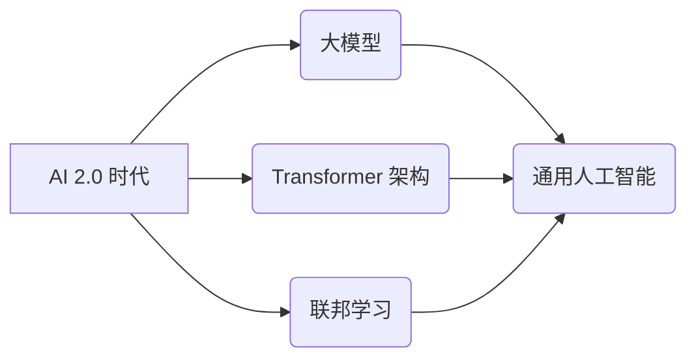

> 人工智能，深度学习，Transformer，大模型，通用人工智能，AI 2.0，应用场景，未来趋势

## 1. 背景介绍

人工智能（AI）技术近年来发展迅速，从语音识别、图像识别到自然语言处理等领域取得了突破性进展。其中，深度学习作为人工智能的核心技术之一，推动了AI技术的飞速发展。然而，深度学习模型的训练成本高、数据依赖性强、可解释性差等问题仍然制约着AI技术的进一步发展。

李开复先生在《AI 2.0 时代的机遇》一文中指出，我们正处于人工智能的第二个黄金时代，即AI 2.0时代。在这个时代，大模型、Transformer架构、联邦学习等新技术将推动人工智能技术迈向更广阔的应用领域，并解决深度学习模型的现有问题。

## 2. 核心概念与联系

**2.1 AI 2.0 时代**

AI 2.0时代是指从传统深度学习模型向更强大、更通用的人工智能模型演进的时代。

**2.2 大模型**

大模型是指参数量巨大、训练数据海量的人工智能模型。大模型具有强大的泛化能力和学习能力，能够在多个领域进行跨模态的学习和应用。

**2.3 Transformer 架构**

Transformer架构是一种新型的神经网络架构，它通过自注意力机制能够捕捉序列数据中的长距离依赖关系，在自然语言处理、机器翻译等领域取得了显著的成果。

**2.4 联邦学习**

联邦学习是一种分布式机器学习方法，它允许模型在不共享原始数据的情况下进行训练，从而保护用户隐私和数据安全。

**2.5 通用人工智能 (AGI)**

通用人工智能是指能够像人类一样进行思考、学习和解决问题的智能系统。

**2.6  AI 2.0 时代核心概念关系图**



## 3. 核心算法原理 & 具体操作步骤

### 3.1  算法原理概述

Transformer架构的核心是自注意力机制，它能够捕捉序列数据中的长距离依赖关系。自注意力机制通过计算每个词与所有其他词之间的相关性，并赋予每个词不同的权重，从而学习到词语之间的语义关系。

### 3.2  算法步骤详解

1. **输入嵌入:** 将输入序列中的每个词转换为向量表示。
2. **多头自注意力:** 对输入序列中的每个词进行多头自注意力计算，得到每个词与所有其他词之间的相关性。
3. **前馈神经网络:** 对每个词的注意力输出进行前馈神经网络处理，得到每个词的更新表示。
4. **位置编码:** 将位置信息编码到词向量中，以便模型能够理解词语在序列中的位置关系。
5. **堆叠 Transformer 层:** 将多个 Transformer 层堆叠在一起，以进一步学习深层语义信息。
6. **输出层:** 将 Transformer 的输出进行分类或生成任务所需的处理。

### 3.3  算法优缺点

**优点:**

* 能够捕捉长距离依赖关系。
* 并行计算能力强。
* 在自然语言处理任务中取得了优异的性能。

**缺点:**

* 计算复杂度高。
* 训练数据量大。
* 可解释性差。

### 3.4  算法应用领域

Transformer架构在自然语言处理领域得到了广泛应用，例如：

* 机器翻译
* 文本摘要
* 问答系统
* 情感分析
* 代码生成

## 4. 数学模型和公式 & 详细讲解 & 举例说明

### 4.1  数学模型构建

Transformer架构的数学模型主要包括以下几个部分：

* **嵌入层:** 将输入词转换为向量表示。
* **自注意力层:** 计算每个词与所有其他词之间的相关性。
* **前馈神经网络层:** 对每个词的注意力输出进行处理。
* **位置编码层:** 将位置信息编码到词向量中。

### 4.2  公式推导过程

**4.2.1 自注意力机制公式**

```latex
Attention(Q, K, V) = softmax(\frac{QK^T}{\sqrt{d_k}})V
```

其中：

* Q: 查询矩阵
* K: 键矩阵
* V: 值矩阵
* $d_k$: 键向量的维度
* softmax: 归一化函数

**4.2.2 多头自注意力机制公式**

```latex
MultiHeadAttention(Q, K, V) = Concat(head_1, head_2, ..., head_h)W^O
```

其中：

* head_1, head_2, ..., head_h: h 个多头自注意力头的输出
* $W^O$: 输出线性变换矩阵

### 4.3  案例分析与讲解

假设我们有一个句子 "The cat sat on the mat"，我们使用 Transformer 架构进行编码，可以得到每个词的隐藏表示。通过观察这些隐藏表示，我们可以发现，"cat" 和 "sat" 之间存在语义关系，"on" 和 "mat" 之间也存在语义关系。

## 5. 项目实践：代码实例和详细解释说明

### 5.1  开发环境搭建

* Python 3.7+
* PyTorch 1.7+
* CUDA 10.2+

### 5.2  源代码详细实现

```python
import torch
import torch.nn as nn

class Transformer(nn.Module):
    def __init__(self, vocab_size, embedding_dim, num_heads, num_layers):
        super(Transformer, self).__init__()
        self.embedding = nn.Embedding(vocab_size, embedding_dim)
        self.transformer_layers = nn.ModuleList([
            nn.TransformerEncoderLayer(embedding_dim, num_heads)
            for _ in range(num_layers)
        ])
        self.linear = nn.Linear(embedding_dim, vocab_size)

    def forward(self, x):
        x = self.embedding(x)
        for layer in self.transformer_layers:
            x = layer(x)
        x = self.linear(x)
        return x
```

### 5.3  代码解读与分析

* `__init__` 方法初始化模型参数，包括词嵌入层、Transformer层和输出层。
* `forward` 方法定义模型的正向传播过程，将输入序列转换为输出序列。

### 5.4  运行结果展示

通过训练 Transformer 模型，我们可以实现机器翻译、文本摘要等自然语言处理任务。

## 6. 实际应用场景

### 6.1  机器翻译

Transformer架构在机器翻译领域取得了突破性进展，例如 Google 的 Transformer 模型在 WMT 比赛中取得了最佳成绩。

### 6.2  文本摘要

Transformer模型能够自动生成文本摘要，例如 Facebook 的 BART 模型能够生成高质量的新闻摘要。

### 6.3  问答系统

Transformer模型能够理解自然语言问题，并从文本中找到答案，例如 Google 的 BERT 模型在问答系统中取得了优异的性能。

### 6.4  未来应用展望

AI 2.0 时代，Transformer架构将应用于更多领域，例如：

* 代码生成
* 图像生成
* 视频理解
* 药物研发

## 7. 工具和资源推荐

### 7.1  学习资源推荐

* **书籍:**
    * 《深度学习》
    * 《Transformer 详解》
* **在线课程:**
    * Coursera: 深度学习
    * fast.ai: 深度学习课程
* **博客:**
    * Jay Alammar's Blog: Transformer 架构详解
    * The Gradient: AI 2.0 时代

### 7.2  开发工具推荐

* **PyTorch:** 深度学习框架
* **TensorFlow:** 深度学习框架
* **Hugging Face:** 预训练模型库

### 7.3  相关论文推荐

* Attention Is All You Need
* BERT: Pre-training of Deep Bidirectional Transformers for Language Understanding
* GPT-3: Language Models are Few-Shot Learners

## 8. 总结：未来发展趋势与挑战

### 8.1  研究成果总结

AI 2.0时代，大模型、Transformer架构、联邦学习等新技术推动了人工智能技术的发展，取得了显著成果。

### 8.2  未来发展趋势

* 模型规模进一步扩大
* 模型训练效率提升
* 模型可解释性增强
* 模型应用场景拓展

### 8.3  面临的挑战

* 数据安全和隐私保护
* 模型偏见和公平性
* 模型安全性与可控性
* 人工智能伦理问题

### 8.4  研究展望

未来，人工智能研究将继续探索更强大、更通用的人工智能模型，并解决现有技术面临的挑战，推动人工智能技术更好地服务于人类社会。

## 9. 附录：常见问题与解答

**Q1: Transformer 架构的优势是什么？**

**A1:** Transformer 架构能够捕捉长距离依赖关系，并行计算能力强，在自然语言处理任务中取得了优异的性能。

**Q2: 大模型的训练成本高吗？**

**A2:** 是的，大模型的训练成本很高，需要大量的计算资源和训练数据。

**Q3: 联邦学习如何保护用户隐私？**

**A3:** 联邦学习允许模型在不共享原始数据的情况下进行训练，从而保护用户隐私和数据安全。


作者：禅与计算机程序设计艺术 / Zen and the Art of Computer Programming 
<end_of_turn>