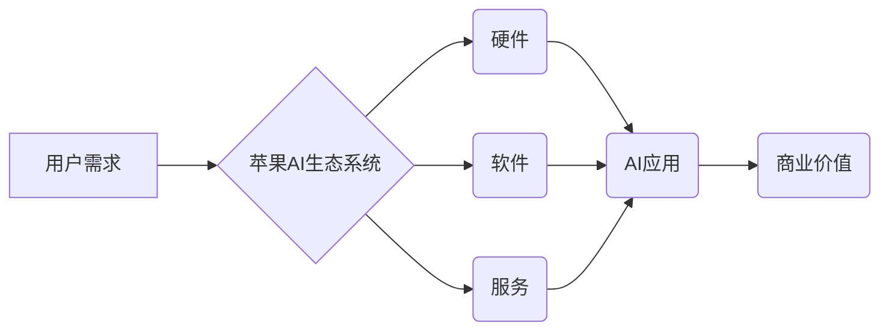

> 苹果, AI, 商业价值, 应用场景, 发展趋势, 挑战

## 1. 背景介绍

近年来，人工智能（AI）技术飞速发展，已渗透到生活的方方面面。从智能手机的语音助手到自动驾驶汽车，AI正在改变着我们的生活方式。作为科技巨头，苹果也积极布局AI领域，并将其融入到其产品和服务中。

2023年，苹果发布了一系列搭载AI技术的应用，引发了业界和消费者的广泛关注。这些应用涵盖了多个领域，例如健康医疗、教育娱乐、生活服务等，展现了AI技术在商业领域的巨大潜力。

## 2. 核心概念与联系

**2.1 AI应用的商业价值**

AI技术的商业价值主要体现在以下几个方面：

* **提高效率和生产力:** AI可以自动化重复性任务，解放人力资源，提高工作效率和生产力。
* **个性化体验:** AI可以根据用户的行为和偏好，提供个性化的产品和服务，提升用户体验。
* **数据分析和洞察:** AI可以分析海量数据，挖掘隐藏的价值，帮助企业做出更明智的决策。
* **创新产品和服务:** AI可以推动技术创新，开发出全新的产品和服务，满足用户不断变化的需求。

**2.2 苹果AI生态系统**

苹果构建了一个完整的AI生态系统，包括硬件、软件和服务。

* **硬件:** 苹果的芯片（例如A系列芯片）拥有强大的计算能力，为AI应用提供硬件基础。
* **软件:** 苹果的iOS和macOS操作系统都内置了AI功能，例如语音识别、图像识别、机器翻译等。
* **服务:** 苹果提供了一系列AI服务，例如Siri语音助手、iCloud照片识别、Apple Music个性化推荐等。

**2.3  AI应用的商业模式**

苹果的AI应用采用多种商业模式，例如：

* **订阅服务:** 例如Apple Music、Apple TV+等，用户需要付费订阅才能使用。
* **增值服务:** 例如iCloud存储空间、AppleCare延长保修等，用户可以根据需要付费购买。
* **数据驱动:** 苹果通过收集用户数据，分析用户行为，为企业提供精准的广告投放和营销服务。

**Mermaid 流程图**



## 3. 核心算法原理 & 具体操作步骤

**3.1 算法原理概述**

苹果在AI应用中广泛使用深度学习算法，例如卷积神经网络（CNN）、循环神经网络（RNN）等。这些算法能够从海量数据中学习特征，并进行预测或分类。

**3.2 算法步骤详解**

深度学习算法的训练过程通常包括以下步骤：

1. **数据预处理:** 将原始数据进行清洗、转换、格式化等操作，使其适合深度学习模型的训练。
2. **模型构建:** 根据具体的应用场景，选择合适的深度学习模型架构，并设置模型参数。
3. **模型训练:** 使用训练数据，通过反向传播算法，调整模型参数，使模型的预测或分类性能达到最佳。
4. **模型评估:** 使用测试数据，评估模型的性能，例如准确率、召回率、F1-score等。
5. **模型部署:** 将训练好的模型部署到实际应用场景中，用于进行预测或分类。

**3.3 算法优缺点**

**优点:**

* **高精度:** 深度学习算法能够学习到复杂的特征，从而实现高精度的预测或分类。
* **自动化学习:** 深度学习算法能够自动学习数据中的特征，无需人工特征工程。
* **泛化能力强:** 深度学习模型能够泛化到新的数据，具有较强的推广能力。

**缺点:**

* **数据依赖:** 深度学习算法需要大量的训练数据，否则模型性能会下降。
* **计算资源消耗:** 深度学习模型训练需要大量的计算资源，训练时间较长。
* **可解释性差:** 深度学习模型的决策过程较为复杂，难以解释模型的决策结果。

**3.4 算法应用领域**

深度学习算法在各个领域都有广泛的应用，例如：

* **图像识别:** 人脸识别、物体检测、图像分类等。
* **语音识别:** 语音转文本、语音助手等。
* **自然语言处理:** 机器翻译、文本摘要、情感分析等。
* **推荐系统:** 产品推荐、内容推荐等。
* **医疗诊断:** 病情预测、疾病诊断等。

## 4. 数学模型和公式 & 详细讲解 & 举例说明

**4.1 数学模型构建**

深度学习模型通常由多个神经网络层组成，每一层都包含多个神经元。每个神经元接收来自上一层的输入信号，并通过激活函数进行处理，输出到下一层。

**4.2 公式推导过程**

深度学习模型的训练过程基于梯度下降算法。梯度下降算法的目标是找到模型参数，使得模型的损失函数最小化。损失函数衡量模型预测结果与真实结果之间的差异。

**损失函数:**

$$L = \frac{1}{N} \sum_{i=1}^{N} loss(y_i, \hat{y}_i)$$

其中：

* $L$ 是损失函数
* $N$ 是样本数量
* $y_i$ 是真实标签
* $\hat{y}_i$ 是模型预测结果

**梯度下降算法:**

$$\theta = \theta - \alpha \nabla L(\theta)$$

其中：

* $\theta$ 是模型参数
* $\alpha$ 是学习率
* $\nabla L(\theta)$ 是损失函数对模型参数的梯度

**4.3 案例分析与讲解**

例如，在图像分类任务中，深度学习模型可以学习到图像特征，并将其映射到不同的类别。模型的输出是一个概率分布，表示图像属于不同类别的概率。

**举例说明:**

假设一个深度学习模型用于分类猫和狗的图像。模型的输出是一个概率分布，例如：

* 猫的概率为0.8
* 狗的概率为0.2

如果模型的输出概率大于某个阈值，则将图像分类为猫；否则，将图像分类为狗。

## 5. 项目实践：代码实例和详细解释说明

**5.1 开发环境搭建**

* 操作系统: macOS
* Python版本: 3.8
* 深度学习框架: TensorFlow

**5.2 源代码详细实现**

```python
import tensorflow as tf

# 定义模型结构
model = tf.keras.models.Sequential([
    tf.keras.layers.Conv2D(32, (3, 3), activation='relu', input_shape=(28, 28, 1)),
    tf.keras.layers.MaxPooling2D((2, 2)),
    tf.keras.layers.Conv2D(64, (3, 3), activation='relu'),
    tf.keras.layers.MaxPooling2D((2, 2)),
    tf.keras.layers.Flatten(),
    tf.keras.layers.Dense(10, activation='softmax')
])

# 编译模型
model.compile(optimizer='adam',
              loss='sparse_categorical_crossentropy',
              metrics=['accuracy'])

# 训练模型
model.fit(x_train, y_train, epochs=10)

# 评估模型
loss, accuracy = model.evaluate(x_test, y_test)
print('Test loss:', loss)
print('Test accuracy:', accuracy)
```

**5.3 代码解读与分析**

这段代码定义了一个简单的卷积神经网络模型，用于手写数字识别任务。

* `tf.keras.models.Sequential` 创建了一个顺序模型，即层级结构。
* `tf.keras.layers.Conv2D` 定义了一个卷积层，用于提取图像特征。
* `tf.keras.layers.MaxPooling2D` 定义了一个最大池化层，用于降维。
* `tf.keras.layers.Flatten` 将多维数据转换为一维数据。
* `tf.keras.layers.Dense` 定义了一个全连接层，用于分类。
* `model.compile` 编译模型，设置优化器、损失函数和评价指标。
* `model.fit` 训练模型，使用训练数据进行训练。
* `model.evaluate` 评估模型，使用测试数据进行评估。

**5.4 运行结果展示**

训练完成后，模型的准确率会随着训练轮数的增加而提高。

## 6. 实际应用场景

**6.1 健康医疗**

* **疾病诊断:** AI可以辅助医生诊断疾病，例如癌症、心血管疾病等。
* **药物研发:** AI可以加速药物研发过程，例如药物筛选、临床试验等。
* **个性化医疗:** AI可以根据患者的基因信息、生活习惯等，提供个性化的医疗方案。

**6.2 教育娱乐**

* **智能教育:** AI可以提供个性化的学习辅导，例如智能答疑、个性化学习路径等。
* **游戏开发:** AI可以开发出更智能的游戏角色，例如NPC、游戏对手等。
* **内容推荐:** AI可以根据用户的兴趣爱好，推荐个性化的内容，例如电影、音乐、书籍等。

**6.3 生活服务**

* **智能家居:** AI可以控制智能家居设备，例如灯光、空调、音响等。
* **语音助手:** AI可以理解用户的语音指令，并执行相应的操作。
* **自动驾驶:** AI可以控制汽车行驶，实现自动驾驶功能。

**6.4 未来应用展望**

随着AI技术的不断发展，其应用场景将更加广泛，例如：

* **机器人:** AI可以赋予机器人更强的智能，使其能够完成更复杂的任务。
* **金融:** AI可以提高金融服务的效率和安全性，例如欺诈检测、风险管理等。
* **制造业:** AI可以提高制造业的自动化程度和生产效率，例如智能制造、预测性维护等。

## 7. 工具和资源推荐

**7.1 学习资源推荐**

* **在线课程:** Coursera、edX、Udacity等平台提供丰富的AI课程。
* **书籍:** 《深度学习》、《机器学习》、《人工智能》等书籍。
* **博客:** TensorFlow博客、PyTorch博客等。

**7.2 开发工具推荐**

* **深度学习框架:** TensorFlow、PyTorch、Keras等。
* **编程语言:** Python。
* **云计算平台:** AWS、Azure、GCP等。

**7.3 相关论文推荐**

* **ImageNet Classification with Deep Convolutional Neural Networks**
* **Attention Is All You Need**
* **Generative Adversarial Networks**

## 8. 总结：未来发展趋势与挑战

**8.1 研究成果总结**

近年来，AI技术取得了长足的进步，在各个领域都取得了显著的应用成果。

**8.2 未来发展趋势**

* **模型规模和能力提升:** AI模型将变得更大、更强大，能够处理更复杂的任务。
* **边缘计算:** AI计算将更加靠近数据源，实现更实时、更高效的处理。
* **跨模态学习:** AI将能够处理多种数据类型，例如文本、图像、音频等。
* **可解释性增强:** AI模型的决策过程将更加透明，更容易被理解。

**8.3 面临的挑战**

* **数据隐私和安全:** AI模型的训练需要大量数据，如何保护数据隐私和安全是一个重要挑战。
* **算法偏见:** AI模型可能存在算法偏见，导致不公平的结果。
* **伦理问题:** AI技术的应用可能引发伦理问题，例如人工智能的责任和义务。

**8.4 研究展望**

未来，AI研究将继续朝着更智能、更安全、更可解释的方向发展。


## 9. 附录：常见问题与解答

**9.1 如何选择合适的深度学习框架？**

选择深度学习框架需要根据具体应用场景和个人喜好进行选择。

* **TensorFlow:** 

