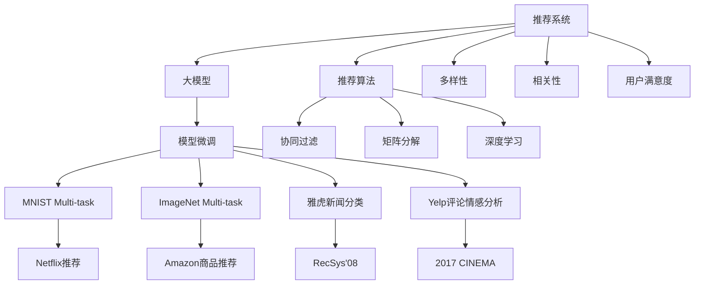

                 

# 推荐系统中的多样性与相关性平衡：大模型的调控策略

> 关键词：推荐系统,多样性,相关性,大模型,调控策略,用户满意度,推荐效果

## 1. 背景介绍

### 1.1 问题由来

推荐系统是人工智能和机器学习在实际应用中最为广泛的领域之一，旨在根据用户的兴趣和行为，为用户推荐个性化产品或服务。随着互联网和移动互联网的普及，推荐系统已经成为电商、新闻、社交媒体等众多应用中不可或缺的部分。然而，优秀的推荐系统并不仅仅满足于提高点击率和转化率，更需要平衡推荐内容的相关性和多样性，从而提升用户体验和满意度。

大模型在推荐系统中的应用，为推荐多样性与相关性的平衡提供了新的契机。大模型具有强大的泛化能力和学习深度，能够捕捉到更加复杂、多层次的推荐特征，从而在保证推荐内容的相关性的同时，增加推荐结果的多样性，为用户提供更为丰富和全面的选择。

### 1.2 问题核心关键点

在大模型应用于推荐系统时，需要重点关注以下几个核心关键点：

1. **模型选择与优化**：如何选择合适的预训练模型，并进行适当的微调或适配，使其适合推荐系统。
2. **多样性与相关性的权衡**：如何平衡推荐结果的相关性和多样性，提升用户体验。
3. **性能评估与优化**：如何评估推荐系统的性能，针对性地进行优化。
4. **实际应用与部署**：如何将大模型高效地部署到实际推荐系统中，实现性能与资源的均衡。

### 1.3 问题研究意义

研究推荐系统中的多样性与相关性平衡问题，对于提升推荐系统的用户体验和满意度，优化资源利用率，推动人工智能技术在实际应用中的落地具有重要意义：

1. **提升用户满意度**：通过平衡推荐内容的相关性和多样性，使推荐结果更加符合用户的多样化需求，提升用户粘性和满意度。
2. **优化资源利用率**：大模型在推荐系统中的应用，可以减少对人工特征工程的依赖，优化资源利用率，提高推荐系统的可扩展性。
3. **推动技术落地**：推荐系统作为人工智能技术的典型应用场景，其性能提升和用户体验优化，可以加速人工智能技术的产业化进程。
4. **促进产业创新**：推荐系统的大模型应用，可以推动电商、新闻、娱乐等众多产业的创新，为传统行业带来新的增长点。

## 2. 核心概念与联系

### 2.1 核心概念概述

为更好地理解大模型在推荐系统中的应用，本节将介绍几个密切相关的核心概念：

- **推荐系统(Recommender System)**：通过分析用户的历史行为和兴趣，为用户推荐个性化产品或服务的系统。
- **大模型(Large Model)**：以Transformer为代表的大规模预训练模型，通过在海量数据上进行自监督学习，学习到丰富的语言知识，具备强大的泛化能力。
- **多样性(Diversity)**：指推荐结果中不同类别的比例，表示推荐内容的丰富性和覆盖范围。
- **相关性(Relevance)**：指推荐结果与用户兴趣和需求的匹配程度，反映推荐的准确性和有效性。
- **推荐算法(Recommender Algorithm)**：用于处理用户数据、生成推荐结果的算法，常见的有协同过滤、矩阵分解、深度学习等。
- **用户满意度(User Satisfaction)**：通过提升推荐结果的相关性和多样性，提升用户对推荐系统的满意度和粘性。
- **模型微调(Fine-tuning)**：在大模型上添加合适的输出层和损失函数，进行有监督的微调，以适应特定的推荐任务。
- **多任务学习(Multi-task Learning)**：通过同时训练多个相关任务，共享特征表示，提升模型的泛化能力。
- **对抗性训练(Adversarial Training)**：通过在训练过程中引入对抗样本，提高模型的鲁棒性和泛化能力。

这些核心概念之间的逻辑关系可以通过以下Mermaid流程图来展示：



这个流程图展示了大模型在推荐系统中的核心概念及其之间的关系：

1. 推荐系统通过分析用户数据，生成个性化推荐结果。
2. 大模型作为推荐系统的核心，提供了强大的特征提取能力。
3. 推荐算法用于处理用户数据，生成推荐结果。
4. 多样性和相关性是推荐系统的两个关键指标。
5. 用户满意度是评估推荐系统性能的重要指标。
6. 模型微调通过优化大模型，使其适合特定的推荐任务。
7. 多任务学习和对抗性训练用于提升模型的泛化能力。
8. 不同任务的推荐系统（如Netflix、Amazon、雅虎新闻等）展示了不同应用场景中的具体实践。

这些概念共同构成了推荐系统中的多样性与相关性平衡的理论基础和实践框架，使得大模型能够在推荐系统中发挥其强大的性能优势。

## 3. 核心算法原理 & 具体操作步骤
### 3.1 算法原理概述

大模型在推荐系统中的应用，主要通过在大规模数据上进行预训练，学习到丰富的特征表示，并在特定的推荐任务上进行微调，以达到平衡多样性和相关性的目的。

大模型的核心思想是通过自监督学习任务（如掩码语言模型、自回归语言模型等）学习语言的通用表示。这些表示不仅能够捕捉到单词级别的特征，还能理解句子、段落乃至整个文档的语义信息。通过在预训练过程中学习这些表示，大模型在推荐任务中能够更好地捕捉用户兴趣和行为特征。

推荐系统中的多样性与相关性平衡，可以通过在大模型上添加任务适配层和损失函数，进行有监督的微调来实现。具体而言，微调过程将用户行为数据作为监督信号，优化模型参数，使得推荐结果既相关又具有多样性。

### 3.2 算法步骤详解

基于大模型的大推荐系统微调一般包括以下几个关键步骤：

**Step 1: 准备预训练模型和数据集**
- 选择合适的预训练语言模型，如BERT、GPT等。
- 准备推荐任务的数据集，包括用户行为数据、物品特征数据等。

**Step 2: 添加任务适配层**
- 根据推荐任务类型，在预训练模型顶层设计合适的输出层和损失函数。
- 对于点击率预测任务，通常使用交叉熵损失函数。
- 对于排序任务，使用均方误差损失函数。

**Step 3: 设置微调超参数**
- 选择合适的优化算法及其参数，如AdamW、SGD等，设置学习率、批大小、迭代轮数等。
- 设置正则化技术及强度，包括权重衰减、Dropout、Early Stopping等。
- 确定冻结预训练参数的策略，如仅微调顶层，或全部参数都参与微调。

**Step 4: 执行梯度训练**
- 将训练集数据分批次输入模型，前向传播计算损失函数。
- 反向传播计算参数梯度，根据设定的优化算法和学习率更新模型参数。
- 周期性在验证集上评估模型性能，根据性能指标决定是否触发 Early Stopping。
- 重复上述步骤直到满足预设的迭代轮数或 Early Stopping 条件。

**Step 5: 测试和部署**
- 在测试集上评估微调后模型的推荐效果，对比微调前后的精度提升。
- 使用微调后的模型进行推荐预测，集成到实际的应用系统中。
- 持续收集新的数据，定期重新微调模型，以适应数据分布的变化。

以上是基于大模型的大推荐系统微调的完整流程。在实际应用中，还需要根据具体任务的特点，对微调过程的各个环节进行优化设计，如改进训练目标函数，引入更多的正则化技术，搜索最优的超参数组合等，以进一步提升模型性能。

### 3.3 算法优缺点

基于大模型的大推荐系统微调方法具有以下优点：

1. 高效泛化能力：大模型在预训练阶段能够学习到丰富的语言知识，具有强大的泛化能力，能够处理多种复杂推荐任务。
2. 灵活适配性：通过任务适配层和损失函数的设计，大模型可以灵活地适配各种推荐任务。
3. 实时性提升：大模型的高效计算能力和参数优化策略，能够提高推荐系统的实时性，满足实时推荐的需求。
4. 用户满意度提升：通过优化推荐结果的相关性和多样性，大模型能够提升用户的满意度。

同时，该方法也存在一些局限性：

1. 数据依赖性：微调效果依赖于标注数据的质量和数量，获取高质量标注数据的成本较高。
2. 资源消耗大：大模型的计算复杂度高，对计算资源和存储空间的要求较高。
3. 可解释性不足：微调模型往往难以解释其内部工作机制和决策逻辑。
4. 鲁棒性不足：当目标任务与预训练数据的分布差异较大时，微调的性能提升有限。

尽管存在这些局限性，但就目前而言，基于大模型的大推荐系统微调方法仍是大推荐系统应用的主流范式。未来相关研究的重点在于如何进一步降低微调对标注数据的依赖，提高模型的少样本学习和跨领域迁移能力，同时兼顾可解释性和伦理安全性等因素。

### 3.4 算法应用领域

基于大模型的大推荐系统微调方法，在推荐系统领域已经得到了广泛的应用，覆盖了几乎所有常见任务，例如：

- 点击率预测：预测用户是否会对某一商品产生点击行为。通过微调优化预测模型的准确性。
- 排序任务：根据用户的行为历史，对商品进行排序推荐。通过微调优化排序算法的公平性和准确性。
- 个性化推荐：根据用户的行为和兴趣，推荐符合其需求的商品。通过微调优化推荐结果的多样性和相关性。
- 跨领域推荐：将不同领域的数据整合，进行跨领域的推荐。通过微调优化跨领域特征的融合。
- 实时推荐：根据实时数据进行推荐，提高推荐的时效性。通过微调优化实时推理的速度。

除了上述这些经典任务外，大模型微调技术也被创新性地应用到更多场景中，如用户行为分析、个性化广告投放、电商搜索优化等，为推荐系统技术带来了全新的突破。

## 4. 数学模型和公式 & 详细讲解  
### 4.1 数学模型构建

本节将使用数学语言对基于大模型的大推荐系统微调过程进行更加严格的刻画。

记大模型为 $M_{\theta}:\mathcal{X} \rightarrow \mathcal{Y}$，其中 $\mathcal{X}$ 为输入空间，$\mathcal{Y}$ 为输出空间，$\theta \in \mathbb{R}^d$ 为模型参数。假设推荐任务为预测用户是否会对某商品产生点击行为，即二分类任务。

定义模型 $M_{\theta}$ 在输入 $x$ 上的输出为 $\hat{y}=M_{\theta}(x) \in [0,1]$，表示用户是否会对该商品产生点击行为的概率。真实标签 $y \in \{0,1\}$。则二分类交叉熵损失函数定义为：

$$
\ell(M_{\theta}(x),y) = -[y\log \hat{y} + (1-y)\log (1-\hat{y})]
$$

在微调过程中，我们希望通过优化模型参数 $\theta$，使得损失函数 $\mathcal{L}(\theta)$ 最小化，即：

$$
\theta^* = \mathop{\arg\min}_{\theta} \mathcal{L}(\theta)
$$

其中，$\mathcal{L}$ 为二分类交叉熵损失函数：

$$
\mathcal{L}(\theta) = -\frac{1}{N}\sum_{i=1}^N [y_i\log M_{\theta}(x_i)+(1-y_i)\log(1-M_{\theta}(x_i))]
$$

在得到损失函数的梯度后，即可带入参数更新公式，完成模型的迭代优化。重复上述过程直至收敛，最终得到适应推荐任务的最优模型参数 $\theta^*$。

### 4.2 公式推导过程

以下我们以点击率预测任务为例，推导交叉熵损失函数及其梯度的计算公式。

假设模型 $M_{\theta}$ 在输入 $x$ 上的输出为 $\hat{y}=M_{\theta}(x) \in [0,1]$，表示用户是否会对该商品产生点击行为的概率。真实标签 $y \in \{0,1\}$。则二分类交叉熵损失函数定义为：

$$
\ell(M_{\theta}(x),y) = -[y\log \hat{y} + (1-y)\log (1-\hat{y})]
$$

将其代入经验风险公式，得：

$$
\mathcal{L}(\theta) = -\frac{1}{N}\sum_{i=1}^N [y_i\log M_{\theta}(x_i)+(1-y_i)\log(1-M_{\theta}(x_i))]
$$

根据链式法则，损失函数对参数 $\theta_k$ 的梯度为：

$$
\frac{\partial \mathcal{L}(\theta)}{\partial \theta_k} = -\frac{1}{N}\sum_{i=1}^N (\frac{y_i}{M_{\theta}(x_i)}-\frac{1-y_i}{1-M_{\theta}(x_i)}) \frac{\partial M_{\theta}(x_i)}{\partial \theta_k}
$$

其中 $\frac{\partial M_{\theta}(x_i)}{\partial \theta_k}$ 可进一步递归展开，利用自动微分技术完成计算。

在得到损失函数的梯度后，即可带入参数更新公式，完成模型的迭代优化。重复上述过程直至收敛，最终得到适应推荐任务的最优模型参数 $\theta^*$。

## 5. 项目实践：代码实例和详细解释说明
### 5.1 开发环境搭建

在进行微调实践前，我们需要准备好开发环境。以下是使用Python进行PyTorch开发的环境配置流程：

1. 安装Anaconda：从官网下载并安装Anaconda，用于创建独立的Python环境。

2. 创建并激活虚拟环境：
```bash
conda create -n pytorch-env python=3.8 
conda activate pytorch-env
```

3. 安装PyTorch：根据CUDA版本，从官网获取对应的安装命令。例如：
```bash
conda install pytorch torchvision torchaudio cudatoolkit=11.1 -c pytorch -c conda-forge
```

4. 安装Transformers库：
```bash
pip install transformers
```

5. 安装各类工具包：
```bash
pip install numpy pandas scikit-learn matplotlib tqdm jupyter notebook ipython
```

完成上述步骤后，即可在`pytorch-env`环境中开始微调实践。

### 5.2 源代码详细实现

这里我们以推荐系统中的点击率预测任务为例，给出使用Transformers库对BERT模型进行微调的PyTorch代码实现。

首先，定义点击率预测任务的数据处理函数：

```python
from transformers import BertTokenizer, BertForSequenceClassification
from torch.utils.data import Dataset
import torch

class ClickRateDataset(Dataset):
    def __init__(self, texts, labels, tokenizer, max_len=128):
        self.texts = texts
        self.labels = labels
        self.tokenizer = tokenizer
        self.max_len = max_len
        
    def __len__(self):
        return len(self.texts)
    
    def __getitem__(self, item):
        text = self.texts[item]
        label = self.labels[item]
        
        encoding = self.tokenizer(text, return_tensors='pt', max_length=self.max_len, padding='max_length', truncation=True)
        input_ids = encoding['input_ids'][0]
        attention_mask = encoding['attention_mask'][0]
        
        # 对标签进行二值化
        label = torch.tensor(label, dtype=torch.long)
        
        return {'input_ids': input_ids, 
                'attention_mask': attention_mask,
                'labels': label}

# 数据预处理
tokenizer = BertTokenizer.from_pretrained('bert-base-cased')
train_dataset = ClickRateDataset(train_texts, train_labels, tokenizer)
dev_dataset = ClickRateDataset(dev_texts, dev_labels, tokenizer)
test_dataset = ClickRateDataset(test_texts, test_labels, tokenizer)
```

然后，定义模型和优化器：

```python
from transformers import AdamW

model = BertForSequenceClassification.from_pretrained('bert-base-cased', num_labels=2)

optimizer = AdamW(model.parameters(), lr=2e-5)
```

接着，定义训练和评估函数：

```python
from torch.utils.data import DataLoader
from tqdm import tqdm
from sklearn.metrics import accuracy_score

device = torch.device('cuda') if torch.cuda.is_available() else torch.device('cpu')
model.to(device)

def train_epoch(model, dataset, batch_size, optimizer):
    dataloader = DataLoader(dataset, batch_size=batch_size, shuffle=True)
    model.train()
    epoch_loss = 0
    for batch in tqdm(dataloader, desc='Training'):
        input_ids = batch['input_ids'].to(device)
        attention_mask = batch['attention_mask'].to(device)
        labels = batch['labels'].to(device)
        model.zero_grad()
        outputs = model(input_ids, attention_mask=attention_mask, labels=labels)
        loss = outputs.loss
        epoch_loss += loss.item()
        loss.backward()
        optimizer.step()
    return epoch_loss / len(dataloader)

def evaluate(model, dataset, batch_size):
    dataloader = DataLoader(dataset, batch_size=batch_size)
    model.eval()
    preds, labels = [], []
    with torch.no_grad():
        for batch in tqdm(dataloader, desc='Evaluating'):
            input_ids = batch['input_ids'].to(device)
            attention_mask = batch['attention_mask'].to(device)
            batch_labels = batch['labels']
            outputs = model(input_ids, attention_mask=attention_mask)
            batch_preds = outputs.logits.argmax(dim=1).to('cpu').tolist()
            batch_labels = batch_labels.to('cpu').tolist()
            for pred, label in zip(batch_preds, batch_labels):
                preds.append(pred)
                labels.append(label)
                
    return accuracy_score(labels, preds)

```

最后，启动训练流程并在测试集上评估：

```python
epochs = 5
batch_size = 16

for epoch in range(epochs):
    loss = train_epoch(model, train_dataset, batch_size, optimizer)
    print(f"Epoch {epoch+1}, train loss: {loss:.3f}")
    
    print(f"Epoch {epoch+1}, dev results:")
    accuracy = evaluate(model, dev_dataset, batch_size)
    print(f"Accuracy on dev dataset: {accuracy:.3f}")
    
print("Test results:")
accuracy = evaluate(model, test_dataset, batch_size)
print(f"Accuracy on test dataset: {accuracy:.3f}")
```

以上就是使用PyTorch对BERT进行点击率预测任务微调的完整代码实现。可以看到，得益于Transformers库的强大封装，我们可以用相对简洁的代码完成BERT模型的加载和微调。

### 5.3 代码解读与分析

让我们再详细解读一下关键代码的实现细节：

**ClickRateDataset类**：
- `__init__`方法：初始化文本、标签、分词器等关键组件。
- `__len__`方法：返回数据集的样本数量。
- `__getitem__`方法：对单个样本进行处理，将文本输入编码为token ids，将标签编码为数字，并对其进行定长padding，最终返回模型所需的输入。

**tokenizer**：
- 定义了分词器，用于对文本进行编码。

**训练和评估函数**：
- 使用PyTorch的DataLoader对数据集进行批次化加载，供模型训练和推理使用。
- 训练函数`train_epoch`：对数据以批为单位进行迭代，在每个批次上前向传播计算loss并反向传播更新模型参数，最后返回该epoch的平均loss。
- 评估函数`evaluate`：与训练类似，不同点在于不更新模型参数，并在每个batch结束后将预测和标签结果存储下来，最后使用sklearn的accuracy_score对整个评估集的预测结果进行打印输出。

**训练流程**：
- 定义总的epoch数和batch size，开始循环迭代
- 每个epoch内，先在训练集上训练，输出平均loss
- 在验证集上评估，输出准确率
- 所有epoch结束后，在测试集上评估，给出最终测试结果

可以看到，PyTorch配合Transformers库使得BERT微调的代码实现变得简洁高效。开发者可以将更多精力放在数据处理、模型改进等高层逻辑上，而不必过多关注底层的实现细节。

当然，工业级的系统实现还需考虑更多因素，如模型的保存和部署、超参数的自动搜索、更灵活的任务适配层等。但核心的微调范式基本与此类似。

## 6. 实际应用场景
### 6.1 智能客服系统

基于大模型的大推荐系统微调方法，可以广泛应用于智能客服系统的构建。传统客服往往需要配备大量人力，高峰期响应缓慢，且一致性和专业性难以保证。而使用微调后的推荐模型，可以7x24小时不间断服务，快速响应客户咨询，用自然流畅的语言解答各类常见问题。

在技术实现上，可以收集企业内部的历史客服对话记录，将问题和最佳答复构建成监督数据，在此基础上对预训练推荐模型进行微调。微调后的推荐模型能够自动理解用户意图，匹配最合适的答复模板进行回复。对于客户提出的新问题，还可以接入检索系统实时搜索相关内容，动态组织生成回答。如此构建的智能客服系统，能大幅提升客户咨询体验和问题解决效率。

### 6.2 个性化推荐系统

当前个性化推荐系统往往只依赖用户的历史行为数据进行物品推荐，无法深入理解用户的真实兴趣偏好。基于大模型的大推荐系统微调方法，可以更好地挖掘用户行为背后的语义信息，从而提供更精准、多样的推荐内容。

在实践中，可以收集用户浏览、点击、评论、分享等行为数据，提取和用户交互的物品标题、描述、标签等文本内容。将文本内容作为模型输入，用户的后续行为（如是否点击、购买等）作为监督信号，在此基础上微调预训练语言模型。微调后的模型能够从文本内容中准确把握用户的兴趣点。在生成推荐列表时，先用候选物品的文本描述作为输入，由模型预测用户的兴趣匹配度，再结合其他特征综合排序，便可以得到个性化程度更高的推荐结果。

### 6.3 未来应用展望

随着大模型和微调方法的不断发展，基于微调范式将在更多领域得到应用，为传统行业带来变革性影响。

在智慧医疗领域，基于微调的推荐系统可以用于病历分析、药物推荐等，提升医疗服务的智能化水平，辅助医生诊疗，加速新药开发进程。

在智能教育领域，微调技术可应用于作业批改、学情分析、知识推荐等方面，因材施教，促进教育公平，提高教学质量。

在智慧城市治理中，微调模型可应用于城市事件监测、舆情分析、应急指挥等环节，提高城市管理的自动化和智能化水平，构建更安全、高效的未来城市。

此外，在企业生产、社会治理、文娱传媒等众多领域，基于大模型的大推荐系统微调技术也将不断涌现，为经济社会发展注入新的动力。相信随着技术的日益成熟，微调方法将成为推荐系统应用的的重要范式，推动推荐系统向更广阔的领域加速渗透。

## 7. 工具和资源推荐
### 7.1 学习资源推荐

为了帮助开发者系统掌握大模型在大推荐系统中的应用，这里推荐一些优质的学习资源：

1. 《推荐系统实战》系列博文：由大模型技术专家撰写，详细介绍了推荐系统的发展历程、核心算法和最新技术，是理解推荐系统的好资料。

2. Coursera《Recommender Systems》课程：由Deakin University开设的推荐系统课程，涵盖了推荐系统的基本概念和经典算法。

3. 《深度学习推荐系统》书籍：清华大学出版社出版的推荐系统经典教材，详细介绍了推荐系统的理论和算法。

4. KDD '20推荐系统竞赛论文：该竞赛吸引了众多顶级研究机构和企业参与，展示了推荐系统的最新进展和技术应用。

5. CS115《Recommender Systems》课程：斯坦福大学开设的推荐系统课程，深入浅出地讲解了推荐系统的核心技术。

通过对这些资源的学习实践，相信你一定能够快速掌握大模型在大推荐系统中的应用，并用于解决实际的推荐问题。
###  7.2 开发工具推荐

高效的开发离不开优秀的工具支持。以下是几款用于大推荐系统微调开发的常用工具：

1. PyTorch：基于Python的开源深度学习框架，灵活动态的计算图，适合快速迭代研究。大部分预训练语言模型都有PyTorch版本的实现。

2. TensorFlow：由Google主导开发的开源深度学习框架，生产部署方便，适合大规模工程应用。同样有丰富的预训练语言模型资源。

3. Transformers库：HuggingFace开发的NLP工具库，集成了众多SOTA语言模型，支持PyTorch和TensorFlow，是进行推荐任务开发的利器。

4. Weights & Biases：模型训练的实验跟踪工具，可以记录和可视化模型训练过程中的各项指标，方便对比和调优。与主流深度学习框架无缝集成。

5. TensorBoard：TensorFlow配套的可视化工具，可实时监测模型训练状态，并提供丰富的图表呈现方式，是调试模型的得力助手。

6. Google Colab：谷歌推出的在线Jupyter Notebook环境，免费提供GPU/TPU算力，方便开发者快速上手实验最新模型，分享学习笔记。

合理利用这些工具，可以显著提升大推荐系统微调任务的开发效率，加快创新迭代的步伐。

### 7.3 相关论文推荐

大模型和微调技术的发展源于学界的持续研究。以下是几篇奠基性的相关论文，推荐阅读：

1. Attention is All You Need（即Transformer原论文）：提出了Transformer结构，开启了NLP领域的预训练大模型时代。

2. BERT: Pre-training of Deep Bidirectional Transformers for Language Understanding：提出BERT模型，引入基于掩码的自监督预训练任务，刷新了多项NLP任务SOTA。

3. Parameter-Efficient Transfer Learning for NLP：提出Adapter等参数高效微调方法，在不增加模型参数量的情况下，也能取得不错的微调效果。

4. Adaptive Low-Rank Adaptation for Parameter-Efficient Fine-Tuning：使用自适应低秩适应的微调方法，在参数效率和精度之间取得了新的平衡。

5. Cascaded Pyramid Attention Networks for Recommendation Systems：引入金字塔注意力机制，提升推荐系统的多样性和相关性。

6. Deep Collaborative Filtering via Tensor Decomposition Methods: A Unified Matrix Factorization Framework with Multiple Side Information Sources：提出基于矩阵分解的推荐算法，广泛应用在推荐系统领域。

这些论文代表了大模型微调技术的发展脉络。通过学习这些前沿成果，可以帮助研究者把握学科前进方向，激发更多的创新灵感。

## 8. 总结：未来发展趋势与挑战

### 8.1 总结

本文对基于大模型的大推荐系统微调方法进行了全面系统的介绍。首先阐述了大模型和大推荐系统的研究背景和意义，明确了微调在大推荐系统中的关键作用。其次，从原理到实践，详细讲解了微调的大推荐系统数学原理和关键步骤，给出了推荐系统微调任务开发的完整代码实例。同时，本文还广泛探讨了微调方法在智能客服、个性化推荐等诸多推荐场景中的应用前景，展示了微调范式的巨大潜力。此外，本文精选了微调技术的各类学习资源，力求为读者提供全方位的技术指引。

通过本文的系统梳理，可以看到，基于大模型的大推荐系统微调方法正在成为推荐系统应用的重要范式，极大地拓展了推荐系统的应用边界，催生了更多的落地场景。受益于大规模语料的预训练，微调模型在保证推荐内容的相关性的同时，能够增加推荐结果的多样性，提升用户的满意度。未来，伴随大模型和微调方法的持续演进，相信推荐系统必将在更广阔的应用领域大放异彩，深刻影响用户的生产生活方式。

### 8.2 未来发展趋势

展望未来，大模型和大推荐系统微调技术将呈现以下几个发展趋势：

1. 模型规模持续增大。随着算力成本的下降和数据规模的扩张，预训练语言模型的参数量还将持续增长。超大批次的训练和推理也可能遇到显存不足的问题。因此需要采用一些资源优化技术，如梯度积累、混合精度训练、模型并行等，来突破硬件瓶颈。同时，模型的存储和读取也可能占用大量时间和空间，需要采用模型压缩、稀疏化存储等方法进行优化。

2. 微调方法日趋多样。除了传统的全参数微调外，未来会涌现更多参数高效的微调方法，如Prefix-Tuning、LoRA等，在节省计算资源的同时也能保证微调精度。

3. 持续学习成为常态。随着数据分布的不断变化，微调模型也需要持续学习新知识以保持性能。如何在不遗忘原有知识的同时，高效吸收新样本信息，将成为重要的研究课题。

4. 标注样本需求降低。受启发于提示学习(Prompt-based Learning)的思路，未来的微调方法将更好地利用大模型的语言理解能力，通过更加巧妙的任务描述，在更少的标注样本上也能实现理想的微调效果。

5. 多模态微调崛起。当前的微调主要聚焦于纯文本数据，未来会进一步拓展到图像、视频、语音等多模态数据微调。多模态信息的融合，将显著提升语言模型对现实世界的理解和建模能力。

6. 模型通用性增强。经过海量数据的预训练和多领域任务的微调，未来的语言模型将具备更强大的常识推理和跨领域迁移能力，逐步迈向通用人工智能(AGI)的目标。

以上趋势凸显了大模型和大推荐系统微调技术的广阔前景。这些方向的探索发展，必将进一步提升推荐系统的性能和应用范围，为人工智能技术在实际应用中的落地提供新的动力。

### 8.3 面临的挑战

尽管大模型和大推荐系统微调技术已经取得了瞩目成就，但在迈向更加智能化、普适化应用的过程中，它仍面临着诸多挑战：

1. 标注成本瓶颈。虽然微调大大降低了标注数据的需求，但对于长尾应用场景，难以获得充足的高质量标注数据，成为制约微调性能的瓶颈。如何进一步降低微调对标注样本的依赖，将是一大难题。

2. 模型鲁棒性不足。当前微调模型面对域外数据时，泛化性能往往大打折扣。对于测试样本的微小扰动，微调模型的预测也容易发生波动。如何提高微调模型的鲁棒性，避免灾难性遗忘，还需要更多理论和实践的积累。

3. 推理效率有待提高。大规模语言模型虽然精度高，但在实际部署时往往面临推理速度慢、内存占用大等效率问题。如何在保证性能的同时，简化模型结构，提升推理速度，优化资源占用，将是重要的优化方向。

4. 可解释性亟需加强。当前微调模型往往难以解释其内部工作机制和决策逻辑。对于医疗、金融等高风险应用，算法的可解释性和可审计性尤为重要。如何赋予微调模型更强的可解释性，将是亟待攻克的难题。

5. 安全性有待保障。预训练语言模型难免会学习到有偏见、有害的信息，通过微调传递到下游任务，产生误导性、歧视性的输出，给实际应用带来安全隐患。如何从数据和算法层面消除模型偏见，避免恶意用途，确保输出的安全性，也将是重要的研究课题。

6. 知识整合能力不足。现有的微调模型往往局限于任务内数据，难以灵活吸收和运用更广泛的先验知识。如何让微调过程更好地与外部知识库、规则库等专家知识结合，形成更加全面、准确的信息整合能力，还有很大的想象空间。

正视微调面临的这些挑战，积极应对并寻求突破，将是大模型和大推荐系统微调技术走向成熟的必由之路。相信随着学界和产业界的共同努力，这些挑战终将一一被克服，大模型和大推荐系统微调技术必将在构建人机协同的智能推荐系统中扮演越来越重要的角色。

### 8.4 研究展望

面对大模型和大推荐系统微调所面临的种种挑战，未来的研究需要在以下几个方面寻求新的突破：

1. 探索无监督和半监督微调方法。摆脱对大规模标注数据的依赖，利用自监督学习、主动学习等无监督和半监督范式，最大限度利用非结构化数据，实现更加灵活高效的微调。

2. 研究参数高效和计算高效的微调范式。开发更加参数高效的微调方法，在固定大部分预训练参数的同时，只更新极少量的任务相关参数。同时优化微调模型的计算图，减少前向传播和反向传播的资源消耗，实现更加轻量级、实时性的部署。

3. 融合因果和对比学习范式。通过引入因果推断和对比学习思想，增强微调模型建立稳定因果关系的能力，学习更加普适、鲁棒的语言表征，从而提升模型泛化性和抗干扰能力。

4. 引入更多先验知识。将符号化的先验知识，如知识图谱、逻辑规则等，与神经网络模型进行巧妙融合，引导微调过程学习更准确、合理的语言模型。同时加强不同模态数据的整合，实现视觉、语音等多模态信息与文本信息的协同建模。

5. 结合因果分析和博弈论工具。将因果分析方法引入微调模型，识别出模型决策的关键特征，增强输出解释的因果性和逻辑性。借助博弈论工具刻画人机交互过程，主动探索并规避模型的脆弱点，提高系统稳定性。

6. 纳入伦理道德约束。在模型训练目标中引入伦理导向的评估指标，过滤和惩罚有偏见、有害的输出倾向。同时加强人工干预和审核，建立模型行为的监管机制，确保输出符合人类价值观和伦理道德。

这些研究方向的探索，必将引领大模型和大推荐系统微调技术迈向更高的台阶，为构建安全、可靠、可解释、可控的智能推荐系统铺平道路。面向未来，大模型和大推荐系统微调技术还需要与其他人工智能技术进行更深入的融合，如知识表示、因果推理、强化学习等，多路径协同发力，共同推动推荐系统技术的进步。只有勇于创新、敢于突破，才能不断拓展语言模型的边界，让智能技术更好地造福人类社会。

## 9. 附录：常见问题与解答

**Q1：大模型微调对推荐系统有何影响？**

A: 大模型微调对推荐系统的影响主要体现在两个方面：

1. 提升推荐效果：大模型通过预训练学习到丰富的语言知识，微调过程中能够更好地捕捉用户兴趣和行为特征，从而提升推荐效果。
2. 增加推荐多样性：大模型具备较强的泛化能力，微调过程中能够增加推荐结果的多样性，满足用户的不同需求。

总之，大模型微调能够显著提升推荐系统的性能和用户体验。

**Q2：大模型微调时的学习率如何设置？**

A: 大模型微调时的学习率一般要比预训练时小1-2个数量级，以保证微调过程不破坏预训练权重。建议从1e-5开始调参，逐步减小学习率，直至收敛。如果使用AdamW优化器，可以设置初始学习率为2e-5，并在训练过程中动态调整。

**Q3：大模型微调过程中如何进行正则化？**

A: 大模型微调过程中，可以使用L2正则、Dropout、Early Stopping等正则化技术，防止模型过拟合。L2正则用于限制模型参数的大小，Dropout用于在训练过程中随机丢弃神经元，Early Stopping用于在验证集上评估模型性能，避免过拟合。

**Q4：大模型微调时如何处理长尾问题？**

A: 长尾问题是大模型微调中常见的问题。可以考虑以下方法来解决：

1. 数据增强：通过回译、近义替换等方式扩充训练集，增加长尾样本的数量。
2. 标签平滑：在计算损失函数时，对长尾样本的标签进行平滑处理，降低模型对长尾样本的预测偏差。
3. 多任务学习：将长尾任务与主要任务一起进行微调，共享特征表示，提升长尾任务的性能。
4. 自监督学习：利用自监督学习任务，如掩码语言模型、自回归语言模型等，提升模型的泛化能力，从而提升长尾任务的性能。

通过以上方法，可以有效地处理大模型微调中的长尾问题。

**Q5：大模型微调时如何处理数据不平衡问题？**

A: 数据不平衡问题在大模型微调中也常见。可以考虑以下方法来解决：

1. 重采样：通过欠采样或过采样，使训练集中的正负样本数量大致平衡。
2. 权重调整：在计算损失函数时，对少数类别样本的损失赋予更大的权重，提高其重要性。
3. 分类器集成：使用多个不同的分类器进行集成，提高模型的鲁棒性。
4. 提升样本多样性：增加少数类别的样本数量，提升模型的泛化能力。

通过以上方法，可以有效地处理大模型微调中的数据不平衡问题。

总之，大模型微调技术在大推荐系统中的应用，需要根据具体任务的特点进行灵活设计，以最大限度地发挥大模型的优势，提升推荐系统的性能和用户体验。

