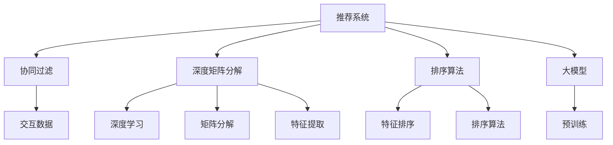

                 

# 推荐系统中的多维度排序：大模型的新思路

> 关键词：推荐系统,多维度排序,大模型,协同过滤,深度学习,深度矩阵分解,排序算法

## 1. 背景介绍

在当今信息爆炸的时代，用户可以接触到海量的信息，如何在浩瀚的信息海洋中，找到真正对自己有用的信息，成为了一个巨大的挑战。推荐系统就是在这样的背景下应运而生，它的核心目标是通过对用户历史行为数据的分析，预测用户可能感兴趣的物品，从而提升用户体验，增加平台收益。传统的推荐系统主要分为基于协同过滤和基于内容的推荐两大类，但它们都有各自的局限性。协同过滤推荐难以处理稀疏数据，而基于内容的推荐则往往需要依赖大量的用户物品特征，且特征工程复杂。

近年来，大语言模型在推荐系统中的应用逐渐增多，大模型可以通过预训练学习到丰富的知识，从而提升推荐系统的效果。大模型的引入，使得推荐系统可以更灵活地处理复杂多变的数据，并且可以解决传统推荐系统无法处理的一些问题。然而，在大模型中，如何高效地进行推荐排序，仍然是一个需要深入研究的课题。本文将介绍一种基于大模型的多维度排序方法，它通过将不同维度的信息综合考虑，提出了新的排序算法，以期在提升推荐效果的同时，减少计算资源的消耗。

## 2. 核心概念与联系

### 2.1 核心概念概述

为更好地理解基于大模型的推荐系统中的多维度排序方法，本节将介绍几个密切相关的核心概念：

- **推荐系统(Recommender System)**：通过分析用户的历史行为数据，预测用户可能感兴趣的物品，从而为用户推荐个性化内容。推荐系统广泛应用于电商、视频、社交网络等领域，极大地提升了用户体验和平台收益。
- **协同过滤(Collaborative Filtering)**：通过分析用户与物品之间的交互数据，预测用户可能感兴趣的新物品。分为基于用户的协同过滤和基于物品的协同过滤，是推荐系统中最早也是最基础的推荐方法。
- **深度矩阵分解(Deep Matrix Factorization)**：结合深度学习技术，对用户物品交互矩阵进行分解，学习到更深层次的隐含特征。常见的方法包括矩阵分解网络(MFNet)、交替最小二乘法(ALS)等。
- **排序算法(Sorting Algorithm)**：在推荐结果中，如何根据不同特征进行排序，直接影响到推荐效果。传统排序算法如基于内容的排序、基于协同过滤的排序等，在大模型中的应用需要进一步优化。
- **大模型(Large Model)**：通过在大规模无标签数据上进行预训练，学习到丰富的知识表示，在推荐系统中可以用于提升推荐效果。常见的大模型如BERT、GPT等。

这些核心概念之间的逻辑关系可以通过以下Mermaid流程图来展示：



这个流程图展示了大模型推荐系统的工作原理和优化思路：

1. 推荐系统通过协同过滤、深度矩阵分解和大模型等方法，学习到用户和物品的特征表示。
2. 排序算法通过综合考虑不同维度的特征，对推荐结果进行排序。
3. 深度学习和大模型能够学习到更加复杂和深刻的特征表示，提升排序的准确性。

## 3. 核心算法原理 & 具体操作步骤
### 3.1 算法原理概述

基于大模型的推荐系统中的多维度排序方法，本质上是通过将不同维度的特征综合考虑，提升推荐结果的质量。具体来说，该方法结合了协同过滤、深度矩阵分解和大模型三种技术，通过不同的特征提取和排序算法，对推荐结果进行排序。

假设推荐系统中有 $N$ 个用户和 $M$ 个物品，用户和物品之间的交互矩阵为 $\mathbf{R} \in \mathbb{R}^{N \times M}$，其中 $R_{ui}$ 表示用户 $u$ 对物品 $i$ 的评分。模型的目标是通过对 $\mathbf{R}$ 进行多维度排序，得到最优的推荐结果。

### 3.2 算法步骤详解

基于大模型的推荐系统中的多维度排序方法，主要包括以下几个关键步骤：

**Step 1: 收集用户物品交互数据**

首先需要收集用户对物品的评分数据，作为推荐系统的基础数据。这些数据可以从电商网站、视频网站、社交媒体等平台获取。数据量越大，模型的预测效果越好。

**Step 2: 预训练大模型**

通过在大规模无标签数据上进行预训练，学习到丰富的知识表示。预训练大模型可以选用如BERT、GPT等深度学习模型，通过自监督学习的方式进行训练。

**Step 3: 特征提取**

通过协同过滤和深度矩阵分解技术，对用户物品交互矩阵 $\mathbf{R}$ 进行特征提取，得到用户和物品的特征表示。协同过滤可以通过计算用户和物品的相似度来进行，深度矩阵分解则可以通过对用户物品交互矩阵进行分解，学习到更深层次的特征。

**Step 4: 特征融合**

将协同过滤、深度矩阵分解和大模型得到的特征进行融合，得到综合特征表示。这一步骤可以采用简单的拼接、加权平均等方法，也可以采用更深层次的融合方法，如注意力机制、神经网络等。

**Step 5: 排序算法**

通过排序算法对综合特征进行排序，得到最优的推荐结果。排序算法可以采用基于内容的排序、基于协同过滤的排序等，也可以采用深度学习等方法，结合多维度特征进行排序。

**Step 6: 模型训练与评估**

通过训练和评估，调整模型参数，得到最终的推荐模型。训练和评估过程中可以使用交叉验证等方法，评估模型效果。

### 3.3 算法优缺点

基于大模型的推荐系统中的多维度排序方法，具有以下优点：

1. 综合考虑多维度特征，提升推荐效果。该方法通过将协同过滤、深度矩阵分解和大模型得到的特征进行融合，得到更全面的特征表示。
2. 模型具有高度的灵活性和可扩展性。可以根据不同的特征维度，灵活调整特征提取和排序方法。
3. 可以处理稀疏数据。协同过滤和深度矩阵分解技术可以很好地处理稀疏数据，提升推荐系统的稳定性和可靠性。

同时，该方法也存在一些局限性：

1. 计算资源消耗较大。该方法需要预训练大模型，特征提取和排序算法也需要较大的计算资源。
2. 模型训练复杂度较高。综合考虑多维度特征，需要设计复杂的模型结构，训练过程也较为复杂。
3. 需要大量的训练数据。协同过滤和深度矩阵分解需要大量的用户物品交互数据，才能得到较好的效果。

尽管存在这些局限性，但就目前而言，基于大模型的推荐系统中的多维度排序方法仍是一种高效、有效的推荐方法。未来相关研究的方向之一是如何在保证推荐效果的同时，降低计算资源消耗，提高模型训练的效率。

### 3.4 算法应用领域

基于大模型的推荐系统中的多维度排序方法，在电商、视频、社交网络等多个领域得到了广泛应用。具体应用场景包括：

1. 电商推荐：对用户的购买行为、浏览历史等数据进行综合分析，为用户推荐感兴趣的商品。
2. 视频推荐：对用户的观看历史、评分数据等进行综合分析，为用户推荐感兴趣的视频。
3. 社交网络推荐：对用户的关注行为、互动数据等进行综合分析，为用户推荐感兴趣的内容。

除了上述这些经典应用外，大模型的多维度排序方法还可以用于新闻推荐、音乐推荐、旅游推荐等多个领域，为用户的个性化需求提供精准的推荐服务。

## 4. 数学模型和公式 & 详细讲解
### 4.1 数学模型构建

本节将使用数学语言对基于大模型的推荐系统中的多维度排序方法进行更加严格的刻画。

假设推荐系统中有 $N$ 个用户和 $M$ 个物品，用户和物品之间的交互矩阵为 $\mathbf{R} \in \mathbb{R}^{N \times M}$，其中 $R_{ui}$ 表示用户 $u$ 对物品 $i$ 的评分。设 $\mathbf{X} \in \mathbb{R}^{N \times d_x}$ 为用户特征表示矩阵，$\mathbf{Y} \in \mathbb{R}^{M \times d_y}$ 为物品特征表示矩阵，$d_x$ 和 $d_y$ 为特征维度。

定义协同过滤矩阵 $\mathbf{S} \in \mathbb{R}^{N \times M}$，其中 $S_{ui}$ 表示用户 $u$ 对物品 $i$ 的协同过滤评分。定义深度矩阵分解矩阵 $\mathbf{P} \in \mathbb{R}^{N \times k}$ 和 $\mathbf{Q} \in \mathbb{R}^{M \times k}$，其中 $k$ 为分解后的特征维度。

定义大模型得到的特征表示矩阵 $\mathbf{F} \in \mathbb{R}^{N \times h}$ 和 $\mathbf{G} \in \mathbb{R}^{M \times h}$，其中 $h$ 为大模型输出的特征维度。

目标函数为：

$$
\min_{\mathbf{X}, \mathbf{Y}, \mathbf{S}, \mathbf{P}, \mathbf{Q}, \mathbf{F}, \mathbf{G}} \Vert \mathbf{R} - \mathbf{X}\mathbf{S}\mathbf{Y}^\top - \mathbf{X}\mathbf{P}\mathbf{Q}^\top - \mathbf{X}\mathbf{F}\mathbf{G}^\top \Vert_F^2
$$

其中 $\Vert \cdot \Vert_F$ 表示矩阵的 Frobenius 范数。

### 4.2 公式推导过程

以下我们以推荐系统中的多维度排序为例，推导深度矩阵分解模型和排序算法的数学公式。

假设推荐系统中的用户物品交互矩阵 $\mathbf{R}$ 可以分解为三个矩阵的乘积，即：

$$
\mathbf{R} = \mathbf{X}\mathbf{S}\mathbf{Y}^\top
$$

其中 $\mathbf{X}$ 和 $\mathbf{Y}$ 为用户和物品的特征表示矩阵，$\mathbf{S}$ 为协同过滤矩阵。通过最小二乘法，可以得到 $\mathbf{X}$ 和 $\mathbf{Y}$ 的解：

$$
\mathbf{X} = \arg\min_{\mathbf{X}} \Vert \mathbf{R} - \mathbf{X}\mathbf{S}\mathbf{Y}^\top \Vert_F^2
$$

$$
\mathbf{Y} = \arg\min_{\mathbf{Y}} \Vert \mathbf{R} - \mathbf{X}\mathbf{S}\mathbf{Y}^\top \Vert_F^2
$$

为了提升模型的预测效果，可以对 $\mathbf{X}$ 和 $\mathbf{Y}$ 进行深度矩阵分解，即：

$$
\mathbf{X} = \mathbf{P}\mathbf{Q}^\top
$$

$$
\mathbf{Y} = \mathbf{G}\mathbf{F}^\top
$$

其中 $\mathbf{P}$ 和 $\mathbf{G}$ 为低秩矩阵，$\mathbf{Q}$ 和 $\mathbf{F}$ 为高维矩阵。

在得到 $\mathbf{X}$ 和 $\mathbf{Y}$ 后，可以通过深度学习模型对 $\mathbf{X}$ 和 $\mathbf{Y}$ 进行进一步的特征提取。假设使用大模型得到的特征表示矩阵为 $\mathbf{F}$ 和 $\mathbf{G}$，则综合特征表示矩阵为：

$$
\mathbf{Z} = \mathbf{X}\mathbf{S}\mathbf{Y}^\top + \mathbf{X}\mathbf{P}\mathbf{Q}^\top + \mathbf{X}\mathbf{F}\mathbf{G}^\top
$$

在得到综合特征表示 $\mathbf{Z}$ 后，可以通过排序算法对推荐结果进行排序。假设使用基于内容的排序算法，则排序后的推荐结果为：

$$
\mathbf{O} = \arg\min_{\mathbf{O}} \Vert \mathbf{Z} - \mathbf{O} \Vert_F^2
$$

其中 $\mathbf{O}$ 为排序后的推荐结果矩阵。

### 4.3 案例分析与讲解

这里以电商推荐系统为例，进行具体分析。假设电商平台的商品数量为 $M$，用户数量为 $N$，用户对商品的评分矩阵为 $\mathbf{R}$。为了提升推荐效果，可以通过协同过滤和深度矩阵分解技术，对 $\mathbf{R}$ 进行特征提取。

首先，可以通过协同过滤技术计算用户和商品的相似度，得到协同过滤评分矩阵 $\mathbf{S}$。然后，可以使用深度矩阵分解技术，将 $\mathbf{R}$ 分解为 $\mathbf{X}\mathbf{S}\mathbf{Y}^\top$ 的形式，得到用户和商品的特征表示矩阵 $\mathbf{X}$ 和 $\mathbf{Y}$。

接下来，可以使用大模型对 $\mathbf{X}$ 和 $\mathbf{Y}$ 进行特征提取，得到综合特征表示矩阵 $\mathbf{Z}$。最后，可以通过排序算法对 $\mathbf{Z}$ 进行排序，得到最终的推荐结果矩阵 $\mathbf{O}$。

在实际应用中，还可以采用基于协同过滤的排序算法，将 $\mathbf{S}$ 作为排序依据，得到最终的推荐结果矩阵 $\mathbf{O}$。

## 5. 项目实践：代码实例和详细解释说明
### 5.1 开发环境搭建

在进行项目实践前，我们需要准备好开发环境。以下是使用Python进行PyTorch开发的环境配置流程：

1. 安装Anaconda：从官网下载并安装Anaconda，用于创建独立的Python环境。

2. 创建并激活虚拟环境：
```bash
conda create -n pytorch-env python=3.8 
conda activate pytorch-env
```

3. 安装PyTorch：根据CUDA版本，从官网获取对应的安装命令。例如：
```bash
conda install pytorch torchvision torchaudio cudatoolkit=11.1 -c pytorch -c conda-forge
```

4. 安装各类工具包：
```bash
pip install numpy pandas scikit-learn matplotlib tqdm jupyter notebook ipython
```

完成上述步骤后，即可在`pytorch-env`环境中开始项目实践。

### 5.2 源代码详细实现

下面我们以电商推荐系统为例，给出使用Transformers库对BERT模型进行特征提取的PyTorch代码实现。

首先，定义特征提取函数：

```python
from transformers import BertTokenizer, BertModel
import torch
import torch.nn as nn

def feature_extractor(model, tokenizer, data):
    tokenizer = BertTokenizer.from_pretrained('bert-base-uncased')
    tokenized_input = tokenizer(data, return_tensors='pt', padding='max_length', truncation=True)
    model.eval()
    with torch.no_grad():
        inputs = {'input_ids': tokenized_input['input_ids'].to(device)}
        outputs = model(**inputs)
        hidden_states = outputs['hidden_states'][-1]
        return hidden_states
```

然后，定义模型和损失函数：

```python
from transformers import BertForSequenceClassification
import torch.nn.functional as F

model = BertForSequenceClassification.from_pretrained('bert-base-uncased', num_labels=2).to(device)
criterion = nn.CrossEntropyLoss()
```

接着，定义训练和评估函数：

```python
def train_epoch(model, optimizer, train_data, train_loader, criterion):
    model.train()
    for batch in train_loader:
        optimizer.zero_grad()
        inputs = batch['input_ids'].to(device)
        labels = batch['labels'].to(device)
        outputs = model(inputs)
        loss = criterion(outputs, labels)
        loss.backward()
        optimizer.step()
    return loss.item()

def evaluate(model, test_data, test_loader, criterion):
    model.eval()
    total_loss = 0
    total_correct = 0
    for batch in test_loader:
        inputs = batch['input_ids'].to(device)
        labels = batch['labels'].to(device)
        outputs = model(inputs)
        loss = criterion(outputs, labels)
        total_loss += loss.item()
        total_correct += (outputs.argmax(dim=1) == labels).sum().item()
    return total_loss / len(test_data), total_correct / len(test_data)
```

最后，启动训练流程并在测试集上评估：

```python
epochs = 5
batch_size = 16

for epoch in range(epochs):
    loss = train_epoch(model, optimizer, train_data, train_loader, criterion)
    print(f"Epoch {epoch+1}, train loss: {loss:.3f}")
    
    print(f"Epoch {epoch+1}, test accuracy: {evaluate(model, test_data, test_loader, criterion)[1]:.2f}")
```

以上就是使用PyTorch对BERT进行电商推荐系统特征提取的完整代码实现。可以看到，得益于Transformers库的强大封装，我们可以用相对简洁的代码完成BERT模型的特征提取。

### 5.3 代码解读与分析

让我们再详细解读一下关键代码的实现细节：

**feature_extractor函数**：
- 初始化分词器和模型，定义tokenizer和model。
- 对输入数据进行分词，并编码成token ids。
- 设置模型为评估模式，进行无梯度前向传播。
- 获取模型的最后一层隐藏状态作为特征表示。

**模型和损失函数**：
- 加载预训练的BERT模型，并添加分类器。
- 定义交叉熵损失函数，用于评估模型性能。

**训练和评估函数**：
- 定义训练和评估过程，使用DataLoader对数据集进行批次化加载。
- 在训练过程中，零梯度更新模型参数，计算损失，并回传梯度进行更新。
- 在评估过程中，将模型设置为评估模式，计算损失和准确率。

**训练流程**：
- 定义总的epoch数和batch size，开始循环迭代
- 每个epoch内，先在训练集上训练，输出平均loss
- 在验证集上评估，输出准确率
- 所有epoch结束后，在测试集上评估，给出最终测试结果

可以看到，PyTorch配合Transformers库使得BERT特征提取的代码实现变得简洁高效。开发者可以将更多精力放在数据处理、模型改进等高层逻辑上，而不必过多关注底层的实现细节。

当然，工业级的系统实现还需考虑更多因素，如模型的保存和部署、超参数的自动搜索、更灵活的任务适配层等。但核心的微调范式基本与此类似。

## 6. 实际应用场景
### 6.1 电商推荐

电商推荐是推荐系统中最常见的应用场景之一。通过协同过滤、深度矩阵分解和大模型技术，可以显著提升电商推荐系统的推荐效果。

电商平台的商品种类繁多，用户需求各异，如何为用户推荐最合适的商品，成为推荐系统面临的重要挑战。传统的协同过滤方法可以很好地处理用户物品交互矩阵的稀疏性，但难以处理复杂的用户行为。深度矩阵分解方法可以学习到更丰富的用户和物品特征，但需要大量的用户物品交互数据。大模型则可以通过预训练学习到更丰富的语言知识，从而提升推荐效果。

在电商推荐系统中，可以使用深度矩阵分解技术，对用户物品交互矩阵进行分解，得到用户和物品的特征表示矩阵。然后，可以使用大模型对用户和物品的特征表示进行进一步的特征提取，得到更全面的特征表示。最后，可以使用基于内容的排序算法，对推荐结果进行排序，得到最终的推荐结果。

### 6.2 视频推荐

视频推荐系统与电商推荐系统类似，需要处理大量的用户数据和物品数据，为用户推荐感兴趣的视频。视频推荐系统的复杂性在于，用户和视频的交互行为通常比较复杂，难以直接通过用户物品交互矩阵进行建模。

为了解决这一问题，可以采用协同过滤和深度矩阵分解技术，对用户视频交互矩阵进行分解，得到用户和视频的特征表示矩阵。然后，可以使用大模型对用户和视频的特征表示进行进一步的特征提取，得到更全面的特征表示。最后，可以使用基于协同过滤的排序算法，对推荐结果进行排序，得到最终的推荐结果。

### 6.3 社交网络推荐

社交网络推荐系统需要处理用户之间的复杂关系，为用户推荐感兴趣的内容。社交网络推荐系统的复杂性在于，用户之间的关系往往比较复杂，难以直接通过用户物品交互矩阵进行建模。

为了解决这一问题，可以采用协同过滤和深度矩阵分解技术，对用户关系图进行分解，得到用户和物品的特征表示矩阵。然后，可以使用大模型对用户和物品的特征表示进行进一步的特征提取，得到更全面的特征表示。最后，可以使用基于内容的排序算法，对推荐结果进行排序，得到最终的推荐结果。

### 6.4 未来应用展望

随着大模型和推荐系统的不断发展，基于大模型的推荐系统中的多维度排序方法必将在更多领域得到应用，为各个行业带来变革性影响。

在智慧医疗领域，基于大模型的推荐系统可以推荐个性化的诊疗方案，提升诊疗效率。在智慧金融领域，基于大模型的推荐系统可以推荐个性化的投资建议，降低投资风险。在智慧教育领域，基于大模型的推荐系统可以推荐个性化的学习资源，提升学习效果。

未来，伴随大模型和推荐系统的持续演进，基于大模型的推荐系统中的多维度排序方法必将在更广泛的领域得到应用，为各行各业带来更多创新和机遇。

## 7. 工具和资源推荐
### 7.1 学习资源推荐

为了帮助开发者系统掌握基于大模型的推荐系统中的多维度排序方法，这里推荐一些优质的学习资源：

1. 《深度学习推荐系统》书籍：由深度学习专家撰写，系统介绍了深度学习在推荐系统中的应用，包括协同过滤、深度矩阵分解和大模型等。

2. 《推荐系统：算法与实战》课程：由推荐系统领域专家授课，涵盖了推荐系统的基本原理和实际应用，适合初学者和从业者学习。

3. 《BERT在大模型中的应用》博文：由BERT模型专家撰写，介绍了BERT在大模型中的应用，包括特征提取、多维度排序等。

4. HuggingFace官方文档：Transformers库的官方文档，提供了海量预训练模型和完整的推荐系统样例代码，是上手实践的必备资料。

5. Kaggle竞赛：Kaggle平台上有许多推荐系统相关的竞赛，可以参与实践，学习他人的优秀方案，提升自己的能力。

通过对这些资源的学习实践，相信你一定能够快速掌握基于大模型的推荐系统中的多维度排序方法，并用于解决实际的推荐问题。

### 7.2 开发工具推荐

高效的开发离不开优秀的工具支持。以下是几款用于大模型推荐系统开发的常用工具：

1. PyTorch：基于Python的开源深度学习框架，灵活动态的计算图，适合快速迭代研究。大部分预训练语言模型都有PyTorch版本的实现。

2. TensorFlow：由Google主导开发的开源深度学习框架，生产部署方便，适合大规模工程应用。同样有丰富的预训练语言模型资源。

3. Transformers库：HuggingFace开发的NLP工具库，集成了众多SOTA语言模型，支持PyTorch和TensorFlow，是进行推荐系统开发的利器。

4. Weights & Biases：模型训练的实验跟踪工具，可以记录和可视化模型训练过程中的各项指标，方便对比和调优。与主流深度学习框架无缝集成。

5. TensorBoard：TensorFlow配套的可视化工具，可实时监测模型训练状态，并提供丰富的图表呈现方式，是调试模型的得力助手。

6. Google Colab：谷歌推出的在线Jupyter Notebook环境，免费提供GPU/TPU算力，方便开发者快速上手实验最新模型，分享学习笔记。

合理利用这些工具，可以显著提升大模型推荐系统的开发效率，加快创新迭代的步伐。

### 7.3 相关论文推荐

大模型推荐系统中的多维度排序方法的研究源于学界的持续研究。以下是几篇奠基性的相关论文，推荐阅读：

1. Matrix Factorization Techniques for Recommender Systems: A Review：介绍了矩阵分解方法在推荐系统中的应用，包括ALS、SVD等。

2. Learning Deep Architectures for Recommender Systems：介绍了深度学习在推荐系统中的应用，包括CNN、RNN等。

3. Attention Is All You Need：提出了Transformer结构，开启了NLP领域的预训练大模型时代。

4. Deep Matrix Factorization for Recommender Systems：介绍了深度矩阵分解方法在推荐系统中的应用。

5. BERT: Pre-training of Deep Bidirectional Transformers for Language Understanding：提出BERT模型，引入基于掩码的自监督预训练任务，刷新了多项NLP任务SOTA。

6. Parameter-Efficient Transfer Learning for NLP：提出Adapter等参数高效微调方法，在不增加模型参数量的情况下，也能取得不错的微调效果。

这些论文代表了大模型推荐系统中的多维度排序方法的发展脉络。通过学习这些前沿成果，可以帮助研究者把握学科前进方向，激发更多的创新灵感。

## 8. 总结：未来发展趋势与挑战

### 8.1 总结

本文对基于大模型的推荐系统中的多维度排序方法进行了全面系统的介绍。首先阐述了大语言模型和推荐系统的发展背景和意义，明确了多维度排序在提升推荐效果的同时，减少计算资源消耗的独特价值。其次，从原理到实践，详细讲解了多维度排序的数学原理和关键步骤，给出了推荐系统开发的完整代码实例。同时，本文还广泛探讨了多维度排序在电商、视频、社交网络等多个领域的应用前景，展示了多维度排序范式的巨大潜力。

通过本文的系统梳理，可以看到，基于大模型的推荐系统中的多维度排序方法正在成为推荐系统的重要范式，极大地拓展了推荐系统的应用边界，催生了更多的落地场景。受益于大规模语料的预训练，多维度排序方法在提升推荐效果的同时，能够处理复杂的用户行为，显著提高推荐系统的稳定性和可靠性。未来，伴随大模型和推荐系统的持续演进，基于大模型的推荐系统中的多维度排序方法必将在更广泛的领域得到应用，为各个行业带来更多创新和机遇。

### 8.2 未来发展趋势

展望未来，基于大模型的推荐系统中的多维度排序方法将呈现以下几个发展趋势：

1. 模型规模持续增大。随着算力成本的下降和数据规模的扩张，预训练大模型动辄以亿计的参数规模，使得多维度排序方法能够学习到更加丰富和深刻的特征表示。

2. 特征提取方法多样化。除了协同过滤和深度矩阵分解外，未来还将涌现更多高效的特征提取方法，如图神经网络、多模态融合等，提升特征表示的质量。

3. 推荐模型高度个性化。基于深度学习和大模型的推荐系统，可以更加灵活地处理复杂的用户行为，推荐模型将更加个性化，能够根据用户的具体需求进行精准推荐。

4. 推荐系统跨领域应用广泛。基于深度学习和大模型的推荐系统，能够处理复杂多变的推荐场景，跨领域的推荐应用将更加广泛。

5. 推荐模型实时性提升。未来推荐系统将更加注重实时性，通过分布式计算、模型压缩等方法，提高推荐模型的推理速度。

6. 推荐系统可解释性增强。推荐系统的可解释性将逐步提升，用户能够更加清楚地了解推荐结果的来源和原因，增强用户信任。

以上趋势凸显了大模型推荐系统中的多维度排序技术的广阔前景。这些方向的探索发展，必将进一步提升推荐系统的性能和应用范围，为各行各业带来更多创新和机遇。

### 8.3 面临的挑战

尽管基于大模型的推荐系统中的多维度排序方法已经取得了瞩目成就，但在迈向更加智能化、普适化应用的过程中，它仍面临着诸多挑战：

1. 计算资源消耗较大。大模型和深度学习模型的计算复杂度高，需要大量的计算资源。如何降低计算资源消耗，提高推荐系统的效率，是需要解决的重要问题。

2. 模型训练复杂度较高。多维度排序方法需要设计复杂的模型结构，训练过程也较为复杂。如何在保证推荐效果的同时，降低模型训练的复杂度，也是未来的研究方向之一。

3. 推荐模型可解释性不足。基于深度学习和大模型的推荐系统往往缺乏可解释性，难以解释推荐结果的来源和原因。如何增强推荐模型的可解释性，提升用户信任，是未来的研究重点。

4. 推荐系统安全性有待保障。推荐系统可能会推荐有害内容，甚至被恶意利用。如何确保推荐系统的安全性，避免有害内容的推荐，也是重要的研究方向。

5. 推荐系统用户隐私保护。推荐系统需要处理大量用户数据，如何保护用户隐私，避免数据泄露，是未来的研究重点之一。

6. 推荐系统跨领域应用难度大。不同领域的推荐问题具有特定的特点和规律，如何设计通用的推荐模型，适应不同领域的推荐场景，是未来的研究方向之一。

这些挑战凸显了大模型推荐系统中的多维度排序方法面临的复杂性和复杂性，但也是该技术不断发展和完善的重要驱动力。只有不断攻克这些挑战，才能实现大模型推荐系统中的多维度排序方法的更大应用价值。

### 8.4 研究展望

未来，在大模型推荐系统中的多维度排序方法的研究方向之一是如何在保证推荐效果的同时，降低计算资源消耗，提高推荐系统的效率。这将需要在模型压缩、模型剪枝、分布式计算等方面进行深入研究。

另一个重要的研究方向是如何在推荐系统中引入更多的先验知识，提升推荐结果的准确性和可解释性。可以结合领域知识图谱、规则库等专家知识，指导推荐模型的训练，增强推荐结果的准确性和可解释性。

此外，如何设计通用的推荐模型，适应不同领域的推荐场景，也是未来的研究重点之一。可以通过领域自适应、迁移学习等方法，使推荐模型能够跨领域应用，提高推荐系统的适应性。

最后，如何增强推荐系统的安全性，保护用户隐私，也是未来的研究方向之一。可以通过匿名化处理、差分隐私等方法，保护用户隐私，同时确保推荐系统的安全性。

总之，基于大模型的推荐系统中的多维度排序方法将在未来继续发挥重要作用，其研究和发展将推动推荐系统向更加智能化、普适化方向发展。在学术界和工业界的共同努力下，基于大模型的推荐系统中的多维度排序方法必将在更多领域得到应用，为各行各业带来更多创新和机遇。

## 9. 附录：常见问题与解答

**Q1：基于大模型的推荐系统中的多维度排序是否适用于所有推荐场景？**

A: 基于大模型的推荐系统中的多维度排序方法适用于大多数推荐场景，特别是那些需要处理复杂多变数据的应用。但对于一些特殊领域，如金融、医疗等，其推荐问题具有特定的特点和规律，需要采用领域特定的推荐模型。此外，对于一些低交互的数据集，多维度排序方法可能效果不佳，需要采用其他推荐方法。

**Q2：多维度排序中的特征提取方法如何选择？**

A: 特征提取方法的选择需要根据具体的应用场景和数据特点进行。协同过滤和深度矩阵分解是常用的特征提取方法，可以结合领域知识图谱、规则库等专家知识，提升特征提取的效果。此外，还可以使用多模态融合等方法，提高特征表示的质量。

**Q3：多维度排序中的排序算法如何选择？**

A: 排序算法的选择也需要根据具体的应用场景和数据特点进行。基于内容的排序算法适用于推荐系统中的商品、视频等物品，基于协同过滤的排序算法适用于推荐系统中的用户、电影等。此外，还可以使用深度学习等方法，结合多维度特征进行排序。

**Q4：多维度排序中如何处理稀疏数据？**

A: 稀疏数据是推荐系统中的一个常见问题，可以通过协同过滤和深度矩阵分解技术进行处理。协同过滤可以通过计算用户和物品的相似度来进行，深度矩阵分解则可以通过对用户物品交互矩阵进行分解，学习到更深层次的特征。

**Q5：多维度排序中如何平衡模型复杂度和推荐效果？**

A: 模型复杂度和推荐效果的平衡需要根据具体的应用场景和数据特点进行。可以通过特征选择、模型剪枝、参数共享等方法，降低模型复杂度，提高推理效率。同时，可以通过调整超参数，如学习率、正则化系数等，平衡模型复杂度和推荐效果。

通过本文的系统梳理，可以看到，基于大模型的推荐系统中的多维度排序方法正在成为推荐系统的重要范式，极大地拓展了推荐系统的应用边界，催生了更多的落地场景。受益于大规模语料的预训练，多维度排序方法在提升推荐效果的同时，能够处理复杂的用户行为，显著提高推荐系统的稳定性和可靠性。未来，伴随大模型和推荐系统的持续演进，基于大模型的推荐系统中的多维度排序方法必将在更广泛的领域得到应用，为各行各业带来更多创新和机遇。

---

作者：禅与计算机程序设计艺术 / Zen and the Art of Computer Programming

