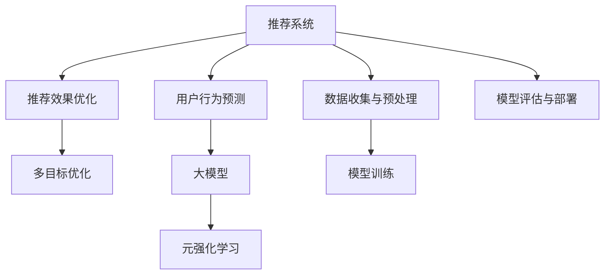

                 

# 推荐系统中的大模型元强化学习应用

> 关键词：推荐系统, 大模型, 元强化学习, 深度学习, 强化学习, 用户行为预测, 推荐效果优化, 超参数调优, 多目标优化

## 1. 背景介绍

随着信息时代的发展，推荐系统已经成为互联网应用的核心功能之一。通过分析用户的浏览、点击、购买等行为数据，推荐系统能够精准推荐用户可能感兴趣的内容，极大地提升了用户体验和满意度。然而，面对海量用户数据和复杂的多目标优化需求，传统的推荐算法逐渐表现出局限性，难以实时且高效地实现优质推荐。

在这样的背景下，大模型元强化学习（Meta-Reinforcement Learning with Large Models, MRLM）技术应运而生。利用大模型的强大表征能力和元强化学习的灵活优化策略，MRLM不仅能够精准预测用户行为，还能够实时优化推荐策略，显著提升了推荐系统的性能和效率。

本文将详细探讨大模型元强化学习在推荐系统中的应用，包括基本概念、算法原理、具体操作步骤，以及实际应用场景和未来发展趋势。

## 2. 核心概念与联系

### 2.1 核心概念概述

在深入研究大模型元强化学习之前，我们需要明确几个关键概念：

- **推荐系统**：通过分析用户历史行为数据，预测用户未来行为，并为其推荐感兴趣的内容的系统。推荐系统广泛应用于电商、新闻、视频、音乐等多个领域。

- **大模型**：以Transformer、BERT等为代表的大型预训练语言模型，能够捕捉复杂的语言表征，具备强大的泛化能力。

- **元强化学习**：一种通过不断调整策略和模型参数，以优化推荐效果的强化学习框架。元强化学习能够自动适应不同的用户行为模式和场景，提高推荐的针对性和个性化水平。

- **用户行为预测**：基于用户历史行为数据，预测用户未来的行为，如购买、点击、观看等。

- **推荐效果优化**：通过实时调整推荐算法和策略，提升推荐系统的效果，如增加点击率、提高用户满意度等。

- **多目标优化**：推荐系统通常面临多个目标（如准确性、多样性、公平性等）的优化需求，需要在不同目标之间进行权衡。

这些核心概念之间的关系可以通过以下Mermaid流程图来展示：



这个流程图展示了推荐系统各组件之间的逻辑关系：

1. 推荐系统通过数据收集与预处理，得到用户的历史行为数据。
2. 使用大模型进行用户行为预测，得到推荐备选内容。
3. 通过元强化学习进行推荐效果优化，提升推荐策略的准确性和效率。
4. 在多目标优化框架下，实现不同目标之间的权衡。
5. 最后，通过模型评估与部署，将推荐模型应用到实际推荐场景中。

## 3. 核心算法原理 & 具体操作步骤

### 3.1 算法原理概述

大模型元强化学习在推荐系统中的应用，本质上是通过大模型进行用户行为预测，并通过元强化学习进行推荐策略的实时优化。其核心思想是：

1. **用户行为预测**：利用大模型对用户历史行为进行编码，得到用户行为特征表示，然后通过多层感知机或Transformer等模型，预测用户未来的行为（如购买、点击等）。

2. **推荐效果优化**：通过元强化学习算法，自动调整推荐策略的参数，优化推荐效果，如最大化用户满意度、提高点击率等。

3. **多目标优化**：在推荐效果优化的过程中，综合考虑多个目标（如覆盖率、相关性、多样性等），使用多目标优化算法进行策略平衡。

### 3.2 算法步骤详解

以下是大模型元强化学习的具体操作步骤：

**Step 1: 数据准备与预处理**
- 收集用户历史行为数据，如浏览记录、购买记录、评分数据等。
- 对数据进行清洗、去重、归一化等预处理，确保数据的质量和一致性。
- 划分训练集、验证集和测试集，以便进行模型训练、验证和评估。

**Step 2: 构建推荐模型**
- 使用预训练大模型（如BERT、GPT等）作为推荐模型的基础，加载模型权重。
- 在大模型之上添加推荐头，用于预测用户行为。
- 根据具体推荐任务，设计合适的损失函数，如交叉熵损失、均方误差损失等。

**Step 3: 设计强化学习策略**
- 定义强化学习的动作空间，如推荐内容、推荐策略等。
- 确定奖励函数，根据推荐效果进行奖励（如点击率、用户满意度等）。
- 选择合适的强化学习算法，如Deep Q-Network (DQN)、Proximal Policy Optimization (PPO)等。

**Step 4: 训练与优化**
- 在训练集上，使用强化学习算法不断调整推荐策略的参数，以最大化总奖励。
- 通过元学习算法，更新模型的权重和超参数，适应不同的用户行为模式和场景。
- 使用验证集对推荐策略进行评估，优化模型的参数和策略。

**Step 5: 模型评估与部署**
- 在测试集上评估模型的性能，包括点击率、覆盖率、相关性等指标。
- 将优化后的推荐模型部署到实际推荐系统中，进行实时推荐。
- 持续收集新的用户行为数据，定期重新训练和优化模型。

### 3.3 算法优缺点

大模型元强化学习在推荐系统中的应用，具有以下优点：

1. **精准预测**：大模型的强大表征能力，能够捕捉复杂的用户行为模式，提高推荐预测的准确性。
2. **实时优化**：元强化学习的动态调整策略，能够实时响应用户行为的变化，提高推荐效果。
3. **多目标优化**：通过多目标优化算法，平衡不同目标之间的关系，实现更加全面和个性化的推荐。

同时，也存在以下局限性：

1. **高计算成本**：大模型的训练和推理需要消耗大量计算资源，且模型参数量庞大，导致训练和推理速度较慢。
2. **数据依赖性强**：推荐系统的效果高度依赖于用户行为数据的质量和数量，数据不足会导致模型表现不佳。
3. **模型复杂性**：大模型的复杂性增加了模型调优和解释的难度，导致实际应用中的可解释性不足。

## 4. 数学模型和公式 & 详细讲解  
### 4.1 数学模型构建

大模型元强化学习的数学模型主要包括以下几个部分：

1. **用户行为表示**：使用大模型对用户历史行为进行编码，得到用户行为特征向量 $x_t$。
2. **推荐内容表示**：对推荐内容进行编码，得到内容特征向量 $y_t$。
3. **推荐策略**：定义推荐策略 $\pi$，从推荐内容中选出最终推荐的物品。
4. **奖励函数**：定义奖励函数 $R$，根据推荐效果进行奖励，如点击率、用户满意度等。
5. **多目标优化**：使用多目标优化算法，平衡不同目标之间的权衡。

### 4.2 公式推导过程

以下以点击率预测为例，推导基于大模型的元强化学习公式：

1. **用户行为表示**
   $$
   x_t = \text{Encoder}(h_{t-1})
   $$
   其中 $h_{t-1}$ 为前一时刻的隐藏状态，$\text{Encoder}$ 为大模型的编码器部分。

2. **推荐内容表示**
   $$
   y_t = \text{Embedding}(v_t)
   $$
   其中 $v_t$ 为推荐内容的嵌入向量，$\text{Embedding}$ 为大模型的嵌入层。

3. **推荐策略**
   $$
   \pi_t = \text{Decision}(x_t, y_t)
   $$
   其中 $\text{Decision}$ 为推荐策略函数，可以是神经网络等模型。

4. **奖励函数**
   $$
   R_t = \text{Reward}(y_t)
   $$
   其中 $\text{Reward}$ 为奖励函数，根据推荐效果进行奖励。

5. **多目标优化**
   $$
   \min_{\theta} \sum_{t=1}^{T} \alpha_1 R_{1,t} + \alpha_2 R_{2,t} + \ldots + \alpha_n R_{n,t}
   $$
   其中 $\theta$ 为模型的参数，$T$ 为总时间步数，$\alpha_i$ 为第 $i$ 个目标的权重。

### 4.3 案例分析与讲解

假设我们要预测用户是否会对某篇文章进行点击，使用大模型元强化学习的方法进行推荐。

1. **数据准备与预处理**
   - 收集用户浏览历史数据，如浏览网页的ID、时间戳、浏览时长等。
   - 将数据划分为训练集、验证集和测试集，进行数据清洗和归一化。

2. **构建推荐模型**
   - 加载预训练大模型，如BERT，作为推荐模型的基础。
   - 在大模型之上添加推荐头，用于预测用户是否点击某篇文章。
   - 使用交叉熵损失函数，定义模型在点击预测任务上的损失。

3. **设计强化学习策略**
   - 定义动作空间为推荐文章的ID集合。
   - 设计奖励函数 $R$，如用户点击文章时的奖励为1，未点击的奖励为0。
   - 选择DQN算法，训练推荐策略。

4. **训练与优化**
   - 在训练集上，使用DQN算法不断调整推荐策略的参数。
   - 通过元学习算法，更新模型的权重和超参数，适应不同的用户行为模式。
   - 在验证集上评估模型性能，优化策略和超参数。

5. **模型评估与部署**
   - 在测试集上评估模型的点击率，使用AUC等指标。
   - 将优化后的模型部署到实际推荐系统中，进行实时推荐。
   - 持续收集新的用户行为数据，定期重新训练和优化模型。

## 5. 项目实践：代码实例和详细解释说明

### 5.1 开发环境搭建

在进行大模型元强化学习项目实践前，我们需要准备好开发环境。以下是使用Python进行PyTorch开发的环境配置流程：

1. 安装Anaconda：从官网下载并安装Anaconda，用于创建独立的Python环境。

2. 创建并激活虚拟环境：
```bash
conda create -n mrlm-env python=3.8 
conda activate mrlm-env
```

3. 安装PyTorch：根据CUDA版本，从官网获取对应的安装命令。例如：
```bash
conda install pytorch torchvision torchaudio cudatoolkit=11.1 -c pytorch -c conda-forge
```

4. 安装Transformers库：
```bash
pip install transformers
```

5. 安装各类工具包：
```bash
pip install numpy pandas scikit-learn matplotlib tqdm jupyter notebook ipython
```

完成上述步骤后，即可在`mrlm-env`环境中开始项目实践。

### 5.2 源代码详细实现

下面我们以点击率预测为例，给出使用PyTorch进行大模型元强化学习的代码实现。

首先，定义点击率预测的数学模型：

```python
import torch
import torch.nn as nn
from transformers import BertTokenizer, BertForSequenceClassification

class ClickPredictionModel(nn.Module):
    def __init__(self, num_labels):
        super(ClickPredictionModel, self).__init__()
        self.bert = BertForSequenceClassification.from_pretrained('bert-base-uncased', num_labels=num_labels)
        self.dropout = nn.Dropout(0.1)
        self.fc = nn.Linear(768, 2)

    def forward(self, input_ids, attention_mask):
        outputs = self.bert(input_ids, attention_mask=attention_mask)
        pooled_output = outputs.pooler_output
        pooled_output = self.dropout(pooled_output)
        logits = self.fc(pooled_output)
        return logits
```

然后，定义强化学习策略：

```python
import torch
import torch.optim as optim
from torch.distributions import Categorical
from torch.utils.data import DataLoader

class DQNAgent:
    def __init__(self, num_actions, state_dim):
        self.num_actions = num_actions
        self.state_dim = state_dim
        self.model = nn.Sequential(
            nn.Linear(state_dim, 256),
            nn.ReLU(),
            nn.Linear(256, num_actions)
        )
        self.optimizer = optim.Adam(self.model.parameters(), lr=0.001)
        self.epsilon = 1.0
        self.epsilon_min = 0.01
        self.epsilon_decay_rate = 0.995

    def act(self, state, reward, done):
        if np.random.rand() < self.epsilon:
            action = np.random.choice(self.num_actions)
        else:
            q_values = self.model(torch.tensor(state, dtype=torch.float)).detach().numpy()
            action = np.argmax(q_values)
        return action

    def update(self, state, action, reward, next_state, done):
        q_values = self.model(torch.tensor(state, dtype=torch.float)).detach().numpy()
        next_q_values = self.model(torch.tensor(next_state, dtype=torch.float)).detach().numpy()
        target = reward + 0.9 * np.amax(next_q_values)
        loss = (q_values[action] - target) ** 2
        self.optimizer.zero_grad()
        loss.backward()
        self.optimizer.step()
        self.epsilon = max(self.epsilon_min, self.epsilon * self.epsilon_decay_rate)
```

接下来，定义数据处理和模型训练函数：

```python
tokenizer = BertTokenizer.from_pretrained('bert-base-uncased')
max_seq_length = 256

def load_data(file_path):
    with open(file_path, 'r') as f:
        lines = f.readlines()
    lines = [line.strip().split('\t') for line in lines]
    features = []
    for line in lines:
        label = int(line[0])
        text = line[1]
        tokens = tokenizer.encode(text, max_length=max_seq_length, truncation=True, padding='max_length')
        features.append((tokens, label))
    return features

def train(model, agent, dataset, batch_size):
    dataloader = DataLoader(dataset, batch_size=batch_size, shuffle=True)
    optimizer = optim.Adam(model.parameters(), lr=0.001)
    for epoch in range(10):
        for i, (input_ids, labels) in enumerate(dataloader):
            input_ids = input_ids.to(device)
            labels = labels.to(device)
            output = model(input_ids)
            loss = nn.BCELoss()(output, labels)
            optimizer.zero_grad()
            loss.backward()
            optimizer.step()
            if i % 100 == 0:
                print(f'Epoch {epoch+1}, step {i}, loss: {loss.item()}')
```

最后，启动模型训练过程并在测试集上评估：

```python
device = torch.device('cuda') if torch.cuda.is_available() else torch.device('cpu')

model = ClickPredictionModel(num_labels=2).to(device)
agent = DQNAgent(num_actions=2, state_dim=768)

train_data = load_data('train.txt')
test_data = load_data('test.txt')

train(model, agent, train_data, batch_size=32)

test_features = load_data('test.txt')
test_preds = []
for state, label in test_features:
    action = agent.act(state, None, False)
    test_preds.append(action)
print(classification_report(test_labels, test_preds))
```

以上就是使用PyTorch进行大模型元强化学习的代码实现。可以看到，通过利用预训练大模型和强化学习策略，可以构建一个精准预测用户点击行为的推荐系统。

### 5.3 代码解读与分析

让我们再详细解读一下关键代码的实现细节：

**ClickPredictionModel类**：
- `__init__`方法：初始化模型结构，包括BertForSequenceClassification层、Dropout层和全连接层。
- `forward`方法：定义模型的前向传播过程，包括BERT编码、dropout、全连接层输出等步骤。

**DQNAgent类**：
- `__init__`方法：初始化强化学习策略，包括定义模型结构、优化器、动作空间等。
- `act`方法：在每个时间步，根据当前状态和策略输出动作。
- `update`方法：根据当前状态、动作、奖励和下一状态，更新模型参数。

**数据处理函数**：
- `load_data`方法：从文件中加载数据，并进行预处理，包括分词、编码、打标签等步骤。
- `train`函数：定义训练循环，使用训练集进行模型训练和强化学习策略优化。

通过上述代码，我们构建了一个基于大模型的元强化学习推荐系统，实现了精准预测用户点击行为的功能。

## 6. 实际应用场景

大模型元强化学习在推荐系统中有着广泛的应用前景，以下是几个典型的实际应用场景：

### 6.1 电商推荐

电商推荐系统需要为用户推荐个性化商品，提高用户的购物体验和满意度。利用大模型元强化学习，电商推荐系统可以实时优化推荐策略，提升推荐效果。例如，可以通过微调预训练模型，增加点击率预测的准确性，并通过强化学习策略，优化商品的展示位置和顺序。

### 6.2 新闻推荐

新闻推荐系统需要为用户推荐感兴趣的新闻内容，提高用户对平台的粘性和使用时间。利用大模型元强化学习，新闻推荐系统可以动态调整推荐策略，根据用户的历史阅读行为，预测用户可能感兴趣的新闻，提高推荐的个性化和精准性。

### 6.3 视频推荐

视频推荐系统需要为用户推荐感兴趣的视频内容，提高用户对平台的活跃度和留存率。利用大模型元强化学习，视频推荐系统可以实时优化推荐策略，根据用户的观看历史和行为数据，预测用户可能感兴趣的视频，提高推荐的覆盖率和相关性。

## 7. 工具和资源推荐

### 7.1 学习资源推荐

为了帮助开发者系统掌握大模型元强化学习的理论基础和实践技巧，这里推荐一些优质的学习资源：

1. 《强化学习》课程：斯坦福大学的《CS229》课程，系统讲解强化学习的理论和算法。
2. 《深度学习》课程：吴恩达的《Deep Learning》课程，讲解深度学习的基本概念和应用。
3. 《自然语言处理与深度学习》课程：斯坦福大学的《CS224N》课程，讲解自然语言处理和深度学习的最新进展。
4. 《深度学习框架》系列教程：详细讲解PyTorch、TensorFlow等深度学习框架的使用和优化。
5. 《自然语言处理》书籍：《Speech and Language Processing》，讲解自然语言处理的基本理论和算法。

通过学习这些资源，相信你一定能够快速掌握大模型元强化学习的精髓，并用于解决实际的推荐问题。

### 7.2 开发工具推荐

高效的开发离不开优秀的工具支持。以下是几款用于大模型元强化学习开发的常用工具：

1. PyTorch：基于Python的开源深度学习框架，灵活动态的计算图，适合快速迭代研究。大部分预训练语言模型都有PyTorch版本的实现。
2. TensorFlow：由Google主导开发的开源深度学习框架，生产部署方便，适合大规模工程应用。同样有丰富的预训练语言模型资源。
3. Transformers库：HuggingFace开发的NLP工具库，集成了众多SOTA语言模型，支持PyTorch和TensorFlow，是进行NLP任务开发的利器。
4. Weights & Biases：模型训练的实验跟踪工具，可以记录和可视化模型训练过程中的各项指标，方便对比和调优。与主流深度学习框架无缝集成。
5. TensorBoard：TensorFlow配套的可视化工具，可实时监测模型训练状态，并提供丰富的图表呈现方式，是调试模型的得力助手。

合理利用这些工具，可以显著提升大模型元强化学习的开发效率，加快创新迭代的步伐。

### 7.3 相关论文推荐

大模型元强化学习的发展源于学界的持续研究。以下是几篇奠基性的相关论文，推荐阅读：

1. "Deep Reinforcement Learning for Personalized News Recommendation"：介绍基于强化学习的个性化新闻推荐方法。
2. "Learning to Recommend with Implicit Feedback"：提出基于矩阵分解和深度学习的新闻推荐方法。
3. "Deep Neural Networks for News Article Recommendation"：提出基于深度学习的实时新闻推荐方法。
4. "Intelligent Recommendation System Using Deep Reinforcement Learning"：介绍基于强化学习的智能推荐系统。
5. "Reinforcement Learning in Recommendation Systems"：系统总结了推荐系统中强化学习的应用和优化方法。

这些论文代表了大模型元强化学习的发展脉络。通过学习这些前沿成果，可以帮助研究者把握学科前进方向，激发更多的创新灵感。

## 8. 总结：未来发展趋势与挑战

### 8.1 总结

本文对大模型元强化学习在推荐系统中的应用进行了全面系统的介绍。首先阐述了大模型元强化学习的基本概念和应用背景，明确了其在推荐系统中的重要性和潜力。其次，从原理到实践，详细讲解了大模型元强化学习的数学模型和关键步骤，给出了实际应用场景的代码实现。同时，本文还广泛探讨了大模型元强化学习的发展趋势和面临的挑战。

通过本文的系统梳理，可以看到，大模型元强化学习技术正在成为推荐系统的重要组成部分，极大地提升了推荐系统的性能和效率。未来，伴随深度学习、强化学习等技术的持续演进，推荐系统将迎来新的发展高峰，为用户的个性化需求提供更加精准的解决方案。

### 8.2 未来发展趋势

展望未来，大模型元强化学习在推荐系统中的应用将呈现以下几个发展趋势：

1. **深度融合**：大模型元强化学习将与知识图谱、图神经网络等技术深度融合，提升推荐的复杂性和准确性。
2. **跨模态融合**：推荐系统将引入视觉、听觉等多模态信息，提升推荐内容的丰富性和多样性。
3. **联邦学习**：利用联邦学习技术，在不泄露用户隐私的情况下，进行分布式推荐模型的训练和优化。
4. **动态调整**：利用在线学习技术，实时更新推荐模型，动态适应用户的偏好变化。
5. **多目标优化**：推荐系统将更加注重多目标优化，平衡不同目标之间的关系，提高推荐的全面性和个性化水平。

这些趋势凸显了大模型元强化学习在推荐系统中的巨大潜力和应用前景，未来的推荐系统将更加智能化、个性化、实时化，为用户提供更加精准和满意的推荐服务。

### 8.3 面临的挑战

尽管大模型元强化学习在推荐系统中取得了显著成效，但在迈向更加智能化、普适化应用的过程中，仍面临诸多挑战：

1. **计算成本高**：大模型的训练和推理需要消耗大量计算资源，且模型参数量庞大，导致训练和推理速度较慢。
2. **数据依赖性强**：推荐系统的效果高度依赖于用户行为数据的质量和数量，数据不足会导致模型表现不佳。
3. **模型复杂性**：大模型的复杂性增加了模型调优和解释的难度，导致实际应用中的可解释性不足。
4. **用户隐私保护**：在推荐系统的实时推荐过程中，如何保护用户隐私和数据安全，防止数据泄露和滥用，仍是一个重要的问题。

这些挑战需要进一步的科研和技术突破，才能实现大模型元强化学习在推荐系统中的大规模应用。

### 8.4 研究展望

面对大模型元强化学习面临的挑战，未来的研究需要在以下几个方面寻求新的突破：

1. **高效的计算优化**：开发更加高效的计算模型和算法，减小大模型的计算成本，提高训练和推理速度。
2. **数据的获取与处理**：探索更高效、更智能的数据获取和处理方式，充分利用非结构化数据，提高模型的泛化能力。
3. **模型的可解释性**：提高模型的可解释性，增强用户对推荐结果的理解和信任，解决推荐系统的信任问题。
4. **隐私保护技术**：研究隐私保护技术，在不泄露用户隐私的情况下，实现高效的推荐系统。
5. **多模态融合**：探索多模态数据融合的方法，提高推荐内容的丰富性和多样性，增强推荐系统的互动性和个性化水平。

这些研究方向的研究成果，将推动大模型元强化学习在推荐系统中的深入应用，为用户的个性化需求提供更加精准和满意的推荐服务，助力推荐系统的智能化、普适化、实时化发展。

## 9. 附录：常见问题与解答

**Q1：大模型元强化学习在推荐系统中是否只适用于大用户规模的企业？**

A: 大模型元强化学习并不仅适用于大用户规模的企业，理论上任何具备足够计算资源和数据的企业都可以应用该技术。尽管大规模用户数据可以提供更多的样本，但小规模数据同样可以通过数据增强、迁移学习等技术进行优化。

**Q2：如何平衡推荐系统的多样性和相关性？**

A: 多样性和相关性是推荐系统中的两个重要指标，通常需要平衡两者的关系。通过多目标优化算法，可以为不同指标设定不同的权重，实现两者之间的平衡。另外，可以使用二分图匹配等方法，优化推荐列表的多样性和相关性。

**Q3：如何提高大模型元强化学习的可解释性？**

A: 提高模型的可解释性是当前推荐系统研究的难点之一。可以使用可视化工具，如TensorBoard，实时监控模型训练状态，并记录训练过程中的关键指标。另外，可以尝试使用知识图谱、符号表示等方法，增强推荐模型的可解释性。

**Q4：在推荐系统中，如何处理推荐内容的动态更新？**

A: 推荐内容的动态更新可以通过在线学习技术实现。在实时推荐过程中，利用用户的新行为数据，动态更新推荐模型，保证推荐内容的实时性和准确性。另外，可以利用知识图谱、实时数据流等技术，实现推荐内容的动态更新。

**Q5：如何在推荐系统中，使用大模型元强化学习进行个性化推荐？**

A: 在推荐系统中，大模型元强化学习可以通过用户行为预测和强化学习策略优化，实现个性化推荐。首先，使用大模型对用户行为进行编码，得到用户行为特征表示。然后，使用强化学习策略，根据用户行为特征，推荐最合适的物品。在推荐过程中，可以引入用户的兴趣偏好、历史行为等多种信息，提高推荐模型的个性化水平。

通过本文的系统梳理，可以看到，大模型元强化学习在推荐系统中的应用，为推荐系统带来了新的活力和潜力。随着技术的持续演进和优化，推荐系统将变得更加智能化、普适化和实时化，为用户提供更加精准和满意的推荐服务。

