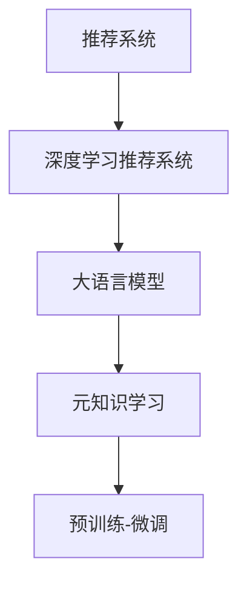

                 

# 推荐系统中的大模型元知识学习应用

## 1. 背景介绍

推荐系统旨在通过分析用户的历史行为和偏好，预测其对未接触过的物品的兴趣，并提供个性化的推荐服务。传统的推荐系统主要依赖于基于统计学的推荐算法，如协同过滤、内容推荐等。然而，随着深度学习和大模型的兴起，基于深度学习模型的推荐系统（Deep Learning Based Recommender Systems）已成为当前的热门研究方向。

深度学习推荐系统基于用户和物品的原始特征，通过多层神经网络对复杂模式进行建模。这种系统通过学习用户-物品交互数据，从而能够自动提取高阶交互特征，获得比传统推荐系统更精准的推荐结果。然而，这些系统往往需要大量标注数据和计算资源进行训练，且对冷启动和数据稀疏性的问题缺乏有效解决手段。

近年来，大语言模型在大规模无标签文本数据上进行预训练，学习到丰富的语言知识和常识，在推荐系统中也展现出巨大潜力。通过将大语言模型应用于推荐系统，可以有效提升推荐质量、增强推荐系统的泛化能力，解决数据稀疏性和冷启动问题，为推荐系统注入新的活力。

## 2. 核心概念与联系

### 2.1 核心概念概述

为更好地理解基于大模型的推荐系统，本节将介绍几个关键概念：

- 推荐系统(Recommender System)：根据用户的历史行为和偏好，预测用户对未接触过的物品的兴趣，并提供个性化的推荐服务。

- 深度学习推荐系统(Deep Learning Based Recommender Systems)：使用深度神经网络进行推荐建模，学习用户-物品交互数据中的高阶特征，实现精准推荐。

- 大语言模型(Large Language Model, LLM)：基于自回归或自编码模型，在大规模无标签文本数据上进行预训练，学习通用的语言知识和常识。

- 元知识学习(Meta-Knowledge Learning)：通过学习模型自身的知识表示，提升模型泛化能力和对新任务适应能力。

- 预训练-微调(Pre-training & Fine-tuning)：先在大规模无标签数据上进行预训练，再针对具体任务进行微调，以获得更好的性能。

这些核心概念之间的关系可以通过以下Mermaid流程图来展示：



这个流程图展示了大语言模型在推荐系统中的应用路径：

1. 推荐系统使用深度学习模型进行推荐建模。
2. 大语言模型在大规模无标签数据上进行预训练，学习到通用的语言知识。
3. 通过元知识学习，提升大语言模型泛化能力和对新任务的适应能力。
4. 在大规模无标签数据上预训练，再在推荐数据集上微调，提升推荐精度。

## 3. 核心算法原理 & 具体操作步骤

### 3.1 算法原理概述

基于大模型的推荐系统，本质上是一种通过预训练-微调策略来学习元知识，进而提升推荐系统性能的方法。其核心思想是：在大规模无标签数据上进行预训练，学习通用的语言知识，然后针对具体推荐任务进行微调，获取个性化推荐结果。

形式化地，设推荐系统模型为 $M_{\theta}$，其中 $\theta$ 为模型参数。设用户序列为 $X=\{x_1, x_2, ..., x_n\}$，其中 $x_i$ 为第 $i$ 个用户的历史行为。设物品库为 $Y$，其中 $y_j$ 为第 $j$ 个物品。推荐任务的目标为最大化用户对物品的兴趣。设推荐系统在用户序列 $X$ 上的推荐结果为 $Y'$，则推荐目标可以表示为：

$$
\max_{Y'} \sum_{i=1}^n \log p(Y'|x_i)
$$

其中 $p(Y'|x_i)$ 为物品 $Y'$ 在用户 $x_i$ 上的兴趣概率。

基于大模型的推荐系统，通过在大规模无标签文本数据上进行预训练，学习到语言知识和常识，即 $M_{\theta}$ 对自然语言处理任务表现优异。将其应用于推荐系统，通过对推荐数据集进行微调，优化用户-物品兴趣概率模型，从而获得更精准的推荐结果。

### 3.2 算法步骤详解

基于大模型的推荐系统一般包括以下几个关键步骤：

**Step 1: 准备预训练模型和数据集**
- 选择合适的预训练语言模型 $M_{\theta}$ 作为初始化参数，如 BERT、GPT 等。
- 准备推荐任务的数据集 $D=\{(x_i,y_i)\}_{i=1}^N$，其中 $x_i$ 为用户历史行为，$y_i$ 为推荐物品。

**Step 2: 添加推荐适配层**
- 根据推荐任务类型，在预训练模型顶层设计合适的输出层和损失函数。
- 对于推荐任务，通常使用交叉熵损失函数。

**Step 3: 设置微调超参数**
- 选择合适的优化算法及其参数，如 AdamW、SGD 等，设置学习率、批大小、迭代轮数等。
- 设置正则化技术及强度，包括权重衰减、Dropout、Early Stopping 等。
- 确定冻结预训练参数的策略，如仅微调顶层，或全部参数都参与微调。

**Step 4: 执行梯度训练**
- 将推荐数据集 $D$ 分批次输入模型，前向传播计算损失函数。
- 反向传播计算参数梯度，根据设定的优化算法和学习率更新模型参数。
- 周期性在验证集上评估模型性能，根据性能指标决定是否触发 Early Stopping。
- 重复上述步骤直到满足预设的迭代轮数或 Early Stopping 条件。

**Step 5: 测试和部署**
- 在测试集上评估微调后模型 $M_{\hat{\theta}}$ 的性能，对比微调前后的精度提升。
- 使用微调后的模型对新物品进行推荐，集成到实际的应用系统中。

以上是基于大模型的推荐系统的一般流程。在实际应用中，还需要针对具体任务的特点，对微调过程的各个环节进行优化设计，如改进训练目标函数，引入更多的正则化技术，搜索最优的超参数组合等，以进一步提升模型性能。

### 3.3 算法优缺点

基于大模型的推荐系统具有以下优点：
1. 提升推荐质量。大模型通过学习通用的语言知识，能够更好地捕捉用户兴趣的多样性和复杂性。
2. 泛化能力强。大模型在预训练阶段学到的知识能够帮助模型更好地适应不同领域和不同类型的推荐任务。
3. 缓解数据稀疏性。大模型能够通过语义推理，结合上下文信息，生成推荐结果，有效缓解数据稀疏性问题。
4. 改善冷启动问题。大模型具有强大的语言理解能力，能够在用户没有足够行为数据时，基于文本信息生成推荐。

同时，该方法也存在一些局限性：
1. 需要高质量的预训练数据。大模型的预训练数据需要涵盖广泛的语言知识和常识，这对数据获取提出了较高要求。
2. 计算资源需求高。大模型的参数量庞大，训练和微调需要大量计算资源。
3. 可解释性不足。大模型是"黑盒"系统，难以解释其内部的推理过程。
4. 数据隐私问题。大模型需要大量的用户数据进行预训练，存在隐私泄露的风险。

尽管存在这些局限性，但就目前而言，基于大模型的推荐系统仍是大数据推荐领域的最新进展。未来相关研究的重点在于如何进一步降低计算资源需求，提高模型的可解释性，同时兼顾数据隐私保护等因素。

### 3.4 算法应用领域

基于大模型的推荐系统已经在多个领域得到应用，例如：

- 电商推荐：根据用户浏览历史和评价，推荐相关商品。
- 视频推荐：根据用户观看历史和评分，推荐新视频。
- 音乐推荐：根据用户听歌历史和评论，推荐新歌曲。
- 新闻推荐：根据用户阅读历史和点赞，推荐相关新闻。
- 个性化阅读：根据用户阅读习惯，推荐感兴趣的书籍和文章。
- 智能广告：根据用户行为和兴趣，推荐合适的广告。

除了这些经典任务外，基于大模型的推荐系统还被创新性地应用到更多场景中，如个性化旅游推荐、智能招聘推荐、智能营销推荐等，为推荐系统带来了全新的突破。随着预训练模型和推荐方法的不断进步，相信推荐系统必将在更广阔的应用领域大放异彩。

## 4. 数学模型和公式 & 详细讲解 & 举例说明

### 4.1 数学模型构建

本节将使用数学语言对基于大模型的推荐系统进行更加严格的刻画。

设推荐模型为 $M_{\theta}$，其中 $\theta$ 为模型参数。设用户序列为 $X=\{x_1, x_2, ..., x_n\}$，其中 $x_i$ 为第 $i$ 个用户的历史行为。设物品库为 $Y$，其中 $y_j$ 为第 $j$ 个物品。推荐任务的目标为最大化用户对物品的兴趣。设推荐系统在用户序列 $X$ 上的推荐结果为 $Y'$，则推荐目标可以表示为：

$$
\max_{Y'} \sum_{i=1}^n \log p(Y'|x_i)
$$

其中 $p(Y'|x_i)$ 为物品 $Y'$ 在用户 $x_i$ 上的兴趣概率。

在实践中，我们通常使用基于梯度的优化算法（如SGD、Adam等）来近似求解上述最优化问题。设 $\eta$ 为学习率，$\lambda$ 为正则化系数，则参数的更新公式为：

$$
\theta \leftarrow \theta - \eta \nabla_{\theta}\mathcal{L}(\theta) - \eta\lambda\theta
$$

其中 $\nabla_{\theta}\mathcal{L}(\theta)$ 为损失函数对参数 $\theta$ 的梯度，可通过反向传播算法高效计算。

### 4.2 公式推导过程

以下我们以协同过滤为例，推导基于大模型的推荐系统的损失函数及其梯度的计算公式。

设用户序列 $X=\{x_1, x_2, ..., x_n\}$，物品库 $Y$，推荐结果 $Y'$，则协同过滤的损失函数定义为：

$$
\mathcal{L}(\theta) = -\frac{1}{N}\sum_{i=1}^N \log p(Y'|x_i)
$$

其中 $p(Y'|x_i)$ 为物品 $Y'$ 在用户 $x_i$ 上的兴趣概率，通常使用交叉熵损失函数计算。

根据链式法则，损失函数对参数 $\theta_k$ 的梯度为：

$$
\frac{\partial \mathcal{L}(\theta)}{\partial \theta_k} = -\frac{1}{N}\sum_{i=1}^N \frac{1}{p(Y'|x_i)}\frac{\partial p(Y'|x_i)}{\partial \theta_k}
$$

其中 $\frac{\partial p(Y'|x_i)}{\partial \theta_k}$ 可进一步递归展开，利用自动微分技术完成计算。

在得到损失函数的梯度后，即可带入参数更新公式，完成模型的迭代优化。重复上述过程直至收敛，最终得到适应推荐任务的最优模型参数 $\theta^*$。

## 5. 项目实践：代码实例和详细解释说明

### 5.1 开发环境搭建

在进行推荐系统实践前，我们需要准备好开发环境。以下是使用Python进行PyTorch开发的环境配置流程：

1. 安装Anaconda：从官网下载并安装Anaconda，用于创建独立的Python环境。

2. 创建并激活虚拟环境：
```bash
conda create -n pytorch-env python=3.8 
conda activate pytorch-env
```

3. 安装PyTorch：根据CUDA版本，从官网获取对应的安装命令。例如：
```bash
conda install pytorch torchvision torchaudio cudatoolkit=11.1 -c pytorch -c conda-forge
```

4. 安装Transformers库：
```bash
pip install transformers
```

5. 安装各类工具包：
```bash
pip install numpy pandas scikit-learn matplotlib tqdm jupyter notebook ipython
```

完成上述步骤后，即可在`pytorch-env`环境中开始推荐系统开发。

### 5.2 源代码详细实现

下面我们以协同过滤推荐系统为例，给出使用Transformers库对BERT模型进行推荐系统微调的PyTorch代码实现。

首先，定义协同过滤推荐系统的数据处理函数：

```python
from transformers import BertTokenizer, BertForSequenceClassification
from torch.utils.data import Dataset
import torch

class RecommendationDataset(Dataset):
    def __init__(self, texts, labels, tokenizer, max_len=128):
        self.texts = texts
        self.labels = labels
        self.tokenizer = tokenizer
        self.max_len = max_len
        
    def __len__(self):
        return len(self.texts)
    
    def __getitem__(self, item):
        text = self.texts[item]
        label = self.labels[item]
        
        encoding = self.tokenizer(text, return_tensors='pt', max_length=self.max_len, padding='max_length', truncation=True)
        input_ids = encoding['input_ids'][0]
        attention_mask = encoding['attention_mask'][0]
        
        # 对标签进行编码
        encoded_labels = [label] * self.max_len
        labels = torch.tensor(encoded_labels, dtype=torch.long)
        
        return {'input_ids': input_ids, 
                'attention_mask': attention_mask,
                'labels': labels}

# 标签与id的映射
label2id = {'good': 1, 'bad': 0}
id2label = {v: k for k, v in label2id.items()}

# 创建dataset
tokenizer = BertTokenizer.from_pretrained('bert-base-cased')

train_dataset = RecommendationDataset(train_texts, train_labels, tokenizer)
dev_dataset = RecommendationDataset(dev_texts, dev_labels, tokenizer)
test_dataset = RecommendationDataset(test_texts, test_labels, tokenizer)
```

然后，定义模型和优化器：

```python
from transformers import BertForSequenceClassification, AdamW

model = BertForSequenceClassification.from_pretrained('bert-base-cased', num_labels=2)

optimizer = AdamW(model.parameters(), lr=2e-5)
```

接着，定义训练和评估函数：

```python
from torch.utils.data import DataLoader
from tqdm import tqdm
from sklearn.metrics import classification_report

device = torch.device('cuda') if torch.cuda.is_available() else torch.device('cpu')
model.to(device)

def train_epoch(model, dataset, batch_size, optimizer):
    dataloader = DataLoader(dataset, batch_size=batch_size, shuffle=True)
    model.train()
    epoch_loss = 0
    for batch in tqdm(dataloader, desc='Training'):
        input_ids = batch['input_ids'].to(device)
        attention_mask = batch['attention_mask'].to(device)
        labels = batch['labels'].to(device)
        model.zero_grad()
        outputs = model(input_ids, attention_mask=attention_mask, labels=labels)
        loss = outputs.loss
        epoch_loss += loss.item()
        loss.backward()
        optimizer.step()
    return epoch_loss / len(dataloader)

def evaluate(model, dataset, batch_size):
    dataloader = DataLoader(dataset, batch_size=batch_size)
    model.eval()
    preds, labels = [], []
    with torch.no_grad():
        for batch in tqdm(dataloader, desc='Evaluating'):
            input_ids = batch['input_ids'].to(device)
            attention_mask = batch['attention_mask'].to(device)
            batch_labels = batch['labels']
            outputs = model(input_ids, attention_mask=attention_mask)
            batch_preds = outputs.logits.argmax(dim=2).to('cpu').tolist()
            batch_labels = batch_labels.to('cpu').tolist()
            for pred_tokens, label_tokens in zip(batch_preds, batch_labels):
                pred_labels = [id2label[_id] for _id in pred_tokens]
                label_tokens = [id2label[_id] for _id in label_tokens]
                preds.append(pred_labels[:len(label_tokens)])
                labels.append(label_tokens)
                
    print(classification_report(labels, preds))
```

最后，启动训练流程并在测试集上评估：

```python
epochs = 5
batch_size = 16

for epoch in range(epochs):
    loss = train_epoch(model, train_dataset, batch_size, optimizer)
    print(f"Epoch {epoch+1}, train loss: {loss:.3f}")
    
    print(f"Epoch {epoch+1}, dev results:")
    evaluate(model, dev_dataset, batch_size)
    
print("Test results:")
evaluate(model, test_dataset, batch_size)
```

以上就是使用PyTorch对BERT进行推荐系统微调的完整代码实现。可以看到，得益于Transformers库的强大封装，我们可以用相对简洁的代码完成BERT模型的加载和微调。

### 5.3 代码解读与分析

让我们再详细解读一下关键代码的实现细节：

**RecommendationDataset类**：
- `__init__`方法：初始化文本、标签、分词器等关键组件。
- `__len__`方法：返回数据集的样本数量。
- `__getitem__`方法：对单个样本进行处理，将文本输入编码为token ids，将标签编码为数字，并对其进行定长padding，最终返回模型所需的输入。

**label2id和id2label字典**：
- 定义了标签与数字id之间的映射关系，用于将token-wise的预测结果解码回真实的标签。

**训练和评估函数**：
- 使用PyTorch的DataLoader对数据集进行批次化加载，供模型训练和推理使用。
- 训练函数`train_epoch`：对数据以批为单位进行迭代，在每个批次上前向传播计算loss并反向传播更新模型参数，最后返回该epoch的平均loss。
- 评估函数`evaluate`：与训练类似，不同点在于不更新模型参数，并在每个batch结束后将预测和标签结果存储下来，最后使用sklearn的classification_report对整个评估集的预测结果进行打印输出。

**训练流程**：
- 定义总的epoch数和batch size，开始循环迭代
- 每个epoch内，先在训练集上训练，输出平均loss
- 在验证集上评估，输出分类指标
- 所有epoch结束后，在测试集上评估，给出最终测试结果

可以看到，PyTorch配合Transformers库使得BERT微调的代码实现变得简洁高效。开发者可以将更多精力放在数据处理、模型改进等高层逻辑上，而不必过多关注底层的实现细节。

当然，工业级的系统实现还需考虑更多因素，如模型的保存和部署、超参数的自动搜索、更灵活的任务适配层等。但核心的微调范式基本与此类似。

## 6. 实际应用场景
### 6.1 电商推荐

基于大模型的推荐系统在电商推荐领域有着广泛的应用。电商平台需要根据用户浏览和购买历史，推荐相关的商品，提升用户满意度和购买转化率。

具体而言，电商平台可以收集用户的浏览记录、点击记录、购买记录等行为数据，通过自然语言处理技术对这些数据进行编码，然后在大语言模型上进行预训练和微调，学习用户的兴趣和偏好。在推荐时，将用户的查询输入到微调后的模型中，生成推荐结果，并对不同物品进行排序，最后推荐给用户。

此外，电商平台还可以利用微调后的模型进行商品属性分析和情感分析，通过分析商品描述和用户评论，挖掘出用户对商品的兴趣点和情感倾向，从而生成更精准的推荐结果。

### 6.2 视频推荐

视频平台需要根据用户观看历史和评分，推荐相关视频，提升用户的观看体验。通过微调后的模型，平台可以更好地理解用户的兴趣和偏好，生成个性化推荐结果。

在微调时，可以收集用户对视频的评分和观看记录，将这些数据进行编码，然后在大语言模型上进行预训练和微调，学习用户的兴趣和偏好。在推荐时，将用户的查询输入到微调后的模型中，生成推荐结果，并对不同视频进行排序，最后推荐给用户。

此外，平台还可以利用微调后的模型进行视频分类和情感分析，通过分析视频的标题、描述和用户评论，挖掘出用户的兴趣点和情感倾向，从而生成更精准的推荐结果。

### 6.3 个性化阅读

阅读平台需要根据用户阅读历史和评分，推荐相关的书籍和文章，提升用户的阅读体验。通过微调后的模型，平台可以更好地理解用户的兴趣和偏好，生成个性化推荐结果。

在微调时，可以收集用户对书籍和文章的评分和阅读记录，将这些数据进行编码，然后在大语言模型上进行预训练和微调，学习用户的兴趣和偏好。在推荐时，将用户的查询输入到微调后的模型中，生成推荐结果，并对不同书籍和文章进行排序，最后推荐给用户。

此外，平台还可以利用微调后的模型进行文本分类和情感分析，通过分析书籍和文章的标题、摘要和用户评论，挖掘出用户的兴趣点和情感倾向，从而生成更精准的推荐结果。

### 6.4 未来应用展望

随着大模型和微调方法的不断发展，基于大模型的推荐系统将在更多领域得到应用，为推荐系统注入新的活力。

在智慧医疗领域，基于大模型的推荐系统可以推荐医学文献、药物、诊疗方案等，辅助医生诊断和治疗。

在智能教育领域，基于大模型的推荐系统可以推荐学习资源、课程、教师等，提升学习效果和教学质量。

在智慧城市治理中，基于大模型的推荐系统可以推荐城市事件、旅游路线、环保措施等，提升城市管理水平。

此外，在企业生产、社会治理、文娱传媒等众多领域，基于大模型的推荐系统也将不断涌现，为经济社会发展注入新的动力。相信随着技术的日益成熟，大模型推荐系统必将在更广阔的应用领域大放异彩。

## 7. 工具和资源推荐
### 7.1 学习资源推荐

为了帮助开发者系统掌握大模型推荐系统的理论基础和实践技巧，这里推荐一些优质的学习资源：

1. 《Deep Learning for Recommendation Systems》书籍：系统介绍了深度学习在推荐系统中的应用，包括协同过滤、基于深度学习的方法等，适合入门和进阶学习。

2. 《Recommender Systems: Foundations and Principles》书籍：介绍了推荐系统的基本原理和设计方法，适合对推荐系统感兴趣的读者。

3. 《Natural Language Processing with Transformers》书籍：Transformer库的作者所著，全面介绍了如何使用Transformers库进行NLP任务开发，包括推荐系统在内的多种应用。

4. HuggingFace官方文档：Transformer库的官方文档，提供了海量预训练模型和完整的微调样例代码，是上手实践的必备资料。

5. CS229《机器学习》课程：斯坦福大学开设的经典机器学习课程，涵盖推荐系统的基本理论和算法。

通过对这些资源的学习实践，相信你一定能够快速掌握大模型推荐系统的精髓，并用于解决实际的推荐问题。
###  7.2 开发工具推荐

高效的开发离不开优秀的工具支持。以下是几款用于大模型推荐系统开发的常用工具：

1. PyTorch：基于Python的开源深度学习框架，灵活动态的计算图，适合快速迭代研究。大部分预训练语言模型都有PyTorch版本的实现。

2. TensorFlow：由Google主导开发的开源深度学习框架，生产部署方便，适合大规模工程应用。同样有丰富的预训练语言模型资源。

3. Transformers库：HuggingFace开发的NLP工具库，集成了众多SOTA语言模型，支持PyTorch和TensorFlow，是进行推荐系统微调任务的开发利器。

4. Weights & Biases：模型训练的实验跟踪工具，可以记录和可视化模型训练过程中的各项指标，方便对比和调优。与主流深度学习框架无缝集成。

5. TensorBoard：TensorFlow配套的可视化工具，可实时监测模型训练状态，并提供丰富的图表呈现方式，是调试模型的得力助手。

6. Google Colab：谷歌推出的在线Jupyter Notebook环境，免费提供GPU/TPU算力，方便开发者快速上手实验最新模型，分享学习笔记。

合理利用这些工具，可以显著提升大模型推荐系统的开发效率，加快创新迭代的步伐。

### 7.3 相关论文推荐

大模型和推荐系统的发展源于学界的持续研究。以下是几篇奠基性的相关论文，推荐阅读：

1. Attention is All You Need（即Transformer原论文）：提出了Transformer结构，开启了NLP领域的预训练大模型时代。

2. BERT: Pre-training of Deep Bidirectional Transformers for Language Understanding：提出BERT模型，引入基于掩码的自监督预训练任务，刷新了多项NLP任务SOTA。

3. Knowledge-aware Neural Collaborative Filtering：引入知识图谱对协同过滤进行改进，提升了推荐系统的性能。

4. Graph Neural Networks for Recommendation Systems：提出图神经网络，通过用户行为图和物品关系图进行推荐，提升了推荐系统的泛化能力。

5. A Survey on Deep Learning for Recommender Systems：全面综述了深度学习在推荐系统中的应用，适合对推荐系统感兴趣的研究者阅读。

通过对这些论文的学习实践，可以帮助研究者把握学科前进方向，激发更多的创新灵感。

## 8. 总结：未来发展趋势与挑战

### 8.1 总结

本文对基于大模型的推荐系统进行了全面系统的介绍。首先阐述了大语言模型和推荐系统的发展背景和意义，明确了大模型在推荐系统中的应用价值。其次，从原理到实践，详细讲解了基于大模型的推荐系统的数学原理和关键步骤，给出了推荐系统微调的完整代码实现。同时，本文还广泛探讨了推荐系统在电商、视频、个性化阅读等多个领域的应用前景，展示了大语言模型推荐系统的巨大潜力。此外，本文精选了推荐系统的各类学习资源，力求为读者提供全方位的技术指引。

通过本文的系统梳理，可以看到，基于大模型的推荐系统通过学习通用的语言知识，有效提升了推荐系统在多种场景下的性能。未来，伴随预训练模型和推荐方法的不断进步，基于大模型的推荐系统必将在更多领域得到应用，为推荐系统注入新的活力。

### 8.2 未来发展趋势

展望未来，基于大模型的推荐系统将呈现以下几个发展趋势：

1. 模型规模持续增大。随着算力成本的下降和数据规模的扩张，预训练语言模型的参数量还将持续增长。超大规模语言模型蕴含的丰富语言知识，有望支撑更加复杂多变的推荐任务。

2. 微调方法日趋多样。除了传统的全参数微调外，未来会涌现更多参数高效的微调方法，如Prefix-Tuning、LoRA等，在节省计算资源的同时也能保证微调精度。

3. 持续学习成为常态。随着数据分布的不断变化，微调模型也需要持续学习新知识以保持性能。如何在不遗忘原有知识的同时，高效吸收新样本信息，将成为重要的研究课题。

4. 标注样本需求降低。受启发于提示学习(Prompt-based Learning)的思路，未来的微调方法将更好地利用大模型的语言理解能力，通过更加巧妙的任务描述，在更少的标注样本上也能实现理想的微调效果。

5. 融合更多先验知识。将符号化的先验知识，如知识图谱、逻辑规则等，与神经网络模型进行巧妙融合，引导微调过程学习更准确、合理的推荐模型。同时加强不同模态数据的整合，实现视觉、语音等多模态信息与文本信息的协同建模。

6. 结合因果分析和博弈论工具。将因果分析方法引入推荐系统，识别出推荐过程的关键特征，增强推荐模型的稳定性和鲁棒性。借助博弈论工具刻画人机交互过程，主动探索并规避推荐系统的脆弱点，提高系统的稳定性。

以上趋势凸显了大语言模型推荐系统的广阔前景。这些方向的探索发展，必将进一步提升推荐系统的性能和应用范围，为推荐系统带来新的突破。

### 8.3 面临的挑战

尽管基于大模型的推荐系统已经取得了瞩目成就，但在迈向更加智能化、普适化应用的过程中，它仍面临着诸多挑战：

1. 计算资源需求高。大模型的参数量庞大，训练和微调需要大量计算资源。

2. 可解释性不足。大模型是"黑盒"系统，难以解释其内部的推理过程。

3. 数据隐私问题。大模型需要大量的用户数据进行预训练，存在隐私泄露的风险。

4. 数据稀疏性问题。大模型在面对冷启动和数据稀疏性时，可能无法获取足够的用户行为数据，导致推荐效果下降。

5. 模型泛化能力不足。大模型在预训练阶段学到的知识可能不适用于特定领域，导致泛化性能下降。

尽管存在这些局限性，但就目前而言，基于大模型的推荐系统仍是大数据推荐领域的最新进展。未来相关研究的重点在于如何进一步降低计算资源需求，提高模型的可解释性，同时兼顾数据隐私保护等因素。

### 8.4 研究展望

面向未来，基于大模型的推荐系统需要从以下几个方向进行深入研究：

1. 探索无监督和半监督推荐方法。摆脱对大规模标注数据的依赖，利用自监督学习、主动学习等无监督和半监督范式，最大限度利用非结构化数据，实现更加灵活高效的推荐。

2. 研究参数高效和计算高效的推荐范式。开发更加参数高效的推荐方法，在固定大部分预训练参数的同时，只更新极少量的任务相关参数。同时优化推荐模型的计算图，减少前向传播和反向传播的资源消耗，实现更加轻量级、实时性的部署。

3. 融合因果和对比学习范式。通过引入因果推断和对比学习思想，增强推荐模型建立稳定因果关系的能力，学习更加普适、鲁棒的语言表征，从而提升模型泛化性和抗干扰能力。

4. 纳入伦理道德约束。在模型训练目标中引入伦理导向的评估指标，过滤和惩罚有偏见、有害的输出倾向。同时加强人工干预和审核，建立模型行为的监管机制，确保输出符合人类价值观和伦理道德。

这些研究方向的探索，必将引领基于大模型的推荐系统技术迈向更高的台阶，为推荐系统带来新的突破。相信随着技术的日益成熟，大模型推荐系统必将在更广阔的应用领域大放异彩，深刻影响人类的生产生活方式。

## 9. 附录：常见问题与解答

**Q1：基于大模型的推荐系统是否适用于所有推荐任务？**

A: 基于大模型的推荐系统在大多数推荐任务上都能取得不错的效果，特别是对于数据量较小的任务。但对于一些特定领域的任务，如医学、法律等，仅仅依靠通用语料预训练的模型可能难以很好地适应。此时需要在特定领域语料上进一步预训练，再进行微调，才能获得理想效果。此外，对于一些需要时效性、个性化很强的任务，如对话推荐、实时推荐等，微调方法也需要针对性的改进优化。

**Q2：如何选择合适的学习率？**

A: 推荐系统的学习率一般要比预训练时小1-2个数量级，如果使用过大的学习率，容易破坏预训练权重，导致过拟合。一般建议从1e-5开始调参，逐步减小学习率，直至收敛。也可以使用warmup策略，在开始阶段使用较小的学习率，再逐渐过渡到预设值。需要注意的是，不同的优化器(如AdamW、Adafactor等)以及不同的学习率调度策略，可能需要设置不同的学习率阈值。

**Q3：推荐系统需要高质量的预训练数据吗？**

A: 是的，大模型的预训练数据需要涵盖广泛的语言知识和常识，这对数据获取提出了较高要求。一般建议收集大规模无标签文本数据进行预训练，如新闻、论文、书籍等。预训练数据的质量直接决定了推荐系统的性能。

**Q4：推荐系统是否需要持续学习新数据？**

A: 是的，随着数据分布的不断变化，推荐模型也需要持续学习新知识以保持性能。通常建议定期更新模型参数，以适应新的数据分布。

**Q5：推荐系统是否需要考虑数据隐私问题？**

A: 是的，大模型需要大量的用户数据进行预训练，存在隐私泄露的风险。建议采用差分隐私、联邦学习等技术，保护用户隐私。同时，在模型训练和推理过程中，也需加强数据脱敏和访问控制，确保数据安全。

正视推荐系统面临的这些挑战，积极应对并寻求突破，将是大模型推荐系统走向成熟的必由之路。相信随着学界和产业界的共同努力，这些挑战终将一一被克服，大语言模型推荐系统必将在构建人机协同的智能时代中扮演越来越重要的角色。

