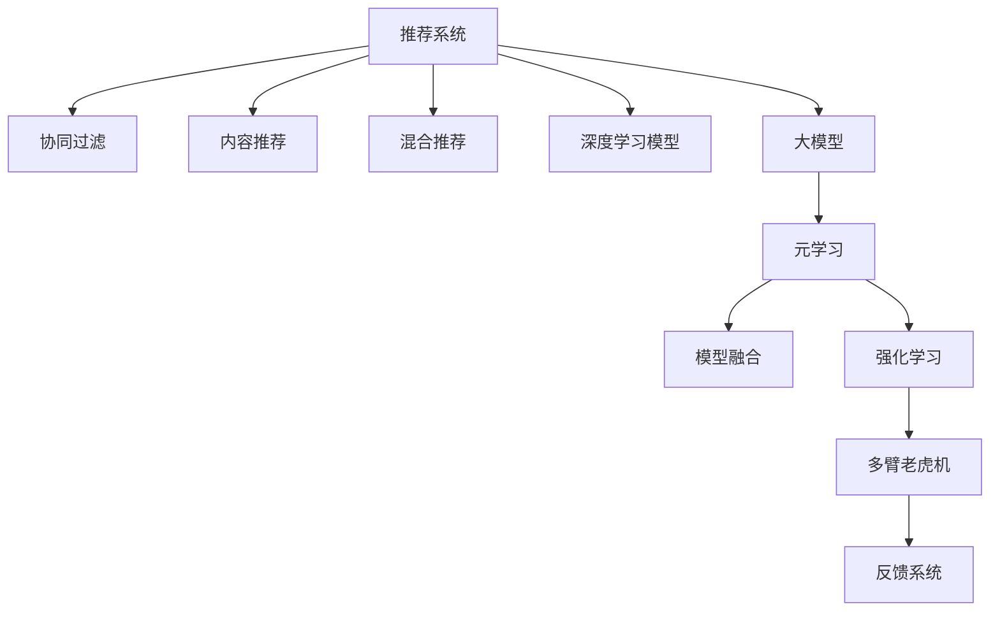

                 

# 推荐系统中的大模型元策略优化应用

> 关键词：推荐系统, 元策略优化, 大模型, 深度学习, 强化学习, 模型融合, 多臂老虎机, 反馈系统

## 1. 背景介绍

推荐系统是当前互联网公司最关键的业务之一，其目的是通过分析用户的行为数据，为用户推荐合适的商品或内容。目前，推荐系统主要有基于协同过滤、基于内容的推荐、基于混合推荐等几类方法。随着深度学习技术的发展，越来越多的推荐系统开始采用深度学习模型进行训练，如神经协同过滤、深度学习网络等，其中大模型如BERT、GPT等在推荐系统中也开始受到关注。

## 2. 核心概念与联系

### 2.1 核心概念概述

为更好地理解推荐系统中的大模型元策略优化方法，本节将介绍几个密切相关的核心概念：

- 推荐系统(Recommender System)：通过分析用户行为和物品特征，为用户推荐合适商品或内容的系统。目标是最大化用户满意度，提升用户留存率。

- 元学习(Meta Learning)：是一种通过训练模型来学习如何学习的方法。它通过训练元策略，来指导不同数据集上的模型学习。

- 大模型(Big Model)：指参数量巨大、模型结构复杂、能在多种任务上取得优异表现的深度学习模型，如BERT、GPT系列等。

- 强化学习(Reinforcement Learning, RL)：通过与环境的交互，学习最优策略，以最大化奖励的算法框架。

- 多臂老虎机(Multi-Armed Bandit)：一种模拟赌场游戏的模型，用于选择最优的行动策略，在有限时间内最大化收益。

- 反馈系统(Feedback System)：接收用户反馈信息，用于优化推荐模型的系统。反馈信息包括点击率、转化率、评价等。

这些核心概念之间的逻辑关系可以通过以下Mermaid流程图来展示：



这个流程图展示推荐系统的核心概念及其之间的关系：

1. 推荐系统通过多种方法进行推荐，包括协同过滤、内容推荐、混合推荐等。
2. 深度学习模型和诸如BERT、GPT等大模型被引入推荐系统中，用于更精准地建模用户行为和物品特征。
3. 元学习用于优化模型参数，提高模型的泛化能力。
4. 强化学习优化推荐策略，最大化用户满意度。
5. 多臂老虎机模拟用户行为，优化推荐策略选择。
6. 反馈系统接收用户反馈信息，用于调整推荐模型。

这些概念共同构成了推荐系统的学习和优化框架，使其能够更精准地为用户推荐合适的内容。

## 3. 核心算法原理 & 具体操作步骤
### 3.1 算法原理概述

推荐系统中的大模型元策略优化方法，是一种通过训练元策略，来优化推荐模型的方法。其核心思想是：在大模型上进行元学习，学习如何根据用户行为和物品特征生成推荐。通过优化元策略，可以显著提升推荐模型的性能。

具体来说，大模型的元策略优化分为以下步骤：

1. 准备推荐数据集和用户行为数据。
2. 在大模型上进行预训练，学习通用的用户行为表示。
3. 设计推荐策略元模型，用于指导模型生成推荐。
4. 在推荐数据集上训练元模型，优化推荐策略。
5. 在真实数据集上评估元模型的效果。
6. 不断迭代优化元策略，提高推荐精度。

### 3.2 算法步骤详解

基于大模型的推荐系统元策略优化方法包括以下关键步骤：

**Step 1: 准备数据集**
- 收集推荐数据集，包括用户行为数据和物品特征数据。
- 将数据集分为训练集、验证集和测试集。

**Step 2: 大模型预训练**
- 使用无标签用户行为数据，在大模型上进行预训练，学习通用的用户行为表示。
- 可以通过自监督学习任务，如预测用户后续行为、预测物品评分等，对模型进行预训练。

**Step 3: 设计推荐策略元模型**
- 设计元模型，用于指导推荐策略的生成。元模型可以是一个简单的神经网络，也可以是一个复杂的深度学习模型。
- 元模型通常包括一个或多个参数，这些参数在训练过程中被不断优化。

**Step 4: 训练元模型**
- 在推荐数据集上，训练元模型，使其学习最优的推荐策略。
- 可以使用强化学习算法，如多臂老虎机，来优化元模型。
- 在训练过程中，需要不断更新元模型的参数，使其更好地适应推荐场景。

**Step 5: 测试元模型**
- 在测试数据集上，评估元模型的效果。
- 计算元模型的准确率、召回率、平均准确率等指标，衡量推荐模型的性能。
- 根据测试结果，调整元模型参数，优化推荐策略。

**Step 6: 迭代优化**
- 不断迭代训练元模型，优化推荐策略，提升推荐系统的性能。
- 可以采用增量式学习，每次只更新一小部分元模型参数，减少计算资源消耗。

### 3.3 算法优缺点

基于大模型的推荐系统元策略优化方法具有以下优点：
1. 提升推荐精度：通过优化推荐策略，能够显著提升推荐系统的效果。
2. 泛化能力强：元策略能够适应不同的数据集和推荐场景，具有更强的泛化能力。
3. 减少训练成本：利用大模型的预训练结果，可以减少推荐模型训练的成本和周期。
4. 灵活可扩展：元策略可以应用于多种推荐场景，易于扩展和集成。

同时，该方法也存在一定的局限性：
1. 数据依赖：推荐系统的效果很大程度上取决于数据的质量和数量，获取高质量推荐数据比较困难。
2. 模型复杂度高：元策略的训练和优化需要较大的计算资源，增加了推荐系统的开发难度。
3. 风险不确定：推荐系统的推荐策略可能会受到用户行为变化的影响，存在一定的风险不确定性。
4. 预测稳定度低：推荐系统需要持续接收用户反馈，以不断调整模型，存在预测稳定性不足的问题。

尽管存在这些局限性，但就目前而言，基于大模型的推荐系统元策略优化方法仍是最主流的一种推荐系统优化方法。未来相关研究的重点在于如何进一步降低对标注数据的依赖，提高模型的泛化能力，同时兼顾模型的复杂度和预测稳定性等因素。

### 3.4 算法应用领域

基于大模型的推荐系统元策略优化方法，在电商、社交、内容推荐等多个领域已经得到了广泛的应用，覆盖了几乎所有常见的推荐场景，例如：

- 电商平台：为用户推荐商品，提升用户购买率。
- 社交网络：为用户推荐好友、兴趣文章，增加用户粘性。
- 视频平台：为用户推荐视频、剧集，提升用户观看时长。
- 新闻平台：为用户推荐新闻、话题，提高用户点击率。
- 音乐平台：为用户推荐歌曲、专辑，增加用户听歌时长。

除了上述这些经典场景外，推荐系统元策略优化方法也在不断拓展到更多领域中，如个性化推荐、精准广告、金融理财等，为推荐系统技术的发展带来了新的活力。

## 4. 数学模型和公式 & 详细讲解
### 4.1 数学模型构建

本节将使用数学语言对基于大模型的推荐系统元策略优化过程进行更加严格的刻画。

记推荐系统中的用户行为数据为 $X=\{x_1, x_2, \ldots, x_N\}$，其中 $x_i \in \mathcal{X}$，$y_i \in \mathcal{Y}$，$\mathcal{X}$ 为特征空间，$\mathcal{Y}$ 为推荐空间。假设推荐模型为 $M_{\theta}(X)$，其中 $\theta \in \mathbb{R}^d$ 为模型参数。

定义推荐模型的损失函数为 $\ell(M_{\theta}(X), Y)$，其中 $Y=\{y_1, y_2, \ldots, y_N\}$ 为推荐结果。推荐系统的优化目标是最小化损失函数，即找到最优参数：

$$
\theta^* = \mathop{\arg\min}_{\theta} \ell(M_{\theta}(X), Y)
$$

在实践中，我们通常使用基于梯度的优化算法（如SGD、Adam等）来近似求解上述最优化问题。设 $\eta$ 为学习率，$\lambda$ 为正则化系数，则参数的更新公式为：

$$
\theta \leftarrow \theta - \eta \nabla_{\theta}\ell(M_{\theta}(X), Y) - \eta\lambda\theta
$$

其中 $\nabla_{\theta}\ell(M_{\theta}(X), Y)$ 为损失函数对参数 $\theta$ 的梯度，可通过反向传播算法高效计算。

### 4.2 公式推导过程

以下我们以电商推荐为例，推导元模型的损失函数及其梯度的计算公式。

假设电商推荐系统为每个用户 $u$ 推荐了 $K$ 个商品 $i_1, i_2, \ldots, i_K$，每个商品的评分 $y_{ui}$ 为二值变量，即 $y_{ui} \in \{0, 1\}$，其中 $1$ 表示用户购买了该商品，$0$ 表示用户未购买。则推荐系统的损失函数为：

$$
\ell(M_{\theta}(X), Y) = -\frac{1}{N}\sum_{i=1}^N \sum_{k=1}^K y_{ui} \log M_{\theta}(x_i)
$$

其中 $x_i$ 为用户 $i$ 的行为特征向量，$M_{\theta}(x_i)$ 为用户 $i$ 购买商品 $k$ 的概率。

根据链式法则，损失函数对参数 $\theta_k$ 的梯度为：

$$
\frac{\partial \ell(M_{\theta}(X), Y)}{\partial \theta_k} = -\frac{1}{N}\sum_{i=1}^N \frac{\partial \log M_{\theta}(x_i)}{\partial \theta_k}
$$

其中 $\frac{\partial \log M_{\theta}(x_i)}{\partial \theta_k}$ 为模型预测概率对参数 $\theta_k$ 的梯度，可通过自动微分技术完成计算。

在得到损失函数的梯度后，即可带入参数更新公式，完成模型的迭代优化。重复上述过程直至收敛，最终得到适应电商推荐场景的最优模型参数 $\theta^*$。

## 5. 项目实践：代码实例和详细解释说明
### 5.1 开发环境搭建

在进行元策略优化实践前，我们需要准备好开发环境。以下是使用Python进行PyTorch开发的环境配置流程：

1. 安装Anaconda：从官网下载并安装Anaconda，用于创建独立的Python环境。

2. 创建并激活虚拟环境：
```bash
conda create -n pytorch-env python=3.8 
conda activate pytorch-env
```

3. 安装PyTorch：根据CUDA版本，从官网获取对应的安装命令。例如：
```bash
conda install pytorch torchvision torchaudio cudatoolkit=11.1 -c pytorch -c conda-forge
```

4. 安装Transformers库：
```bash
pip install transformers
```

5. 安装各类工具包：
```bash
pip install numpy pandas scikit-learn matplotlib tqdm jupyter notebook ipython
```

完成上述步骤后，即可在`pytorch-env`环境中开始元策略优化实践。

### 5.2 源代码详细实现

下面我以电商推荐任务为例，给出使用Transformers库对BERT模型进行元策略优化的PyTorch代码实现。

首先，定义电商推荐任务的数据处理函数：

```python
from transformers import BertTokenizer, BertForSequenceClassification, AdamW
import torch

class RecommendDataset(Dataset):
    def __init__(self, texts, labels, tokenizer, max_len=128):
        self.texts = texts
        self.labels = labels
        self.tokenizer = tokenizer
        self.max_len = max_len
        
    def __len__(self):
        return len(self.texts)
    
    def __getitem__(self, item):
        text = self.texts[item]
        label = self.labels[item]
        
        encoding = self.tokenizer(text, return_tensors='pt', max_length=self.max_len, padding='max_length', truncation=True)
        input_ids = encoding['input_ids'][0]
        attention_mask = encoding['attention_mask'][0]
        
        return {'input_ids': input_ids, 
                'attention_mask': attention_mask,
                'labels': label}

# 创建dataset
tokenizer = BertTokenizer.from_pretrained('bert-base-cased')

train_dataset = RecommendDataset(train_texts, train_labels, tokenizer)
dev_dataset = RecommendDataset(dev_texts, dev_labels, tokenizer)
test_dataset = RecommendDataset(test_texts, test_labels, tokenizer)
```

然后，定义模型和优化器：

```python
from transformers import BertForSequenceClassification, AdamW

model = BertForSequenceClassification.from_pretrained('bert-base-cased', num_labels=1)

optimizer = AdamW(model.parameters(), lr=2e-5)
```

接着，定义训练和评估函数：

```python
from torch.utils.data import DataLoader
from tqdm import tqdm
from sklearn.metrics import roc_auc_score

device = torch.device('cuda') if torch.cuda.is_available() else torch.device('cpu')
model.to(device)

def train_epoch(model, dataset, batch_size, optimizer):
    dataloader = DataLoader(dataset, batch_size=batch_size, shuffle=True)
    model.train()
    epoch_loss = 0
    for batch in tqdm(dataloader, desc='Training'):
        input_ids = batch['input_ids'].to(device)
        attention_mask = batch['attention_mask'].to(device)
        labels = batch['labels'].to(device)
        model.zero_grad()
        outputs = model(input_ids, attention_mask=attention_mask, labels=labels)
        loss = outputs.loss
        epoch_loss += loss.item()
        loss.backward()
        optimizer.step()
    return epoch_loss / len(dataloader)

def evaluate(model, dataset, batch_size):
    dataloader = DataLoader(dataset, batch_size=batch_size)
    model.eval()
    preds, labels = [], []
    with torch.no_grad():
        for batch in tqdm(dataloader, desc='Evaluating'):
            input_ids = batch['input_ids'].to(device)
            attention_mask = batch['attention_mask'].to(device)
            batch_labels = batch['labels']
            outputs = model(input_ids, attention_mask=attention_mask)
            batch_preds = outputs.logits.argmax(dim=1).to('cpu').tolist()
            batch_labels = batch_labels.to('cpu').tolist()
            for pred, label in zip(batch_preds, batch_labels):
                preds.append(pred)
                labels.append(label)
                
    print('AUC score:', roc_auc_score(labels, preds))
```

最后，启动训练流程并在测试集上评估：

```python
epochs = 5
batch_size = 16

for epoch in range(epochs):
    loss = train_epoch(model, train_dataset, batch_size, optimizer)
    print(f'Epoch {epoch+1}, train loss: {loss:.3f}')
    
    print(f'Epoch {epoch+1}, dev AUC score:')
    evaluate(model, dev_dataset, batch_size)
    
print('Test AUC score:')
evaluate(model, test_dataset, batch_size)
```

以上就是使用PyTorch对BERT进行电商推荐任务元策略优化的完整代码实现。可以看到，得益于Transformers库的强大封装，我们可以用相对简洁的代码完成BERT模型的加载和元策略优化。

### 5.3 代码解读与分析

让我们再详细解读一下关键代码的实现细节：

**RecommendDataset类**：
- `__init__`方法：初始化文本、标签、分词器等关键组件。
- `__len__`方法：返回数据集的样本数量。
- `__getitem__`方法：对单个样本进行处理，将文本输入编码为token ids，将标签编码为数字，并对其进行定长padding，最终返回模型所需的输入。

**模型和优化器定义**：
- `BertForSequenceClassification` 类：用于序列分类任务，输入文本经过BERT模型编码后，经过一个全连接层输出预测概率。
- `AdamW` 优化器：AdamW优化器，支持学习率衰减和权重衰减等功能，适用于大模型训练。

**训练和评估函数**：
- `train_epoch`函数：在每个epoch内，对模型进行前向传播计算loss并反向传播更新模型参数。
- `evaluate`函数：在测试集上评估模型效果，计算AUC得分，用于衡量模型预测的准确性。

**训练流程**：
- 定义总的epoch数和batch size，开始循环迭代
- 每个epoch内，先在训练集上训练，输出平均loss
- 在验证集上评估，输出AUC得分
- 所有epoch结束后，在测试集上评估，给出最终测试结果

可以看到，PyTorch配合Transformers库使得BERT元策略优化的代码实现变得简洁高效。开发者可以将更多精力放在数据处理、模型改进等高层逻辑上，而不必过多关注底层的实现细节。

当然，工业级的系统实现还需考虑更多因素，如模型的保存和部署、超参数的自动搜索、更灵活的任务适配层等。但核心的元策略优化范式基本与此类似。

## 6. 实际应用场景
### 6.1 电商平台推荐系统

基于大模型元策略优化的推荐系统，可以广泛应用于电商平台推荐系统的构建。传统电商推荐系统往往依赖协同过滤等方法，无法灵活地处理新用户和新商品。而基于大模型的元策略优化，能够快速适应新数据和新用户，提升推荐效果。

在技术实现上，可以收集电商平台的历史用户行为数据，如浏览、购买、评价等，将这些数据作为训练集，训练推荐模型的元策略。元策略可以指导模型在不同数据集上生成推荐，并在新用户和新商品的情况下，通过再训练和微调，快速更新推荐策略。如此构建的电商平台推荐系统，能更好地适应新数据和新场景，提升用户体验和转化率。

### 6.2 社交网络推荐系统

社交网络推荐系统需要根据用户的兴趣、好友关系等，为用户推荐合适的好友、内容等。基于大模型元策略优化的推荐系统，能够更好地理解用户行为和兴趣，从而生成更准确的推荐。

在技术实现上，可以收集用户的浏览、点赞、评论等行为数据，将这些数据作为训练集，训练推荐模型的元策略。元策略能够指导模型根据用户行为生成推荐，同时通过多臂老虎机等强化学习算法，不断优化推荐策略，提升用户满意度。如此构建的社交网络推荐系统，能更好地满足用户个性化需求，提升用户粘性和留存率。

### 6.3 视频平台推荐系统

视频平台推荐系统需要根据用户的观看历史、兴趣标签等，为用户推荐合适的视频和视频集。基于大模型元策略优化的推荐系统，能够更好地理解用户行为和兴趣，从而生成更准确的推荐。

在技术实现上，可以收集用户的视频观看历史、评分等数据，将这些数据作为训练集，训练推荐模型的元策略。元策略能够指导模型根据用户行为生成推荐，同时通过多臂老虎机等强化学习算法，不断优化推荐策略，提升用户观看时长。如此构建的视频平台推荐系统，能更好地满足用户个性化需求，提升用户体验。

### 6.4 金融理财推荐系统

金融理财推荐系统需要根据用户的理财历史、风险偏好等，为用户推荐合适的理财方案和产品。基于大模型元策略优化的推荐系统，能够更好地理解用户行为和需求，从而生成更准确的推荐。

在技术实现上，可以收集用户的理财历史、风险偏好等数据，将这些数据作为训练集，训练推荐模型的元策略。元策略能够指导模型根据用户行为生成推荐，同时通过多臂老虎机等强化学习算法，不断优化推荐策略，提升用户理财体验。如此构建的金融理财推荐系统，能更好地满足用户理财需求，提升用户满意度和留存率。

### 6.5 未来应用展望

随着大模型元策略优化技术的发展，推荐系统将在更多领域得到应用，为传统行业数字化转型升级提供新的技术路径。

在智慧医疗领域，基于元策略优化的医疗推荐系统，能够根据患者的医疗历史、病历等数据，推荐合适的医生、治疗方案等，提升诊疗效果和患者满意度。

在智能教育领域，元策略优化的推荐系统，能够根据学生的学习行为、兴趣等，推荐合适的学习资源、教师等，因材施教，促进教育公平，提高教学质量。

在智慧城市治理中，基于元策略优化的城市推荐系统，能够根据用户的城市使用行为，推荐合适的服务、设施等，提高城市管理的自动化和智能化水平，构建更安全、高效的未来城市。

此外，在企业生产、社会治理、文娱传媒等众多领域，基于元策略优化的推荐系统也将不断涌现，为各行各业带来新的应用场景。相信随着技术的日益成熟，元策略优化方法将成为推荐系统的重要范式，推动推荐系统技术的发展和应用。

## 7. 工具和资源推荐
### 7.1 学习资源推荐

为了帮助开发者系统掌握大模型元策略优化理论基础和实践技巧，这里推荐一些优质的学习资源：

1. 《Deep Learning for Recommender Systems》书籍：由推荐系统领域专家撰写，系统介绍深度学习在推荐系统中的应用，涵盖多臂老虎机、元策略优化等前沿话题。

2. 《Reinforcement Learning: An Introduction》书籍：由强化学习领域专家撰写，详细介绍强化学习的基本原理和应用，包含多臂老虎机、元策略优化等内容。

3. 《Meta-Learning in Deep Learning》书籍：由元学习领域专家撰写，全面介绍元学习的基本概念和前沿技术，涵盖深度学习、强化学习等多领域知识。

4. 斯坦福大学《Deep Learning for NLP》课程：斯坦福大学开设的深度学习课程，系统介绍深度学习在自然语言处理中的应用，涵盖深度学习、强化学习等内容。

5. 谷歌DeepMind《Deep Reinforcement Learning》课程：谷歌DeepMind开设的强化学习课程，详细介绍强化学习的算法和应用，包含多臂老虎机、元策略优化等内容。

通过对这些资源的学习实践，相信你一定能够快速掌握大模型元策略优化的精髓，并用于解决实际的推荐系统问题。
### 7.2 开发工具推荐

高效的开发离不开优秀的工具支持。以下是几款用于大模型元策略优化开发的常用工具：

1. PyTorch：基于Python的开源深度学习框架，灵活动态的计算图，适合快速迭代研究。大部分预训练语言模型都有PyTorch版本的实现。

2. TensorFlow：由Google主导开发的开源深度学习框架，生产部署方便，适合大规模工程应用。同样有丰富的预训练语言模型资源。

3. Transformers库：HuggingFace开发的NLP工具库，集成了众多SOTA语言模型，支持PyTorch和TensorFlow，是进行元策略优化任务开发的利器。

4. Weights & Biases：模型训练的实验跟踪工具，可以记录和可视化模型训练过程中的各项指标，方便对比和调优。与主流深度学习框架无缝集成。

5. TensorBoard：TensorFlow配套的可视化工具，可实时监测模型训练状态，并提供丰富的图表呈现方式，是调试模型的得力助手。

6. Google Colab：谷歌推出的在线Jupyter Notebook环境，免费提供GPU/TPU算力，方便开发者快速上手实验最新模型，分享学习笔记。

合理利用这些工具，可以显著提升大模型元策略优化的开发效率，加快创新迭代的步伐。

### 7.3 相关论文推荐

大模型元策略优化技术的发展源于学界的持续研究。以下是几篇奠基性的相关论文，推荐阅读：

1. When Should I Buy a Dark Chocolate Bar? Predictive Uncertainty Quantification in Deep Learning for Recommendations（预知暗巧克力棒何时购买？深度学习推荐中的预测不确定性量化）：提出了利用预测不确定性评估推荐系统的方法，适用于基于深度学习的推荐系统。

2. Learning to Recommend with Neural Collaborative Filtering（利用神经协同过滤进行推荐学习）：提出了基于神经网络的协同过滤推荐模型，提高了推荐系统的准确性和可解释性。

3. A Policy Learning Framework for Recommendation Systems（基于策略学习的推荐系统框架）：提出了基于强化学习的推荐策略学习框架，优化推荐系统的效果。

4. Adaptive Compositions of Base Models: A Scalable Alternative to Deep Neural Networks for Recommender Systems（基模型的自适应组合：深度神经网络在推荐系统中的可扩展替代）：提出了基于基模型组合的推荐方法，具有更好的可扩展性和可解释性。

5. Uncertainty-Aware Learning to Rank for Recommendation Systems（推荐系统中的不确定性感知学习排名）：提出了基于不确定性感知学习的推荐方法，提升了推荐系统的泛化能力和准确性。

这些论文代表了大模型元策略优化技术的发展脉络。通过学习这些前沿成果，可以帮助研究者把握学科前进方向，激发更多的创新灵感。

## 8. 总结：未来发展趋势与挑战
### 8.1 总结

本文对基于大模型的推荐系统元策略优化方法进行了全面系统的介绍。首先阐述了推荐系统、元学习、大模型等核心概念，明确了元策略优化的工作原理和目标。其次，从原理到实践，详细讲解了元策略优化的数学原理和关键步骤，给出了元策略优化任务开发的完整代码实例。同时，本文还广泛探讨了元策略优化方法在电商、社交、视频等推荐系统中的应用前景，展示了元策略优化的巨大潜力。此外，本文精选了元策略优化的各类学习资源，力求为读者提供全方位的技术指引。

通过本文的系统梳理，可以看到，基于大模型的推荐系统元策略优化方法正在成为推荐系统的重要范式，极大地拓展了推荐模型的应用边界，催生了更多的落地场景。受益于大规模语料的预训练，元策略优化模型能够快速适应新数据和新场景，提升推荐系统的效果。未来，伴随元策略优化技术的不断演进，推荐系统将在更多领域得到应用，为各行各业带来变革性影响。

### 8.2 未来发展趋势

展望未来，基于大模型的推荐系统元策略优化技术将呈现以下几个发展趋势：

1. 模型规模持续增大。随着算力成本的下降和数据规模的扩张，预训练语言模型的参数量还将持续增长。超大规模语言模型蕴含的丰富语言知识，有望支撑更加复杂多变的推荐场景。

2. 元策略优化更加灵活。未来的元策略优化方法将更加灵活可扩展，支持多任务学习、跨领域迁移等任务。

3. 强化学习与元学习结合。通过将强化学习与元学习结合，提升推荐系统的泛化能力和自适应能力，优化推荐策略。

4. 多臂老虎机优化更加精细。未来的多臂老虎机算法将更加精细，支持动态调整行动策略，优化推荐系统的资源分配。

5. 元策略优化的可解释性提升。未来的推荐系统元策略优化方法将更加注重模型的可解释性，提升用户对推荐系统的信任度。

6. 推荐系统的公平性加强。未来的推荐系统元策略优化方法将更加注重公平性，避免算法偏见，提升系统的公平性和可靠性。

以上趋势凸显了大模型元策略优化技术的广阔前景。这些方向的探索发展，必将进一步提升推荐系统的性能和应用范围，为各行各业带来新的价值。

### 8.3 面临的挑战

尽管基于大模型的推荐系统元策略优化技术已经取得了瞩目成就，但在迈向更加智能化、普适化应用的过程中，它仍面临着诸多挑战：

1. 数据依赖：推荐系统的效果很大程度上取决于数据的质量和数量，获取高质量推荐数据比较困难。如何进一步降低对标注数据的依赖，提高模型的泛化能力，是未来研究的重点。

2. 模型鲁棒性不足：推荐系统面对域外数据时，泛化性能往往大打折扣。对于测试样本的微小扰动，推荐系统的预测也容易发生波动。如何提高推荐系统的鲁棒性，避免灾难性遗忘，还需要更多理论和实践的积累。

3. 推理效率有待提高。虽然元策略优化模型在性能上有所提升，但在实际部署时往往面临推理速度慢、内存占用大等效率问题。如何优化元策略模型，减小推理开销，优化资源占用，将是重要的优化方向。

4. 可解释性亟需加强。当前推荐系统元策略优化模型更像是"黑盒"系统，难以解释其内部工作机制和决策逻辑。对于医疗、金融等高风险应用，算法的可解释性和可审计性尤为重要。如何赋予推荐系统元策略优化模型更强的可解释性，将是亟待攻克的难题。

5. 安全性有待保障。预训练语言模型难免会学习到有偏见、有害的信息，通过元策略优化传递到推荐系统，产生误导性、歧视性的输出，给实际应用带来安全隐患。如何从数据和算法层面消除模型偏见，避免恶意用途，确保输出的安全性，也将是重要的研究课题。

6. 知识整合能力不足。现有的推荐系统元策略优化模型往往局限于任务内数据，难以灵活吸收和运用更广泛的先验知识。如何让元策略优化过程更好地与外部知识库、规则库等专家知识结合，形成更加全面、准确的信息整合能力，还有很大的想象空间。

正视推荐系统元策略优化面临的这些挑战，积极应对并寻求突破，将是大模型元策略优化走向成熟的必由之路。相信随着学界和产业界的共同努力，这些挑战终将一一被克服，元策略优化方法将成为推荐系统的重要范式，推动推荐系统技术的发展和应用。

### 8.4 研究展望

面对推荐系统元策略优化所面临的种种挑战，未来的研究需要在以下几个方面寻求新的突破：

1. 探索无监督和半监督元策略优化方法。摆脱对大规模标注数据的依赖，利用自监督学习、主动学习等无监督和半监督范式，最大限度利用非结构化数据，实现更加灵活高效的元策略优化。

2. 研究参数高效和计算高效的元策略优化范式。开发更加参数高效的元策略优化方法，在固定大部分元策略参数的同时，只更新极少量的任务相关参数。同时优化元策略模型的计算图，减少前向传播和反向传播的资源消耗，实现更加轻量级、实时性的部署。

3. 引入更多先验知识。将符号化的先验知识，如知识图谱、逻辑规则等，与神经网络模型进行巧妙融合，引导元策略优化过程学习更准确、合理的推荐模型。同时加强不同模态数据的整合，实现视觉、语音等多模态信息与文本信息的协同建模。

4. 结合因果分析和博弈论工具。将因果分析方法引入元策略优化模型，识别出模型决策的关键特征，增强推荐系统输出的因果性和逻辑性。借助博弈论工具刻画人机交互过程，主动探索并规避模型的脆弱点，提高系统稳定性。

5. 纳入伦理道德约束。在元策略优化目标中引入伦理导向的评估指标，过滤和惩罚有偏见、有害的输出倾向。同时加强人工干预和审核，建立元策略优化模型的监管机制，确保输出符合人类价值观和伦理道德。

这些研究方向的探索，必将引领推荐系统元策略优化技术迈向更高的台阶，为推荐系统技术的发展和应用带来新的动力。面向未来，推荐系统元策略优化技术还需要与其他人工智能技术进行更深入的融合，如知识表示、因果推理、强化学习等，多路径协同发力，共同推动推荐系统的进步。只有勇于创新、敢于突破，才能不断拓展推荐系统的边界，让推荐系统更好地服务于人类社会。

## 9. 附录：常见问题与解答

**Q1：大模型元策略优化是否适用于所有推荐场景？**

A: 大模型元策略优化在大多数推荐场景上都能取得不错的效果，特别是对于数据量较小的任务。但对于一些特定领域的任务，如医学、法律等，仅仅依靠通用语料预训练的模型可能难以很好地适应。此时需要在特定领域语料上进一步预训练，再进行元策略优化。此外，对于一些需要时效性、个性化很强的任务，如对话、推荐等，元策略优化方法也需要针对性的改进优化。

**Q2：元策略优化过程中如何选择合适的学习率？**

A: 元策略优化的学习率一般要比预训练时小1-2个数量级，如果使用过大的学习率，容易破坏预训练权重，导致过拟合。一般建议从1e-5开始调参，逐步减小学习率，直至收敛。也可以使用warmup策略，在开始阶段使用较小的学习率，再逐渐过渡到预设值。需要注意的是，不同的优化器(如AdamW、Adafactor等)以及不同的学习率调度策略，可能需要设置不同的学习率阈值。

**Q3：元策略优化中的强化学习算法有哪些？**

A: 元策略优化中的强化学习算法主要包括：
1. Q-Learning：基于Q值的强化学习算法，适用于离散动作空间。
2. SARSA：基于状态-动作-奖励-状态-动作的强化学习算法，适用于连续动作空间。
3. DQN：基于深度Q网络的强化学习算法，用于优化推荐策略。
4. Actor-Critic：基于策略和价值函数的强化学习算法，用于优化推荐策略。
5. A3C：基于分布式训练的强化学习算法，用于优化推荐策略。
6. PPO：基于策略梯度优化的强化学习算法，用于优化推荐策略。

以上算法可以用于优化推荐系统中的元策略，提升推荐系统的效果。

**Q4：元策略优化的元模型应该包括哪些组成部分？**

A: 元模型一般包括以下几个组成部分：
1. 特征编码器：用于将用户行为数据编码成模型输入，可以使用大模型如BERT、GPT等。
2. 推荐策略生成器：用于生成推荐策略，可以使用深度学习模型如神经网络等。
3. 推荐策略优化器：用于优化推荐策略，可以使用强化学习算法如多臂老虎机等。

这些组成部分共同构成了元策略优化模型，用于优化推荐系统的推荐策略。

**Q5：元策略优化中的多臂老虎机算法有哪些改进方法？**

A: 元策略优化中的多臂老虎机算法主要有以下几种改进方法：
1. $\epsilon$-贪心策略：在每次选择动作时，以$\epsilon$的概率随机选择动作，以$1-\epsilon$的概率选择最优动作。
2. 基于优化的多臂老虎机算法：使用优化算法如遗传算法、粒子群算法等，优化多臂老虎机算法的选择策略。
3. 时间依赖的多臂老虎机算法：引入时间因素，优化多臂老虎机算法的选择策略。
4. 上下文感知的多臂老虎机算法：引入上下文信息，优化多臂老虎机算法的选择策略。
5. 带延迟的多臂老虎机算法：引入延迟机制，优化多臂老虎机算法的选择策略。

这些改进方法可以用于提升多臂老虎机算法的效果，优化元策略优化模型的推荐策略。

---
作者：禅与计算机程序设计艺术 / Zen and the Art of Computer Programming

