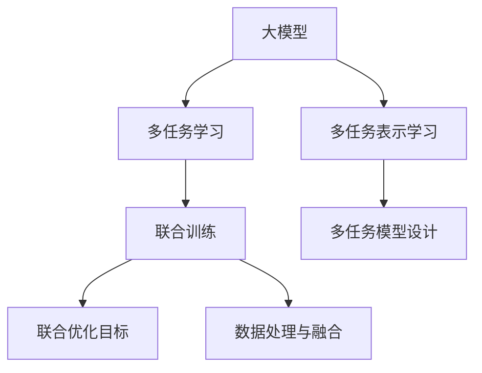

                 

# 推荐系统中的大模型多任务表示学习

## 1. 背景介绍

### 1.1 问题由来
随着推荐系统在电商、内容分发、社交网络等领域的广泛应用，如何通过精准化的推荐满足用户的个性化需求，提升用户体验，成为了各大平台亟待解决的重要问题。推荐系统涉及的核心任务包括：
1. 用户兴趣建模：通过用户历史行为数据、点击日志、评分等，构建用户兴趣表示。
2. 物品表示学习：通过物品属性、描述、关联数据，构建物品特征表示。
3. 用户-物品交互建模：构建用户与物品交互的相似度或相关性度量，进行推荐排序。

然而，这些任务间存在强烈的依赖性。用户兴趣表示和物品表示相辅相成，才能构建精准的推荐模型。传统推荐系统主要关注用户-物品交互任务，对用户兴趣和物品表示的建模通常较为简单，难以充分挖掘用户和物品的潜在价值。近年来，通过预训练大模型进行推荐系统优化，成为研究热点。

大模型通过海量数据进行自监督预训练，学习到丰富的语义知识和领域特征，具备强大的特征表示能力。直接将大模型应用于推荐系统，能显著提升推荐效果。但大模型通常参数量巨大，推理成本较高，难以直接应用到实时推荐系统中。因此，如何在推荐系统中有效地利用大模型的多任务表示学习能力，降低计算成本，提高推荐效率，是一个亟需解决的问题。

### 1.2 问题核心关键点
大模型多任务表示学习主要是通过多任务联合训练的方式，提升模型在多个推荐任务上的性能。具体来说，以下三个关键问题需要重点关注：

- **多任务模型设计**：如何在多任务训练过程中平衡各个任务之间的关联和差异，构建多任务的联合表示。
- **数据处理和融合**：如何设计高效的数据处理流程，在多任务数据中进行协同训练，提升训练效率。
- **优化目标设计**：如何设计多任务的联合优化目标，使得模型能够在多个推荐任务上同时提升。

## 2. 核心概念与联系

### 2.1 核心概念概述

为了更好地理解大模型多任务表示学习的原理和架构，本节将介绍几个密切相关的核心概念：

- **大模型**：指通过海量数据进行预训练的大型深度神经网络模型，如BERT、GPT-3等。大模型具备强大的特征表示能力，能在不同领域和任务间进行迁移学习。
- **多任务学习(Multitask Learning, MTL)**：指通过训练模型在多个相关任务上的表示，提升模型泛化能力的一种学习方法。多任务学习可以提升模型的性能，但模型需要同时处理多个任务的输入和输出。
- **表示学习(Representation Learning)**：指通过学习数据的特征表示，提升模型对数据的理解和建模能力。多任务表示学习即是将多个任务的表示学习进行协同训练，使得模型在多个任务上获得更好的表示。
- **联合训练(Joint Training)**：指多个模型或任务联合进行训练，共享训练资源和优化目标。联合训练能够提升模型在多个任务上的性能。

这些核心概念之间的逻辑关系可以通过以下Mermaid流程图来展示：



这个流程图展示了大模型多任务表示学习的核心概念及其之间的关系：

1. 大模型通过预训练获得基础能力。
2. 多任务学习提升模型在多个任务上的性能，实现多任务联合表示。
3. 联合训练优化多任务模型的整体性能，提高训练效率。
4. 多任务模型设计确定联合训练的具体架构，如Transformer模型。
5. 数据处理与融合设计多任务的联合训练数据流程。
6. 联合优化目标设计多个任务的目标函数，指导模型训练。

这些概念共同构成了大模型多任务表示学习的基础框架，使得大模型能够在多个推荐任务上取得优异性能。

## 3. 核心算法原理 & 具体操作步骤
### 3.1 算法原理概述

大模型多任务表示学习的核心思想是通过多任务的联合训练，提升模型在多个推荐任务上的表现。其核心目标是通过多任务学习，将不同任务间的知识进行联合编码，生成一个通用的表示。这种多任务联合表示在多个任务上都能取得较好的性能。

形式化地，假设存在 $K$ 个推荐任务，每个任务 $t$ 的输入表示为 $x_t$，输出表示为 $y_t$。模型的结构为 $\theta$，其中 $\theta = (W_1, W_2, ..., W_K)$，每个任务 $t$ 对应的模型参数为 $W_t$。多任务表示学习的目标是通过联合训练，使得模型能够对多个任务进行一致的表示。

具体而言，大模型多任务表示学习的过程分为以下几个步骤：

1. **预训练**：在大规模无标签数据上，通过自监督学习任务对大模型进行预训练，学习通用的语言表示。
2. **数据准备**：将不同推荐任务的标注数据进行预处理，构建联合训练的数据集。
3. **多任务联合训练**：在预训练表示的基础上，通过多任务的联合优化，更新模型参数，使得模型在多个任务上都能够获得较好的表示。
4. **模型评估与微调**：在验证集和测试集上评估模型的性能，并进行微调，进一步提升模型表现。

### 3.2 算法步骤详解

大模型多任务表示学习一般包括以下几个关键步骤：

**Step 1: 准备多任务数据集**
- 收集各推荐任务的标注数据集 $D_t = \{(x_{t,i}, y_{t,i})\}_{i=1}^{N_t}$，其中 $x_{t,i}$ 为样本 $i$ 的特征向量，$y_{t,i}$ 为样本 $i$ 对应的标签。
- 将不同任务的数据集合并，构成联合训练的数据集 $D = \cup_{t=1}^K D_t$。

**Step 2: 设计多任务模型结构**
- 构建多任务的联合模型结构，如使用Transformer模型，其中 $x_t$ 为输入，$y_t$ 为输出，模型结构为 $\theta = (W_1, W_2, ..., W_K)$。
- 在模型中，每个任务 $t$ 对应一个独立的分支 $W_t$，进行独立的前向传播和损失计算。
- 考虑不同任务间的依赖关系，通过共享某些层或参数，进行多任务联合训练。

**Step 3: 设计多任务联合损失函数**
- 定义多任务的联合损失函数 $\mathcal{L}(\theta) = \frac{1}{N}\sum_{t=1}^K\sum_{i=1}^{N_t}\ell(y_{t,i}, \hat{y}_{t,i})$，其中 $\ell$ 为每个任务的损失函数。
- 常见损失函数包括交叉熵损失、均方误差损失等。

**Step 4: 联合训练和优化**
- 在数据集 $D$ 上，进行多任务的联合训练。前向传播计算每个任务的损失，反向传播更新所有任务的参数。
- 使用优化算法，如Adam、SGD等，最小化联合损失函数，进行模型优化。

**Step 5: 模型评估与微调**
- 在验证集和测试集上评估模型在不同任务上的表现，如准确率、召回率、F1-score等。
- 根据评估结果，对模型进行微调，进一步提升模型在特定任务上的性能。

### 3.3 算法优缺点

大模型多任务表示学习具有以下优点：
1. 提高泛化能力：通过多任务的联合训练，模型能够学习到多个任务之间的共性特征，提升模型的泛化能力。
2. 提升推荐精度：多任务联合训练能够提高模型对用户和物品特征的建模能力，从而提升推荐精度。
3. 减少标注数据需求：在多任务联合训练中，标注数据的数量需求可以降低，通过少量标注数据即可实现较好的性能提升。
4. 促进任务协同：不同任务间的协同训练能够提升模型的协同能力和泛化能力。

同时，该方法也存在一些局限性：
1. 计算成本高：多任务联合训练需要大量计算资源，模型参数和训练复杂度较大。
2. 模型复杂度高：多任务联合模型结构复杂，需要设计合适的共享和独立分支，增加了模型训练和推理的复杂度。
3. 迁移能力有限：当多个任务之间的差异较大时，多任务的联合训练效果可能不佳。
4. 可解释性不足：多任务联合模型的复杂性使得其难以解释，难以理解和调试模型。

尽管存在这些局限性，但就目前而言，多任务联合训练仍然是推荐系统中应用最广泛的方法之一。未来相关研究的重点在于如何进一步优化模型结构和训练算法，提升计算效率，降低计算成本，同时兼顾可解释性和迁移能力。

### 3.4 算法应用领域

大模型多任务表示学习已经在推荐系统、自然语言处理、图像识别等多个领域得到了广泛的应用，覆盖了几乎所有常见任务，例如：

- 推荐系统：如电商推荐、内容推荐、广告推荐等，通过多任务联合训练，提升推荐效果。
- 自然语言处理：如机器翻译、文本分类、情感分析等，通过多任务联合训练，提高模型的泛化能力。
- 图像识别：如目标检测、图像分割、图像分类等，通过多任务联合训练，提升模型对不同目标的识别能力。
- 音频识别：如语音识别、语音合成等，通过多任务联合训练，提高语音信号的建模能力。

除了上述这些经典任务外，大模型多任务表示学习也被创新性地应用到更多场景中，如可控生成、少样本学习、跨领域迁移等，为NLP技术带来了全新的突破。随着预训练模型和联合训练方法的不断进步，相信NLP技术将在更广阔的应用领域大放异彩。

## 4. 数学模型和公式 & 详细讲解 & 举例说明

### 4.1 数学模型构建

本节将使用数学语言对大模型多任务表示学习的过程进行更加严格的刻画。

假设推荐系统涉及 $K$ 个推荐任务，每个任务 $t$ 的输入表示为 $x_t$，输出表示为 $y_t$。模型的结构为 $\theta$，其中 $\theta = (W_1, W_2, ..., W_K)$，每个任务 $t$ 对应的模型参数为 $W_t$。假设多任务的联合损失函数为 $\mathcal{L}(\theta)$，则多任务表示学习的目标是最小化联合损失函数：

$$
\min_{\theta} \mathcal{L}(\theta) = \frac{1}{N}\sum_{t=1}^K\sum_{i=1}^{N_t}\ell(y_{t,i}, \hat{y}_{t,i})
$$

其中，$\ell$ 为每个任务的损失函数。对于分类任务，常见的损失函数包括交叉熵损失：

$$
\ell(y_{t,i}, \hat{y}_{t,i}) = -(y_{t,i} \log \hat{y}_{t,i} + (1-y_{t,i})\log(1-\hat{y}_{t,i}))
$$

对于回归任务，常见的损失函数包括均方误差损失：

$$
\ell(y_{t,i}, \hat{y}_{t,i}) = \frac{1}{2}(y_{t,i} - \hat{y}_{t,i})^2
$$

### 4.2 公式推导过程

以下我们以多任务分类为例，推导多任务联合损失函数及其梯度的计算公式。

假设模型 $M_{\theta}$ 在输入 $x_t$ 上的输出为 $\hat{y}_t = M_{\theta}(x_t)$，表示样本 $x_t$ 属于类 $y_t$ 的概率。真实标签 $y \in \{0,1\}$。则多任务分类损失函数定义为：

$$
\mathcal{L}(\theta) = \frac{1}{N}\sum_{t=1}^K\sum_{i=1}^{N_t} \ell(y_{t,i}, \hat{y}_{t,i})
$$

将其代入具体任务，如电商平台推荐物品，令 $\ell$ 为交叉熵损失：

$$
\mathcal{L}(\theta) = \frac{1}{N}\sum_{t=1}^K\sum_{i=1}^{N_t} -(y_{t,i} \log \hat{y}_{t,i} + (1-y_{t,i})\log(1-\hat{y}_{t,i}))
$$

将上述公式展开，得到每个任务 $t$ 的损失函数：

$$
\mathcal{L}_t(\theta) = \frac{1}{N_t}\sum_{i=1}^{N_t} -(y_{t,i} \log \hat{y}_{t,i} + (1-y_{t,i})\log(1-\hat{y}_{t,i}))
$$

根据链式法则，损失函数对参数 $\theta_k$ 的梯度为：

$$
\frac{\partial \mathcal{L}(\theta)}{\partial \theta_k} = \frac{1}{N}\sum_{t=1}^K\sum_{i=1}^{N_t} \frac{\partial \ell(y_{t,i}, \hat{y}_{t,i})}{\partial \hat{y}_{t,i}} \frac{\partial \hat{y}_{t,i}}{\partial \theta_k}
$$

其中 $\frac{\partial \ell(y_{t,i}, \hat{y}_{t,i})}{\partial \hat{y}_{t,i}}$ 为损失函数对输出 $\hat{y}_{t,i}$ 的梯度，$\frac{\partial \hat{y}_{t,i}}{\partial \theta_k}$ 为模型输出对参数 $\theta_k$ 的梯度，可进一步递归展开。

在得到损失函数的梯度后，即可带入联合优化算法，完成多任务的联合训练。重复上述过程直至收敛，最终得到适应多个推荐任务的最优模型参数 $\theta^*$。

## 5. 项目实践：代码实例和详细解释说明
### 5.1 开发环境搭建

在进行多任务训练实践前，我们需要准备好开发环境。以下是使用Python进行PyTorch开发的环境配置流程：

1. 安装Anaconda：从官网下载并安装Anaconda，用于创建独立的Python环境。

2. 创建并激活虚拟环境：
```bash
conda create -n pytorch-env python=3.8 
conda activate pytorch-env
```

3. 安装PyTorch：根据CUDA版本，从官网获取对应的安装命令。例如：
```bash
conda install pytorch torchvision torchaudio cudatoolkit=11.1 -c pytorch -c conda-forge
```

4. 安装Transformer库：
```bash
pip install transformers
```

5. 安装各类工具包：
```bash
pip install numpy pandas scikit-learn matplotlib tqdm jupyter notebook ipython
```

完成上述步骤后，即可在`pytorch-env`环境中开始多任务训练实践。

### 5.2 源代码详细实现

下面我们以电商平台推荐系统为例，给出使用Transformers库对BERT模型进行多任务训练的PyTorch代码实现。

首先，定义多任务数据处理函数：

```python
from transformers import BertTokenizer
from torch.utils.data import Dataset
import torch

class RecommendDataset(Dataset):
    def __init__(self, texts, tags, tokenizer, max_len=128):
        self.texts = texts
        self.tags = tags
        self.tokenizer = tokenizer
        self.max_len = max_len
        
    def __len__(self):
        return len(self.texts)
    
    def __getitem__(self, item):
        text = self.texts[item]
        tags = self.tags[item]
        
        encoding = self.tokenizer(text, return_tensors='pt', max_length=self.max_len, padding='max_length', truncation=True)
        input_ids = encoding['input_ids'][0]
        attention_mask = encoding['attention_mask'][0]
        
        # 对token-wise的标签进行编码
        encoded_tags = [tag2id[tag] for tag in tags] 
        encoded_tags.extend([tag2id['O']] * (self.max_len - len(encoded_tags)))
        labels = torch.tensor(encoded_tags, dtype=torch.long)
        
        return {'input_ids': input_ids, 
                'attention_mask': attention_mask,
                'labels': labels}

# 标签与id的映射
tag2id = {'O': 0, 'A': 1, 'B': 2, 'C': 3, 'D': 4}
id2tag = {v: k for k, v in tag2id.items()}

# 创建dataset
tokenizer = BertTokenizer.from_pretrained('bert-base-cased')

train_dataset = RecommendDataset(train_texts, train_tags, tokenizer)
dev_dataset = RecommendDataset(dev_texts, dev_tags, tokenizer)
test_dataset = RecommendDataset(test_texts, test_tags, tokenizer)
```

然后，定义多任务模型和优化器：

```python
from transformers import BertForTokenClassification, AdamW

model = BertForTokenClassification.from_pretrained('bert-base-cased', num_labels=len(tag2id))

optimizer = AdamW(model.parameters(), lr=2e-5)
```

接着，定义训练和评估函数：

```python
from torch.utils.data import DataLoader
from tqdm import tqdm
from sklearn.metrics import classification_report

device = torch.device('cuda') if torch.cuda.is_available() else torch.device('cpu')
model.to(device)

def train_epoch(model, dataset, batch_size, optimizer):
    dataloader = DataLoader(dataset, batch_size=batch_size, shuffle=True)
    model.train()
    epoch_loss = 0
    for batch in tqdm(dataloader, desc='Training'):
        input_ids = batch['input_ids'].to(device)
        attention_mask = batch['attention_mask'].to(device)
        labels = batch['labels'].to(device)
        model.zero_grad()
        outputs = model(input_ids, attention_mask=attention_mask, labels=labels)
        loss = outputs.loss
        epoch_loss += loss.item()
        loss.backward()
        optimizer.step()
    return epoch_loss / len(dataloader)

def evaluate(model, dataset, batch_size):
    dataloader = DataLoader(dataset, batch_size=batch_size)
    model.eval()
    preds, labels = [], []
    with torch.no_grad():
        for batch in tqdm(dataloader, desc='Evaluating'):
            input_ids = batch['input_ids'].to(device)
            attention_mask = batch['attention_mask'].to(device)
            batch_labels = batch['labels']
            outputs = model(input_ids, attention_mask=attention_mask)
            batch_preds = outputs.logits.argmax(dim=2).to('cpu').tolist()
            batch_labels = batch_labels.to('cpu').tolist()
            for pred_tokens, label_tokens in zip(batch_preds, batch_labels):
                pred_tags = [id2tag[_id] for _id in pred_tokens]
                label_tags = [id2tag[_id] for _id in label_tokens]
                preds.append(pred_tags[:len(label_tokens)])
                labels.append(label_tags)
                
    print(classification_report(labels, preds))
```

最后，启动训练流程并在测试集上评估：

```python
epochs = 5
batch_size = 16

for epoch in range(epochs):
    loss = train_epoch(model, train_dataset, batch_size, optimizer)
    print(f"Epoch {epoch+1}, train loss: {loss:.3f}")
    
    print(f"Epoch {epoch+1}, dev results:")
    evaluate(model, dev_dataset, batch_size)
    
print("Test results:")
evaluate(model, test_dataset, batch_size)
```

以上就是使用PyTorch对BERT进行多任务训练的完整代码实现。可以看到，得益于Transformers库的强大封装，我们可以用相对简洁的代码完成BERT模型的多任务训练。

### 5.3 代码解读与分析

让我们再详细解读一下关键代码的实现细节：

**RecommendDataset类**：
- `__init__`方法：初始化文本、标签、分词器等关键组件。
- `__len__`方法：返回数据集的样本数量。
- `__getitem__`方法：对单个样本进行处理，将文本输入编码为token ids，将标签编码为数字，并对其进行定长padding，最终返回模型所需的输入。

**tag2id和id2tag字典**：
- 定义了标签与数字id之间的映射关系，用于将token-wise的预测结果解码回真实的标签。

**训练和评估函数**：
- 使用PyTorch的DataLoader对数据集进行批次化加载，供模型训练和推理使用。
- 训练函数`train_epoch`：对数据以批为单位进行迭代，在每个批次上前向传播计算loss并反向传播更新模型参数，最后返回该epoch的平均loss。
- 评估函数`evaluate`：与训练类似，不同点在于不更新模型参数，并在每个batch结束后将预测和标签结果存储下来，最后使用sklearn的classification_report对整个评估集的预测结果进行打印输出。

**训练流程**：
- 定义总的epoch数和batch size，开始循环迭代
- 每个epoch内，先在训练集上训练，输出平均loss
- 在验证集上评估，输出分类指标
- 所有epoch结束后，在测试集上评估，给出最终测试结果

可以看到，PyTorch配合Transformers库使得BERT多任务训练的代码实现变得简洁高效。开发者可以将更多精力放在数据处理、模型改进等高层逻辑上，而不必过多关注底层的实现细节。

当然，工业级的系统实现还需考虑更多因素，如模型的保存和部署、超参数的自动搜索、更灵活的任务适配层等。但核心的多任务联合训练过程基本与此类似。

## 6. 实际应用场景
### 6.1 电商推荐系统

基于大模型多任务表示学习的推荐系统，可以广泛应用于电商平台推荐商品。传统推荐系统往往只关注用户历史行为数据，难以全面理解用户兴趣。通过多任务联合训练，模型可以同时学习用户和物品的表示，更准确地捕捉用户行为模式，提升推荐效果。

具体而言，可以收集用户浏览、点击、购买等行为数据，并结合物品属性、标签、评论等特征，进行多任务的联合训练。在多任务的联合训练中，模型能够学习到不同任务间的协同关系，更好地理解用户需求，从而推荐更符合用户兴趣的商品。此外，通过多任务的联合训练，模型还能够学习到不同任务间的相似性，提高推荐的泛化能力，减少推荐偏差。

### 6.2 内容推荐系统

内容推荐系统如视频推荐、新闻推荐等，同样可以受益于大模型多任务表示学习。内容推荐系统需要同时处理用户和物品的表示，通过多任务联合训练，模型能够更好地理解用户偏好和内容特征，从而提升推荐效果。

例如，在视频推荐中，可以同时训练用户兴趣建模任务和物品相似度建模任务。在训练过程中，模型能够学习到用户对不同视频的评分和兴趣，以及视频之间的相似度关系。通过多任务的联合训练，模型能够更好地预测用户对不同视频的评分，从而提升推荐精度。

### 6.3 个性化推荐系统

基于大模型多任务表示学习的个性化推荐系统，能够更好地满足用户的个性化需求。个性化推荐系统需要根据用户的个性化特征，推荐符合用户兴趣的内容。通过多任务联合训练，模型能够同时学习用户兴趣和物品特征，更好地理解用户的个性化需求。

例如，在电商推荐系统中，可以通过多任务的联合训练，同时学习用户兴趣建模任务和物品推荐排序任务。在训练过程中，模型能够学习到用户对不同物品的评分和兴趣，以及物品之间的相似度关系。通过多任务的联合训练，模型能够更好地预测用户对不同物品的评分，从而提升推荐精度。

### 6.4 未来应用展望

随着大模型多任务表示学习方法的不断发展，推荐系统将在更多领域得到应用，为不同行业带来变革性影响。

在智慧医疗领域，基于大模型多任务表示学习的推荐系统可以辅助医生诊疗，推荐相关文献、治疗方案等，提升医疗服务的智能化水平。

在智能教育领域，多任务联合训练的推荐系统可以推荐个性化的学习内容、练习题目等，因材施教，促进教育公平，提高教学质量。

在智慧城市治理中，多任务联合训练的推荐系统可以推荐城市事件、交通状况等信息，提高城市管理的自动化和智能化水平，构建更安全、高效的未来城市。

此外，在企业生产、社会治理、文娱传媒等众多领域，基于大模型多任务表示学习的推荐系统也将不断涌现，为经济社会发展注入新的动力。相信随着技术的日益成熟，多任务联合训练方法将成为推荐系统的重要范式，推动推荐技术向更广阔的领域加速渗透。

## 7. 工具和资源推荐
### 7.1 学习资源推荐

为了帮助开发者系统掌握大模型多任务表示学习的理论基础和实践技巧，这里推荐一些优质的学习资源：

1. 《深度学习推荐系统》系列书籍：由学术界和产业界专家共同撰写，全面介绍了推荐系统的理论基础和应用实践，包括多任务联合训练等前沿技术。

2. 《多任务学习理论与实践》课程：由多任务学习领域权威专家开设的在线课程，深入浅出地介绍了多任务学习的原理和实践方法。

3. 《Transformers & Deep Learning for Natural Language Processing》书籍：Transformer库的作者所著，全面介绍了如何利用Transformers进行NLP任务开发，包括多任务联合训练等技术。

4. HuggingFace官方文档：Transformers库的官方文档，提供了海量预训练模型和多任务联合训练的完整样例代码，是上手实践的必备资料。

5. Kaggle竞赛平台：众多推荐系统竞赛平台如Kaggle、TopCoder等，提供了大量推荐系统数据集和任务，帮助开发者积累实战经验。

通过对这些资源的学习实践，相信你一定能够快速掌握大模型多任务表示学习的精髓，并用于解决实际的推荐问题。
###  7.2 开发工具推荐

高效的开发离不开优秀的工具支持。以下是几款用于大模型多任务表示学习开发的常用工具：

1. PyTorch：基于Python的开源深度学习框架，灵活动态的计算图，适合快速迭代研究。大部分预训练语言模型都有PyTorch版本的实现。

2. TensorFlow：由Google主导开发的开源深度学习框架，生产部署方便，适合大规模工程应用。同样有丰富的预训练语言模型资源。

3. Transformers库：HuggingFace开发的NLP工具库，集成了众多SOTA语言模型，支持PyTorch和TensorFlow，是进行多任务联合训练开发的利器。

4. Weights & Biases：模型训练的实验跟踪工具，可以记录和可视化模型训练过程中的各项指标，方便对比和调优。与主流深度学习框架无缝集成。

5. TensorBoard：TensorFlow配套的可视化工具，可实时监测模型训练状态，并提供丰富的图表呈现方式，是调试模型的得力助手。

6. Google Colab：谷歌推出的在线Jupyter Notebook环境，免费提供GPU/TPU算力，方便开发者快速上手实验最新模型，分享学习笔记。

合理利用这些工具，可以显著提升大模型多任务表示学习的开发效率，加快创新迭代的步伐。

### 7.3 相关论文推荐

大模型多任务表示学习的发展源于学界的持续研究。以下是几篇奠基性的相关论文，推荐阅读：

1. Multitask Learning Using Prediction Tasks：提出多任务学习的基本框架，通过多个任务联合训练，提升模型在多个任务上的性能。

2. Transformer-XL: Attentive Language Models Beyond a Fixed-Length Context：提出Transformer-XL模型，通过长距离依赖机制，提升多任务联合训练的性能。

3. Multitask Learning with Dynamic Routing for Tensor Flow：提出多任务学习动态路由算法，通过共享参数和层，提升多任务联合训练的效率和效果。

4. Adaptive Multitask Learning via Generalized Multimodal Mixture of Experts：提出适应性多任务学习框架，通过多模态混合专家机制，提升多任务联合训练的效果。

5. Multitask Adversarial Networks：提出多任务对抗网络，通过对抗性训练提升多任务联合训练的鲁棒性和泛化能力。

这些论文代表了大模型多任务表示学习的发展脉络。通过学习这些前沿成果，可以帮助研究者把握学科前进方向，激发更多的创新灵感。

## 8. 总结：未来发展趋势与挑战
### 8.1 总结

本文对大模型多任务表示学习的方法进行了全面系统的介绍。首先阐述了大模型多任务表示学习的背景和意义，明确了多任务联合训练在提升推荐系统性能方面的独特价值。其次，从原理到实践，详细讲解了多任务联合训练的数学原理和关键步骤，给出了多任务训练任务开发的完整代码实例。同时，本文还广泛探讨了多任务联合训练方法在推荐系统、NLP等众多领域的应用前景，展示了多任务联合训练范式的巨大潜力。此外，本文精选了多任务联合训练方法的各类学习资源，力求为读者提供全方位的技术指引。

通过本文的系统梳理，可以看到，大模型多任务表示学习已经在大规模推荐系统中得到广泛应用，显著提升了推荐效果和用户满意度。未来，伴随大模型技术的不断演进，多任务联合训练将在更多领域得到应用，为行业带来变革性影响。

### 8.2 未来发展趋势

展望未来，大模型多任务表示学习技术将呈现以下几个发展趋势：

1. 模型规模持续增大。随着算力成本的下降和数据规模的扩张，大模型的参数量还将持续增长。超大规模语言模型蕴含的丰富语言知识，有望支撑更加复杂多变的推荐任务。

2. 多任务联合训练方法日趋多样。除了传统的全任务联合训练外，未来会涌现更多多任务联合训练的方法，如对比学习、多任务对抗训练等，在提升性能的同时，减少计算资源消耗。

3. 多任务联合训练与因果推理结合。通过引入因果推断方法，增强多任务联合训练模型的因果关系，学习更加普适、鲁棒的语言表征，从而提升模型泛化性和抗干扰能力。

4. 多任务联合训练与知识图谱结合。将知识图谱与多任务联合训练结合，提升模型对先验知识的整合能力，从而提高推荐系统的准确性和可靠性。

5. 多任务联合训练与少样本学习结合。通过多任务联合训练，模型能够学习到更多先验知识，进一步提升少样本学习的效果。

6. 多任务联合训练与跨领域迁移结合。通过多任务联合训练，模型能够学习到跨领域的知识，提升在不同领域下的泛化能力。

以上趋势凸显了大模型多任务表示学习技术的广阔前景。这些方向的探索发展，必将进一步提升推荐系统的性能和应用范围，为行业带来变革性影响。

### 8.3 面临的挑战

尽管大模型多任务表示学习技术已经取得了瞩目成就，但在迈向更加智能化、普适化应用的过程中，它仍面临着诸多挑战：

1. 计算成本高昂。多任务联合训练需要大量计算资源，模型参数和训练复杂度较大。如何高效利用计算资源，是未来的一个重要研究方向。

2. 模型复杂度高。多任务联合模型结构复杂，需要设计合适的共享和独立分支，增加了模型训练和推理的复杂度。如何降低模型复杂度，提升训练效率，是未来的一个重要研究方向。

3. 泛化能力有限。不同任务间的差异较大时，多任务的联合训练效果可能不佳。如何设计合适的多任务联合训练策略，提升模型的泛化能力，是未来的一个重要研究方向。

4. 可解释性不足。多任务联合模型的复杂性使得其难以解释，难以理解和调试模型。如何赋予模型更强的可解释性，是未来的一个重要研究方向。

尽管存在这些挑战，但大模型多任务表示学习技术在推荐系统中的应用前景广阔，仍需我们不断探索和优化，才能实现其最大的应用潜力。

### 8.4 研究展望

面对大模型多任务表示学习所面临的挑战，未来的研究需要在以下几个方面寻求新的突破：

1. 探索无监督和半监督多任务联合训练方法。摆脱对大规模标注数据的依赖，利用自监督学习、主动学习等无监督和半监督范式，最大限度利用非结构化数据，实现更加灵活高效的多任务联合训练。

2. 研究多任务的联合优化目标。设计更加合理的联合优化目标，使得模型能够在多个任务上同时提升，避免过拟合和欠拟合。

3. 引入更多先验知识。将符号化的先验知识，如知识图谱、逻辑规则等，与神经网络模型进行巧妙融合，引导多任务联合训练过程学习更准确、合理的语言模型。

4. 结合因果分析和博弈论工具。将因果分析方法引入多任务联合训练模型，识别出模型决策的关键特征，增强输出解释的因果性和逻辑性。借助博弈论工具刻画人机交互过程，主动探索并规避模型的脆弱点，提高系统稳定性。

5. 引入更多交互数据。在多任务联合训练中，引入用户-物品交互数据，进一步提升模型的预测能力。

这些研究方向的探索，必将引领大模型多任务表示学习技术迈向更高的台阶，为构建安全、可靠、可解释、可控的智能系统铺平道路。面向未来，大模型多任务表示学习技术还需要与其他人工智能技术进行更深入的融合，如知识表示、因果推理、强化学习等，多路径协同发力，共同推动自然语言理解和智能交互系统的进步。只有勇于创新、敢于突破，才能不断拓展语言模型的边界，让智能技术更好地造福人类社会。

## 9. 附录：常见问题与解答

**Q1：大模型多任务表示学习是否适用于所有推荐任务？**

A: 大模型多任务表示学习在大多数推荐任务上都能取得不错的效果，特别是对于数据量较小的任务。但对于一些特定领域的任务，如医学、法律等，仅仅依靠通用语料预训练的模型可能难以很好地适应。此时需要在特定领域语料上进一步预训练，再进行多任务联合训练，才能获得理想效果。此外，对于一些需要时效性、个性化很强的任务，如对话、推荐等，多任务联合训练方法也需要针对性的改进优化。

**Q2：多任务联合训练如何平衡不同任务之间的关系？**

A: 多任务联合训练需要在不同任务之间进行权衡，确保模型能够在多个任务上获得一致的表示。常见的方法包括：
1. 任务权衡：通过设定不同任务的权重，调整多任务联合损失函数中的权重系数，平衡不同任务的影响。
2. 层共享：设计共享的层或分支，增强不同任务间的协同关系，使得模型在多个任务上能够学习到一致的表示。
3. 任务独立：对不同任务进行独立训练，仅在必要时刻共享参数或层，避免模型在不同任务上的影响互相干扰。

需要根据具体任务和数据特点选择合适的方法。

**Q3：多任务联合训练的计算成本如何降低？**

A: 多任务联合训练的计算成本可以通过以下方法降低：
1. 多任务联合训练的分布式化：通过分布式计算框架如TensorFlow分布式训练、PyTorch分布式训练，将多任务联合训练任务分布在多个计算节点上并行计算。
2. 模型压缩和量化：通过模型压缩和量化技术，减少模型参数量和计算量，提高训练和推理效率。
3. 多任务联合训练的数据共享：通过多任务联合训练的数据共享机制，减少重复计算，提高训练效率。
4. 多任务联合训练的剪枝：通过剪枝技术，去除冗余的参数和计算，提高训练和推理效率。

这些方法可以在实际应用中灵活组合，进一步降低多任务联合训练的计算成本。

**Q4：多任务联合训练的模型复杂度如何降低？**

A: 多任务联合训练的模型复杂度可以通过以下方法降低：
1. 任务层共享：通过共享任务间的层或参数，减少模型复杂度，提升训练和推理效率。
2. 多任务联合训练的剪枝：通过剪枝技术，去除冗余的参数和计算，降低模型复杂度。
3. 多任务联合训练的参数共享：通过参数共享技术，减少模型参数量，降低模型复杂度。
4. 多任务联合训练的子任务分解：将大模型分解为多个子任务，分别进行训练，在训练后期进行融合，降低模型复杂度。

这些方法可以在实际应用中灵活组合，进一步降低多任务联合训练的模型复杂度。

**Q5：多任务联合训练的推荐效果如何提升？**

A: 多任务联合训练的推荐效果可以通过以下方法提升：
1. 多任务联合训练的数据增强：通过数据增强技术，扩充训练集，提升模型的泛化能力。
2. 多任务联合训练的对抗训练：通过对抗训练技术，提高模型的鲁棒性，提升推荐精度。
3. 多任务联合训练的超参数调优：通过超参数调优技术，找到最优的模型参数和训练策略，提升推荐效果。
4. 多任务联合训练的模型融合：通过模型融合技术，将多个模型的预测结果进行融合，提升推荐精度。

这些方法可以在实际应用中灵活组合，进一步提升多任务联合训练的推荐效果。

综上所述，大模型多任务表示学习作为一种高效的多任务联合训练方法，已经在推荐系统、自然语言处理、图像识别等多个领域得到了广泛的应用，展示了强大的性能。随着技术不断发展和成熟，大模型多任务表示学习将在更多领域得到应用，推动人工智能技术向更广阔的领域加速渗透。

