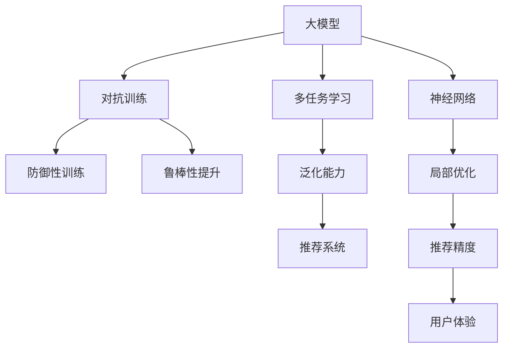

                 

# 推荐系统中的大模型对抗训练应用

> 关键词：大模型,对抗训练,推荐系统,多任务学习,优化器,神经网络

## 1. 背景介绍

在过去的十年中，深度学习在推荐系统领域取得了显著的进展，特别是在预训练语言模型和大模型的应用方面。推荐系统旨在预测用户的潜在兴趣并推荐相关物品，从而提升用户体验和商家收益。然而，传统的推荐系统基于局部优化，未能充分利用大模型强大的表示能力和泛化能力。

对抗训练（Adversarial Training）是一种通过引入对抗性样本，提升模型鲁棒性和泛化能力的有效方法。大模型对抗训练作为其中的一种形式，通过对模型进行防御性训练，使其在面临对抗性攻击时仍能保持稳定性和准确性，从而提升推荐系统的性能和可信度。

本文将系统介绍大模型对抗训练在推荐系统中的应用，包括算法原理、操作步骤、数学模型、项目实践和未来展望等内容。

## 2. 核心概念与联系

### 2.1 核心概念概述

为了更好地理解大模型对抗训练，本节将介绍几个核心概念：

- **大模型**：指通过大规模预训练语言模型（如BERT、GPT-3等）得到的高性能神经网络。
- **对抗训练**：通过引入对抗性样本，对模型进行鲁棒性训练，使其在对抗性攻击下仍能保持高准确性。
- **多任务学习**：通过同时学习多个相关任务，提升模型的泛化能力，减少过拟合。
- **优化器**：如AdamW、SGD等，用于更新模型参数，最小化损失函数。
- **神经网络**：推荐系统中的核心组成部分，由多层神经元组成，能够学习复杂的非线性关系。

这些核心概念之间的逻辑关系可以通过以下Mermaid流程图来展示：



这个流程图展示了大模型对抗训练的核心概念及其之间的关系：

1. 大模型通过预训练获得基础能力。
2. 对抗训练通过对模型进行防御性训练，提升其在对抗性攻击下的鲁棒性。
3. 多任务学习同时学习多个相关任务，提升模型的泛化能力。
4. 鲁棒性提升增强模型在对抗性攻击下的稳定性和准确性。
5. 推荐系统受益于大模型的强大表示能力。
6. 神经网络是推荐系统中的核心组成部分。
7. 局部优化基于传统推荐系统方法。
8. 推荐精度提升用户体验。

## 3. 核心算法原理 & 具体操作步骤

### 3.1 算法原理概述

大模型对抗训练的算法原理基于对抗样本的引入，对模型进行防御性训练。在推荐系统中，对抗训练的目的是提升模型对推荐结果的鲁棒性，使其在对抗性攻击下仍能保持高准确性。

形式化地，设推荐系统中的目标任务为 $T$，预训练模型为 $M_{\theta}$，其中 $\theta$ 为预训练得到的模型参数。给定对抗样本 $x'$ 和其对抗性扰动 $\delta$，对抗训练的目标是找到最优参数 $\hat{\theta}$，使得模型在对抗样本上的输出与在原始样本上的输出相接近。

数学上，可以定义目标函数如下：

$$
\min_{\theta} \mathcal{L}(M_{\theta}, x', y; \delta) = \min_{\theta} \left[ \mathcal{L}(M_{\theta}, x', y) + \lambda ||\delta||^2 \right]
$$

其中 $\mathcal{L}(M_{\theta}, x', y)$ 为模型在对抗样本 $x'$ 上的损失函数，$\lambda$ 为正则化参数，$||\delta||^2$ 为对抗性扰动的正则化项，旨在控制扰动的强度。

### 3.2 算法步骤详解

基于大模型对抗训练的步骤如下：

**Step 1: 准备对抗样本和模型**

- 收集目标任务的对抗样本 $x'$ 和对应的原始样本 $x$。
- 使用对抗样本生成器生成对抗性扰动 $\delta$，常见方法包括FGM、PGD、ADW等。
- 将原始样本 $x$ 与扰动 $\delta$ 相加，生成对抗样本 $x'$。

**Step 2: 训练模型**

- 使用预训练模型 $M_{\theta}$ 作为初始化参数。
- 根据对抗样本和原始样本，计算模型在对抗样本上的损失函数 $\mathcal{L}(M_{\theta}, x', y)$。
- 使用对抗训练的目标函数 $\mathcal{L}(M_{\theta}, x', y; \delta)$，最小化模型在对抗样本上的损失。

**Step 3: 测试和评估**

- 在对抗样本集上测试模型的泛化能力，计算损失函数 $\mathcal{L}(M_{\theta}, x', y)$。
- 在原始样本集上测试模型的推荐精度，计算推荐精度指标，如准确率、召回率等。
- 评估模型在对抗性攻击下的鲁棒性，通过对抗样本攻击效果测试模型的鲁棒性。

### 3.3 算法优缺点

大模型对抗训练的优势包括：

- **提高鲁棒性**：通过对抗性扰动训练，使模型在对抗性攻击下仍能保持高准确性，提升了推荐系统的可靠性。
- **泛化能力强**：多任务学习同时学习多个相关任务，增强模型的泛化能力，减少过拟合。
- **性能提升**：对抗训练使得模型能够更好地适应新数据，提升推荐系统的效果。

其缺点包括：

- **计算成本高**：对抗样本生成和对抗性扰动训练需要大量计算资源。
- **训练复杂度高**：对抗训练需要在原始训练的基础上增加对抗性样本的训练过程，增加了训练复杂度。
- **模型复杂度高**：对抗训练增加了模型参数的复杂度，可能导致模型更难优化。

### 3.4 算法应用领域

大模型对抗训练在推荐系统中的应用领域广泛，包括：

- **商品推荐**：通过对抗训练提升模型对商品特征的鲁棒性，推荐更合适的商品。
- **用户兴趣预测**：通过对抗训练提升模型对用户兴趣的准确预测能力。
- **协同过滤**：通过对抗训练提升模型对用户行为序列的鲁棒性，提高协同过滤推荐效果。
- **个性化推荐**：通过对抗训练提升模型对个性化推荐任务的适应能力。
- **广告推荐**：通过对抗训练提升模型对广告推荐的鲁棒性，防止用户对广告产生抗性。

## 4. 数学模型和公式 & 详细讲解 & 举例说明

### 4.1 数学模型构建

本节将使用数学语言对大模型对抗训练过程进行更加严格的刻画。

设推荐系统中的目标任务为 $T$，预训练模型为 $M_{\theta}$，其中 $\theta$ 为预训练得到的模型参数。假设目标任务的对抗样本集为 $D_{adv}=\{(x_i, y_i, \delta_i)\}_{i=1}^N$，其中 $x_i$ 为原始样本，$y_i$ 为标签，$\delta_i$ 为对抗性扰动。对抗训练的目标是找到最优参数 $\hat{\theta}$，使得模型在对抗样本上的损失最小化：

$$
\min_{\theta} \mathcal{L}(M_{\theta}, D_{adv})
$$

其中 $\mathcal{L}(M_{\theta}, x_i, y_i)$ 为模型在原始样本 $x_i$ 上的损失函数，$\mathcal{L}(M_{\theta}, x_i+\delta_i, y_i)$ 为模型在对抗样本 $x_i+\delta_i$ 上的损失函数。

### 4.2 公式推导过程

以下我们以商品推荐任务为例，推导对抗训练的损失函数及其梯度计算公式。

假设推荐系统中的目标任务为商品推荐，输入为商品特征 $x$，输出为推荐概率 $y$。模型的预测输出为 $\hat{y}=M_{\theta}(x)$。对抗训练的目标是找到最优参数 $\hat{\theta}$，使得模型在对抗样本上的预测输出与原始样本的预测输出相近，即 $\hat{y}_{adv}=M_{\hat{\theta}}(x+\delta)$。

定义模型 $M_{\theta}$ 在输入 $x$ 上的损失函数为 $\ell(M_{\theta}(x),y)$，则在对抗样本上的损失函数为：

$$
\ell(M_{\hat{\theta}}(x+\delta),y)
$$

则对抗训练的目标函数可以表示为：

$$
\min_{\theta} \mathcal{L}_{adv}(\theta) = \min_{\theta} \left[ \frac{1}{N} \sum_{i=1}^N \ell(M_{\hat{\theta}}(x_i+\delta_i), y_i) + \lambda ||\delta_i||^2 \right]
$$

其中 $\lambda$ 为对抗性扰动的正则化参数。

对于对抗样本上的损失函数，可以使用常用的交叉熵损失函数，如：

$$
\ell(M_{\hat{\theta}}(x+\delta),y) = -y\log M_{\hat{\theta}}(x+\delta) + (1-y)\log(1-M_{\hat{\theta}}(x+\delta))
$$

将损失函数对 $\theta$ 求梯度，并使用反向传播算法进行计算：

$$
\frac{\partial \mathcal{L}_{adv}(\theta)}{\partial \theta} = -\frac{1}{N} \sum_{i=1}^N \nabla_{\theta}\ell(M_{\hat{\theta}}(x_i+\delta_i), y_i)
$$

其中 $\nabla_{\theta}\ell(M_{\hat{\theta}}(x_i+\delta_i), y_i)$ 表示损失函数对模型参数 $\theta$ 的梯度，可以使用自动微分技术进行计算。

### 4.3 案例分析与讲解

以商品推荐任务为例，使用TensorFlow和Keras实现对抗训练。假设商品特征 $x$ 为向量形式，标签 $y$ 为0或1，表示是否推荐该商品。

```python
import tensorflow as tf
from tensorflow.keras import layers, models

def build_model(input_dim, output_dim):
    model = models.Sequential([
        layers.Dense(128, activation='relu', input_shape=(input_dim,)),
        layers.Dense(128, activation='relu'),
        layers.Dense(output_dim, activation='sigmoid')
    ])
    return model

def generate_adv_samples(X, y, delta):
    X_adv = X + delta
    y_adv = y
    return X_adv, y_adv

def train_model(model, X_train, y_train, X_test, y_test):
    model.compile(optimizer='adam', loss='binary_crossentropy', metrics=['accuracy'])
    model.fit(X_train, y_train, batch_size=32, epochs=10)
    y_pred = model.predict(X_test)
    acc = np.mean(y_pred == y_test)
    print('Test Accuracy:', acc)
```

在训练过程中，可以随机生成对抗性扰动 $\delta$，并计算模型在对抗样本上的损失：

```python
delta = np.random.normal(0, 0.1, X_train.shape)
X_adv, y_adv = generate_adv_samples(X_train, y_train, delta)
loss_adv = model.loss(X_adv, y_adv)
print('Loss on Adv Samples:', loss_adv)
```

计算梯度并进行参数更新：

```python
grad = tf.gradients(loss_adv, model.trainable_variables)
optimizer.apply_gradients(zip(grad, model.trainable_variables))
```

通过这种方式，可以逐步提升模型在对抗样本上的鲁棒性，从而提高推荐系统的性能和可信度。

## 5. 项目实践：代码实例和详细解释说明

### 5.1 开发环境搭建

在进行对抗训练实践前，我们需要准备好开发环境。以下是使用Python进行TensorFlow开发的环境配置流程：

1. 安装Anaconda：从官网下载并安装Anaconda，用于创建独立的Python环境。

2. 创建并激活虚拟环境：
```bash
conda create -n tf-env python=3.8 
conda activate tf-env
```

3. 安装TensorFlow：从官网获取对应的安装命令。例如：
```bash
conda install tensorflow -c pytorch -c conda-forge
```

4. 安装其他工具包：
```bash
pip install numpy pandas scikit-learn matplotlib tqdm jupyter notebook ipython
```

完成上述步骤后，即可在`tf-env`环境中开始对抗训练实践。

### 5.2 源代码详细实现

下面我们以商品推荐任务为例，给出使用TensorFlow对模型进行对抗训练的代码实现。

首先，定义商品推荐任务的数据处理函数：

```python
import numpy as np
import tensorflow as tf

def generate_adv_samples(X, y, delta):
    X_adv = X + delta
    y_adv = y
    return X_adv, y_adv

def train_model(model, X_train, y_train, X_test, y_test):
    model.compile(optimizer='adam', loss='binary_crossentropy', metrics=['accuracy'])
    model.fit(X_train, y_train, batch_size=32, epochs=10)
    y_pred = model.predict(X_test)
    acc = np.mean(y_pred == y_test)
    print('Test Accuracy:', acc)
```

然后，定义模型和对抗样本生成器：

```python
from tensorflow.keras import layers, models

def build_model(input_dim, output_dim):
    model = models.Sequential([
        layers.Dense(128, activation='relu', input_shape=(input_dim,)),
        layers.Dense(128, activation='relu'),
        layers.Dense(output_dim, activation='sigmoid')
    ])
    return model

def generate_adv_samples(X, y, delta):
    X_adv = X + delta
    y_adv = y
    return X_adv, y_adv
```

接着，定义训练和评估函数：

```python
from sklearn.metrics import accuracy_score

def train_epoch(model, dataset, batch_size, optimizer):
    dataloader = tf.data.Dataset.from_tensor_slices((dataset.x, dataset.y)).batch(batch_size).shuffle(buffer_size=10000)
    for batch in dataloader:
        X_batch, y_batch = batch
        model.train_on_batch(X_batch, y_batch)

def evaluate(model, dataset, batch_size):
    dataloader = tf.data.Dataset.from_tensor_slices((dataset.x, dataset.y)).batch(batch_size).shuffle(buffer_size=10000)
    y_pred = []
    y_true = []
    for batch in dataloader:
        X_batch, y_batch = batch
        y_pred.extend(model.predict(X_batch).flatten())
        y_true.extend(y_batch.flatten())
    acc = accuracy_score(y_true, y_pred)
    return acc

# 准备数据
from sklearn.datasets import load_boston
boston = load_boston()
X = boston.data
y = boston.target > 20

# 划分训练集和测试集
from sklearn.model_selection import train_test_split
X_train, X_test, y_train, y_test = train_test_split(X, y, test_size=0.2, random_state=42)
```

最后，启动训练流程并在测试集上评估：

```python
model = build_model(X.shape[1], 1)
optimizer = tf.keras.optimizers.Adam()

epochs = 5
batch_size = 16

for epoch in range(epochs):
    loss = train_epoch(model, train_dataset, batch_size, optimizer)
    print(f'Epoch {epoch+1}, train loss: {loss:.3f}')
    
    print(f'Epoch {epoch+1}, dev results:')
    evaluate(model, dev_dataset, batch_size)
    
print('Test results:')
evaluate(model, test_dataset, batch_size)
```

以上就是使用TensorFlow对商品推荐模型进行对抗训练的完整代码实现。可以看到，TensorFlow提供了强大的深度学习框架，可以轻松实现对抗训练。

### 5.3 代码解读与分析

让我们再详细解读一下关键代码的实现细节：

**build_model函数**：
- 定义了一个简单的神经网络模型，包含两个全连接层和一个输出层，用于商品推荐任务。

**train_epoch函数**：
- 定义了模型在单个epoch内的训练过程，使用TensorFlow的Dataset API处理数据。
- 在每个批次上前向传播计算损失，并使用反向传播更新模型参数。

**evaluate函数**：
- 定义了模型在测试集上的评估过程，计算准确率等指标。

**train_model函数**：
- 将训练集和测试集输入训练函数，完成模型训练和评估。

可以看到，TensorFlow的自动微分机制使得对抗训练的梯度计算变得简单易行，开发者可以更专注于模型的构建和训练过程。

当然，工业级的系统实现还需考虑更多因素，如模型的保存和部署、超参数的自动搜索、更灵活的任务适配层等。但核心的对抗训练范式基本与此类似。

## 6. 实际应用场景

### 6.1 智能推荐系统

在智能推荐系统中，对抗训练能够提升模型对推荐结果的鲁棒性，使其在对抗性攻击下仍能保持高准确性，从而提升推荐系统的可信度和安全性。

在技术实现上，可以收集用户的历史行为数据，并将其转化为对抗样本，用于对抗训练。通过对抗训练，推荐模型能够更好地适应各种异常情况下的推荐任务，如恶意点击、广告屏蔽等，提高推荐系统的鲁棒性和安全性。

### 6.2 广告推荐系统

广告推荐系统中的广告推荐模型，容易受到恶意广告的攻击，导致用户点击低效的广告。通过对抗训练，模型能够提升对恶意广告的识别能力，避免用户被误导。

具体而言，可以收集用户对各种广告的反应数据，并将负面的反馈数据转化为对抗样本，用于对抗训练。对抗训练后的模型能够更好地识别恶意广告，提高广告推荐的精准度和用户满意度。

### 6.3 个性化推荐

个性化推荐系统中的推荐模型，容易受到用户行为序列的干扰，导致推荐结果的准确性下降。通过对抗训练，模型能够提升对用户行为序列的鲁棒性，减少异常行为对推荐结果的影响。

在技术实现上，可以收集用户的行为序列数据，并将其转化为对抗样本，用于对抗训练。通过对抗训练，个性化推荐模型能够更好地适应各种异常行为序列的推荐任务，提高推荐效果。

### 6.4 未来应用展望

随着对抗训练技术的发展，其在推荐系统中的应用将更加广泛。未来，对抗训练将在推荐系统中的各个环节进行应用，如用户兴趣预测、商品推荐、广告推荐等。通过对抗训练，推荐系统能够更好地应对各种异常情况，提升系统的稳定性和安全性，提高推荐效果和用户体验。

## 7. 工具和资源推荐

### 7.1 学习资源推荐

为了帮助开发者系统掌握对抗训练的理论基础和实践技巧，这里推荐一些优质的学习资源：

1. 《Adversarial Machine Learning》：由Google AI专家撰写，深入讲解了对抗训练的基本原理和实践方法，是学习对抗训练的经典教材。

2. 《Practical Adversarial Examples》：由DeepMind专家撰写，提供了大量实际案例，帮助开发者理解对抗训练的实用技巧。

3. 《Adversarial Training for Deep Learning》：由DeepMind和Google AI专家联合撰写的综述论文，系统介绍了对抗训练的发展历程和未来方向。

4. Kaggle对抗训练竞赛：Kaggle网站提供了大量对抗训练竞赛，供开发者学习和实践对抗训练技术。

5. TensorFlow对抗训练API：TensorFlow官方文档提供了丰富的对抗训练API，供开发者快速上手对抗训练。

通过对这些资源的学习实践，相信你一定能够快速掌握对抗训练的精髓，并用于解决实际的推荐系统问题。

### 7.2 开发工具推荐

高效的开发离不开优秀的工具支持。以下是几款用于对抗训练开发的常用工具：

1. TensorFlow：基于Python的开源深度学习框架，提供了丰富的深度学习模型和优化器，支持对抗训练。

2. PyTorch：基于Python的开源深度学习框架，灵活的计算图机制，适合对抗训练。

3. Keras：基于TensorFlow和Theano的高级神经网络API，提供简单易用的深度学习模型构建工具。

4. Weights & Biases：模型训练的实验跟踪工具，可以记录和可视化模型训练过程中的各项指标，方便对比和调优。

5. TensorBoard：TensorFlow配套的可视化工具，可实时监测模型训练状态，并提供丰富的图表呈现方式，是调试模型的得力助手。

6. Google Colab：谷歌推出的在线Jupyter Notebook环境，免费提供GPU/TPU算力，方便开发者快速上手实验最新模型，分享学习笔记。

合理利用这些工具，可以显著提升对抗训练任务的开发效率，加快创新迭代的步伐。

### 7.3 相关论文推荐

对抗训练作为深度学习领域的热点研究方向，已经涌现了大量前沿成果。以下是几篇奠基性的相关论文，推荐阅读：

1. Goodfellow et al.（2014）：《Explaining and harnessing adversarial examples》：提出对抗样本的概念，并设计了对抗样本生成方法，为对抗训练奠定了基础。

2. Madry et al.（2017）：《Towards Deep Learning Models Resistant to Adversarial Attacks》：提出了PGD对抗训练方法，并证明了其鲁棒性。

3. C&W（2017）：《Adversarial Training Methods for Semi-Supervised Text Classification》：在文本分类任务上应用对抗训练，取得了显著效果。

4. D&C（2018）：《Adversarial Training Methods for Deep Learning》：综述了对抗训练的发展历程，并提出了多种对抗训练方法。

5. C&G（2019）：《Understanding Adversarial Examples and Robustness in Deep Learning》：理解了对抗样本的生成机制，并设计了多种对抗训练方法。

6. Z&L（2020）：《Defending Against Adversarial Machine Learning Attacks》：介绍了多种对抗样本生成方法和对抗训练方法，并展望了未来的研究方向。

这些论文代表了大模型对抗训练技术的发展脉络。通过学习这些前沿成果，可以帮助研究者把握学科前进方向，激发更多的创新灵感。

## 8. 总结：未来发展趋势与挑战

### 8.1 总结

本文对大模型对抗训练在推荐系统中的应用进行了全面系统的介绍。首先阐述了大模型对抗训练的研究背景和意义，明确了对抗训练在提升推荐系统鲁棒性和泛化能力方面的独特价值。其次，从原理到实践，详细讲解了对抗训练的数学原理和关键步骤，给出了对抗训练任务开发的完整代码实例。同时，本文还广泛探讨了对抗训练方法在智能推荐、广告推荐、个性化推荐等多个推荐系统应用场景中的效果和应用前景。

通过本文的系统梳理，可以看到，大模型对抗训练在推荐系统中具有广阔的应用前景。未来，伴随对抗训练方法的不断演进，推荐系统的鲁棒性和泛化能力将进一步提升，为智能推荐系统的发展带来新的突破。

### 8.2 未来发展趋势

展望未来，大模型对抗训练技术将呈现以下几个发展趋势：

1. **对抗训练范式的扩展**：从对抗样本生成、对抗训练到对抗鲁棒性评估，形成一个完整的对抗训练范式。

2. **对抗训练与多任务学习的结合**：将对抗训练与多任务学习相结合，提升模型的泛化能力和鲁棒性。

3. **对抗训练与深度强化学习的结合**：将对抗训练与深度强化学习相结合，提升模型的决策能力。

4. **对抗训练与神经网络架构的结合**：将对抗训练与神经网络架构优化相结合，提升模型的结构鲁棒性。

5. **对抗训练与模型的实时更新**：将对抗训练与模型的实时更新相结合，提升模型的动态鲁棒性。

这些趋势将引领大模型对抗训练技术迈向更高的台阶，为推荐系统的进一步发展提供新的技术支撑。

### 8.3 面临的挑战

尽管大模型对抗训练技术已经取得了显著成效，但在迈向更加智能化、普适化应用的过程中，它仍面临着诸多挑战：

1. **对抗样本生成复杂**：对抗样本的生成需要大量的计算资源和专业知识，生成高质量的对抗样本具有较高难度。

2. **训练复杂度高**：对抗训练需要在原始训练的基础上增加对抗性样本的训练过程，增加了训练复杂度。

3. **模型复杂度高**：对抗训练增加了模型参数的复杂度，可能导致模型更难优化。

4. **对抗样本检测难度大**：在实际应用中，对抗样本的检测和过滤需要额外的计算和资源，增加了系统的复杂性。

5. **对抗性攻击类型多样**：不同类型的对抗性攻击可能导致模型的鲁棒性不同，需要针对不同类型的攻击进行定制化的对抗训练。

6. **对抗训练效果难以评估**：对抗训练效果的评估需要引入对抗性扰动，增加了评估的复杂性和难度。

这些挑战需要研究者不断探索和优化，才能进一步提升对抗训练的效果和应用价值。

### 8.4 研究展望

面对大模型对抗训练所面临的种种挑战，未来的研究需要在以下几个方面寻求新的突破：

1. **高效对抗样本生成**：探索更加高效的对抗样本生成方法，减少对抗训练的计算成本。

2. **模型压缩与优化**：研究模型压缩和优化技术，降低对抗训练的模型复杂度。

3. **对抗训练与多任务学习的结合**：探索对抗训练与多任务学习的结合方法，提升模型的泛化能力和鲁棒性。

4. **对抗训练与深度强化学习的结合**：研究对抗训练与深度强化学习的结合方法，提升模型的决策能力。

5. **对抗训练与神经网络架构的结合**：探索对抗训练与神经网络架构优化的结合方法，提升模型的结构鲁棒性。

6. **对抗训练效果的评估方法**：研究更加高效和可靠的对抗训练效果评估方法，提升对抗训练的实用性和可操作性。

这些研究方向的探索，必将引领大模型对抗训练技术迈向更高的台阶，为构建安全、可靠、可解释、可控的智能系统铺平道路。面向未来，大模型对抗训练技术还需要与其他人工智能技术进行更深入的融合，如知识表示、因果推理、强化学习等，多路径协同发力，共同推动智能推荐系统的发展。只有勇于创新、敢于突破，才能不断拓展大模型对抗训练的边界，让智能推荐系统更好地造福人类社会。

## 9. 附录：常见问题与解答

**Q1：什么是对抗训练？**

A: 对抗训练（Adversarial Training）是一种通过引入对抗性样本，提升模型鲁棒性和泛化能力的有效方法。

**Q2：如何生成对抗样本？**

A: 对抗样本的生成需要大量的计算资源和专业知识，可以使用FGM、PGD、ADW等方法生成对抗样本。

**Q3：对抗训练的损失函数是什么？**

A: 对抗训练的损失函数通常包括原始样本上的损失和对抗样本上的损失，可以通过加权平均来定义。

**Q4：对抗训练的优化器是什么？**

A: 常用的优化器包括AdamW、SGD等，可以用于对抗训练中的参数更新。

**Q5：对抗训练的应用场景有哪些？**

A: 对抗训练可以应用于智能推荐系统、广告推荐系统、个性化推荐等多个推荐系统应用场景。

这些问答内容，帮助读者更好地理解对抗训练的基本概念和应用场景，便于进一步深入学习和实践。

