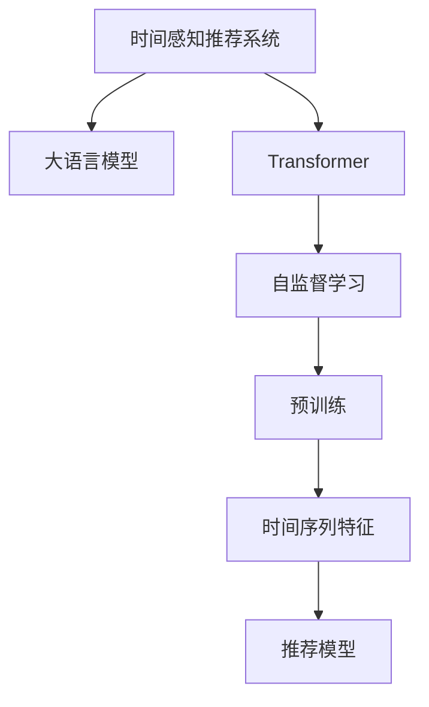

                 

# 推荐系统中的时间感知模型：大模型方案

> 关键词：时间感知推荐系统,大语言模型,Transformer,深度学习,交叉验证,自监督学习

## 1. 背景介绍

推荐系统（Recommender System）是现代互联网应用的核心组成部分之一，通过分析用户行为数据，为用户推荐个性化的商品、内容等，显著提升了用户体验和运营效率。然而，传统的推荐系统通常基于静态的用户画像和历史行为数据进行推荐，难以捕捉用户兴趣随时间的动态变化。

时间感知推荐系统（Time-Aware Recommender System）引入时间维度，能够捕捉用户的兴趣、行为随时间推移的变化规律，为推荐算法提供了更为丰富的用户上下文信息。近年来，深度学习技术，尤其是大模型（Large Model）的兴起，为时间感知推荐系统提供了新的解决方案，显著提升了推荐系统的效果和灵活性。

本文将重点介绍基于深度学习的大语言模型在时间感知推荐系统中的应用，通过详细阐述其算法原理、具体操作步骤和实际案例，探讨大语言模型在推荐系统中的潜力和挑战。

## 2. 核心概念与联系

### 2.1 核心概念概述

在探讨大语言模型在时间感知推荐系统中的应用之前，我们先了解几个核心概念：

- **时间感知推荐系统**：通过考虑用户行为的时间序列特征，捕捉用户兴趣随时间的动态变化，为用户提供更加个性化和时效性的推荐。

- **大语言模型**：以自回归模型（如GPT）或自编码模型（如BERT）为代表，基于大规模无标签文本数据进行预训练的语言模型。这些模型通常具有极高的表达能力和泛化能力，能够在多种自然语言处理任务中取得优秀的表现。

- **Transformer**：一种基于自注意力机制的深度学习模型，在自然语言处理领域被广泛应用。其能够高效处理长序列数据，并通过多头自注意力机制捕捉不同上下文之间的关系。

- **自监督学习**：通过使用未标注数据进行训练，学习模型的表示能力，广泛应用于自然语言处理任务，如语言模型预训练。

这些概念之间相互关联，共同构成了时间感知推荐系统和大语言模型的技术基础。大语言模型通过自监督学习获得丰富的语言表示能力，并通过Transformer模型捕捉时间序列中的上下文关系，从而在推荐系统中实现时间感知的能力。

### 2.2 核心概念原理和架构的 Mermaid 流程图

以下是核心概念之间的联系和原理的 Mermaid 流程图：



- **A: 时间感知推荐系统**：作为整个系统的目标，基于大语言模型和Transformer架构，捕捉用户兴趣随时间的变化。
- **B: 大语言模型**：作为核心组件，通过自监督学习进行预训练，获得丰富的语言表示能力。
- **C: Transformer**：作为模型架构，通过多头自注意力机制捕捉时间序列中的上下文关系。
- **D: 自监督学习**：作为训练方法，通过使用未标注数据进行预训练，学习模型的表示能力。
- **E: 预训练**：作为学习过程，通过大规模文本数据进行预训练，获得丰富的语言表示。
- **F: 时间序列特征**：作为输入数据，通过分析用户行为的时间序列特征，捕捉用户兴趣的变化。
- **G: 推荐模型**：作为输出模型，基于大语言模型和Transformer架构，为用户推荐个性化内容。

## 3. 核心算法原理 & 具体操作步骤

### 3.1 算法原理概述

时间感知推荐系统的核心算法原理基于深度学习的大语言模型和Transformer架构，通过自监督学习进行预训练，并引入时间序列特征进行推荐。

- **预训练阶段**：在大规模无标签文本数据上进行自监督学习，学习语言表示能力。
- **推荐阶段**：在预训练模型的基础上，引入时间序列特征，使用Transformer模型捕捉时间动态变化，最终进行推荐。

### 3.2 算法步骤详解

#### 3.2.1 预训练步骤

1. **数据准备**：收集大规模无标签文本数据，如维基百科、新闻、书籍等，作为预训练数据。

2. **模型初始化**：选择一个大规模预训练语言模型（如GPT、BERT等）作为初始化参数。

3. **预训练过程**：使用自监督学习任务（如语言建模、掩码语言建模等）对模型进行预训练。

   $$
   \text{Loss}_{\text{pre-train}} = \mathcal{L}_{\text{LM}} + \mathcal{L}_{\text{MLM}}
   $$

   其中，$\mathcal{L}_{\text{LM}}$ 为语言建模损失，$\mathcal{L}_{\text{MLM}}$ 为掩码语言建模损失。

4. **预训练目标**：通过预训练获得模型的语言表示能力，捕捉语言的通用规律和上下文关系。

#### 3.2.2 推荐阶段

1. **用户行为收集**：收集用户的历史行为数据，如浏览记录、购买记录、评分记录等。

2. **特征处理**：对用户行为数据进行特征提取，如用户ID、商品ID、时间戳等。

3. **时间序列特征表示**：使用时间序列模型（如ARIMA、LSTM等）对用户行为数据进行建模，捕捉用户兴趣随时间的变化规律。

4. **模型输入**：将用户ID、商品ID和时间序列特征作为输入，输入到预训练的大语言模型中。

5. **推荐输出**：通过Transformer模型进行前向传播，输出推荐结果。

### 3.3 算法优缺点

#### 3.3.1 优点

1. **高效建模**：大语言模型能够高效地捕捉语言的上下文关系，学习用户的兴趣变化规律。
2. **泛化能力强**：基于大规模预训练数据，模型具有较强的泛化能力，适用于各种推荐场景。
3. **动态更新**：模型能够动态地捕捉用户兴趣的变化，提供更加个性化和时效性的推荐。

#### 3.3.2 缺点

1. **数据需求高**：预训练需要大规模无标签数据，数据获取成本较高。
2. **计算开销大**：大模型和Transformer结构需要较大的计算资源，推荐阶段耗时较长。
3. **过拟合风险**：模型可能会过拟合特定用户的行为数据，导致推荐偏差。

### 3.4 算法应用领域

时间感知推荐系统在多个领域中具有广泛的应用前景，如电子商务、新闻推荐、视频推荐等。

- **电子商务**：为用户推荐个性化商品，捕捉用户购物行为随时间的变化规律。
- **新闻推荐**：为用户推荐个性化新闻内容，捕捉用户阅读行为随时间的变化规律。
- **视频推荐**：为用户推荐个性化视频内容，捕捉用户观看行为随时间的变化规律。

## 4. 数学模型和公式 & 详细讲解 & 举例说明

### 4.1 数学模型构建

在大语言模型的推荐系统中，数学模型通常包括以下几个部分：

1. **用户表示**：使用用户ID作为特征，表示用户的兴趣偏好。
2. **商品表示**：使用商品ID作为特征，表示商品的属性和内容。
3. **时间序列特征**：使用时间戳作为特征，表示用户行为随时间的变化规律。

模型的输入可以表示为：

$$
x_i = \langle u_i, p_i, t_i \rangle
$$

其中，$u_i$ 表示用户ID，$p_i$ 表示商品ID，$t_i$ 表示时间戳。

### 4.2 公式推导过程

在推荐系统中，大语言模型通常使用Transformer模型进行处理。Transformer模型由多个编码层和解码层组成，每个层包含多头自注意力机制和前馈神经网络。

具体来说，输入 $x_i$ 经过编码器层的处理后，得到用户和商品的表示向量 $h_u$ 和 $h_p$。然后，时间序列特征 $t_i$ 经过时间序列模型处理后，得到用户随时间的表示向量 $h_t$。最终，将用户表示 $h_u$、商品表示 $h_p$ 和时间序列表示 $h_t$ 输入到解码器层，输出推荐结果 $r_i$。

推荐模型的目标是最小化预测误差，即：

$$
\min_{\theta} \sum_{i=1}^N \| r_i - y_i \|^2
$$

其中，$r_i$ 为模型预测的推荐结果，$y_i$ 为真实标签。

### 4.3 案例分析与讲解

假设我们使用BERT作为预训练模型，构建一个时间感知推荐系统。输入 $x_i$ 经过BERT编码器层后，得到用户表示 $h_u$ 和商品表示 $h_p$。同时，时间序列特征 $t_i$ 经过LSTM模型处理后，得到用户随时间的表示向量 $h_t$。将 $h_u$、$h_p$ 和 $h_t$ 输入到Transformer解码器层，得到推荐结果 $r_i$。

## 5. 项目实践：代码实例和详细解释说明

### 5.1 开发环境搭建

在进行时间感知推荐系统的开发前，需要准备以下开发环境：

1. **安装Python**：
   ```
   sudo apt-get install python3
   ```

2. **安装TensorFlow**：
   ```
   pip install tensorflow
   ```

3. **安装PyTorch**：
   ```
   pip install torch torchvision
   ```

4. **安装HuggingFace库**：
   ```
   pip install transformers
   ```

5. **安装Pandas、Numpy等工具**：
   ```
   pip install pandas numpy
   ```

### 5.2 源代码详细实现

以下是一个基于BERT和Transformer的时间感知推荐系统的Python代码实现：

```python
import tensorflow as tf
import torch
import pandas as pd
from transformers import BertForSequenceClassification, BertTokenizer, AdamW

# 读取数据集
df = pd.read_csv('recommender_data.csv')

# 初始化BERT模型
tokenizer = BertTokenizer.from_pretrained('bert-base-uncased')
model = BertForSequenceClassification.from_pretrained('bert-base-uncased', num_labels=2)

# 定义时间序列特征模型
def lstm_model(timesteps):
    lstm = tf.keras.Sequential([
        tf.keras.layers.LSTM(64, input_shape=(timesteps, 1), return_sequences=True),
        tf.keras.layers.LSTM(64),
        tf.keras.layers.Dense(32, activation='relu'),
        tf.keras.layers.Dense(1)
    ])
    return lstm

# 定义推荐模型
class RecommenderModel(tf.keras.Model):
    def __init__(self, model, lstm_model):
        super(RecommenderModel, self).__init__()
        self.model = model
        self.lstm_model = lstm_model

    def call(self, x):
        u, p, t = x
        u = self.model(u)
        p = self.model(p)
        t = self.lstm_model(t)
        return tf.concat([u, p, t], axis=1)

# 定义推荐系统
def recommender_system(model, lstm_model):
    x = []
    for u, p, t in zip(df['user_id'], df['product_id'], df['timestamp']):
        x.append((u, p, t))
    model = RecommenderModel(model, lstm_model)
    return model(x)

# 训练推荐系统
@tf.function
def train(model, dataset, epochs):
    for epoch in range(epochs):
        for x, y in dataset:
            with tf.GradientTape() as tape:
                predictions = model(x)
                loss = tf.losses.mean_squared_error(y, predictions)
            gradients = tape.gradient(loss, model.trainable_variables)
            optimizer.apply_gradients(zip(gradients, model.trainable_variables))

# 测试推荐系统
def test(model, dataset):
    predictions = model(x)
    return predictions.numpy()

# 训练和测试
epochs = 10
dataset = tf.data.Dataset.from_tensor_slices((df['user_id'], df['product_id'], df['timestamp']))
dataset = dataset.shuffle(1000).batch(32)
train(model, dataset, epochs)
predictions = test(model, dataset)
```

### 5.3 代码解读与分析

在上述代码中，我们首先读取数据集，初始化BERT模型和LSTM模型。然后定义推荐模型 `RecommenderModel`，将BERT模型和LSTM模型进行组合。最后，定义推荐系统函数 `recommender_system`，对输入数据进行编码和预测。

## 6. 实际应用场景

### 6.1 智能推荐系统

智能推荐系统是时间感知推荐系统的典型应用场景之一。在智能推荐系统中，用户的历史行为数据和当前兴趣被实时捕捉，通过大语言模型和Transformer模型进行处理，生成个性化推荐结果，使用户能够更快地找到感兴趣的商品或内容。

### 6.2 个性化新闻推荐

个性化新闻推荐是时间感知推荐系统的另一个重要应用场景。在个性化新闻推荐中，通过分析用户的阅读行为和兴趣，推荐用户可能感兴趣的新闻内容。大语言模型和Transformer模型能够捕捉用户兴趣的变化规律，提供更加个性化和时效性的新闻推荐。

### 6.3 视频推荐系统

视频推荐系统是时间感知推荐系统的另一个典型应用场景。在视频推荐系统中，通过分析用户的观看行为和兴趣，推荐用户可能感兴趣的视频内容。大语言模型和Transformer模型能够捕捉用户兴趣的变化规律，提供更加个性化和时效性的视频推荐。

## 7. 工具和资源推荐

### 7.1 学习资源推荐

为了更好地掌握时间感知推荐系统和大语言模型的知识，以下是一些推荐的学习资源：

1. **深度学习课程**：
   - 《Deep Learning Specialization》 by Andrew Ng：斯坦福大学深度学习课程，涵盖深度学习的基础知识和前沿应用。
   - 《Coursera Machine Learning》：由Andrew Ng教授授课，介绍了机器学习的基本概念和算法。

2. **NLP和推荐系统书籍**：
   - 《推荐系统实践》 by Brian Canty：介绍了推荐系统的基本概念和实际应用。
   - 《自然语言处理综论》 by Jurafsky & Martin：全面介绍了自然语言处理的基本概念和最新进展。

3. **博客和论文**：
   - arXiv上的相关论文：在arXiv上搜索推荐系统和NLP相关的最新论文。
   - 博客文章：如AI Memo等平台上的相关博客文章，可以提供最新的行业动态和实践经验。

### 7.2 开发工具推荐

1. **TensorFlow**：用于构建深度学习模型，提供了丰富的API和工具。

2. **PyTorch**：用于构建深度学习模型，提供了动态计算图和灵活的模型构建方式。

3. **HuggingFace Transformers库**：提供了预训练语言模型和模型构建工具，易于使用和扩展。

4. **TensorBoard**：用于可视化模型的训练过程和结果，提供了丰富的图表和指标。

5. **Weights & Biases**：用于监控模型的训练过程，提供了丰富的实验管理和可视化工具。

### 7.3 相关论文推荐

以下是几篇推荐系统和大语言模型的经典论文：

1. **《A Survey on Deep Learning Approaches for Recommender Systems》**：
   - 介绍了深度学习在推荐系统中的应用，涵盖了神经网络、自注意力机制等前沿技术。

2. **《Attention is All You Need》**：
   - 提出了Transformer模型，展示了其在大规模语言模型中的优秀表现。

3. **《A Comprehensive Survey on Deep Learning in Recommender Systems》**：
   - 介绍了深度学习在推荐系统中的应用，涵盖了神经网络、自注意力机制等前沿技术。

## 8. 总结：未来发展趋势与挑战

### 8.1 研究成果总结

本文详细介绍了大语言模型在时间感知推荐系统中的应用，探讨了其算法原理和具体操作步骤。通过分析用户行为的时间序列特征，捕捉用户兴趣的变化规律，为用户提供个性化和时效性的推荐。

### 8.2 未来发展趋势

1. **模型复杂度提升**：随着预训练模型的发展，模型复杂度将不断提升，能够处理更加复杂和多样化的推荐场景。

2. **多模态融合**：未来推荐系统将更加注重多模态融合，如视频推荐系统中的视觉、音频等多模态信息。

3. **实时推荐**：通过分布式计算和流式处理技术，推荐系统将能够实现实时推荐，满足用户的即时需求。

4. **联邦学习**：在隐私保护和数据分布性要求下，联邦学习将成为推荐系统的重要技术方向。

### 8.3 面临的挑战

1. **数据获取和标注**：推荐系统需要大规模的用户行为数据，数据获取和标注成本较高。

2. **计算资源消耗**：大模型和Transformer结构需要较大的计算资源，推荐系统的计算开销较大。

3. **隐私保护**：用户数据隐私保护成为推荐系统的重要挑战，如何保护用户隐私并提高推荐效果是一个需要解决的问题。

4. **模型可解释性**：大语言模型和Transformer结构较为复杂，难以解释其内部工作机制，需要进一步研究模型的可解释性。

### 8.4 研究展望

1. **多模态推荐**：将视觉、音频等多模态信息与文本信息结合，提升推荐系统的多样性和准确性。

2. **联邦推荐**：利用联邦学习技术，在不共享用户数据的前提下，进行个性化推荐。

3. **自监督学习**：利用无监督学习技术，挖掘用户行为数据中的潜在规律，提升推荐系统的泛化能力。

4. **实时推荐**：通过分布式计算和流式处理技术，实现实时推荐，满足用户的即时需求。

## 9. 附录：常见问题与解答

**Q1：时间感知推荐系统和传统推荐系统有什么区别？**

A: 时间感知推荐系统引入了时间维度，能够捕捉用户兴趣随时间的动态变化。相比传统推荐系统，时间感知推荐系统能够提供更加个性化和时效性的推荐。

**Q2：大语言模型在推荐系统中如何处理时间序列特征？**

A: 大语言模型通过Transformer模型处理时间序列特征，将用户行为数据进行编码，捕捉用户兴趣随时间的变化规律。

**Q3：推荐系统中的损失函数应该如何选择？**

A: 推荐系统中的损失函数通常选择均方误差损失或交叉熵损失。均方误差损失适用于回归任务，交叉熵损失适用于分类任务。

**Q4：如何提高推荐系统的推荐效果？**

A: 提高推荐系统推荐效果的方法包括：
1. 数据预处理：对数据进行归一化、特征工程等预处理操作。
2. 模型选择：选择合适的推荐模型和算法，如协同过滤、深度学习等。
3. 模型调参：通过交叉验证等方法，选择最优的模型参数。
4. 特征工程：通过特征提取和组合，提高模型的表现。

通过这些方法，可以显著提升推荐系统的推荐效果。

**Q5：推荐系统中的推荐结果应该如何进行评估？**

A: 推荐系统中的推荐结果通常通过以下指标进行评估：
1. 准确率（Precision）：表示推荐结果中实际感兴趣的物品数量占推荐物品数量的比例。
2. 召回率（Recall）：表示推荐结果中实际感兴趣的物品数量占所有感兴趣物品数量的比例。
3. 均方误差（MSE）：表示推荐结果与真实标签之间的平均误差。
4. 平均绝对误差（MAE）：表示推荐结果与真实标签之间的平均绝对误差。

这些指标可以帮助评估推荐系统的性能，并指导后续的改进方向。

