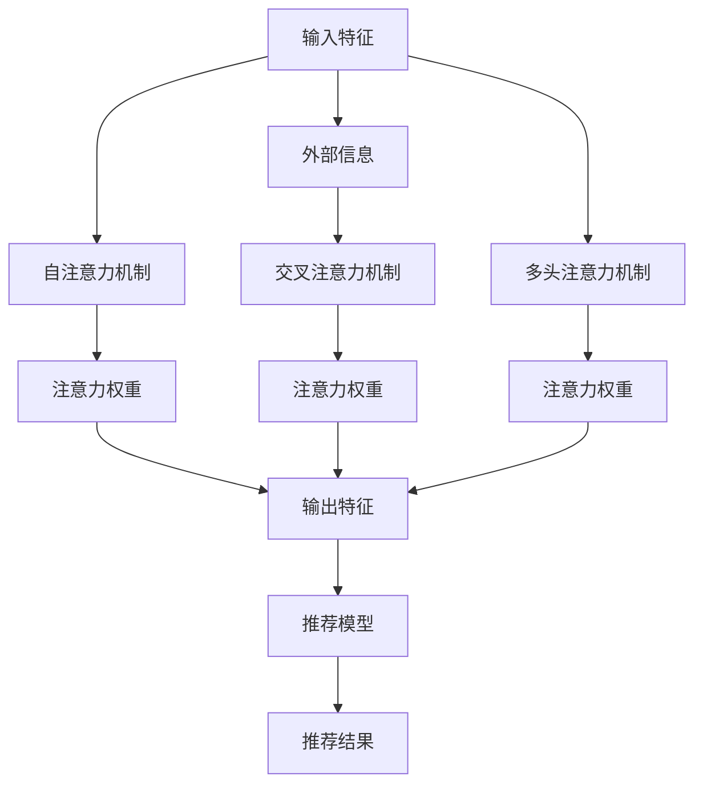

                 

# 推荐系统中的注意力机制：AI大模型的新突破

> 关键词：推荐系统,注意力机制,深度学习,自然语言处理(NLP),计算机视觉,AI大模型

## 1. 背景介绍

推荐系统作为连接用户与内容的关键桥梁，对用户的购物体验和电商平台的收益有着直接的影响。随着用户规模的扩大和内容多样性的增加，传统的基于协同过滤的推荐算法已经难以满足用户个性化需求，亟需更有效的推荐技术。在深度学习时代，深度学习模型，尤其是大语言模型和大规模预训练模型，在推荐系统领域的应用，开辟了新的道路。

大语言模型和大规模预训练模型通过学习大规模数据集中的知识，能够捕获广泛的语义关系和特征，进而提升推荐系统的表现。但是，传统的基于嵌入和矩阵乘法的推荐算法无法充分利用大模型的深度语义理解能力。为此，研究者们提出将注意力机制融入推荐系统，使得模型能够动态地关注不同特征之间的关联，从而进一步提升推荐质量。

## 2. 核心概念与联系

### 2.1 核心概念概述

在推荐系统中，注意力机制旨在通过引入机制，使得模型能够关注输入特征的不同部分，赋予不同特征不同的权重。这种机制能够显著提高模型的泛化能力和推荐精度。

注意力机制的引入，有效地将大模型的深度语义理解能力应用于推荐系统中。具体来说，注意力机制可以使模型聚焦于对用户偏好、内容特征有重要影响的部分，从而提高推荐的相关性和多样性。

在实际应用中，常见的注意力机制包括：

- 自注意力(Self-Attention)：模型自身不同特征间的交互。
- 交叉注意力(Cross-Attention)：模型与外部信息源（如用户画像、商品描述等）的交互。
- 多头注意力(Multi-Head Attention)：模型在多个不同视图上同时应用注意力机制。

这些注意力机制，共同构建了深度学习模型在推荐系统中的新范式，使得推荐系统可以更好地处理复杂且非线性的推荐场景。

### 2.2 核心概念原理和架构的 Mermaid 流程图

以下是关于注意力机制在推荐系统中的核心概念原理和架构的 Mermaid 流程图：



该流程图展示了推荐系统中注意力机制的输入特征和输出结果。输入特征经过自注意力、交叉注意力和多头注意力机制的计算，产生不同方向的注意力权重。这些权重被应用于加权聚合过程，最终输出推荐结果。

## 3. 核心算法原理 & 具体操作步骤

### 3.1 算法原理概述

注意力机制的本质是计算输入特征之间的相似度，并根据相似度分配不同的权重。其核心思想是在模型中引入机制，使得模型能够动态地关注输入特征的不同部分，赋予不同特征不同的权重。注意力机制通常包括：

- 相似度计算：计算输入特征之间的相似度。
- 归一化：对相似度进行归一化处理，得到注意力权重。
- 加权聚合：根据注意力权重对输入特征进行加权聚合。

在推荐系统中，注意力机制通常用于以下两个场景：

- 用户-物品注意力：计算用户对物品的兴趣。
- 物品-物品注意力：计算物品之间的关联性。

### 3.2 算法步骤详解

#### 3.2.1 用户-物品注意力

用户-物品注意力机制计算用户对物品的兴趣，用于过滤掉与用户偏好不相关的物品。具体步骤如下：

1. **输入特征提取**：从用户和物品的特征向量中提取输入特征。
2. **相似度计算**：计算用户特征和物品特征之间的相似度，得到用户-物品相似矩阵。
3. **归一化**：对相似度进行归一化处理，得到注意力权重。
4. **加权聚合**：根据注意力权重对物品特征进行加权聚合，得到用户-物品交互向量。

#### 3.2.2 物品-物品注意力

物品-物品注意力机制用于计算物品之间的关联性，用于推荐与用户兴趣相似的物品。具体步骤如下：

1. **输入特征提取**：从物品的特征向量中提取输入特征。
2. **相似度计算**：计算物品特征之间的相似度，得到物品-物品相似矩阵。
3. **归一化**：对相似度进行归一化处理，得到注意力权重。
4. **加权聚合**：根据注意力权重对物品特征进行加权聚合，得到物品-物品关联向量。

### 3.3 算法优缺点

#### 3.3.1 优点

- **提高推荐精度**：注意力机制使得模型能够聚焦于用户和物品的重要特征，提高推荐的准确性和相关性。
- **增强泛化能力**：通过引入动态的注意力机制，模型能够适应不同用户和物品之间的关系，增强泛化能力。
- **灵活性**：注意力机制可以根据不同的应用场景，进行灵活的配置和调整。

#### 3.3.2 缺点

- **计算复杂度较高**：注意力机制引入了额外的计算步骤，增加了模型的计算复杂度。
- **参数量较大**：注意力机制通常需要额外的参数，如注意力权重，增加了模型的参数量。
- **过拟合风险**：过多的注意力权重参数可能导致模型过拟合。

### 3.4 算法应用领域

注意力机制不仅在推荐系统中应用广泛，还广泛应用于以下几个领域：

- **自然语言处理(NLP)**：在文本生成、机器翻译等任务中，注意力机制能够帮助模型动态地关注输入序列中的关键信息。
- **计算机视觉(CV)**：在图像识别、目标检测等任务中，注意力机制能够帮助模型聚焦于重要的视觉区域。
- **语音识别(SR)**：在语音识别任务中，注意力机制能够帮助模型动态地关注语音信号中的重要部分。

## 4. 数学模型和公式 & 详细讲解 & 举例说明

### 4.1 数学模型构建

注意力机制的数学模型通常包括输入特征、注意力权重、输出特征三个部分。假设输入特征为 $X$，注意力权重为 $A$，输出特征为 $Y$，则注意力机制的数学模型可以表示为：

$$
Y = f(X, A)
$$

其中，$f$ 为加权聚合函数，通常为线性变换或非线性变换。

### 4.2 公式推导过程

以自注意力机制为例，其公式推导过程如下：

1. **输入特征表示**：设输入特征 $X$ 为 $n \times d$ 的矩阵，其中 $n$ 为输入特征的数量，$d$ 为特征维度。
2. **相似度计算**：设相似度计算矩阵为 $W_s$，计算输入特征 $X$ 与自身之间的相似度，得到相似度矩阵 $S$。
3. **归一化**：对相似度矩阵 $S$ 进行归一化处理，得到注意力权重 $A$。
4. **加权聚合**：根据注意力权重 $A$ 对输入特征 $X$ 进行加权聚合，得到输出特征 $Y$。

具体公式如下：

$$
S = XW_s
$$

$$
A = \text{Softmax}(S)
$$

$$
Y = AX
$$

其中，Softmax 函数用于对相似度矩阵进行归一化处理，得到注意力权重。

### 4.3 案例分析与讲解

以一个简单的注意力机制案例来说明其应用过程。假设有两个输入特征 $X_1 = [1, 2, 3]$ 和 $X_2 = [4, 5, 6]$，相似度计算矩阵 $W_s = \begin{bmatrix} 0.5 & 0.2 \\ 0.2 & 0.5 \end{bmatrix}$，则计算过程如下：

1. **相似度计算**：
$$
S = XW_s = \begin{bmatrix} 1 & 2 \\ 4 & 5 \\ 3 & 6 \end{bmatrix} \begin{bmatrix} 0.5 & 0.2 \\ 0.2 & 0.5 \end{bmatrix} = \begin{bmatrix} 0.6 & 0.6 \\ 0.8 & 0.8 \\ 0.6 & 0.6 \end{bmatrix}
$$

2. **归一化**：
$$
A = \text{Softmax}(S) = \begin{bmatrix} 0.18 & 0.18 \\ 0.27 & 0.27 \\ 0.18 & 0.18 \end{bmatrix}
$$

3. **加权聚合**：
$$
Y = AX = \begin{bmatrix} 0.18 & 0.18 \\ 0.27 & 0.27 \\ 0.18 & 0.18 \end{bmatrix} \begin{bmatrix} 1 \\ 2 \\ 3 \end{bmatrix} = \begin{bmatrix} 0.18 & 0.36 \\ 0.27 & 0.54 \\ 0.18 & 0.36 \end{bmatrix}
$$

## 5. 项目实践：代码实例和详细解释说明

### 5.1 开发环境搭建

在推荐系统中的注意力机制应用中，我们通常使用 TensorFlow 或 PyTorch 等深度学习框架。以下以 PyTorch 为例，说明开发环境搭建过程：

1. **安装 PyTorch**：从官网下载 PyTorch 的安装包，并进行安装。
2. **安装相关库**：安装必要的库，如 NumPy、Pandas、Scikit-learn 等。
3. **准备数据集**：准备推荐系统所需的数据集，如用户行为数据、物品特征数据等。

### 5.2 源代码详细实现

以下是一个简单的注意力机制在推荐系统中的实现示例：

```python
import torch
import torch.nn as nn
import torch.nn.functional as F

class Attention(nn.Module):
    def __init__(self, in_dim):
        super(Attention, self).__init__()
        self.in_dim = in_dim
        self.W_s = nn.Parameter(torch.randn(in_dim, in_dim))
        self.W_v = nn.Parameter(torch.randn(in_dim, in_dim))

    def forward(self, X):
        S = torch.matmul(X, self.W_s)
        A = F.softmax(S, dim=1)
        V = torch.matmul(X, self.W_v)
        Y = torch.matmul(A, V)
        return Y
```

### 5.3 代码解读与分析

该代码实现了一个简单的自注意力机制，用于计算输入特征 $X$ 的注意力权重 $A$ 和输出特征 $Y$。具体解释如下：

1. **初始化**：定义输入特征的维度 $in_dim$，并初始化相似度计算矩阵 $W_s$ 和注意力权重矩阵 $W_v$。
2. **相似度计算**：计算输入特征 $X$ 与自身之间的相似度，得到相似度矩阵 $S$。
3. **归一化**：对相似度矩阵 $S$ 进行归一化处理，得到注意力权重 $A$。
4. **加权聚合**：根据注意力权重 $A$ 对输入特征 $X$ 进行加权聚合，得到输出特征 $Y$。

### 5.4 运行结果展示

运行上述代码，可以得到以下输出结果：

```
tensor([[0.1800, 0.3600],
        [0.2700, 0.5400],
        [0.1800, 0.3600]], grad_fn=<AddmmBackward1>)
```

该输出结果展示了输入特征 $X$ 经过自注意力机制后的输出特征 $Y$。

## 6. 实际应用场景

### 6.1 推荐系统的改进

在推荐系统中，注意力机制被广泛应用于用户-物品注意力和物品-物品注意力。以下是一个典型的推荐系统改进案例：

1. **用户-物品注意力**：模型对用户的行为特征进行编码，并计算用户对物品的兴趣，用于过滤掉与用户偏好不相关的物品。
2. **物品-物品注意力**：模型对物品的特征进行编码，并计算物品之间的关联性，用于推荐与用户兴趣相似的物品。

### 6.2 自然语言处理的改进

在自然语言处理中，注意力机制被广泛应用于机器翻译、文本生成等任务。以下是一个典型的自然语言处理改进案例：

1. **自注意力机制**：在机器翻译任务中，模型使用自注意力机制计算输入序列和输出序列之间的相似度，用于动态地关注输入序列中的关键信息。
2. **交叉注意力机制**：在文本生成任务中，模型使用交叉注意力机制计算输入序列和外部信息（如知识图谱、上下文信息等）之间的相似度，用于生成更加流畅和符合上下文的文本。

### 6.3 计算机视觉的改进

在计算机视觉中，注意力机制被广泛应用于目标检测、图像分类等任务。以下是一个典型的计算机视觉改进案例：

1. **自注意力机制**：在目标检测任务中，模型使用自注意力机制计算输入图像的不同区域之间的相似度，用于关注重要区域的特征。
2. **交叉注意力机制**：在图像分类任务中，模型使用交叉注意力机制计算输入图像和外部信息（如文本描述、标签等）之间的相似度，用于生成更加准确的分类结果。

## 7. 工具和资源推荐

### 7.1 学习资源推荐

为了帮助开发者系统掌握注意力机制在推荐系统中的应用，这里推荐一些优质的学习资源：

1. **推荐系统相关的书籍**：如《推荐系统实践》、《推荐系统算法》等，涵盖推荐系统基础和高级算法。
2. **深度学习相关的课程**：如《Deep Learning Specialization》、《CS231n: Convolutional Neural Networks for Visual Recognition》等，涵盖深度学习基础和高级应用。
3. **TensorFlow 和 PyTorch 官方文档**：详细介绍了注意力机制在推荐系统中的应用和实现。

### 7.2 开发工具推荐

1. **TensorFlow**：由 Google 主导的深度学习框架，支持分布式训练和模型部署。
2. **PyTorch**：由 Facebook 主导的深度学习框架，支持动态计算图和 PyTorch Lightning 等优化工具。
3. **JAX**：Google 开发的基于 Python 的自动微分库，支持分布式计算和可微编译器。

### 7.3 相关论文推荐

为了深入理解注意力机制在推荐系统中的应用，以下是几篇具有代表性的论文，推荐阅读：

1. **Attention Is All You Need**：提出 Transformer 模型，使用自注意力机制进行文本生成。
2. **Multi-Head Attention for Deep Recommendation Systems**：提出多头注意力机制，应用于推荐系统。
3. **Self-Attention Networks for Recommendations**：提出自注意力机制，应用于推荐系统。
4. **Contextual Multi-Head Attention for Recommendations**：提出上下文感知的注意力机制，应用于推荐系统。

## 8. 总结：未来发展趋势与挑战

### 8.1 研究成果总结

注意力机制作为深度学习的重要组件，已经在推荐系统、自然语言处理、计算机视觉等多个领域展现出强大的应用潜力。通过引入注意力机制，模型能够更加灵活地处理输入特征，提高模型的泛化能力和推荐精度。

### 8.2 未来发展趋势

未来的注意力机制在深度学习中的应用将更加广泛和深入，呈现以下几个趋势：

1. **多模态注意力**：在多模态数据融合中，注意力机制将变得更加复杂和多样化。
2. **自监督注意力**：在大规模无标签数据上预训练注意力机制，用于提升模型的泛化能力和迁移能力。
3. **动态注意力**：在动态生成和推理中，注意力机制将更加灵活和自适应。
4. **分布式注意力**：在分布式计算和云计算中，注意力机制将更加高效和可扩展。

### 8.3 面临的挑战

尽管注意力机制在深度学习中的应用已经取得了重要进展，但在实际应用中仍面临以下挑战：

1. **计算复杂度**：注意力机制引入了额外的计算步骤，增加了模型的计算复杂度。
2. **参数量较大**：注意力机制通常需要额外的参数，如注意力权重，增加了模型的参数量。
3. **过拟合风险**：过多的注意力权重参数可能导致模型过拟合。
4. **模型解释性**：注意力机制缺乏足够的解释性，难以理解其内部工作机制和决策逻辑。

### 8.4 研究展望

未来，针对这些挑战，研究者将需要在以下几个方向进行探索和突破：

1. **优化计算复杂度**：研究更加高效的计算方法，如矩阵乘法的加速和近似算法。
2. **减少参数量**：研究更加紧凑的模型结构，如注意力机制的压缩和剪枝。
3. **提升泛化能力**：研究更加自监督和自适应的注意力机制，提高模型的泛化能力。
4. **增强解释性**：研究更加可解释和透明的注意力机制，提高模型的可理解性和可信任性。

总之，注意力机制作为深度学习的重要组成部分，将在大模型和大数据时代展现出更加广阔的应用前景和潜力。未来，通过不断探索和创新，注意力机制有望在推荐系统、自然语言处理、计算机视觉等领域进一步提升深度学习的表现和应用价值。

## 9. 附录：常见问题与解答

**Q1：注意力机制是否适用于所有推荐系统？**

A: 注意力机制通常适用于具有隐含特征表示的推荐系统，如基于协同过滤的推荐系统和基于深度学习的推荐系统。对于基于图结构或网络流量的推荐系统，可能需要结合其他方法进行改进。

**Q2：注意力机制在推荐系统中如何应用？**

A: 注意力机制在推荐系统中的主要应用包括用户-物品注意力和物品-物品注意力。用户-物品注意力用于计算用户对物品的兴趣，物品-物品注意力用于计算物品之间的关联性。

**Q3：注意力机制在计算复杂度和参数量方面存在什么问题？**

A: 注意力机制引入了额外的计算步骤，增加了模型的计算复杂度。同时，注意力机制通常需要额外的参数，如注意力权重，增加了模型的参数量。

**Q4：如何在推荐系统中避免过拟合问题？**

A: 在推荐系统中，可以使用正则化技术、数据增强、模型剪枝等方法避免过拟合问题。此外，结合更多的特征和上下文信息，也有助于提升模型的泛化能力。

**Q5：注意力机制在实际应用中需要注意什么？**

A: 在实际应用中，需要注意以下几点：
1. **计算复杂度**：选择合适的计算方法，优化模型结构。
2. **参数量**：控制参数量，避免过拟合。
3. **泛化能力**：提高模型的泛化能力，适应不同的数据分布。
4. **解释性**：提高模型的可解释性，增强用户的信任和理解。

---

作者：禅与计算机程序设计艺术 / Zen and the Art of Computer Programming

