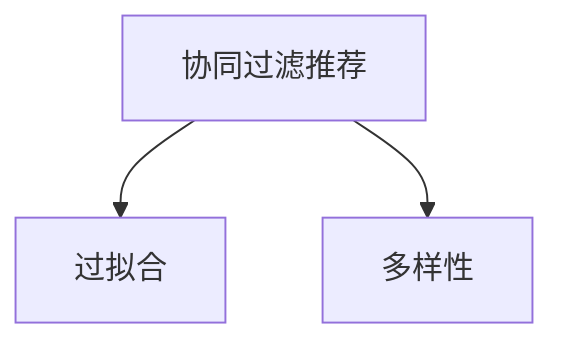

                 

# 推荐系统局限：过拟合与多样性

## 1. 背景介绍

### 1.1 推荐系统概述

推荐系统是现代互联网应用中不可或缺的一部分，通过个性化推荐满足用户需求，提升用户体验和平台价值。从推荐方式上来看，推荐系统可分为基于内容的推荐和协同过滤推荐两大类。前者通过分析用户的历史行为、偏好、评分等信息，生成与用户历史偏好相似的新物品推荐；后者则通过分析用户间的协同行为，如用户间的评分、兴趣相似性等，生成推荐结果。

协同过滤推荐系统分为两种：基于用户的协同过滤和基于物品的协同过滤。前者通过找到与目标用户兴趣相似的用户群体，生成推荐；后者则通过找到与目标物品相似的其他物品，推荐给喜欢该物品的用户。协同过滤推荐方法在实际应用中得到了广泛应用，如Amazon、淘宝等电商平台的商品推荐，Netflix等视频网站的节目推荐等。

### 1.2 推荐系统局限

尽管协同过滤推荐系统在推荐效果上取得了显著成果，但其在实际应用中也存在诸多局限：

- **过拟合问题**：推荐系统在模型训练过程中容易过拟合训练数据，导致推荐结果不能泛化到测试集上，造成用户体验下降。

- **多样性问题**：协同过滤推荐系统往往倾向于推荐热门物品，忽视了长尾物品，导致推荐结果多样性不足，影响用户体验。

本文章将围绕这两个核心问题，分别进行详细的探讨和解决方案的介绍。

## 2. 核心概念与联系

### 2.1 核心概念概述

为更好地理解推荐系统的过拟合与多样性问题，本节将介绍几个关键概念：

- **协同过滤推荐**：根据用户行为数据，找到与目标用户兴趣相似的用户群体，或与目标物品相似的其他物品，生成推荐结果。

- **过拟合**：模型在训练数据上表现良好，但在未见过的数据上表现差的现象。推荐系统往往在训练数据上，能够精准捕捉用户兴趣，但在未见过的数据上，推荐结果与实际用户兴趣差距较大。

- **多样性**：推荐结果覆盖物品的范围，能够覆盖长尾物品，满足不同用户的个性化需求。

这些核心概念之间的逻辑关系可以通过以下Mermaid流程图来展示：



这个流程图展示协同过滤推荐系统的核心概念及其之间的关系：

1. 协同过滤推荐系统通过用户行为数据进行推荐。
2. 推荐系统在训练数据上容易过拟合，导致推荐结果泛化性差。
3. 推荐系统需要保证推荐结果的多样性，避免倾向于热门物品。

## 3. 核心算法原理 & 具体操作步骤
### 3.1 算法原理概述

协同过滤推荐系统的核心思想是：通过分析用户与物品的交互行为，发现用户间的兴趣相似性和物品间的关联关系，进而生成个性化推荐结果。

假设用户集为 $U$，物品集为 $I$，用户 $u$ 对物品 $i$ 的评分向量为 $R_{u,i}$。协同过滤推荐系统的目标是最大化目标用户 $u$ 的期望收益：

$$
\max_{\theta} \sum_{u \in U} \sum_{i \in I} \alpha_{u,i} R_{u,i} f_i
$$

其中 $\alpha_{u,i}$ 为物品 $i$ 的权重，$f_i$ 为物品 $i$ 的特征向量，$\theta$ 为模型参数。

为缓解推荐系统中的过拟合和多样性问题，协同过滤推荐系统引入了正则化技术，通过限制模型复杂度来提升泛化能力，并采用不同的特征工程方法，增加推荐结果的多样性。

### 3.2 算法步骤详解

协同过滤推荐系统的具体步骤包括：

**Step 1: 数据预处理**
- 收集用户行为数据，包括用户对物品的评分、浏览行为、购买记录等。
- 进行数据清洗，去除异常值、缺失值，进行标准化处理。

**Step 2: 模型训练**
- 选择合适的协同过滤推荐算法，如矩阵分解、邻域协同过滤、基于用户的协同过滤、基于物品的协同过滤等。
- 设置模型参数，如正则化系数、学习率、迭代轮数等。
- 使用训练集对模型进行训练，得到推荐模型参数 $\theta$。

**Step 3: 特征工程**
- 对物品特征进行工程化处理，如提取文本特征、构建物品画像等。
- 根据推荐目标，选择合适的特征进行提取和融合，如用户兴趣向量、物品关联特征等。

**Step 4: 推荐结果生成**
- 根据用户行为数据和训练好的推荐模型，生成个性化推荐结果。
- 对推荐结果进行筛选、排序、去重等处理，确保推荐结果的多样性和质量。

**Step 5: 评估与迭代优化**
- 使用测试集对推荐结果进行评估，如召回率、准确率、多样性等。
- 根据评估结果，对模型参数进行微调，提升推荐效果。

### 3.3 算法优缺点

协同过滤推荐系统具有以下优点：
1. 推荐效果较好，能够个性化满足用户需求，提升用户满意度。
2. 模型结构简单，易于部署和维护。
3. 不需要额外的人工干预，能够自适应用户行为变化。

同时，该方法也存在一定的局限性：
1. 数据稀疏性问题：用户行为数据通常稀疏，难以充分挖掘用户兴趣。
2. 冷启动问题：新用户或新物品的评分数据难以获取，无法进行推荐。
3. 过拟合和多样性问题：训练数据有限，推荐系统容易过拟合，推荐结果多样性不足。
4. 可解释性不足：协同过滤推荐系统是一个"黑盒"模型，难以解释推荐过程。

尽管存在这些局限性，协同过滤推荐系统仍然是推荐领域最为成熟和有效的技术之一。未来相关研究的重点在于如何进一步提升模型的泛化能力，增加推荐结果的多样性，并增强模型的可解释性。

### 3.4 算法应用领域

协同过滤推荐系统在诸多领域中得到了广泛的应用，例如：

- 电商平台：如Amazon、淘宝等，通过协同过滤推荐系统推荐商品，提升用户购买转化率。
- 视频平台：如Netflix、爱奇艺等，通过推荐系统推荐视频内容，提升用户观看体验。
- 社交网络：如Facebook、微博等，通过推荐系统推荐好友、内容，提升用户活跃度和粘性。
- 智能家居：如智能音箱、智能电视等，通过推荐系统推荐应用、内容，提升用户体验。

## 4. 数学模型和公式 & 详细讲解 & 举例说明

### 4.1 数学模型构建

本节将使用数学语言对协同过滤推荐系统进行严格刻画。

记用户集为 $U=\{1,2,\dots,K\}$，物品集为 $I=\{1,2,\dots,M\}$，用户 $u$ 对物品 $i$ 的评分向量为 $R_{u,i} \in \mathbb{R}^d$，其中 $d$ 为特征维度。协同过滤推荐系统的目标函数为：

$$
\max_{\theta} \sum_{u \in U} \sum_{i \in I} \alpha_{u,i} R_{u,i} f_i
$$

其中 $\alpha_{u,i} \in [0,1]$ 为物品 $i$ 的权重，$f_i \in \mathbb{R}^d$ 为物品 $i$ 的特征向量，$\theta$ 为模型参数。

### 4.2 公式推导过程

以矩阵分解方法为例，推导推荐模型的损失函数：

假设用户 $u$ 对物品 $i$ 的评分向量为 $R_{u,i} \in \mathbb{R}^d$，用户 $u$ 的兴趣向量为 $p_u \in \mathbb{R}^d$，物品 $i$ 的特征向量为 $q_i \in \mathbb{R}^d$。推荐模型基于用户兴趣和物品特征进行预测，生成用户对物品的评分预测值 $\hat{R}_{u,i}$：

$$
\hat{R}_{u,i} = p_u^T W q_i
$$

其中 $W$ 为模型参数矩阵，$W_{ij} \in \mathbb{R}^d$ 表示用户 $u$ 对物品 $i$ 的兴趣与物品 $i$ 的特征的权重。

根据均方误差损失，推荐模型的损失函数为：

$$
L(R, \hat{R}) = \frac{1}{2} \sum_{u \in U} \sum_{i \in I} (R_{u,i} - \hat{R}_{u,i})^2
$$

其中 $L$ 为损失函数，$R_{u,i}$ 为真实评分，$\hat{R}_{u,i}$ 为预测评分。

通过最小化损失函数 $L$，可以求解推荐模型参数 $W$，从而生成推荐结果。

### 4.3 案例分析与讲解

以下以Amazon商品推荐系统为例，介绍协同过滤推荐系统的具体实现步骤。

**数据收集**
- 从Amazon平台收集用户对商品的历史评分数据，如评分、浏览记录、购买记录等。
- 对数据进行清洗和预处理，去除异常值和缺失值，进行标准化处理。

**模型训练**
- 使用矩阵分解方法，将用户兴趣和物品特征映射到低维空间，生成用户-物品评分预测矩阵。
- 通过最小化损失函数，求解模型参数 $W$，得到推荐模型。

**特征工程**
- 对物品特征进行工程化处理，如提取商品描述、品牌、类别等文本特征。
- 根据推荐目标，选择合适的特征进行提取和融合，如用户兴趣向量、商品关联特征等。

**推荐结果生成**
- 根据用户行为数据和训练好的推荐模型，生成个性化推荐结果。
- 对推荐结果进行筛选、排序、去重等处理，确保推荐结果的多样性和质量。

**评估与迭代优化**
- 使用测试集对推荐结果进行评估，如召回率、准确率、多样性等。
- 根据评估结果，对模型参数进行微调，提升推荐效果。

## 5. 项目实践：代码实例和详细解释说明
### 5.1 开发环境搭建

在进行协同过滤推荐系统开发前，我们需要准备好开发环境。以下是使用Python进行Scikit-learn开发的实验环境配置流程：

1. 安装Anaconda：从官网下载并安装Anaconda，用于创建独立的Python环境。

2. 创建并激活虚拟环境：
```bash
conda create -n recsys python=3.8 
conda activate recsys
```

3. 安装Scikit-learn：
```bash
conda install scikit-learn
```

4. 安装numpy、pandas、scipy、joblib等常用工具包：
```bash
pip install numpy pandas scipy joblib
```

完成上述步骤后，即可在`recsys`环境中开始协同过滤推荐系统的开发。

### 5.2 源代码详细实现

这里以协同过滤推荐系统中最常见的矩阵分解方法为例，展示基于Scikit-learn库的代码实现。

```python
from sklearn.decomposition import TruncatedSVD
from sklearn.metrics import mean_squared_error

# 数据预处理
data = load_user_item_data()  # 假设有一个函数用于加载用户行为数据
user_ids, item_ids, user_item_ratings = data[:,0], data[:,1], data[:,2]
train_ratings = user_item_ratings[:5000]
test_ratings = user_item_ratings[5000:]

# 特征工程
X_train, X_test = train_ratings[:,1], test_ratings[:,1]
y_train, y_test = train_ratings[:,2], test_ratings[:,2]

# 模型训练
svd = TruncatedSVD(n_components=50, random_state=0)
X_train_reduced = svd.fit_transform(X_train)
X_test_reduced = svd.transform(X_test)
train_preds = svd.transform(train_ratings[:,1])
test_preds = svd.transform(test_ratings[:,1])

# 推荐结果生成
train_preds = svd.transform(train_ratings[:,1])
test_preds = svd.transform(test_ratings[:,1])

# 评估与迭代优化
mse = mean_squared_error(test_preds, y_test)
print(f"MSE: {mse:.3f}")
```

### 5.3 代码解读与分析

让我们再详细解读一下关键代码的实现细节：

**数据预处理**
- `load_user_item_data()`：假设有一个函数用于加载用户行为数据，返回一个包含用户ID、物品ID、评分信息的二维数组。

**特征工程**
- `X_train` 和 `X_test`：将用户行为数据按照物品ID进行划分，构建用户行为特征矩阵。
- `y_train` 和 `y_test`：将用户行为数据按照评分进行划分，构建评分目标矩阵。

**模型训练**
- `TruncatedSVD`：使用TruncatedSVD对用户行为特征矩阵进行矩阵分解，生成用户兴趣和物品特征的低维表示。
- `fit_transform()` 和 `transform()`：对训练集和测试集进行降维处理，生成低维用户行为特征矩阵。

**推荐结果生成**
- `train_preds` 和 `test_preds`：通过用户行为特征矩阵进行矩阵乘法，生成用户对物品的评分预测。

**评估与迭代优化**
- `mean_squared_error()`：计算预测评分和实际评分之间的均方误差，评估推荐效果。

## 6. 实际应用场景
### 6.1 电商平台

协同过滤推荐系统在电商平台的商品推荐中得到了广泛应用。通过收集用户的历史浏览、购买、评分数据，对商品进行降维和特征工程，生成个性化推荐结果。推荐系统能够提高用户购买转化率和平台销售额，提升用户体验。

**数据收集**
- 从电商平台后台收集用户行为数据，包括用户ID、物品ID、评分等。
- 对数据进行清洗和预处理，去除异常值和缺失值，进行标准化处理。

**模型训练**
- 使用矩阵分解方法，将用户兴趣和物品特征映射到低维空间，生成用户-物品评分预测矩阵。
- 通过最小化损失函数，求解模型参数 $W$，得到推荐模型。

**特征工程**
- 对物品特征进行工程化处理，如提取商品描述、品牌、类别等文本特征。
- 根据推荐目标，选择合适的特征进行提取和融合，如用户兴趣向量、商品关联特征等。

**推荐结果生成**
- 根据用户行为数据和训练好的推荐模型，生成个性化推荐结果。
- 对推荐结果进行筛选、排序、去重等处理，确保推荐结果的多样性和质量。

**评估与迭代优化**
- 使用测试集对推荐结果进行评估，如召回率、准确率、多样性等。
- 根据评估结果，对模型参数进行微调，提升推荐效果。

**落地部署**
- 将推荐系统集成到电商平台的推荐引擎中，实时生成个性化推荐结果。
- 使用异步分布式系统，提升推荐系统处理能力和用户体验。

## 7. 工具和资源推荐
### 7.1 学习资源推荐

为了帮助开发者系统掌握协同过滤推荐系统的理论基础和实践技巧，这里推荐一些优质的学习资源：

1. 《推荐系统》系列博文：由知名推荐系统专家撰写，详细介绍了推荐系统的基本概念、方法和实践技巧。

2. 《协同过滤推荐系统》课程：斯坦福大学开设的推荐系统经典课程，有Lecture视频和配套作业，带你入门推荐系统领域的基本概念和经典模型。

3. 《推荐系统：基础与算法》书籍：详细介绍了推荐系统的基本概念、方法和最新研究成果，适合进阶学习。

4. KDD推荐系统评测库：KDD Cup竞赛中推荐系统评测库，包含丰富的推荐系统数据集和评测指标，帮助你理解推荐系统的评估方法。

5. 《推荐系统实战》书籍：推荐系统领域的实战指南，包含多个推荐系统项目案例，适合实践和工程开发。

通过对这些资源的学习实践，相信你一定能够快速掌握协同过滤推荐系统的精髓，并用于解决实际的推荐问题。

### 7.2 开发工具推荐

高效的开发离不开优秀的工具支持。以下是几款用于协同过滤推荐系统开发的常用工具：

1. Scikit-learn：基于Python的机器学习库，包含丰富的推荐系统算法实现。

2. TensorFlow和PyTorch：深度学习框架，适合复杂的推荐系统模型训练和推理。

3. Spark：分布式计算框架，适合大规模推荐系统的训练和推荐。

4. Elasticsearch：全文搜索引擎，适合推荐系统中的文本特征处理和推荐结果检索。

5. Hadoop和Spark SQL：分布式数据处理框架，适合处理海量用户行为数据。

6. Jupyter Notebook：交互式开发环境，适合快速迭代实验和原型开发。

合理利用这些工具，可以显著提升协同过滤推荐系统的开发效率，加快创新迭代的步伐。

### 7.3 相关论文推荐

协同过滤推荐系统的发展源于学界的持续研究。以下是几篇奠基性的相关论文，推荐阅读：

1. Personalized Web Search: A Recommendation Ranking Approach（Istvan Karger等）：提出基于用户兴趣的推荐方法，用于个性化网页推荐。

2. Collaborative Filtering for Implicit Feedback Datasets（Tobias Schuster等）：提出基于矩阵分解的协同过滤推荐方法，用于处理用户隐式反馈数据。

3. Matrix Factorization Techniques for Recommender Systems（Martin J. Hoffman等）：综述了矩阵分解方法在推荐系统中的应用，介绍了多项经典算法。

4. Factorization Machines: A novel framework for recommender systems（Ovi Attari等）：提出因子机方法，用于处理高阶交互特征，提升推荐效果。

5. Scaling Up Matrix Factorization Techniques for Predictive Ranking in Large Scale Recommender Systems（Aric Andreic等）：提出多种高效的推荐算法，用于处理大规模推荐系统。

这些论文代表协同过滤推荐系统的发展脉络。通过学习这些前沿成果，可以帮助研究者把握学科前进方向，激发更多的创新灵感。

## 8. 总结：未来发展趋势与挑战

### 8.1 总结

本文对协同过滤推荐系统中的过拟合与多样性问题进行了全面系统的介绍。首先阐述了协同过滤推荐系统的基本概念、推荐原理和核心思想，明确了协同过滤推荐系统在推荐效果上的优势和局限性。其次，从原理到实践，详细讲解了协同过滤推荐系统的数学模型和关键步骤，给出了推荐系统开发的完整代码实例。同时，本文还广泛探讨了协同过滤推荐系统在电商平台、视频平台、社交网络等多个行业领域的应用前景，展示了协同过滤推荐系统的巨大潜力。此外，本文精选了协同过滤推荐系统的各类学习资源，力求为读者提供全方位的技术指引。

通过本文的系统梳理，可以看到，协同过滤推荐系统是推荐领域最为成熟和有效的技术之一。尽管存在一些局限性，但协同过滤推荐系统仍然是推荐系统的主要范式，能够有效提升用户体验和平台价值。未来协同过滤推荐系统需要在泛化能力、多样性、可解释性等方面进行深入研究，才能更好地满足用户需求。

### 8.2 未来发展趋势

展望未来，协同过滤推荐系统将呈现以下几个发展趋势：

1. 矩阵分解方法的改进：矩阵分解方法将得到进一步改进，如基于深度学习的推荐方法、非负矩阵分解、多级因子机等，能够更好地处理高阶交互特征，提升推荐效果。

2. 引入多模态数据：协同过滤推荐系统将更多地融合多模态数据，如文本、图像、音频等，提升推荐系统的全面性和个性化水平。

3. 迁移学习和跨领域推荐：协同过滤推荐系统将通过迁移学习技术，对不同领域推荐模型进行迁移和融合，提升推荐系统的泛化能力。

4. 基于深度学习的推荐方法：深度学习技术将与协同过滤推荐系统相结合，提升推荐系统的精度和可解释性。

5. 结合强化学习技术：推荐系统将通过强化学习技术，优化推荐策略和推荐结果，提升推荐系统的互动性和用户粘性。

6. 可解释性增强：协同过滤推荐系统将通过可解释性方法，增强推荐结果的可解释性和用户信任度。

以上趋势凸显了协同过滤推荐系统的广阔前景。这些方向的探索发展，必将进一步提升推荐系统的性能和应用范围，为推荐技术的发展带来新的突破。

### 8.3 面临的挑战

尽管协同过滤推荐系统已经取得了显著成果，但在迈向更加智能化、普适化应用的过程中，它仍面临诸多挑战：

1. 数据稀疏性问题：推荐系统在处理高阶交互特征时，往往需要大量数据，数据稀疏性成为制约因素。如何高效利用数据，提升推荐系统效果，将是一大难题。

2. 冷启动问题：新用户或新物品的评分数据难以获取，无法进行推荐。如何解决冷启动问题，增强推荐系统的鲁棒性，仍然是一大挑战。

3. 过拟合和多样性问题：训练数据有限，推荐系统容易过拟合，推荐结果多样性不足。如何缓解过拟合问题，增加推荐结果的多样性，还需要更多理论和实践的积累。

4. 可解释性不足：协同过滤推荐系统是一个"黑盒"模型，难以解释推荐过程。如何赋予推荐系统更强的可解释性，将增强用户信任度和推荐系统的可信度。

5. 安全性问题：协同过滤推荐系统可能受到恶意攻击，如虚假评分、数据泄露等。如何保障推荐系统的安全性，将是重要的研究方向。

6. 鲁棒性和公平性问题：推荐系统往往存在偏差，如性别、年龄、地域等，导致推荐结果不公平。如何提升推荐系统的鲁棒性和公平性，还需要更多研究和实践。

以上挑战凸显了协同过滤推荐系统的发展方向和研究重点。只有在数据、算法、工程、伦理等多个维度进行全面优化，才能真正实现推荐系统的智能化、普适化和可解释性。

### 8.4 研究展望

面对协同过滤推荐系统面临的挑战，未来的研究需要在以下几个方面寻求新的突破：

1. 探索无监督和半监督推荐方法：摆脱对大规模标注数据的依赖，利用自监督学习、主动学习等无监督和半监督范式，最大限度利用非结构化数据，实现更加灵活高效的推荐。

2. 研究参数高效和计算高效的推荐范式：开发更加参数高效的推荐方法，在固定大部分预训练参数的同时，只更新极少量的任务相关参数。同时优化推荐模型的计算图，减少前向传播和反向传播的资源消耗，实现更加轻量级、实时性的部署。

3. 引入因果推断和对比学习：通过引入因果推断和对比学习思想，增强推荐模型建立稳定因果关系的能力，学习更加普适、鲁棒的语言表征，从而提升模型泛化性和抗干扰能力。

4. 结合知识表示和规则库：将符号化的先验知识，如知识图谱、逻辑规则等，与推荐模型进行融合，引导推荐过程学习更准确、合理的用户兴趣和物品特征。同时加强不同模态数据的整合，实现视觉、语音等多模态信息与文本信息的协同建模。

5. 纳入伦理道德约束：在推荐系统训练目标中引入伦理导向的评估指标，过滤和惩罚有偏见、有害的输出倾向。同时加强人工干预和审核，建立推荐系统的监管机制，确保推荐结果的合法性和公正性。

这些研究方向的探索，必将引领协同过滤推荐系统走向更高的台阶，为构建智能推荐系统铺平道路。面向未来，协同过滤推荐系统还需要与其他人工智能技术进行更深入的融合，如知识表示、因果推理、强化学习等，多路径协同发力，共同推动推荐系统的发展。只有勇于创新、敢于突破，才能不断拓展推荐系统的边界，让推荐技术更好地造福人类社会。

## 9. 附录：常见问题与解答

**Q1：协同过滤推荐系统如何处理数据稀疏性问题？**

A: 协同过滤推荐系统通常采用矩阵分解方法，将用户兴趣和物品特征映射到低维空间，生成用户-物品评分预测矩阵。为处理数据稀疏性问题，可以采用如下方法：

- 低秩分解：通过低秩分解，将稀疏矩阵分解为稠密矩阵，减少数据稀疏性。
- 矩阵补全：采用矩阵补全技术，如SVD、BiasFactorization等，填充缺失值，增加推荐系统的完备性。
- 多级因子机：使用多级因子机方法，处理高阶交互特征，提升推荐效果。

**Q2：协同过滤推荐系统如何解决冷启动问题？**

A: 协同过滤推荐系统在处理新用户或新物品的推荐时，数据往往难以获取。为解决冷启动问题，可以采用如下方法：

- 用户协同过滤：通过用户间的协同行为，生成新用户的兴趣向量，推荐热门物品。
- 物品协同过滤：通过物品间的协同行为，生成新物品的特征向量，推荐相关用户。
- 基于内容的推荐：根据用户的历史行为和偏好，推荐相似物品。

**Q3：协同过滤推荐系统如何进行推荐结果的多样性控制？**

A: 协同过滤推荐系统通常倾向于推荐热门物品，忽视了长尾物品。为控制推荐结果的多样性，可以采用如下方法：

- 多样性约束：在推荐模型中引入多样性约束，如Top-k推荐、去重等，限制推荐结果的数量。
- 推荐样本多样性：使用多样性采样技术，随机抽取不同特征的物品进行推荐。
- 推荐策略优化：设计多样性优先的推荐策略，如引入负样、多级排名等，提升推荐结果的多样性。

**Q4：协同过滤推荐系统如何进行推荐结果的质量评估？**

A: 协同过滤推荐系统的质量评估指标包括召回率、准确率、均方误差、F1值等。具体评估方法如下：

- 召回率：推荐系统中正确推荐的物品数量占总物品数量的比例。计算公式为：$Recall = \frac{TP}{TP+FN}$。
- 准确率：推荐系统中正确推荐的物品数量占推荐物品数量的比例。计算公式为：$Precision = \frac{TP}{TP+FP}$。
- 均方误差：推荐系统中预测评分与实际评分之间的误差，计算公式为：$MSE = \frac{1}{N} \sum_{i=1}^N (y_i - \hat{y_i})^2$。
- F1值：召回率和准确率的调和平均数，计算公式为：$F1 = 2 \times \frac{Precision \times Recall}{Precision + Recall}$。

通过对这些指标的评估，可以全面了解推荐系统的推荐效果。

**Q5：协同过滤推荐系统如何进行迭代优化？**

A: 协同过滤推荐系统需要进行迭代优化，以不断提升推荐效果。迭代优化的过程如下：

- 评估阶段：使用测试集对推荐结果进行评估，如召回率、准确率、多样性等。
- 模型微调：根据评估结果，对模型参数进行微调，提升推荐效果。
- 反馈机制：将用户对推荐结果的反馈信息，如点击率、评分等，反馈给推荐模型，进一步优化推荐策略。

通过以上迭代优化过程，协同过滤推荐系统能够不断适应用户需求，提升推荐效果。

---

作者：禅与计算机程序设计艺术 / Zen and the Art of Computer Programming

