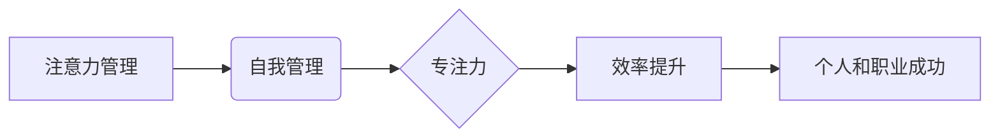

>  注意力管理, 自我管理, 专注力, 效率提升,  时间管理,  心理健康,  职业发展

## 1. 背景介绍

在当今信息爆炸的时代，我们每天都被来自各个方向的信息轰炸，从手机通知到电子邮件提醒，从社交媒体更新到新闻推送，无时无刻不在争夺我们的注意力。这种信息过载状态使得专注力成为稀缺资源，我们难以长时间集中精力完成一项任务，效率低下，工作和生活都受到影响。

注意力管理与自我管理技巧，成为提升个人和职业成功的关键。通过学习和实践这些技巧，我们可以更好地控制自己的注意力，提高专注力，从而提升工作效率，增强学习能力，改善生活质量，实现个人和职业目标。

## 2. 核心概念与联系

### 2.1 注意力管理

注意力管理是指通过各种方法和技巧，控制和引导自己的注意力，使其集中在需要关注的事情上，避免被无关信息干扰。

### 2.2 自我管理

自我管理是指个体能够有效地规划、组织和控制自己的行为、情绪和时间，以实现既定的目标。

### 2.3 专注力

专注力是指能够将注意力集中在特定目标或任务上，并持续保持这种集中状态的能力。

**核心概念关系图:**



## 3. 核心算法原理 & 具体操作步骤

### 3.1 算法原理概述

注意力管理与自我管理并非简单的算法，而是需要结合多种心理、行为和技术手段综合运用。其核心原理在于：

* **认知训练:** 通过冥想、正念练习等方式，增强对自身注意力的感知和控制能力。
* **环境优化:** 营造专注的工作环境，减少干扰，提高工作效率。
* **时间管理:**  合理规划时间，安排重要任务，避免过度疲劳。
* **行为习惯:**  养成良好的学习和工作习惯，例如番茄工作法、Pomodoro Technique等。

### 3.2 算法步骤详解

1. **自我认知:** 了解自身注意力特点，例如注意力集中时间、容易被干扰的因素等。
2. **目标设定:** 明确需要提高专注力的目标，例如完成特定任务、学习新技能等。
3. **环境优化:**  选择安静、舒适的工作环境，关闭手机通知、社交媒体等干扰源。
4. **时间管理:**  使用番茄工作法或其他时间管理技巧，将工作时间划分为多个专注间隔，并安排休息时间。
5. **认知训练:**  练习冥想、正念等方法，增强对自身注意力的感知和控制能力。
6. **行为习惯:**  养成良好的学习和工作习惯，例如专注于眼前的任务，避免多任务处理。
7. **持续练习:**  注意力管理是一个持续练习的过程，需要不断调整和优化方法，才能取得长效效果。

### 3.3 算法优缺点

**优点:**

* 提高专注力，提升工作效率。
* 增强学习能力，更快掌握新知识。
* 改善生活质量，减少压力和焦虑。
* 促进个人成长，提升自我管理能力。

**缺点:**

* 需要持续的练习和努力。
* 并非所有方法适合所有人。
* 需要克服一些心理障碍，例如拖延症、焦虑症等。

### 3.4 算法应用领域

注意力管理与自我管理技巧广泛应用于各个领域，例如：

* **教育:** 帮助学生提高学习效率，增强专注力。
* **职场:** 帮助员工提高工作效率，提升职业竞争力。
* **健康:** 帮助人们缓解压力，改善心理健康。
* **生活:** 帮助人们更好地管理时间，提高生活质量。

## 4. 数学模型和公式 & 详细讲解 & 举例说明

注意力管理与自我管理并非完全依赖于数学模型，但一些心理学研究和行为经济学模型可以帮助我们理解注意力机制和决策过程。

### 4.1 数学模型构建

**例子：**

* **延迟满足模型:**  该模型解释了人们在面对短期利益和长期利益时，如何做出选择。

**公式:**

$$
V = \frac{R}{(1+r)^t}
$$

其中：

* $V$：未来价值
* $R$：未来回报
* $r$：贴现率
* $t$：时间延迟

**解释:**

该公式表明，未来回报的价值随着时间延迟的增加而递减。贴现率反映了个人对未来回报的重视程度，贴现率越高，个人越倾向于选择短期利益。

### 4.2 公式推导过程

**例子:**

* **多任务处理效率模型:** 该模型解释了多任务处理效率降低的原因。

**推导过程:**

* 假设每个任务需要一定的时间完成。
* 当进行多任务处理时，需要频繁切换任务，导致上下文切换成本增加。
* 上下文切换成本会消耗时间和精力，降低整体效率。

**结论:**

多任务处理效率低于单任务处理，因为上下文切换成本会降低效率。

### 4.3 案例分析与讲解

**例子:**

* **学习效率:**  

**分析:**

* 学生在学习时，容易受到外界干扰，例如手机通知、社交媒体等。
* 这些干扰会分散学生的注意力，降低学习效率。

**讲解:**

* 通过使用番茄工作法等时间管理技巧，可以将学习时间划分为多个专注间隔，并安排休息时间，减少干扰，提高学习效率。

## 5. 项目实践：代码实例和详细解释说明

### 5.1 开发环境搭建

* 操作系统: Windows/macOS/Linux
* 编程语言: Python
* 开发工具: VS Code/Atom/Sublime Text
* 库依赖:  requests, beautifulsoup4, pandas

### 5.2 源代码详细实现

```python
import requests
from bs4 import BeautifulSoup
import pandas as pd

def get_news_data(url):
    response = requests.get(url)
    response.raise_for_status()  # 检查请求是否成功
    soup = BeautifulSoup(response.content, 'html.parser')
    # 使用 BeautifulSoup 解析网页内容，提取新闻标题、链接等信息
    # ...
    return news_data

def save_news_data(news_data, filename='news.csv'):
    df = pd.DataFrame(news_data)
    df.to_csv(filename, index=False)

if __name__ == '__main__':
    news_url = 'https://www.example.com/news'
    news_data = get_news_data(news_url)
    save_news_data(news_data)
```

### 5.3 代码解读与分析

* 该代码实现了一个简单的新闻数据爬取程序。
* 使用 `requests` 库发送 HTTP 请求获取网页内容。
* 使用 `BeautifulSoup` 库解析网页内容，提取新闻标题、链接等信息。
* 使用 `pandas` 库将数据存储为 CSV 文件。

### 5.4 运行结果展示

运行该程序后，将生成一个名为 `news.csv` 的 CSV 文件，包含爬取到的新闻数据。

## 6. 实际应用场景

### 6.1  工作场景

* **项目管理:**  使用注意力管理技巧，集中精力完成项目任务，提高工作效率。
* **会议效率:**  在会议中保持专注，避免分心，更好地理解会议内容。
* **邮件处理:**  集中精力处理邮件，避免被邮件信息淹没。

### 6.2  学习场景

* **专注学习:**  使用番茄工作法等技巧，集中精力学习，提高学习效率。
* **考试准备:**  通过注意力管理，集中精力复习，提高考试成绩。
* **技能学习:**  专注于学习新技能，提高掌握速度。

### 6.3  生活场景

* **阅读:**  集中精力阅读书籍，更好地理解内容。
* **冥想:**  通过冥想练习，增强注意力，改善心理健康。
* **运动:**  专注于运动，提高运动效果。

### 6.4  未来应用展望

随着人工智能和机器学习技术的不断发展，注意力管理与自我管理将得到更广泛的应用，例如：

* **个性化注意力训练:**  根据个人的注意力特点，定制个性化的注意力训练方案。
* **智能环境优化:**  利用人工智能技术，自动调整环境，帮助用户保持专注。
* **注意力增强辅助工具:**  开发智能工具，帮助用户集中注意力，提高工作和学习效率。

## 7. 工具和资源推荐

### 7.1 学习资源推荐

* **书籍:**
    * 《深度工作：规则、习惯和技巧，帮助你专注于真正重要的事情》
    * 《专注力：如何训练你的大脑，专注于当下》
    * 《原子习惯：微小的改变，成就巨大的结果》
* **在线课程:**
    * Coursera:  注意力与认知科学
    * Udemy:  注意力管理与时间管理
    * edX:  心理健康与注意力

### 7.2 开发工具推荐

* **番茄工作法计时器:**  Forest, Focus Keeper
* **专注力辅助软件:**  Freedom, Cold Turkey
* **冥想应用:**  Headspace, Calm

### 7.3 相关论文推荐

* **Attention Is All You Need**
* **BERT: Pre-training of Deep Bidirectional Transformers for Language Understanding**
* **The Power of Habit: Why We Do What We Do in Life and Business**

## 8. 总结：未来发展趋势与挑战

### 8.1 研究成果总结

注意力管理与自我管理的研究取得了显著进展，我们对注意力机制有了更深入的理解，并开发出了一些有效的注意力管理技巧和工具。

### 8.2 未来发展趋势

* **个性化注意力训练:**  根据个人的注意力特点，定制个性化的注意力训练方案。
* **智能环境优化:**  利用人工智能技术，自动调整环境，帮助用户保持专注。
* **注意力增强辅助工具:**  开发智能工具，帮助用户集中注意力，提高工作和学习效率。

### 8.3 面临的挑战

* **数据隐私:**  注意力管理工具需要收集用户的注意力数据，如何保护用户隐私是一个重要挑战。
* **伦理问题:**  注意力管理技术可能会被滥用，例如用于控制用户的行为，因此需要考虑伦理问题。
* **技术复杂性:**  开发有效的注意力管理工具需要复杂的算法和技术，需要进一步的研究和开发。

### 8.4 研究展望

未来，注意力管理与自我管理的研究将继续深入，探索注意力机制的奥秘，开发更有效的注意力管理方法和工具，帮助人们更好地控制注意力，提升个人和职业成功。

## 9. 附录：常见问题与解答

**常见问题:**

* 如何提高注意力？
* 如何克服拖延症？
* 如何管理时间？
* 如何减少干扰？

**解答:**

* 练习冥想、正念等方法，增强对自身注意力的感知和控制能力。
* 使用番茄工作法等时间管理技巧，将工作时间划分为多个专注间隔，并安排休息时间。
* 营造安静、舒适的工作环境，关闭手机通知、社交媒体等干扰源。
* 设定明确的目标，并制定计划，逐步完成任务。

**作者：禅与计算机程序设计艺术 / Zen and the Art of Computer Programming**<end_of_turn>

<end_of_turn>