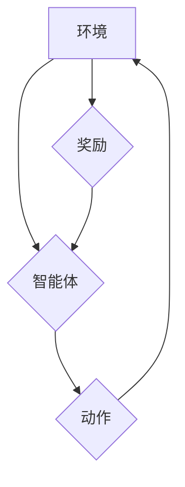

> 深度强化学习，Q-learning，奖励函数，目标函数，策略梯度，深度神经网络，强化学习算法

## 1. 背景介绍

强化学习 (Reinforcement Learning, RL) 作为机器学习的一个重要分支，近年来在各个领域取得了显著的成果，例如游戏、机器人控制、自动驾驶等。其核心思想是通过智能体与环境的交互，学习一个策略，使得智能体在环境中获得最大的累积奖励。

深度强化学习 (Deep Reinforcement Learning, DRL) 将深度神经网络引入强化学习算法，使得智能体能够学习更复杂、更抽象的策略。其中，Q-learning 作为一种经典的强化学习算法，在 DRL 中也得到了广泛应用。

然而，Q-learning 的性能很大程度上依赖于奖励函数的设计。奖励函数是定义智能体行为优劣的指标，它直接影响着智能体学习到的策略。设计一个合适的奖励函数是 DRL 算法成功的关键。

## 2. 核心概念与联系

**2.1 核心概念**

* **强化学习 (RL):**  一种机器学习方法，通过智能体与环境的交互，学习一个策略，使得智能体在环境中获得最大的累积奖励。
* **Q-learning:**  一种基于价值函数的强化学习算法，通过学习状态-动作对的价值函数，选择最优的动作。
* **奖励函数 (Reward Function):**  定义智能体行为优劣的指标，用于指导智能体学习。
* **策略 (Policy):**  智能体在不同状态下采取动作的规则。

**2.2 核心概念联系**

DRL 算法通过学习状态-动作对的价值函数，并根据价值函数选择最优的动作，最终学习出一个最优策略。奖励函数是价值函数的输入，它决定了智能体在不同状态下采取不同动作的价值。

**2.3 Mermaid 流程图**



## 3. 核心算法原理 & 具体操作步骤

**3.1 算法原理概述**

Q-learning 是一种基于价值函数的强化学习算法，其目标是学习一个状态-动作对的价值函数 Q(s, a)，该函数表示在状态 s 下采取动作 a 的期望累积奖励。

Q-learning 算法通过迭代更新 Q 函数，使得 Q 函数逐渐逼近最优价值函数。更新规则如下：

$$Q(s, a) \leftarrow Q(s, a) + \alpha [r + \gamma \max_{a'} Q(s', a') - Q(s, a)]$$

其中：

*  α 为学习率，控制着学习速度。
*  r 为当前状态下获得的奖励。
*  γ 为折扣因子，控制着未来奖励的权重。
*  s' 为采取动作 a 后进入的下一个状态。
*  a' 为在下一个状态 s' 中采取的动作。

**3.2 算法步骤详解**

1. 初始化 Q 函数，将其设置为任意值。
2. 在环境中进行交互，观察当前状态 s 和获得的奖励 r。
3. 选择一个动作 a，并执行该动作。
4. 观察下一个状态 s'。
5. 更新 Q 函数：

$$Q(s, a) \leftarrow Q(s, a) + \alpha [r + \gamma \max_{a'} Q(s', a') - Q(s, a)]$$

6. 重复步骤 2-5，直到 Q 函数收敛。

**3.3 算法优缺点**

**优点:**

* 能够学习最优策略。
* 不需要事先知道环境模型。
* 适用于离散状态和动作空间。

**缺点:**

* 学习过程可能很慢。
* 需要大量的样本数据进行训练。
* 难以处理连续状态和动作空间。

**3.4 算法应用领域**

Q-learning 算法在以下领域得到了广泛应用：

* 游戏 AI
* 机器人控制
* 自动驾驶
* 医疗诊断
* 金融投资

## 4. 数学模型和公式 & 详细讲解 & 举例说明

**4.1 数学模型构建**

强化学习问题可以建模为马尔可夫决策过程 (MDP)，其中包含以下元素：

* 状态空间 S：环境可能存在的全部状态。
* 动作空间 A：智能体在每个状态下可以采取的所有动作。
* 转移概率 P(s', r | s, a)：从状态 s 执行动作 a 后，进入状态 s' 并获得奖励 r 的概率。
* 奖励函数 R(s, a)：在状态 s 执行动作 a 后获得的奖励。
* 折扣因子 γ：控制着未来奖励的权重。

**4.2 公式推导过程**

Q-learning 算法的目标是学习一个状态-动作对的价值函数 Q(s, a)，该函数表示在状态 s 下采取动作 a 的期望累积奖励。

Q 函数的更新规则如下：

$$Q(s, a) \leftarrow Q(s, a) + \alpha [r + \gamma \max_{a'} Q(s', a') - Q(s, a)]$$

该公式表示 Q(s, a) 的更新等于其当前值加上学习率 α 乘以一个误差项。误差项由以下部分组成：

* r：当前状态下获得的奖励。
* γ max_{a'} Q(s', a')：下一个状态 s' 中所有动作 a' 的最大 Q 值，表示在下一个状态下获得的最大期望累积奖励。
* Q(s, a)：当前状态 s 下采取动作 a 的 Q 值。

**4.3 案例分析与讲解**

假设有一个简单的环境，智能体可以采取两种动作：向上和向下。环境的状态由智能体的当前位置决定。奖励函数如下：

* 当智能体到达目标位置时，获得奖励 10。
* 当智能体移动到其他位置时，获得奖励 0。

使用 Q-learning 算法，智能体可以学习到在不同位置采取向上或向下动作的最佳策略。

## 5. 项目实践：代码实例和详细解释说明

**5.1 开发环境搭建**

* Python 3.x
* TensorFlow 或 PyTorch

**5.2 源代码详细实现**

```python
import tensorflow as tf

# 定义 Q 函数
class QNetwork(tf.keras.Model):
    def __init__(self):
        super(QNetwork, self).__init__()
        self.dense1 = tf.keras.layers.Dense(64, activation='relu')
        self.dense2 = tf.keras.layers.Dense(64, activation='relu')
        self.output = tf.keras.layers.Dense(2)

    def call(self, state):
        x = self.dense1(state)
        x = self.dense2(x)
        return self.output(x)

# 定义 Q-learning 算法
def q_learning(env, q_network, learning_rate, discount_factor, episodes):
    for episode in range(episodes):
        state = env.reset()
        done = False
        while not done:
            # 选择动作
            action = tf.argmax(q_network(tf.expand_dims(state, axis=0))).numpy()[0]
            # 执行动作
            next_state, reward, done, _ = env.step(action)
            # 更新 Q 函数
            with tf.GradientTape() as tape:
                q_values = q_network(tf.expand_dims(state, axis=0))
                target_q_value = reward + discount_factor * tf.reduce_max(q_network(tf.expand_dims(next_state, axis=0)))
                loss = tf.keras.losses.mean_squared_error(target_q_value, q_values[0, action])
            gradients = tape.gradient(loss, q_network.trainable_variables)
            optimizer.apply_gradients(zip(gradients, q_network.trainable_variables))
            state = next_state

# ...

```

**5.3 代码解读与分析**

* QNetwork 类定义了 Q 函数的网络结构。
* q_learning 函数实现了 Q-learning 算法的核心逻辑。
* 选择动作时，使用 argmax 函数选择 Q 值最大的动作。
* 更新 Q 函数时，使用梯度下降算法最小化 Q 值与目标 Q 值之间的误差。

**5.4 运行结果展示**

运行代码后，智能体将在环境中学习并最终找到最优策略。

## 6. 实际应用场景

**6.1 游戏 AI**

Q-learning 算法被广泛应用于游戏 AI，例如 AlphaGo 和 Dota 2 的 OpenAI Five。

**6.2 机器人控制**

Q-learning 算法可以用于训练机器人控制策略，例如让机器人学会行走、抓取物体等。

**6.3 自动驾驶**

Q-learning 算法可以用于训练自动驾驶系统的决策策略，例如让汽车学会避开障碍物、变道等。

**6.4 医疗诊断**

Q-learning 算法可以用于辅助医生进行医疗诊断，例如根据患者的症状和病史预测疾病类型。

**6.5 金融投资**

Q-learning 算法可以用于开发金融投资策略，例如根据市场数据预测股票价格走势。

**6.6 未来应用展望**

随着深度学习技术的不断发展，Q-learning 算法在未来将有更广泛的应用场景，例如：

* 个性化教育
* 智能客服
* 药物研发

## 7. 工具和资源推荐

**7.1 学习资源推荐**

* **书籍:**
    * Reinforcement Learning: An Introduction by Richard S. Sutton and Andrew G. Barto
    * Deep Reinforcement Learning Hands-On by Maxim Lapan
* **在线课程:**
    * Deep Reinforcement Learning Specialization by DeepLearning.AI
    * Reinforcement Learning by David Silver (University of DeepMind)

**7.2 开发工具推荐**

* **TensorFlow:** https://www.tensorflow.org/
* **PyTorch:** https://pytorch.org/

**7.3 相关论文推荐**

* Deep Q-Network (DQN)
* Double Deep Q-Network (DDQN)
* Dueling Deep Q-Network (DDQN)

## 8. 总结：未来发展趋势与挑战

**8.1 研究成果总结**

近年来，深度强化学习取得了显著的成果，Q-learning 算法作为其重要组成部分，在各个领域得到了广泛应用。

**8.2 未来发展趋势**

* **更有效的奖励函数设计:** 奖励函数的设计是深度强化学习的关键，未来将会有更多研究致力于设计更有效的奖励函数。
* **处理连续状态和动作空间:** 现有的 Q-learning 算法主要适用于离散状态和动作空间，未来将会有更多研究致力于处理连续状态和动作空间。
* **增强样本效率:** 深度强化学习算法通常需要大量的样本数据进行训练，未来将会有更多研究致力于提高样本效率。
* **安全性和可解释性:** 深度强化学习算法的安全性与可解释性是未来研究的重要方向。

**8.3 面临的挑战**

* **奖励函数设计:** 设计一个合适的奖励函数仍然是深度强化学习面临的挑战。
* **样本效率:** 深度强化学习算法通常需要大量的样本数据进行训练，这在现实应用中可能难以实现。
* **安全性和可解释性:** 深度强化学习算法的安全性与可解释性需要进一步研究。

**8.4 研究展望**

未来，深度强化学习将继续朝着更有效、更安全、更可解释的方向发展，并在更多领域得到应用。


## 9. 附录：常见问题与解答

**9.1 Q: 如何设计一个合适的奖励函数？**

A: 设计一个合适的奖励函数是深度强化学习的关键，需要根据具体的应用场景和目标进行设计。一般来说，奖励函数应该能够鼓励智能体采取有利于目标的行动，并惩罚不利于目标的行动。

**9.2 Q: 如何提高深度强化学习算法的样本效率？**

A: 提高样本效率