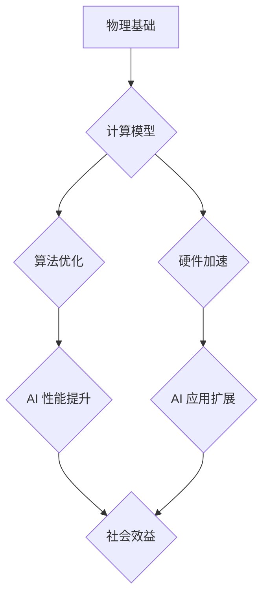

> 人工智能 (AI)
> 物理基础
> 计算模型
> 算法优化
> 硬件加速
> 深度学习
> 脑科学

## 1. 背景介绍

人工智能 (AI) 作为科技发展的重要方向，近年来取得了显著进展，在各个领域展现出强大的应用潜力。从语音识别、图像处理到自然语言理解，AI 正在改变着我们的生活方式。然而，随着 AI 模型规模的不断扩大，对计算资源和能源消耗的需求也日益增长。如何突破计算瓶颈，实现 AI 的高效发展，成为一个亟待解决的关键问题。

物理基础在 AI 创新中扮演着至关重要的角色。理解物理规律，探索计算模型的本质，可以为 AI 算法优化、硬件加速等方面提供新的思路和方向。本文将深入探讨物理基础在 AI 创新中的作用，并展望未来发展趋势。

## 2. 核心概念与联系

**2.1 计算模型与物理限制**

传统的计算模型基于电子的开关状态，其计算能力受到物理限制，例如电阻、电容、电感等因素。随着摩尔定律的放缓，传统芯片的性能提升面临瓶颈。

**2.2 量子计算与物理原理**

量子计算利用量子力学原理，例如叠加和纠缠，实现超越经典计算的强大计算能力。量子比特可以同时处于多个状态，从而大幅提高计算效率。

**2.3 神经网络与生物神经元**

深度学习算法的核心是神经网络，其结构和功能灵感来源于生物神经元。理解生物神经元的物理机制，例如离子通道、突触传递等，可以为神经网络的优化和改进提供借鉴。

**2.4 硬件加速与物理特性**

AI 算法的训练和推理需要大量的计算资源。利用物理特性，例如光学、磁性等，开发新型硬件加速器，可以大幅提升 AI 计算效率。

**Mermaid 流程图**



## 3. 核心算法原理 & 具体操作步骤

**3.1 算法原理概述**

深度学习算法的核心是多层神经网络，通过层层叠加的激活函数和权重更新，学习数据中的复杂模式。

**3.2 算法步骤详解**

1. **数据预处理:** 将原始数据转换为深度学习模型可以理解的格式。
2. **网络结构设计:** 根据任务需求设计神经网络的层数、节点数和激活函数等参数。
3. **参数初始化:** 为神经网络中的权重和偏置赋予初始值。
4. **前向传播:** 将输入数据通过神经网络层层传递，最终得到输出结果。
5. **损失函数计算:** 计算模型输出与真实值的差异，即损失值。
6. **反向传播:** 根据损失函数的梯度，调整神经网络的权重和偏置，使模型输出更接近真实值。
7. **迭代训练:** 重复前向传播、损失函数计算和反向传播步骤，直到模型达到预设的精度。

**3.3 算法优缺点**

**优点:**

* 能够学习复杂数据模式，实现高精度预测。
* 具有良好的泛化能力，可以应用于多种任务。

**缺点:**

* 训练过程耗时且资源消耗大。
* 对数据质量要求高，容易受到噪声和偏差的影响。

**3.4 算法应用领域**

* **图像识别:** 人脸识别、物体检测、图像分类等。
* **自然语言处理:** 语音识别、机器翻译、文本摘要等。
* **推荐系统:** 商品推荐、内容推荐等。
* **医疗诊断:** 病情预测、疾病诊断等。

## 4. 数学模型和公式 & 详细讲解 & 举例说明

**4.1 数学模型构建**

深度学习模型可以看作是一个复杂的数学函数，其输入是数据特征，输出是预测结果。

**4.2 公式推导过程**

深度学习算法的核心是利用梯度下降法优化模型参数。梯度下降法的核心公式如下：

$$
\theta = \theta - \alpha \nabla L(\theta)
$$

其中：

* $\theta$ 是模型参数
* $\alpha$ 是学习率
* $\nabla L(\theta)$ 是损失函数对参数的梯度

**4.3 案例分析与讲解**

假设我们有一个简单的线性回归模型，其目标是预测房价。模型的输入特征是房屋面积，输出是房价。

损失函数可以定义为均方误差：

$$
L(\theta) = \frac{1}{n} \sum_{i=1}^{n} (y_i - \hat{y}_i)^2
$$

其中：

* $y_i$ 是真实房价
* $\hat{y}_i$ 是模型预测的房价
* $n$ 是样本数量

梯度下降法可以用来更新模型参数，使损失函数最小化。

## 5. 项目实践：代码实例和详细解释说明

**5.1 开发环境搭建**

使用 Python 语言和 TensorFlow 或 PyTorch 深度学习框架。

**5.2 源代码详细实现**

```python
import tensorflow as tf

# 定义模型
model = tf.keras.models.Sequential([
    tf.keras.layers.Dense(64, activation='relu', input_shape=(1,)),
    tf.keras.layers.Dense(1)
])

# 编译模型
model.compile(optimizer='adam', loss='mse')

# 训练模型
model.fit(x_train, y_train, epochs=10)

# 评估模型
loss = model.evaluate(x_test, y_test)
```

**5.3 代码解读与分析**

代码首先定义了一个简单的线性回归模型，包含两层全连接神经网络。

模型使用 Adam 优化器和均方误差损失函数进行训练。

训练过程使用训练数据进行迭代，更新模型参数，直到达到预设的精度。

**5.4 运行结果展示**

训练完成后，可以评估模型在测试数据上的性能，例如预测房价的准确率。

## 6. 实际应用场景

**6.1 医疗诊断**

深度学习算法可以用于分析医学图像，辅助医生诊断疾病。例如，可以用于检测肺癌、乳腺癌等。

**6.2 自动驾驶**

深度学习算法可以用于训练自动驾驶汽车，识别道路场景、预测车辆运动轨迹等。

**6.3 金融风险管理**

深度学习算法可以用于分析金融数据，识别欺诈行为、预测市场风险等。

**6.4 未来应用展望**

随着物理基础研究的深入，AI 算法将更加高效、智能。未来，AI 将在更多领域发挥重要作用，例如：

* **个性化教育:** 根据学生的学习情况，提供个性化的学习方案。
* **精准医疗:** 根据患者的基因信息和病史，提供个性化的治疗方案。
* **智能制造:** 利用 AI 算法，提高生产效率和产品质量。

## 7. 工具和资源推荐

**7.1 学习资源推荐**

* **书籍:**
    * 深度学习
    * 人工智能：一种现代方法
* **在线课程:**
    * Coursera 深度学习课程
    * edX 人工智能课程

**7.2 开发工具推荐**

* **TensorFlow:** 开源深度学习框架
* **PyTorch:** 开源深度学习框架
* **Keras:** 高级深度学习API

**7.3 相关论文推荐**

* **ImageNet Classification with Deep Convolutional Neural Networks**
* **Attention Is All You Need**

## 8. 总结：未来发展趋势与挑战

**8.1 研究成果总结**

物理基础在 AI 创新中发挥着至关重要的作用。

理解物理规律，探索计算模型的本质，可以为 AI 算法优化、硬件加速等方面提供新的思路和方向。

**8.2 未来发展趋势**

* **量子计算:** 量子计算将为 AI 提供更强大的计算能力。
* **脑科学:** 脑科学研究将为 AI 提供新的启发，例如神经网络的结构和功能。
* **新型硬件:** 新型硬件，例如光学、磁性等，将为 AI 提供更高效的计算平台。

**8.3 面临的挑战**

* **计算资源:** AI 算法的训练和推理需要大量的计算资源。
* **数据质量:** AI 算法对数据质量要求高，容易受到噪声和偏差的影响。
* **伦理问题:** AI 的发展也带来了一些伦理问题，例如算法偏见、隐私保护等。

**8.4 研究展望**

未来，我们需要继续深入研究物理基础，探索新的 AI 计算模型和硬件平台，并解决 AI 发展过程中面临的挑战。


## 9. 附录：常见问题与解答

**9.1 如何选择合适的 AI 算法？**

选择合适的 AI 算法取决于具体的应用场景和数据特点。

例如，对于图像识别任务，可以使用卷积神经网络；对于自然语言处理任务，可以使用循环神经网络或 Transformer 网络。

**9.2 如何提高 AI 算法的性能？**

可以从以下几个方面提高 AI 算法的性能：

* **数据增强:** 增加训练数据的多样性，例如图像旋转、裁剪等。
* **模型优化:** 调整模型结构、参数和训练策略。
* **硬件加速:** 利用 GPU 或 TPU 等加速器提高计算效率。

**9.3 如何解决 AI 算法的偏见问题？**

可以从以下几个方面解决 AI 算法的偏见问题：

* **数据清洗:** 剔除偏见数据，确保训练数据均衡。
* **算法设计:** 设计公平的算法，避免算法本身产生偏见。
* **模型评估:** 对模型进行公平性评估，及时发现和解决偏见问题。


作者：禅与计算机程序设计艺术 / Zen and the Art of Computer Programming 
<end_of_turn>