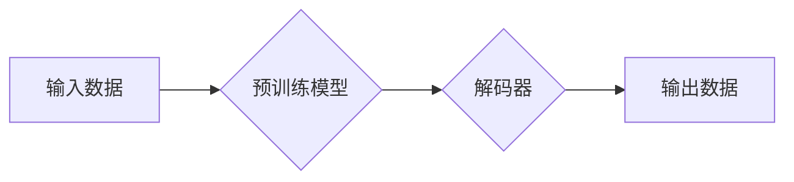

> 生成式AI, AIGC, 深度学习, 自然语言处理, 图像生成, 算法落地, 尖刀场景

## 1. 背景介绍

近年来，人工智能（AI）技术突飞猛进，特别是生成式人工智能（AIGC）的兴起，引发了广泛的关注和热议。从ChatGPT的爆火到DALL-E 2的惊艳表现，AIGC展现出强大的创造力和应用潜力，被誉为“第四次工业革命”的催化剂。

然而，AIGC技术也面临着诸多挑战和争议。一些人认为AIGC是“金矿”，蕴藏着巨大的商业价值和社会变革力量；而另一些人则认为AIGC是“泡沫”，过度炒作，缺乏实际应用场景。

本文将深入探讨AIGC的本质、原理、应用场景以及未来发展趋势，并结合自身经验，提出一些建设性的思考和建议。

## 2. 核心概念与联系

**2.1 生成式AI的概念**

生成式AI是指能够根据输入数据生成新数据的AI模型。这些模型通常基于深度学习算法，例如生成对抗网络（GAN）、变分自编码器（VAE）和Transformer等。

**2.2 AIGC的应用场景**

AIGC技术在各个领域都有着广泛的应用前景，包括：

* **内容创作:** 自动生成文章、诗歌、剧本、音乐等创意内容。
* **图像生成:** 根据文本描述生成逼真的图像，例如绘画、照片、3D模型等。
* **视频生成:** 自动生成视频内容，例如动画、特效、新闻报道等。
* **代码生成:** 根据自然语言描述生成代码，提高开发效率。
* **数据增强:** 生成新的训练数据，提高机器学习模型的性能。

**2.3 AIGC与其他AI技术的联系**

AIGC技术与其他AI技术密切相关，例如：

* **自然语言处理（NLP）:** AIGC模型需要理解和处理自然语言文本，因此NLP技术是其基础。
* **计算机视觉（CV）:** 图像生成AIGC模型需要利用计算机视觉技术进行图像处理和分析。
* **机器学习（ML）:** AIGC模型都是基于机器学习算法训练的，需要大量的训练数据和计算资源。

**2.4 AIGC的架构**



## 3. 核心算法原理 & 具体操作步骤

### 3.1  算法原理概述

生成式AI模型的核心算法原理是通过学习数据分布，并生成符合该分布的新数据。常见的生成式AI算法包括：

* **生成对抗网络（GAN）:** 由生成器和判别器两部分组成，生成器试图生成逼真的数据，判别器试图区分真实数据和生成数据，两者相互竞争，最终生成器能够生成逼真的数据。
* **变分自编码器（VAE）:** 将输入数据编码成低维表示，然后解码成输出数据，通过优化编码器和解码器的参数，学习数据分布。
* **Transformer:** 基于注意力机制的深度学习模型，能够处理序列数据，例如文本和音频，并生成新的序列数据。

### 3.2  算法步骤详解

以GAN为例，其训练步骤如下：

1. 初始化生成器和判别器模型。
2. 从真实数据集中随机抽取样本作为判别器的训练数据。
3. 生成器根据随机噪声生成伪造数据。
4. 判别器对真实数据和伪造数据进行分类，并计算损失函数。
5. 根据判别器的损失函数，更新判别器的参数。
6. 生成器根据判别器的反馈，更新生成器的参数。
7. 重复步骤2-6，直到生成器能够生成逼真的数据。

### 3.3  算法优缺点

**GAN:**

* **优点:** 可以生成高质量的图像和文本数据。
* **缺点:** 训练过程比较复杂，容易出现模式崩溃问题。

**VAE:**

* **优点:** 训练过程相对稳定，能够生成多样化的数据。
* **缺点:** 生成的数据质量可能不如GAN。

**Transformer:**

* **优点:** 能够处理长序列数据，生成流畅的文本。
* **缺点:** 计算量较大，需要大量的训练数据。

### 3.4  算法应用领域

* **图像生成:** 生成艺术作品、照片、3D模型等。
* **文本生成:** 生成文章、诗歌、剧本、对话等。
* **语音合成:** 生成逼真的语音。
* **音乐生成:** 生成新的音乐旋律和节奏。

## 4. 数学模型和公式 & 详细讲解 & 举例说明

### 4.1  数学模型构建

**4.1.1 GAN模型的数学模型**

GAN模型由两个神经网络组成：生成器G和判别器D。

* **生成器G:** 输入随机噪声z，输出生成数据x。

* **判别器D:** 输入数据x，输出判断x是真实数据还是生成数据。

**4.1.2 损失函数**

* **判别器损失函数:**

$$
L_D(D, x_r, x_g) = E_{x_r \sim p_{data}(x)}[log(D(x_r))] + E_{x_g \sim p_g(x)}[log(1 - D(x_g))]
$$

* **生成器损失函数:**

$$
L_G(G, D) = E_{z \sim p_z(z)}[log(D(G(z)))]
$$

其中：

* $x_r$ 是真实数据。
* $x_g$ 是生成数据。
* $p_{data}(x)$ 是真实数据分布。
* $p_g(x)$ 是生成数据分布。
* $p_z(z)$ 是噪声分布。

**4.1.3 训练过程**

1. 随机抽取真实数据作为判别器的训练数据。
2. 生成器根据随机噪声生成伪造数据。
3. 判别器对真实数据和伪造数据进行分类，并计算损失函数。
4. 根据判别器的损失函数，更新判别器的参数。
5. 生成器根据判别器的反馈，更新生成器的参数。
6. 重复步骤1-5，直到生成器能够生成逼真的数据。

### 4.2  公式推导过程

**4.2.1 判别器损失函数推导**

判别器损失函数的目的是让判别器能够准确区分真实数据和生成数据。

* 当判别器正确判断真实数据时，其输出为1，损失为0。
* 当判别器错误判断生成数据为真实数据时，其输出为0，损失为负无穷。

因此，判别器损失函数可以表示为真实数据对数概率加上生成数据对数概率的负值。

**4.2.2 生成器损失函数推导**

生成器损失函数的目的是让生成器能够生成能够欺骗判别器的伪造数据。

* 当判别器正确判断生成数据为生成数据时，其输出为0，损失为负无穷。
* 当判别器错误判断生成数据为真实数据时，其输出为1，损失为0。

因此，生成器损失函数可以表示为生成数据对数概率。

### 4.3  案例分析与讲解

**4.3.1 图像生成案例**

使用GAN模型可以生成逼真的图像，例如：

* **风格迁移:** 将一张照片转换为特定艺术风格的图像。
* **图像修复:** 修复损坏或模糊的图像。
* **图像合成:** 合并多张图像生成新的图像。

**4.3.2 文本生成案例**

使用Transformer模型可以生成流畅的文本，例如：

* **机器翻译:** 将文本从一种语言翻译成另一种语言。
* **文本摘要:** 生成文本的简短摘要。
* **对话系统:** 创建能够与人类进行自然对话的聊天机器人。

## 5. 项目实践：代码实例和详细解释说明

### 5.1  开发环境搭建

* **操作系统:** Ubuntu 20.04
* **编程语言:** Python 3.8
* **深度学习框架:** TensorFlow 2.0

### 5.2  源代码详细实现

```python
# 生成器模型
class Generator(tf.keras.Model):
    def __init__(self):
        super(Generator, self).__init__()
        # 定义生成器网络结构
        # ...

    def call(self, z):
        # 生成图像数据
        # ...

# 判别器模型
class Discriminator(tf.keras.Model):
    def __init__(self):
        super(Discriminator, self).__init__()
        # 定义判别器网络结构
        # ...

    def call(self, x):
        # 判断数据是否为真实数据
        # ...

# 训练模型
def train_gan(generator, discriminator, dataset, epochs):
    # ...

# 生成图像
def generate_image(generator, noise):
    # ...
```

### 5.3  代码解读与分析

* **生成器模型:** 负责生成新的数据，例如图像或文本。
* **判别器模型:** 负责判断数据是否为真实数据或生成数据。
* **训练模型:** 使用GAN的训练算法训练生成器和判别器模型。
* **生成图像:** 使用训练好的生成器模型生成新的图像数据。

### 5.4  运行结果展示

运行代码后，可以生成逼真的图像数据，例如：

* **人脸图像:** 可以生成逼真的人脸图像，包括不同年龄、种族和性别的人脸。
* **风景图像:** 可以生成逼真的风景图像，例如山川、河流、森林等。
* **物体图像:** 可以生成逼真的物体图像，例如汽车、飞机、动物等。

## 6. 实际应用场景

### 6.1  内容创作

* **自动生成新闻报道:** 根据新闻事件数据自动生成新闻报道。
* **创作小说和诗歌:** 根据特定主题和风格自动生成小说和诗歌。
* **生成游戏剧本:** 根据游戏设定自动生成游戏剧本。

### 6.2  图像生成

* **生成艺术作品:** 根据用户输入的文字描述生成艺术作品。
* **生成产品设计图:** 根据用户需求自动生成产品设计图。
* **生成虚拟人物形象:** 为游戏、动画等项目生成虚拟人物形象。

### 6.3  代码生成

* **自动生成代码模板:** 根据用户需求自动生成代码模板。
* **自动完成代码补全:** 根据上下文自动完成代码补全。
* **自动翻译代码:** 将代码从一种编程语言翻译成另一种编程语言。

### 6.4  未来应用展望

* **个性化教育:** 根据学生的学习情况自动生成个性化的学习内容。
* **医疗诊断:** 根据患者的症状和检查结果自动辅助诊断疾病。
* **科学研究:** 自动生成实验数据和分析结果，加速科学研究进程。

## 7. 工具和资源推荐

### 7.1  学习资源推荐

* **书籍:**
    * 《深度学习》
    * 《生成对抗网络》
* **在线课程:**
    * Coursera: 深度学习
    * Udacity: 生成对抗网络
* **博客:**
    * Distill.pub
    * Towards Data Science

### 7.2  开发工具推荐

* **深度学习框架:** TensorFlow, PyTorch
* **编程语言:** Python
* **数据可视化工具:** Matplotlib, Seaborn

### 7.3  相关论文推荐

* **Generative Adversarial Networks**
* **Variational Autoencoders for Generation**
* **Attention Is All You Need**

## 8. 总结：未来发展趋势与挑战

### 8.1  研究成果总结

AIGC技术取得了显著的进展，能够生成逼真的图像、文本、