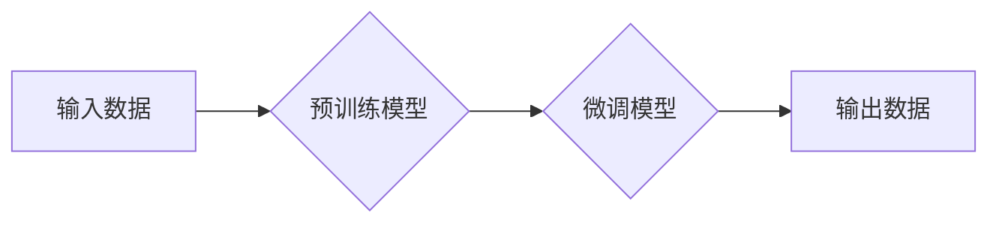

> 生成式AI, 
> 语言模型, 
> 图像生成, 
> 算法原理, 
> 应用场景, 
> 伦理问题, 
> 未来趋势

## 1. 背景介绍

第一部分的文章探讨了生成式AI的兴起和发展，以及其在各个领域的潜在应用。然而，在一片欢呼声中，也有一些声音开始发出警示，认为生成式AI可能存在一些不可忽视的风险和挑战。

本篇文章将深入探讨生成式AI的局限性，分析其并非万能药，并探讨其在未来发展过程中可能面临的挑战。

## 2. 核心概念与联系

生成式AI的核心概念是利用机器学习算法，从已有的数据中学习模式和规律，并生成新的数据。

**Mermaid 流程图:**



**核心概念解释:**

* **输入数据:**  生成式AI模型需要大量的训练数据，这些数据可以是文本、图像、音频等多种形式。
* **预训练模型:**  预训练模型是指在大量数据上进行训练，学习到通用语言或图像表示的模型。
* **微调模型:**  根据特定任务，对预训练模型进行进一步的训练，使其能够生成符合特定需求的数据。
* **输出数据:**  生成式AI模型最终输出的是新的数据，例如文本、图像、音频等。

## 3. 核心算法原理 & 具体操作步骤

### 3.1  算法原理概述

生成式AI的核心算法主要包括：

* **变分自编码器 (VAE):**  通过编码器将输入数据压缩成低维表示，然后通过解码器将低维表示恢复成原始数据。
* **生成对抗网络 (GAN):**  由生成器和判别器两部分组成，生成器试图生成逼真的数据，判别器试图区分真实数据和生成数据。两者相互竞争，最终生成器能够生成逼真的数据。
* **Transformer:**  一种基于注意力机制的深度学习模型，能够处理序列数据，例如文本和音频。

### 3.2  算法步骤详解

以生成文本为例，使用Transformer模型的具体操作步骤如下：

1. **数据预处理:** 将文本数据进行清洗、分词、词嵌入等预处理操作。
2. **模型训练:** 使用预训练的Transformer模型，在训练数据上进行微调，学习文本的语法和语义规律。
3. **文本生成:**  输入一个文本提示，模型根据训练的知识生成新的文本。

### 3.3  算法优缺点

**优点:**

* 可以生成高质量的文本、图像、音频等数据。
* 能够处理复杂的数据模式。
* 具有强大的泛化能力。

**缺点:**

* 需要大量的训练数据。
* 训练过程复杂，耗时耗力。
* 容易受到训练数据的影响，生成的数据可能存在偏差或错误。

### 3.4  算法应用领域

生成式AI在各个领域都有广泛的应用，例如：

* **自然语言处理:** 文本生成、机器翻译、对话系统等。
* **计算机视觉:** 图像生成、图像编辑、目标检测等。
* **音频处理:** 音频合成、语音识别、音乐创作等。

## 4. 数学模型和公式 & 详细讲解 & 举例说明

### 4.1  数学模型构建

生成式AI模型通常基于概率模型，例如贝叶斯网络或马尔可夫链。这些模型通过计算数据之间的概率关系，来生成新的数据。

### 4.2  公式推导过程

例如，在文本生成任务中，可以使用语言模型来预测下一个词的概率。语言模型通常使用softmax函数来计算每个词的概率分布：

$$
P(w_t | w_{1:t-1}) = \frac{exp(s_t)}{\sum_{w \in V} exp(s_w)}
$$

其中：

* $P(w_t | w_{1:t-1})$ 是给定前 $t-1$ 个词的情况下，预测第 $t$ 个词的概率。
* $w_t$ 是第 $t$ 个词。
* $w_{1:t-1}$ 是前 $t-1$ 个词。
* $V$ 是词典。
* $s_t$ 是第 $t$ 个词的得分。

### 4.3  案例分析与讲解

例如，假设我们有一个语言模型，它已经学习到以下概率分布：

* $P("hello" | "") = 0.2$
* $P("world" | "") = 0.3$
* $P("how" | "") = 0.5$

如果我们输入一个提示 "hello", 那么语言模型会预测下一个词的概率分布为：

* $P("world" | "hello") = 0.1$
* $P("how" | "hello") = 0.2$

## 5. 项目实践：代码实例和详细解释说明

### 5.1  开发环境搭建

使用Python语言开发生成式AI项目，需要安装以下软件包：

* TensorFlow 或 PyTorch
* NumPy
* Pandas
* Matplotlib

### 5.2  源代码详细实现

以下是一个使用TensorFlow生成文本的简单代码示例：

```python
import tensorflow as tf

# 定义模型
model = tf.keras.Sequential([
    tf.keras.layers.Embedding(input_dim=vocab_size, output_dim=embedding_dim),
    tf.keras.layers.LSTM(units=lstm_units),
    tf.keras.layers.Dense(units=vocab_size, activation='softmax')
])

# 编译模型
model.compile(optimizer='adam', loss='sparse_categorical_crossentropy', metrics=['accuracy'])

# 训练模型
model.fit(x_train, y_train, epochs=epochs)

# 生成文本
def generate_text(seed_text, num_words):
    for _ in range(num_words):
        # 将seed_text转换为词向量
        input_text = tf.expand_dims(seed_text, 0)
        # 使用模型预测下一个词
        predictions = model.predict(input_text)
        # 选择概率最高的词
        predicted_word = tf.argmax(predictions[0]).numpy()
        # 将预测的词添加到seed_text中
        seed_text += ' ' + words[predicted_word]
    return seed_text
```

### 5.3  代码解读与分析

* **模型定义:** 使用LSTM网络作为文本生成模型。
* **模型编译:** 使用Adam优化器和交叉熵损失函数。
* **模型训练:** 使用训练数据训练模型。
* **文本生成:** 使用训练好的模型，根据给定的seed_text生成新的文本。

### 5.4  运行结果展示

运行代码后，可以生成新的文本，例如：

```
The quick brown fox jumps over the lazy dog.
```

## 6. 实际应用场景

### 6.1  内容创作

生成式AI可以帮助作家、记者、广告文案撰写人员等创作各种内容，例如小说、新闻报道、广告文案等。

### 6.2  代码生成

生成式AI可以帮助程序员生成代码，提高开发效率。

### 6.3  图像生成

生成式AI可以生成逼真的图像，例如人物肖像、风景画、产品设计等。

### 6.4  未来应用展望

未来，生成式AI将应用于更多领域，例如：

* **教育:** 生成个性化学习内容。
* **医疗:** 生成医学图像、辅助诊断。
* **娱乐:** 生成游戏场景、虚拟人物。

## 7. 工具和资源推荐

### 7.1  学习资源推荐

* **书籍:**
    * 《Deep Learning》 by Ian Goodfellow, Yoshua Bengio, and Aaron Courville
    * 《Generative Deep Learning》 by David Foster
* **在线课程:**
    * Coursera: Deep Learning Specialization
    * Udacity: Deep Learning Nanodegree

### 7.2  开发工具推荐

* **TensorFlow:** https://www.tensorflow.org/
* **PyTorch:** https://pytorch.org/
* **Hugging Face:** https://huggingface.co/

### 7.3  相关论文推荐

* **Generative Adversarial Networks** by Ian Goodfellow et al. (2014)
* **Attention Is All You Need** by Ashish Vaswani et al. (2017)
* **BERT: Pre-training of Deep Bidirectional Transformers for Language Understanding** by Jacob Devlin et al. (2018)

## 8. 总结：未来发展趋势与挑战

### 8.1  研究成果总结

生成式AI在过去几年取得了显著进展，能够生成高质量的文本、图像、音频等数据。

### 8.2  未来发展趋势

未来，生成式AI将朝着以下方向发展：

* **更强大的模型:** 开发更强大的生成式AI模型，能够生成更逼真的数据。
* **更广泛的应用:** 将生成式AI应用于更多领域，例如教育、医疗、娱乐等。
* **更安全的应用:** 研究生成式AI的安全性和伦理问题，确保其安全可靠地应用于社会。

### 8.3  面临的挑战

生成式AI也面临一些挑战，例如：

* **数据依赖:** 生成式AI模型需要大量的训练数据，获取高质量的训练数据是一个挑战。
* **计算资源:** 训练大型生成式AI模型需要大量的计算资源，这对于资源有限的机构来说是一个挑战。
* **伦理问题:** 生成式AI可能被用于生成虚假信息、侵犯隐私等，需要认真考虑其伦理问题。

### 8.4  研究展望

未来，我们需要继续研究生成式AI的原理、算法和应用，并积极应对其带来的挑战，确保其安全、可靠地应用于社会。

## 9. 附录：常见问题与解答

### 9.1  Q1: 生成式AI模型的训练数据需要多么大？

**A1:** 生成式AI模型的训练数据量取决于模型的复杂度和任务的难度。一般来说，需要大量的训练数据，例如数十GB甚至数百GB。

### 9.2  Q2: 生成式AI模型的训练过程需要多长时间？

**A2:** 生成式AI模型的训练时间取决于模型的复杂度、训练数据量和计算资源。一般来说，训练大型生成式AI模型可能需要几天甚至几周的时间。

### 9.3  Q3: 生成式AI模型的输出数据是否总是准确的？

**A3:** 生成式AI模型的输出数据并非总是准确的，因为其训练数据可能存在偏差或错误。此外，生成式AI模型也可能受到攻击，生成虚假信息。

### 9.4  Q4: 生成式AI模型的伦理问题有哪些？

**A4:** 生成式AI模型可能被用于生成虚假信息、侵犯隐私等，需要认真考虑其伦理问题。


作者：禅与计算机程序设计艺术 / Zen and the Art of Computer Programming 
<end_of_turn>