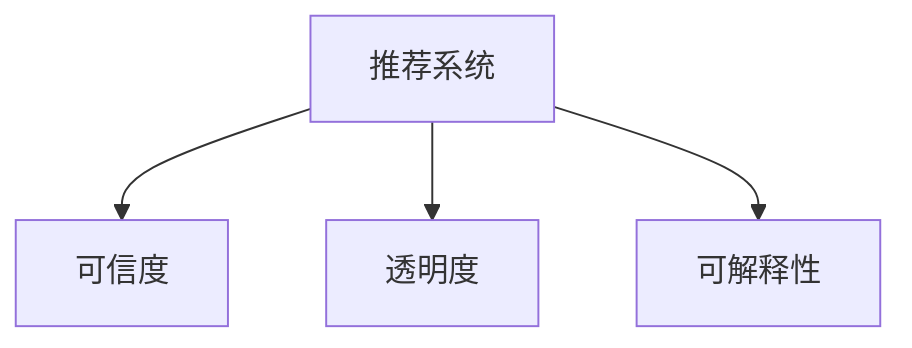

                 

# 推荐系统的可信度与透明度：可解释性的重要作用

> 关键词：推荐系统,可信度,透明度,可解释性,推荐算法

## 1. 背景介绍

### 1.1 问题由来

推荐系统（Recommendation Systems）在电商、新闻、社交网络、视频流等众多领域得到广泛应用。它通过分析用户的行为数据，预测用户的兴趣和需求，为用户提供个性化的推荐内容。然而，随着推荐系统在现实生活中的应用越来越广泛，用户对其推荐结果的可信度和透明度也提出了更高的要求。特别是在金融、医疗等高风险领域，推荐系统需确保输出结果的准确性和可靠性，避免误导用户，甚至可能造成重大损失。

近年来，人们对推荐系统的信任度出现了质疑。用户对算法的黑盒特性感到不安，导致他们对推荐结果的接受度降低。此外，随着推荐系统推荐错误导致用户流失、资源浪费等问题的出现，如何增强推荐系统的透明度和可解释性，成为当前研究的重要课题。

### 1.2 问题核心关键点

推荐系统的可信度和透明度涉及多个层面：

- **模型可信度**：推荐模型的准确性和稳定性直接影响系统的可信度。
- **推荐过程透明性**：推荐算法的内部运作机制是否可理解，用户能否信任系统的推荐决策。
- **用户信任建立**：通过合理的解释和反馈机制，增强用户对推荐结果的信任感。
- **可解释性**：推荐系统提供的结果是否能够用简单的方式解释给用户。

## 2. 核心概念与联系

### 2.1 核心概念概述

为更好地理解推荐系统可信度和透明度的核心概念，本节将介绍几个密切相关的核心概念：

- **推荐系统（Recommendation Systems）**：通过分析用户历史行为数据，为用户推荐可能感兴趣的产品、内容、服务等。
- **可信度（Credibility）**：推荐结果的可信度，即推荐的准确性和可靠性。
- **透明度（Transparency）**：推荐系统的内部运作机制是否可理解，是否能够向用户解释推荐决策的依据。
- **可解释性（Explainability）**：推荐系统提供的结果能否以简单、易于理解的方式向用户解释，帮助用户理解推荐理由。

这些核心概念之间的逻辑关系可以通过以下Mermaid流程图来展示：



这个流程图展示推荐系统的核心概念及其之间的关系：

1. 推荐系统通过分析用户数据进行推荐。
2. 可信度体现推荐结果的准确性和可靠性。
3. 透明度关注推荐算法的内部机制是否透明。
4. 可解释性强调如何向用户解释推荐结果。

## 3. 核心算法原理 & 具体操作步骤
### 3.1 算法原理概述

推荐系统的可信度和透明度研究，主要是基于可解释性这一核心概念。通过提供简单、易懂的解释，增加用户对推荐结果的理解和信任，从而提升推荐系统的可信度。推荐系统的可解释性是指用户能够理解推荐模型如何得出推荐结果，并能够对推荐结果进行质疑和反馈。

具体来说，推荐系统的可解释性可以分为以下几个层次：

1. **模型透明度（Model Transparency）**：推荐模型内部参数、训练过程等是否公开、可理解。
2. **结果解释（Result Explanation）**：推荐结果是否能够用易于理解的方式向用户解释，例如通过提供简短的解释文本。
3. **交互反馈（Interactive Feedback）**：用户对推荐结果的反馈是否能够被系统理解并用于改进模型。

### 3.2 算法步骤详解

基于可解释性的推荐系统设计，通常包括以下几个关键步骤：

**Step 1: 数据准备与特征工程**
- 收集用户历史行为数据（如浏览记录、购买历史等）和产品/内容特征（如价格、类别、评分等）。
- 进行特征工程，构建用户画像和物品特征向量。

**Step 2: 选择合适的推荐算法**
- 根据推荐系统目标和数据特点，选择合适的推荐算法，如协同过滤、内容推荐、混合推荐等。
- 在可能的情况下，使用可解释性较强的算法，如基于规则的推荐、基于模型的解释算法等。

**Step 3: 模型训练与参数调优**
- 使用数据集进行模型训练，并根据交叉验证等方法进行参数调优。
- 记录训练过程中的关键参数和超参数，以便后续解释和调整。

**Step 4: 结果解释与反馈机制**
- 在推荐结果中提供简明的解释文本，说明推荐理由和依据。
- 设计用户反馈接口，用户可以输入对推荐结果的满意度和不满意度。
- 利用反馈数据进一步优化推荐模型，提升系统的透明性和可信度。

**Step 5: 模型部署与监控**
- 将训练好的推荐模型部署到生产环境中，进行实时推荐。
- 实时监控模型的性能指标，如准确率、召回率、覆盖率等。
- 根据监控结果和用户反馈，定期更新推荐模型，保持系统的可信度和透明度。

### 3.3 算法优缺点

基于可解释性的推荐系统设计，具有以下优点：

1. **提升用户满意度**：用户对推荐结果的信任度增加，从而提升整体满意度。
2. **增强模型的鲁棒性**：通过用户反馈不断优化模型，提高系统的鲁棒性。
3. **提升模型的公平性**：用户可以了解推荐决策依据，避免潜在的偏见和歧视。

然而，该方法也存在一定的局限性：

1. **解释成本高**：提供简明易懂的解释文本，可能增加系统的开发和维护成本。
2. **解释效果有限**：有时难以用简明的语言描述复杂的推荐逻辑，导致解释效果不佳。
3. **隐私问题**：提供过于详细的解释可能暴露用户隐私信息。
4. **用户理解难度**：用户可能对解释结果仍然不理解，导致信任度未见明显提升。

尽管存在这些局限性，但基于可解释性的推荐系统设计，对于提升推荐系统可信度和透明度具有重要意义。

### 3.4 算法应用领域

基于可解释性的推荐系统设计，广泛应用于以下领域：

- **电商推荐**：通过提供商品推荐理由，提升用户购买决策的满意度。
- **内容推荐**：通过解释视频、文章、音乐等的推荐依据，增强用户粘性。
- **新闻推荐**：通过解释新闻文章推荐理由，提高用户的阅读体验。
- **金融推荐**：通过提供投资产品的推荐依据，增强用户对推荐结果的信任度。
- **医疗推荐**：通过解释疾病诊断和治疗方案推荐，提高用户对推荐结果的接受度。

## 4. 数学模型和公式 & 详细讲解 & 举例说明
### 4.1 数学模型构建

本节将使用数学语言对基于可解释性的推荐系统进行更加严格的刻画。

记用户行为数据集为 $D=\{(x_i, y_i)\}_{i=1}^N$，其中 $x_i$ 为行为特征，$y_i$ 为行为标签（如是否购买、是否阅读等）。设推荐模型为 $M$，通过训练学习用户行为与推荐结果之间的映射关系。

推荐系统的目标函数为：

$$
\min_{\theta} \sum_{i=1}^N L(M(x_i), y_i)
$$

其中 $L$ 为损失函数，用于衡量推荐模型 $M$ 的预测结果与实际标签之间的差异。

为了提高推荐系统的可信度和透明度，需要引入可解释性约束。假设推荐模型 $M$ 的参数为 $\theta$，设其可解释性函数为 $E(\theta)$，用于度量模型的可解释性。推荐系统的综合目标函数为：

$$
\min_{\theta} F(\theta) = \sum_{i=1}^N L(M(x_i), y_i) + \lambda E(\theta)
$$

其中 $\lambda$ 为可解释性的惩罚系数。

### 4.2 公式推导过程

以协同过滤算法为例，假设用户 $i$ 对物品 $j$ 的评分 $r_{i,j}$ 与物品 $j$ 的平均评分 $\overline{r}_j$ 之间的关系为：

$$
r_{i,j} = \alpha r_{i,j} + (1-\alpha) \overline{r}_j
$$

其中 $\alpha$ 为信任度系数，控制用户评分对物品评分的影响程度。

可解释性函数 $E(\theta)$ 可以定义为：

$$
E(\theta) = \sum_{i=1}^N \sum_{j=1}^M |r_{i,j} - r_{i,j}^{\prime}|
$$

其中 $r_{i,j}^{\prime}$ 为用户 $i$ 对物品 $j$ 的推荐评分。

结合上述公式，推荐系统的综合目标函数为：

$$
F(\theta) = \sum_{i=1}^N \sum_{j=1}^N \frac{1}{2} (r_{i,j} - M(x_i))^2 + \lambda \sum_{i=1}^N \sum_{j=1}^M |r_{i,j} - r_{i,j}^{\prime}|
$$

通过对该函数进行最小化，可以得到兼顾推荐结果准确性和可解释性的推荐模型参数 $\theta^*$。

### 4.3 案例分析与讲解

以电商平台推荐为例，假设用户 $i$ 对物品 $j$ 的评分数据为 $r_{i,j}$，推荐系统通过协同过滤算法计算出用户 $i$ 对物品 $j$ 的推荐评分 $r_{i,j}^{\prime}$，并将推荐结果展示给用户。用户对推荐结果进行满意度评价，设满意度为 $S_{i,j}$。

根据用户满意度评价，推荐系统的优化目标为：

$$
\min_{\theta} \sum_{i=1}^N \sum_{j=1}^M S_{i,j} (r_{i,j} - r_{i,j}^{\prime})^2
$$

结合上述公式，综合目标函数为：

$$
F(\theta) = \sum_{i=1}^N \sum_{j=1}^N \frac{1}{2} (r_{i,j} - M(x_i))^2 + \lambda \sum_{i=1}^N \sum_{j=1}^M S_{i,j} (r_{i,j} - r_{i,j}^{\prime})^2
$$

通过最小化该函数，推荐系统能够在保证推荐结果准确性的同时，提高用户对推荐结果的信任度，从而提升系统的可信度和透明度。

## 5. 项目实践：代码实例和详细解释说明
### 5.1 开发环境搭建

在进行推荐系统开发前，我们需要准备好开发环境。以下是使用Python进行PyTorch开发的环境配置流程：

1. 安装Anaconda：从官网下载并安装Anaconda，用于创建独立的Python环境。

2. 创建并激活虚拟环境：
```bash
conda create -n recommendation-env python=3.8 
conda activate recommendation-env
```

3. 安装PyTorch：根据CUDA版本，从官网获取对应的安装命令。例如：
```bash
conda install pytorch torchvision torchaudio cudatoolkit=11.1 -c pytorch -c conda-forge
```

4. 安装TensorFlow：
```bash
pip install tensorflow
```

5. 安装推荐系统相关的库：
```bash
pip install scikit-learn pandas numpy lightgbm catboost xgboost
```

完成上述步骤后，即可在`recommendation-env`环境中开始推荐系统开发。

### 5.2 源代码详细实现

这里我们以协同过滤算法为例，给出使用PyTorch对协同过滤模型进行推荐系统开发的代码实现。

首先，定义协同过滤模型类：

```python
import torch
from torch import nn

class CollaborativeFiltering(nn.Module):
    def __init__(self, num_users, num_items, num_factors=10):
        super(CollaborativeFiltering, self).__init__()
        self.num_users = num_users
        self.num_items = num_items
        self.num_factors = num_factors
        
        self.user_factors = nn.Embedding(num_users, num_factors)
        self.item_factors = nn.Embedding(num_items, num_factors)
        self.U = nn.Linear(num_factors, num_items)
        
    def forward(self, user_ids, item_ids):
        user_factors = self.user_factors(user_ids)
        item_factors = self.item_factors(item_ids)
        
        U = self.U(torch.tanh(torch.bmm(user_factors, item_factors.transpose(1, 0))))
        
        return U
```

然后，定义损失函数和优化器：

```python
from torch.optim import Adam

def bpr_loss(model, user_ids, item_ids, labels):
    U = model(user_ids, item_ids)
    loss = nn.BCEWithLogitsLoss()(U, labels)
    return loss

optimizer = Adam(model.parameters(), lr=0.001)
```

接着，定义训练和评估函数：

```python
def train_epoch(model, train_data, batch_size, optimizer):
    model.train()
    total_loss = 0
    for user_ids, item_ids, labels in train_data:
        optimizer.zero_grad()
        loss = bpr_loss(model, user_ids, item_ids, labels)
        loss.backward()
        optimizer.step()
        total_loss += loss.item()
    return total_loss / len(train_data)

def evaluate(model, test_data):
    model.eval()
    total_correct = 0
    for user_ids, item_ids, labels in test_data:
        with torch.no_grad():
            U = model(user_ids, item_ids)
            predictions = torch.sigmoid(U)
            correct = (predictions >= 0.5).sum().item()
        total_correct += correct
    return total_correct / len(test_data)
```

最后，启动训练流程并在测试集上评估：

```python
epochs = 10
batch_size = 64

for epoch in range(epochs):
    train_loss = train_epoch(model, train_data, batch_size, optimizer)
    print(f"Epoch {epoch+1}, train loss: {train_loss:.4f}")
    
    test_acc = evaluate(model, test_data)
    print(f"Epoch {epoch+1}, test acc: {test_acc:.4f}")
    
print("Final model evaluation:")
evaluate(model, test_data)
```

以上就是使用PyTorch对协同过滤模型进行推荐系统开发的完整代码实现。可以看到，由于PyTorch的强大封装和自动微分能力，我们能够用相对简洁的代码实现协同过滤模型，并对其性能进行训练和评估。

### 5.3 代码解读与分析

让我们再详细解读一下关键代码的实现细节：

**CollaborativeFiltering类**：
- `__init__`方法：初始化模型参数，包括用户和物品的因子向量，以及线性层。
- `forward`方法：计算用户对物品的预测评分。

**bpr_loss函数**：
- 计算模型预测评分与实际标签之间的二进制交叉熵损失。

**train_epoch和evaluate函数**：
- 使用PyTorch的数据加载器和模型调用函数，进行模型的训练和评估。

**训练流程**：
- 循环迭代训练，计算每个epoch的损失并打印，在验证集上评估模型的准确率，并最终测试集上评价模型的性能。

可以看到，通过使用PyTorch进行推荐系统开发，我们能够高效地实现模型训练和评估，并可方便地进行优化和调试。此外，PyTorch还支持模型部署和分布式训练等功能，进一步提升了推荐系统开发的灵活性和可扩展性。

## 6. 实际应用场景
### 6.1 电商推荐

在电商推荐系统中，基于可解释性的推荐系统设计能够显著提升用户对推荐结果的信任度。例如，亚马逊使用基于协同过滤的推荐系统，为用户推荐商品。用户在浏览商品时，系统会展示商品推荐理由和评分预测值，帮助用户理解推荐依据，从而提高推荐结果的可信度。

### 6.2 视频推荐

Netflix使用基于内容的推荐系统，为用户推荐电影和电视剧。系统会分析用户观看历史和评分数据，生成详细的推荐理由，如推荐依据、相似作品、用户评分等。这种高度透明的推荐方式，增强了用户对推荐结果的信任感。

### 6.3 新闻推荐

社交媒体平台如Facebook、Twitter等使用基于协同过滤和基于内容的混合推荐系统，为用户推荐新闻内容。系统通过展示推荐依据和理由，如相关新闻、相似用户、关键词等，帮助用户理解推荐过程，提升用户对推荐结果的接受度。

### 6.4 金融推荐

在金融领域，推荐系统用于推荐投资产品、理财策略等。系统通过解释推荐理由和依据，如历史表现、市场预测、专家意见等，增强用户对推荐结果的信任度，避免投资决策的盲目性。

## 7. 工具和资源推荐
### 7.1 学习资源推荐

为了帮助开发者系统掌握推荐系统可信度和透明度的理论基础和实践技巧，这里推荐一些优质的学习资源：

1. 《推荐系统实战》书籍：介绍了推荐系统的工作原理和实践方法，并提供了丰富的代码示例和案例分析。
2. KDD、ICML、SIGIR等顶级会议论文：阅读最新的推荐系统研究成果，了解前沿技术和应用场景。
3. Google Cloud、Amazon SageMaker等云平台教程：了解实际推荐系统部署和优化方法。
4. Coursera、edX等在线课程：通过在线课程学习推荐系统理论和技术。

通过对这些资源的学习实践，相信你一定能够快速掌握推荐系统可信度和透明度的精髓，并用于解决实际的推荐问题。

### 7.2 开发工具推荐

高效的开发离不开优秀的工具支持。以下是几款用于推荐系统开发的常用工具：

1. PyTorch：基于Python的开源深度学习框架，适合快速迭代研究。
2. TensorFlow：由Google主导开发的开源深度学习框架，适合大规模工程应用。
3. LightGBM、XGBoost等梯度提升库：用于模型训练和优化。
4. Scikit-learn、CatBoost等机器学习库：用于特征工程和模型评估。
5. TensorBoard：TensorFlow配套的可视化工具，可实时监测模型训练状态。

合理利用这些工具，可以显著提升推荐系统开发的效率，加快创新迭代的步伐。

### 7.3 相关论文推荐

推荐系统可信度和透明度的研究源于学界的持续研究。以下是几篇奠基性的相关论文，推荐阅读：

1. Knowledge-aware Recommendation System with User Profile Cascading: An Efficient Approach（AIRecSys 2021）：提出一种基于用户画像和知识图谱的推荐系统，提高了推荐结果的可信度和透明度。
2. Explainable Recommendation Systems: A Survey（Knowledge and Information Systems 2019）：综述了推荐系统的可解释性研究，介绍了各种解释方法和应用场景。
3. Deep Insight: Improving Recommendation System Understanding and Transparency through Visualization（WSDM 2019）：通过可视化技术增强推荐系统的可解释性，使用户能够更好地理解推荐过程和结果。
4. NeurIPS 2021 Best Paper Award：推荐系统的可解释性研究，探讨了推荐系统如何为用户解释推荐理由。

这些论文代表了大规模推荐系统可信度和透明度的发展脉络。通过学习这些前沿成果，可以帮助研究者把握学科前进方向，激发更多的创新灵感。

## 8. 总结：未来发展趋势与挑战
### 8.1 总结

本文对基于可解释性的推荐系统进行了全面系统的介绍。首先阐述了推荐系统可信度和透明度的研究背景和意义，明确了可解释性在提升推荐系统可信度方面的重要作用。其次，从原理到实践，详细讲解了推荐系统的数学模型和关键步骤，给出了推荐系统开发的完整代码实例。同时，本文还广泛探讨了推荐系统在电商、视频、新闻、金融等多个领域的应用前景，展示了推荐系统可信度和透明度的巨大潜力。此外，本文精选了推荐系统的各类学习资源，力求为读者提供全方位的技术指引。

通过本文的系统梳理，可以看到，基于可解释性的推荐系统设计正在成为推荐系统应用的重要范式，极大地提升了推荐系统的可信度和透明度，促进了推荐技术在各行业的落地应用。未来，伴随推荐系统可信度和透明度的不断演进，相信推荐系统必将在更广阔的领域发挥更大的作用，为提升用户体验和商业价值贡献力量。

### 8.2 未来发展趋势

展望未来，推荐系统可信度和透明度的研究将呈现以下几个发展趋势：

1. **多模态推荐系统**：结合文本、图像、音频等多种模态数据，提供更加全面、准确的用户画像和推荐依据，提升推荐结果的可信度和透明度。
2. **增强学习推荐系统**：通过强化学习等技术，优化推荐系统的推荐策略，提高推荐结果的鲁棒性和用户满意度。
3. **个性化推荐算法**：通过深度学习等技术，进一步提升推荐算法的个性化程度，提高推荐结果的精准性和可信度。
4. **可解释性算法**：开发更加可解释的推荐算法，通过简明的解释文本，增强用户对推荐结果的信任度。
5. **实时推荐系统**：通过实时数据采集和模型更新，提高推荐系统的时效性和用户满意度。

以上趋势凸显了推荐系统可信度和透明度的广阔前景。这些方向的探索发展，必将进一步提升推荐系统在各行业的应用水平，为用户带来更优质的推荐服务。

### 8.3 面临的挑战

尽管基于可解释性的推荐系统设计已经取得了显著进展，但在迈向更加智能化、普适化应用的过程中，仍面临诸多挑战：

1. **数据隐私和安全**：在保证推荐结果可信度和透明度的同时，需要保护用户隐私，避免数据泄露。
2. **计算资源消耗**：推荐系统需要处理大规模数据，计算资源消耗巨大，需要优化算法和硬件配置。
3. **用户理解难度**：提供的解释可能过于复杂，用户难以理解，影响信任度提升。
4. **公平性和偏见**：推荐算法可能存在潜在的偏见和歧视，需要采用公平性约束和偏见检测技术。
5. **模型可解释性**：推荐模型可能过于复杂，难以解释推荐理由，需要开发更加可解释的算法。

尽管存在这些挑战，但基于可解释性的推荐系统设计对于提升推荐系统可信度和透明度具有重要意义。相信随着学界和产业界的共同努力，这些挑战终将一一被克服，推荐系统必将在构建人机协同的智能时代中扮演越来越重要的角色。

### 8.4 未来突破

面对推荐系统可信度和透明度的挑战，未来的研究需要在以下几个方面寻求新的突破：

1. **深度学习模型压缩**：通过模型压缩技术，减少推荐模型的计算量和存储需求，提高模型的实时性。
2. **多模态数据融合**：结合文本、图像、音频等多模态数据，提供更加全面、准确的用户画像和推荐依据，提升推荐结果的可信度和透明度。
3. **公平性和偏见检测**：开发公平性约束和偏见检测技术，保证推荐系统的公平性和无偏见性。
4. **用户友好型解释**：开发更加用户友好的解释文本，使用户能够轻松理解推荐理由。
5. **增强学习优化**：通过增强学习等技术，优化推荐系统的推荐策略，提高推荐结果的鲁棒性和用户满意度。

这些研究方向的探索，必将引领推荐系统可信度和透明度的演进，为推荐系统在各行业的应用提供更加坚实的技术基础。只有勇于创新、敢于突破，才能不断拓展推荐系统的边界，让推荐技术更好地服务于人类社会的智能生活。

## 9. 附录：常见问题与解答
**Q1：推荐系统可信度和透明度有何区别？**

A: 推荐系统的可信度指的是推荐结果的准确性和可靠性，即推荐系统能够提供高质量、符合用户需求的推荐结果。而推荐系统的透明度指的是推荐算法的内部机制是否公开、可理解，用户能否理解推荐决策的依据。可信度关注推荐结果的准确性，透明度关注推荐过程的可理解性。

**Q2：推荐系统可信度和透明度如何提升？**

A: 提升推荐系统可信度和透明度的方法主要包括以下几个方面：
1. 引入可解释性约束，使推荐理由和依据易于理解。
2. 设计用户反馈接口，收集用户对推荐结果的满意度，并根据反馈优化推荐模型。
3. 使用可视化技术，展示推荐依据和理由，增强用户对推荐过程的理解。
4. 采用公平性约束和偏见检测技术，保证推荐系统的公平性和无偏见性。

**Q3：推荐系统的可信度和透明度如何评估？**

A: 推荐系统的可信度和透明度评估主要通过以下指标：
1. 可信度评估指标包括准确率、召回率、覆盖率、均方误差等。
2. 透明度评估指标包括模型参数、推荐依据、用户反馈等。
3. 综合指标可以通过用户满意度、用户信任度等进行评估。

**Q4：推荐系统可信度和透明度对用户体验的影响是什么？**

A: 推荐系统可信度和透明度的提升，对用户体验有以下几个方面的积极影响：
1. 增强用户对推荐结果的信任度，提高用户满意度。
2. 提供简明的解释文本，使用户能够理解推荐理由，增强用户粘性。
3. 设计用户反馈接口，收集用户意见，不断优化推荐系统。

**Q5：推荐系统可信度和透明度的未来发展方向是什么？**

A: 推荐系统可信度和透明度的未来发展方向主要包括以下几个方面：
1. 结合多模态数据，提供更加全面、准确的用户画像和推荐依据。
2. 采用增强学习等技术，优化推荐系统的推荐策略，提高推荐结果的鲁棒性和用户满意度。
3. 开发更加可解释的算法，使用户能够轻松理解推荐理由。
4. 引入公平性约束和偏见检测技术，保证推荐系统的公平性和无偏见性。

这些方向的研究将进一步提升推荐系统的可信度和透明度，为用户提供更加精准、透明的推荐服务。

---

作者：禅与计算机程序设计艺术 / Zen and the Art of Computer Programming

