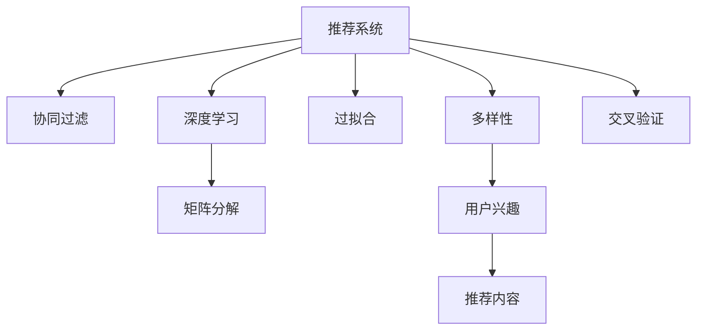

                 

# 推荐系统的局限：过拟合与多样性

> 关键词：推荐系统,过拟合,多样性,深度学习,协同过滤,交叉验证,特征工程

## 1. 背景介绍

推荐系统（Recommender System）旨在为用户推荐他们可能感兴趣的产品、文章、视频等内容，是互联网公司的重要应用之一。传统的推荐系统基于协同过滤和基于内容的推荐方法，通过用户历史行为和物品属性来生成推荐列表。然而，近年来随着深度学习技术的发展，基于深度学习的推荐方法在性能上取得了显著突破，如基于矩阵分解的协同过滤方法、神经网络协同过滤方法、基于序列数据的推荐方法等。这些方法通过大数据学习模型参数，以预测用户对不同物品的偏好程度。

尽管如此，推荐系统在实际应用中仍然面临诸多挑战。过拟合（Overfitting）和推荐内容多样性不足（Diversity）是其中最为突出的问题。过拟合指模型过于复杂，在训练数据上表现良好，但在新数据上表现不佳，导致推荐精度下降。多样性不足指推荐内容过于单一，用户可能长期只能获取到同一类内容，无法发现更多兴趣点，进而导致用户流失。

本文将重点探讨推荐系统中的过拟合和多样性问题，并通过实例说明如何改进这些问题。

## 2. 核心概念与联系

### 2.1 核心概念概述

为了更好地理解推荐系统中的过拟合和多样性问题，本文将介绍几个关键概念：

- **推荐系统**：根据用户的历史行为或物品属性，预测用户对物品的兴趣程度，并提供个性化推荐。
- **过拟合**：指模型在训练数据上表现很好，但在新数据上表现不佳，导致推荐精度下降。
- **多样性**：指推荐内容的多样性，包括推荐内容的类别、风格、情感等方面。
- **协同过滤**：基于用户历史行为或物品间的相似性，推荐与用户兴趣相似的物品。
- **深度学习**：使用多层神经网络模型进行推荐，通过大规模数据学习模型参数。
- **矩阵分解**：将用户与物品之间的评分矩阵分解成低维矩阵，进行推荐预测。
- **交叉验证**：将数据集分成训练集和测试集，通过交叉验证评估模型性能。

这些概念之间的联系可以通过以下Mermaid流程图来展示：



该流程图展示出推荐系统的核心概念及其之间的关系：

1. 推荐系统通过协同过滤、深度学习等方法进行推荐。
2. 协同过滤和深度学习方法在推荐过程中可能出现过拟合现象。
3. 推荐系统中的推荐内容需要多样化，以吸引用户关注。
4. 用户兴趣和推荐内容的多样性是推荐系统评价的重要指标。
5. 交叉验证用于评估推荐系统的泛化能力。

这些概念共同构成了推荐系统的核心框架，使其能够提供个性化的推荐服务。通过理解这些核心概念，我们可以更好地把握推荐系统的设计思路和优化方向。

## 3. 核心算法原理 & 具体操作步骤

### 3.1 算法原理概述

推荐系统中的过拟合和多样性问题，主要源于模型的复杂度和训练数据的多样性。过拟合通常发生在模型参数过多、训练数据过少的情况下。多样性不足则与模型的推荐策略和推荐数据集的多样性有关。

为了缓解过拟合问题，推荐系统通常采用以下方法：

1. **正则化**：在损失函数中加入正则化项，如L2正则化，惩罚模型参数过大的值，避免过拟合。
2. **Dropout**：在训练过程中随机丢弃一些神经元，防止神经元之间相互依赖，从而提高模型的泛化能力。
3. **早停法**：在模型训练过程中，如果模型在验证集上的性能不再提升，则停止训练，避免过拟合。
4. **模型裁剪**：将模型中的一些层或参数去除，减小模型复杂度，提升模型的泛化能力。

为了提升推荐内容的多样性，推荐系统通常采用以下方法：

1. **多目标优化**：在推荐模型中同时考虑用户兴趣和推荐内容的多样性，平衡两者之间的关系。
2. **多样性约束**：在推荐算法中引入多样性约束，如推荐列表中包含一定数量的不同类别的物品。
3. **多模态数据融合**：结合文本、图像、视频等多模态数据，提高推荐内容的丰富性。
4. **主动学习**：主动学习用户兴趣，动态调整推荐策略，增加推荐内容的多样性。

这些方法通过调整模型参数、优化算法和引入更多信息源，可以显著提升推荐系统的性能。

### 3.2 算法步骤详解

基于深度学习的推荐系统通常采用以下步骤：

**Step 1: 数据预处理**

- **数据收集**：从日志、数据库等渠道收集用户行为数据和物品属性数据。
- **数据清洗**：处理缺失值、异常值等问题，确保数据的准确性和完整性。
- **数据划分**：将数据划分为训练集、验证集和测试集。

**Step 2: 特征工程**

- **特征选择**：选择对推荐结果有影响的特征，如用户ID、物品ID、评分、用户行为时间等。
- **特征构建**：构建新的特征，如用户的历史评分分布、物品的类别、情感倾向等。
- **特征归一化**：对特征进行归一化处理，确保数据分布的一致性。

**Step 3: 模型训练**

- **模型选择**：选择适合推荐系统的模型，如神经网络、矩阵分解等。
- **超参数设置**：设置模型的超参数，如学习率、批大小、迭代轮数等。
- **模型训练**：使用训练集进行模型训练，并使用交叉验证评估模型性能。

**Step 4: 模型评估**

- **测试集评估**：在测试集上评估模型的推荐效果，如平均绝对误差（MAE）、均方根误差（RMSE）等指标。
- **多样性评估**：评估推荐内容的多样性，如推荐列表中不同类别物品的数量等。
- **用户满意度评估**：通过用户反馈或A/B测试等方法评估模型的推荐效果。

**Step 5: 模型部署**

- **模型部署**：将训练好的模型部署到生产环境中，实现实时推荐。
- **性能监控**：实时监控模型的推荐效果和性能指标，及时进行调整。

**Step 6: 反馈循环**

- **用户反馈收集**：收集用户对推荐内容的反馈，用于调整推荐策略。
- **模型更新**：根据用户反馈和新的数据，重新训练模型，提升推荐效果。

### 3.3 算法优缺点

基于深度学习的推荐系统具有以下优点：

1. **个性化推荐**：能够根据用户历史行为和物品属性，生成个性化的推荐结果。
2. **高效计算**：通过深度学习模型，可以快速处理大规模数据，提升推荐速度。
3. **鲁棒性**：深度学习模型具有较好的泛化能力，能够适应不同的数据分布。

然而，这些方法也存在以下缺点：

1. **过拟合**：深度学习模型参数较多，容易在训练数据上过拟合，导致泛化能力下降。
2. **计算资源消耗大**：深度学习模型计算复杂，需要大量的计算资源和存储资源。
3. **数据需求高**：深度学习模型需要大量的标注数据进行训练，数据获取成本较高。
4. **多样性不足**：深度学习模型倾向于推荐与用户历史行为相似的物品，缺乏多样性。
5. **模型复杂性高**：深度学习模型结构复杂，难以解释和调试。

### 3.4 算法应用领域

基于深度学习的推荐系统广泛应用于电商、视频、音乐、新闻等众多领域。例如：

- **电商推荐**：根据用户浏览历史和购买记录，推荐用户可能感兴趣的商品。
- **视频推荐**：根据用户观影历史和评分，推荐相似或热门视频。
- **音乐推荐**：根据用户听歌历史和偏好，推荐相似或热门歌曲。
- **新闻推荐**：根据用户阅读历史和兴趣，推荐相关新闻文章。

此外，深度学习推荐方法也被创新性地应用于医疗、金融、社交网络等领域，为这些领域的智能化服务提供新的思路。

## 4. 数学模型和公式 & 详细讲解

### 4.1 数学模型构建

推荐系统中的深度学习模型通常采用神经网络模型，如深度神经网络（DNN）、卷积神经网络（CNN）、循环神经网络（RNN）等。以DNN为例，其结构如图1所示。

图1：DNN模型结构

在DNN模型中，输入为$x$，输出为$y$，其中$x$为特征向量，$y$为预测值。模型通过多个全连接层（Fully Connected Layer）和激活函数（Activation Function）进行特征提取和映射。

假设模型的损失函数为$L(y, \hat{y})$，其中$y$为真实标签，$\hat{y}$为模型预测值。常用的损失函数包括均方误差（MSE）、交叉熵（Cross-Entropy）等。

### 4.2 公式推导过程

以均方误差（MSE）损失函数为例，推导模型的训练过程。

假设模型$M$有$n$个参数，$x$为输入，$y$为真实标签，$\hat{y}$为模型预测值，则均方误差损失函数为：

$$L(y, \hat{y}) = \frac{1}{N}\sum_{i=1}^{N}(y_i - \hat{y}_i)^2$$

其中$N$为样本数量。模型的梯度为：

$$\frac{\partial L(y, \hat{y})}{\partial \theta} = -\frac{2}{N}\sum_{i=1}^{N}(y_i - \hat{y}_i)x_i$$

通过反向传播算法，可以计算出每个参数的梯度，使用优化器进行参数更新。

### 4.3 案例分析与讲解

以电商推荐系统为例，假设用户$u$对商品$j$的评分$x_u^j$，模型预测用户$u$对商品$j$的评分$y_u^j$，则均方误差损失函数为：

$$L(u, j) = \frac{1}{N}\sum_{i=1}^{N}(x_{u,i} - y_{u,i})^2$$

其中$x_{u,i}$为用户$u$对商品$i$的评分，$y_{u,i}$为模型预测的用户$u$对商品$i$的评分。通过反向传播算法计算模型的梯度，并使用优化器进行参数更新。

## 5. 项目实践：代码实例和详细解释说明

### 5.1 开发环境搭建

在进行推荐系统开发前，需要准备好开发环境。以下是使用Python进行TensorFlow开发的环境配置流程：

1. 安装Anaconda：从官网下载并安装Anaconda，用于创建独立的Python环境。

2. 创建并激活虚拟环境：
```bash
conda create -n tf-env python=3.7 
conda activate tf-env
```

3. 安装TensorFlow：
```bash
conda install tensorflow -c conda-forge -c pytorch
```

4. 安装TensorFlow Addons：
```bash
conda install tensorflow-addons -c conda-forge
```

5. 安装Keras：
```bash
pip install keras 
```

6. 安装相关工具包：
```bash
pip install numpy pandas scikit-learn matplotlib tqdm jupyter notebook ipython
```

完成上述步骤后，即可在`tf-env`环境中开始推荐系统开发。

### 5.2 源代码详细实现

下面我们以电商推荐系统为例，给出使用TensorFlow进行深度学习模型训练的代码实现。

首先，定义数据预处理函数：

```python
import tensorflow as tf
from tensorflow.keras.preprocessing import sequence
from tensorflow.keras.models import Sequential
from tensorflow.keras.layers import Embedding, Dense, LSTM, Dropout

def preprocess_data(data, seq_length):
    X = []
    y = []
    for user, items, ratings in data:
        X.append(user)
        y.append(items)
    X = sequence.pad_sequences(X, maxlen=seq_length)
    return X, y
```

然后，定义模型：

```python
model = Sequential([
    Embedding(input_dim=10, output_dim=128, input_length=seq_length),
    LSTM(128, dropout=0.2),
    Dense(1, activation='sigmoid')
])
model.compile(loss='binary_crossentropy', optimizer='adam', metrics=['accuracy'])
```

接着，训练模型：

```python
X, y = preprocess_data(train_data, seq_length=10)
history = model.fit(X, y, epochs=10, batch_size=64, validation_split=0.2)
```

最后，评估模型：

```python
X, y = preprocess_data(test_data, seq_length=10)
score = model.evaluate(X, y)
print('Test score:', score[0])
print('Test accuracy:', score[1])
```

以上代码实现了基于LSTM的电商推荐系统的训练和评估过程。可以看到，通过TensorFlow和Keras的简单配置，可以快速搭建并训练推荐模型。

### 5.3 代码解读与分析

让我们再详细解读一下关键代码的实现细节：

**preprocess_data函数**：
- 该函数将用户ID、商品ID和评分转换为模型输入和输出，并进行padding处理。

**Sequential模型**：
- Sequential模型是一种线性的神经网络模型，适合搭建多层神经网络。
- 该模型由Embedding层、LSTM层和Dense层构成，分别用于特征嵌入、序列建模和输出预测。

**Embedding层**：
- Embedding层将用户ID和商品ID映射为高维向量，用于表示用户和物品的特征。
- 输入维度为10，输出维度为128，表示用户和物品的特征维度。

**LSTM层**：
- LSTM层用于建模用户的历史行为序列，捕捉序列中的时间依赖关系。
- 该层包含128个神经元，并使用dropout技术防止过拟合。

**Dense层**：
- Dense层用于输出预测结果，使用sigmoid激活函数将输出映射到[0, 1]区间。

**模型编译**：
- 使用binary_crossentropy损失函数和adam优化器进行模型编译。

**模型训练**：
- 使用fit方法进行模型训练，并指定训练轮数和批大小。

**模型评估**：
- 使用evaluate方法在测试集上评估模型性能，并输出评分和准确率。

**推荐模型**：
- 在训练好的模型基础上，可以使用predict方法进行推荐预测。

可以看到，TensorFlow和Keras提供了丰富的API和工具，使得推荐系统的开发和训练过程变得简单高效。开发者可以将更多精力放在特征工程和模型调优上，而不必过多关注底层实现细节。

## 6. 实际应用场景

### 6.1 电商推荐

电商推荐系统广泛应用于电商平台，根据用户浏览和购买历史，推荐用户可能感兴趣的商品。传统的协同过滤方法通过用户-物品评分矩阵进行推荐，但面临冷启动用户和新物品的问题。深度学习推荐方法通过神经网络模型，能够更准确地捕捉用户兴趣和物品属性，提升推荐效果。

在实际应用中，电商推荐系统可以采用以下策略：

1. **数据增强**：通过数据扩充和生成对抗网络（GAN）等方法，丰富训练数据集。
2. **模型融合**：结合多种推荐方法，如协同过滤、深度学习和基于内容的推荐，提升推荐效果。
3. **多样性优化**：通过多样性约束和推荐策略优化，增加推荐内容的多样性。

### 6.2 视频推荐

视频推荐系统根据用户观影历史和评分，推荐用户可能感兴趣的视频。传统的协同过滤方法通过用户-物品评分矩阵进行推荐，但面临数据稀疏性和推荐效果不稳定的问题。深度学习推荐方法通过神经网络模型，能够更准确地捕捉用户兴趣和视频属性，提升推荐效果。

在实际应用中，视频推荐系统可以采用以下策略：

1. **多模态数据融合**：结合文本、图像和视频等多模态数据，提升推荐内容的丰富性和准确性。
2. **协同过滤优化**：通过协同过滤算法和深度学习模型相结合，提升推荐效果。
3. **用户兴趣调整**：通过用户反馈和主动学习，调整推荐策略，增加推荐内容的多样性。

### 6.3 音乐推荐

音乐推荐系统根据用户听歌历史和偏好，推荐用户可能感兴趣的音乐。传统的协同过滤方法通过用户-物品评分矩阵进行推荐，但面临数据稀疏性和推荐效果不稳定的问题。深度学习推荐方法通过神经网络模型，能够更准确地捕捉用户兴趣和音乐属性，提升推荐效果。

在实际应用中，音乐推荐系统可以采用以下策略：

1. **多模态数据融合**：结合文本、图像和音频等多模态数据，提升推荐内容的丰富性和准确性。
2. **协同过滤优化**：通过协同过滤算法和深度学习模型相结合，提升推荐效果。
3. **用户兴趣调整**：通过用户反馈和主动学习，调整推荐策略，增加推荐内容的多样性。

### 6.4 未来应用展望

随着深度学习推荐方法的不断演进，未来的推荐系统将呈现出以下趋势：

1. **更高效的多模态融合**：结合更多维度的数据，提升推荐内容的丰富性和多样性。
2. **更精准的用户建模**：通过更复杂的用户建模方法，如知识图谱、社交网络等，提升推荐效果。
3. **更智能的推荐策略**：结合更多智能算法，如强化学习、因果推理等，提升推荐系统的主动性和适应性。
4. **更可解释的推荐模型**：通过可解释性研究，提升推荐模型的透明度和可信度。
5. **更高效的模型训练**：通过模型裁剪、量化加速等技术，提升推荐模型的推理速度和资源利用率。

未来，推荐系统将继续在多个领域发挥重要作用，为用户的个性化需求提供更加智能、高效的服务。

## 7. 工具和资源推荐

### 7.1 学习资源推荐

为了帮助开发者系统掌握深度学习推荐系统的理论基础和实践技巧，这里推荐一些优质的学习资源：

1. 《深度学习推荐系统：理论、算法与应用》系列博文：由深度学习推荐系统专家撰写，深入浅出地介绍了推荐系统的基本概念、算法和应用。

2. CS231n《深度学习与视觉识别》课程：斯坦福大学开设的计算机视觉课程，有Lecture视频和配套作业，带你入门深度学习的基本概念和技术。

3. 《Recommender Systems: A Textbook》书籍：推荐系统领域的经典教材，全面介绍了推荐系统的理论、算法和实践。

4. TensorFlow官方文档：TensorFlow的官方文档，提供了丰富的API和样例代码，是上手实践的必备资料。

5. Keras官方文档：Keras的官方文档，提供了简单易用的API和丰富的示例，适合初学者学习。

通过对这些资源的学习实践，相信你一定能够快速掌握深度学习推荐系统的精髓，并用于解决实际的推荐问题。

### 7.2 开发工具推荐

高效的开发离不开优秀的工具支持。以下是几款用于深度学习推荐系统开发的常用工具：

1. TensorFlow：由Google主导开发的深度学习框架，生产部署方便，适合大规模工程应用。
2. Keras：基于TensorFlow的高级神经网络API，简单易用，适合快速迭代研究。
3. PyTorch：基于Python的开源深度学习框架，灵活动态的计算图，适合快速迭代研究。
4. TensorFlow Addons：TensorFlow的扩展库，提供了更多高级API和功能，如分布式训练、模型压缩等。
5. TensorBoard：TensorFlow配套的可视化工具，可实时监测模型训练状态，并提供丰富的图表呈现方式。
6. Kaggle：数据科学竞赛平台，提供丰富的数据集和模型竞赛，适合实战练习。

合理利用这些工具，可以显著提升深度学习推荐系统的开发效率，加快创新迭代的步伐。

### 7.3 相关论文推荐

深度学习推荐系统的发展源于学界的持续研究。以下是几篇奠基性的相关论文，推荐阅读：

1. "A Survey of Collaborative Filtering Technique"：王晓刚等，综述了协同过滤方法的经典算法和技术。
2. "Deep Collaborative Filtering"：Cai等，提出了深度神经网络协同过滤方法，提升了推荐效果。
3. "Natural Language Processing as Recommender Systems"：Wu等，将自然语言处理技术应用于推荐系统，提升推荐内容的多样性。
4. "Predictive Text on Mobile Phones: A Large-Scale Learning Approach"：Hsieh等，提出了基于序列数据和神经网络模型的推荐方法。
5. "Adaptive Compression of Deep Neural Networks for Smartphones"：Hsieh等，提出了模型压缩技术，提升推荐模型的推理速度和资源利用率。

这些论文代表了大数据推荐系统的发展脉络。通过学习这些前沿成果，可以帮助研究者把握学科前进方向，激发更多的创新灵感。

## 8. 总结：未来发展趋势与挑战

### 8.1 总结

本文对基于深度学习的推荐系统进行了全面系统的介绍。首先阐述了推荐系统中的过拟合和多样性问题，明确了推荐系统在实际应用中面临的挑战。其次，从原理到实践，详细讲解了深度学习推荐系统的数学模型和关键步骤，给出了推荐系统开发的完整代码实例。同时，本文还广泛探讨了推荐系统在电商、视频、音乐等多个领域的应用前景，展示了深度学习推荐系统的巨大潜力。此外，本文精选了推荐系统的学习资源和开发工具，力求为读者提供全方位的技术指引。

通过本文的系统梳理，可以看到，基于深度学习的推荐系统通过大数据学习模型参数，能够提供个性化的推荐服务。尽管如此，推荐系统在实际应用中仍然面临诸多挑战，如过拟合、多样性不足等问题。这些挑战需要通过多种技术手段进行解决，如正则化、Dropout、多样性约束等，才能充分发挥深度学习推荐系统的优势。未来，随着技术不断进步，推荐系统必将带来更加智能、高效的用户体验。

### 8.2 未来发展趋势

展望未来，深度学习推荐系统将呈现以下几个发展趋势：

1. **更高效的多模态融合**：结合更多维度的数据，提升推荐内容的丰富性和多样性。
2. **更精准的用户建模**：通过更复杂的用户建模方法，如知识图谱、社交网络等，提升推荐效果。
3. **更智能的推荐策略**：结合更多智能算法，如强化学习、因果推理等，提升推荐系统的主动性和适应性。
4. **更可解释的推荐模型**：通过可解释性研究，提升推荐模型的透明度和可信度。
5. **更高效的模型训练**：通过模型裁剪、量化加速等技术，提升推荐模型的推理速度和资源利用率。

以上趋势凸显了深度学习推荐系统的广阔前景。这些方向的探索发展，必将进一步提升推荐系统的性能和应用范围，为人工智能技术在实际应用中提供更多支持。

### 8.3 面临的挑战

尽管深度学习推荐系统已经取得了显著成效，但在迈向更加智能化、普适化应用的过程中，仍面临以下挑战：

1. **数据获取成本高**：大规模推荐系统需要大量的用户行为数据和物品属性数据，数据获取成本较高。
2. **模型复杂度大**：深度学习推荐模型参数较多，计算复杂，资源消耗较大。
3. **多样性不足**：深度学习推荐模型倾向于推荐与用户历史行为相似的物品，缺乏多样性。
4. **冷启动问题**：对于新用户和新物品，推荐效果可能较差。
5. **推荐精度不稳定**：深度学习推荐模型容易过拟合，导致推荐精度不稳定。

### 8.4 研究展望

面对深度学习推荐系统面临的诸多挑战，未来的研究需要在以下几个方面寻求新的突破：

1. **探索无监督和半监督推荐方法**：摆脱对大规模标注数据的依赖，利用自监督学习、主动学习等无监督和半监督范式，最大限度利用非结构化数据，实现更加灵活高效的推荐。
2. **研究参数高效和计算高效的推荐方法**：开发更加参数高效的推荐方法，在固定大部分模型参数的同时，只更新极少量的推荐参数。同时优化推荐模型的计算图，减少前向传播和反向传播的资源消耗，实现更加轻量级、实时性的部署。
3. **引入更多先验知识**：将符号化的先验知识，如知识图谱、逻辑规则等，与推荐模型进行巧妙融合，引导推荐过程学习更准确、合理的推荐结果。同时加强不同模态数据的整合，实现视觉、语音等多模态信息与文本信息的协同建模。
4. **结合因果分析和博弈论工具**：将因果分析方法引入推荐模型，识别出推荐结果的关键特征，增强推荐输出的因果性和逻辑性。借助博弈论工具刻画用户和系统的交互过程，主动探索并规避推荐模型的脆弱点，提高系统稳定性。
5. **纳入伦理道德约束**：在推荐模型训练目标中引入伦理导向的评估指标，过滤和惩罚有害的推荐结果，确保推荐系统的公正性和安全性。

这些研究方向的探索，必将引领深度学习推荐系统迈向更高的台阶，为构建更加智能、可靠、可解释、可控的推荐系统提供更多支持。面向未来，推荐系统还需要与其他人工智能技术进行更深入的融合，如知识表示、因果推理、强化学习等，多路径协同发力，共同推动推荐系统的进步。只有勇于创新、敢于突破，才能不断拓展推荐系统的边界，让推荐技术更好地服务于人类社会。

## 9. 附录：常见问题与解答

**Q1：推荐系统是否适用于所有NLP任务？**

A: 推荐系统主要应用于基于用户行为或物品属性的推荐任务，如电商推荐、视频推荐、音乐推荐等。对于NLP任务，如问答系统、情感分析、文本分类等，推荐系统可能不完全适用。但对于一些需要文本推荐的任务，如新闻推荐、广告推荐等，推荐系统可以结合NLP技术进行优化，提升推荐效果。

**Q2：深度学习推荐系统是否适用于所有行业？**

A: 深度学习推荐系统适用于需要个性化推荐的应用场景，如电商、视频、音乐、新闻等。对于某些行业，如医疗、金融等，推荐系统可能面临数据隐私和安全性等问题，需要结合行业特性进行优化。例如，医疗推荐系统需要考虑患者隐私和医疗数据的敏感性，而金融推荐系统需要考虑金融数据的保密性和风险性。

**Q3：推荐系统中的过拟合问题如何解决？**

A: 推荐系统中的过拟合问题通常通过正则化、Dropout、早停法等方法进行缓解。具体来说，可以采用以下策略：
1. 正则化：在损失函数中加入L2正则项，惩罚模型参数过大的值。
2. Dropout：在训练过程中随机丢弃一些神经元，防止神经元之间相互依赖。
3. 早停法：在模型训练过程中，如果模型在验证集上的性能不再提升，则停止训练。
4. 模型裁剪：去除不必要的层或参数，减小模型复杂度。

这些策略可以有效地缓解推荐系统中的过拟合问题，提升模型的泛化能力。

**Q4：推荐内容的多样性如何提升？**

A: 推荐内容的多样性可以通过多种方式进行提升，具体如下：
1. 多目标优化：在推荐模型中同时考虑用户兴趣和推荐内容的多样性，平衡两者之间的关系。
2. 多样性约束：在推荐算法中引入多样性约束，如推荐列表中包含一定数量的不同类别的物品。
3. 多模态数据融合：结合文本、图像、视频等多模态数据，提高推荐内容的丰富性。
4. 主动学习：主动学习用户兴趣，动态调整推荐策略，增加推荐内容的多样性。

这些策略可以有效地提升推荐内容的多样性，提高用户的满意度。

**Q5：推荐系统中的冷启动问题如何解决？**

A: 推荐系统中的冷启动问题通常通过结合推荐算法和模型训练数据进行解决。具体来说，可以采用以下策略：
1. 协同过滤算法：通过用户历史行为和物品属性，生成推荐列表。
2. 基于内容的推荐方法：根据物品的属性特征进行推荐。
3. 新物品推荐：根据物品的相似度进行推荐。
4. 知识图谱：通过知识图谱进行推荐，增加推荐内容的多样性。

这些策略可以有效地缓解推荐系统中的冷启动问题，提升新用户和新物品的推荐效果。

总之，推荐系统在实际应用中面临诸多挑战，但通过多种技术手段进行优化，可以显著提升推荐效果，为用户提供更加个性化和多样化的服务。

---

作者：禅与计算机程序设计艺术 / Zen and the Art of Computer Programming

