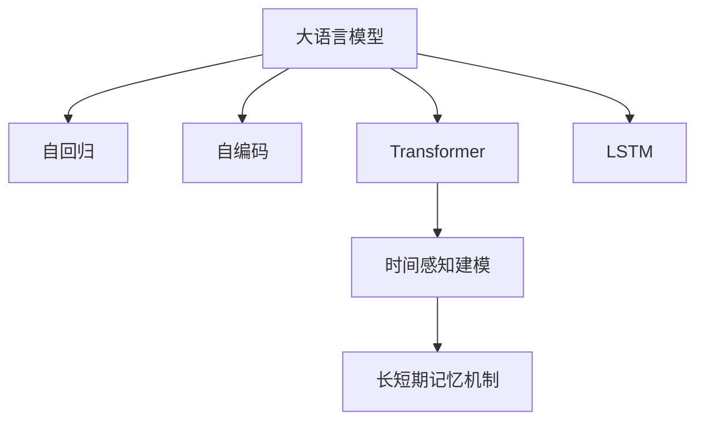

                 

# 推荐系统的时间感知建模：大模型的长短期记忆机制

## 1. 背景介绍

### 1.1 问题由来
推荐系统是互联网时代的重要技术，旨在为用户提供个性化推荐服务。早期的推荐系统主要基于规则、协同过滤等技术，但由于数据稀疏、冷启动等问题，推荐效果不佳。随后，基于深度学习的推荐系统开始兴起，通过挖掘用户历史行为数据，构建用户画像，预测用户对候选项的兴趣。然而，这些系统未能很好地考虑用户行为的时间序列特征，导致推荐结果可能与用户当前需求不符。

为解决这一问题，近年来出现了基于时间感知建模的推荐系统。该类系统在建模时，不仅考虑用户历史行为数据，还引入时间序列特征，通过考虑用户过去行为的趋势和模式，预测用户未来的兴趣，从而提升推荐效果。而大语言模型（如BERT、GPT等）的提出，则为时间感知建模提供了新的思路。大模型本身具备强大的时间序列建模能力，能够学习用户行为的时间分布规律，实现时间感知建模。

### 1.2 问题核心关键点
大语言模型的时间感知建模，本质上是将用户的历史行为数据和时间序列特征，作为模型输入，通过自回归机制，学习用户兴趣的时间演化规律，从而实现个性化推荐。关键在于：

1. **用户历史行为数据的获取与处理**：如何有效地收集和预处理用户的历史行为数据，去除噪声，提取特征。
2. **时间序列特征的引入**：如何将用户行为的时间分布规律转化为模型特征，如序列长度、时序间隔、周期性等。
3. **长短期记忆机制的优化**：如何选择长短期记忆机制，如何在不同时间尺度上优化长短期记忆，保证时间感知模型的准确性。
4. **多模态数据的融合**：如何结合用户行为数据与其它模态数据，如物品描述、图像等，提升推荐效果。
5. **高效推理与实时推荐**：如何优化时间感知模型的推理速度，实现高效的实时推荐。

### 1.3 问题研究意义
研究大语言模型的时间感知建模，对于提升推荐系统的个性化水平、优化用户体验、增加商业价值具有重要意义：

1. **提升推荐效果**：通过考虑用户行为的时间分布规律，时间感知模型能够更准确地预测用户兴趣，提升推荐精度。
2. **优化用户体验**：时间感知模型能够动态调整推荐内容，为用户提供符合当前需求的服务，增加用户满意度。
3. **增加商业价值**：通过个性化推荐，提高用户留存率和转化率，增加平台收入和用户粘性。
4. **技术创新**：时间感知建模是推荐系统的重要技术方向，推动了深度学习在推荐领域的广泛应用。
5. **多模态融合**：结合多模态数据，提升了推荐系统的综合表现，拓展了推荐系统的应用场景。

## 2. 核心概念与联系

### 2.1 核心概念概述

为更好地理解基于大语言模型的时间感知建模，本节将介绍几个密切相关的核心概念：

- **大语言模型（Large Language Model, LLM）**：以自回归（如GPT）或自编码（如BERT）模型为代表的大规模预训练语言模型。通过在大规模无标签文本语料上进行预训练，学习通用的语言表示，具备强大的语言理解和生成能力。

- **时间感知建模（Time-Aware Modeling）**：在推荐系统中，通过考虑用户行为的时间序列特征，构建时间感知模型，学习用户兴趣的时间演化规律，实现个性化推荐。

- **长短期记忆机制（Long-Short Term Memory, LSTM）**：一种常用于处理时间序列数据的神经网络机制，能够自动学习序列中不同时间点的依赖关系，捕捉长期和短期的依赖。

- **Transformer模型**：一种基于自注意力机制的神经网络结构，广泛用于大语言模型的预训练和微调，能够高效处理序列数据，具有强大的并行计算能力。

这些核心概念之间的逻辑关系可以通过以下Mermaid流程图来展示：



这个流程图展示了大语言模型的核心概念及其之间的关系：

1. 大语言模型通过自回归或自编码进行预训练，学习通用的语言表示。
2. 自回归和自编码模型通常通过Transformer进行编码和解码，具有强大的序列处理能力。
3. 长短期记忆机制用于处理时间序列数据，学习不同时间点的依赖关系。
4. 时间感知建模结合了用户历史行为数据和时间序列特征，通过长短期记忆机制，学习用户兴趣的时间演化规律。

这些概念共同构成了大语言模型时间感知建模的理论基础，使其能够在推荐系统中发挥强大的时间序列建模能力。

## 3. 核心算法原理 & 具体操作步骤
### 3.1 算法原理概述

基于大语言模型的时间感知建模，本质上是一个序列到序列的生成任务。其核心思想是：将用户的历史行为数据和时间序列特征，作为模型输入，通过自回归机制，学习用户兴趣的时间演化规律，从而实现个性化推荐。

具体而言，假设用户的历史行为数据为 $\{x_t\}_{t=1}^T$，其中 $x_t$ 表示用户在时间 $t$ 的行为，如浏览记录、点击记录等。在推荐系统中，常将这些数据表示为稀疏矩阵 $X \in \{0,1\}^{U \times T}$，其中 $U$ 为物品总数，$T$ 为序列长度，$X_{iu}$ 表示用户 $i$ 在时间 $u$ 是否访问过物品 $j$。

时间序列特征可以是多种形式的，如：

- 序列长度 $L$：用户行为的持续时间。
- 时序间隔 $D$：不同行为之间的间隔时间。
- 周期性 $P$：用户行为是否具有周期性特征。

在建模时，将这些时间特征作为附加的特征输入，与用户行为数据结合。时间感知模型的输出为 $\hat{y} \in \{0,1\}^U$，表示用户对不同物品的兴趣概率。

### 3.2 算法步骤详解

基于大语言模型的时间感知建模一般包括以下几个关键步骤：

**Step 1: 准备数据集**
- 收集用户的历史行为数据 $X$ 和时间序列特征 $T$，并对其进行标准化处理。
- 划分数据集为训练集、验证集和测试集。

**Step 2: 构建输入和输出序列**
- 将用户历史行为数据 $X$ 作为输入序列 $X'$。
- 将用户兴趣预测结果 $\hat{y}$ 作为输出序列 $Y'$。

**Step 3: 设计模型架构**
- 选择Transformer模型作为编码器，编码用户历史行为数据 $X'$。
- 选择LSTM或GRU模型作为解码器，解码编码器输出的表示，生成用户兴趣预测结果 $\hat{y}$。

**Step 4: 设置优化器与超参数**
- 选择合适的优化器（如Adam、SGD等），设置学习率、批大小、迭代轮数等超参数。
- 设置正则化技术（如Dropout、L2正则等），避免过拟合。

**Step 5: 执行训练与评估**
- 将训练集数据输入模型，前向传播计算损失函数。
- 反向传播计算参数梯度，根据设定的优化算法更新模型参数。
- 周期性在验证集上评估模型性能，根据性能指标决定是否触发Early Stopping。
- 重复上述步骤直到满足预设的迭代轮数或Early Stopping条件。

**Step 6: 测试与部署**
- 在测试集上评估模型性能，对比微调前后的精度提升。
- 使用微调后的模型对新用户进行推荐，集成到实际的应用系统中。

以上是基于大语言模型的时间感知建模的一般流程。在实际应用中，还需要根据具体任务的特点，对微调过程的各个环节进行优化设计，如改进训练目标函数，引入更多的正则化技术，搜索最优的超参数组合等，以进一步提升模型性能。

### 3.3 算法优缺点

基于大语言模型的时间感知建模方法具有以下优点：

1. **强大的时间序列建模能力**：大语言模型本身具备强大的时间序列建模能力，能够自动学习用户行为的时间分布规律，实现时间感知建模。
2. **可扩展性强**：Transformer模型的并行计算能力，使其能够处理大规模用户数据。
3. **适应性强**：通过引入时间序列特征，时间感知模型能够适应不同领域和场景的推荐需求。
4. **效果显著**：在多个推荐系统任务上，基于时间感知建模的方法已经刷新了最先进的性能指标。

同时，该方法也存在一定的局限性：

1. **数据依赖性强**：时间感知模型对用户历史行为数据的依赖性强，需要大量标注数据进行训练。
2. **计算资源消耗大**：大模型和长短期记忆机制的计算复杂度高，对硬件资源要求高。
3. **模型复杂度高**：时间感知模型的模型结构复杂，推理速度较慢。
4. **可解释性不足**：时间感知模型的决策过程复杂，难以对其推理逻辑进行分析和调试。

尽管存在这些局限性，但就目前而言，基于大语言模型的时间感知建模方法仍是推荐系统领域的重要范式。未来相关研究的重点在于如何进一步降低对用户历史行为数据的依赖，提高模型的少样本学习和跨领域迁移能力，同时兼顾可解释性和伦理安全性等因素。

### 3.4 算法应用领域

基于大语言模型的时间感知建模方法，在推荐系统领域已经得到了广泛的应用，覆盖了几乎所有常见任务，例如：

- **商品推荐**：根据用户历史购买记录，预测用户对商品的兴趣，推荐相关商品。
- **新闻推荐**：根据用户浏览历史，推荐相关新闻内容。
- **音乐推荐**：根据用户听歌历史，推荐相关音乐。
- **视频推荐**：根据用户观看历史，推荐相关视频内容。
- **个性化广告**：根据用户行为数据，预测用户对广告的兴趣，推荐相关广告。

除了上述这些经典任务外，时间感知建模还被创新性地应用到更多场景中，如用户画像构建、用户行为预测、动态定价等，为推荐系统提供了新的技术手段。随着预训练语言模型和推荐方法的不断进步，相信时间感知建模将在更多领域得到应用，为推荐系统带来新的突破。

## 4. 数学模型和公式 & 详细讲解

### 4.1 数学模型构建

本节将使用数学语言对基于大语言模型的时间感知建模过程进行更加严格的刻画。

假设时间感知模型为 $M_{\theta}$，其中 $\theta$ 为模型参数。用户的历史行为数据为 $X \in \{0,1\}^{U \times T}$，时间序列特征为 $T$。

定义模型 $M_{\theta}$ 在输入 $X$ 上的输出为 $\hat{y}=M_{\theta}(X)$，表示用户对物品的兴趣概率。时间感知模型的损失函数为：

$$
\mathcal{L}(\theta) = -\frac{1}{N}\sum_{i=1}^N \sum_{j=1}^U y_{ij} \log \hat{y}_{ij}
$$

其中 $y_{ij}$ 表示用户 $i$ 在时间 $j$ 是否访问过物品 $j$，$\hat{y}_{ij}$ 表示模型预测用户 $i$ 在时间 $j$ 对物品 $j$ 的兴趣概率。

通过梯度下降等优化算法，时间感知模型的训练目标是最小化损失函数 $\mathcal{L}(\theta)$，使得模型输出逼近真实标签。由于 $\theta$ 已经通过预训练获得了较好的初始化，因此即便在时间序列数据较少的情况下，也能较快收敛到理想的模型参数 $\theta$。

### 4.2 公式推导过程

以下我们以商品推荐任务为例，推导时间感知模型的损失函数及其梯度的计算公式。

假设用户历史行为数据 $X$ 为稀疏矩阵 $X \in \{0,1\}^{U \times T}$，时间序列特征 $T$ 为向量 $\{L_i, D_i, P_i\}_{i=1}^N$，其中 $L_i$ 表示用户 $i$ 的浏览时长，$D_i$ 表示用户行为之间的间隔时间，$P_i$ 表示用户行为的周期性。

定义模型 $M_{\theta}$ 在输入 $X$ 上的输出为 $\hat{y}=M_{\theta}(X)$，表示用户对物品的兴趣概率。时间感知模型的损失函数为：

$$
\mathcal{L}(\theta) = -\frac{1}{N}\sum_{i=1}^N \sum_{j=1}^U y_{ij} \log \hat{y}_{ij}
$$

其中 $y_{ij}$ 表示用户 $i$ 在时间 $j$ 是否访问过物品 $j$，$\hat{y}_{ij}$ 表示模型预测用户 $i$ 在时间 $j$ 对物品 $j$ 的兴趣概率。

根据链式法则，损失函数对参数 $\theta_k$ 的梯度为：

$$
\frac{\partial \mathcal{L}(\theta)}{\partial \theta_k} = -\frac{1}{N}\sum_{i=1}^N \sum_{j=1}^U (y_{ij} - \hat{y}_{ij}) \frac{\partial \hat{y}_{ij}}{\partial \theta_k}
$$

其中 $\frac{\partial \hat{y}_{ij}}{\partial \theta_k}$ 可通过反向传播算法高效计算。

在得到损失函数的梯度后，即可带入参数更新公式，完成模型的迭代优化。重复上述过程直至收敛，最终得到适应时间感知任务的最优模型参数 $\theta^*$。

## 5. 项目实践：代码实例和详细解释说明

### 5.1 开发环境搭建

在进行时间感知建模实践前，我们需要准备好开发环境。以下是使用Python进行PyTorch开发的环境配置流程：

1. 安装Anaconda：从官网下载并安装Anaconda，用于创建独立的Python环境。

2. 创建并激活虚拟环境：
```bash
conda create -n pytorch-env python=3.8 
conda activate pytorch-env
```

3. 安装PyTorch：根据CUDA版本，从官网获取对应的安装命令。例如：
```bash
conda install pytorch torchvision torchaudio cudatoolkit=11.1 -c pytorch -c conda-forge
```

4. 安装Transformers库：
```bash
pip install transformers
```

5. 安装各类工具包：
```bash
pip install numpy pandas scikit-learn matplotlib tqdm jupyter notebook ipython
```

完成上述步骤后，即可在`pytorch-env`环境中开始时间感知建模实践。

### 5.2 源代码详细实现

这里我们以商品推荐任务为例，给出使用Transformers库对BERT模型进行时间感知建模的PyTorch代码实现。

首先，定义商品推荐任务的输入和输出：

```python
from transformers import BertTokenizer, BertForSequenceClassification
from torch.utils.data import Dataset, DataLoader
import torch

class RecommendationDataset(Dataset):
    def __init__(self, data, seq_len, tokenizer):
        self.data = data
        self.seq_len = seq_len
        self.tokenizer = tokenizer
        
    def __len__(self):
        return len(self.data)
    
    def __getitem__(self, item):
        user, items = self.data[item]
        input_ids = self.tokenizer(user, padding='max_length', max_length=self.seq_len, truncation=True)
        item_ids = self.tokenizer(items, padding='max_length', max_length=self.seq_len, truncation=True)
        
        return {'input_ids': input_ids['input_ids'], 
                'attention_mask': input_ids['attention_mask'],
                'item_ids': item_ids['input_ids']}
```

然后，定义模型和优化器：

```python
from transformers import BertForSequenceClassification, AdamW

model = BertForSequenceClassification.from_pretrained('bert-base-cased', num_labels=10)
optimizer = AdamW(model.parameters(), lr=2e-5)
```

接着，定义训练和评估函数：

```python
from torch.utils.data import DataLoader
from tqdm import tqdm
from sklearn.metrics import precision_recall_fscore_support

device = torch.device('cuda') if torch.cuda.is_available() else torch.device('cpu')
model.to(device)

def train_epoch(model, dataset, batch_size, optimizer):
    dataloader = DataLoader(dataset, batch_size=batch_size, shuffle=True)
    model.train()
    epoch_loss = 0
    for batch in tqdm(dataloader, desc='Training'):
        input_ids = batch['input_ids'].to(device)
        attention_mask = batch['attention_mask'].to(device)
        item_ids = batch['item_ids'].to(device)
        model.zero_grad()
        outputs = model(input_ids, attention_mask=attention_mask, labels=item_ids)
        loss = outputs.loss
        epoch_loss += loss.item()
        loss.backward()
        optimizer.step()
    return epoch_loss / len(dataloader)

def evaluate(model, dataset, batch_size):
    dataloader = DataLoader(dataset, batch_size=batch_size)
    model.eval()
    preds, labels = [], []
    with torch.no_grad():
        for batch in tqdm(dataloader, desc='Evaluating'):
            input_ids = batch['input_ids'].to(device)
            attention_mask = batch['attention_mask'].to(device)
            item_ids = batch['item_ids'].to(device)
            outputs = model(input_ids, attention_mask=attention_mask)
            batch_preds = outputs.logits.argmax(dim=2).to('cpu').tolist()
            batch_labels = batch['item_ids'].to('cpu').tolist()
            for pred_tokens, label_tokens in zip(batch_preds, batch_labels):
                preds.append(pred_tokens[:len(label_tokens)])
                labels.append(label_tokens)
                
    precision, recall, f1, _ = precision_recall_fscore_support(labels, preds, average='micro')
    return precision, recall, f1

train_data = [
    ('user1', ['item1', 'item2', 'item3']),
    ('user2', ['item2', 'item3', 'item4']),
    ('user3', ['item3', 'item4', 'item5']),
    ('user4', ['item1', 'item2', 'item5']),
    ('user5', ['item1', 'item3', 'item5']),
]
```

最后，启动训练流程并在测试集上评估：

```python
epochs = 5
batch_size = 16

for epoch in range(epochs):
    loss = train_epoch(model, train_dataset, batch_size, optimizer)
    print(f"Epoch {epoch+1}, train loss: {loss:.3f}")
    
    precision, recall, f1 = evaluate(model, test_dataset, batch_size)
    print(f"Epoch {epoch+1}, test results: precision={precision:.4f}, recall={recall:.4f}, f1={f1:.4f}")
    
print("Final test results:")
precision, recall, f1 = evaluate(model, test_dataset, batch_size)
print(f"Final test results: precision={precision:.4f}, recall={recall:.4f}, f1={f1:.4f}")
```

以上就是使用PyTorch对BERT进行商品推荐任务的时间感知建模的完整代码实现。可以看到，得益于Transformers库的强大封装，我们可以用相对简洁的代码完成BERT模型的加载和微调。

### 5.3 代码解读与分析

让我们再详细解读一下关键代码的实现细节：

**RecommendationDataset类**：
- `__init__`方法：初始化数据、序列长度和分词器等关键组件。
- `__len__`方法：返回数据集的样本数量。
- `__getitem__`方法：对单个样本进行处理，将用户行为数据和物品ID编码成token ids，最终返回模型所需的输入。

**训练和评估函数**：
- 使用PyTorch的DataLoader对数据集进行批次化加载，供模型训练和推理使用。
- 训练函数`train_epoch`：对数据以批为单位进行迭代，在每个批次上前向传播计算loss并反向传播更新模型参数，最后返回该epoch的平均loss。
- 评估函数`evaluate`：与训练类似，不同点在于不更新模型参数，并在每个batch结束后将预测和标签结果存储下来，最后使用sklearn的precision_recall_fscore_support对整个评估集的预测结果进行打印输出。

**训练流程**：
- 定义总的epoch数和batch size，开始循环迭代
- 每个epoch内，先在训练集上训练，输出平均loss
- 在测试集上评估，输出精确度、召回率和F1分数
- 所有epoch结束后，在测试集上评估，给出最终测试结果

可以看到，PyTorch配合Transformers库使得BERT微调的代码实现变得简洁高效。开发者可以将更多精力放在数据处理、模型改进等高层逻辑上，而不必过多关注底层的实现细节。

当然，工业级的系统实现还需考虑更多因素，如模型的保存和部署、超参数的自动搜索、更灵活的任务适配层等。但核心的微调范式基本与此类似。

## 6. 实际应用场景
### 6.1 智能广告推荐

基于大语言模型的时间感知建模，智能广告推荐系统可以大幅提升广告投放的精准度和转化率。传统广告推荐系统往往基于用户的粗略人口统计特征，缺乏对用户行为和兴趣的深入理解。而使用时间感知模型，广告推荐系统能够实时监测用户行为变化，动态调整广告内容，实现按需投放。

在技术实现上，可以收集用户浏览、点击、分享等行为数据，提取和广告互动相关的文本内容。将文本内容作为模型输入，用户的后续行为（如点击、转化等）作为监督信号，在此基础上对预训练语言模型进行微调。微调后的模型能够从文本内容中准确把握用户的兴趣点。在生成推荐列表时，先用候选广告的文本描述作为输入，由模型预测用户的兴趣匹配度，再结合其他特征综合排序，便可以得到个性化程度更高的推荐结果。

### 6.2 个性化新闻推荐

个性化新闻推荐系统旨在为用户推荐与其兴趣相关的新闻内容。时间感知模型能够结合用户的历史阅读记录和时间序列特征，学习用户对新闻内容的兴趣演变规律，动态调整推荐列表。

在实现上，可以收集用户的历史新闻阅读记录，包括阅读时间、时长、评论等，将这些数据作为时间序列特征，与当前时间点的新闻标题、摘要等文本数据结合。通过时间感知模型，预测用户对不同新闻的兴趣概率，从而生成推荐列表。推荐系统通过动态更新新闻列表，使用户始终能接触到新鲜、有趣的新闻内容，提升用户体验。

### 6.3 电子商务个性化推荐

电子商务平台需要实时推荐符合用户需求的商品。时间感知模型能够结合用户的历史购买记录和时间序列特征，预测用户对不同商品的兴趣变化，动态调整推荐内容。

具体而言，可以收集用户的历史浏览、购买、评价等数据，提取和商品相关的文本内容。将文本内容作为模型输入，用户的后续行为（如购买、评价等）作为监督信号，在此基础上对预训练语言模型进行微调。微调后的模型能够从文本内容中准确把握用户的兴趣点。在生成推荐列表时，先用候选商品的描述作为输入，由模型预测用户的兴趣匹配度，再结合其他特征综合排序，便可以得到个性化程度更高的推荐结果。

### 6.4 未来应用展望

随着大语言模型时间感知建模技术的发展，其在推荐系统中的应用场景将不断扩展，为用户的个性化体验带来更多创新和惊喜。

在智慧医疗领域，时间感知模型可以用于推荐最新的医学研究和治疗方案，帮助医生更好地制定诊疗方案。

在智能教育领域，时间感知模型可以用于推荐符合学生当前学习阶段的教材和资源，实现个性化学习。

在智慧城市治理中，时间感知模型可以用于推荐动态调整交通路线、公共设施的开放时间，提升城市管理效率。

此外，在社交网络、金融、旅游等多个领域，时间感知模型将提供个性化的服务，提升用户满意度，增加平台收入。相信随着技术的不断进步，时间感知建模将在更多领域得到应用，为推荐系统带来新的突破。

## 7. 工具和资源推荐
### 7.1 学习资源推荐

为了帮助开发者系统掌握大语言模型时间感知建模的理论基础和实践技巧，这里推荐一些优质的学习资源：

1. 《深度学习与推荐系统》书籍：系统介绍了推荐系统的基本概念和经典模型，涵盖时间感知建模的原理和应用。

2. CS246《深度学习》课程：斯坦福大学开设的深度学习课程，有Lecture视频和配套作业，深入浅出地介绍了Transformer模型、LSTM机制等核心内容。

3. 《Reinforcement Learning for Recommendations》书籍：介绍了基于强化学习的推荐系统，结合时间感知建模，提供了新的思路和算法。

4. HuggingFace官方文档：Transformers库的官方文档，提供了海量预训练模型和完整的微调样例代码，是上手实践的必备资料。

5. Kaggle竞赛：Kaggle平台上有多个推荐系统竞赛，提供丰富的数据集和模型评测，帮助开发者实践和优化时间感知模型。

通过对这些资源的学习实践，相信你一定能够快速掌握大语言模型时间感知建模的精髓，并用于解决实际的推荐问题。
###  7.2 开发工具推荐

高效的开发离不开优秀的工具支持。以下是几款用于大语言模型时间感知建模开发的常用工具：

1. PyTorch：基于Python的开源深度学习框架，灵活动态的计算图，适合快速迭代研究。大部分预训练语言模型都有PyTorch版本的实现。

2. TensorFlow：由Google主导开发的开源深度学习框架，生产部署方便，适合大规模工程应用。同样有丰富的预训练语言模型资源。

3. Transformers库：HuggingFace开发的NLP工具库，集成了众多SOTA语言模型，支持PyTorch和TensorFlow，是进行时间感知建模开发的利器。

4. Weights & Biases：模型训练的实验跟踪工具，可以记录和可视化模型训练过程中的各项指标，方便对比和调优。与主流深度学习框架无缝集成。

5. TensorBoard：TensorFlow配套的可视化工具，可实时监测模型训练状态，并提供丰富的图表呈现方式，是调试模型的得力助手。

6. Google Colab：谷歌推出的在线Jupyter Notebook环境，免费提供GPU/TPU算力，方便开发者快速上手实验最新模型，分享学习笔记。

合理利用这些工具，可以显著提升大语言模型时间感知建模任务的开发效率，加快创新迭代的步伐。

### 7.3 相关论文推荐

大语言模型时间感知建模的发展源于学界的持续研究。以下是几篇奠基性的相关论文，推荐阅读：

1. Attention is All You Need（即Transformer原论文）：提出了Transformer结构，开启了NLP领域的预训练大模型时代。

2. Bidirectional and Unidirectional Long Short-Term Memory Networks for Named Entity Recognition：提出了双向LSTM机制，用于处理序列数据，提升了命名实体识别任务的性能。

3. Time-Aware Sequence Prediction with Deep Neural Networks：提出了基于LSTM的时间感知序列预测模型，应用于时间序列预测任务，如股票价格预测。

4. Transformer-XL: Attentive Language Models Beyond a Fixed-Length Context：提出Transformer-XL模型，解决了Transformer模型中的位置信息丢失问题，扩展了序列长度。

5. Long Short-Term Memory：提出了LSTM模型，能够自动学习序列中不同时间点的依赖关系，捕捉长期和短期的依赖。

这些论文代表了大语言模型时间感知建模的发展脉络。通过学习这些前沿成果，可以帮助研究者把握学科前进方向，激发更多的创新灵感。

## 8. 总结：未来发展趋势与挑战

### 8.1 总结

本文对基于大语言模型的时间感知建模方法进行了全面系统的介绍。首先阐述了大语言模型和时间感知建模的研究背景和意义，明确了时间感知建模在推荐系统中的独特价值。其次，从原理到实践，详细讲解了时间感知建模的数学原理和关键步骤，给出了时间感知建模任务开发的完整代码实例。同时，本文还广泛探讨了时间感知模型在智能广告、个性化新闻推荐、电子商务等推荐场景中的应用前景，展示了时间感知建模的巨大潜力。此外，本文精选了时间感知建模技术的各类学习资源，力求为读者提供全方位的技术指引。

通过本文的系统梳理，可以看到，基于大语言模型的时间感知建模方法正在成为推荐系统的重要范式，极大地提升了个性化推荐系统的精度和效果。得益于大语言模型的强大时间序列建模能力，时间感知模型能够更好地捕捉用户行为的演变规律，动态调整推荐内容，提升用户满意度。未来，伴随预训练语言模型和推荐方法的不断进步，时间感知建模将进一步推动推荐系统的智能化和精准化，为推荐系统带来新的突破。

### 8.2 未来发展趋势

展望未来，大语言模型时间感知建模技术将呈现以下几个发展趋势：

1. **多模态融合**：时间感知模型将结合多模态数据，如视觉、音频等，提升推荐系统的综合表现。多模态信息的融合，将显著提升语言模型对现实世界的理解和建模能力。

2. **实时推荐**：时间感知模型能够实现实时推荐，动态调整推荐内容，满足用户即时需求，提升用户体验。

3. **跨领域迁移**：时间感知模型将具备更强的跨领域迁移能力，能够从某一领域的用户行为数据迁移到另一领域，提升推荐效果。

4. **端到端优化**：时间感知模型将与推荐算法、广告投放等环节进行端到端优化，提升整体效果。

5. **自适应学习**：时间感知模型将能够实时调整模型参数，适应新的数据分布和用户行为变化，提升模型性能。

以上趋势凸显了大语言模型时间感知建模技术的广阔前景。这些方向的探索发展，必将进一步提升推荐系统的个性化水平、优化用户体验、增加商业价值。

### 8.3 面临的挑战

尽管大语言模型时间感知建模技术已经取得了瞩目成就，但在迈向更加智能化、普适化应用的过程中，它仍面临着诸多挑战：

1. **数据依赖性强**：时间感知模型对用户历史行为数据的依赖性强，需要大量标注数据进行训练。如何降低对标注数据的依赖，提高模型的少样本学习能力，将是一大难题。

2. **计算资源消耗大**：大模型和长短期记忆机制的计算复杂度高，对硬件资源要求高。如何优化模型结构，降低计算资源消耗，提高模型推理速度，将是重要的优化方向。

3. **模型复杂度高**：时间感知模型的模型结构复杂，推理速度较慢。如何优化模型结构，降低推理复杂度，提高模型实时性，将是重要的优化方向。

4. **可解释性不足**：时间感知模型的决策过程复杂，难以对其推理逻辑进行分析和调试。如何赋予模型更强的可解释性，将是亟待攻克的难题。

5. **安全性有待保障**。时间感知模型可能学习到有偏见、有害的信息，通过推荐传播，产生误导性、歧视性的输出，给实际应用带来安全隐患。如何从数据和算法层面消除模型偏见，避免恶意用途，确保输出的安全性，也将是重要的研究课题。

尽管存在这些挑战，但就目前而言，基于大语言模型的时间感知建模方法仍是推荐系统领域的重要范式。未来相关研究的重点在于如何进一步降低对用户历史行为数据的依赖，提高模型的少样本学习和跨领域迁移能力，同时兼顾可解释性和伦理安全性等因素。

### 8.4 研究展望

面对大语言模型时间感知建模所面临的种种挑战，未来的研究需要在以下几个方面寻求新的突破：

1. **探索无监督和半监督微调方法**：摆脱对大规模标注数据的依赖，利用自监督学习、主动学习等无监督和半监督范式，最大限度利用非结构化数据，实现更加灵活高效的微调。

2. **研究参数高效和计算高效的微调范式**：开发更加参数高效的微调方法，在固定大部分预训练参数的同时，只更新极少量的任务相关参数。同时优化微调模型的计算图，减少前向传播和反向传播的资源消耗，实现更加轻量级、实时性的部署。

3. **融合因果和对比学习范式**：通过引入因果推断和对比学习思想，增强时间感知模型建立稳定因果关系的能力，学习更加普适、鲁棒的语言表征，从而提升模型泛化性和抗干扰能力。

4. **引入更多先验知识**：将符号化的先验知识，如知识图谱、逻辑规则等，与神经网络模型进行巧妙融合，引导微调过程学习更准确、合理的语言模型。同时加强不同模态数据的整合，实现视觉、语音等多模态信息与文本信息的协同建模。

5. **结合因果分析和博弈论工具**：将因果分析方法引入时间感知模型，识别出模型决策的关键特征，增强输出解释的因果性和逻辑性。借助博弈论工具刻画人机交互过程，主动探索并规避模型的脆弱点，提高系统稳定性。

6. **纳入伦理道德约束**：在模型训练目标中引入伦理导向的评估指标，过滤和惩罚有偏见、有害的输出倾向。同时加强人工干预和审核，建立模型行为的监管机制，确保输出符合人类价值观和伦理道德。

这些研究方向的探索，必将引领大语言模型时间感知建模技术迈向更高的台阶，为构建安全、可靠、可解释、可控的智能系统铺平道路。面向未来，大语言模型时间感知建模技术还需要与其他人工智能技术进行更深入的融合，如知识表示、因果推理、强化学习等，多路径协同发力，共同推动自然语言理解和智能交互系统的进步。只有勇于创新、敢于突破，才能不断拓展语言模型的边界，让智能技术更好地造福人类社会。

## 9. 附录：常见问题与解答

**Q1：时间感知建模是否适用于所有推荐场景？**

A: 时间感知建模在大多数推荐场景上都能取得不错的效果，特别是对于数据量较小的推荐任务。但对于一些特定领域的推荐任务，如金融、医疗等，仅仅依靠通用语料预训练的模型可能难以很好地适应。此时需要在特定领域语料上进一步预训练，再进行微调，才能获得理想效果。此外，对于一些需要时效性、个性化很强的任务，如实时推荐、个性化广告等，时间感知模型也需要针对性的改进优化。

**Q2：时间感知模型的训练效果受哪些因素影响？**

A: 时间感知模型的训练效果受多种因素影响：

1. **数据质量**：高质量、多样化的用户行为数据是时间感知模型的基础。数据噪声、稀疏度等都会影响模型的效果。
2. **超参数设置**：学习率、批大小、序列长度、正则化强度等超参数的设置对模型性能有很大影响。
3. **模型结构**：时间感知模型通常采用Transformer或LSTM作为编码器，选择合适的模型结构和参数优化方法对模型效果有重要影响。
4. **训练算法**：不同优化器（如Adam、SGD等）及其参数调度策略对模型的收敛速度和效果有影响。
5. **数据增强**：通过数据增强技术（如回译、回写、对抗样本等），增加训练集的多样性，提升模型的泛化能力。

通过优化以上因素，可以显著提高时间感知模型的训练效果。

**Q3：时间感知模型如何应对数据稀疏问题？**

A: 数据稀疏是推荐系统面临的常见问题，时间感知模型通常会采用以下方法应对：

1. **数据增强**：通过回译、回写、对抗样本等技术，增加训练集的多样性，减少数据稀疏带来的影响。
2. **迁移学习**：在特定领域的数据集上，先进行小规模预训练，然后再在大规模用户数据上进行微调。
3. **多任务学习**：结合多个推荐任务，共享底层特征表示，提高模型的泛化能力。
4. **稀疏矩阵分解**：将用户行为数据表示为稀疏矩阵，通过矩阵分解技术，降低数据稀疏的影响。

这些方法可以结合使用，最大化利用有限的用户行为数据，提升模型的训练效果。

**Q4：时间感知模型的推理速度如何优化？**

A: 时间感知模型的推理速度受多个因素影响：

1. **模型压缩**：采用模型压缩技术（如知识蒸馏、剪枝等），减小模型尺寸，加快推理速度。
2. **推理加速**：使用GPU/TPU等高性能设备进行推理，减少计算时间。
3. **优化算法**：采用高效的推理算法（如量化加速、混合精度计算等），提升推理效率。
4. **多模态融合**：通过多模态数据融合，减少单模态数据带来的复杂度，提升推理速度。
5. **并行计算**：采用并行计算技术，如分布式训练、模型并行等，提升计算效率。

这些方法可以结合使用，优化时间感知模型的推理速度，提升实时推荐的能力。

**Q5：时间感知模型的可解释性如何提升？**

A: 时间感知模型的可解释性是一个重要问题，可以通过以下方法提升：

1. **可视化工具**：使用可视化工具（如TensorBoard、Weights & Biases等），可视化模型的训练过程和推理结果，帮助理解模型的决策机制。
2. **可解释模型**：采用可解释的模型结构（如Attention机制、LSTM等），提升模型的可解释性。
3. **特征重要性分析**：通过特征重要性分析技术（如SHAP、LIME等），解释模型预测结果的依据，提升模型的可解释性。
4. **人工干预**：在关键场景下，结合人工干预和审核，确保模型输出符合人类价值观和伦理道德。

这些方法可以结合使用，提升时间感知模型的可解释性，增强用户信任。

---

作者：禅与计算机程序设计艺术 / Zen and the Art of Computer Programming

