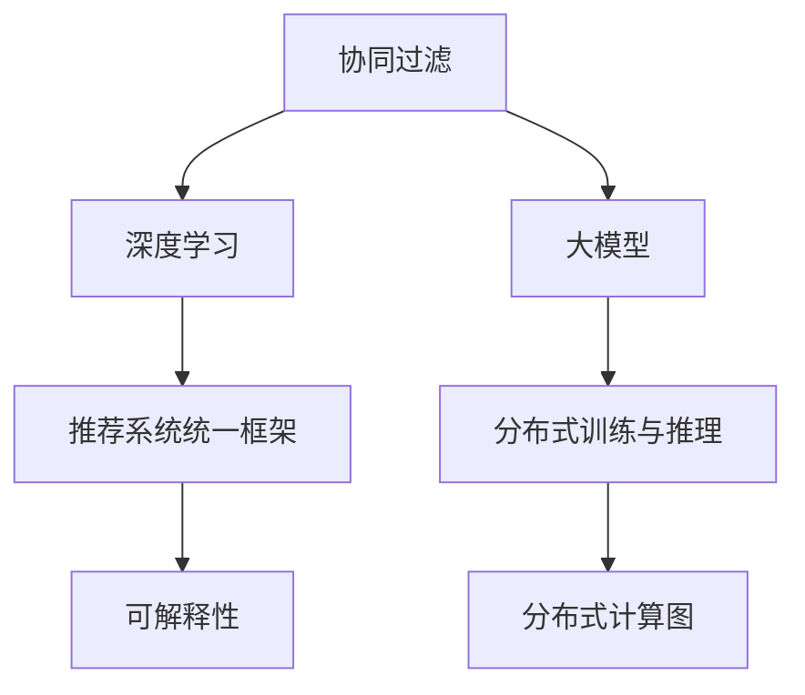

                 

# 推荐系统的统一框架优势：大模型的解决方案

> 关键词：推荐系统,大模型,统一框架,协同过滤,深度学习,分布式,计算图,可解释性

## 1. 背景介绍

### 1.1 问题由来

随着互联网的迅猛发展和数字经济的兴起，推荐系统（Recommendation System）在电子商务、社交网络、在线视频、音乐和新闻推荐等领域得到了广泛应用。推荐系统通过分析用户的历史行为数据，预测其兴趣偏好，从而推荐符合用户需求的内容。推荐系统在提升用户体验、增加用户粘性、增加平台收入等方面发挥了重要作用。

然而，推荐系统面临着许多挑战，如数据稀疏性、多样性、实时性、用户隐私保护等。这些问题在传统推荐方法中难以得到有效解决。近年来，随着深度学习和大模型技术的迅猛发展，推荐系统研究进入了一个新的阶段。大模型基于海量数据进行预训练，能够学习到更为丰富的特征表示，应用于推荐系统可以带来显著的性能提升。

### 1.2 问题核心关键点

目前，推荐系统的主流方法是协同过滤和深度学习方法。协同过滤基于用户行为或物品的属性进行相似性度量，推断出用户对未交互物品的偏好。深度学习方法使用神经网络模型对用户-物品交互数据进行建模，预测用户对物品的评分。

大模型技术的应用为推荐系统带来了新的解决思路。通过预训练语言模型等大模型，可以在大量文本数据上学习到丰富的语义信息，应用于推荐系统中可以更精准地预测用户兴趣。然而，如何在大模型基础上构建统一的推荐系统框架，实现模型的分布式训练和推理，同时保持模型的可解释性，仍然是一个需要深入研究的课题。

## 2. 核心概念与联系

### 2.1 核心概念概述

为更好地理解基于大模型的推荐系统框架，本节将介绍几个密切相关的核心概念：

- 协同过滤（Collaborative Filtering）：一种推荐算法，通过分析用户的历史行为或物品的属性，推测用户对未交互物品的偏好，并进行推荐。常见的协同过滤方法包括基于用户的协同过滤、基于物品的协同过滤等。

- 深度学习推荐系统（Deep Learning-Based Recommendation System）：基于神经网络模型对用户-物品交互数据进行建模，利用学习到的特征表示进行推荐。深度学习推荐系统具有很强的泛化能力和表达能力，但在计算资源和时间成本上较高。

- 大模型（Large Model）：以自回归（如GPT）或自编码（如BERT）模型为代表的大规模预训练模型。通过在大规模无标签文本数据上进行预训练，学习到丰富的语言知识和常识，可用于各种任务。

- 推荐系统统一框架（Unified Recommendation System Framework）：将协同过滤和深度学习推荐系统整合在一个统一的框架中，通过分布式训练和推理，提高模型的性能和效率。统一框架可以最大化利用大模型带来的优势，同时保持模型的可解释性。

- 分布式训练与推理（Distributed Training and Inference）：利用多台计算资源并行处理大规模数据，实现模型的高效训练和推理。

- 可解释性（Explainability）：推荐系统模型的输出结果应该具有一定的可解释性，以便用户理解模型推荐的依据。

- 分布式计算图（Distributed Computation Graph）：在分布式环境中，通过将计算图分解成多个子图，实现在不同计算节点上的并行计算。

这些核心概念之间的逻辑关系可以通过以下Mermaid流程图来展示：



这个流程图展示了各个概念之间的联系：

1. 协同过滤和深度学习是推荐系统的两种主要方法。
2. 大模型通过预训练学习到丰富的特征表示，可以提升推荐系统的效果。
3. 推荐系统统一框架将协同过滤和深度学习整合，实现更高效的推荐。
4. 分布式训练和推理利用多台计算资源，实现高效的模型训练和推理。
5. 可解释性保证模型输出的可理解性，提升用户信任。
6. 分布式计算图利用并行计算，提高推荐系统的计算效率。

这些概念共同构成了推荐系统的框架，使得大模型在推荐系统中得以充分发挥其优势。

## 3. 核心算法原理 & 具体操作步骤
### 3.1 算法原理概述

基于大模型的推荐系统，本质上是一个统一框架下的协同过滤与深度学习的结合。其核心思想是：通过大模型学习到用户-物品交互数据中的潜在语义信息，利用协同过滤的方法，预测用户对未交互物品的评分，从而进行推荐。

形式化地，假设用户集合为 $U$，物品集合为 $I$，用户对物品的评分矩阵为 $R \in \mathbb{R}^{n \times m}$，其中 $n$ 为用户数，$m$ 为物品数。设 $x$ 为用户 $u$ 的嵌入表示，$y$ 为物品 $i$ 的嵌入表示，则用户对物品 $i$ 的评分 $r_{ui}$ 可以表示为：

$$
r_{ui} = \mathbb{E}_{x_u \sim \mathcal{D}_u, y_i \sim \mathcal{D}_i}[\langle x_u, y_i \rangle]
$$

其中 $\mathbb{E}$ 表示期望，$\langle \cdot, \cdot \rangle$ 表示内积运算，$\mathcal{D}_u$ 和 $\mathcal{D}_i$ 分别表示用户 $u$ 和物品 $i$ 的嵌入分布。在实际应用中，通常使用大模型进行预训练，学习用户和物品的嵌入表示，从而得到用户对物品的评分。

### 3.2 算法步骤详解

基于大模型的推荐系统一般包括以下几个关键步骤：

**Step 1: 准备预训练模型和数据集**
- 选择合适的预训练语言模型 $M_{\theta}$ 作为初始化参数，如 GPT、BERT 等。
- 准备推荐系统的数据集 $D=\{(u_i, i_j, r_{ij})\}_{i=1}^N$，其中 $u_i$ 为第 $i$ 个用户的ID，$i_j$ 为第 $j$ 个物品的ID，$r_{ij}$ 为用户 $u_i$ 对物品 $i_j$ 的评分。

**Step 2: 添加推荐层**
- 根据用户和物品的嵌入表示，设计合适的推荐输出层和损失函数。
- 对于评分预测任务，通常在顶层添加线性分类器或回归器，以均方误差损失为优化目标。
- 对于多选题预测任务，通常使用交叉熵损失或二项式分布的伯努利损失。

**Step 3: 设置推荐超参数**
- 选择合适的优化算法及其参数，如 Adam、SGD 等，设置学习率、批大小、迭代轮数等。
- 设置正则化技术及强度，包括权重衰减、Dropout、Early Stopping 等。
- 确定冻结预训练参数的策略，如仅微调顶层，或全部参数都参与微调。

**Step 4: 执行梯度训练**
- 将训练集数据分批次输入模型，前向传播计算损失函数。
- 反向传播计算参数梯度，根据设定的优化算法和学习率更新模型参数。
- 周期性在验证集上评估模型性能，根据性能指标决定是否触发 Early Stopping。
- 重复上述步骤直到满足预设的迭代轮数或 Early Stopping 条件。

**Step 5: 测试和部署**
- 在测试集上评估推荐模型 $M_{\hat{\theta}}$ 的性能，对比微调前后的精度提升。
- 使用推荐模型对新样本进行评分预测，集成到实际的应用系统中。
- 持续收集新的用户行为数据，定期重新微调模型，以适应数据分布的变化。

以上是基于大模型的推荐系统的一般流程。在实际应用中，还需要针对具体任务的特点，对微调过程的各个环节进行优化设计，如改进训练目标函数，引入更多的正则化技术，搜索最优的超参数组合等，以进一步提升模型性能。

### 3.3 算法优缺点

基于大模型的推荐系统具有以下优点：
1. 综合性强。同时利用协同过滤和深度学习，综合了二者的优势。
2. 鲁棒性高。大模型基于大规模语料进行预训练，学习到丰富的语言知识，能够更好地抵抗噪声和数据稀疏性。
3. 泛化能力强。大模型学习到的语义信息可以应用于不同的推荐任务，具有较强的泛化能力。
4. 计算高效。大模型在分布式环境下进行训练和推理，可以显著提高计算效率。

同时，该方法也存在一定的局限性：
1. 计算资源要求高。大模型和分布式训练需要较高的计算资源和时间成本。
2. 可解释性差。大模型的黑盒特性使其输出难以解释，用户难以理解推荐依据。
3. 数据隐私问题。大模型需要大量的文本数据进行预训练，涉及用户隐私保护问题。

尽管存在这些局限性，但就目前而言，基于大模型的推荐系统范式仍是目前最主流的方法之一。未来相关研究的重点在于如何进一步降低计算成本，提高模型的可解释性，同时兼顾用户隐私保护。

### 3.4 算法应用领域

基于大模型的推荐系统已经在电商、社交、新闻、音乐等多个领域得到了广泛应用，成为推荐技术落地的重要手段。

- 电商推荐：推荐系统通过用户购买历史、浏览记录等行为数据，预测用户对未购买物品的兴趣，提升商品推荐精度。
- 社交推荐：推荐系统通过用户的朋友关系、互动行为等数据，预测用户对未交互用户或物品的兴趣，增强社交网络互动性。
- 新闻推荐：推荐系统通过用户的历史阅读记录，预测用户对未读新闻的兴趣，提升新闻平台的用户黏性。
- 音乐推荐：推荐系统通过用户的听歌历史、评分记录等数据，预测用户对未听音乐的兴趣，增加音乐平台的流量。

除了上述这些经典应用外，大模型推荐系统还被创新性地应用到更多场景中，如可控推荐、跨领域推荐、个性化推荐等，为推荐系统带来了全新的突破。

## 4. 数学模型和公式 & 详细讲解  
### 4.1 数学模型构建

本节将使用数学语言对基于大模型的推荐系统进行更加严格的刻画。

记推荐系统数据集为 $D=\{(u_i, i_j, r_{ij})\}_{i=1}^N$，用户集合为 $U=\{u_1, u_2, \ldots, u_n\}$，物品集合为 $I=\{i_1, i_2, \ldots, i_m\}$。设用户 $u$ 的嵌入表示为 $x_u \in \mathbb{R}^d$，物品 $i$ 的嵌入表示为 $y_i \in \mathbb{R}^d$，则用户对物品 $i$ 的评分 $r_{ui}$ 可以表示为：

$$
r_{ui} = \mathbb{E}_{x_u \sim \mathcal{D}_u, y_i \sim \mathcal{D}_i}[\langle x_u, y_i \rangle]
$$

其中 $\mathbb{E}$ 表示期望，$\langle \cdot, \cdot \rangle$ 表示内积运算，$\mathcal{D}_u$ 和 $\mathcal{D}_i$ 分别表示用户 $u$ 和物品 $i$ 的嵌入分布。

### 4.2 公式推导过程

以下我们以评分预测任务为例，推导均方误差损失函数及其梯度的计算公式。

假设用户 $u$ 对物品 $i$ 的评分 $r_{ui}$ 可以表示为：

$$
r_{ui} = \mathbb{E}_{x_u \sim \mathcal{D}_u, y_i \sim \mathcal{D}_i}[\langle x_u, y_i \rangle]
$$

设用户 $u$ 的嵌入表示 $x_u$ 和物品 $i$ 的嵌入表示 $y_i$ 均通过预训练语言模型获得。设 $x_u$ 和 $y_i$ 的初始化参数为 $\theta$，则有：

$$
x_u = f_1(\theta) \\
y_i = f_2(\theta)
$$

其中 $f_1$ 和 $f_2$ 分别表示用户嵌入和物品嵌入的预训练模型。在训练过程中，模型 $M_{\theta}$ 的参数 $\theta$ 不断更新，以最小化均方误差损失函数：

$$
\mathcal{L}(\theta) = \frac{1}{N} \sum_{i=1}^N (r_{ui} - \langle x_u, y_i \rangle)^2
$$

根据链式法则，损失函数对参数 $\theta$ 的梯度为：

$$
\frac{\partial \mathcal{L}(\theta)}{\partial \theta} = -\frac{2}{N} \sum_{i=1}^N \left( r_{ui} - \langle x_u, y_i \rangle \right) \nabla_{\theta}\langle x_u, y_i \rangle
$$

其中 $\nabla_{\theta}\langle x_u, y_i \rangle$ 为内积运算的梯度，可以进一步展开为：

$$
\nabla_{\theta}\langle x_u, y_i \rangle = \nabla_{\theta}f_1(\theta)^T \nabla_{\theta}f_2(\theta)
$$

最终，通过反向传播算法，计算出模型参数 $\theta$ 的梯度，完成模型的迭代优化。重复上述过程直至收敛，最终得到适应推荐系统任务的最优模型参数 $\theta^*$。

## 5. 项目实践：代码实例和详细解释说明
### 5.1 开发环境搭建

在进行推荐系统开发前，我们需要准备好开发环境。以下是使用Python进行PyTorch开发的环境配置流程：

1. 安装Anaconda：从官网下载并安装Anaconda，用于创建独立的Python环境。

2. 创建并激活虚拟环境：
```bash
conda create -n recsys-env python=3.8 
conda activate recsys-env
```

3. 安装PyTorch：根据CUDA版本，从官网获取对应的安装命令。例如：
```bash
conda install pytorch torchvision torchaudio cudatoolkit=11.1 -c pytorch -c conda-forge
```

4. 安装相关库：
```bash
pip install numpy pandas scikit-learn torch nn pytorch-lightning transformers
```

完成上述步骤后，即可在`recsys-env`环境中开始推荐系统开发。

### 5.2 源代码详细实现

这里我们以评分预测任务为例，给出使用PyTorch和Transformers库对大模型进行评分预测的代码实现。

首先，定义评分预测任务的数据处理函数：

```python
from transformers import BertTokenizer
from torch.utils.data import Dataset
import torch

class RatingDataset(Dataset):
    def __init__(self, ratings, tokenizer, max_len=128):
        self.ratings = ratings
        self.tokenizer = tokenizer
        self.max_len = max_len
        
    def __len__(self):
        return len(self.ratings)
    
    def __getitem__(self, item):
        rating = self.ratings[item]
        
        encoding = self.tokenizer(rating, return_tensors='pt', max_length=self.max_len, padding='max_length', truncation=True)
        input_ids = encoding['input_ids'][0]
        attention_mask = encoding['attention_mask'][0]
        
        return {'input_ids': input_ids, 
                'attention_mask': attention_mask,
                'rating': rating}

# 创建dataset
tokenizer = BertTokenizer.from_pretrained('bert-base-cased')

train_dataset = RatingDataset(train_ratings, tokenizer)
dev_dataset = RatingDataset(dev_ratings, tokenizer)
test_dataset = RatingDataset(test_ratings, tokenizer)
```

然后，定义模型和优化器：

```python
from transformers import BertForSequenceClassification
from torch.optim import AdamW

model = BertForSequenceClassification.from_pretrained('bert-base-cased', num_labels=5)

optimizer = AdamW(model.parameters(), lr=2e-5)
```

接着，定义训练和评估函数：

```python
from torch.utils.data import DataLoader
from tqdm import tqdm
from sklearn.metrics import mean_squared_error

device = torch.device('cuda') if torch.cuda.is_available() else torch.device('cpu')
model.to(device)

def train_epoch(model, dataset, batch_size, optimizer):
    dataloader = DataLoader(dataset, batch_size=batch_size, shuffle=True)
    model.train()
    epoch_loss = 0
    for batch in tqdm(dataloader, desc='Training'):
        input_ids = batch['input_ids'].to(device)
        attention_mask = batch['attention_mask'].to(device)
        rating = batch['rating'].to(device)
        model.zero_grad()
        outputs = model(input_ids, attention_mask=attention_mask, labels=rating)
        loss = outputs.loss
        epoch_loss += loss.item()
        loss.backward()
        optimizer.step()
    return epoch_loss / len(dataloader)

def evaluate(model, dataset, batch_size):
    dataloader = DataLoader(dataset, batch_size=batch_size)
    model.eval()
    preds, labels = [], []
    with torch.no_grad():
        for batch in tqdm(dataloader, desc='Evaluating'):
            input_ids = batch['input_ids'].to(device)
            attention_mask = batch['attention_mask'].to(device)
            rating = batch['rating'].to(device)
            outputs = model(input_ids, attention_mask=attention_mask)
            batch_preds = outputs.logits.argmax(dim=2).to('cpu').tolist()
            batch_labels = batch['rating'].to('cpu').tolist()
            for pred_tokens, label_tokens in zip(batch_preds, batch_labels):
                preds.append(pred_tokens[:len(label_tokens)])
                labels.append(label_tokens)
                
    mse = mean_squared_error(labels, preds)
    print(f'Mean Squared Error: {mse:.3f}')
```

最后，启动训练流程并在测试集上评估：

```python
epochs = 5
batch_size = 16

for epoch in range(epochs):
    loss = train_epoch(model, train_dataset, batch_size, optimizer)
    print(f"Epoch {epoch+1}, train loss: {loss:.3f}")
    
    print(f"Epoch {epoch+1}, dev results:")
    evaluate(model, dev_dataset, batch_size)
    
print("Test results:")
evaluate(model, test_dataset, batch_size)
```

以上就是使用PyTorch和Transformers库对大模型进行评分预测任务开发的完整代码实现。可以看到，得益于Transformers库的强大封装，我们可以用相对简洁的代码完成BERT模型的加载和评分预测任务的开发。

### 5.3 代码解读与分析

让我们再详细解读一下关键代码的实现细节：

**RatingDataset类**：
- `__init__`方法：初始化评分数据、分词器等关键组件。
- `__len__`方法：返回数据集的样本数量。
- `__getitem__`方法：对单个样本进行处理，将评分输入编码为token ids，最终返回模型所需的输入。

**模型和优化器**：
- 使用BertForSequenceClassification从预训练模型中加载模型，用于评分预测任务。
- 使用AdamW优化器，设置学习率。

**训练和评估函数**：
- 使用PyTorch的DataLoader对数据集进行批次化加载，供模型训练和推理使用。
- 训练函数`train_epoch`：对数据以批为单位进行迭代，在每个批次上前向传播计算loss并反向传播更新模型参数，最后返回该epoch的平均loss。
- 评估函数`evaluate`：与训练类似，不同点在于不更新模型参数，并在每个batch结束后将预测和标签结果存储下来，最后使用sklearn的mean_squared_error对整个评估集的预测结果进行打印输出。

**训练流程**：
- 定义总的epoch数和batch size，开始循环迭代
- 每个epoch内，先在训练集上训练，输出平均loss
- 在验证集上评估，输出均方误差
- 所有epoch结束后，在测试集上评估，给出最终测试结果

可以看到，PyTorch配合Transformers库使得大模型评分预测任务的开发变得简洁高效。开发者可以将更多精力放在数据处理、模型改进等高层逻辑上，而不必过多关注底层的实现细节。

当然，工业级的系统实现还需考虑更多因素，如模型的保存和部署、超参数的自动搜索、更灵活的任务适配层等。但核心的评分预测过程基本与此类似。

## 6. 实际应用场景
### 6.1 电商推荐

电商推荐系统通过分析用户的历史购物行为，推荐符合用户需求的商品。传统的协同过滤方法往往难以应对大量用户行为数据，且容易受到数据稀疏性的影响。而使用大模型进行预训练，可以更好地学习到用户和物品的语义特征，应用于推荐系统中可以显著提升推荐效果。

在技术实现上，可以收集用户的历史浏览、购买、收藏等行为数据，提取用户描述和商品描述中的文本信息，通过大模型进行预训练，学习用户和商品的嵌入表示。然后，将用户和商品的嵌入表示作为输入，训练评分预测模型，预测用户对未购物物品的评分，从而进行推荐。利用评分预测结果，推荐系统可以动态调整推荐内容，提高推荐精度。

### 6.2 社交推荐

社交推荐系统通过分析用户的朋友关系和互动行为，推荐用户感兴趣的朋友或物品。传统的协同过滤方法难以利用用户之间的社交关系。而使用大模型进行预训练，可以学习到用户和物品的语义信息，应用于推荐系统中可以更好地利用社交关系，提高推荐效果。

在技术实现上，可以收集用户的历史好友关系、互动记录等数据，提取用户和物品的文本描述，通过大模型进行预训练，学习用户和物品的嵌入表示。然后，将用户和物品的嵌入表示作为输入，训练评分预测模型，预测用户对未交互物品的评分，从而进行推荐。利用评分预测结果，推荐系统可以推荐用户感兴趣的朋友或物品，增加用户互动性。

### 6.3 新闻推荐

新闻推荐系统通过分析用户的历史阅读记录，推荐用户感兴趣的新闻。传统的协同过滤方法难以适应大规模新闻数据。而使用大模型进行预训练，可以学习到新闻的语义信息，应用于推荐系统中可以更好地理解用户兴趣，提高推荐效果。

在技术实现上，可以收集用户的历史阅读记录、点赞、评论等数据，提取新闻标题和内容中的文本信息，通过大模型进行预训练，学习新闻和用户的嵌入表示。然后，将新闻和用户的嵌入表示作为输入，训练评分预测模型，预测用户对未读新闻的评分，从而进行推荐。利用评分预测结果，推荐系统可以推荐用户感兴趣的新闻，增加用户阅读量。

### 6.4 未来应用展望

随着大模型和推荐系统研究的不断深入，基于大模型的推荐系统将在更多领域得到应用，为行业带来变革性影响。

在智慧城市治理中，推荐系统可以用于推荐热门旅游景点、餐厅、酒店等，增加城市旅游吸引力。在智慧交通管理中，推荐系统可以推荐最优出行路线、交通模式，提升交通效率。在智慧医疗中，推荐系统可以推荐最佳诊疗方案、药品，提升医疗服务质量。

除了上述这些经典应用外，基于大模型的推荐系统还被创新性地应用到更多场景中，如跨平台推荐、个性化推荐、实时推荐等，为推荐系统带来了全新的突破。

## 7. 工具和资源推荐
### 7.1 学习资源推荐

为了帮助开发者系统掌握大模型推荐系统的理论基础和实践技巧，这里推荐一些优质的学习资源：

1. 《Deep Learning for Recommender Systems》系列博文：由大模型技术专家撰写，深入浅出地介绍了深度学习在推荐系统中的应用，包括协同过滤、深度学习等主流方法。

2. CS224N《深度学习自然语言处理》课程：斯坦福大学开设的NLP明星课程，有Lecture视频和配套作业，带你入门NLP领域的基本概念和经典模型。

3. 《Recommender Systems》书籍：该书由推荐系统专家撰写，系统介绍了推荐系统的基本原理和多种推荐算法，涵盖协同过滤、深度学习、大模型等各个方面。

4. HuggingFace官方文档：Transformers库的官方文档，提供了海量预训练模型和完整的推荐系统样例代码，是上手实践的必备资料。

5. KDD Cup推荐系统竞赛：该竞赛涵盖了推荐系统的各个方面，通过竞赛可以学习到推荐系统的实际应用和优化方法。

通过对这些资源的学习实践，相信你一定能够快速掌握大模型推荐系统的精髓，并用于解决实际的推荐问题。
### 7.2 开发工具推荐

高效的开发离不开优秀的工具支持。以下是几款用于大模型推荐系统开发的常用工具：

1. PyTorch：基于Python的开源深度学习框架，灵活动态的计算图，适合快速迭代研究。大部分预训练语言模型都有PyTorch版本的实现。

2. TensorFlow：由Google主导开发的开源深度学习框架，生产部署方便，适合大规模工程应用。同样有丰富的预训练语言模型资源。

3. Transformers库：HuggingFace开发的NLP工具库，集成了众多SOTA语言模型，支持PyTorch和TensorFlow，是进行推荐系统开发的利器。

4. Weights & Biases：模型训练的实验跟踪工具，可以记录和可视化模型训练过程中的各项指标，方便对比和调优。与主流深度学习框架无缝集成。

5. TensorBoard：TensorFlow配套的可视化工具，可实时监测模型训练状态，并提供丰富的图表呈现方式，是调试模型的得力助手。

6. Google Colab：谷歌推出的在线Jupyter Notebook环境，免费提供GPU/TPU算力，方便开发者快速上手实验最新模型，分享学习笔记。

合理利用这些工具，可以显著提升大模型推荐系统的开发效率，加快创新迭代的步伐。

### 7.3 相关论文推荐

大模型推荐系统的发展源于学界的持续研究。以下是几篇奠基性的相关论文，推荐阅读：

1. Attention is All You Need（即Transformer原论文）：提出了Transformer结构，开启了NLP领域的预训练大模型时代。

2. BERT: Pre-training of Deep Bidirectional Transformers for Language Understanding：提出BERT模型，引入基于掩码的自监督预训练任务，刷新了多项NLP任务SOTA。

3. Deep Learning for Recommender Systems：系统介绍了深度学习在推荐系统中的应用，包括协同过滤、深度学习等主流方法。

4. Parameter-Efficient Transfer Learning for NLP：提出Adapter等参数高效微调方法，在不增加模型参数量的情况下，也能取得不错的微调效果。

5. Adaptative Recommender System Design：提出自适应推荐系统设计方法，通过调节推荐模型的参数，实现不同用户和物品的个性化推荐。

6. A Comprehensive Survey on Recommender Systems with Deep Learning：全面综述了深度学习在推荐系统中的应用，涵盖协同过滤、深度学习、大模型等各个方面。

这些论文代表了大模型推荐系统的发展脉络。通过学习这些前沿成果，可以帮助研究者把握学科前进方向，激发更多的创新灵感。

## 8. 总结：未来发展趋势与挑战
### 8.1 总结

本文对基于大模型的推荐系统框架进行了全面系统的介绍。首先阐述了大模型和推荐系统的研究背景和意义，明确了推荐系统统一框架的统一性和灵活性。其次，从原理到实践，详细讲解了基于大模型的推荐系统数学原理和关键步骤，给出了推荐系统任务开发的完整代码实例。同时，本文还广泛探讨了推荐系统在大电商、社交、新闻等领域的实际应用前景，展示了推荐系统的巨大潜力。此外，本文精选了推荐系统的各类学习资源，力求为读者提供全方位的技术指引。

通过本文的系统梳理，可以看到，基于大模型的推荐系统框架具有强大的综合性和鲁棒性，能够更好地利用大模型带来的优势，同时保持模型的可解释性。大模型推荐系统已经在电商、社交、新闻等多个领域得到了广泛应用，成为推荐技术落地的重要手段。未来，伴随大模型和推荐系统研究的不断深入，基于大模型的推荐系统将进一步拓展应用边界，为各行各业带来变革性影响。

### 8.2 未来发展趋势

展望未来，基于大模型的推荐系统将呈现以下几个发展趋势：

1. 模型规模持续增大。随着算力成本的下降和数据规模的扩张，预训练语言模型的参数量还将持续增长。超大规模语言模型蕴含的丰富语言知识，有望支撑更加复杂多变的推荐任务。

2. 推荐方法日趋多样。除了传统的协同过滤和深度学习外，未来将涌现更多推荐方法，如自适应推荐、多任务学习等，提升推荐系统的灵活性和鲁棒性。

3. 实时推荐成为常态。推荐系统需要实时响应用户请求，动态调整推荐内容。分布式训练和推理技术，将使得实时推荐成为可能。

4. 用户隐私保护更加严格。随着数据隐私保护意识的提升，推荐系统需要在保证推荐效果的同时，保护用户隐私。联邦学习、差分隐私等技术，将得到更广泛的应用。

5. 跨平台推荐兴起。用户在不同平台上的行为数据可以整合在一起进行协同推荐，提升推荐效果。跨平台推荐技术，将进一步提升推荐系统的覆盖面。

6. 推荐系统更加智能化。未来的推荐系统将具备更强的因果推断和因果解释能力，能够更好地理解用户需求和推荐决策的依据。

以上趋势凸显了基于大模型的推荐系统框架的广阔前景。这些方向的探索发展，必将进一步提升推荐系统的性能和应用范围，为各行各业带来变革性影响。

### 8.3 面临的挑战

尽管基于大模型的推荐系统已经取得了瞩目成就，但在迈向更加智能化、普适化应用的过程中，它仍面临着诸多挑战：

1. 计算资源瓶颈。大模型和分布式训练需要较高的计算资源和时间成本。如何提高模型训练和推理效率，是一个需要持续优化的方向。

2. 数据隐私问题。大模型需要大量的文本数据进行预训练，涉及用户隐私保护问题。如何保护用户隐私，同时提升推荐效果，需要更多的隐私保护技术支持。

3. 模型可解释性不足。大模型的黑盒特性使其输出难以解释，用户难以理解推荐依据。如何赋予推荐模型更强的可解释性，将是亟待攻克的难题。

4. 推荐效果依赖用户数据。推荐系统的效果很大程度上依赖用户行为数据，不同用户的推荐需求差异较大，如何实现个性化的推荐，需要更多的用户画像和行为建模技术。

5. 实时推荐精度不足。实时推荐系统需要高效计算和实时响应，如何在保证推荐精度的同时，满足实时性的要求，还需要更多的优化策略。

6. 推荐系统公平性问题。推荐系统容易产生偏见，导致部分用户群体被忽视。如何提高推荐系统的公平性，需要更多的公平性评估和调整策略。

面对这些挑战，未来的研究需要在数据、算法、工程、伦理等多个方面进行更深入的探索和优化。只有全面提升推荐系统的性能和公平性，才能真正实现基于大模型的推荐系统在大规模应用中的价值。

### 8.4 未来突破

面对基于大模型的推荐系统所面临的种种挑战，未来的研究需要在以下几个方面寻求新的突破：

1. 探索无监督和半监督推荐方法。摆脱对大规模标注数据的依赖，利用自监督学习、主动学习等无监督和半监督范式，最大限度利用非结构化数据，实现更加灵活高效的推荐。

2. 研究参数高效和计算高效的推荐范式。开发更加参数高效的推荐方法，在固定大部分预训练参数的同时，只更新极少量的推荐参数。同时优化推荐系统的计算图，减少前向传播和反向传播的资源消耗，实现更加轻量级、实时性的部署。

3. 融合因果和对比学习范式。通过引入因果推断和对比学习思想，增强推荐系统建立稳定因果关系的能力，学习更加普适、鲁棒的用户兴趣表征，从而提升推荐系统的泛化性和抗干扰能力。

4. 引入更多先验知识。将符号化的先验知识，如知识图谱、逻辑规则等，与神经网络模型进行巧妙融合，引导推荐过程学习更准确、合理的用户兴趣表征。同时加强不同模态数据的整合，实现视觉、语音等多模态信息与文本信息的协同建模。

5. 结合因果分析和博弈论工具。将因果分析方法引入推荐系统，识别出推荐决策的关键特征，增强推荐输出解释的因果性和逻辑性。借助博弈论工具刻画人机交互过程，主动探索并规避推荐系统的脆弱点，提高系统稳定性。

6. 纳入伦理道德约束。在推荐系统训练目标中引入伦理导向的评估指标，过滤和惩罚有偏见、有害的推荐结果，确保推荐系统输出的公平性和安全性。

这些研究方向的探索，必将引领基于大模型的推荐系统框架迈向更高的台阶，为构建安全、可靠、可解释、可控的智能推荐系统铺平道路。面向未来，基于大模型的推荐系统框架还需要与其他人工智能技术进行更深入的融合，如知识表示、因果推理、强化学习等，多路径协同发力，共同推动智能推荐系统的进步。只有勇于创新、敢于突破，才能不断拓展推荐系统的边界，让智能技术更好地造福人类社会。

## 9. 附录：常见问题与解答

**Q1：大模型推荐系统是否适用于所有推荐任务？**

A: 大模型推荐系统在大多数推荐任务上都能取得不错的效果，特别是对于数据量较小的任务。但对于一些特定领域的任务，如医学、法律等，仅仅依靠通用语料预训练的模型可能难以很好地适应。此时需要在特定领域语料上进一步预训练，再进行微调，才能获得理想效果。

**Q2：大模型推荐系统如何保持模型可解释性？**

A: 大模型推荐系统保持模型可解释性的方法有很多。一种常见的方法是通过引入因果推断，解释推荐系统决策的关键特征。另一种方法是通过对推荐模型的输出进行解释性分析，如特征贡献分析、部分依赖图等，帮助用户理解推荐依据。

**Q3：大模型推荐系统在实时推荐中面临哪些挑战？**

A: 大模型推荐系统在实时推荐中面临的主要挑战包括：
1. 计算资源瓶颈：实时推荐需要高效计算，大模型和分布式训练需要较高的计算资源和时间成本。
2. 数据延迟问题：实时推荐系统需要实时处理用户请求，数据延迟可能导致推荐效果不佳。
3. 数据一致性问题：实时推荐系统需要保证数据的一致性，避免数据丢失和更新不及时。
4. 推荐算法复杂性：实时推荐算法需要考虑实时性和精确性的平衡，算法复杂性较高。

**Q4：大模型推荐系统在个性化推荐中如何优化？**

A: 大模型推荐系统在个性化推荐中可以通过以下方法进行优化：
1. 引入用户画像：收集用户的多维度信息，如年龄、性别、兴趣等，构建用户画像，指导推荐模型进行个性化推荐。
2. 利用行为数据：分析用户的历史行为数据，预测用户对未交互物品的兴趣，提高推荐准确性。
3. 动态调整推荐策略：根据用户反馈和行为数据，动态调整推荐策略，提高推荐效果。
4. 引入多任务学习：同时训练多个推荐任务，提升模型的多任务学习能力，增强个性化推荐效果。

这些优化方法可以有效提升大模型推荐系统的个性化推荐效果，增加用户满意度和平台粘性。

---

作者：禅与计算机程序设计艺术 / Zen and the Art of Computer Programming

