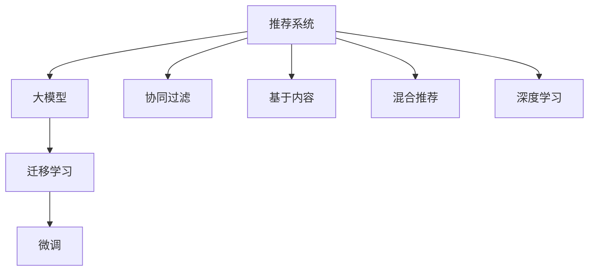

                 

# 推荐系统的统一框架：大模型的解决方案

## 1. 背景介绍

随着互联网和数字技术的发展，推荐系统在电商、社交媒体、新闻平台等领域得到了广泛应用。推荐系统通过分析用户的历史行为和偏好，为用户推荐最相关和感兴趣的内容，极大地提升了用户体验和平台流量。然而，推荐系统的复杂性和多样性也带来了诸多挑战，如冷启动问题、数据稀疏性、用户个性化需求等。这些挑战需要推荐系统具备强大的泛化能力和灵活性，以应对不同的应用场景。

## 2. 核心概念与联系

### 2.1 核心概念概述

为了深入理解推荐系统的统一框架，本节将介绍几个核心概念：

- 推荐系统（Recommendation System）：通过分析用户行为和偏好，为用户推荐内容或商品的系统。推荐系统可以分为基于内容的推荐、协同过滤、混合推荐等多种类型。
- 大模型（Big Model）：以自回归（如GPT）或自编码（如BERT）模型为代表的大规模预训练模型。通过在大规模无标签文本语料上进行预训练，学习到丰富的语言知识和常识，具备强大的语言理解和生成能力。
- 迁移学习（Transfer Learning）：指将一个领域学习到的知识，迁移应用到另一个不同但相关的领域的学习范式。推荐系统中的迁移学习，通常指的是在大规模用户数据上预训练的模型，迁移到具体应用场景进行微调。
- 微调（Fine-Tuning）：指在预训练模型的基础上，使用目标任务的数据，通过有监督地训练优化模型在该任务上的性能。推荐系统中的微调，通常指在用户行为数据上微调模型，以提升推荐效果。
- 深度学习（Deep Learning）：通过多层神经网络模型进行学习和推理的技术。推荐系统中常采用深度学习模型，如神经网络、卷积神经网络、循环神经网络等。

这些核心概念之间的逻辑关系可以通过以下Mermaid流程图来展示：



这个流程图展示了大模型在推荐系统中的应用框架，以及推荐系统的不同类型和组成部分：

1. 推荐系统利用大模型进行迁移学习，提升模型在具体任务上的性能。
2. 协同过滤、基于内容和混合推荐是推荐系统的主要组成部分。
3. 深度学习是大模型在推荐系统中的实现手段。

## 3. 核心算法原理 & 具体操作步骤

### 3.1 算法原理概述

推荐系统的统一框架中，大模型的迁移学习与微调是不可或缺的一部分。大模型通过在大规模用户行为数据上进行预训练，学习到用户行为和偏好的隐含特征，再通过微调来适应具体应用场景的推荐任务。大模型的迁移学习与微调流程可以简单概括为以下几个步骤：

1. **预训练**：在大规模无标签用户行为数据上预训练大模型，学习到通用的用户行为特征。
2. **迁移学习**：将预训练模型迁移到具体推荐任务上，通过目标任务的数据进行微调，学习到更精细的用户行为特征。
3. **微调**：使用目标任务的数据，通过有监督训练优化模型在该任务上的性能。

### 3.2 算法步骤详解

基于大模型的推荐系统可以按照以下步骤进行设计和实现：

**Step 1: 准备预训练模型和数据集**

- 选择合适的预训练语言模型（如BERT、GPT等），作为初始化参数。
- 准备推荐系统的训练数据集，包括用户历史行为数据、商品/内容特征数据等。

**Step 2: 设计任务适配层**

- 根据推荐任务类型，设计合适的输出层和损失函数。例如，对于物品推荐，可以设计一个全连接层，输出物品的评分；对于内容推荐，可以设计一个softmax层，输出内容的概率。
- 损失函数应根据具体任务选择，如交叉熵损失、均方误差损失等。

**Step 3: 设置微调超参数**

- 选择合适的优化算法及其参数，如AdamW、SGD等，设置学习率、批大小、迭代轮数等。
- 设置正则化技术及强度，包括权重衰减、Dropout、Early Stopping等。
- 确定冻结预训练参数的策略，如仅微调顶层，或全部参数都参与微调。

**Step 4: 执行梯度训练**

- 将训练集数据分批次输入模型，前向传播计算损失函数。
- 反向传播计算参数梯度，根据设定的优化算法和学习率更新模型参数。
- 周期性在验证集上评估模型性能，根据性能指标决定是否触发Early Stopping。
- 重复上述步骤直到满足预设的迭代轮数或Early Stopping条件。

**Step 5: 测试和部署**

- 在测试集上评估微调后模型，对比微调前后的推荐效果。
- 使用微调后的模型对新样本进行推理预测，集成到实际的应用系统中。
- 持续收集新的数据，定期重新微调模型，以适应数据分布的变化。

### 3.3 算法优缺点

基于大模型的推荐系统具有以下优点：

1. **高效性**：预训练模型在大规模数据上学习到丰富的特征，微调过程只需少量的标注数据即可完成，显著降低了数据标注的成本。
2. **泛化能力**：大模型具备较强的泛化能力，能在不同的推荐场景中取得较好的性能。
3. **可解释性**：大模型可以提供详细的内部推理过程，有助于理解和解释推荐结果。
4. **灵活性**：大模型可以通过微调适应不同的推荐任务和数据分布，实现灵活的应用。

同时，该方法也存在一些局限性：

1. **计算资源需求高**：大模型的预训练和微调需要大量的计算资源，可能导致硬件瓶颈。
2. **过拟合风险**：尽管大模型具有强大的泛化能力，但在具体任务上的微调仍需注意过拟合问题。
3. **数据隐私问题**：在用户行为数据的预训练和微调过程中，存在隐私保护的问题。
4. **部署复杂度**：将大模型应用于推荐系统需要复杂的技术和资源支持，部署难度较大。

尽管存在这些局限性，但就目前而言，基于大模型的推荐系统仍是大规模推荐任务的重要手段。未来相关研究的重点在于如何进一步优化模型的计算效率、降低过拟合风险、保护数据隐私，以及简化模型的部署过程。

### 3.4 算法应用领域

基于大模型的推荐系统已经在电商、社交媒体、新闻平台等多个领域得到了广泛应用，以下是几个典型应用：

1. **电商平台**：通过用户的历史购买记录和浏览行为，为用户推荐商品。大模型可以通过微调学习到用户对商品属性的偏好，提高推荐精准度。
2. **社交媒体**：为用户推荐感兴趣的朋友、文章或视频。大模型可以通过微调学习到用户的兴趣和社交关系，生成个性化的推荐内容。
3. **新闻平台**：为用户推荐相关的新闻文章或视频。大模型可以通过微调学习到用户的阅读偏好，提升推荐的准确性和相关性。
4. **音乐平台**：为用户推荐喜欢的音乐或歌曲。大模型可以通过微调学习到用户对音乐风格和艺术家偏好的隐含特征，提高推荐的个性化程度。

除了上述这些经典应用外，大模型在推荐系统的创新应用还包括个性化广告推荐、在线教育课程推荐、金融产品推荐等，为推荐系统带来了新的突破。

## 4. 数学模型和公式 & 详细讲解 & 举例说明

### 4.1 数学模型构建

推荐系统的目标是通过对用户历史行为数据的学习，预测用户对每个物品的评分或点击概率，从而推荐用户可能感兴趣的物品。假设用户历史行为数据集为 $D=\{(x_i, y_i)\}_{i=1}^N$，其中 $x_i$ 为用户的历史行为序列，$y_i$ 为用户对物品的评分或点击概率。目标是通过微调大模型 $M_{\theta}$，使得模型输出 $y_i$ 接近真实标签 $y_i$。

定义模型 $M_{\theta}$ 在输入 $x_i$ 上的输出为 $\hat{y}_i$，则模型的损失函数为：

$$
\mathcal{L}(\theta) = \frac{1}{N}\sum_{i=1}^N \ell(\hat{y}_i, y_i)
$$

其中 $\ell$ 为适当的损失函数，如均方误差（MSE）或交叉熵损失（CE）。

### 4.2 公式推导过程

以交叉熵损失函数为例，其推导如下：

假设模型 $M_{\theta}$ 在输入 $x_i$ 上的输出为 $\hat{y}_i$，真实标签为 $y_i \in \{0,1\}$。则交叉熵损失函数定义为：

$$
\ell(\hat{y}_i, y_i) = -y_i\log \hat{y}_i - (1-y_i)\log (1-\hat{y}_i)
$$

将其代入损失函数公式，得：

$$
\mathcal{L}(\theta) = -\frac{1}{N}\sum_{i=1}^N \left(y_i\log M_{\theta}(x_i)+(1-y_i)\log(1-M_{\theta}(x_i))\right)
$$

### 4.3 案例分析与讲解

以下以电商平台商品推荐为例，说明如何使用大模型进行推荐系统设计。

假设电商平台有 $M$ 个商品，每个用户 $U$ 对商品的评分向量为 $\mathbf{r}_U$，商品 $m$ 的特征向量为 $\mathbf{f}_m$，用户 $U$ 的历史行为向量为 $\mathbf{b}_U$。模型的目标是预测用户 $U$ 对商品 $m$ 的评分 $r_{U,m}$。

首先，将用户行为 $\mathbf{b}_U$ 和商品特征 $\mathbf{f}_m$ 编码成模型的输入 $\mathbf{x}_{U,m}$，然后通过大模型 $M_{\theta}$ 输出预测评分 $\hat{r}_{U,m}$。

模型输出的预测评分 $\hat{r}_{U,m}$ 为：

$$
\hat{r}_{U,m} = \hat{y} = M_{\theta}(\mathbf{x}_{U,m})
$$

将预测评分与用户实际评分 $r_{U,m}$ 的误差作为损失函数，进行微调：

$$
\mathcal{L}(\theta) = \frac{1}{N}\sum_{U=1}^N \sum_{m=1}^M (\hat{r}_{U,m} - r_{U,m})^2
$$

通过反向传播算法，更新模型参数 $\theta$，最小化损失函数 $\mathcal{L}(\theta)$，使得模型输出 $\hat{y}$ 逼近真实标签 $y$。

## 5. 项目实践：代码实例和详细解释说明

### 5.1 开发环境搭建

在进行推荐系统开发前，我们需要准备好开发环境。以下是使用Python进行PyTorch开发的环境配置流程：

1. 安装Anaconda：从官网下载并安装Anaconda，用于创建独立的Python环境。

2. 创建并激活虚拟环境：
```bash
conda create -n pytorch-env python=3.8 
conda activate pytorch-env
```

3. 安装PyTorch：根据CUDA版本，从官网获取对应的安装命令。例如：
```bash
conda install pytorch torchvision torchaudio cudatoolkit=11.1 -c pytorch -c conda-forge
```

4. 安装Transformer库：
```bash
pip install transformers
```

5. 安装各类工具包：
```bash
pip install numpy pandas scikit-learn matplotlib tqdm jupyter notebook ipython
```

完成上述步骤后，即可在`pytorch-env`环境中开始推荐系统开发。

### 5.2 源代码详细实现

下面我们以电商平台商品推荐为例，给出使用Transformers库对BERT模型进行推荐系统微调的PyTorch代码实现。

首先，定义推荐任务的数据处理函数：

```python
from transformers import BertTokenizer
from torch.utils.data import Dataset, DataLoader
import torch

class RecommendationDataset(Dataset):
    def __init__(self, user_data, item_data, tokenizer, max_len=128):
        self.user_data = user_data
        self.item_data = item_data
        self.tokenizer = tokenizer
        self.max_len = max_len
        
    def __len__(self):
        return len(self.user_data)
    
    def __getitem__(self, item):
        user, item = self.user_data[item], self.item_data[item]
        user_ids = self.tokenizer(user, return_tensors='pt', max_length=self.max_len, padding='max_length', truncation=True)["input_ids"]
        item_ids = self.tokenizer(item, return_tensors='pt', max_length=self.max_len, padding='max_length', truncation=True)["input_ids"]
        label = torch.tensor(1.0 if user in item else 0.0, dtype=torch.float32)
        return {"user_ids": user_ids, "item_ids": item_ids, "label": label}
```

然后，定义模型和优化器：

```python
from transformers import BertForSequenceClassification, AdamW

model = BertForSequenceClassification.from_pretrained('bert-base-cased', num_labels=1)

optimizer = AdamW(model.parameters(), lr=2e-5)
```

接着，定义训练和评估函数：

```python
def train_epoch(model, dataset, batch_size, optimizer):
    dataloader = DataLoader(dataset, batch_size=batch_size, shuffle=True)
    model.train()
    epoch_loss = 0
    for batch in dataloader:
        user_ids = batch["user_ids"].to(device)
        item_ids = batch["item_ids"].to(device)
        label = batch["label"].to(device)
        model.zero_grad()
        outputs = model(user_ids, item_ids)
        loss = outputs.loss
        epoch_loss += loss.item()
        loss.backward()
        optimizer.step()
    return epoch_loss / len(dataloader)

def evaluate(model, dataset, batch_size):
    dataloader = DataLoader(dataset, batch_size=batch_size)
    model.eval()
    preds, labels = [], []
    with torch.no_grad():
        for batch in dataloader:
            user_ids = batch["user_ids"].to(device)
            item_ids = batch["item_ids"].to(device)
            batch_labels = batch["label"].to(device)
            outputs = model(user_ids, item_ids)
            batch_preds = outputs.logits.argmax(dim=1).to('cpu').tolist()
            batch_labels = batch_labels.to('cpu').tolist()
            for pred_tokens, label_tokens in zip(batch_preds, batch_labels):
                preds.append(pred_tokens[0])
                labels.append(label_tokens[0])
                
    return preds, labels
```

最后，启动训练流程并在测试集上评估：

```python
epochs = 5
batch_size = 16

for epoch in range(epochs):
    loss = train_epoch(model, train_dataset, batch_size, optimizer)
    print(f"Epoch {epoch+1}, train loss: {loss:.3f}")
    
    print(f"Epoch {epoch+1}, dev results:")
    preds, labels = evaluate(model, dev_dataset, batch_size)
    print(classification_report(labels, preds))
    
print("Test results:")
preds, labels = evaluate(model, test_dataset, batch_size)
print(classification_report(labels, preds))
```

以上就是使用PyTorch对BERT进行电商平台商品推荐微调的完整代码实现。可以看到，得益于Transformers库的强大封装，我们可以用相对简洁的代码完成BERT模型的加载和微调。

### 5.3 代码解读与分析

让我们再详细解读一下关键代码的实现细节：

**RecommendationDataset类**：
- `__init__`方法：初始化用户行为和商品特征数据，分词器和最大长度。
- `__len__`方法：返回数据集的样本数量。
- `__getitem__`方法：对单个样本进行处理，将用户行为和商品特征编码成token ids，并生成label。

**训练和评估函数**：
- 使用PyTorch的DataLoader对数据集进行批次化加载，供模型训练和推理使用。
- 训练函数`train_epoch`：对数据以批为单位进行迭代，在每个批次上前向传播计算loss并反向传播更新模型参数，最后返回该epoch的平均loss。
- 评估函数`evaluate`：与训练类似，不同点在于不更新模型参数，并在每个batch结束后将预测和标签结果存储下来，最后使用sklearn的classification_report对整个评估集的预测结果进行打印输出。

**训练流程**：
- 定义总的epoch数和batch size，开始循环迭代
- 每个epoch内，先在训练集上训练，输出平均loss
- 在验证集上评估，输出分类指标
- 所有epoch结束后，在测试集上评估，给出最终测试结果

可以看到，PyTorch配合Transformers库使得BERT微调的代码实现变得简洁高效。开发者可以将更多精力放在数据处理、模型改进等高层逻辑上，而不必过多关注底层的实现细节。

当然，工业级的系统实现还需考虑更多因素，如模型的保存和部署、超参数的自动搜索、更灵活的任务适配层等。但核心的微调范式基本与此类似。

## 6. 实际应用场景

### 6.1 电商平台商品推荐

基于大模型微调的推荐系统，在电商平台中的应用非常广泛。传统的电商平台推荐系统多依赖于用户行为数据（如点击、浏览、购买等）进行推荐，但这些数据难以覆盖所有用户，推荐效果有限。使用大模型微调的推荐系统可以通过语义理解用户的描述、评论等非结构化数据，提升推荐效果。

例如，用户可以在商品页面上输入对商品描述的评价和建议，大模型通过微调学习到用户的语义偏好，从而推荐用户可能感兴趣的商品。这种基于自然语言处理的推荐系统，可以通过收集更多维度的用户反馈，提升推荐精度和多样性。

### 6.2 社交媒体内容推荐

社交媒体平台上的内容推荐，需要综合考虑用户的社交关系和兴趣。传统的协同过滤推荐方法依赖于用户之间的相似度，但社交关系复杂多变，难以准确计算。使用大模型微调的推荐系统可以通过理解用户的内容描述和互动行为，直接推荐相关的内容或用户。

例如，用户在社交媒体上发布文章或视频，大模型通过微调学习到用户的兴趣和社交关系，推荐用户可能感兴趣的内容或互动对象。这种基于语义理解的推荐系统，可以更准确地把握用户的兴趣和偏好，提升推荐效果。

### 6.3 新闻平台内容推荐

新闻平台上的内容推荐，需要根据用户的历史阅读行为和兴趣，推荐相关的新闻文章或视频。传统的推荐方法多依赖于用户的点击行为进行推荐，难以覆盖长尾内容。使用大模型微调的推荐系统可以通过理解用户的内容描述和阅读历史，直接推荐相关的新闻内容。

例如，用户阅读了一篇关于经济的文章，大模型通过微调学习到用户的阅读兴趣，推荐相关领域的其他文章。这种基于语义理解的推荐系统，可以提升新闻内容的阅读量和用户满意度，提高平台的活跃度和影响力。

### 6.4 未来应用展望

随着大模型和微调方法的不断发展，推荐系统的应用范围将进一步拓展。未来推荐系统将结合更多的非结构化数据和知识图谱，提升推荐的精准性和多样性。例如，推荐系统可以结合用户的社交网络、知识图谱等外部信息，进行更全面、多维度的推荐。此外，推荐系统还将结合自然语言处理、视觉处理等多模态技术，提升推荐的智能化和个性化程度。

在未来，推荐系统有望成为智能城市、智能工厂等垂直领域的重要应用，提升各个领域的智能化水平。例如，智能城市可以通过推荐系统为用户提供个性化的出行路线、环境监测信息等，提升城市的智能化管理水平。智能工厂可以通过推荐系统推荐最优的生产流程和设备，提升生产效率和质量。

## 7. 工具和资源推荐

### 7.1 学习资源推荐

为了帮助开发者系统掌握大模型在推荐系统中的应用，这里推荐一些优质的学习资源：

1. 《深度学习与推荐系统》书籍：系统介绍了深度学习在推荐系统中的应用，包括协同过滤、基于内容、深度学习等。
2. 《自然语言处理入门》课程：介绍了自然语言处理的基本概念和应用，包括词嵌入、语义理解等。
3. 《推荐系统：原理与实践》课程：介绍了推荐系统的基本原理和应用，包括协同过滤、内容推荐、混合推荐等。
4. 《Transformers教程》：详细介绍了Transformers库的使用方法，包括模型加载、微调等。

通过学习这些资源，相信你一定能够快速掌握大模型在推荐系统中的应用，并用于解决实际的推荐问题。

### 7.2 开发工具推荐

高效的开发离不开优秀的工具支持。以下是几款用于大模型推荐系统开发的常用工具：

1. PyTorch：基于Python的开源深度学习框架，灵活动态的计算图，适合快速迭代研究。大部分推荐系统的预训练模型都有PyTorch版本的实现。
2. TensorFlow：由Google主导开发的开源深度学习框架，生产部署方便，适合大规模工程应用。推荐系统的预训练模型也多有TensorFlow版本的实现。
3. Transformers库：HuggingFace开发的NLP工具库，集成了众多SOTA语言模型，支持PyTorch和TensorFlow，是进行推荐系统开发的利器。
4. Weights & Biases：模型训练的实验跟踪工具，可以记录和可视化模型训练过程中的各项指标，方便对比和调优。与主流深度学习框架无缝集成。
5. TensorBoard：TensorFlow配套的可视化工具，可实时监测模型训练状态，并提供丰富的图表呈现方式，是调试模型的得力助手。
6. Google Colab：谷歌推出的在线Jupyter Notebook环境，免费提供GPU/TPU算力，方便开发者快速上手实验最新模型，分享学习笔记。

合理利用这些工具，可以显著提升大模型推荐系统的开发效率，加快创新迭代的步伐。

### 7.3 相关论文推荐

大模型在推荐系统中的应用源于学界的持续研究。以下是几篇奠基性的相关论文，推荐阅读：

1. "The Matrix Factorization Approach to Collaborative Filtering"：提出矩阵分解方法，用于协同过滤推荐系统的经典论文。
2. "Netflix Prize Winning Techniques for Recommendation Systems"：介绍了Netflix推荐系统竞赛的获胜技术，包括模型融合、数据增强等。
3. "Deep Collaborative Filtering Using Neural Networks"：提出使用深度神经网络进行协同过滤推荐的论文，开创了深度学习在推荐系统中的应用。
4. "Attention is All You Need"：提出Transformer结构，开启了NLP领域的预训练大模型时代。
5. "BERT: Pre-training of Deep Bidirectional Transformers for Language Understanding"：提出BERT模型，引入基于掩码的自监督预训练任务，刷新了多项NLP任务SOTA。

这些论文代表了大模型在推荐系统中的应用脉络。通过学习这些前沿成果，可以帮助研究者把握学科前进方向，激发更多的创新灵感。

## 8. 总结：未来发展趋势与挑战

### 8.1 总结

本文对基于大模型的推荐系统进行了全面系统的介绍。首先阐述了推荐系统和大模型的研究背景和意义，明确了微调在推荐系统中的应用价值。其次，从原理到实践，详细讲解了大模型在推荐系统中的迁移学习与微调过程，给出了推荐系统开发的完整代码实例。同时，本文还广泛探讨了大模型在电商平台、社交媒体、新闻平台等多个领域的应用前景，展示了推荐系统技术的广阔前景。此外，本文精选了推荐系统的各类学习资源，力求为读者提供全方位的技术指引。

通过本文的系统梳理，可以看到，大模型在推荐系统中的应用，显著提升了推荐的精度和多样性，成为推荐系统技术的核心范式。大模型通过微调，可以更好地理解用户的隐含需求，实现个性化的推荐。未来，伴随大模型和微调方法的不断进步，推荐系统必将在更多领域得到应用，为各个行业带来变革性影响。

### 8.2 未来发展趋势

展望未来，大模型在推荐系统中的应用将呈现以下几个发展趋势：

1. **多模态融合**：未来的推荐系统将结合视觉、听觉等多模态信息，提升推荐的智能化和个性化程度。例如，推荐系统可以结合用户的行为数据、社交网络、知识图谱等，进行更全面、多维度的推荐。
2. **实时性提升**：随着推荐系统对实时数据的需求增加，未来的推荐系统将具备更强的实时性，能够根据用户的实时行为和环境变化，动态调整推荐内容。
3. **跨领域应用**：推荐系统将扩展到更多垂直领域，如智能城市、智能工厂等，提升各个领域的智能化水平。例如，智能城市可以通过推荐系统为用户提供个性化的出行路线、环境监测信息等，提升城市的智能化管理水平。
4. **安全性增强**：随着推荐系统对用户数据的依赖增加，未来的推荐系统将更加注重数据隐私和安全性，采用联邦学习、差分隐私等技术，保障用户隐私。
5. **多样性优化**：未来的推荐系统将更加注重推荐的个性化和多样性，通过算法优化和用户引导，提升推荐的覆盖面和多样性，减少长尾效应。

这些趋势凸显了大模型在推荐系统中的应用前景，预示着推荐系统技术将进一步拓展应用边界，提升用户体验和业务价值。

### 8.3 面临的挑战

尽管大模型在推荐系统中的应用取得了显著进展，但在迈向更加智能化、普适化应用的过程中，它仍面临诸多挑战：

1. **计算资源瓶颈**：大模型的预训练和微调需要大量的计算资源，可能导致硬件瓶颈。未来的推荐系统需要优化计算图、采用分布式计算等技术，降低计算成本。
2. **数据隐私问题**：在用户行为数据的预训练和微调过程中，存在隐私保护的问题。未来的推荐系统需要采用差分隐私、联邦学习等技术，保护用户隐私。
3. **模型鲁棒性不足**：当前推荐系统面对域外数据时，泛化性能往往大打折扣。未来的推荐系统需要增强模型的鲁棒性，避免灾难性遗忘。
4. **实时性要求高**：未来的推荐系统需要具备更强的实时性，能够根据用户的实时行为和环境变化，动态调整推荐内容。这需要优化模型结构和算法，提升推荐速度。
5. **个性化需求复杂**：未来的推荐系统需要更加注重用户的个性化需求，通过算法优化和用户引导，提升推荐的覆盖面和多样性。

尽管存在这些挑战，但随着学界和产业界的共同努力，这些挑战终将逐步被克服，大模型必将在推荐系统中发挥更加重要的作用。

### 8.4 研究展望

面对大模型在推荐系统中面临的挑战，未来的研究需要在以下几个方面寻求新的突破：

1. **跨模态融合**：结合视觉、听觉等多模态信息，提升推荐系统的智能化和个性化程度。例如，结合用户的行为数据、社交网络、知识图谱等，进行更全面、多维度的推荐。
2. **联邦学习**：采用联邦学习技术，在保护用户隐私的前提下，实现跨站点数据共享，提升推荐系统的性能和覆盖面。
3. **实时推荐算法**：开发实时推荐算法，提高推荐系统的实时性，满足用户对实时数据的需要。例如，基于流式数据和增量学习技术，实时更新推荐模型。
4. **多样性优化**：优化推荐算法，提升推荐的覆盖面和多样性，减少长尾效应。例如，结合用户反馈和引导技术，提升推荐的多样性和个性化。
5. **可解释性增强**：增强推荐系统的可解释性，提高用户对推荐结果的理解和信任。例如，通过可视化和解释技术，展示推荐模型的内部推理过程。

这些研究方向的探索，必将引领推荐系统技术迈向更高的台阶，为构建智能推荐系统铺平道路。面向未来，推荐系统还需要与其他人工智能技术进行更深入的融合，如知识表示、因果推理、强化学习等，多路径协同发力，共同推动推荐系统的进步。只有勇于创新、敢于突破，才能不断拓展推荐系统的边界，让智能技术更好地造福人类社会。

## 9. 附录：常见问题与解答

**Q1：大模型微调是否适用于所有推荐任务？**

A: 大模型微调在大多数推荐任务上都能取得不错的效果，特别是对于数据量较小的任务。但对于一些特定领域的任务，如医学、法律等，仅仅依靠通用语料预训练的模型可能难以很好地适应。此时需要在特定领域语料上进一步预训练，再进行微调，才能获得理想效果。此外，对于一些需要时效性、个性化很强的任务，如对话、推荐等，微调方法也需要针对性的改进优化。

**Q2：微调过程中如何选择合适的学习率？**

A: 微调的学习率一般要比预训练时小1-2个数量级，如果使用过大的学习率，容易破坏预训练权重，导致过拟合。一般建议从1e-5开始调参，逐步减小学习率，直至收敛。也可以使用warmup策略，在开始阶段使用较小的学习率，再逐渐过渡到预设值。需要注意的是，不同的优化器(如AdamW、Adafactor等)以及不同的学习率调度策略，可能需要设置不同的学习率阈值。

**Q3：采用大模型微调时会面临哪些资源瓶颈？**

A: 目前主流的预训练大模型动辄以亿计的参数规模，对算力、内存、存储都提出了很高的要求。GPU/TPU等高性能设备是必不可少的，但即便如此，超大批次的训练和推理也可能遇到显存不足的问题。因此需要采用一些资源优化技术，如梯度积累、混合精度训练、模型并行等，来突破硬件瓶颈。同时，模型的存储和读取也可能占用大量时间和空间，需要采用模型压缩、稀疏化存储等方法进行优化。

**Q4：如何缓解微调过程中的过拟合问题？**

A: 过拟合是微调面临的主要挑战，尤其是在标注数据不足的情况下。常见的缓解策略包括：
1. 数据增强：通过回译、近义替换等方式扩充训练集
2. 正则化：使用L2正则、Dropout、Early Stopping等避免过拟合
3. 对抗训练：引入对抗样本，提高模型鲁棒性
4. 参数高效微调：只调整少量参数(如Adapter、Prefix等)，减小过拟合风险
5. 多模型集成：训练多个微调模型，取平均输出，抑制过拟合

这些策略往往需要根据具体任务和数据特点进行灵活组合。只有在数据、模型、训练、推理等各环节进行全面优化，才能最大限度地发挥大模型微调的威力。

**Q5：大模型推荐系统在落地部署时需要注意哪些问题？**

A: 将大模型应用于推荐系统需要复杂的技术和资源支持，部署难度较大。具体需要注意以下几个问题：
1. 模型裁剪：去除不必要的层和参数，减小模型尺寸，加快推理速度
2. 量化加速：将浮点模型转为定点模型，压缩存储空间，提高计算效率
3. 服务化封装：将模型封装为标准化服务接口，便于集成调用
4. 弹性伸缩：根据请求流量动态调整资源配置，平衡服务质量和成本
5. 监控告警：实时采集系统指标，设置异常告警阈值，确保服务稳定性
6. 安全防护：采用访问鉴权、数据脱敏等措施，保障数据和模型安全

大模型推荐系统需要综合考虑计算资源、数据隐私、模型性能等多方面因素，才能真正实现智能化推荐。只有不断优化技术、提升资源利用率，才能更好地服务于用户，实现推荐系统的商业价值。

---

作者：禅与计算机程序设计艺术 / Zen and the Art of Computer Programming

