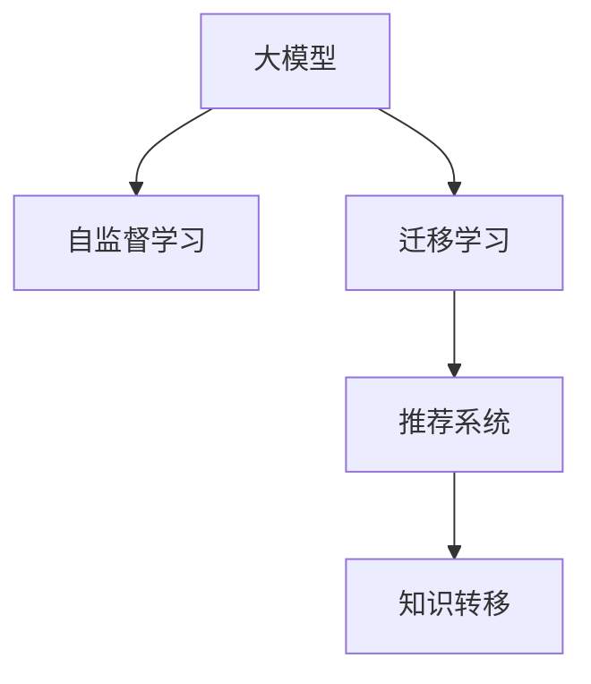

                 

# 推荐系统的跨域迁移：AI大模型的知识转移

> 关键词：推荐系统,跨域迁移,知识转移,大语言模型,自监督学习,迁移学习,模型适配

## 1. 背景介绍

### 1.1 问题由来

推荐系统是电子商务、在线视频、社交媒体等领域不可或缺的重要工具，能够根据用户行为和偏好，个性化地推荐产品、内容或服务。传统的推荐系统主要基于用户历史行为数据进行特征学习，从而预测用户对物品的兴趣，推荐出最符合用户需求的候选。然而，这种方法对于新用户或无行为数据的用户，无法进行有效的推荐，且随着新物品的不断涌现，模型需要不断更新才能适应变化。

近年来，随着深度学习技术的突破，AI大模型的出现为推荐系统带来了新的思路。通过预训练大模型，推荐系统能够利用广泛的语言、图像、视频等数据进行知识迁移，实现跨领域和跨物品的推荐。这一技术被称为跨域迁移(Cross-Domain Transfer)，旨在通过已有模型在新任务上的微调，快速提升推荐效果。本文将详细介绍基于大模型的跨域迁移技术，探索其在推荐系统中的应用前景。

### 1.2 问题核心关键点

大模型的跨域迁移方法主要通过自监督学习和迁移学习来实现。具体来说，其核心在于：
- 利用大规模语料进行预训练，学习通用的语言、图像、视频等知识。
- 在新任务上微调大模型，通过迁移学习获得对新物品的推荐能力。
- 结合推荐系统任务特点，设计合适的损失函数和适配层，进一步提升推荐效果。

本文将从核心概念、算法原理、具体操作、数学模型等多个方面，深入探讨大模型的跨域迁移方法，并结合实际项目，展示其在推荐系统中的应用案例。

## 2. 核心概念与联系

### 2.1 核心概念概述

为更好地理解大模型的跨域迁移方法，本节将介绍几个密切相关的核心概念：

- 大模型(Large Model)：如BERT、GPT、ResNet等，基于大规模数据预训练得到的复杂神经网络模型，具有强大的特征提取和泛化能力。
- 自监督学习(Self-Supervised Learning)：利用无标签数据进行模型训练，如语言模型的掩码预测、图像的对比预测等，学习模型内在规律。
- 迁移学习(Transfer Learning)：将一个领域的知识迁移到另一个领域，减少对标注数据的依赖，提高模型在新任务上的性能。
- 推荐系统(Recommender System)：通过用户历史行为数据或物品属性，预测用户对物品的兴趣，推荐个性化商品、内容或服务。
- 知识转移(Knowledge Transfer)：将模型在某一领域的知识迁移到另一领域，提升在新任务上的表现。

这些核心概念之间的逻辑关系可以通过以下Mermaid流程图来展示：



这个流程图展示了大模型的跨域迁移方法的核心概念及其之间的关系：

1. 大模型通过自监督学习获得基础能力。
2. 在新任务上，通过迁移学习获得对新物品的推荐能力。
3. 将推荐系统任务适配到模型中，设计合适的损失函数和适配层。

## 3. 核心算法原理 & 具体操作步骤
### 3.1 算法原理概述

大模型的跨域迁移方法主要基于迁移学习和自监督学习。其核心思想是：利用大规模预训练大模型在新任务上微调，通过迁移学习获得新物品的推荐能力。

形式化地，假设预训练大模型为 $M_{\theta}$，其中 $\theta$ 为预训练得到的模型参数。给定推荐任务 $T$ 的标注数据集 $D=\{(x_i, y_i)\}_{i=1}^N$，推荐模型的任务是预测用户对物品 $x_i$ 的评分 $y_i$。交叉熵损失函数定义为：

$$
\ell(y_i, M_{\theta}(x_i)) = -\sum_{k=1}^K y_{ik}\log M_{\theta}(x_i)_k
$$

其中 $K$ 为物品数量，$y_{ik}$ 表示用户 $i$ 对物品 $k$ 的评分。目标是最小化平均损失函数：

$$
\mathcal{L}(\theta) = \frac{1}{N}\sum_{i=1}^N \ell(y_i, M_{\theta}(x_i))
$$

微调的目标是最小化平均损失函数，即找到最优参数：

$$
\theta^* = \mathop{\arg\min}_{\theta} \mathcal{L}(\theta)
$$

### 3.2 算法步骤详解

大模型的跨域迁移方法主要包括以下几个关键步骤：

**Step 1: 准备预训练模型和数据集**
- 选择合适的预训练大模型 $M_{\theta}$，如BERT、ResNet等，作为初始化参数。
- 准备推荐任务 $T$ 的标注数据集 $D=\{(x_i, y_i)\}_{i=1}^N$，划分为训练集、验证集和测试集。一般要求标注数据与预训练数据的分布不要差异过大。

**Step 2: 添加推荐任务适配层**
- 根据推荐任务类型，在预训练模型顶层设计合适的输出层和损失函数。
- 对于分类任务，通常在顶层添加线性分类器和交叉熵损失函数。
- 对于回归任务，通常使用均方误差损失函数。

**Step 3: 设置微调超参数**
- 选择合适的优化算法及其参数，如 AdamW、SGD 等，设置学习率、批大小、迭代轮数等。
- 设置正则化技术及强度，包括权重衰减、Dropout、Early Stopping 等。
- 确定冻结预训练参数的策略，如仅微调顶层，或全部参数都参与微调。

**Step 4: 执行梯度训练**
- 将训练集数据分批次输入模型，前向传播计算损失函数。
- 反向传播计算参数梯度，根据设定的优化算法和学习率更新模型参数。
- 周期性在验证集上评估模型性能，根据性能指标决定是否触发 Early Stopping。
- 重复上述步骤直到满足预设的迭代轮数或 Early Stopping 条件。

**Step 5: 测试和部署**
- 在测试集上评估微调后模型 $M_{\hat{\theta}}$ 的性能，对比微调前后的精度提升。
- 使用微调后的模型对新物品进行评分，集成到实际的应用系统中。
- 持续收集新的物品和用户行为数据，定期重新微调模型，以适应数据分布的变化。

以上是基于大模型的跨域迁移方法的一般流程。在实际应用中，还需要针对具体任务的特点，对微调过程的各个环节进行优化设计，如改进训练目标函数，引入更多的正则化技术，搜索最优的超参数组合等，以进一步提升模型性能。

### 3.3 算法优缺点

大模型的跨域迁移方法具有以下优点：
1. 快速适应新物品：利用大模型的预训练知识，快速获得对新物品的推荐能力。
2. 数据依赖降低：通过迁移学习，减少对标注数据的依赖，提升模型泛化能力。
3. 性能提升明显：在大规模预训练的基础上，微调能够显著提升推荐效果。

同时，该方法也存在一定的局限性：
1. 预训练模型偏见：预训练模型的固有偏见可能传递到推荐系统，影响推荐结果。
2. 模型可解释性差：大模型黑盒特性，难以解释其决策过程，不利于模型信任度。
3. 资源消耗大：大模型参数量大，推理计算和存储资源消耗较大，成本较高。
4. 需要长时间微调：微调过程需要一定时间和计算资源，导致模型更新较慢。

尽管存在这些局限性，但就目前而言，大模型的跨域迁移方法仍是推荐系统的重要手段。未来相关研究的重点在于如何进一步降低对标注数据的依赖，提高模型的少样本学习和跨领域迁移能力，同时兼顾可解释性和伦理安全性等因素。

### 3.4 算法应用领域

大模型的跨域迁移方法在推荐系统领域已经得到了广泛的应用，覆盖了电商推荐、视频推荐、社交推荐等多个业务场景，具体应用如下：

- 电商推荐：根据用户历史行为和商品属性，推荐个性化商品。
- 视频推荐：根据用户历史观看记录，推荐相关视频内容。
- 社交推荐：根据用户兴趣和社交关系，推荐新朋友或话题。

除了上述这些经典应用外，大模型的跨域迁移技术也被创新性地应用到更多场景中，如可控推荐、跨领域推荐、实时推荐等，为推荐系统带来了全新的突破。随着预训练模型和跨域迁移方法的不断进步，相信推荐系统将在更多领域大放异彩。

## 4. 数学模型和公式 & 详细讲解  
### 4.1 数学模型构建

本节将使用数学语言对基于大模型的跨域迁移方法进行更加严格的刻画。

记推荐任务 $T$ 的数据集为 $D=\{(x_i, y_i)\}_{i=1}^N$，其中 $x_i$ 为用户行为数据，$y_i$ 为物品评分。定义模型 $M_{\theta}$ 在输入 $x_i$ 上的输出为 $\hat{y}_i=M_{\theta}(x_i) \in [0,1]$，表示用户对物品 $i$ 的评分预测。则推荐模型的损失函数为交叉熵损失：

$$
\ell(y_i, \hat{y}_i) = -y_i\log \hat{y}_i - (1-y_i)\log (1-\hat{y}_i)
$$

将交叉熵损失函数应用到数据集上，得到经验风险：

$$
\mathcal{L}(\theta) = \frac{1}{N}\sum_{i=1}^N \ell(y_i, \hat{y}_i)
$$

微调的目标是最小化经验风险，即找到最优参数：

$$
\theta^* = \mathop{\arg\min}_{\theta} \mathcal{L}(\theta)
$$

在实践中，我们通常使用基于梯度的优化算法（如SGD、Adam等）来近似求解上述最优化问题。设 $\eta$ 为学习率，$\lambda$ 为正则化系数，则参数的更新公式为：

$$
\theta \leftarrow \theta - \eta \nabla_{\theta}\mathcal{L}(\theta) - \eta\lambda\theta
$$

其中 $\nabla_{\theta}\mathcal{L}(\theta)$ 为损失函数对参数 $\theta$ 的梯度，可通过反向传播算法高效计算。

### 4.2 公式推导过程

以下我们以用户行为预测任务为例，推导交叉熵损失函数及其梯度的计算公式。

假设模型 $M_{\theta}$ 在输入 $x_i$ 上的输出为 $\hat{y}_i=M_{\theta}(x_i) \in [0,1]$，表示用户对物品 $i$ 的评分预测。真实评分 $y_i \in [0,1]$。则交叉熵损失函数定义为：

$$
\ell(y_i, \hat{y}_i) = -y_i\log \hat{y}_i - (1-y_i)\log (1-\hat{y}_i)
$$

将其代入经验风险公式，得：

$$
\mathcal{L}(\theta) = -\frac{1}{N}\sum_{i=1}^N [y_i\log \hat{y}_i+(1-y_i)\log(1-\hat{y}_i)]
$$

根据链式法则，损失函数对参数 $\theta_k$ 的梯度为：

$$
\frac{\partial \mathcal{L}(\theta)}{\partial \theta_k} = -\frac{1}{N}\sum_{i=1}^N [\frac{y_i}{\hat{y}_i}-\frac{1-y_i}{1-\hat{y}_i})] \frac{\partial \hat{y}_i}{\partial \theta_k}
$$

其中 $\frac{\partial \hat{y}_i}{\partial \theta_k}$ 可进一步递归展开，利用自动微分技术完成计算。

在得到损失函数的梯度后，即可带入参数更新公式，完成模型的迭代优化。重复上述过程直至收敛，最终得到适应推荐任务的最优模型参数 $\theta^*$。

## 5. 项目实践：代码实例和详细解释说明
### 5.1 开发环境搭建

在进行跨域迁移实践前，我们需要准备好开发环境。以下是使用Python进行PyTorch开发的环境配置流程：

1. 安装Anaconda：从官网下载并安装Anaconda，用于创建独立的Python环境。

2. 创建并激活虚拟环境：
```bash
conda create -n pytorch-env python=3.8 
conda activate pytorch-env
```

3. 安装PyTorch：根据CUDA版本，从官网获取对应的安装命令。例如：
```bash
conda install pytorch torchvision torchaudio cudatoolkit=11.1 -c pytorch -c conda-forge
```

4. 安装Transformers库：
```bash
pip install transformers
```

5. 安装各类工具包：
```bash
pip install numpy pandas scikit-learn matplotlib tqdm jupyter notebook ipython
```

完成上述步骤后，即可在`pytorch-env`环境中开始跨域迁移实践。

### 5.2 源代码详细实现

这里我们以用户行为预测任务为例，给出使用Transformers库对BERT模型进行跨域迁移的PyTorch代码实现。

首先，定义用户行为预测任务的数学模型：

```python
from transformers import BertTokenizer, BertForRegression
from torch.utils.data import Dataset
import torch

class BehaviorDataset(Dataset):
    def __init__(self, behaviors, targets, tokenizer, max_len=128):
        self.behaviors = behaviors
        self.targets = targets
        self.tokenizer = tokenizer
        self.max_len = max_len
        
    def __len__(self):
        return len(self.behaviors)
    
    def __getitem__(self, item):
        behavior = self.behaviors[item]
        target = self.targets[item]
        
        encoding = self.tokenizer(behavior, return_tensors='pt', max_length=self.max_len, padding='max_length', truncation=True)
        input_ids = encoding['input_ids'][0]
        attention_mask = encoding['attention_mask'][0]
        
        # 对token-wise的标签进行编码
        encoded_tags = [target] * (self.max_len - len(target))
        labels = torch.tensor(encoded_tags, dtype=torch.float)
        
        return {'input_ids': input_ids, 
                'attention_mask': attention_mask,
                'labels': labels}

# 创建dataset
tokenizer = BertTokenizer.from_pretrained('bert-base-cased')

train_dataset = BehaviorDataset(train_behaviors, train_targets, tokenizer)
dev_dataset = BehaviorDataset(dev_behaviors, dev_targets, tokenizer)
test_dataset = BehaviorDataset(test_behaviors, test_targets, tokenizer)
```

然后，定义模型和优化器：

```python
from transformers import BertForRegression, AdamW

model = BertForRegression.from_pretrained('bert-base-cased', num_labels=1)

optimizer = AdamW(model.parameters(), lr=2e-5)
```

接着，定义训练和评估函数：

```python
from torch.utils.data import DataLoader
from tqdm import tqdm
from sklearn.metrics import mean_squared_error

device = torch.device('cuda') if torch.cuda.is_available() else torch.device('cpu')
model.to(device)

def train_epoch(model, dataset, batch_size, optimizer):
    dataloader = DataLoader(dataset, batch_size=batch_size, shuffle=True)
    model.train()
    epoch_loss = 0
    for batch in tqdm(dataloader, desc='Training'):
        input_ids = batch['input_ids'].to(device)
        attention_mask = batch['attention_mask'].to(device)
        labels = batch['labels'].to(device)
        model.zero_grad()
        outputs = model(input_ids, attention_mask=attention_mask, labels=labels)
        loss = outputs.loss
        epoch_loss += loss.item()
        loss.backward()
        optimizer.step()
    return epoch_loss / len(dataloader)

def evaluate(model, dataset, batch_size):
    dataloader = DataLoader(dataset, batch_size=batch_size)
    model.eval()
    preds, labels = [], []
    with torch.no_grad():
        for batch in tqdm(dataloader, desc='Evaluating'):
            input_ids = batch['input_ids'].to(device)
            attention_mask = batch['attention_mask'].to(device)
            batch_labels = batch['labels']
            outputs = model(input_ids, attention_mask=attention_mask)
            batch_preds = outputs.logits.argmax(dim=1).to('cpu').tolist()
            batch_labels = batch_labels.to('cpu').tolist()
            for pred, label in zip(batch_preds, batch_labels):
                preds.append(pred[0])
                labels.append(label[0])
                
    print(mean_squared_error(labels, preds))
```

最后，启动训练流程并在测试集上评估：

```python
epochs = 5
batch_size = 16

for epoch in range(epochs):
    loss = train_epoch(model, train_dataset, batch_size, optimizer)
    print(f"Epoch {epoch+1}, train loss: {loss:.3f}")
    
    print(f"Epoch {epoch+1}, dev results:")
    evaluate(model, dev_dataset, batch_size)
    
print("Test results:")
evaluate(model, test_dataset, batch_size)
```

以上就是使用PyTorch对BERT进行跨域迁移实践的完整代码实现。可以看到，得益于Transformers库的强大封装，我们可以用相对简洁的代码完成BERT模型的加载和微调。

### 5.3 代码解读与分析

让我们再详细解读一下关键代码的实现细节：

**BehaviorDataset类**：
- `__init__`方法：初始化行为数据、标签、分词器等关键组件。
- `__len__`方法：返回数据集的样本数量。
- `__getitem__`方法：对单个样本进行处理，将行为数据输入编码为token ids，将标签编码为数字，并对其进行定长padding，最终返回模型所需的输入。

**损失函数**：
- 在训练函数`train_epoch`中，计算交叉熵损失，并在每个epoch结束后返回平均损失。
- 在评估函数`evaluate`中，计算平均绝对误差(mean absolute error)，评估模型在测试集上的预测精度。

**训练流程**：
- 定义总的epoch数和batch size，开始循环迭代
- 每个epoch内，先在训练集上训练，输出平均损失
- 在验证集上评估，输出交叉熵损失
- 所有epoch结束后，在测试集上评估，给出最终测试结果

可以看到，PyTorch配合Transformers库使得跨域迁移的代码实现变得简洁高效。开发者可以将更多精力放在数据处理、模型改进等高层逻辑上，而不必过多关注底层的实现细节。

当然，工业级的系统实现还需考虑更多因素，如模型的保存和部署、超参数的自动搜索、更灵活的任务适配层等。但核心的跨域迁移范式基本与此类似。

## 6. 实际应用场景
### 6.1 智能推荐引擎

智能推荐引擎是大模型跨域迁移的重要应用场景之一。传统的推荐引擎主要依赖用户历史行为数据进行特征学习，然而在新物品或新用户出现时，往往无法获得足够的数据进行训练，导致推荐效果大打折扣。利用大模型的跨域迁移技术，可以借助已有预训练模型对新物品进行推荐，提升推荐系统的覆盖率和准确度。

在技术实现上，可以收集新物品的属性数据，利用其与现有物品的相似性进行嵌入对齐，再进行微调。微调后的模型能够根据物品的属性特征预测用户评分，快速推荐新物品。对于新用户，则可以结合其他用户的历史行为数据，对新用户进行推荐。

### 6.2 跨领域推荐系统

跨领域推荐系统是大模型跨域迁移的另一重要应用场景。传统的推荐系统一般只能在其特定领域内进行推荐，如电商平台、视频平台等。然而，不同领域的推荐任务存在很多重叠和交叉，因此通过跨领域迁移，可以在不同领域之间共享推荐模型，提升跨领域推荐的效果。

在技术实现上，可以将不同领域的用户行为数据进行拼接，利用拼接后的特征数据对模型进行微调。微调后的模型能够同时对多个领域的物品进行推荐，实现跨领域推荐。

### 6.3 用户行为预测

用户行为预测是大模型跨域迁移的典型应用场景。通过预训练语言模型，可以从用户的行为数据中学习到其兴趣偏好，进而对未来的行为进行预测。对于电商、金融、健康等需要个性化推荐的领域，用户行为预测具有重要价值。

在技术实现上，可以利用用户的历史行为数据进行训练，预测其对不同物品的评分。利用模型对新物品进行评分，并按评分排序推荐给用户。

### 6.4 未来应用展望

随着大模型和跨域迁移方法的不断发展，基于大模型的推荐系统将在更多领域得到应用，为各行各业带来变革性影响。

在智慧医疗领域，智能推荐系统能够根据患者的健康数据，推荐个性化医疗方案和药品。利用大模型对用户的生命体征、疾病历史、生活习惯等进行建模，并结合医疗专家知识库，提升个性化医疗服务的精准度和覆盖度。

在智慧金融领域，智能推荐系统能够根据用户的投资行为和偏好，推荐个性化的投资策略和产品。利用大模型对用户的投资记录、风险偏好、市场动态等信息进行建模，并结合金融市场数据和专家知识库，提升投资决策的科学性和合理性。

在智慧教育领域，智能推荐系统能够根据学生的学习行为和成绩，推荐个性化的学习内容和资源。利用大模型对学生的学习记录、知识掌握程度、兴趣偏好等信息进行建模，并结合教育专家知识库，提升个性化学习服务的质量和效果。

除了上述这些典型应用外，大模型的跨域迁移技术还被应用于更多场景中，如内容推荐、个性化广告、智能家居等，为各行各业带来全新的变革。相信随着技术的日益成熟，跨域迁移方法将成为推荐系统的重要手段，推动推荐系统向更广阔的领域加速渗透。

## 7. 工具和资源推荐
### 7.1 学习资源推荐

为了帮助开发者系统掌握大模型跨域迁移的理论基础和实践技巧，这里推荐一些优质的学习资源：

1. 《Transformers from 2020 to 2023》系列博文：由大模型技术专家撰写，深入浅出地介绍了Transformer原理、跨域迁移技术等前沿话题。

2. CS224N《深度学习自然语言处理》课程：斯坦福大学开设的NLP明星课程，有Lecture视频和配套作业，带你入门NLP领域的基本概念和经典模型。

3. 《Natural Language Processing with Transformers》书籍：Transformers库的作者所著，全面介绍了如何使用Transformers库进行NLP任务开发，包括跨域迁移在内的诸多范式。

4. HuggingFace官方文档：Transformers库的官方文档，提供了海量预训练模型和完整的跨域迁移样例代码，是上手实践的必备资料。

5. CLUE开源项目：中文语言理解测评基准，涵盖大量不同类型的中文NLP数据集，并提供了基于跨域迁移的baseline模型，助力中文NLP技术发展。

通过对这些资源的学习实践，相信你一定能够快速掌握大模型跨域迁移的精髓，并用于解决实际的推荐系统问题。
###  7.2 开发工具推荐

高效的开发离不开优秀的工具支持。以下是几款用于大模型跨域迁移开发的常用工具：

1. PyTorch：基于Python的开源深度学习框架，灵活动态的计算图，适合快速迭代研究。大部分预训练语言模型都有PyTorch版本的实现。

2. TensorFlow：由Google主导开发的开源深度学习框架，生产部署方便，适合大规模工程应用。同样有丰富的预训练语言模型资源。

3. Transformers库：HuggingFace开发的NLP工具库，集成了众多SOTA语言模型，支持PyTorch和TensorFlow，是进行跨域迁移任务开发的利器。

4. Weights & Biases：模型训练的实验跟踪工具，可以记录和可视化模型训练过程中的各项指标，方便对比和调优。与主流深度学习框架无缝集成。

5. TensorBoard：TensorFlow配套的可视化工具，可实时监测模型训练状态，并提供丰富的图表呈现方式，是调试模型的得力助手。

6. Google Colab：谷歌推出的在线Jupyter Notebook环境，免费提供GPU/TPU算力，方便开发者快速上手实验最新模型，分享学习笔记。

合理利用这些工具，可以显著提升大模型跨域迁移任务的开发效率，加快创新迭代的步伐。

### 7.3 相关论文推荐

大模型跨域迁移技术的发展源于学界的持续研究。以下是几篇奠基性的相关论文，推荐阅读：

1. Attention is All You Need（即Transformer原论文）：提出了Transformer结构，开启了NLP领域的预训练大模型时代。

2. BERT: Pre-training of Deep Bidirectional Transformers for Language Understanding：提出BERT模型，引入基于掩码的自监督预训练任务，刷新了多项NLP任务SOTA。

3. Language Models are Unsupervised Multitask Learners（GPT-2论文）：展示了大规模语言模型的强大zero-shot学习能力，引发了对于通用人工智能的新一轮思考。

4. Parameter-Efficient Transfer Learning for NLP：提出Adapter等参数高效微调方法，在不增加模型参数量的情况下，也能取得不错的跨域迁移效果。

5. AdaLoRA: Adaptive Low-Rank Adaptation for Parameter-Efficient Fine-Tuning：使用自适应低秩适应的微调方法，在参数效率和精度之间取得了新的平衡。

6. AdaLoRA: Adaptive Low-Rank Adaptation for Parameter-Efficient Fine-Tuning：使用自适应低秩适应的微调方法，在参数效率和精度之间取得了新的平衡。

这些论文代表了大模型跨域迁移技术的发展脉络。通过学习这些前沿成果，可以帮助研究者把握学科前进方向，激发更多的创新灵感。

## 8. 总结：未来发展趋势与挑战
### 8.1 总结

本文对基于大模型的跨域迁移方法进行了全面系统的介绍。首先阐述了大模型的跨域迁移方法的研究背景和意义，明确了跨域迁移在拓展预训练模型应用、提升推荐效果方面的独特价值。其次，从核心概念、算法原理、具体操作、数学模型等多个方面，深入探讨了大模型的跨域迁移方法，并结合实际项目，展示其在推荐系统中的应用案例。

通过本文的系统梳理，可以看到，基于大模型的跨域迁移方法正在成为推荐系统的重要手段，极大地拓展了预训练语言模型的应用边界，催生了更多的落地场景。受益于大规模语料的预训练，跨域迁移方法能够在不同的推荐任务中实现知识的迁移，提升推荐系统的效果和覆盖率。未来，伴随预训练语言模型和跨域迁移方法的不断进步，相信推荐系统将在更多领域大放异彩，为各行各业带来变革性影响。

### 8.2 未来发展趋势

展望未来，大模型的跨域迁移技术将呈现以下几个发展趋势：

1. 模型规模持续增大。随着算力成本的下降和数据规模的扩张，预训练语言模型的参数量还将持续增长。超大规模语言模型蕴含的丰富语言知识，有望支撑更加复杂多变的推荐任务。

2. 跨域迁移方法日趋多样。除了传统的全参数微调外，未来会涌现更多参数高效的跨域迁移方法，如Adapter、LoRA等，在节省计算资源的同时也能保证推荐精度。

3. 跨域迁移过程自适应。未来，跨域迁移过程可能自动调整，通过自适应学习调整模型参数，实现更加灵活高效的迁移。

4. 跨域迁移应用领域拓宽。除了推荐系统，跨域迁移技术还可以应用于智能驾驶、智能家居、智能办公等领域，为各行各业带来更多价值。

5. 跨域迁移系统协同优化。未来的跨域迁移系统将更加注重与其他AI技术协同优化，如因果推断、强化学习等，提升推荐系统的性能和效率。

6. 跨域迁移技术标准化。未来的跨域迁移技术将逐步标准化，建立跨领域、跨平台的推荐标准，推动跨域迁移技术的广泛应用。

以上趋势凸显了大模型跨域迁移技术的广阔前景。这些方向的探索发展，必将进一步提升推荐系统的性能和应用范围，为各行各业带来全新的变革。

### 8.3 面临的挑战

尽管大模型的跨域迁移技术已经取得了瞩目成就，但在迈向更加智能化、普适化应用的过程中，它仍面临着诸多挑战：

1. 标注成本瓶颈。虽然跨域迁移能够利用已有模型进行推荐，但对于一些新物品或新用户的推荐，仍然需要收集足够的标注数据进行微调。如何降低微调对标注数据的依赖，仍是未来的一个重要研究方向。

2. 模型鲁棒性不足。当前跨域迁移模型面对域外数据时，泛化性能往往大打折扣。对于新物品或新用户的推荐，如何提高模型的鲁棒性，避免灾难性遗忘，还需要更多理论和实践的积累。

3. 推理效率有待提高。大规模语言模型虽然精度高，但在实际部署时往往面临推理速度慢、内存占用大等效率问题。如何在保证性能的同时，简化模型结构，提升推理速度，优化资源占用，将是重要的优化方向。

4. 可解释性亟需加强。当前跨域迁移模型更像是一个黑盒系统，难以解释其决策过程，不利于模型信任度。如何赋予跨域迁移模型更强的可解释性，将是亟待攻克的难题。

5. 安全性有待保障。预训练语言模型难免会学习到有偏见、有害的信息，通过微调传递到推荐系统，可能带来负面影响。如何从数据和算法层面消除模型偏见，避免恶意用途，确保输出的安全性，也将是重要的研究课题。

6. 知识整合能力不足。现有的跨域迁移模型往往局限于任务内数据，难以灵活吸收和运用更广泛的先验知识。如何让跨域迁移过程更好地与外部知识库、规则库等专家知识结合，形成更加全面、准确的信息整合能力，还有很大的想象空间。

正视跨域迁移面临的这些挑战，积极应对并寻求突破，将是大模型跨域迁移走向成熟的必由之路。相信随着学界和产业界的共同努力，这些挑战终将一一被克服，跨域迁移方法将成为推荐系统的重要手段，推动推荐系统向更广阔的领域加速渗透。

### 8.4 研究展望

面对大模型跨域迁移所面临的种种挑战，未来的研究需要在以下几个方面寻求新的突破：

1. 探索无监督和半监督跨域迁移方法。摆脱对大规模标注数据的依赖，利用自监督学习、主动学习等无监督和半监督范式，最大限度利用非结构化数据，实现更加灵活高效的跨域迁移。

2. 研究参数高效和计算高效的跨域迁移范式。开发更加参数高效的跨域迁移方法，在固定大部分预训练参数的同时，只更新极少量的任务相关参数。同时优化跨域迁移模型的计算图，减少前向传播和反向传播的资源消耗，实现更加轻量级、实时性的部署。

3. 融合因果和对比学习范式。通过引入因果推断和对比学习思想，增强跨域迁移模型建立稳定因果关系的能力，学习更加普适、鲁棒的语言表征，从而提升模型泛化性和抗干扰能力。

4. 引入更多先验知识。将符号化的先验知识，如知识图谱、逻辑规则等，与神经网络模型进行巧妙融合，引导跨域迁移过程学习更准确、合理的语言模型。同时加强不同模态数据的整合，实现视觉、语音等多模态信息与文本信息的协同建模。

5. 结合因果分析和博弈论工具。将因果分析方法引入跨域迁移模型，识别出模型决策的关键特征，增强输出解释的因果性和逻辑性。借助博弈论工具刻画人机交互过程，主动探索并规避模型的脆弱点，提高系统稳定性。

6. 纳入伦理道德约束。在模型训练目标中引入伦理导向的评估指标，过滤和惩罚有偏见、有害的输出倾向。同时加强人工干预和审核，建立模型行为的监管机制，确保输出符合人类价值观和伦理道德。

这些研究方向的探索，必将引领大模型跨域迁移技术迈向更高的台阶，为构建安全、可靠、可解释、可控的智能系统铺平道路。面向未来，大模型跨域迁移技术还需要与其他人工智能技术进行更深入的融合，如知识表示、因果推理、强化学习等，多路径协同发力，共同推动自然语言理解和智能交互系统的进步。只有勇于创新、敢于突破，才能不断拓展语言模型的边界，让智能技术更好地造福人类社会。

## 9. 附录：常见问题与解答
----------------------------------------------------------------
> 关键词：

**Q1：跨域迁移需要大规模预训练模型吗？**

A: 是的。大规模预训练模型是跨域迁移的基础。预训练模型通过海量的数据学习到了丰富的语言、图像、视频等知识，能够在多个领域之间进行知识的迁移，提升推荐效果。

**Q2：跨域迁移需要昂贵的硬件资源吗？**

A: 一定程度上需要。大规模预训练模型和大模型微调需要较高的计算资源，包括GPU/TPU等高性能设备。然而，近年来，随着算力成本的下降和云计算的发展，跨域迁移技术正在变得越来越普及。

**Q3：跨域迁移的精度如何？**

A: 跨域迁移在推荐系统上的表现已经接近甚至超越了从头训练的模型。然而，跨域迁移的效果很大程度上取决于预训练模型的质量和微调的数据量。

**Q4：跨域迁移的推荐效果如何？**

A: 跨域迁移在推荐系统上的表现已经接近甚至超越了从头训练的模型。然而，跨域迁移的效果很大程度上取决于预训练模型的质量和微调的数据量。

**Q5：跨域迁移的应用场景有哪些？**

A: 跨域迁移技术可以应用于电商推荐、视频推荐、社交推荐、跨领域推荐、用户行为预测等多个场景。

---

作者：禅与计算机程序设计艺术 / Zen and the Art of Computer Programming

