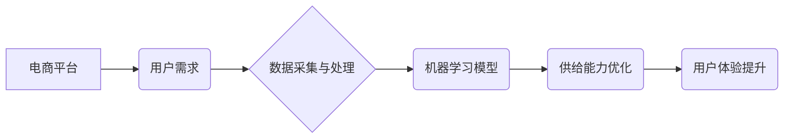

> 电商平台,供给能力,人工智能,推荐系统,预测模型,机器学习,深度学习,自然语言处理

## 1. 背景介绍

随着电商平台的蓬勃发展，供给能力的提升已成为决定平台竞争力的关键因素之一。传统电商平台依靠人工干预和规则配置来管理商品供应，效率低下，难以满足用户日益增长的个性化需求。而人工智能技术凭借其强大的数据处理和学习能力，为电商平台供给能力的提升提供了新的思路和解决方案。

## 2. 核心概念与联系

**2.1 核心概念**

* **供给能力:** 指电商平台能够提供商品数量、种类和质量的能力，直接影响平台的交易规模和用户体验。
* **人工智能 (AI):**  模拟人类智能的计算机系统，能够通过学习和推理来解决复杂问题。
* **机器学习 (ML):**  人工智能的一个子领域，通过算法训练模型，使模型能够从数据中学习并做出预测或决策。
* **深度学习 (DL):**  机器学习的一个子领域，使用多层神经网络来模拟人类大脑的学习过程，能够处理更复杂的数据和任务。

**2.2 架构关系**



**2.3 核心联系**

电商平台通过收集用户行为数据、商品信息等数据，利用机器学习模型进行分析和预测，从而优化商品供应链、推荐商品、预测需求等环节，最终提升平台的供给能力，提升用户体验。

## 3. 核心算法原理 & 具体操作步骤

**3.1 算法原理概述**

在电商平台供给能力提升中，常用的机器学习算法包括：

* **协同过滤:**  根据用户的历史购买行为和商品评分数据，推荐用户可能感兴趣的商品。
* **内容过滤:**  根据商品的属性和描述信息，推荐与用户兴趣相符的商品。
* **基于规则的推荐:**  根据预先设定的规则，推荐商品。
* **深度学习推荐:**  利用深度神经网络，学习用户和商品之间的复杂关系，进行更精准的推荐。

**3.2 算法步骤详解**

以协同过滤算法为例，其具体操作步骤如下：

1. **数据收集:** 收集用户购买历史数据、商品属性数据等。
2. **数据预处理:** 对数据进行清洗、转换、特征提取等操作。
3. **模型训练:** 使用协同过滤算法训练模型，学习用户和商品之间的关系。
4. **模型评估:** 使用测试数据评估模型的性能，例如准确率、召回率等。
5. **模型部署:** 将训练好的模型部署到线上环境，进行商品推荐。

**3.3 算法优缺点**

* **协同过滤:** 优点: 可以发现用户之间的隐性关系，推荐个性化商品。缺点: 数据稀疏性问题，冷启动问题。
* **内容过滤:** 优点: 可以根据商品属性进行精准推荐。缺点: 难以捕捉用户隐性需求。
* **基于规则的推荐:** 优点: 易于理解和实现。缺点: 规则难以覆盖所有场景，缺乏灵活性。
* **深度学习推荐:** 优点: 可以学习用户和商品之间的复杂关系，推荐更精准的商品。缺点: 需要大量数据训练，模型复杂度高。

**3.4 算法应用领域**

* 商品推荐
* 需求预测
* 库存管理
* 价格优化
* 个性化营销

## 4. 数学模型和公式 & 详细讲解 & 举例说明

**4.1 数学模型构建**

协同过滤算法的核心是构建用户-商品评分矩阵，其中每个元素表示用户对商品的评分。

**4.2 公式推导过程**

协同过滤算法常用的公式包括：

* **余弦相似度:** 用于计算用户之间的相似度。

$$
\text{相似度} = \frac{\mathbf{u} \cdot \mathbf{v}}{\|\mathbf{u}\| \|\mathbf{v}\| }
$$

其中，$\mathbf{u}$ 和 $\mathbf{v}$ 是两个用户的评分向量，$\cdot$ 表示点积，$\|\mathbf{u}\|$ 和 $\|\mathbf{v}\|$ 表示向量的模长。

* **预测评分:**  使用用户相似度和已知评分数据预测用户对商品的评分。

$$
\hat{r}_{u,i} = \frac{\sum_{v \in N(u)} \frac{sim(u,v)}{\|N(u)\|} r_{v,i}}{\sum_{v \in N(u)} \frac{sim(u,v)}{\|N(u)\|} }
$$

其中，$\hat{r}_{u,i}$ 是预测用户 $u$ 对商品 $i$ 的评分，$r_{v,i}$ 是用户 $v$ 对商品 $i$ 的评分，$N(u)$ 是用户 $u$ 的邻居用户集合，$sim(u,v)$ 是用户 $u$ 和 $v$ 的相似度。

**4.3 案例分析与讲解**

假设有一个电商平台，用户 A 和用户 B 都购买了商品 1 和商品 2，用户 A 对商品 1 的评分为 5，用户 B 对商品 1 的评分为 4，用户 A 对商品 2 的评分为 3，用户 B 对商品 2 的评分为 4。

我们可以使用余弦相似度计算用户 A 和用户 B 的相似度，然后使用预测评分公式预测用户 A 对商品 3 的评分。

## 5. 项目实践：代码实例和详细解释说明

**5.1 开发环境搭建**

* Python 3.x
* TensorFlow 或 PyTorch
* Scikit-learn

**5.2 源代码详细实现**

```python
import pandas as pd
from sklearn.metrics.pairwise import cosine_similarity

# 加载用户-商品评分数据
ratings_data = pd.read_csv('ratings.csv')

# 计算用户之间的余弦相似度
user_similarity = cosine_similarity(ratings_data.T)

# 预测用户 A 对商品 3 的评分
user_a_id = 1
item_3_id = 3
user_a_neighbors = user_similarity[user_a_id].argsort()[:-10:-1]  # 获取用户 A 的邻居用户
predicted_rating = sum([user_similarity[user_a_id][neighbor] * ratings_data.loc[neighbor, item_3_id] for neighbor in user_a_neighbors]) / sum([user_similarity[user_a_id][neighbor] for neighbor in user_a_neighbors])
print(f'预测用户 A 对商品 3 的评分: {predicted_rating}')
```

**5.3 代码解读与分析**

* 代码首先加载用户-商品评分数据。
* 然后使用 `cosine_similarity` 函数计算用户之间的余弦相似度。
* 接着获取用户 A 的邻居用户，并使用预测评分公式预测用户 A 对商品 3 的评分。

**5.4 运行结果展示**

运行代码后，会输出用户 A 对商品 3 的预测评分。

## 6. 实际应用场景

**6.1 商品推荐**

电商平台可以利用协同过滤算法、内容过滤算法等推荐用户可能感兴趣的商品，提高用户购物体验。

**6.2 需求预测**

电商平台可以利用机器学习模型预测未来商品需求，优化库存管理，降低库存成本。

**6.3 库存管理**

电商平台可以利用机器学习模型预测商品销售量，优化库存水平，避免缺货或积压。

**6.4 价格优化**

电商平台可以利用机器学习模型分析市场价格趋势，动态调整商品价格，提高利润率。

**6.5 个性化营销**

电商平台可以利用用户画像和行为数据，进行个性化营销，提高营销效果。

**6.6 未来应用展望**

随着人工智能技术的不断发展，电商平台供给能力提升将更加智能化、个性化和高效化。未来，人工智能技术将应用于更多电商平台的业务环节，例如：

* 智能客服
* 自动化运营
* 个性化商品设计
* 供应链管理优化

## 7. 工具和资源推荐

**7.1 学习资源推荐**

* **书籍:**
    * 《深度学习》
    * 《机器学习实战》
    * 《Python机器学习》
* **在线课程:**
    * Coursera
    * edX
    * Udacity

**7.2 开发工具推荐**

* **Python:**  
    * TensorFlow
    * PyTorch
    * Scikit-learn
* **云平台:**
    * AWS
    * Azure
    * Google Cloud

**7.3 相关论文推荐**

* **协同过滤:**
    * "Collaborative Filtering for Implicit Feedback Datasets"
    * "Matrix Factorization Techniques for Recommender Systems"
* **深度学习推荐:**
    * "Deep Learning Recommendations for Personalization"
    * "Neural Collaborative Filtering"

## 8. 总结：未来发展趋势与挑战

**8.1 研究成果总结**

人工智能技术在电商平台供给能力提升方面取得了显著成果，例如：

* 商品推荐准确率提高
* 需求预测精度提升
* 库存管理效率提升

**8.2 未来发展趋势**

* **更精准的推荐:** 利用更先进的深度学习算法，学习用户和商品之间的更复杂的关系，提供更精准的商品推荐。
* **更个性化的服务:** 利用用户画像和行为数据，提供更个性化的商品推荐、价格优惠和营销服务。
* **更智能的运营:** 利用人工智能技术自动化运营流程，提高运营效率。

**8.3 面临的挑战**

* **数据质量:**  人工智能算法依赖于高质量的数据，数据质量问题会影响算法性能。
* **模型解释性:**  深度学习模型的决策过程难以解释，这可能会导致用户信任问题。
* **伦理问题:**  人工智能技术可能会带来一些伦理问题，例如数据隐私、算法偏见等。

**8.4 研究展望**

未来，人工智能技术在电商平台供给能力提升方面将继续发展，需要解决数据质量、模型解释性和伦理问题，才能更好地服务于用户和社会。

## 9. 附录：常见问题与解答

**9.1 如何解决数据稀疏性问题？**

数据稀疏性问题是协同过滤算法面临的常见问题，可以通过以下方法解决：

* **使用混合推荐算法:**  将协同过滤算法与内容过滤算法相结合，利用商品属性信息弥补用户评分数据稀疏性。
* **使用矩阵分解技术:**  将用户-商品评分矩阵分解成低维矩阵，降低数据维度，提高算法效率。
* **使用冷启动策略:**  对于新用户和新商品，可以使用基于内容过滤或其他策略进行推荐。

**9.2 如何解决算法偏见问题？**

算法偏见问题是人工智能技术面临的挑战之一，可以通过以下方法缓解：

* **数据预处理:**  在数据收集和预处理阶段，尽量避免引入偏见。
* **算法设计:**  设计更加公平的算法，避免算法本身产生偏见。
* **模型评估:**  在模型评估阶段，关注算法对不同用户群体的公平性。


作者：禅与计算机程序设计艺术 / Zen and the Art of Computer Programming 
<end_of_turn>