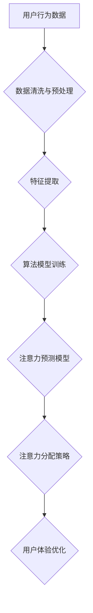

> 电子竞技, 注意力经济, 用户行为, 数据分析, 算法模型, 竞技游戏, 直播平台, 营销策略

## 1. 背景介绍

电子竞技 (eSports) 正以惊人的速度发展，已成为全球性的现象级娱乐产业。伴随着游戏直播平台的兴起，电子竞技赛事吸引了越来越多的观众，形成了庞大的在线观赛群体。然而，在激烈的竞争环境下，如何有效地吸引和留住观众的注意力，成为了电子竞技赛事运营方面临的重大挑战。

注意力经济是当今数字时代的核心概念，它强调了注意力作为一种稀缺资源的价值。在信息爆炸的时代，人们的注意力受到来自各方信息的竞争，因此，如何有效地获取和利用用户的注意力，成为了商业和娱乐领域的关键竞争力。

电子竞技赛事作为一种高度沉浸式的娱乐体验，其核心在于激烈的比赛和精彩的瞬间。然而，随着直播平台的普及，观众的注意力也面临着来自各种广告、弹幕和社交媒体的干扰。因此，电子竞技赛事运营方需要深入理解用户行为，并利用数据分析和算法模型，有效地引导和分配观众的注意力，从而提升赛事的影响力和商业价值。

## 2. 核心概念与联系

### 2.1 注意力经济

注意力经济是指在信息爆炸的时代，注意力作为一种稀缺资源，其价值被越来越重视。人们的注意力受到来自各种信息的竞争，因此，如何有效地获取和利用用户的注意力，成为了商业和娱乐领域的关键竞争力。

### 2.2 用户行为分析

用户行为分析是指通过收集和分析用户在电子竞技赛事平台上的行为数据，例如观看时长、点击率、互动频率等，以了解用户的兴趣、偏好和行为模式。

### 2.3 算法模型

算法模型是指利用机器学习和数据挖掘技术，从用户行为数据中提取特征，并构建预测模型，以预测用户的注意力流向和行为模式。

**Mermaid 流程图**



## 3. 核心算法原理 & 具体操作步骤

### 3.1 算法原理概述

电子竞技赛事注意力经济效应的算法模型主要基于以下原理：

* **用户行为特征提取:** 从用户观看时长、点击率、互动频率等行为数据中提取特征，例如观看习惯、偏好游戏类型、互动活跃度等。
* **注意力预测模型:** 利用机器学习算法，例如深度神经网络，构建注意力预测模型，预测用户对不同比赛、选手、环节的注意力流向。
* **注意力分配策略:** 根据注意力预测模型的输出，制定注意力分配策略，例如推荐相关比赛、突出精彩瞬间、引导用户互动等。

### 3.2 算法步骤详解

1. **数据收集:** 收集用户在电子竞技赛事平台上的行为数据，例如观看时长、点击率、互动频率、评论内容等。
2. **数据清洗与预处理:** 对收集到的数据进行清洗和预处理，例如去除无效数据、处理缺失值、标准化数据等。
3. **特征提取:** 从用户行为数据中提取特征，例如观看习惯、偏好游戏类型、互动活跃度等。
4. **算法模型训练:** 利用机器学习算法，例如深度神经网络，对提取的特征进行训练，构建注意力预测模型。
5. **模型评估与优化:** 对训练好的模型进行评估，并根据评估结果进行模型优化，例如调整模型参数、增加训练数据等。
6. **注意力分配策略制定:** 根据注意力预测模型的输出，制定注意力分配策略，例如推荐相关比赛、突出精彩瞬间、引导用户互动等。
7. **策略实施与效果评估:** 将注意力分配策略实施到电子竞技赛事平台，并对策略的效果进行评估，例如用户观看时长、互动频率、留存率等。

### 3.3 算法优缺点

**优点:**

* **精准预测:** 基于机器学习算法，可以精准预测用户的注意力流向。
* **个性化推荐:** 根据用户的行为特征，提供个性化的比赛推荐和内容推送。
* **提升用户体验:** 通过引导用户注意力，提升用户观看体验和参与度。

**缺点:**

* **数据依赖:** 算法模型的准确性依赖于海量用户行为数据的质量和数量。
* **算法复杂度:** 训练和部署机器学习模型需要一定的技术和资源投入。
* **隐私安全:** 用户行为数据收集和使用需要考虑隐私安全问题。

### 3.4 算法应用领域

* **电子竞技赛事直播平台:** 提升用户观看体验、引导用户互动、提高广告收入。
* **游戏开发公司:** 了解玩家行为习惯、优化游戏设计、提升用户留存率。
* **体育赛事运营:** 预测观众注意力流向、制定营销策略、提升赛事影响力。

## 4. 数学模型和公式 & 详细讲解 & 举例说明

### 4.1 数学模型构建

注意力经济效应的数学模型可以基于用户行为数据和注意力预测模型构建。

**用户行为数据:**

* $U_i$: 用户 $i$ 的观看时长
* $C_j$: 比赛 $j$ 的观看人数
* $I_k$: 互动事件 $k$ 的数量

**注意力预测模型:**

* $A_{ij}$: 用户 $i$ 对比赛 $j$ 的注意力分数

**模型目标:**

* 最大化用户总注意力分数: $\sum_{i=1}^{N} \sum_{j=1}^{M} A_{ij}$

**模型约束:**

* 用户总观看时长有限: $\sum_{j=1}^{M} U_i \leq T$
* 比赛总观看人数有限: $\sum_{i=1}^{N} C_j \leq P$

### 4.2 公式推导过程

注意力分数 $A_{ij}$ 可以通过以下公式计算:

$$A_{ij} = f(U_i, C_j, I_k)$$

其中，$f$ 为注意力预测函数，可以采用线性回归、逻辑回归或深度神经网络等算法。

### 4.3 案例分析与讲解

假设有 10 个用户观看 5 场比赛，每个用户观看时长、比赛观看人数和互动事件数量分别为:

* $U_i = [10, 20, 30, 40, 50, 60, 70, 80, 90, 100]$
* $C_j = [100, 200, 300, 400, 500]$
* $I_k = [10, 20, 30, 40, 50]$

利用上述数据训练注意力预测模型，可以得到每个用户对每个比赛的注意力分数。例如，用户 1 对比赛 1 的注意力分数为 $A_{11} = 0.8$, 用户 2 对比赛 2 的注意力分数为 $A_{22} = 0.6$。

## 5. 项目实践：代码实例和详细解释说明

### 5.1 开发环境搭建

* 操作系统: Ubuntu 20.04
* Python 版本: 3.8
* 必要的库: pandas, numpy, scikit-learn, tensorflow

### 5.2 源代码详细实现

```python
import pandas as pd
from sklearn.model_selection import train_test_split
from sklearn.linear_model import LogisticRegression

# 加载用户行为数据
data = pd.read_csv('user_behavior.csv')

# 提取特征
features = ['watch_time', 'match_view_count', 'interaction_count']
target = 'attention_score'

# 数据预处理
X = data[features]
y = data[target]

# 将数据划分为训练集和测试集
X_train, X_test, y_train, y_test = train_test_split(X, y, test_size=0.2, random_state=42)

# 训练逻辑回归模型
model = LogisticRegression()
model.fit(X_train, y_train)

# 模型评估
accuracy = model.score(X_test, y_test)
print(f'模型准确率: {accuracy}')

# 预测用户注意力分数
new_data = pd.DataFrame({'watch_time': [30], 'match_view_count': [200], 'interaction_count': [20]})
predicted_attention = model.predict(new_data)
print(f'预测注意力分数: {predicted_attention}')
```

### 5.3 代码解读与分析

* 代码首先加载用户行为数据，并提取特征和目标变量。
* 然后，将数据划分为训练集和测试集，并使用逻辑回归模型训练注意力预测模型。
* 最后，使用训练好的模型预测新用户的注意力分数。

### 5.4 运行结果展示

运行上述代码，可以得到模型的准确率和预测的注意力分数。

## 6. 实际应用场景

### 6.1 电子竞技赛事直播平台

* **个性化推荐:** 根据用户的观看历史和行为特征，推荐相关比赛和选手，提升用户观看体验。
* **精彩瞬间突出:** 利用算法模型预测用户对精彩瞬间的关注度，突出重点内容，提升用户参与度。
* **互动引导:** 通过弹幕、投票等互动机制，引导用户参与互动，提升用户粘性。

### 6.2 游戏开发公司

* **游戏设计优化:** 了解玩家行为习惯，优化游戏设计，提升用户留存率。
* **内容推荐:** 根据玩家的游戏行为，推荐相关游戏内容，提升用户体验。
* **广告投放:** 精准投放广告，提升广告效果。

### 6.3 体育赛事运营

* **观众注意力预测:** 预测观众对不同比赛环节的关注度，制定相应的营销策略。
* **赛事直播优化:** 根据观众注意力流向，优化直播内容和呈现方式，提升观众观看体验。
* **赞助商合作:** 为赞助商提供精准的观众数据，提升广告投放效果。

### 6.4 未来应用展望

随着人工智能技术的不断发展，电子竞技赛事注意力经济效应的应用场景将更加广泛。例如，未来可以利用虚拟现实技术和增强现实技术，打造更加沉浸式的观看体验，并根据用户的实时注意力流向，动态调整游戏场景和内容，提升用户参与度和互动性。

## 7. 工具和资源推荐

### 7.1 学习资源推荐

* **书籍:**
    * 《深度学习》
    * 《机器学习实战》
    * 《Python数据科学手册》
* **在线课程:**
    * Coursera: 深度学习
    * edX: 机器学习
    * Udacity: 数据科学

### 7.2 开发工具推荐

* **Python:** 作为数据科学和机器学习的常用语言，Python 提供了丰富的库和工具，例如 pandas, numpy, scikit-learn, tensorflow 等。
* **Jupyter Notebook:** 用于编写和执行 Python 代码，并可视化数据和模型结果。
* **Git:** 用于版本控制和代码管理。

### 7.3 相关论文推荐

* **Attention Is All You Need:** https://arxiv.org/abs/1706.03762
* **BERT: Pre-training of Deep Bidirectional Transformers for Language Understanding:** https://arxiv.org/abs/1810.04805
* **Deep Reinforcement Learning for Electronic Sports:** https://arxiv.org/abs/1903.04977

## 8. 总结：未来发展趋势与挑战

### 8.1 研究成果总结

电子竞技赛事注意力经济效应的研究取得了显著进展，已经构建了基于用户行为数据的注意力预测模型，并成功应用于电子竞技赛事直播平台、游戏开发公司和体育赛事运营等领域。

### 8.2 未来发展趋势

* **模型精度提升:** 利用更先进的机器学习算法和深度学习模型，提升注意力预测模型的精度。
* **多模态数据融合:** 将文本、图像、音频等多模态数据融合到