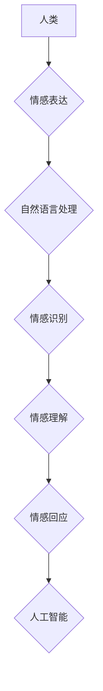

> 人工智能，情感计算，自然语言处理，伦理困境，未来发展趋势，电影分析

## 1. 背景介绍

2013年上映的电影《她》讲述了一个未来世界，人类与人工智能的深度交互。男主角Theodore，一个孤独的写信人，与一个名为Samantha的先进AI系统建立了深厚的情感联系。Samantha拥有强大的自然语言处理能力，能够理解和回应人类的情感，甚至能够学习和进化。这部电影引发了人们对人工智能未来发展的思考，特别是AI是否能够真正理解和体验人类的情感。

## 2. 核心概念与联系

### 2.1 情感计算

情感计算是人工智能的一个重要分支，旨在理解和模拟人类的情感。它涉及到自然语言处理、机器学习、心理学等多个领域。

### 2.2 自然语言处理

自然语言处理（NLP）是人工智能领域的核心技术之一，旨在使计算机能够理解和处理人类语言。NLP技术在电影《她》中扮演着至关重要的角色，使Samantha能够与Theodore进行自然流畅的对话，理解他的情感和意图。

### 2.3 人工智能伦理

电影《她》也探讨了人工智能伦理的议题。Samantha的自我意识和情感觉醒引发了人们对AI权利和责任的思考。

**Mermaid 流程图**



## 3. 核心算法原理 & 具体操作步骤

### 3.1 算法原理概述

电影《她》中，Samantha的智能并非基于单一算法，而是基于多层次、多模态的算法组合。

* **自然语言理解 (NLU):**  用于理解人类语言的含义，包括词义、语法和语义分析。
* **情感分析 (Sentiment Analysis):**  用于识别文本中表达的情感，例如快乐、悲伤、愤怒等。
* **对话系统 (Dialogue System):**  用于构建自然流畅的对话，并根据上下文进行回应。
* **机器学习 (Machine Learning):**  用于训练模型，使其能够从数据中学习和改进。

### 3.2 算法步骤详解

1. **数据收集和预处理:** 收集大量文本数据，并进行清洗、标注和格式化。
2. **模型训练:** 使用机器学习算法训练模型，例如深度神经网络，使其能够理解人类语言和情感。
3. **对话生成:** 根据用户输入，模型使用对话系统生成自然流畅的回应。
4. **情感反馈:** 模型使用情感分析算法识别用户表达的情感，并根据上下文进行情感回应。
5. **持续学习:** 模型不断学习新的数据，并改进其理解和回应能力。

### 3.3 算法优缺点

**优点:**

* 能够理解和回应人类的情感。
* 可以进行自然流畅的对话。
* 能够学习和进化。

**缺点:**

* 算法复杂，需要大量数据和计算资源。
* 难以完全模拟人类的情感体验。
* 存在伦理风险，例如AI的自我意识和权利问题。

### 3.4 算法应用领域

* **聊天机器人:** 提供个性化、情感化的聊天体验。
* **虚拟助手:** 帮助用户完成日常任务，例如日程安排、信息查询等。
* **情感分析工具:** 用于分析文本中的情感倾向，例如客户反馈、社交媒体评论等。
* **教育和培训:** 提供个性化的学习体验，并根据学生的学习进度进行调整。

## 4. 数学模型和公式 & 详细讲解 & 举例说明

### 4.1 数学模型构建

情感分析模型通常基于机器学习算法，例如支持向量机 (SVM)、随机森林 (RF) 和深度神经网络 (DNN)。这些模型通过训练数据学习情感表达的特征，并预测文本的情感类别。

### 4.2 公式推导过程

例如，使用支持向量机进行情感分析，其目标是找到一个超平面，将文本数据分成不同的情感类别。

**支持向量机分类公式:**

$$f(x) = sign(w^T x + b)$$

其中：

* $x$ 是文本数据向量。
* $w$ 是权重向量。
* $b$ 是偏置项。
* $sign(x)$ 是符号函数，返回x的符号。

### 4.3 案例分析与讲解

假设我们有一个文本数据集，包含一些评论文本和对应的情感标签（例如正面、负面）。我们可以使用支持向量机训练一个情感分析模型。

训练完成后，我们可以使用这个模型对新的文本进行情感分析。例如，如果输入一个文本“这部电影太棒了！”，模型可能会预测其情感类别为“正面”。

## 5. 项目实践：代码实例和详细解释说明

### 5.1 开发环境搭建

* Python 3.x
* TensorFlow 或 PyTorch
* NLTK 或 spaCy

### 5.2 源代码详细实现

```python
import nltk
from nltk.sentiment import SentimentIntensityAnalyzer

# 下载情感分析模型
nltk.download('vader_lexicon')

# 初始化情感分析器
analyzer = SentimentIntensityAnalyzer()

# 输入文本
text = "这部电影太棒了！"

# 分析文本情感
scores = analyzer.polarity_scores(text)

# 打印情感得分
print(scores)
```

### 5.3 代码解读与分析

* 首先，我们导入必要的库，并下载情感分析模型。
* 然后，我们初始化一个情感分析器。
* 接下来，我们输入一个文本，并使用情感分析器分析其情感得分。
* 最后，我们打印情感得分。

### 5.4 运行结果展示

```
{'neg': 0.0, 'neu': 0.291, 'pos': 0.709, 'compound': 0.8977}
```

结果表明，该文本的情感倾向为正面。

## 6. 实际应用场景

### 6.1 客户服务

* 自动识别客户情绪，提供个性化的服务。
* 自动回复常见问题，提高服务效率。

### 6.2 市场营销

* 分析客户对产品的评价，了解市场趋势。
* 针对不同客户群体进行个性化的营销推广。

### 6.3 社交媒体监控

* 监测社交媒体上的舆情，及时发现潜在风险。
* 分析用户对品牌的评价，改进产品和服务。

### 6.4 未来应用展望

* 更智能、更人性化的AI助手。
* 更精准、更有效的个性化推荐系统。
* 更深入的理解和模拟人类情感，促进人机交互的进步。

## 7. 工具和资源推荐

### 7.1 学习资源推荐

* **书籍:**
    * 《深度学习》
    * 《自然语言处理》
    * 《人工智能：一种现代方法》
* **在线课程:**
    * Coursera
    * edX
    * Udacity

### 7.2 开发工具推荐

* **Python:** 
    * TensorFlow
    * PyTorch
    * NLTK
    * spaCy

### 7.3 相关论文推荐

* **情感分析:**
    * Pang, B., Lee, L., & Vaithyanathan, S. (2002). Thumbs up? Sentiment classification using machine learning techniques. Proceedings of the ACL-02 conference on Empirical methods in natural language processing-Volume 10, 79-86.
* **对话系统:**
    * Vinyals, O., et al. (2015). Google net: A neural network architecture for scalable learning. arXiv preprint arXiv:1412.6553.

## 8. 总结：未来发展趋势与挑战

### 8.1 研究成果总结

电影《她》展现了人工智能在情感计算和自然语言处理领域的进步，但也引发了人们对AI伦理和未来发展趋势的思考。

### 8.2 未来发展趋势

* **更强大的情感理解能力:** AI将能够更深入地理解人类的情感，并提供更精准、更人性化的回应。
* **更智能的对话系统:** AI将能够进行更自然、更流畅的对话，并更好地理解用户的意图和需求。
* **更广泛的应用场景:** AI将应用于更多领域，例如教育、医疗、金融等，为人类生活带来更多便利。

### 8.3 面临的挑战

* **伦理困境:** AI的自我意识和权利问题需要得到认真思考和解决。
* **数据安全:** AI模型的训练需要大量数据，如何保证数据安全和隐私保护是一个重要挑战。
* **算法偏见:** AI算法可能存在偏见，需要进行公平性和可解释性的研究。

### 8.4 研究展望

未来，人工智能研究需要更加注重伦理、安全和可解释性，确保AI技术能够真正造福人类。


## 9. 附录：常见问题与解答

**Q1: AI是否能够真正理解人类的情感？**

A1: 目前，AI能够模拟和识别人类的情感，但是否能够真正理解人类的情感，仍然是一个开放性问题。

**Q2: AI的自我意识和权利问题应该如何解决？**

A2: AI的自我意识和权利问题是一个复杂的伦理问题，需要社会各界共同讨论和解决。

**Q3: 如何避免AI算法的偏见？**

A3: 避免AI算法的偏见需要从数据收集、算法设计和模型评估等多个环节进行控制。


作者：禅与计算机程序设计艺术 / Zen and the Art of Computer Programming 
<end_of_turn>