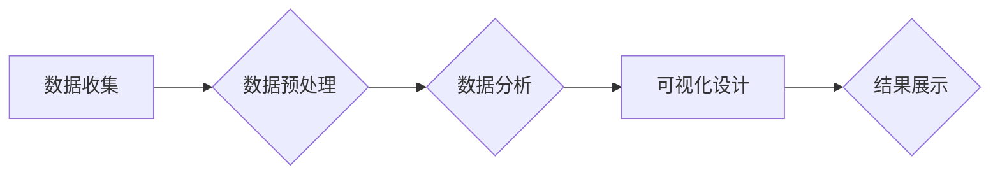

> 疫情通报，可视化分析，数据挖掘，机器学习，数据可视化，疫情预测，疫情防控

## 1. 背景介绍

新冠疫情的爆发对全球造成了巨大冲击，疫情防控工作面临着前所未有的挑战。及时、准确地掌握疫情信息，并进行有效的分析和预测，对于科学决策、精准防控至关重要。传统的疫情通报方式往往以文本形式为主，难以直观地展现疫情发展趋势和潜在风险。因此，利用数据可视化技术对疫情通报进行分析呈现，能够有效提升疫情信息的可理解性和可操作性，为疫情防控决策提供科学依据。

## 2. 核心概念与联系

**2.1 数据挖掘与可视化分析**

数据挖掘是指从海量数据中发现隐藏的模式、规律和知识的过程。可视化分析则是通过图形、图表等形式，将数据转化为直观易懂的信息，帮助人们快速理解和分析数据。将数据挖掘与可视化分析相结合，能够有效地揭示疫情发展趋势、传播规律和潜在风险，为疫情防控提供决策支持。

**2.2 疫情数据来源与处理**

疫情数据主要来源于政府机构、医疗机构、科研机构等多个渠道，包括确诊病例数、死亡人数、治愈人数、疫情传播路径等。这些数据通常存在格式不统一、数据质量参差不齐等问题，需要进行清洗、转换、整合等处理，才能用于可视化分析。

**2.3 可视化分析工具与技术**

目前，市场上有多种可视化分析工具和技术，例如 Tableau、Power BI、D3.js 等。这些工具提供丰富的图表类型、交互功能和数据连接能力，能够满足不同需求的可视化分析需求。

**2.4 疫情可视化分析流程**

疫情可视化分析流程一般包括以下几个步骤：

1. 数据收集与预处理
2. 数据分析与挖掘
3. 可视化设计与制作
4. 结果展示与解读

**Mermaid 流程图**



## 3. 核心算法原理 & 具体操作步骤

**3.1 算法原理概述**

疫情可视化分析中常用的算法包括：

* **聚类算法**: 用于将疫情数据进行分组，识别不同区域或人群的疫情传播特征。
* **关联规则挖掘算法**: 用于发现疫情数据之间的关联关系，例如哪些因素与疫情传播密切相关。
* **预测算法**: 用于预测疫情发展趋势，例如未来几天或几周的感染人数。

**3.2 算法步骤详解**

以聚类算法为例，其步骤如下：

1. **数据预处理**: 对疫情数据进行清洗、转换、整合等处理，确保数据质量。
2. **特征选择**: 选择与疫情传播相关的特征，例如人口密度、医疗资源、社会活动等。
3. **聚类算法选择**: 根据数据特点和分析目标，选择合适的聚类算法，例如 K-means 聚类、DBSCAN 聚类等。
4. **聚类结果分析**: 对聚类结果进行分析，识别不同区域或人群的疫情传播特征。

**3.3 算法优缺点**

不同算法具有不同的优缺点，需要根据实际情况选择合适的算法。例如，K-means 聚类算法简单易用，但对数据分布有较高的要求；DBSCAN 聚类算法能够发现非球形聚类，但对参数设置较为敏感。

**3.4 算法应用领域**

疫情可视化分析算法广泛应用于疫情防控、医疗资源配置、社会风险评估等领域。例如，可以利用聚类算法识别高风险区域，并进行精准防控；利用关联规则挖掘算法发现疫情传播的潜在因素，为防控策略提供参考；利用预测算法预测疫情发展趋势，为决策提供依据。

## 4. 数学模型和公式 & 详细讲解 & 举例说明

**4.1 数学模型构建**

疫情传播模型通常采用SIR模型（Susceptible-Infected-Recovered）来描述疫情传播过程。SIR模型假设人群分为三个状态：易感者（Susceptible）、感染者（Infected）和恢复者（Recovered）。模型的三个状态之间的转移关系可以用以下微分方程表示：

```latex
\frac{dS}{dt} = -\beta SI
\frac{dI}{dt} = \beta SI - \gamma I
\frac{dR}{dt} = \gamma I
```

其中：

* $S$：易感者数量
* $I$：感染者数量
* $R$：恢复者数量
* $\beta$：感染率
* $\gamma$：恢复率

**4.2 公式推导过程**

上述微分方程的推导过程基于以下假设：

* 人群规模固定
* 感染率和恢复率为常数
* 易感者感染后会成为感染者，感染者恢复后会成为恢复者

**4.3 案例分析与讲解**

假设在一个封闭社区中，初始时有1000人，其中900人是易感者，100人是感染者。感染率为0.2，恢复率为0.1。利用SIR模型的微分方程，可以模拟疫情传播过程，并预测感染者数量随时间的变化趋势。

## 5. 项目实践：代码实例和详细解释说明

**5.1 开发环境搭建**

本项目使用Python语言进行开发，所需环境包括：

* Python 3.x
* Jupyter Notebook
* Matplotlib
* Seaborn
* Pandas
* Scikit-learn

**5.2 源代码详细实现**

```python
import pandas as pd
import matplotlib.pyplot as plt
from sklearn.cluster import KMeans

# 加载疫情数据
data = pd.read_csv('疫情数据.csv')

# 数据预处理
# ...

# 特征选择
features = ['人口密度', '医疗资源', '社会活动']
X = data[features]

# 聚类算法
kmeans = KMeans(n_clusters=3)
kmeans.fit(X)

# 聚类结果分析
data['cluster'] = kmeans.labels_

# 可视化展示
plt.scatter(data['人口密度'], data['医疗资源'], c=data['cluster'])
plt.xlabel('人口密度')
plt.ylabel('医疗资源')
plt.title('疫情传播区域聚类')
plt.show()
```

**5.3 代码解读与分析**

代码首先加载疫情数据，并进行数据预处理。然后选择与疫情传播相关的特征，并使用K-means聚类算法对数据进行聚类。最后，将聚类结果可视化展示，直观地展现不同区域的疫情传播特征。

**5.4 运行结果展示**

运行代码后，将生成一个散点图，将不同区域的疫情数据根据聚类结果进行分类。每个类别的数据点颜色不同，可以直观地观察不同区域的疫情传播特征。

## 6. 实际应用场景

**6.1 疫情防控决策支持**

疫情可视化分析可以帮助政府部门和医疗机构了解疫情发展趋势、传播规律和潜在风险，为制定科学有效的防控策略提供决策支持。例如，可以利用可视化分析工具，直观地展示不同区域的疫情情况，并根据疫情传播规律，制定精准防控措施。

**6.2 医疗资源配置优化**

疫情可视化分析可以帮助医疗机构优化医疗资源配置，确保医疗资源能够有效地分配到需要的地方。例如，可以利用可视化分析工具，展示不同区域的医疗资源情况，并根据疫情发展趋势，动态调整医疗资源配置。

**6.3 社会风险评估与防控**

疫情可视化分析可以帮助评估社会风险，并制定相应的防控措施。例如，可以利用可视化分析工具，展示不同人群的疫情传播风险，并针对不同人群制定相应的防控措施。

**6.4 未来应用展望**

随着数据量的不断增长和可视化技术的不断发展，疫情可视化分析将在未来发挥更加重要的作用。例如，可以利用人工智能技术，对疫情数据进行更深入的分析，并预测疫情发展趋势；可以利用虚拟现实技术，构建沉浸式的疫情防控场景，提高公众的防控意识。

## 7. 工具和资源推荐

**7.1 学习资源推荐**

* **书籍**:
    * 数据挖掘：概念与技术
    * 可视化分析：从数据到洞察
* **在线课程**:
    * Coursera: 数据挖掘
    * edX: 可视化分析
* **网站**:
    * Kaggle: 数据科学竞赛平台
    * Towards Data Science: 数据科学博客平台

**7.2 开发工具推荐**

* **Python**: 数据分析和可视化编程语言
* **Tableau**: 数据可视化工具
* **Power BI**: 数据可视化工具
* **D3.js**: 数据可视化 JavaScript 库

**7.3 相关论文推荐**

* **SIR模型**: Kermack, W. O., & McKendrick, A. G. (1927). A contribution to the mathematical theory of epidemics. Proceedings of the Royal Society of London. Series A, Containing Papers of a Mathematical and Physical Character, 115(772), 700-721.
* **聚类算法**: Jain, A. K. (2010). Data clustering: 50 years beyond K-means. Pattern Recognition Letters, 31(8), 651-666.

## 8. 总结：未来发展趋势与挑战

**8.1 研究成果总结**

疫情可视化分析技术在疫情防控、医疗资源配置、社会风险评估等领域取得了显著成果，为疫情防控决策提供科学依据，提高了疫情防控效率。

**8.2 未来发展趋势**

未来，疫情可视化分析技术将朝着以下方向发展：

* **人工智能技术应用**: 利用人工智能技术，对疫情数据进行更深入的分析，并预测疫情发展趋势。
* **虚拟现实技术应用**: 利用虚拟现实技术，构建沉浸式的疫情防控场景，提高公众的防控意识。
* **数据可视化交互性增强**: 开发更具交互性的可视化工具，使用户能够更直观地理解和分析疫情数据。

**8.3 面临的挑战**

疫情可视化分析技术也面临着一些挑战：

* **数据质量问题**: 疫情数据来源多样，数据质量参差不齐，需要进行有效的数据清洗和预处理。
* **算法模型的局限性**: 现有的算法模型可能无法完全准确地反映疫情传播规律，需要不断改进和完善。
* **隐私保护问题**: 疫情数据包含个人隐私信息，需要采取有效措施保护个人隐私。

**8.4 研究展望**

未来，需要加强对疫情可视化分析技术的研发和应用，不断提升其准确性和实用性，为疫情防控提供更有效的技术支持。


## 9. 附录：常见问题与解答

**9.1 如何选择合适的聚类算法？**

选择合适的聚类算法需要根据数据的特点和分析目标。例如，如果数据分布较为均匀，可以使用K-means聚类算法；如果数据分布较为复杂，可以使用DBSCAN聚类算法。

**9.2 如何评估聚类结果的质量？**

常用的聚类结果评估指标包括Silhouette score、Dunn index等。

**9.3 如何处理疫情数据中的缺失值？**

常用的缺失值处理方法包括删除缺失值、用均值或中位数填充缺失值等。

**9.4 如何保护疫情数据中的隐私信息？**

常用的隐私保护方法包括数据脱敏、差分隐私等。


作者：禅与计算机程序设计艺术 / Zen and the Art of Computer Programming 
<end_of_turn>