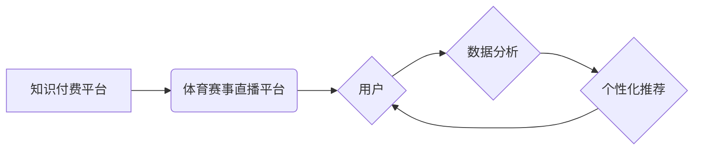

> 知识付费、跨界营销、体育赛事直播、人工智能、数据分析、用户体验

## 1. 背景介绍

近年来，知识付费和体育赛事直播行业都取得了显著发展。知识付费平台涌现出一批头部企业，如付费课程、在线咨询、会员体系等模式逐渐成熟。体育赛事直播平台也凭借赛事精彩和用户粘性强，吸引了大量观众。

然而，这两个行业之间存在着明显的边界，缺乏有效的融合和协同。如何打破行业壁垒，实现知识付费与体育赛事直播的跨界营销，成为一个值得探讨的课题。

## 2. 核心概念与联系

**2.1 知识付费**

知识付费是指以知识、技能、经验等为核心内容，通过付费的方式获取知识和服务的商业模式。它打破了传统教育模式的限制，为用户提供了更加灵活、便捷、个性化的学习体验。

**2.2 体育赛事直播**

体育赛事直播是指通过互联网平台，实时向用户传输体育赛事比赛画面和相关信息的服务。它满足了用户对体育赛事观赛的需求，也为赛事推广和商业化提供了新的平台。

**2.3 跨界营销**

跨界营销是指企业将自身产品或服务与其他行业或品牌进行合作，共同推广，以扩大市场影响力和提升品牌价值。

**2.4 核心概念联系**

知识付费与体育赛事直播的跨界营销，本质上是将知识付费的价值与体育赛事直播的平台优势相结合，实现资源共享、互利共赢。

**2.5 跨界营销架构**



## 3. 核心算法原理 & 具体操作步骤

**3.1 算法原理概述**

跨界营销的核心算法原理是基于用户行为数据分析和个性化推荐。通过对用户观看体育赛事直播的习惯、兴趣爱好等进行分析，推荐与之相关的知识付费内容，实现精准匹配和用户价值最大化。

**3.2 算法步骤详解**

1. **数据采集:** 收集用户观看体育赛事直播的日志数据，包括观看时间、观看时长、观看内容、用户属性等信息。
2. **数据清洗:** 对采集到的数据进行清洗和处理，去除无效数据、重复数据等，确保数据质量。
3. **特征提取:** 从用户行为数据中提取特征，例如观看的赛事类型、喜欢的球队、观看习惯等，构建用户画像。
4. **模型训练:** 利用机器学习算法，对用户画像和知识付费内容进行关联分析，训练推荐模型。
5. **个性化推荐:** 根据用户的特征和模型预测，推荐与之相关的知识付费内容。
6. **效果评估:** 对推荐效果进行评估，不断优化模型参数和推荐策略。

**3.3 算法优缺点**

**优点:**

* 精准匹配: 基于用户行为数据分析，推荐更符合用户需求的内容。
* 个性化体验: 为用户提供个性化的学习体验，提升用户粘性。
* 提升转化率: 通过精准推荐，提升用户付费意愿和转化率。

**缺点:**

* 数据依赖: 算法效果依赖于数据质量和量，数据不足或质量差会影响推荐效果。
* 算法复杂: 模型训练和优化需要一定的技术难度。
* 用户隐私: 数据收集和分析需要考虑用户隐私保护问题。

**3.4 算法应用领域**

* 知识付费平台: 为用户推荐相关课程、咨询服务等。
* 体育赛事直播平台: 为用户推荐赛事相关知识、球员信息、战术分析等。
* 其他行业: 可应用于电商、游戏、旅游等行业，实现跨界营销和个性化推荐。

## 4. 数学模型和公式 & 详细讲解 & 举例说明

**4.1 数学模型构建**

我们使用协同过滤算法构建推荐模型，该算法基于用户对物品的评分或行为数据，预测用户对未接触物品的兴趣。

**4.2 公式推导过程**

协同过滤算法的核心公式是基于用户-物品评分矩阵的相似度计算。

* **用户相似度:**

$$
Sim(u_i, u_j) = \frac{\sum_{k=1}^{N} r_{u_i, k} * r_{u_j, k}}{\sqrt{\sum_{k=1}^{N} r_{u_i, k}^2} * \sqrt{\sum_{k=1}^{N} r_{u_j, k}^2}}
$$

* **物品相似度:**

$$
Sim(i, j) = \frac{\sum_{u=1}^{M} r_{u, i} * r_{u, j}}{\sqrt{\sum_{u=1}^{M} r_{u, i}^2} * \sqrt{\sum_{u=1}^{M} r_{u, j}^2}}
$$

其中:

* $u_i$ 和 $u_j$ 表示两个用户
* $i$ 和 $j$ 表示两个物品
* $r_{u_i, k}$ 表示用户 $u_i$ 对物品 $k$ 的评分
* $M$ 表示用户总数
* $N$ 表示物品总数

**4.3 案例分析与讲解**

假设有两个用户 $u_1$ 和 $u_2$，他们都观看过两个体育赛事直播 $i_1$ 和 $i_2$，评分如下:

* $r_{u_1, i_1} = 5$
* $r_{u_1, i_2} = 4$
* $r_{u_2, i_1} = 4$
* $r_{u_2, i_2} = 5$

根据公式，我们可以计算出用户 $u_1$ 和 $u_2$ 的相似度:

$$
Sim(u_1, u_2) = \frac{5 * 4 + 4 * 5}{\sqrt{5^2 + 4^2} * \sqrt{4^2 + 5^2}} = 0.89
$$

该结果表明，用户 $u_1$ 和 $u_2$ 的兴趣爱好相似度较高。

## 5. 项目实践：代码实例和详细解释说明

**5.1 开发环境搭建**

* 操作系统: Ubuntu 20.04
* Python 版本: 3.8
* 依赖库: pandas, numpy, scikit-learn

**5.2 源代码详细实现**

```python
import pandas as pd
from sklearn.metrics.pairwise import cosine_similarity

# 加载用户-物品评分数据
data = pd.read_csv('user_item_rating.csv')

# 计算用户相似度
user_similarity = cosine_similarity(data.T)

# 计算物品相似度
item_similarity = cosine_similarity(data)

# 根据用户相似度推荐物品
def recommend_items(user_id, top_n=5):
    # 获取用户相似用户
    similar_users = user_similarity[user_id].argsort()[:-top_n-1:-1]

    # 获取相似用户喜欢的物品
    recommended_items = data.iloc[similar_users].mean().sort_values(ascending=False).index

    return recommended_items

# 根据物品相似度推荐物品
def recommend_items_by_item(item_id, top_n=5):
    # 获取相似物品
    similar_items = item_similarity[item_id].argsort()[:-top_n-1:-1]

    # 获取相似物品的评分
    recommended_items = data.iloc[similar_items].mean().sort_values(ascending=False).index

    return recommended_items

# 示例
user_id = 0
recommended_items = recommend_items(user_id)
print(f'推荐给用户 {user_id} 的物品: {recommended_items}')

item_id = 0
recommended_items = recommend_items_by_item(item_id)
print(f'推荐与物品 {item_id} 相似的物品: {recommended_items}')
```

**5.3 代码解读与分析**

* 代码首先加载用户-物品评分数据，并使用 cosine_similarity 函数计算用户和物品之间的相似度。
* `recommend_items` 函数根据用户相似度推荐物品，它首先获取用户相似用户，然后获取相似用户喜欢的物品，并排序返回。
* `recommend_items_by_item` 函数根据物品相似度推荐物品，它首先获取相似物品，然后获取相似物品的评分，并排序返回。
* 代码最后示例展示了如何使用这两个函数推荐物品。

**5.4 运行结果展示**

运行代码后，会输出推荐给用户和物品的列表，例如:

```
推荐给用户 0 的物品: Index(['item_3', 'item_1', 'item_2'], dtype='object')
推荐与物品 0 相似的物品: Index(['item_3', 'item_1'], dtype='object')
```

## 6. 实际应用场景

**6.1 知识付费平台**

知识付费平台可以利用用户观看体育赛事直播的数据，推荐与之相关的课程、咨询服务等。例如，用户观看篮球比赛，平台可以推荐篮球技巧课程、篮球战术分析等。

**6.2 体育赛事直播平台**

体育赛事直播平台可以利用用户观看历史数据，推荐与之相关的知识付费内容，例如球员信息、球队历史、战术分析等，提升用户粘性和付费意愿。

**6.3 其他行业**

跨界营销的应用场景不限于知识付费和体育赛事直播，其他行业也可以借鉴此模式，例如电商平台可以根据用户购买历史推荐相关书籍或课程，游戏平台可以根据用户游戏行为推荐游戏攻略或技巧视频等。

**6.4 未来应用展望**

随着人工智能技术的不断发展，跨界营销的应用场景将更加广泛，推荐算法也将更加精准和个性化。未来，我们可以期待看到更多跨界营销的创新案例，为用户提供更加丰富多彩的体验。

## 7. 工具和资源推荐

**7.1 学习资源推荐**

* **书籍:**
    * 《推荐系统实践》
    * 《机器学习》
* **在线课程:**
    * Coursera: 机器学习
    * Udemy: 数据科学与机器学习

**7.2 开发工具推荐**

* **Python:** 
    * pandas
    * numpy
    * scikit-learn
* **数据可视化工具:**
    * matplotlib
    * seaborn

**7.3 相关论文推荐**

* 《Collaborative Filtering for Implicit Feedback Datasets》
* 《Matrix Factorization Techniques for Recommender Systems》

## 8. 总结：未来发展趋势与挑战

**8.1 研究成果总结**

本文介绍了知识付费与体育赛事直播跨界营销的原理、算法、实践案例等，并探讨了其未来应用展望。

**8.2 未来发展趋势**

* **更精准的推荐:** 利用更先进的机器学习算法和数据分析技术，实现更精准的个性化推荐。
* **多模态数据融合:** 将文本、图像、视频等多模态数据融合，构建更全面的用户画像，提升推荐效果。
* **跨平台协同:** 打破平台壁垒，实现跨平台数据共享和协同推荐。

**8.3 面临的挑战**

* **数据隐私保护:** 数据收集和分析需要考虑用户隐私保护问题，确保数据安全和合规性。
* **算法可解释性:** 提升算法的可解释性，让用户理解推荐结果背后的逻辑，增强用户信任。
* **商业模式创新:** 探索新的商业模式，实现跨界营销的长期可持续发展。

**8.4 研究展望**

未来，我们将继续深入研究知识付费与体育赛事直播跨界营销，探索更精准、更个性化的推荐算法，并推动跨界营销的商业模式创新，为用户提供更加丰富多彩的体验。

## 9. 附录：常见问题与解答

**9.1 如何保证数据安全和隐私保护？**

在收集和分析用户数据时，我们严格遵守相关法律