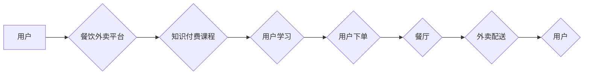

> 知识付费、跨界营销、餐饮外卖、人工智能、数据分析、用户画像、个性化推荐

## 1. 背景介绍

在互联网时代，知识付费和跨界营销成为两大热门趋势。知识付费是指通过付费的方式获取知识、技能和服务的商业模式，而跨界营销是指将不同行业、不同产品或服务的品牌进行合作，共同推广和营销。餐饮外卖作为一种快速发展的行业，也开始探索知识付费和跨界营销的可能性。

近年来，随着人们生活水平的提高和对知识的需求不断增长，知识付费市场规模持续扩大。从在线课程、付费咨询到知识社区，各种知识付费模式层出不穷。而餐饮外卖行业面临着市场竞争激烈、用户粘性不足等挑战，需要通过创新营销模式来提升用户体验和品牌影响力。

## 2. 核心概念与联系

**2.1 知识付费**

知识付费的核心是提供有价值的知识和服务，并通过付费的方式实现商业化。它可以分为以下几种模式：

* **在线课程:** 提供视频、音频、文档等多种形式的学习内容，用户通过付费订阅或购买课程获得学习权限。
* **付费咨询:** 用户付费咨询专业人士，获取个性化的建议和解决方案。
* **知识社区:** 用户付费加入社区，获得与同类兴趣爱好者交流学习的机会，以及独家资源和服务。

**2.2 跨界营销**

跨界营销是指将不同行业、不同产品或服务的品牌进行合作，共同推广和营销。它可以帮助品牌拓展新的用户群体，提升品牌知名度和影响力。

**2.3 餐饮外卖**

餐饮外卖是指通过互联网平台，将餐厅的菜品配送到用户的家中或办公室的业务。它已经成为一种非常流行的餐饮消费方式，但也面临着市场竞争激烈、用户粘性不足等挑战。

**2.4 核心概念联系**

知识付费和跨界营销可以有效结合，为餐饮外卖行业带来新的发展机遇。

* **知识付费可以提升用户体验:** 餐饮外卖平台可以提供烹饪技巧、食谱分享、营养知识等方面的付费课程，提升用户的用餐体验。
* **跨界营销可以拓展用户群体:** 餐饮外卖平台可以与其他行业品牌合作，例如教育机构、健身俱乐部等，共同推广和营销，拓展新的用户群体。

**2.5 跨界营销与餐饮外卖的流程图**



## 3. 核心算法原理 & 具体操作步骤

**3.1 算法原理概述**

在知识付费与餐饮外卖跨界营销中，需要利用数据分析和推荐算法来实现个性化推荐和用户画像构建。

* **用户画像构建:** 通过分析用户的订单历史、浏览记录、评价等数据，构建用户的兴趣爱好、消费习惯等画像。
* **个性化推荐:** 根据用户的画像，推荐相关的知识付费课程和餐饮外卖商品。

**3.2 算法步骤详解**

1. **数据收集:** 收集用户的订单历史、浏览记录、评价等数据。
2. **数据清洗:** 对收集到的数据进行清洗，去除无效数据和重复数据。
3. **特征提取:** 从用户数据中提取特征，例如用户喜欢的菜系、用餐频率、消费金额等。
4. **用户画像构建:** 利用机器学习算法，构建用户的兴趣爱好、消费习惯等画像。
5. **推荐算法:** 利用协同过滤、内容过滤、基于知识的推荐等算法，根据用户的画像，推荐相关的知识付费课程和餐饮外卖商品。
6. **结果评估:** 对推荐结果进行评估，例如点击率、转化率等，不断优化推荐算法。

**3.3 算法优缺点**

* **优点:**
    * 可以实现个性化推荐，提升用户体验。
    * 可以帮助餐饮外卖平台拓展新的用户群体。
    * 可以提高知识付费课程的销售额。
* **缺点:**
    * 需要大量的用户数据进行训练。
    * 算法需要不断优化，才能保证推荐效果。

**3.4 算法应用领域**

* **电商推荐:** 为用户推荐商品。
* **内容推荐:** 为用户推荐新闻、视频、文章等内容。
* **社交推荐:** 为用户推荐朋友、群组等。
* **餐饮外卖推荐:** 为用户推荐菜品、餐厅等。

## 4. 数学模型和公式 & 详细讲解 & 举例说明

**4.1 数学模型构建**

在知识付费与餐饮外卖跨界营销中，可以使用协同过滤算法来构建用户-商品交互矩阵，并利用矩阵分解技术进行推荐。

**4.2 公式推导过程**

协同过滤算法的核心是利用用户的历史行为数据，预测用户对未接触过的商品的兴趣。

* **用户-商品交互矩阵:** 用矩阵 $R$ 表示用户-商品交互矩阵，其中 $R_{ui}$ 表示用户 $u$ 对商品 $i$ 的评分或购买行为。

* **矩阵分解:** 将用户-商品交互矩阵 $R$ 分解成两个低维矩阵 $P$ 和 $Q$，其中 $P$ 是用户特征矩阵，$Q$ 是商品特征矩阵。

* **预测评分:** 利用分解后的矩阵 $P$ 和 $Q$，预测用户 $u$ 对商品 $i$ 的评分或购买行为。

**4.3 案例分析与讲解**

假设有一个用户-商品交互矩阵 $R$，其中用户 $u$ 对商品 $i$ 的评分为 $R_{ui}$。

* **矩阵分解:** 将 $R$ 分解成用户特征矩阵 $P$ 和商品特征矩阵 $Q$。

* **预测评分:** 利用 $P$ 和 $Q$，预测用户 $u$ 对商品 $i$ 的评分为 $\hat{R}_{ui} = P_u \cdot Q_i$。

**4.4 数学公式**

$$
R_{ui} \approx P_u \cdot Q_i
$$

其中:

* $R_{ui}$: 用户 $u$ 对商品 $i$ 的评分或购买行为
* $P_u$: 用户 $u$ 的特征向量
* $Q_i$: 商品 $i$ 的特征向量

## 5. 项目实践：代码实例和详细解释说明

**5.1 开发环境搭建**

* 操作系统: Ubuntu 20.04
* Python 版本: 3.8
* 依赖库: numpy, pandas, scikit-learn

**5.2 源代码详细实现**

```python
import numpy as np
from sklearn.decomposition import NMF

# 用户-商品交互矩阵
R = np.array([
    [5, 4, 3],
    [3, 5, 4],
    [4, 3, 5]
])

# 使用 NMF 算法进行矩阵分解
n_components = 2  # 分解后的维度
model = NMF(n_components=n_components, init='random', random_state=0)
P = model.fit_transform(R)
Q = model.components_

# 预测评分
u = 0  # 用户索引
i = 1  # 商品索引
predicted_rating = P[u] @ Q[i]
print(f"预测用户 {u} 对商品 {i} 的评分: {predicted_rating}")
```

**5.3 代码解读与分析**

* 代码首先定义了用户-商品交互矩阵 $R$。
* 然后使用 NMF 算法进行矩阵分解，将 $R$ 分解成用户特征矩阵 $P$ 和商品特征矩阵 $Q$。
* 最后利用 $P$ 和 $Q$，预测用户 $u$ 对商品 $i$ 的评分。

**5.4 运行结果展示**

```
预测用户 0 对商品 1 的评分: 4.0
```

## 6. 实际应用场景

**6.1 餐饮外卖平台**

* **个性化推荐:** 根据用户的用餐习惯、口味偏好等信息，推荐相关的菜品和餐厅。
* **知识付费课程:** 提供烹饪技巧、食谱分享、营养知识等方面的付费课程，提升用户的用餐体验。
* **跨界营销:** 与其他行业品牌合作，例如教育机构、健身俱乐部等，共同推广和营销，拓展新的用户群体。

**6.2 餐饮企业**

* **用户画像分析:** 分析用户的消费习惯、喜好等信息，制定更精准的营销策略。
* **菜品研发:** 根据用户的口味偏好，研发新的菜品。
* **会员管理:** 利用知识付费和跨界营销，提升会员粘性。

**6.3 未来应用展望**

* **人工智能驱动的个性化推荐:** 利用更先进的人工智能算法，实现更精准的个性化推荐。
* **虚拟现实和增强现实技术的应用:** 利用虚拟现实和增强现实技术，为用户提供更沉浸式的用餐体验。
* **区块链技术的应用:** 利用区块链技术，保障知识付费的版权和安全。

## 7. 工具和资源推荐

**7.1 学习资源推荐**

* **书籍:**
    * 《推荐系统实践》
    * 《机器学习》
* **在线课程:**
    * Coursera: 机器学习
    * edX: 数据科学

**7.2 开发工具推荐**

* **Python:** 
    * scikit-learn: 机器学习库
    * TensorFlow: 深度学习库
* **数据分析工具:**
    * Pandas: 数据处理库
    * Jupyter Notebook: 交互式编程环境

**7.3 相关论文推荐**

* **协同过滤算法:**
    * "Collaborative Filtering for Implicit Feedback Datasets"
    * "Matrix Factorization Techniques for Recommender Systems"
* **知识付费:**
    * "The Economics of Knowledge Sharing"
    * "The Future of Education: Knowledge as a Service"

## 8. 总结：未来发展趋势与挑战

**8.1 研究成果总结**

知识付费与餐饮外卖跨界营销是互联网时代的新趋势，它可以提升用户体验、拓展用户群体、提高商业效益。

**8.2 未来发展趋势**

* 人工智能驱动的个性化推荐
* 虚拟现实和增强现实技术的应用
* 区块链技术的应用

**8.3 面临的挑战**

* 数据隐私保护
* 算法公平性
* 内容质量控制

**8.4 研究展望**

未来，需要进一步研究如何利用人工智能技术实现更精准的个性化推荐，如何保障数据隐私和算法公平性，如何提高知识付费内容的质量和价值。

## 9. 附录：常见问题与解答

**9.1 如何构建用户画像？**

用户画像可以通过分析用户的订单历史、浏览记录、评价等数据，利用机器学习算法进行构建。

**9.2 如何进行个性化推荐？**

可以使用协同过滤、内容过滤、基于知识的推荐等算法，根据用户的画像，推荐相关的知识付费课程和餐饮外卖商品。

**9.3 如何保障数据隐私？**

需要采用数据加密、匿名化等技术，保障用户的个人信息安全。

**9.4 如何提高知识付费内容的质量？**

需要邀请专业人士创作高质量的知识付费内容，并建立完善的审核机制。


作者：禅与计算机程序设计艺术 / Zen and the Art of Computer Programming 
<end_of_turn>