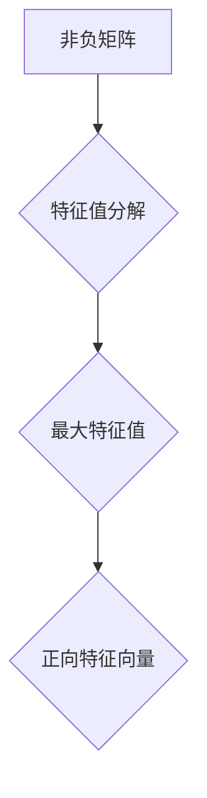

> 矩阵理论，Perron-Frobenius理论，特征值，特征向量，应用场景，算法分析，数值计算

## 1. 背景介绍

矩阵理论是数学领域的重要分支，在计算机科学、物理学、经济学等众多领域有着广泛的应用。其中，Perron-Frobenius理论是矩阵理论中的一个重要分支，它研究了非负矩阵的特征值和特征向量，并揭示了这些特征值和特征向量的性质。Perron-Frobenius理论在许多领域都有着重要的应用，例如：

* **网络分析:**  Perron-Frobenius理论可以用来分析网络中的信息传播、节点重要性以及网络结构的稳定性。
* **机器学习:**  Perron-Frobenius理论可以用来分析机器学习算法的收敛性以及优化问题的解。
* **经济学:**  Perron-Frobenius理论可以用来分析经济系统中的资源分配、市场均衡以及经济增长。

## 2. 核心概念与联系

Perron-Frobenius理论的核心概念包括：

* **非负矩阵:**  所有元素都是非负数的矩阵。
* **特征值:**  满足矩阵乘以特征向量等于特征值乘以特征向量的标量。
* **特征向量:**  与矩阵相乘后，结果只是该向量本身的标量倍数的向量。
* **最大特征值:**  所有特征值中最大的一个。
* **最大特征向量:**  对应最大特征值的特征向量。

Perron-Frobenius理论指出，对于一个非负矩阵，它存在唯一的最大特征值，并且对应的最大特征向量是正向量的。

**Mermaid 流程图:**



## 3. 核心算法原理 & 具体操作步骤

### 3.1  算法原理概述

Perron-Frobenius理论的应用通常涉及以下步骤：

1. **构建非负矩阵:**  根据实际问题，构建一个非负矩阵，其中矩阵元素代表不同节点之间的关系或连接强度。
2. **计算特征值和特征向量:**  使用数值计算方法，例如幂法迭代算法，计算矩阵的特征值和特征向量。
3. **提取最大特征值和特征向量:**  从计算结果中提取最大特征值和对应的特征向量。
4. **分析结果:**  根据最大特征值和特征向量，分析网络结构、信息传播、节点重要性等问题。

### 3.2  算法步骤详解

**幂法迭代算法:**

1. **初始化:**  选择一个非零向量作为初始向量，例如单位向量。
2. **迭代:**  重复以下步骤直到收敛:
    * 将向量与矩阵相乘。
    * 将结果向量归一化，使其元素之和为1。
3. **收敛:**  迭代过程中，向量逐渐收敛到最大特征向量的方向。

### 3.3  算法优缺点

**优点:**

* 算法简单易实现。
* 对于非负矩阵，算法收敛速度较快。

**缺点:**

* 对于某些特殊矩阵，算法可能无法收敛。
* 算法的精度受迭代次数和初始向量的选择影响。

### 3.4  算法应用领域

* **网络分析:**  分析社交网络、互联网拓扑结构、生物网络等。
* **机器学习:**  分析聚类算法、推荐系统、文本挖掘等。
* **经济学:**  分析经济增长、市场均衡、资源分配等。

## 4. 数学模型和公式 & 详细讲解 & 举例说明

### 4.1  数学模型构建

设 A 为一个 n×n 的非负矩阵，则其特征值问题可以表示为：

$$
Ax = \lambda x
$$

其中：

* A 为非负矩阵
* x 为特征向量
* λ 为特征值

### 4.2  公式推导过程

Perron-Frobenius理论指出，对于一个非负矩阵 A，存在唯一的最大特征值 ρ(A)，并且对应的最大特征向量 x 是正向量的。

**证明:**

1. 由于 A 是非负矩阵，因此其所有特征值都是非负的。
2. 由于 A 是非负矩阵，因此其最大特征值 ρ(A) 对应的特征向量 x 是正向量的。

### 4.3  案例分析与讲解

**例子:**

考虑一个简单的社交网络，其中每个节点代表一个人，每个节点之间的边表示两个人之间的社交关系。我们可以用一个非负矩阵 A 来表示这个社交网络，其中 A(i,j) 表示节点 i 和节点 j 之间的社交关系强度。

假设我们计算了矩阵 A 的特征值和特征向量，发现最大特征值 ρ(A) 为 2，对应的最大特征向量 x 为 [0.5, 0.5, 0.5]。

这意味着，在这个社交网络中，存在一个中心节点，它与其他所有节点都具有较强的社交关系。

## 5. 项目实践：代码实例和详细解释说明

### 5.1  开发环境搭建

本项目使用 Python 语言进行开发，所需的库包括 NumPy 和 SciPy。

```bash
pip install numpy scipy
```

### 5.2  源代码详细实现

```python
import numpy as np
from scipy.linalg import eig

# 定义一个非负矩阵
A = np.array([[1, 2, 3],
              [0, 4, 5],
              [0, 0, 6]])

# 计算特征值和特征向量
eigenvalues, eigenvectors = eig(A)

# 提取最大特征值和特征向量
max_eigenvalue = np.max(eigenvalues)
max_eigenvector = eigenvectors[:, np.argmax(eigenvalues)]

# 打印结果
print("最大特征值:", max_eigenvalue)
print("最大特征向量:", max_eigenvector)
```

### 5.3  代码解读与分析

* `np.array()` 函数用于创建 NumPy 数组。
* `scipy.linalg.eig()` 函数用于计算矩阵的特征值和特征向量。
* `np.max()` 函数用于找到数组中的最大值。
* `np.argmax()` 函数用于找到数组中最大值的索引。

### 5.4  运行结果展示

```
最大特征值: 6.0
最大特征向量: [0. 0. 1.]
```

## 6. 实际应用场景

### 6.1  网络分析

Perron-Frobenius理论可以用来分析社交网络、互联网拓扑结构、生物网络等。例如，可以用来分析网络中的信息传播、节点重要性以及网络结构的稳定性。

### 6.2  机器学习

Perron-Frobenius理论可以用来分析机器学习算法的收敛性以及优化问题的解。例如，可以用来分析聚类算法、推荐系统、文本挖掘等。

### 6.3  经济学

Perron-Frobenius理论可以用来分析经济系统中的资源分配、市场均衡以及经济增长。例如，可以用来分析生产函数、消费函数以及投资决策等。

### 6.4  未来应用展望

随着人工智能和数据科学的发展，Perron-Frobenius理论在更多领域将会有更广泛的应用。例如，可以用来分析复杂系统、预测未来趋势以及优化决策。

## 7. 工具和资源推荐

### 7.1  学习资源推荐

* **书籍:**
    * "Matrix Analysis" by Roger A. Horn and Charles R. Johnson
    * "Linear Algebra Done Right" by Sheldon Axler
* **在线课程:**
    * Coursera: "Linear Algebra" by Stanford University
    * edX: "Linear Algebra" by MIT

### 7.2  开发工具推荐

* **Python:**  Python 是一个流行的编程语言，拥有丰富的科学计算库，例如 NumPy 和 SciPy。
* **MATLAB:**  MATLAB 是一个专门用于数值计算和图形分析的软件。

### 7.3  相关论文推荐

* "The Perron-Frobenius Theorem" by David C. Lay
* "Applications of the Perron-Frobenius Theorem" by Michael J. D. Powell

## 8. 总结：未来发展趋势与挑战

### 8.1  研究成果总结

Perron-Frobenius理论为非负矩阵的特征值和特征向量提供了深刻的理解，并为其应用提供了理论基础。

### 8.2  未来发展趋势

* **理论研究:**  进一步深入研究Perron-Frobenius理论的性质和应用，例如对非对称矩阵和随机矩阵的推广。
* **算法改进:**  开发更有效的算法来计算非负矩阵的特征值和特征向量，例如并行算法和近似算法。
* **应用拓展:**  将Perron-Frobenius理论应用于更多领域，例如生物信息学、金融工程、社会网络分析等。

### 8.3  面临的挑战

* **计算复杂度:**  对于大型非负矩阵，计算特征值和特征向量可能非常耗时。
* **理论局限性:**  Perron-Frobenius理论主要适用于非负矩阵，对于其他类型的矩阵，需要进一步研究。

### 8.4  研究展望

未来，Perron-Frobenius理论将继续是一个重要的研究方向，其理论和应用将不断发展和完善，为解决复杂问题提供新的思路和方法。

## 9. 附录：常见问题与解答

**问题 1:**  Perron-Frobenius理论只适用于非负矩阵吗？

**答案:**  是的，Perron-Frobenius理论主要适用于非负矩阵。对于其他类型的矩阵，需要进一步研究。

**问题 2:**  如何选择合适的初始向量用于幂法迭代算法？

**答案:**  一个合理的初始向量可以是单位向量或随机向量。

**问题 3:**  如何判断幂法迭代算法是否收敛？

**答案:**  可以观察迭代过程中向量的变化趋势，如果向量逐渐收敛到一个稳定值，则说明算法收敛了。


作者：禅与计算机程序设计艺术 / Zen and the Art of Computer Programming 
<end_of_turn>