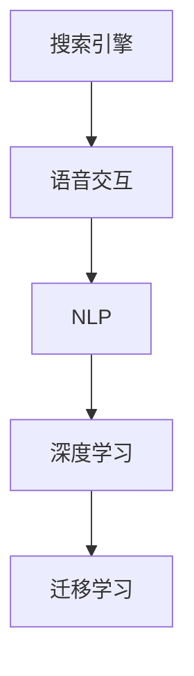

                 

# 搜索引擎的语音交互优化

> 关键词：语音交互, 自然语言处理, 机器学习, 深度学习, 搜索引擎优化, 用户行为分析

## 1. 背景介绍

### 1.1 问题由来
搜索引擎作为互联网用户获取信息的主要渠道，近年来在语音交互技术上取得了显著的进展。随着智能音箱、手机语音助手等设备的普及，越来越多的用户习惯于使用语音进行搜索。然而，尽管语音搜索技术在识别率和响应速度上有了长足进步，但仍存在诸多痛点，如理解和生成自然语言的能力不足、搜索结果与用户意图匹配度不高等问题。因此，如何优化搜索引擎的语音交互，提升用户的搜索体验，成为了当前研究的热点问题。

### 1.2 问题核心关键点
语音交互优化的核心在于通过自然语言处理(Natural Language Processing, NLP)技术，提高搜索引擎理解和生成自然语言的能力，实现与用户的精准对话。这主要包括：
1. **识别准确率提升**：通过改进声学模型和语言模型，提高语音识别的准确率。
2. **理解意图深化**：通过深度学习技术，提升搜索引擎对用户查询意图的理解能力。
3. **结果推荐优化**：根据用户的语音查询，推荐最相关的搜索结果。
4. **上下文管理**：在多轮对话中，正确处理上下文信息，确保对话流畅。
5. **交互自然度增强**：使对话更接近自然语言，提升用户体验。

这些关键点需要系统性优化，从而大幅提升语音交互的效果和用户体验。

### 1.3 问题研究意义
优化搜索引擎的语音交互技术，对于提升搜索引擎的用户粘性、提高信息获取效率、推动人工智能技术在日常生活中的应用具有重要意义：

1. **用户体验改善**：通过语音搜索，用户能够更方便地进行信息查询，提升搜索效率。
2. **信息获取精准度提高**：优化后的语音交互能够更好地理解用户的查询意图，提供更准确的搜索结果。
3. **技术应用普及**：语音交互技术的应用能够推动人工智能技术在更多场景中的普及，如智能家居、车载系统等。
4. **社会效益显著**：语音搜索技术的应用，能够帮助残障人士、老年人等群体更方便地获取信息，提升社会的包容性。

## 2. 核心概念与联系

### 2.1 核心概念概述

为更好地理解搜索引擎语音交互的优化方法，本节将介绍几个密切相关的核心概念：

- **搜索引擎**：通过爬虫抓取互联网上的网页，根据用户输入的关键词返回相关网页列表，为用户提供信息检索服务。
- **语音交互**：通过语音输入和语音反馈，实现人与机器的对话交互。
- **自然语言处理(NLP)**：涵盖语音识别、语音合成、语义理解、意图识别、实体识别等技术，用于理解和生成自然语言。
- **深度学习**：通过多层神经网络结构，模拟人脑的逻辑推理过程，应用于图像识别、语音识别、自然语言处理等领域。
- **迁移学习**：利用已有的大规模预训练模型，在新数据上微调优化，加速模型收敛，提高性能。

这些概念之间的逻辑关系可以通过以下Mermaid流程图来展示：



这个流程图展示了几大核心概念及其之间的关系：

1. 搜索引擎通过语音交互获取用户输入，使用NLP技术进行理解和处理。
2. NLP技术依赖深度学习技术，通过多层神经网络模拟语言的逻辑推理。
3. 深度学习模型通常通过迁移学习方式，在大规模预训练数据上获取通用语言表示，在新数据上微调优化。

## 3. 核心算法原理 & 具体操作步骤

### 3.1 算法原理概述

搜索引擎语音交互优化主要涉及自然语言处理技术，其核心思想是通过深度学习模型对语音输入进行理解，并在搜索结果推荐中应用。

假设用户的语音输入为 $x$，搜索结果为 $y$，语音交互优化的目标函数为 $f(x, y)$。优化目标是通过深度学习模型训练，最大化 $f(x, y)$ 的值，从而提升语音交互的效果。具体步骤如下：

1. **语音识别**：将用户的语音输入转化为文本，生成文本序列 $t$。
2. **语义理解**：使用深度学习模型对文本序列 $t$ 进行语义解析，生成意图表示 $i$。
3. **搜索结果推荐**：根据意图表示 $i$，查询对应的搜索结果 $y$，并按照相关性排序，生成推荐列表。
4. **上下文管理**：根据对话历史，更新上下文信息，确保对话流畅。
5. **反馈调整**：根据用户反馈，调整模型参数，进一步提升交互效果。

### 3.2 算法步骤详解

以下是搜索引擎语音交互优化的详细算法步骤：

**Step 1: 语音识别**
- 使用声学模型将用户语音 $x$ 转化为文本序列 $t$，例如：使用DeepSpeech等开源声学模型。
- 使用语言模型对文本序列 $t$ 进行校正，例如：使用OpenAI的GPT-2模型。

**Step 2: 语义理解**
- 使用BERT、RoBERTa等深度学习模型对文本序列 $t$ 进行语义解析，生成意图表示 $i$。
- 使用注意力机制对文本序列进行编码，提取关键特征，例如：Transformer模型。

**Step 3: 搜索结果推荐**
- 使用TF-IDF、BM25等技术对网页进行相似度计算，生成搜索结果列表 $y$。
- 使用深度学习模型对搜索结果进行排序，例如：使用TensorFlow或PyTorch实现的深度神经网络。

**Step 4: 上下文管理**
- 使用RNN、LSTM等模型处理对话历史，生成上下文表示 $c$。
- 在推荐过程中加入上下文信息 $c$，优化搜索结果 $y$。

**Step 5: 反馈调整**
- 收集用户反馈，例如：点击率、满意度等。
- 使用强化学习技术对模型进行优化，例如：使用DQN、PPO等算法。

**Step 6: 模型融合**
- 对不同的深度学习模型进行融合，例如：使用Stacking、Blending等方法。
- 使用元学习技术进行模型更新，例如：使用Meta-Learning、Optuna等工具。

### 3.3 算法优缺点

基于深度学习的搜索引擎语音交互优化方法，具有以下优点：

1. **效果好**：深度学习模型能够处理复杂的语言逻辑，理解用户意图，生成高质量的搜索结果。
2. **泛化能力强**：通过大规模预训练数据，模型能够在不同场景下取得良好表现。
3. **可扩展性高**：深度学习模型可以通过微调和融合进行优化，适应不同的语音交互场景。

同时，该方法也存在一些局限性：

1. **计算资源需求高**：深度学习模型需要大量计算资源进行训练和推理，增加了系统的部署成本。
2. **训练时间长**：深度学习模型训练周期较长，需要大量标注数据和计算资源。
3. **模型复杂度高**：深度学习模型结构复杂，调试和优化难度大。
4. **可解释性不足**：深度学习模型的决策过程难以解释，存在黑盒问题。

尽管存在这些局限性，但深度学习技术在语音交互优化中的广泛应用，已经证明了其在提升用户体验和搜索效率方面的巨大潜力。未来相关研究将继续深入优化模型的训练过程和结构设计，提升其泛化能力和可解释性。

### 3.4 算法应用领域

基于深度学习的搜索引擎语音交互优化方法，已经在众多领域得到了广泛应用，例如：

- **智能音箱**：如Amazon的Alexa、Google Assistant等，通过语音交互提供信息查询、娱乐、家居控制等服务。
- **车载导航**：在汽车导航系统中，通过语音交互实现导航指令输入，提高驾驶安全性。
- **智能客服**：在客服系统中，通过语音交互提供自动化回答，提升客户满意度。
- **语音搜索**：如Google搜索、Bing搜索等，通过语音输入进行信息查询，提供无缝的用户体验。

除了上述这些经典应用外，语音交互优化技术也在更多场景中得到应用，如家庭娱乐、健康医疗、教育培训等，为各行各业带来了全新的交互方式。

## 4. 数学模型和公式 & 详细讲解 & 举例说明

### 4.1 数学模型构建

本节将使用数学语言对搜索引擎语音交互优化的数学模型进行更加严格的刻画。

假设用户的语音输入为 $x$，搜索结果为 $y$。设深度学习模型为 $M_{\theta}$，其中 $\theta$ 为模型参数。优化目标为最大化模型 $M_{\theta}$ 在语音输入 $x$ 和搜索结果 $y$ 上的得分函数 $f(x, y)$。

数学模型可以表示为：

$$
\max_{\theta} f(x, y) = \log M_{\theta}(y|x)
$$

其中 $M_{\theta}(y|x)$ 为深度学习模型在给定语音输入 $x$ 下，生成搜索结果 $y$ 的概率分布。

### 4.2 公式推导过程

以下我们以用户查询意图识别为例，推导深度学习模型在语义理解中的关键公式。

假设用户查询为 $q$，模型生成的意图表示为 $i$。使用Transformer模型进行语义理解，假设输入序列为 $q$，输出序列为 $i$，中间层的表示为 $h$。

输入序列 $q$ 的编码过程可以表示为：

$$
q = x_1, x_2, ..., x_n
$$

输出序列 $i$ 的解码过程可以表示为：

$$
i = y_1, y_2, ..., y_m
$$

其中 $x_i$ 和 $y_j$ 分别为输入和输出序列的词汇表。中间层的表示 $h$ 可以表示为：

$$
h = M_{\theta}(q) = \{h_1, h_2, ..., h_n\}
$$

其中 $h_i$ 为输入序列 $q$ 中第 $i$ 个词汇的表示。根据Transformer模型，可以定义解码过程为：

$$
i = \arg\max_{i} \exp\left(\sum_{j=1}^{m} K_{i,j}V_{j}\right)
$$

其中 $K_{i,j}$ 和 $V_j$ 为Transformer模型中的注意力权重和中间层表示 $h$ 的投影。最终，意图表示 $i$ 的生成过程可以表示为：

$$
i = M_{\theta}(q) = \exp\left(\sum_{j=1}^{m} K_{i,j}V_{j}\right)
$$

### 4.3 案例分析与讲解

假设用户在智能音箱上查询“明天天气怎么样？”，语音识别系统将其转化为文本“明天天气怎么样？”。使用深度学习模型对文本进行语义理解，生成意图表示为“查询天气”。

查询“天气”这一意图，系统可以调用天气查询API，返回当前的天气情况，例如：“北京今天晴，温度25℃”。

最终，语音交互系统通过查询API，返回天气信息，生成对话回复：“明天北京天气晴，温度27℃”。

## 5. 项目实践：代码实例和详细解释说明

### 5.1 开发环境搭建

在进行语音交互优化实践前，我们需要准备好开发环境。以下是使用Python进行TensorFlow开发的环境配置流程：

1. 安装Anaconda：从官网下载并安装Anaconda，用于创建独立的Python环境。

2. 创建并激活虚拟环境：
```bash
conda create -n tf-env python=3.8 
conda activate tf-env
```

3. 安装TensorFlow：根据CUDA版本，从官网获取对应的安装命令。例如：
```bash
pip install tensorflow==2.5.0
```

4. 安装其他工具包：
```bash
pip install numpy pandas scikit-learn tfidfvectorizer gensim
```

完成上述步骤后，即可在`tf-env`环境中开始语音交互优化的实践。

### 5.2 源代码详细实现

下面以用户查询意图识别为例，给出使用TensorFlow进行深度学习模型训练的代码实现。

首先，准备数据集：

```python
import tensorflow as tf
import numpy as np
from sklearn.model_selection import train_test_split
from sklearn.feature_extraction.text import TfidfVectorizer

# 准备数据集
data = {"text": ["今天天气怎么样？", "明天会下雨吗？", "北京现在什么天气？"],
        "label": ["查询天气", "查询天气", "查询天气"]}
vectorizer = TfidfVectorizer()
X = vectorizer.fit_transform(data["text"])
y = np.array([0, 1, 0])  # 0表示不是查询天气，1表示查询天气

# 划分训练集和测试集
X_train, X_test, y_train, y_test = train_test_split(X.toarray(), y, test_size=0.2)
```

然后，定义模型和训练过程：

```python
from tensorflow.keras import layers, models

# 定义模型
model = models.Sequential([
    layers.Embedding(input_dim=vectorizer.vocabulary_size, output_dim=128),
    layers.LSTM(128),
    layers.Dense(1, activation='sigmoid')
])

# 编译模型
model.compile(optimizer='adam', loss='binary_crossentropy', metrics=['accuracy'])

# 训练模型
model.fit(X_train, y_train, epochs=10, validation_data=(X_test, y_test))
```

最后，在测试集上评估模型：

```python
# 在测试集上评估模型
test_loss, test_acc = model.evaluate(X_test, y_test)
print(f"Test accuracy: {test_acc}")
```

以上就是使用TensorFlow进行深度学习模型训练的完整代码实现。可以看到，TensorFlow提供了强大的图计算和自动微分能力，使得深度学习模型的训练和优化变得非常便捷。

### 5.3 代码解读与分析

让我们再详细解读一下关键代码的实现细节：

**数据准备**：
- 使用Scikit-learn中的TfidfVectorizer将文本转换为TF-IDF向量，用于模型训练。
- 准备数据集，包含文本和对应的意图标签。

**模型定义**：
- 使用Sequential模型定义深度学习模型结构。
- 包括嵌入层、LSTM层和全连接层。
- 嵌入层用于将文本转换为向量表示，LSTM层用于提取序列特征，全连接层用于生成意图表示。

**模型编译**：
- 使用Adam优化器和二元交叉熵损失函数，进行模型编译。
- 使用准确率作为评估指标，评估模型在训练和测试上的表现。

**模型训练**：
- 使用fit方法对模型进行训练，设置训练轮数。
- 在训练过程中使用验证集，实时监测模型性能。

**模型评估**：
- 使用evaluate方法在测试集上评估模型性能，输出准确率。

可以看到，TensorFlow在深度学习模型的训练和优化上提供了强大的工具支持，使得模型的构建和调试变得更加简单和高效。

## 6. 实际应用场景

### 6.1 智能音箱

智能音箱作为语音交互的主要场景之一，通过深度学习模型优化语音交互，能够提供更加智能和个性化的服务。例如：

- **个性化推荐**：根据用户的查询意图和历史行为，推荐相关音乐、新闻等。
- **实时对话**：在对话过程中，通过上下文管理，实现多轮对话。
- **智能控制**：通过语音控制家中的智能设备，如灯光、空调等。

### 6.2 车载导航

车载导航系统通过深度学习模型优化语音交互，能够提升驾驶安全和用户体验。例如：

- **导航指令输入**：通过语音输入，控制导航系统进行路线规划和目的地设置。
- **语音导航提示**：在驾驶过程中，通过语音提示实时反馈导航信息。
- **紧急呼叫**：在紧急情况下，通过语音指令快速求助。

### 6.3 智能客服

智能客服系统通过深度学习模型优化语音交互，能够提供自动化的回答和服务。例如：

- **自动回答**：通过语义理解，快速回答常见问题。
- **上下文管理**：在对话过程中，根据上下文信息提供准确的回答。
- **语音转文本**：在对话过程中，将语音输入转换为文本，提高处理的效率和准确性。

### 6.4 未来应用展望

随着深度学习技术的发展，搜索引擎语音交互优化将在更多领域得到应用，为人们的生活带来更多的便捷和智能。

- **智慧医疗**：通过语音交互，医生能够快速获取患者信息，进行诊断和治疗。
- **智能家居**：通过语音控制家中的智能设备，提升家居生活的智能化水平。
- **教育培训**：通过语音交互，提供个性化的学习辅导和互动教学。
- **娱乐媒体**：通过语音交互，提供个性化的娱乐推荐和媒体服务。

## 7. 工具和资源推荐

### 7.1 学习资源推荐

为了帮助开发者系统掌握深度学习技术，并应用于搜索引擎语音交互优化，这里推荐一些优质的学习资源：

1. 《深度学习》课程（Coursera）：由Andrew Ng教授开设的深度学习入门课程，涵盖深度学习的基础知识和应用实例。
2. 《自然语言处理入门》课程（edX）：由MIT教授开设的自然语言处理入门课程，涵盖NLP技术的基本概念和经典模型。
3. 《TensorFlow实战》书籍：TensorFlow的官方文档和书籍，涵盖TensorFlow的基本用法和高级应用。
4. 《TensorFlow与深度学习》书籍：Google官方出版的TensorFlow深度学习实践指南，涵盖TensorFlow在NLP、计算机视觉等领域的应用。
5. 《深度学习基础》书籍：深度学习领域的经典入门书籍，涵盖深度学习的基本原理和算法。

通过对这些资源的学习实践，相信你一定能够快速掌握深度学习技术，并应用于搜索引擎语音交互优化。

### 7.2 开发工具推荐

高效的开发离不开优秀的工具支持。以下是几款用于深度学习模型训练和优化开发的常用工具：

1. TensorFlow：由Google主导开发的深度学习框架，支持分布式计算和GPU加速，适合大规模工程应用。
2. PyTorch：由Facebook开发的深度学习框架，灵活动态的计算图，适合快速迭代研究。
3. Keras：高级深度学习框架，提供了简单易用的API，适合初学者入门。
4. Scikit-learn：Python数据处理和机器学习库，提供丰富的数据处理和模型评估工具。
5. HuggingFace Transformers库：提供预训练语言模型和模型优化工具，加速NLP任务的开发。

合理利用这些工具，可以显著提升深度学习模型的训练效率和优化效果，加快创新迭代的步伐。

### 7.3 相关论文推荐

深度学习技术的发展源于学界的持续研究。以下是几篇奠基性的相关论文，推荐阅读：

1. Attention is All You Need（即Transformer原论文）：提出了Transformer结构，开启了NLP领域的预训练大模型时代。
2. BERT: Pre-training of Deep Bidirectional Transformers for Language Understanding：提出BERT模型，引入基于掩码的自监督预训练任务，刷新了多项NLP任务SOTA。
3. Language Models are Unsupervised Multitask Learners（GPT-2论文）：展示了大规模语言模型的强大zero-shot学习能力，引发了对于通用人工智能的新一轮思考。
4. Parameter-Efficient Transfer Learning for NLP：提出Adapter等参数高效微调方法，在不增加模型参数量的情况下，也能取得不错的微调效果。
5. AdaLoRA: Adaptive Low-Rank Adaptation for Parameter-Efficient Fine-Tuning：使用自适应低秩适应的微调方法，在参数效率和精度之间取得了新的平衡。

这些论文代表了大语言模型微调技术的发展脉络。通过学习这些前沿成果，可以帮助研究者把握学科前进方向，激发更多的创新灵感。

## 8. 总结：未来发展趋势与挑战

### 8.1 总结

本文对搜索引擎语音交互优化方法进行了全面系统的介绍。首先阐述了语音交互优化的背景和重要性，明确了深度学习模型在优化中的核心作用。其次，从原理到实践，详细讲解了深度学习模型在语音识别、语义理解、搜索结果推荐等方面的关键技术和操作流程，给出了完整的代码实例。同时，本文还广泛探讨了语音交互优化技术在智能音箱、车载导航、智能客服等多个领域的应用前景，展示了语音交互技术的巨大潜力。最后，本文精选了深度学习技术的各类学习资源，力求为读者提供全方位的技术指引。

通过本文的系统梳理，可以看到，深度学习模型在搜索引擎语音交互优化中发挥了关键作用，极大地提升了语音交互的效果和用户体验。未来，伴随深度学习技术的发展，语音交互优化技术还将持续进步，为人们的生活带来更多的便捷和智能。

### 8.2 未来发展趋势

展望未来，深度学习在搜索引擎语音交互优化中将呈现以下几个发展趋势：

1. **语音识别精度提升**：通过改进声学模型和语言模型，提高语音识别的准确率，减少误识别和遗漏。
2. **语义理解能力增强**：使用更复杂的深度学习模型，如Transformer、BERT等，提升语义理解能力，准确解析用户查询意图。
3. **搜索结果优化**：引入更多自然语言处理技术，如实体识别、关系抽取等，提高搜索结果的相关性和多样性。
4. **上下文管理优化**：使用更先进的上下文管理技术，如RNN、LSTM、GRU等，提升多轮对话的流畅性和连贯性。
5. **交互自然度提升**：引入自然语言生成技术，生成更自然、流畅的对话回复，提升用户体验。

这些趋势将进一步提升语音交互的效果和用户体验，推动深度学习技术在搜索引擎语音交互优化中的应用。

### 8.3 面临的挑战

尽管深度学习技术在搜索引擎语音交互优化中取得了显著进展，但仍面临诸多挑战：

1. **计算资源需求高**：深度学习模型需要大量计算资源进行训练和推理，增加了系统的部署成本。
2. **训练时间长**：深度学习模型训练周期较长，需要大量标注数据和计算资源。
3. **模型复杂度高**：深度学习模型结构复杂，调试和优化难度大。
4. **可解释性不足**：深度学习模型的决策过程难以解释，存在黑盒问题。

尽管存在这些挑战，但随着深度学习技术的不断进步，语音交互优化技术将在更多领域得到应用，为人们的生活带来更多的便捷和智能。未来研究需要在模型结构、训练效率、可解释性等方面进行深入探索，以进一步提升语音交互的效果和用户体验。

### 8.4 研究展望

面对深度学习在搜索引擎语音交互优化中面临的挑战，未来的研究需要在以下几个方面寻求新的突破：

1. **无监督和半监督学习**：摆脱对大规模标注数据的依赖，利用自监督学习、主动学习等无监督和半监督范式，最大限度利用非结构化数据，实现更加灵活高效的语音交互优化。
2. **模型压缩和加速**：开发更加轻量级的深度学习模型，通过模型压缩和加速技术，减少计算资源需求，提升实时性。
3. **多模态融合**：引入视觉、听觉等多模态数据，提升语音交互的理解能力和泛化能力。
4. **可解释性和可控性**：开发更可解释的深度学习模型，提供更好的决策解释和用户控制手段，提升系统的透明度和安全性。
5. **多任务学习和迁移学习**：通过多任务学习和迁移学习技术，提升模型的泛化能力和适用性。

这些研究方向将推动深度学习技术在搜索引擎语音交互优化中的应用，为人们的生活带来更多的便捷和智能。通过不断创新和突破，深度学习技术必将在搜索引擎语音交互优化中发挥更大的作用，推动人工智能技术在更多领域的发展和应用。

## 9. 附录：常见问题与解答

**Q1：搜索引擎的语音交互优化技术有哪些？**

A: 搜索引擎的语音交互优化技术主要包括深度学习模型在语音识别、语义理解、搜索结果推荐等方面的应用。常见的技术包括：

1. **声学模型**：如DeepSpeech、Wav2Vec等，用于将语音输入转换为文本。
2. **语言模型**：如LSTM、GRU、Transformer等，用于理解文本序列，生成意图表示。
3. **深度学习模型**：如BERT、RoBERTa等，用于语义理解、实体识别、关系抽取等。
4. **多任务学习和迁移学习**：通过多任务学习和迁移学习技术，提升模型的泛化能力和适用性。

**Q2：深度学习模型在语音交互优化中需要哪些计算资源？**

A: 深度学习模型在语音交互优化中需要大量计算资源进行训练和推理，具体包括：

1. **CPU**：用于模型构建和数据预处理。
2. **GPU**：用于模型训练和推理，加速计算过程。
3. **TPU**：用于大规模深度学习模型的训练，提供更高的计算效率。
4. **内存**：用于存储模型参数和中间结果。
5. **存储**：用于存储训练数据和模型权重。

**Q3：如何提高深度学习模型的可解释性？**

A: 提高深度学习模型的可解释性可以从以下几个方面进行：

1. **模型可视化**：使用可视化工具，如TensorBoard、Visdom等，展示模型的内部结构和参数分布。
2. **特征提取**：使用特征提取技术，将模型内部表示映射到可解释的空间，如PCA、t-SNE等。
3. **模型蒸馏**：使用模型蒸馏技术，将复杂模型压缩为轻量级模型，提升可解释性。
4. **解释生成**：使用解释生成技术，生成模型决策的解释，如LIME、SHAP等。

**Q4：如何优化搜索引擎的搜索结果？**

A: 优化搜索引擎的搜索结果主要涉及以下几个方面：

1. **关键词优化**：通过TF-IDF、BM25等技术，提高关键词的匹配度。
2. **相似度计算**：使用相似度计算技术，如余弦相似度、Jaccard相似度等，提高搜索结果的相关性。
3. **上下文管理**：通过RNN、LSTM等模型，处理对话历史，生成上下文表示，优化搜索结果。
4. **多模态融合**：引入视觉、听觉等多模态数据，提升语音交互的理解能力和泛化能力。

**Q5：如何设计高效的语音交互系统？**

A: 设计高效的语音交互系统主要涉及以下几个方面：

1. **数据准备**：准备高质量的标注数据，涵盖多种语音和文本场景。
2. **模型选择**：选择适合的深度学习模型，如BERT、RoBERTa等，进行语义理解。
3. **模型优化**：通过微调、融合、蒸馏等技术，优化模型性能。
4. **上下文管理**：使用RNN、LSTM等模型，处理对话历史，生成上下文表示，优化搜索结果。
5. **用户反馈**：收集用户反馈，实时调整模型参数，优化用户体验。

以上是基于深度学习的搜索引擎语音交互优化技术及其应用的全面介绍。通过深入理解这些核心概念和技术，相信你一定能够掌握搜索引擎语音交互优化的精髓，并将其应用于实际应用场景中。

