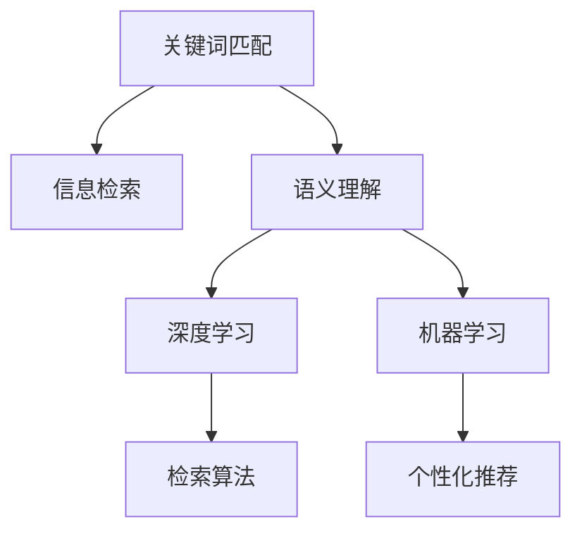
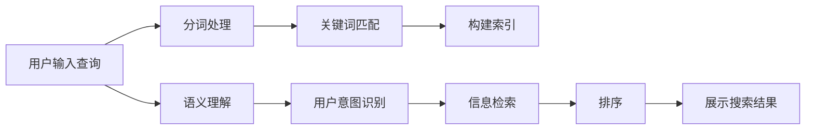

                 

## 1. 背景介绍

在过去的几十年中，搜索引擎已经从简单的关键词匹配演变到如今更加智能的语义理解，这一转变极大地改变了我们的信息获取方式。搜索引擎的进步不仅体现在搜索效率的提升，还在于能够提供更准确、相关且富有洞见的搜索结果。本文将探讨这一转变背后的关键技术原理、实施步骤，以及如何通过这些技术实现搜索引擎的革命。

## 2. 核心概念与联系

### 2.1 核心概念概述

1. **关键词匹配**：搜索引擎的初始阶段主要基于关键词匹配，用户输入的查询与网站内容中的关键词进行匹配，找到相关性高的网页。

2. **语义理解**：语义理解是指搜索引擎能够理解用户查询的深层含义，通过自然语言处理(NLP)和机器学习等技术，将用户查询转化为更丰富的信息表示。

3. **信息检索**：信息检索是搜索引擎的核心任务，涉及文本处理、索引构建、匹配算法等技术，旨在快速找到与用户查询最相关的网页。

4. **机器学习**：机器学习在搜索引擎中主要用于用户行为分析、个性化推荐、排序算法等环节，通过不断学习用户数据和反馈，提高搜索结果的相关性和用户体验。

5. **深度学习**：深度学习在搜索引擎中的应用越来越广泛，特别是在预训练语言模型和自监督学习等技术的驱动下，语义理解的精度和范围不断扩展。

这些概念之间的联系可以通过以下Mermaid流程图来展示：



### 2.2 核心概念原理和架构的 Mermaid 流程图



## 3. 核心算法原理 & 具体操作步骤

### 3.1 算法原理概述

搜索引擎的语义理解能力是通过结合NLP和机器学习技术实现的。核心算法原理包括：

1. **分词和词向量表示**：将用户查询和网页内容分解成词汇，并通过词向量模型如Word2Vec或GloVe，将词汇转化为向量表示，便于机器进行理解。

2. **语义角色标注**：使用自然语言处理技术，识别句子中的主语、宾语、谓语等语义角色，以便于理解句子结构。

3. **实体识别和关系抽取**：通过命名实体识别(NER)和关系抽取技术，从文本中提取人名、地名、组织机构等实体，以及实体之间的关系。

4. **语义相似度计算**：通过计算查询和网页内容之间的语义相似度，选择合适的网页返回。

5. **机器学习排序**：结合用户点击行为、网页权威度等特征，使用如Adaboost、SVM等算法，进行排序优化。

### 3.2 算法步骤详解

#### 3.2.1 分词和词向量表示

分词是理解自然语言的基础步骤，通过将文本分解为词汇，便于后续处理。常见的分词工具包括Jieba、NLTK等。词向量表示是将词汇转化为低维向量，便于机器理解。

#### 3.2.2 语义角色标注和实体识别

语义角色标注通过标注句子中各词汇的语义角色，理解句子结构。实体识别通过识别文本中的实体，提取人名、地名、组织机构等信息。

#### 3.2.3 语义相似度计算

语义相似度计算是搜索引擎的核心算法之一，通过计算查询和网页内容的语义相似度，确定相关网页的排序。常见的相似度计算方法包括余弦相似度、Jaccard相似度等。

#### 3.2.4 机器学习排序

机器学习排序通过学习用户行为和网页特征，进行排序优化。常用的排序算法包括Adaboost、SVM、随机森林等。

### 3.3 算法优缺点

#### 3.3.1 优点

1. **提高相关性**：语义理解技术能够更好地理解用户查询的深层含义，提高搜索结果的相关性。
2. **减少噪音**：通过语义分析和实体识别，能够有效过滤掉与用户查询无关的网页，减少噪音。
3. **个性化推荐**：通过机器学习算法，能够根据用户的历史行为和偏好，提供个性化的搜索结果。

#### 3.3.2 缺点

1. **计算复杂度高**：语义理解涉及复杂的NLP处理，计算复杂度高，需要高性能的硬件支持。
2. **数据依赖性强**：语义理解效果依赖于大量高质量的标注数据，数据获取成本较高。
3. **模型可解释性不足**：深度学习模型如BERT、GPT等，由于其黑盒特性，难以解释其内部工作机制。

### 3.4 算法应用领域

语义理解技术已经在多个领域得到应用，例如：

1. **电子商务**：通过语义理解技术，能够理解用户的购物意图，提供个性化推荐。
2. **医疗**：在医疗搜索中，通过理解患者描述，能够更准确地推荐相关疾病和疗法。
3. **金融**：通过理解用户查询，能够提供定制化的金融产品推荐。
4. **法律**：在法律搜索中，通过语义理解，能够更准确地找到相关的法律法规。
5. **教育**：在教育搜索中，通过理解用户的问题，能够提供合适的教育资源。

## 4. 数学模型和公式 & 详细讲解 & 举例说明

### 4.1 数学模型构建

假设用户查询为 $q$，网页内容为 $d$，模型的目标是通过语义理解，找到与 $q$ 最相关的网页 $d_r$。

数学模型可以表示为：

$$
\max_{d_r} \text{Relevance}(q, d_r)
$$

其中，$\text{Relevance}(q, d_r)$ 表示 $q$ 和 $d_r$ 的相关性。

### 4.2 公式推导过程

在构建数学模型后，我们通过以下步骤进行公式推导：

1. **分词和词向量表示**：将查询 $q$ 和网页内容 $d$ 分解为词汇，并通过词向量模型，将词汇转化为向量表示。

2. **语义角色标注**：通过语义角色标注，提取查询和网页内容中的主语、谓语、宾语等语义角色。

3. **实体识别**：通过实体识别，提取查询和网页内容中的实体信息。

4. **语义相似度计算**：通过计算查询和网页内容之间的语义相似度，确定相关性得分。

5. **机器学习排序**：通过学习用户行为和网页特征，进行排序优化。

### 4.3 案例分析与讲解

以医疗搜索为例，用户输入的查询可能是“胃痛”。通过语义理解，能够识别出查询中的“胃”和“痛”，并将其转化为向量表示。同时，搜索引擎能够理解用户查询的深层含义，识别出用户可能想要了解的症状、病因等信息。

通过对网页内容进行分词、词向量表示、语义角色标注、实体识别等处理，计算查询和网页内容之间的语义相似度，并结合用户行为和网页特征，进行排序优化，最终返回最相关的医疗信息。

## 5. 项目实践：代码实例和详细解释说明

### 5.1 开发环境搭建

1. **安装Python**：
   ```bash
   sudo apt update
   sudo apt install python3 python3-pip
   ```

2. **安装相关库**：
   ```bash
   pip install jieba
   pip install gensim
   pip install scikit-learn
   ```

3. **搭建环境**：
   ```bash
   conda create -n search-env python=3.7
   conda activate search-env
   ```

### 5.2 源代码详细实现

#### 5.2.1 分词和词向量表示

```python
import jieba
from gensim.models import Word2Vec

# 分词
def cut_text(text):
    return jieba.cut(text)

# 构建词向量模型
def build_word2vec_model(texts):
    model = Word2Vec(texts, size=100, window=5, min_count=1)
    return model
```

#### 5.2.2 语义角色标注和实体识别

```python
import spacy
from spacy.matcher import Matcher

# 语义角色标注
def parse_sentence(sentence):
    doc = nlp(sentence)
    return {token.text: token.dep_ for token in doc}

# 实体识别
def recognize_entities(text):
    doc = nlp(text)
    return [ent.text for ent in doc.ents]
```

#### 5.2.3 语义相似度计算

```python
from gensim import corpora, models

# 计算相似度
def compute_similarity(query, doc):
    vec_bow = models.TfidfModel(corpora.Dictionary(doc))
    query_bow = vec_bow[query]
    doc_bow = vec_bow[doc]
    return doc_bow.dot(query_bow) / (np.linalg.norm(doc_bow) * np.linalg.norm(query_bow))
```

### 5.3 代码解读与分析

通过上述代码，我们可以实现对查询和网页内容的分词、词向量表示、语义角色标注和实体识别等操作。这些步骤是实现语义理解的基础。

## 6. 实际应用场景

### 6.1 智能客服系统

智能客服系统通过语义理解技术，能够自动理解用户意图，提供准确的答案。例如，用户输入“我的订单在哪里”，系统能够理解查询中的“订单”和“位置”，并提供“订单状态查询”的响应。

### 6.2 金融投资

在金融投资领域，语义理解技术能够帮助用户快速找到相关的金融产品和服务。例如，用户输入“如何理财”，系统能够理解查询中的“理财”，并推荐相关的投资建议。

### 6.3 教育培训

教育培训领域中，语义理解技术能够帮助学生和教师找到合适的教育资源。例如，用户输入“Python教程”，系统能够理解查询中的“Python”和“教程”，并推荐相关的在线课程和资料。

## 7. 工具和资源推荐

### 7.1 学习资源推荐

1. **《自然语言处理综论》**：介绍自然语言处理的基本概念和技术，涵盖分词、词向量、语义角色标注等主题。
2. **《深度学习》**：深入介绍深度学习的基本原理和应用，涵盖卷积神经网络、循环神经网络等主题。
3. **《Python NLP》**：介绍使用Python进行自然语言处理的实践，涵盖分词、词向量、实体识别等主题。
4. **《机器学习实战》**：介绍机器学习的基本概念和技术，涵盖监督学习、无监督学习等主题。

### 7.2 开发工具推荐

1. **NLTK**：Python自然语言处理库，提供分词、词向量、语义角色标注等工具。
2. **SpaCy**：Python自然语言处理库，提供分词、词向量、实体识别等工具。
3. **Gensim**：Python自然语言处理库，提供词向量模型和语义相似度计算工具。

### 7.3 相关论文推荐

1. **《用于信息检索的深度神经网络模型》**：介绍深度神经网络在信息检索中的应用。
2. **《基于语义理解的智能搜索系统》**：介绍基于语义理解的搜索系统的设计和实现。
3. **《自然语言处理和搜索引擎技术的发展》**：介绍自然语言处理和搜索引擎技术的发展历程和未来趋势。

## 8. 总结：未来发展趋势与挑战

### 8.1 研究成果总结

基于语义理解的搜索引擎已经在多个领域得到应用，显著提升了用户体验和信息获取效率。

### 8.2 未来发展趋势

1. **多模态搜索引擎**：未来将探索结合图像、视频等多模态数据，构建更加全面的搜索引擎。
2. **个性化推荐系统**：未来将进一步提升个性化推荐系统的精度和覆盖面。
3. **联邦学习**：未来将探索在用户隐私保护的前提下，利用联邦学习进行分布式模型训练。
4. **实时数据处理**：未来将探索在实时数据流下，进行语义理解和信息检索。

### 8.3 面临的挑战

1. **数据获取和标注**：高质量的数据获取和标注成本较高，数据多样性和覆盖面不足。
2. **计算资源需求高**：语义理解涉及复杂的计算，需要高性能的硬件支持。
3. **模型可解释性不足**：深度学习模型难以解释其内部工作机制，影响用户体验和信任度。

### 8.4 研究展望

未来将在以下几个方向进行探索：

1. **联邦学习**：探索在用户隐私保护的前提下，利用联邦学习进行分布式模型训练，减少数据传输和模型泄露的风险。
2. **多模态数据融合**：探索结合图像、视频等多模态数据，构建更加全面的搜索引擎。
3. **实时数据处理**：探索在实时数据流下，进行语义理解和信息检索，提升用户体验。
4. **可解释性**：探索提高深度学习模型的可解释性，增强用户体验和信任度。

## 9. 附录：常见问题与解答

**Q1：如何提高搜索引擎的语义理解能力？**

A: 提高搜索引擎的语义理解能力可以从以下几个方面入手：

1. **改进分词算法**：选择更高效、更准确的分词算法，如Jieba、NLTK等。
2. **扩展词向量模型**：使用预训练的词向量模型，如GloVe、Word2Vec，并在大量语料上进行微调，提高词向量表示的质量。
3. **增强语义角色标注和实体识别**：使用SpaCy等自然语言处理库，提升语义角色标注和实体识别的准确性。
4. **优化语义相似度计算方法**：选择更合适的相似度计算方法，如余弦相似度、Jaccard相似度等，并优化算法实现。

**Q2：搜索引擎如何实现个性化推荐？**

A: 搜索引擎实现个性化推荐主要通过以下步骤：

1. **收集用户行为数据**：通过用户的搜索历史、点击行为等数据，收集用户的偏好信息。
2. **构建用户画像**：利用机器学习算法，构建用户画像，描述用户的兴趣和偏好。
3. **推荐算法优化**：使用如协同过滤、基于内容的推荐等算法，进行排序优化，提高推荐精度。
4. **实时数据更新**：通过实时数据流，更新用户画像和推荐算法，实现动态调整。

**Q3：搜索引擎的计算复杂度如何优化？**

A: 搜索引擎的计算复杂度优化可以从以下几个方面入手：

1. **分布式计算**：通过分布式计算框架，如Hadoop、Spark，优化计算资源分配。
2. **硬件加速**：使用GPU、TPU等硬件设备，提高计算速度。
3. **模型压缩**：使用模型压缩技术，减少模型大小和计算量。
4. **算法优化**：优化算法实现，减少不必要的计算。

**Q4：搜索引擎的实时数据处理能力如何提升？**

A: 搜索引擎的实时数据处理能力可以通过以下方式提升：

1. **分布式数据存储**：使用分布式存储系统，如Hadoop、HBase，提高数据存储和读取效率。
2. **流式处理**：使用流式处理框架，如Apache Kafka、Apache Flink，实时处理数据流。
3. **模型在线学习**：使用在线学习算法，动态更新模型参数，提高实时处理能力。

---

作者：禅与计算机程序设计艺术 / Zen and the Art of Computer Programming

