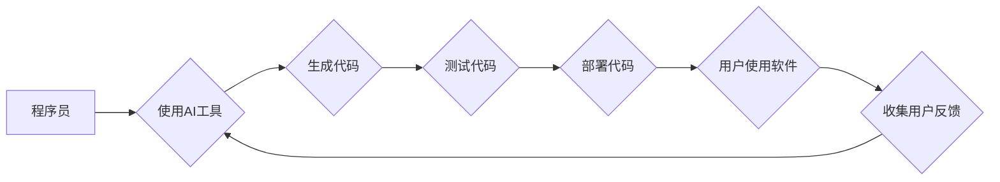

> 人工智能，程序员，挑战，机遇，未来，学习，适应，转型

## 1. 背景介绍

人工智能（AI）正以惊人的速度发展，其影响力正在深刻地改变着我们的世界，包括软件开发领域。从代码生成到软件测试，AI 正在改变程序员的工作方式，并为他们带来前所未有的机遇和挑战。

对于程序员来说，AI 并非一个简单的工具，而是一个需要认真思考和应对的重大变革。它将改变我们编写代码的方式，改变我们与软件交互的方式，甚至改变我们对软件开发本身的理解。

## 2. 核心概念与联系

**2.1 人工智能 (AI)**

人工智能是指模拟人类智能行为的计算机系统。这些系统能够学习、推理、解决问题和做出决策，就像人类一样。

**2.2 机器学习 (ML)**

机器学习是人工智能的一个子领域，它使计算机能够从数据中学习，无需明确编程。通过分析大量数据，机器学习算法可以识别模式、做出预测并改进其性能。

**2.3 深度学习 (DL)**

深度学习是机器学习的一个更高级的子领域，它使用多层神经网络来模拟人类大脑的结构和功能。深度学习算法能够处理复杂的数据，并取得惊人的成果，例如图像识别、自然语言处理和语音识别。

**2.4 代码生成**

代码生成是指使用人工智能算法自动生成代码。这些算法可以从自然语言描述或示例代码中学习，并生成符合特定编程语言规范的代码。

**2.5 软件测试自动化**

软件测试自动化是指使用人工智能算法自动执行软件测试用例。这些算法可以识别潜在的错误和漏洞，并提高软件测试的效率和准确性。

**Mermaid 流程图**



## 3. 核心算法原理 & 具体操作步骤

**3.1 算法原理概述**

代码生成和软件测试自动化通常使用基于深度学习的算法，例如循环神经网络（RNN）和 transformers。这些算法能够学习代码的语法结构和语义关系，并根据输入的自然语言描述或示例代码生成新的代码。

**3.2 算法步骤详解**

1. **数据预处理:** 收集和清洗代码数据集，并将其转换为算法可以理解的格式。
2. **模型训练:** 使用深度学习算法训练模型，使其能够学习代码的语法和语义。
3. **代码生成:** 根据输入的自然语言描述或示例代码，使用训练好的模型生成新的代码。
4. **代码测试:** 使用自动化测试工具测试生成的代码，确保其正确性和可靠性。

**3.3 算法优缺点**

**优点:**

* 自动化代码生成和测试，提高效率和准确性。
* 降低开发成本和时间。
* 帮助程序员专注于更高级别的任务，例如软件设计和架构。

**缺点:**

* 训练深度学习模型需要大量数据和计算资源。
* 生成的代码可能存在错误或漏洞，需要进行仔细的审查和测试。
* AI 代码生成工具可能无法解决所有编程问题，仍然需要程序员的专业知识和经验。

**3.4 算法应用领域**

* 代码生成工具，例如 GitHub Copilot 和 Tabnine。
* 软件测试自动化工具，例如 Applitools 和 Testim.io。
* 代码审查和修复工具，例如 DeepCode 和 Codacy。

## 4. 数学模型和公式 & 详细讲解 & 举例说明

**4.1 数学模型构建**

深度学习模型通常使用多层神经网络来模拟人类大脑的结构和功能。每个神经元接收来自其他神经元的输入，并对其进行加权求和，然后通过激活函数进行处理。

**4.2 公式推导过程**

深度学习模型的训练过程涉及优化模型参数，使其能够最小化预测误差。常用的优化算法包括梯度下降法和 Adam 算法。

**梯度下降法:**

$$
\theta = \theta - \alpha \nabla J(\theta)
$$

其中：

* $\theta$ 是模型参数
* $\alpha$ 是学习率
* $\nabla J(\theta)$ 是损失函数 $J(\theta)$ 的梯度

**Adam 算法:**

Adam 算法结合了梯度下降法和动量法，可以加速模型训练并提高收敛速度。

**4.3 案例分析与讲解**

例如，在图像识别任务中，深度学习模型可以学习图像特征，并将其映射到相应的类别。模型的输出是一个概率分布，表示图像属于不同类别的概率。

## 5. 项目实践：代码实例和详细解释说明

**5.1 开发环境搭建**

使用 Python 语言和 TensorFlow 或 PyTorch 深度学习框架进行代码开发。

**5.2 源代码详细实现**

```python
import tensorflow as tf

# 定义模型结构
model = tf.keras.models.Sequential([
    tf.keras.layers.Conv2D(32, (3, 3), activation='relu', input_shape=(28, 28, 1)),
    tf.keras.layers.MaxPooling2D((2, 2)),
    tf.keras.layers.Conv2D(64, (3, 3), activation='relu'),
    tf.keras.layers.MaxPooling2D((2, 2)),
    tf.keras.layers.Flatten(),
    tf.keras.layers.Dense(10, activation='softmax')
])

# 编译模型
model.compile(optimizer='adam',
              loss='sparse_categorical_crossentropy',
              metrics=['accuracy'])

# 训练模型
model.fit(x_train, y_train, epochs=5)

# 评估模型
loss, accuracy = model.evaluate(x_test, y_test)
print('Test loss:', loss)
print('Test accuracy:', accuracy)
```

**5.3 代码解读与分析**

这段代码定义了一个简单的卷积神经网络模型，用于手写数字识别任务。模型包含两层卷积层、两层最大池化层、一层全连接层和一层 softmax 输出层。

**5.4 运行结果展示**

训练完成后，模型可以用于识别新的手写数字图像。

## 6. 实际应用场景

**6.1 代码生成**

* 自动生成代码模板和示例代码。
* 帮助程序员快速编写重复性代码。
* 提高代码的可读性和可维护性。

**6.2 软件测试自动化**

* 自动生成测试用例。
* 自动执行测试用例并生成测试报告。
* 提高软件测试的效率和准确性。

**6.3 代码审查和修复**

* 自动识别代码中的潜在错误和漏洞。
* 提供代码修复建议。
* 提高代码质量和安全性。

**6.4 未来应用展望**

* 更智能的代码生成工具，能够理解更复杂的业务需求。
* 更强大的软件测试自动化工具，能够覆盖更广泛的测试用例。
* 更精准的代码审查和修复工具，能够识别和修复更细微的错误。

## 7. 工具和资源推荐

**7.1 学习资源推荐**

* **书籍:**
    * 《深度学习》
    * 《机器学习》
    * 《Python机器学习实战》
* **在线课程:**
    * Coursera
    * edX
    * Udacity

**7.2 开发工具推荐**

* **深度学习框架:** TensorFlow, PyTorch
* **代码生成工具:** GitHub Copilot, Tabnine
* **软件测试自动化工具:** Applitools, Testim.io

**7.3 相关论文推荐**

* 《Attention Is All You Need》
* 《BERT: Pre-training of Deep Bidirectional Transformers for Language Understanding》
* 《Generative Pre-trained Transformer 3》

## 8. 总结：未来发展趋势与挑战

**8.1 研究成果总结**

近年来，人工智能在代码生成和软件测试自动化领域取得了显著的进展。深度学习算法能够学习代码的语法和语义，并生成高质量的代码。

**8.2 未来发展趋势**

* 更智能的代码生成工具，能够理解更复杂的业务需求。
* 更强大的软件测试自动化工具，能够覆盖更广泛的测试用例。
* 更精准的代码审查和修复工具，能够识别和修复更细微的错误。

**8.3 面临的挑战**

* 训练深度学习模型需要大量数据和计算资源。
* 生成的代码可能存在错误或漏洞，需要进行仔细的审查和测试。
* AI 代码生成工具可能无法解决所有编程问题，仍然需要程序员的专业知识和经验。

**8.4 研究展望**

未来研究方向包括：

* 开发更有效的深度学习算法，提高代码生成和软件测试自动化的效率和准确性。
* 探索新的数据来源和数据增强技术，解决数据稀缺问题。
* 研究如何更好地结合 AI 和人类智能，实现更有效的软件开发协作。

## 9. 附录：常见问题与解答

**9.1 AI 会取代程序员吗？**

AI 不会完全取代程序员，但它会改变程序员的工作方式。程序员将需要学习使用 AI 工具，并专注于更高级别的任务，例如软件设计和架构。

**9.2 如何学习 AI 代码生成和软件测试自动化技术？**

可以通过学习深度学习算法、阅读相关书籍和论文、参加在线课程和实践项目来学习 AI 代码生成和软件测试自动化技术。

**9.3 如何评估 AI 代码生成工具的质量？**

可以通过评估生成的代码的准确性、完整性和可读性来评估 AI 代码生成工具的质量。


作者：禅与计算机程序设计艺术 / Zen and the Art of Computer Programming 
<end_of_turn>