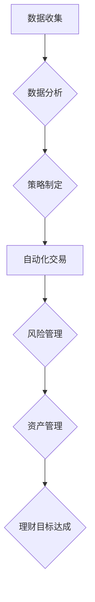

> 程序员，理财，软件推荐，投资策略，风险管理，数据分析，自动化交易

## 1. 背景介绍

在当今数字时代，程序员群体拥有着独特的优势和资源，能够利用技术手段进行更精准、更有效的理财。然而，面对复杂的金融市场和纷繁的理财产品，程序员也需要借助专业的工具和策略来进行理财决策。本文将从程序员的角度出发，推荐一系列实用且高效的理财软件，帮助程序员更好地管理财富，实现理财目标。

## 2. 核心概念与联系

理财的核心在于资产配置和风险管理。程序员可以通过软件工具来实现以下功能：

* **数据分析:** 收集和分析市场数据，识别投资机会和风险。
* **自动化交易:**  根据预设策略自动执行交易，提高交易效率和降低情绪化影响。
* **风险管理:**  设置止损点和仓位控制，有效控制投资风险。
* **资产管理:**  全面了解资产状况，进行合理配置和优化。

**Mermaid 流程图:**



## 3. 核心算法原理 & 具体操作步骤

### 3.1  算法原理概述

常见的理财算法包括：

* **均线策略:**  通过计算股票价格的移动平均线，判断趋势并进行买卖决策。
* **MACD策略:**  利用MACD指标分析股票价格的强弱和趋势变化，进行交易决策。
* **布林带策略:**  利用布林带指标判断股票价格的波动范围和超买超卖情况，进行交易决策。

### 3.2  算法步骤详解

以均线策略为例，具体操作步骤如下：

1. 选择合适的周期和均线类型（例如，5日均线和20日均线）。
2. 计算股票价格的移动平均线。
3. 当短期均线突破长期均线时，判断为买入信号。
4. 当短期均线跌破长期均线时，判断为卖出信号。

### 3.3  算法优缺点

* **优点:**  操作简单，易于理解和实施。
* **缺点:**  容易受到市场噪音影响，交易信号可能出现虚假。

### 3.4  算法应用领域

均线策略广泛应用于股票、期货等金融市场。

## 4. 数学模型和公式 & 详细讲解 & 举例说明

### 4.1  数学模型构建

均线策略的数学模型可以表示为：

$$MA_n = \frac{1}{n} \sum_{i=1}^{n} P_i$$

其中：

* $MA_n$ 表示n日均线
* $P_i$ 表示第i天的股票价格
* $n$ 表示均线周期

### 4.2  公式推导过程

公式推导过程如下：

1. 计算股票价格的总和。
2. 将总和除以股票价格的数量，即得到n日均线。

### 4.3  案例分析与讲解

假设某股票的5日价格为：100, 102, 105, 103, 108。

则5日均线为：

$$MA_5 = \frac{100+102+105+103+108}{5} = 103.6$$

## 5. 项目实践：代码实例和详细解释说明

### 5.1  开发环境搭建

可以使用Python语言和相关库进行开发，例如：

* pandas: 数据分析和处理
* matplotlib: 数据可视化
* numpy: 数值计算

### 5.2  源代码详细实现

```python
import pandas as pd
import matplotlib.pyplot as plt

# 读取股票数据
data = pd.read_csv('stock_data.csv', index_col='Date')

# 计算5日均线
data['MA5'] = data['Close'].rolling(window=5).mean()

# 绘制股票价格和均线图
plt.plot(data['Close'], label='Close Price')
plt.plot(data['MA5'], label='MA5')
plt.legend()
plt.show()
```

### 5.3  代码解读与分析

* 使用pandas库读取股票数据，并计算5日均线。
* 使用matplotlib库绘制股票价格和均线图。

### 5.4  运行结果展示

代码运行后，将生成一个包含股票价格和均线图的图表。

## 6. 实际应用场景

程序员可以利用理财软件进行以下操作：

* **股票投资:**  根据技术指标和策略进行股票买卖决策。
* **基金投资:**  选择合适的基金进行投资组合配置。
* **债券投资:**  投资债券以获得稳定的收益。
* **外汇交易:**  利用外汇市场波动进行投资。

### 6.4  未来应用展望

随着人工智能和机器学习技术的不断发展，理财软件将更加智能化和个性化，能够提供更精准的投资建议和风险管理方案。

## 7. 工具和资源推荐

### 7.1  学习资源推荐

* **书籍:** 《程序员的理财工具箱》、《Python量化投资》
* **网站:**  Investopedia, Seeking Alpha
* **课程:**  Coursera, Udemy

### 7.2  开发工具推荐

* **Python:**  数据分析、机器学习
* **R:**  统计分析、数据可视化
* **TradingView:**  技术分析、交易平台

### 7.3  相关论文推荐

* **Quantitative Trading Strategies Using Machine Learning**
* **Algorithmic Trading: A Review**

## 8. 总结：未来发展趋势与挑战

### 8.1  研究成果总结

本文介绍了程序员理财的必要性，推荐了一系列理财软件和工具，并分析了核心算法原理和应用场景。

### 8.2  未来发展趋势

* **人工智能驱动的理财:**  利用人工智能技术进行更精准的投资决策和风险管理。
* **个性化理财服务:**  根据用户的风险偏好和投资目标提供定制化的理财方案。
* **区块链技术的应用:**  提高理财交易的安全性、透明度和效率。

### 8.3  面临的挑战

* **数据安全和隐私保护:**  确保用户数据的安全性和隐私性。
* **算法的可靠性和可解释性:**  提高算法的可靠性和可解释性，避免算法偏差和风险。
* **监管政策的完善:**  完善相关监管政策，规范理财市场秩序。

### 8.4  研究展望

未来将继续研究人工智能、机器学习等技术在理财领域的应用，探索更智能、更安全、更便捷的理财解决方案。

## 9. 附录：常见问题与解答

* **Q1:  程序员理财有什么优势？**

* **A1:**  程序员拥有技术优势，能够利用软件工具进行更精准、更有效的理财。

* **Q2:  如何选择合适的理财软件？**

* **A2:**  根据自己的理财需求和技术水平选择合适的软件。

* **Q3:  理财存在哪些风险？**

* **A3:**  所有投资都存在风险，程序员需要做好风险控制。


作者：禅与计算机程序设计艺术 / Zen and the Art of Computer Programming 
<end_of_turn>