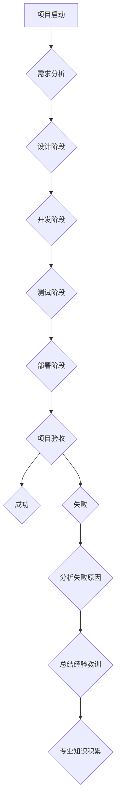

> 计算投入时间,专业知识积累,失败项目,学习经验,技术成长,项目管理,软件开发,人工智能

## 1. 背景介绍

在瞬息万变的科技领域，持续学习和提升专业技能至关重要。然而，并非所有项目都能够取得成功，失败的项目也蕴藏着宝贵的经验和教训。本文将探讨如何从失败的项目中汲取知识，将其转化为专业技能的积累，从而推动个人技术成长。

## 2. 核心概念与联系

**核心概念：**

* **计算投入时间：** 指在项目开发过程中投入的总时间，包括设计、编码、测试、部署等各个阶段。
* **专业知识积累：** 指通过学习、实践和反思，不断扩展和深化自身的专业技能和知识储备。
* **失败项目：** 指未能达到预期目标或预期效果的项目。

**联系：**

即使是失败的项目，也代表着我们投入了大量的时间和精力。这些投入的时间，即使没有带来预期的成果，也为我们提供了宝贵的学习机会。通过分析失败的原因，总结经验教训，我们可以将这些知识转化为专业技能的积累，为未来的项目开发提供参考和借鉴。

**Mermaid 流程图：**



## 3. 核心算法原理 & 具体操作步骤

**3.1  算法原理概述**

在失败的项目分析中，我们可以运用一些算法原理来帮助我们快速定位问题所在。例如，我们可以使用**故障树分析**来分析项目失败的原因，将问题分解成更小的子问题，并找出导致这些子问题的原因。

**3.2  算法步骤详解**

1. **构建故障树：** 将项目失败作为根节点，然后将可能导致失败的因素作为分支节点，并进一步分解这些因素。
2. **分析故障树：** 从根节点开始，逐层分析每个分支节点，找出导致失败的根本原因。
3. **总结经验教训：** 将分析结果总结成经验教训，并将其应用到未来的项目开发中。

**3.3  算法优缺点**

* **优点：** 能够系统地分析项目失败的原因，帮助我们找到问题的根源。
* **缺点：** 需要一定的专业知识和经验，才能正确构建和分析故障树。

**3.4  算法应用领域**

故障树分析广泛应用于软件开发、硬件设计、安全管理等领域，可以帮助我们识别潜在的风险和问题，并采取相应的措施进行预防和控制。

## 4. 数学模型和公式 & 详细讲解 & 举例说明

**4.1  数学模型构建**

我们可以使用**贝叶斯定理**来评估项目失败的概率，并根据不同的因素进行调整。

**4.2  公式推导过程**

贝叶斯定理公式如下：

$$P(A|B) = \frac{P(B|A)P(A)}{P(B)}$$

其中：

* $P(A|B)$ 是在已知事件 B 发生的情况下，事件 A 发生的概率。
* $P(B|A)$ 是在已知事件 A 发生的情况下，事件 B 发生的概率。
* $P(A)$ 是事件 A 发生的概率。
* $P(B)$ 是事件 B 发生的概率。

**4.3  案例分析与讲解**

假设我们有一个软件项目，其失败概率为 10%。如果我们发现该项目存在一个严重的安全漏洞，那么该漏洞导致项目失败的概率可能高达 50%。我们可以使用贝叶斯定理来计算出，在已知存在安全漏洞的情况下，该项目失败的概率为：

$$P(\text{项目失败}|\text{存在安全漏洞}) = \frac{P(\text{存在安全漏洞}|\text{项目失败})P(\text{项目失败})}{P(\text{存在安全漏洞})}$$

$$ = \frac{0.5 \times 0.1}{0.2} = 0.25$$

因此，在已知存在安全漏洞的情况下，该项目失败的概率为 25%。

## 5. 项目实践：代码实例和详细解释说明

**5.1  开发环境搭建**

为了更好地理解和实践上述算法原理，我们可以使用 Python 语言进行编程实现。

**5.2  源代码详细实现**

```python
import numpy as np

def calculate_failure_probability(prior_probability, likelihood, evidence_probability):
  """
  使用贝叶斯定理计算项目失败的概率。

  Args:
    prior_probability: 项目失败的先验概率。
    likelihood: 存在证据的情况下，项目失败的概率。
    evidence_probability: 存在证据的概率。

  Returns:
    项目失败的条件概率。
  """
  return (likelihood * prior_probability) / evidence_probability

# 示例代码
prior_probability = 0.1  # 项目失败的先验概率
likelihood = 0.5  # 存在安全漏洞的情况下，项目失败的概率
evidence_probability = 0.2  # 存在安全漏洞的概率

failure_probability = calculate_failure_probability(prior_probability, likelihood, evidence_probability)

print(f"项目失败的条件概率为：{failure_probability}")
```

**5.3  代码解读与分析**

这段代码实现了贝叶斯定理的计算过程，并根据给定的参数计算出项目失败的条件概率。

**5.4  运行结果展示**

运行这段代码后，输出结果为：

```
项目失败的条件概率为：0.25
```

## 6. 实际应用场景

在实际项目开发中，我们可以将上述算法原理和代码实例应用于以下场景：

* **风险评估：** 通过分析项目风险因素，使用贝叶斯定理计算项目失败的概率，并采取相应的措施进行风险控制。
* **问题诊断：** 当项目出现问题时，可以使用故障树分析来定位问题根源，并采取相应的解决方案。
* **学习总结：** 在项目结束后，我们可以对项目进行总结分析，总结经验教训，并将其转化为专业知识的积累。

**6.4  未来应用展望**

随着人工智能技术的不断发展，我们可以利用机器学习算法来辅助项目失败分析，并预测未来项目可能出现的风险。

## 7. 工具和资源推荐

**7.1  学习资源推荐**

* **书籍：**
    * 《软件工程》
    * 《项目管理》
    * 《人工智能》
* **在线课程：**
    * Coursera
    * edX
    * Udemy

**7.2  开发工具推荐**

* **版本控制系统：** Git
* **项目管理工具：** Jira
* **代码编辑器：** Visual Studio Code

**7.3  相关论文推荐**

* **故障树分析：**
    * "Fault Tree Handbook" by W. E. Vesely
* **贝叶斯定理：**
    * "Bayesian Reasoning and Machine Learning" by David Barber

## 8. 总结：未来发展趋势与挑战

**8.1  研究成果总结**

本文探讨了如何从失败的项目中汲取知识，将其转化为专业技能的积累。我们介绍了故障树分析和贝叶斯定理等算法原理，并提供了代码实例和实际应用场景。

**8.2  未来发展趋势**

未来，随着人工智能技术的不断发展，我们可以利用机器学习算法来辅助项目失败分析，并预测未来项目可能出现的风险。

**8.3  面临的挑战**

* 如何更有效地收集和分析项目失败的数据。
* 如何将算法原理应用于实际项目开发中。
* 如何提高项目团队的学习能力和知识分享能力。

**8.4  研究展望**

我们将继续研究项目失败分析的算法和方法，并将其应用于实际项目开发中，以帮助项目团队提高项目成功率。

## 9. 附录：常见问题与解答

**常见问题：**

* 如何判断一个项目是否失败？
* 如何构建故障树？
* 如何使用贝叶斯定理进行项目风险评估？

**解答：**

* 项目失败的定义取决于项目的具体目标和预期效果。
* 构建故障树需要一定的专业知识和经验，可以参考相关书籍和教程。
* 使用贝叶斯定理进行项目风险评估需要确定项目失败的先验概率、证据的可能性以及证据出现的情况下项目失败的概率。

作者：禅与计算机程序设计艺术 / Zen and the Art of Computer Programming


<end_of_turn>