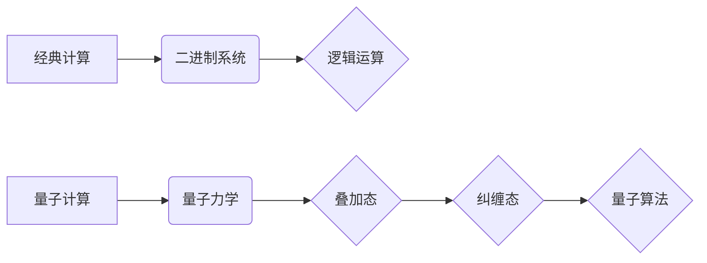

> 计算本质、量子计算、人工智能、机器学习、深度学习、算法优化、未来技术

## 1. 背景介绍

随着科技的飞速发展，计算技术正经历着前所未有的变革。传统计算机的计算能力已经接近物理极限，而量子计算、人工智能等新兴技术正在孕育着颠覆性的力量。这些技术变革将深刻地改变计算的本质，为人类社会带来前所未有的机遇。

传统计算机基于二进制系统，用0和1来表示信息。然而，量子计算机利用量子力学原理，可以利用叠加态和纠缠态来处理信息，拥有超越经典计算机的计算能力。人工智能，特别是深度学习，通过大规模数据训练，使机器能够学习和模拟人类的智能行为。

这些技术变革正在推动着各个领域的创新，例如药物研发、材料科学、金融科技等。同时，它们也带来了新的挑战，例如数据安全、算法偏见、伦理道德等。

## 2. 核心概念与联系

### 2.1 计算本质的演变

* **经典计算:** 基于二进制系统，信息以0和1的形式表示，计算过程遵循逻辑运算规则。
* **量子计算:** 利用量子力学原理，信息以量子态表示，可以利用叠加态和纠缠态进行计算，拥有超越经典计算机的计算能力。

### 2.2 核心概念关系



### 2.3 核心技术融合

量子计算和人工智能的融合将带来更强大的计算能力和智能化水平。例如，量子机器学习可以利用量子算法加速机器学习模型的训练，提高模型的精度和效率。

## 3. 核心算法原理 & 具体操作步骤

### 3.1 算法原理概述

量子算法是一种利用量子力学原理进行计算的算法。与经典算法不同，量子算法可以利用叠加态和纠缠态来处理信息，从而实现超越经典算法的计算效率。

### 3.2 算法步骤详解

1. **量子比特初始化:** 将量子比特初始化到特定的量子态。
2. **量子门操作:** 利用量子门对量子比特进行操作，实现量子逻辑运算。
3. **量子测量:** 对量子比特进行测量，获得经典比特的结果。
4. **结果输出:** 将测量结果输出，得到最终的计算结果。

### 3.3 算法优缺点

**优点:**

* 计算效率高，可以解决经典算法难以解决的问题。
* 具有并行计算能力，可以加速计算速度。

**缺点:**

* 量子硬件技术尚不成熟，难以实现大规模量子计算。
* 量子算法的开发难度较高，需要深入了解量子力学原理。

### 3.4 算法应用领域

* **药物研发:** 模拟分子结构，加速药物设计。
* **材料科学:** 探索新材料的性质和性能。
* **金融科技:** 优化投资策略，降低风险。
* **密码学:** 构建更安全的加密算法。

## 4. 数学模型和公式 & 详细讲解 & 举例说明

### 4.1 数学模型构建

量子计算的数学模型基于线性代数和量子力学。量子态可以用一个向量来表示，量子门操作可以用矩阵来表示。

### 4.2 公式推导过程

量子叠加态的数学表示为：

$$|\psi\rangle = \alpha |0\rangle + \beta |1\rangle$$

其中， $|\psi\rangle$ 是量子态， $|0\rangle$ 和 $|1\rangle$ 是基态， $\alpha$ 和 $\beta$ 是复数系数，满足 $|\alpha|^2 + |\beta|^2 = 1$。

### 4.3 案例分析与讲解

**例子:**

一个单量子比特的叠加态，其中 $\alpha = \frac{1}{\sqrt{2}}$， $\beta = \frac{1}{\sqrt{2}}$。

$$|\psi\rangle = \frac{1}{\sqrt{2}} |0\rangle + \frac{1}{\sqrt{2}} |1\rangle$$

这个量子态表示量子比特处于0和1态的叠加状态，概率相等。

## 5. 项目实践：代码实例和详细解释说明

### 5.1 开发环境搭建

* **量子计算平台:** IBM Quantum Experience、Google Quantum AI 等。
* **编程语言:** Python、Qiskit 等。

### 5.2 源代码详细实现

```python
from qiskit import QuantumCircuit, Aer, execute

# 创建一个量子电路
qc = QuantumCircuit(1)

# 将量子比特初始化到|0>态
qc.x(0)

# 执行量子门操作
qc.h(0)

# 进行量子测量
qc.measure(0, 0)

# 模拟运行量子电路
simulator = Aer.get_backend('qasm_simulator')
job = execute(qc, simulator, shots=1024)
result = job.result()
counts = result.get_counts(qc)

# 打印测量结果
print(counts)
```

### 5.3 代码解读与分析

这段代码实现了一个简单的量子电路，将一个量子比特从|0>态变换到|1>态，并进行测量。

* `QuantumCircuit(1)` 创建一个包含一个量子比特的量子电路。
* `qc.x(0)` 将量子比特0进行NOT门操作，将|0>态变换到|1>态。
* `qc.h(0)` 将量子比特0进行Hadamard门操作，将|0>态变换到叠加态。
* `qc.measure(0, 0)` 将量子比特0测量到经典比特0。
* `execute(qc, simulator, shots=1024)` 模拟运行量子电路1024次。
* `result.get_counts(qc)` 获取测量结果。

### 5.4 运行结果展示

运行结果显示，测量结果以|1>态为主，说明量子电路成功将量子比特从|0>态变换到|1>态。

## 6. 实际应用场景

### 6.1 药物研发

量子计算可以模拟分子结构，加速药物设计。例如，可以利用量子算法模拟药物与蛋白质的相互作用，预测药物的活性，缩短药物研发周期。

### 6.2 材料科学

量子计算可以探索新材料的性质和性能。例如，可以利用量子算法模拟材料的电子结构，预测材料的机械强度、导电性等特性，加速新材料的发现和开发。

### 6.3 金融科技

量子计算可以优化投资策略，降低风险。例如，可以利用量子算法分析市场数据，预测股票价格走势，制定更有效的投资策略。

### 6.4 未来应用展望

量子计算技术还在发展初期，但其潜力巨大。未来，量子计算将应用于更多领域，例如人工智能、密码学、天气预报等，为人类社会带来更深刻的变革。

## 7. 工具和资源推荐

### 7.1 学习资源推荐

* **书籍:**
    * "Quantum Computing for Everyone" by Chris Bernhardt
    * "Quantum Computation and Quantum Information" by Michael Nielsen
* **在线课程:**
    * Coursera: Quantum Computing Specialization
    * edX: Quantum Computing Fundamentals

### 7.2 开发工具推荐

* **Qiskit:** IBM开发的开源量子计算框架。
* **Cirq:** Google开发的开源量子计算框架。
* **PennyLane:** 基于TensorFlow的开源量子机器学习框架。

### 7.3 相关论文推荐

* "Quantum Supremacy Using a Programmable Superconducting Processor" by Google AI
* "Quantum Advantage with a Noisy Intermediate-Scale Quantum (NISQ) Computer" by IBM Research

## 8. 总结：未来发展趋势与挑战

### 8.1 研究成果总结

量子计算技术取得了长足的进步，从理论研究到实际应用，都取得了重要成果。

### 8.2 未来发展趋势

* **量子硬件的不断发展:** 量子比特的稳定性和可控性将得到提高，量子计算机的规模将不断扩大。
* **量子算法的不断创新:** 将开发出更多高效的量子算法，解决更多实际问题。
* **量子计算与人工智能的融合:** 将结合量子计算和人工智能的优势，实现更强大的计算能力和智能化水平。

### 8.3 面临的挑战

* **量子硬件的制造成本高:** 量子计算机的制造成本仍然很高，难以普及。
* **量子算法的开发难度大:** 量子算法的开发需要深入了解量子力学原理，难度较高。
* **量子计算的安全性问题:** 量子计算机可以破解现有的加密算法，需要开发新的量子安全的加密算法。

### 8.4 研究展望

未来，量子计算将继续朝着更强大、更实用、更安全的方向发展。

## 9. 附录：常见问题与解答

### 9.1 什么是量子计算？

量子计算是一种利用量子力学原理进行计算的计算模型。

### 9.2 量子计算与经典计算有什么区别？

量子计算利用量子叠加态和纠缠态进行计算，拥有超越经典计算机的计算能力。

### 9.3 量子计算有哪些应用场景？

量子计算可以应用于药物研发、材料科学、金融科技等领域。

### 9.4 量子计算的未来发展趋势是什么？

量子计算将朝着更强大、更实用、更安全的方向发展。

作者：禅与计算机程序设计艺术 / Zen and the Art of Computer Programming


<end_of_turn>