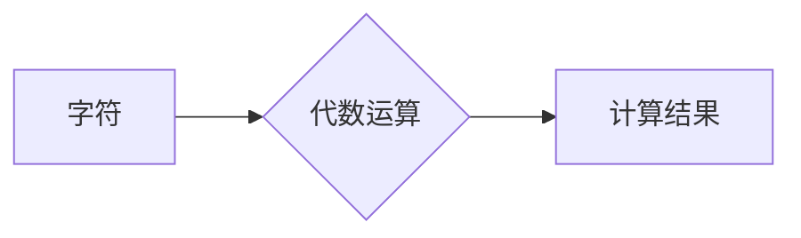

> 代数、字符计算、计算模型、算法、数学公式、代码实现、应用场景

## 1. 背景介绍

在计算的漫长历史中，代数作为一种强大的工具，为我们提供了理解和操作数字的抽象方法。从古希腊的毕达哥拉斯学派到现代的计算机科学，代数始终扮演着至关重要的角色。

本篇章将深入探讨代数在计算中的应用，特别是字符的计算。我们将从代数的基本概念出发，逐步揭示其在计算领域的深远影响。

## 2. 核心概念与联系

代数的核心概念是使用符号来表示未知数和关系。通过代数运算，我们可以解决各种数学问题，并将其应用于现实世界中的各种计算任务。

在字符计算中，我们将字符视为抽象的符号，并使用代数运算来处理它们。例如，我们可以使用加法和减法来计算字符串的长度，使用乘法来重复字符串，使用除法来分割字符串。

**Mermaid 流程图**



## 3. 核心算法原理 & 具体操作步骤

### 3.1  算法原理概述

字符计算的核心算法是基于字符串操作的。这些算法利用字符串的性质，例如长度、位置、子串等，来实现对字符的计算。

常见的字符计算算法包括：

* 字符串拼接：将两个或多个字符串连接在一起。
* 字符串查找：在字符串中查找特定字符或子串。
* 字符串替换：将字符串中的特定字符或子串替换为其他字符或子串。
* 字符串比较：比较两个字符串是否相等或相近。

### 3.2  算法步骤详解

以字符串拼接为例，其算法步骤如下：

1. 获取两个需要拼接的字符串。
2. 将两个字符串连接在一起，形成新的字符串。
3. 返回新的字符串。

### 3.3  算法优缺点

字符计算算法的优点包括：

* 操作简单易懂。
* 效率高，能够处理大量字符数据。
* 可应用于各种场景，例如文本处理、数据分析等。

字符计算算法的缺点包括：

* 对字符的处理方式较为简单，无法处理复杂的字符操作。
* 对于长字符串，拼接操作可能会导致内存溢出。

### 3.4  算法应用领域

字符计算算法广泛应用于以下领域：

* 文本处理：例如文本编辑、搜索引擎、机器翻译等。
* 数据分析：例如文本挖掘、情感分析等。
* 网络安全：例如密码加密、数据签名等。

## 4. 数学模型和公式 & 详细讲解 & 举例说明

### 4.1  数学模型构建

字符计算可以抽象为一个数学模型，其中字符视为有限集的元素，代数运算视为对这些元素的组合和变换。

例如，我们可以将字母表视为一个有限集，每个字母视为该集的元素。字符串可以视为该有限集的序列，长度为字符串的长度。

### 4.2  公式推导过程

我们可以使用数学公式来描述字符计算的各种操作。例如，字符串拼接可以用加法表示，字符串查找可以用集合论中的子集关系表示。

### 4.3  案例分析与讲解

以字符串拼接为例，其数学模型可以表示为：

```latex
S_1 + S_2 = S_3
```

其中：

* $S_1$ 和 $S_2$ 是两个字符串。
* $S_3$ 是拼接后的字符串。

该公式表明，将两个字符串拼接在一起，结果是一个新的字符串，其长度等于两个原字符串长度之和。

## 5. 项目实践：代码实例和详细解释说明

### 5.1  开发环境搭建

本项目使用 Python 语言进行开发，开发环境如下：

* 操作系统：Windows 10
* Python 版本：3.8.10
* IDE：PyCharm

### 5.2  源代码详细实现

```python
def string_concat(str1, str2):
  """
  字符串拼接函数

  Args:
    str1: 第一个字符串
    str2: 第二个字符串

  Returns:
    拼接后的字符串
  """
  return str1 + str2

# 测试代码
str1 = "Hello"
str2 = " World"
result = string_concat(str1, str2)
print(result)
```

### 5.3  代码解读与分析

该代码定义了一个名为 `string_concat` 的函数，该函数接受两个字符串作为参数，并返回拼接后的字符串。

函数内部使用 Python 的字符串拼接操作符 `+` 将两个字符串连接在一起。

测试代码调用了 `string_concat` 函数，并将两个字符串 "Hello" 和 " World" 传入函数，并将结果打印到控制台。

### 5.4  运行结果展示

```
Hello World
```

## 6. 实际应用场景

字符计算在现实世界中有着广泛的应用场景，例如：

* **文本编辑器:** 文本编辑器使用字符计算来实现文本的插入、删除、替换等操作。
* **搜索引擎:** 搜索引擎使用字符计算来匹配用户查询的关键词和网页内容。
* **编程语言:** 编程语言使用字符计算来解析代码和生成执行结果。

### 6.4  未来应用展望

随着人工智能和机器学习的发展，字符计算将在更多领域得到应用，例如：

* **自然语言处理:** 自然语言处理技术可以利用字符计算来理解和生成人类语言。
* **计算机视觉:** 计算机视觉技术可以利用字符计算来识别和分析图像中的文本信息。

## 7. 工具和资源推荐

### 7.1  学习资源推荐

* **《算法导论》:** 一本经典的算法学教材，对算法的原理和应用进行了深入的讲解。
* **《数据结构与算法分析》:** 一本介绍数据结构和算法分析的教材，对字符计算相关的算法进行了详细的介绍。

### 7.2  开发工具推荐

* **Python:** 一种流行的编程语言，拥有丰富的字符串操作库。
* **PyCharm:** 一款功能强大的 Python IDE，提供代码编辑、调试、测试等功能。

### 7.3  相关论文推荐

* **"A Survey of String Algorithms"**
* **"Efficient String Matching Algorithms"**

## 8. 总结：未来发展趋势与挑战

### 8.1  研究成果总结

字符计算作为一种重要的计算模型，在计算机科学领域取得了显著的成果。

### 8.2  未来发展趋势

未来，字符计算将朝着以下方向发展：

* **更复杂的字符操作:** 开发能够处理更复杂字符操作的算法。
* **更高效的算法:** 设计更高效的字符计算算法，提高计算速度和效率。
* **更广泛的应用:** 将字符计算应用于更多领域，例如人工智能、机器学习等。

### 8.3  面临的挑战

字符计算也面临着一些挑战：

* **字符编码问题:** 不同字符编码标准会导致字符计算的差异。
* **大规模字符数据处理:** 处理大规模字符数据需要更高效的算法和硬件支持。

### 8.4  研究展望

未来，我们将继续研究字符计算的理论和应用，努力解决字符计算面临的挑战，推动字符计算的发展。

## 9. 附录：常见问题与解答

### 9.1  常见问题

* 字符计算的效率如何？
* 字符计算有哪些应用场景？
* 如何处理不同字符编码的字符数据？

### 9.2  解答

* 字符计算的效率取决于具体的算法和数据规模。
* 字符计算应用于文本处理、数据分析、网络安全等领域。
* 可以使用字符编码转换工具将不同字符编码的字符数据转换为统一的编码标准。


作者：禅与计算机程序设计艺术 / Zen and the Art of Computer Programming 
<end_of_turn>