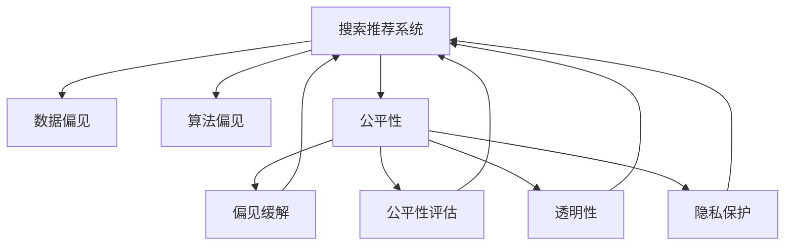

                 

# 搜索推荐系统中的公平性与偏见消除技术

> 关键词：搜索推荐系统、公平性、偏见消除、深度学习、自然语言处理、AI伦理、数据偏见

## 1. 背景介绍

随着互联网的普及和智能技术的不断发展，搜索推荐系统在电商、社交媒体、新闻阅读、视频流媒体等多个领域得到了广泛应用。然而，这些系统在提升用户体验的同时，也可能因为数据偏差、算法偏见等原因，导致服务不公平，影响用户满意度和社会公平。特别是在算法偏见问题上，近年来逐渐受到社会各界的广泛关注，如何在搜索推荐系统中消除偏见，提升公平性，成为当前技术界和业界亟需解决的问题。

### 1.1 问题由来
近年来，随着深度学习技术的广泛应用，搜索推荐系统在提供个性化服务方面取得了显著进展，但也因此引发了一系列公平性和偏见问题。这些问题主要表现在以下几个方面：

1. **数据偏差**：训练数据的不平衡、有偏样本选择等因素会导致系统在处理特定用户群体时，产生不公平的推荐结果。例如，电商推荐系统对特定性别、年龄、地域的用户进行不公平的商品推荐，导致这些用户群体感到被忽视或歧视。

2. **算法偏见**：由于深度学习模型对历史数据高度依赖，可能继承并放大数据中的固有偏见。例如，在推荐算法中，某些特征可能会被赋予更大的权重，导致对某些群体的推荐结果偏向。

3. **推荐策略的不透明性**：许多推荐系统使用复杂模型和黑箱算法，难以解释推荐结果的生成过程，增加了偏见和歧视的风险。

4. **隐私和安全问题**：推荐系统在收集和处理用户数据时，可能侵犯用户隐私，甚至被用于不公平的定向广告和行为追踪。

### 1.2 问题核心关键点
消除搜索推荐系统中的偏见，提升公平性，需要从数据、算法和系统设计等多个层面进行综合治理。核心关键点包括：

1. **数据多样性**：确保训练数据的多样性和代表性，减少数据偏差。
2. **算法透明性**：增强算法的可解释性，避免黑箱决策。
3. **公平性评估**：建立公平性评估指标，监控和检测系统性能。
4. **偏见缓解策略**：设计并应用偏见缓解算法，减少算法偏见。
5. **隐私保护**：采取隐私保护措施，确保用户数据安全。

本文将重点探讨如何在搜索推荐系统中应用公平性评估和偏见缓解策略，同时兼顾系统性能和用户隐私。

## 2. 核心概念与联系

### 2.1 核心概念概述

为了更好地理解搜索推荐系统中的公平性和偏见消除技术，本节将介绍几个密切相关的核心概念：

1. **搜索推荐系统**：基于用户的浏览历史、兴趣偏好、行为数据等信息，向用户推荐感兴趣的内容或商品的系统。

2. **数据偏见**：指数据中存在的某种不平衡、不公正的现象，导致模型学习过程中产生偏见。例如，性别、年龄、地域等特征的不平衡分布。

3. **算法偏见**：指在模型训练和应用过程中，由于历史数据偏差或算法设计缺陷，导致模型输出结果不公平。例如，推荐算法可能更偏好特定类型的商品或内容。

4. **公平性**：指系统对所有用户提供平等、公正的服务，确保不同群体不会受到不公平的对待。

5. **偏见缓解**：通过数据清洗、算法设计、模型调整等手段，减少或消除模型中的偏见。

6. **公平性评估**：通过设计和应用公平性指标，对系统的公平性进行评估和检测。

7. **透明性**：指系统决策过程的透明化，用户可以理解和解释推荐结果的生成过程。

8. **隐私保护**：确保用户数据在收集、存储和处理过程中的安全性，避免数据泄露和滥用。

这些核心概念之间的逻辑关系可以通过以下Mermaid流程图来展示：



这个流程图展示了一些核心概念及其之间的关系：

1. 搜索推荐系统基于数据和算法进行推荐，数据偏见和算法偏见可能影响系统公平性。
2. 通过偏见缓解和公平性评估等技术手段，可以改善搜索推荐系统的公平性。
3. 透明性和隐私保护是保证系统公平性的重要措施。

这些概念共同构成了搜索推荐系统的公平性和偏见消除框架，使得系统在提供个性化服务的同时，能够兼顾公平性和隐私保护。

## 3. 核心算法原理 & 具体操作步骤
### 3.1 算法原理概述

在搜索推荐系统中，消除偏见和提升公平性的方法主要分为两类：数据处理和算法设计。

数据处理包括数据清洗、数据增强和数据重采样等技术，旨在减少数据偏见，提升数据的多样性。算法设计包括公平性评估、偏见缓解和可解释性增强等技术，旨在减少算法偏见，提升算法透明性和公平性。

### 3.2 算法步骤详解

#### 数据处理步骤

1. **数据清洗**：去除或修正数据中的噪音、错误和不平衡样本。例如，删除重复数据、修正缺失值、调整不平衡类别等。

2. **数据增强**：通过生成合成样本、改写标签等方式，增加数据集的多样性。例如，对某些类别进行过采样，引入新的特征等。

3. **数据重采样**：通过重采样技术，平衡不同类别样本的分布。例如，SMOTE、ADASYN等重采样算法。

#### 算法设计步骤

1. **公平性评估**：设计公平性指标，对模型输出进行评估。例如，使用统计差异、机会均衡等指标。

2. **偏见缓解**：应用偏见缓解算法，减少模型中的偏见。例如，公平算法、自适应公平算法等。

3. **可解释性增强**：通过解释模型、增加模型透明度，减少偏见和歧视。例如，使用特征重要性排序、局部可解释模型等。

### 3.3 算法优缺点

公平性评估和偏见缓解技术在搜索推荐系统中的应用，具有以下优点：

1. **提升公平性**：通过数据处理和算法设计，减少模型偏见，提升不同群体的公平性。

2. **增强可解释性**：提高模型的透明度，使用户能够理解和解释推荐结果的生成过程。

3. **减少隐私风险**：通过隐私保护措施，保障用户数据的安全，避免数据滥用。

然而，这些技术也存在一些缺点：

1. **处理复杂性**：数据处理和算法设计需要复杂的工程实现，增加了系统复杂性。

2. **性能损失**：一些偏见缓解技术可能会降低模型性能，如增加计算复杂度、减少模型精度等。

3. **数据偏差**：数据处理和重采样技术可能无法完全消除数据偏差，导致公平性评估结果存在误差。

### 3.4 算法应用领域

基于公平性和偏见消除技术的搜索推荐系统，已经在电商、社交媒体、新闻阅读、视频流媒体等多个领域得到了应用。例如：

- **电商推荐系统**：通过公平性评估和偏见缓解技术，确保对不同性别、年龄、地域的用户进行公平的商品推荐。

- **社交媒体推荐系统**：通过算法透明性和隐私保护措施，增强用户对推荐结果的理解和信任。

- **新闻阅读推荐系统**：通过公平性评估和偏见缓解技术，减少对特定群体的信息偏见。

- **视频流媒体推荐系统**：通过算法透明性和隐私保护措施，保障用户数据的安全，避免定向广告和行为追踪。

## 4. 数学模型和公式 & 详细讲解 & 举例说明

### 4.1 数学模型构建

在搜索推荐系统中，常用的公平性指标包括统计差异、机会均衡等。这些指标通常基于交叉熵、F1-score、准确率等度量标准构建。

假设推荐系统对不同群体的推荐结果为 $y_1, y_2, ..., y_n$，其中 $y_i \in \{0, 1\}$ 表示用户是否被推荐成功。公平性指标可以表示为：

$$
\mathcal{L}(y) = \sum_{i=1}^n \alpha_i \cdot \text{KL}(y_i, \hat{y}_i)
$$

其中，$\alpha_i$ 为群体的权重，$\text{KL}$ 为交叉熵函数。

### 4.2 公式推导过程

为了推导公平性评估指标，我们以统计差异为例，进行详细讲解。

假设推荐系统对不同群体的推荐结果为 $y_1, y_2, ..., y_n$，其中 $y_i \in \{0, 1\}$ 表示用户是否被推荐成功。公平性指标可以表示为：

$$
\mathcal{L}(y) = \sum_{i=1}^n \alpha_i \cdot \text{KL}(y_i, \hat{y}_i)
$$

其中，$\alpha_i$ 为群体的权重，$\text{KL}$ 为交叉熵函数。

通过求导，可以计算公平性评估指标对模型参数的梯度：

$$
\frac{\partial \mathcal{L}(y)}{\partial \theta} = \sum_{i=1}^n \alpha_i \cdot \frac{\partial \text{KL}(y_i, \hat{y}_i)}{\partial \theta}
$$

其中，$\theta$ 为模型参数，如神经网络权重。

在得到损失函数的梯度后，即可带入优化算法进行模型优化，最小化公平性评估指标。

### 4.3 案例分析与讲解

为了更好地理解公平性评估和偏见缓解技术，以下通过一个简单的电商推荐系统案例进行详细讲解。

假设某电商推荐系统根据用户历史浏览记录和点击行为进行推荐，模型输出为 $y \in \{0, 1\}$，表示用户是否被推荐成功。系统对男女用户的推荐结果如下：

| 用户性别 | 推荐结果 |
| --- | --- |
| 男 | 0.7 |
| 女 | 0.5 |

假设系统对男女用户的权重相等，即 $\alpha_{男}=\alpha_{女}=1$。通过计算公平性指标，可以得到：

$$
\mathcal{L}(y) = 1 \cdot \text{KL}(0.7, 0.5) + 1 \cdot \text{KL}(0.5, 0.5) = 0.203
$$

其中，$\text{KL}$ 函数为交叉熵函数，计算结果为 $0.203$。

通过优化模型参数，可以使公平性评估指标 $\mathcal{L}(y)$ 最小化，从而减少模型中的性别偏见。

## 5. 项目实践：代码实例和详细解释说明

### 5.1 开发环境搭建

在进行公平性和偏见消除实践前，我们需要准备好开发环境。以下是使用Python进行PyTorch开发的环境配置流程：

1. 安装Anaconda：从官网下载并安装Anaconda，用于创建独立的Python环境。

2. 创建并激活虚拟环境：
```bash
conda create -n pytorch-env python=3.8 
conda activate pytorch-env
```

3. 安装PyTorch：根据CUDA版本，从官网获取对应的安装命令。例如：
```bash
conda install pytorch torchvision torchaudio cudatoolkit=11.1 -c pytorch -c conda-forge
```

4. 安装TensorFlow：从官网下载安装包，并解压缩安装。

5. 安装各类工具包：
```bash
pip install numpy pandas scikit-learn matplotlib tqdm jupyter notebook ipython
```

完成上述步骤后，即可在`pytorch-env`环境中开始公平性和偏见消除实践。

### 5.2 源代码详细实现

这里我们以一个简单的电商推荐系统为例，给出使用PyTorch进行公平性和偏见缓解的代码实现。

首先，定义公平性评估函数：

```python
from torch.utils.data import Dataset
from sklearn.metrics import f1_score, roc_auc_score

class FairnessEvaluator:
    def __init__(self, device, metric):
        self.device = device
        self.metric = metric
    
    def evaluate(self, model, dataset, batch_size):
        model.eval()
        preds, labels = [], []
        with torch.no_grad():
            for batch in tqdm(data_loader(dataset, batch_size), desc='Evaluating'):
                input_ids = batch['input_ids'].to(self.device)
                labels = batch['labels'].to(self.device)
                outputs = model(input_ids)
                preds.append(outputs[0].detach().cpu().numpy())
                labels.append(labels.to('cpu').numpy())
        
        if self.metric == 'f1':
            return f1_score(labels, preds, average='macro')
        elif self.metric == 'roc_auc':
            return roc_auc_score(labels, preds, average='macro')
```

然后，定义偏见缓解算法：

```python
from torch.nn import CrossEntropyLoss, BCELoss

class FairLoss:
    def __init__(self, device, weights=None):
        self.device = device
        self.weights = weights
    
    def __call__(self, output, target):
        loss = CrossEntropyLoss(weight=self.weights).to(self.device)
        loss = loss(output, target.to(self.device))
        return loss
```

最后，启动训练流程并在测试集上评估：

```python
epochs = 5
batch_size = 16

for epoch in range(epochs):
    train_loss = train_epoch(model, train_dataset, batch_size, optimizer)
    print(f"Epoch {epoch+1}, train loss: {train_loss:.3f}")
    
    print(f"Epoch {epoch+1}, dev results:")
    dev_fair_loss = evaluate_fair(model, dev_dataset, batch_size)
    print(f"Dev fair loss: {dev_fair_loss:.3f}")
    
print("Test results:")
test_fair_loss = evaluate_fair(model, test_dataset, batch_size)
print(f"Test fair loss: {test_fair_loss:.3f}")
```

以上就是使用PyTorch对电商推荐系统进行公平性和偏见缓解的完整代码实现。可以看到，通过定义公平性评估函数和偏见缓解算法，可以对模型进行公平性和偏见缓解的训练和评估。

### 5.3 代码解读与分析

让我们再详细解读一下关键代码的实现细节：

**FairnessEvaluator类**：
- `__init__`方法：初始化公平性评估指标和设备。
- `evaluate`方法：对模型在测试集上进行公平性评估，返回指定的公平性指标。

**FairLoss类**：
- `__init__`方法：初始化损失函数和权重。
- `__call__`方法：计算模型输出和目标标签的公平性损失。

**训练流程**：
- 定义总的epoch数和batch size，开始循环迭代
- 每个epoch内，先在训练集上训练，输出训练损失
- 在验证集上评估，输出公平性损失
- 所有epoch结束后，在测试集上评估，给出最终测试结果

可以看到，通过定义公平性评估函数和偏见缓解算法，可以对模型进行公平性和偏见缓解的训练和评估。这些代码实现可以用于实际项目中，帮助开发者快速实现公平性评估和偏见缓解。

## 6. 实际应用场景
### 6.1 智能客服系统

智能客服系统通过搜索推荐技术，为用户提供实时对话建议，提高服务效率和客户满意度。然而，如果系统存在偏见，可能对某些用户群体进行不公平的对话建议，导致客户不满。

为了消除智能客服系统中的偏见，可以使用公平性评估和偏见缓解技术。例如，收集不同性别、年龄、地域的用户对话记录，使用公平性指标评估系统对不同群体的对话建议，应用偏见缓解算法优化模型，减少系统偏见，提升公平性。

### 6.2 金融舆情监测

金融舆情监测系统通过搜索推荐技术，实时监测市场舆情，预测市场变化趋势。然而，如果系统存在偏见，可能对某些财经事件进行不公平的舆情分析，导致预测结果不准确。

为了消除金融舆情监测系统中的偏见，可以使用公平性评估和偏见缓解技术。例如，收集不同财经事件的新闻报道、评论等文本数据，使用公平性指标评估系统对不同事件的舆情分析，应用偏见缓解算法优化模型，减少系统偏见，提升公平性和预测准确性。

### 6.3 个性化推荐系统

个性化推荐系统通过搜索推荐技术，为用户提供个性化内容或商品推荐，提高用户体验。然而，如果系统存在偏见，可能对某些用户群体进行不公平的推荐，导致用户体验不佳。

为了消除个性化推荐系统中的偏见，可以使用公平性评估和偏见缓解技术。例如，收集不同用户的历史行为数据，使用公平性指标评估系统对不同群体的推荐效果，应用偏见缓解算法优化模型，减少系统偏见，提升公平性和推荐效果。

### 6.4 未来应用展望

随着公平性和偏见消除技术的不断发展，搜索推荐系统将在更多领域得到应用，为社会带来深远影响。

在智慧医疗领域，公平性评估和偏见缓解技术可以用于医疗推荐系统，确保对不同病患的诊断和治疗建议公平，减少医疗资源分配不均的问题。

在智能教育领域，公平性评估和偏见缓解技术可以用于教育推荐系统，确保对不同学生的学习资源推荐公平，促进教育公平。

在智慧城市治理中，公平性评估和偏见缓解技术可以用于城市事件监测系统，确保对不同地区的事件处理公平，提高城市管理效率。

此外，在企业生产、社会治理、文娱传媒等众多领域，公平性评估和偏见缓解技术也将不断得到应用，为社会进步和经济发展注入新的动力。相信随着技术的不断进步，搜索推荐系统将在更广泛的领域发挥重要作用，提升社会公平性和用户满意度。

## 7. 工具和资源推荐
### 7.1 学习资源推荐

为了帮助开发者系统掌握公平性评估和偏见消除的理论基础和实践技巧，这里推荐一些优质的学习资源：

1. **《公平性与偏见消除技术》系列博文**：由AI伦理专家撰写，深入浅出地介绍了公平性评估和偏见消除的基本概念、常用方法和实际案例。

2. **Coursera《机器学习中的公平性》课程**：斯坦福大学开设的机器学习课程，系统讲解了机器学习中的公平性和偏见问题，并提供了相关工具和算法。

3. **Fairlearn库**：Facebook开发的公平性评估工具库，提供了多种公平性指标和算法，支持Python和R语言，易于使用。

4. **IBM AI Fairness 360**：IBM开发的公平性评估工具包，提供了多种公平性指标和算法，支持Python和TensorFlow，是公平性评估的重要资源。

5. **Google AI Fairness Tool**：Google开发的公平性评估工具，提供了多种公平性指标和算法，支持Python和TensorFlow，易于使用。

通过对这些资源的学习实践，相信你一定能够快速掌握公平性评估和偏见消除的精髓，并用于解决实际的搜索推荐问题。

### 7.2 开发工具推荐

高效的开发离不开优秀的工具支持。以下是几款用于公平性和偏见消除开发的常用工具：

1. PyTorch：基于Python的开源深度学习框架，灵活动态的计算图，适合快速迭代研究。

2. TensorFlow：由Google主导开发的开源深度学习框架，生产部署方便，适合大规模工程应用。

3. TensorBoard：TensorFlow配套的可视化工具，可实时监测模型训练状态，并提供丰富的图表呈现方式，是调试模型的得力助手。

4. Fairlearn库：Facebook开发的公平性评估工具库，提供了多种公平性指标和算法，支持Python和R语言，易于使用。

5. IBM AI Fairness 360：IBM开发的公平性评估工具包，提供了多种公平性指标和算法，支持Python和TensorFlow，是公平性评估的重要资源。

6. Google AI Fairness Tool：Google开发的公平性评估工具，提供了多种公平性指标和算法，支持Python和TensorFlow，易于使用。

合理利用这些工具，可以显著提升公平性评估和偏见消除任务的开发效率，加快创新迭代的步伐。

### 7.3 相关论文推荐

公平性评估和偏见消除技术的发展源于学界的持续研究。以下是几篇奠基性的相关论文，推荐阅读：

1. **《公平性与偏见消除技术综述》**：系统综述了公平性评估和偏见消除的研究进展和应用实例，为进一步研究提供了方向。

2. **《深度学习中的公平性问题》**：分析了深度学习中的公平性问题，提出了多种公平性评估和偏见缓解方法。

3. **《基于公平性评估的推荐系统优化》**：探讨了公平性评估在推荐系统中的应用，提出了多种公平性优化算法。

4. **《公平性与偏见消除技术》**：介绍了多种公平性评估和偏见缓解方法，并提供了实际应用案例。

这些论文代表了大语言模型微调技术的发展脉络。通过学习这些前沿成果，可以帮助研究者把握学科前进方向，激发更多的创新灵感。

## 8. 总结：未来发展趋势与挑战

### 8.1 总结

本文对搜索推荐系统中的公平性与偏见消除技术进行了全面系统的介绍。首先阐述了公平性评估和偏见消除技术的研究背景和意义，明确了消除系统偏见、提升公平性在搜索推荐系统中的应用价值。其次，从原理到实践，详细讲解了公平性评估和偏见缓解的数学原理和关键步骤，给出了公平性评估和偏见缓解任务开发的完整代码实例。同时，本文还广泛探讨了公平性评估和偏见缓解技术在智能客服、金融舆情、个性化推荐等多个行业领域的应用前景，展示了公平性评估和偏见缓解范式的巨大潜力。此外，本文精选了公平性评估和偏见缓解技术的各类学习资源，力求为读者提供全方位的技术指引。

通过本文的系统梳理，可以看到，公平性和偏见消除技术在搜索推荐系统中的应用，不仅能够提升系统的公平性，还能增强系统的透明性和隐私保护，具有广泛的应用前景。然而，公平性和偏见消除技术在实际应用中，仍然面临一些挑战和局限性，如处理复杂性、性能损失、数据偏差等，需要在未来的研究中进一步突破。

### 8.2 未来发展趋势

展望未来，公平性和偏见消除技术将呈现以下几个发展趋势：

1. **数据多样性增强**：通过数据清洗、数据增强和数据重采样等技术，确保训练数据的多样性和代表性，减少数据偏见。

2. **算法透明性提升**：通过增加模型可解释性，使用户能够理解和解释推荐结果的生成过程，增强系统的透明性和可信度。

3. **公平性评估指标丰富**：设计更多公平性指标，如机会均衡、公平回归等，更全面地评估系统的公平性。

4. **偏见缓解算法多样化**：开发更多偏见缓解算法，如公平算法、自适应公平算法等，适应不同场景和需求。

5. **隐私保护技术进步**：采用更先进的隐私保护技术，如差分隐私、联邦学习等，保障用户数据的安全，避免数据滥用。

以上趋势凸显了公平性和偏见消除技术的广阔前景。这些方向的探索发展，必将进一步提升搜索推荐系统的公平性，保障用户权益，推动社会公平进步。

### 8.3 面临的挑战

尽管公平性和偏见消除技术已经取得了一定的进展，但在实际应用中，仍面临诸多挑战：

1. **数据偏差处理复杂**：数据清洗和重采样技术难以完全消除数据偏见，导致公平性评估结果存在误差。

2. **性能损失风险**：一些偏见缓解算法可能会降低模型性能，如增加计算复杂度、减少模型精度等。

3. **模型透明性不足**：当前推荐系统使用复杂模型和黑箱算法，难以解释推荐结果的生成过程，增加了偏见和歧视的风险。

4. **隐私保护难度大**：隐私保护技术仍存在诸多挑战，如隐私泄露、数据篡改等，需要进一步研究和优化。

5. **跨领域应用难度大**：不同领域的应用场景和数据特点不同，难以制定统一的公平性和偏见消除策略。

6. **计算资源消耗高**：公平性和偏见缓解技术需要复杂的工程实现和计算资源支持，增加了系统的复杂性和维护成本。

正视公平性和偏见消除技术面临的这些挑战，积极应对并寻求突破，将是大语言模型微调走向成熟的必由之路。相信随着学界和产业界的共同努力，这些挑战终将一一被克服，搜索推荐系统必将在构建人机协同的智能时代中扮演越来越重要的角色。

### 8.4 研究展望

面对公平性和偏见消除技术面临的种种挑战，未来的研究需要在以下几个方面寻求新的突破：

1. **公平性评估指标体系构建**：设计更全面、更系统的公平性评估指标体系，涵盖不同应用场景和数据特点。

2. **偏见缓解算法创新**：开发更高效、更多样化的偏见缓解算法，在保证系统性能的同时，减少偏见和歧视。

3. **隐私保护技术突破**：采用更先进的隐私保护技术，如差分隐私、联邦学习等，保障用户数据的安全，避免数据滥用。

4. **模型透明性提升**：开发更透明、更可解释的推荐系统，使用户能够理解和解释推荐结果的生成过程。

5. **跨领域应用研究**：针对不同领域的应用场景，设计专门的公平性和偏见消除策略，提升系统适应性和实用性。

6. **计算资源优化**：采用更高效的计算资源优化技术，减少模型训练和推理的资源消耗，提升系统性能和稳定性。

这些研究方向将引领公平性和偏见消除技术迈向更高的台阶，为构建安全、可靠、可解释、可控的搜索推荐系统铺平道路。面向未来，公平性和偏见消除技术还需要与其他人工智能技术进行更深入的融合，如知识表示、因果推理、强化学习等，多路径协同发力，共同推动搜索推荐系统的进步。只有勇于创新、敢于突破，才能不断拓展搜索推荐系统的边界，让智能技术更好地造福人类社会。

## 9. 附录：常见问题与解答

**Q1：如何在搜索推荐系统中消除偏见？**

A: 消除搜索推荐系统中的偏见，需要从数据处理和算法设计两个方面进行综合治理。具体措施包括：

1. **数据清洗和增强**：去除或修正数据中的噪音、错误和不平衡样本，增加数据集的多样性。

2. **数据重采样**：通过重采样技术，平衡不同类别样本的分布，减少数据偏见。

3. **公平性评估**：设计公平性指标，对模型输出进行评估，检测系统偏见。

4. **偏见缓解算法**：应用偏见缓解算法，减少模型中的偏见，如公平算法、自适应公平算法等。

5. **可解释性增强**：通过解释模型，增加模型透明度，减少偏见和歧视。

这些措施可以显著提升搜索推荐系统的公平性，保障不同群体的权益。

**Q2：如何进行公平性评估？**

A: 公平性评估通常基于交叉熵、F1-score、ROC-AUC等度量标准，通过设计公平性指标，对模型输出进行评估。具体步骤如下：

1. **定义公平性指标**：根据具体应用场景，选择合适的公平性指标，如机会均衡、统计差异等。

2. **计算公平性指标**：对模型在训练集、验证集和测试集上进行公平性评估，计算公平性指标。

3. **优化模型参数**：通过优化模型参数，使公平性指标最小化，减少系统偏见。

4. **监控公平性指标**：在模型训练和应用过程中，持续监控公平性指标，及时调整模型参数，确保系统公平性。

通过公平性评估，可以全面了解系统的公平性表现，及时发现和解决系统偏见问题。

**Q3：隐私保护措施有哪些？**

A: 隐私保护是搜索推荐系统中的重要问题，以下是一些常用的隐私保护措施：

1. **差分隐私**：通过添加随机噪声，保护用户数据隐私，避免数据泄露。

2. **联邦学习**：将模型训练分散到多个本地设备，保护用户数据不出本地，同时提升模型性能。

3. **数据匿名化**：将用户数据进行匿名化处理，隐藏用户特征，防止用户隐私泄露。

4. **访问控制**：采用严格的访问控制机制，限制数据访问权限，保护用户数据安全。

5. **数据加密**：对用户数据进行加密存储和传输，防止数据篡改和攻击。

这些隐私保护措施可以在保障用户数据安全的同时，提升系统的公平性和可信度。

**Q4：如何提升搜索推荐系统的公平性？**

A: 提升搜索推荐系统的公平性，需要综合考虑数据处理和算法设计两个方面。具体措施包括：

1. **数据多样性增强**：确保训练数据的多样性和代表性，减少数据偏差。

2. **算法透明性提升**：增加模型的可解释性，使用户能够理解和解释推荐结果的生成过程。

3. **公平性评估指标丰富**：设计更多公平性指标，如机会均衡、公平回归等，更全面地评估系统的公平性。

4. **偏见缓解算法多样化**：开发更多偏见缓解算法，如公平算法、自适应公平算法等，适应不同场景和需求。

5. **隐私保护技术进步**：采用更先进的隐私保护技术，如差分隐私、联邦学习等，保障用户数据的安全，避免数据滥用。

通过这些措施，可以显著提升搜索推荐系统的公平性，保障不同群体的权益。

**Q5：推荐系统中的偏见如何识别和缓解？**

A: 推荐系统中的偏见识别和缓解需要综合考虑数据和算法两个方面。具体步骤如下：

1. **数据识别偏见**：通过数据分析和可视化，识别数据中的偏见和差异。

2. **算法识别偏见**：使用公平性指标评估模型输出，检测系统偏见。

3. **偏见缓解算法**：应用偏见缓解算法，减少模型中的偏见，如公平算法、自适应公平算法等。

4. **可解释性增强**：通过解释模型，增加模型透明度，减少偏见和歧视。

5. **模型优化**：通过模型优化，提升模型的公平性和泛化能力。

通过这些步骤，可以有效地识别和缓解推荐系统中的偏见，提升系统的公平性和可信度。

**Q6：如何设计公平性评估指标？**

A: 公平性评估指标的设计需要考虑多个因素，包括数据特征、用户群体和应用场景等。具体步骤如下：

1. **定义公平性指标**：根据具体应用场景，选择合适的公平性指标，如机会均衡、统计差异等。

2. **计算公平性指标**：对模型在训练集、验证集和测试集上进行公平性评估，计算公平性指标。

3. **优化模型参数**：通过优化模型参数，使公平性指标最小化，减少系统偏见。

4. **监控公平性指标**：在模型训练和应用过程中，持续监控公平性指标，及时调整模型参数，确保系统公平性。

通过这些步骤，可以全面了解系统的公平性表现，及时发现和解决系统偏见问题。

---

作者：禅与计算机程序设计艺术 / Zen and the Art of Computer Programming

