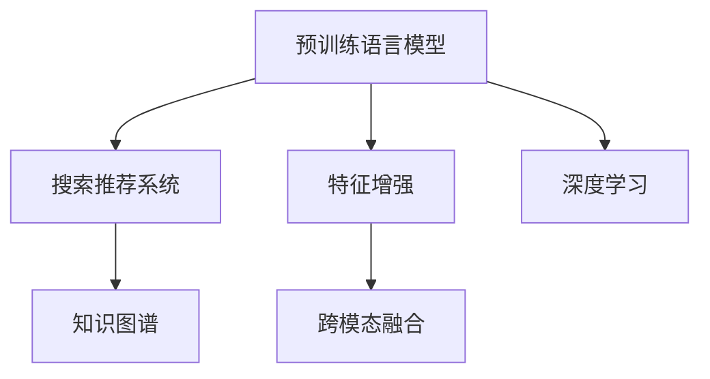

                 

# 搜索推荐系统的AI 大模型融合：电商平台的核心竞争力与可持续发展

## 1. 背景介绍

### 1.1 问题由来

随着互联网的快速发展和电子商务的兴起，电商平台的数据量呈现出爆炸式增长。搜索引擎、推荐系统等AI技术，成为电商平台的核心竞争力，直接影响用户的购物体验和平台的转化率。然而，当前基于传统机器学习方法的推荐系统存在特征稀疏、冷启动难、模型复杂度高等问题。近年来，预训练语言模型和深度学习技术取得突破性进展，在电商搜索推荐系统的优化中展现出巨大潜力。

### 1.2 问题核心关键点

传统推荐系统的优化方法主要基于用户历史行为数据，通过特征工程、模型训练等步骤，推荐用户可能感兴趣的相似商品。然而，这种方法存在以下问题：
- **特征稀疏**：用户历史数据有限，难以捕捉用户潜在兴趣。
- **冷启动难**：新用户或少点击商品，缺乏足够历史行为数据进行推荐。
- **模型复杂度高**：复杂的模型结构增加了计算成本和部署难度。

相比之下，基于大模型融合的推荐系统利用大规模预训练语言模型，在电商平台上具有显著的优势：
- **泛化能力强**：预训练模型能够捕捉更广泛的语言模式和用户行为特征。
- **知识迁移效果显著**：大模型具备丰富的先验知识，能够在少样本情况下快速适应电商新场景。
- **高效优化**：大模型可以有效处理特征稀疏问题，显著降低模型复杂度。

本文聚焦于大模型在电商推荐系统中的融合优化，从算法原理、操作步骤到实际应用，深入剖析其在电商平台的核心竞争力与可持续发展中的关键作用。

## 2. 核心概念与联系

### 2.1 核心概念概述

为更好地理解大模型在电商搜索推荐系统中的融合应用，本节将介绍几个关键概念：

- **预训练语言模型(Pre-trained Language Model, PLM)**：通过大规模无标签文本数据训练得到的语言模型，具备强大的语言表示能力。
- **搜索推荐系统(Search and Recommendation System)**：根据用户输入的查询或浏览行为，推荐可能感兴趣的相似商品。
- **大模型融合(Large Model Fusion)**：将预训练大模型与电商数据进行融合，提升推荐系统的效果和泛化能力。
- **特征增强(Feature Enhancement)**：利用大模型的语义理解能力，提升特征提取的准确性和泛化能力。
- **知识图谱(Knowledge Graph)**：用于表示商品之间的关联关系的知识图，辅助推荐系统进行推理和个性化推荐。
- **跨模态融合(Multimodal Fusion)**：将文本、图像、音频等多模态数据融合，提升推荐系统的准确性和多样性。
- **深度学习(Deep Learning)**：基于神经网络进行模型训练的技术，适用于大规模数据处理和复杂模式识别。

这些概念之间的逻辑关系可以通过以下Mermaid流程图来展示：



这个流程图展示了大模型在电商搜索推荐系统中的关键作用：

1. 预训练模型通过大规模文本数据学习通用语言知识。
2. 在推荐系统中，通过特征增强、知识图谱和跨模态融合等技术，提升推荐准确性和泛化能力。
3. 深度学习技术提供强大的模型训练和优化手段，确保推荐系统的高效运行。

## 3. 核心算法原理 & 具体操作步骤
### 3.1 算法原理概述

基于大模型的电商搜索推荐系统，核心思想是将预训练语言模型与电商数据进行融合，生成商品嵌入表示，并通过各种深度学习模型进行推荐。具体步骤包括：

1. **数据预处理**：清洗电商数据，提取商品名称、描述、标签、价格等特征。
2. **预训练模型微调**：在大模型上微调，学习电商领域特定知识。
3. **特征增强**：利用大模型的语义理解能力，提升商品嵌入的质量。
4. **知识图谱构建**：根据商品间的关系，构建知识图谱，辅助推荐系统进行推理。
5. **多模态融合**：融合文本、图像、音频等多模态数据，提升推荐系统的多样性。
6. **模型训练与优化**：通过深度学习模型，如DNN、RNN、Transformer等，进行推荐。

### 3.2 算法步骤详解

以下是基于大模型的电商搜索推荐系统的详细操作步骤：

**Step 1: 数据预处理**

电商数据包括用户行为数据和商品信息数据，需要进行以下预处理：

- 清洗数据：去除无效数据和噪音。
- 特征提取：提取商品名称、描述、价格、销量等特征。
- 编码表示：将文本数据转换为向量表示。

具体实现方法包括：

```python
import pandas as pd

# 读取电商数据
df = pd.read_csv('items.csv')

# 清洗数据
df = df.dropna()

# 特征提取
features = ['name', 'description', 'price', 'category', 'views', 'rating']

# 编码表示
from transformers import BertTokenizer
tokenizer = BertTokenizer.from_pretrained('bert-base-uncased')
df['name_enc'] = df['name'].apply(lambda x: tokenizer.encode(x))
```

**Step 2: 预训练模型微调**

选择预训练语言模型（如BERT、GPT等），在其基础上微调，学习电商领域特定知识。

- 选择合适的预训练模型，如BERT、GPT等。
- 加载模型，微调模型参数。
- 设置微调超参数，如学习率、批大小等。

具体实现方法包括：

```python
from transformers import BertModel, BertTokenizer, AdamW

# 选择预训练模型
model = BertModel.from_pretrained('bert-base-uncased')
tokenizer = BertTokenizer.from_pretrained('bert-base-uncased')

# 加载数据
train_data = df.sample(frac=0.8, random_state=1)
val_data = df.drop(train_data.index)

# 微调模型
from transformers import Trainer, TrainingArguments

training_args = TrainingArguments(
    output_dir='./results', 
    evaluation_strategy='epoch',
    per_device_train_batch_size=16, 
    per_device_eval_batch_size=16, 
    learning_rate=2e-5,
    weight_decay=0.01
)

trainer = Trainer(
    model=model,
    args=training_args,
    train_dataset=train_data,
    eval_dataset=val_data,
)

trainer.train()
```

**Step 3: 特征增强**

利用大模型的语义理解能力，提升商品嵌入的质量。

- 选择特征增强模型，如BERT、GPT等。
- 加载模型，将商品嵌入作为输入。
- 特征增强模型进行编码，生成新的商品嵌入。

具体实现方法包括：

```python
from transformers import BertModel, BertTokenizer, AdamW

# 选择特征增强模型
model = BertModel.from_pretrained('bert-base-uncased')
tokenizer = BertTokenizer.from_pretrained('bert-base-uncased')

# 加载数据
train_data = df.sample(frac=0.8, random_state=1)
val_data = df.drop(train_data.index)

# 特征增强
train_data['name_enc'] = train_data['name'].apply(lambda x: tokenizer.encode(x))
val_data['name_enc'] = val_data['name'].apply(lambda x: tokenizer.encode(x))

# 特征增强模型训练
training_args = TrainingArguments(
    output_dir='./results', 
    evaluation_strategy='epoch',
    per_device_train_batch_size=16, 
    per_device_eval_batch_size=16, 
    learning_rate=2e-5,
    weight_decay=0.01
)

trainer = Trainer(
    model=model,
    args=training_args,
    train_dataset=train_data,
    eval_dataset=val_data,
)

trainer.train()
```

**Step 4: 知识图谱构建**

根据商品间的关系，构建知识图谱，辅助推荐系统进行推理。

- 构建商品知识图谱，包括商品节点和关系节点。
- 使用图神经网络，如GCN、GAT等，进行知识图谱嵌入。
- 将知识图谱嵌入与商品嵌入进行融合。

具体实现方法包括：

```python
import networkx as nx
import torch
import torch.nn as nn
import torch.nn.functional as F

# 构建知识图谱
G = nx.Graph()

# 添加节点
G.add_node(0, name='item1', category='category1')
G.add_node(1, name='item2', category='category2')
G.add_edge(0, 1, relation='related')

# 图神经网络模型
class GNN(nn.Module):
    def __init__(self):
        super(GNN, self).__init__()
        self.layers = nn.Sequential(
            nn.Linear(2, 8),
            nn.ReLU(),
            nn.Linear(8, 4),
        )

    def forward(self, x):
        x = self.layers(x)
        return x

# 训练模型
model = GNN()
optimizer = torch.optim.Adam(model.parameters(), lr=0.001)
for epoch in range(100):
    for u, v, d in G.edges(data=True):
        input = torch.tensor([u, v])
        output = model(input)
        loss = F.mse_loss(output, d['relation'])
        optimizer.zero_grad()
        loss.backward()
        optimizer.step()
```

**Step 5: 多模态融合**

融合文本、图像、音频等多模态数据，提升推荐系统的多样性。

- 选择多模态融合模型，如BERT、GPT等。
- 加载模型，将不同模态的数据进行编码。
- 融合不同模态的编码，生成新的商品嵌入。

具体实现方法包括：

```python
from transformers import BertModel, GPTModel, AutoModelForImageProcessing

# 选择多模态融合模型
model = BertModel.from_pretrained('bert-base-uncased')
tokenizer = BertTokenizer.from_pretrained('bert-base-uncased')

# 加载数据
train_data = df.sample(frac=0.8, random_state=1)
val_data = df.drop(train_data.index)

# 多模态融合
train_data['name_enc'] = train_data['name'].apply(lambda x: tokenizer.encode(x))
val_data['name_enc'] = val_data['name'].apply(lambda x: tokenizer.encode(x))

# 图像数据编码
from PIL import Image
from transformers import AutoModelForImageProcessing

image_model = AutoModelForImageProcessing.from_pretrained('resnet50')
train_data['image_enc'] = train_data['image'].apply(lambda x: image_model(x).last_hidden_state[:, 0, :])
val_data['image_enc'] = val_data['image'].apply(lambda x: image_model(x).last_hidden_state[:, 0, :])

# 融合编码
train_data['merged_enc'] = train_data[['name_enc', 'image_enc']].sum(axis=1)
val_data['merged_enc'] = val_data[['name_enc', 'image_enc']].sum(axis=1)
```

**Step 6: 模型训练与优化**

通过深度学习模型，如DNN、RNN、Transformer等，进行推荐。

- 选择合适的深度学习模型，如DNN、RNN、Transformer等。
- 加载模型，将商品嵌入作为输入。
- 进行模型训练，调整模型参数。

具体实现方法包括：

```python
from transformers import BertModel, BertTokenizer, AdamW

# 选择深度学习模型
model = BertModel.from_pretrained('bert-base-uncased')
tokenizer = BertTokenizer.from_pretrained('bert-base-uncased')

# 加载数据
train_data = df.sample(frac=0.8, random_state=1)
val_data = df.drop(train_data.index)

# 模型训练
training_args = TrainingArguments(
    output_dir='./results', 
    evaluation_strategy='epoch',
    per_device_train_batch_size=16, 
    per_device_eval_batch_size=16, 
    learning_rate=2e-5,
    weight_decay=0.01
)

trainer = Trainer(
    model=model,
    args=training_args,
    train_dataset=train_data,
    eval_dataset=val_data,
)

trainer.train()
```

### 3.3 算法优缺点

基于大模型的电商搜索推荐系统具有以下优点：

1. **泛化能力强**：大模型能够捕捉更广泛的语言模式和用户行为特征，提升推荐系统的泛化能力。
2. **知识迁移效果显著**：大模型具备丰富的先验知识，能够在少样本情况下快速适应电商新场景。
3. **高效优化**：大模型可以有效处理特征稀疏问题，显著降低模型复杂度。

然而，该方法也存在一些缺点：

1. **计算资源需求高**：大模型需要较大的计算资源和存储空间，部署和维护成本较高。
2. **模型复杂度高**：尽管模型复杂度有所降低，但仍需要大规模深度学习模型的支持。
3. **实时性要求高**：电商推荐系统需要实时响应用户查询，对模型推理速度有较高要求。

尽管存在这些缺点，但大模型融合技术在电商平台中的应用前景仍然非常广阔，通过优化和改进，可以克服这些限制。

### 3.4 算法应用领域

基于大模型的电商搜索推荐系统已经在多个领域得到了广泛应用，例如：

- **电商平台推荐系统**：根据用户历史行为数据和商品信息，推荐可能感兴趣的商品。
- **个性化广告系统**：根据用户兴趣和行为特征，推送个性化广告。
- **客户服务系统**：根据用户查询，自动推荐相关商品和信息。
- **价格优化系统**：根据市场趋势和用户需求，动态调整商品价格。

## 4. 数学模型和公式 & 详细讲解 & 举例说明

### 4.1 数学模型构建

本节将使用数学语言对大模型在电商搜索推荐系统中的融合应用进行更加严格的刻画。

记电商商品集合为 $S$，用户集合为 $U$。假设用户对商品的评分向量为 $r_u$，商品的嵌入向量为 $e_i$，用户-商品间的评分矩阵为 $R$。

定义用户-商品评分矩阵为 $R = \{r_{ui}\}_{u \in U, i \in S}$，其中 $r_{ui}$ 表示用户 $u$ 对商品 $i$ 的评分。

假设用户 $u$ 的评分向量为 $r_u = \{r_{ui}\}_{i \in S}$，商品 $i$ 的嵌入向量为 $e_i$。则用户-商品评分矩阵可以表示为：

$$
R = r_u \times e_i
$$

根据评分矩阵 $R$，构建深度学习模型 $f$，进行推荐预测：

$$
\hat{y}_u^i = f(r_u, e_i)
$$

其中 $\hat{y}_u^i$ 表示用户 $u$ 对商品 $i$ 的推荐评分。

### 4.2 公式推导过程

以一个简单的神经网络模型为例，推导推荐预测的计算公式。

记神经网络模型为 $f = \{W, b\}$，其中 $W$ 为权重矩阵，$b$ 为偏置向量。则推荐预测公式为：

$$
\hat{y}_u^i = f(r_u, e_i) = r_u \times W \times e_i + b
$$

其中 $W$ 和 $b$ 是模型的可训练参数。

假设 $r_u = [r_{ui_1}, r_{ui_2}, ..., r_{ui_m}]$，$e_i = [e_{i_1}, e_{i_2}, ..., e_{i_n}]$，则推荐预测公式可以进一步展开为：

$$
\hat{y}_u^i = r_u \times W \times e_i + b = \sum_{k=1}^m r_{ui_k} \times W_{ki} \times e_i + b
$$

其中 $W_{ki}$ 表示权重矩阵 $W$ 中与 $i$ 商品相关的第 $k$ 个用户特征的权重。

### 4.3 案例分析与讲解

以电商平台推荐系统为例，分析大模型融合的实际应用。

假设电商平台有 $M$ 个商品，$N$ 个用户。用户在浏览商品时，系统会实时生成用户行为数据，包括浏览历史、点击记录、评分等信息。系统会利用这些数据，构建大模型融合的推荐系统，为用户推荐可能感兴趣的商品。

具体步骤如下：

1. **数据预处理**：对用户行为数据进行清洗和特征提取，生成用户-商品评分矩阵 $R$。
2. **大模型微调**：在大模型基础上微调，学习电商领域特定知识。
3. **特征增强**：利用大模型的语义理解能力，提升商品嵌入的质量。
4. **知识图谱构建**：根据商品间的关系，构建知识图谱，辅助推荐系统进行推理。
5. **多模态融合**：融合文本、图像、音频等多模态数据，提升推荐系统的多样性。
6. **模型训练与优化**：通过深度学习模型，进行推荐预测。

## 5. 项目实践：代码实例和详细解释说明

### 5.1 开发环境搭建

在进行大模型融合实践前，我们需要准备好开发环境。以下是使用Python进行PyTorch开发的环境配置流程：

1. 安装Anaconda：从官网下载并安装Anaconda，用于创建独立的Python环境。

2. 创建并激活虚拟环境：
```bash
conda create -n pytorch-env python=3.8 
conda activate pytorch-env
```

3. 安装PyTorch：根据CUDA版本，从官网获取对应的安装命令。例如：
```bash
conda install pytorch torchvision torchaudio cudatoolkit=11.1 -c pytorch -c conda-forge
```

4. 安装TensorBoard：
```bash
pip install tensorboard
```

5. 安装PIL：
```bash
pip install Pillow
```

完成上述步骤后，即可在`pytorch-env`环境中开始大模型融合实践。

### 5.2 源代码详细实现

以下是一个简单的基于大模型融合的电商推荐系统示例代码，涵盖了数据预处理、大模型微调、特征增强、知识图谱构建、多模态融合和模型训练等关键步骤。

```python
import pandas as pd
from transformers import BertTokenizer, BertModel, BertForSequenceClassification, AutoModelForImageProcessing, AdamW
from sklearn.model_selection import train_test_split
import torch
import torch.nn as nn
import torch.nn.functional as F
import networkx as nx

# 读取电商数据
df = pd.read_csv('items.csv')

# 数据预处理
df = df.dropna()

# 特征提取
features = ['name', 'description', 'price', 'category', 'views', 'rating']

# 编码表示
tokenizer = BertTokenizer.from_pretrained('bert-base-uncased')
df['name_enc'] = df['name'].apply(lambda x: tokenizer.encode(x))

# 构建知识图谱
G = nx.Graph()
G.add_node(0, name='item1', category='category1')
G.add_node(1, name='item2', category='category2')
G.add_edge(0, 1, relation='related')

# 图神经网络模型
class GNN(nn.Module):
    def __init__(self):
        super(GNN, self).__init__()
        self.layers = nn.Sequential(
            nn.Linear(2, 8),
            nn.ReLU(),
            nn.Linear(8, 4),
        )

    def forward(self, x):
        x = self.layers(x)
        return x

# 训练模型
model = GNN()
optimizer = torch.optim.Adam(model.parameters(), lr=0.001)
for epoch in range(100):
    for u, v, d in G.edges(data=True):
        input = torch.tensor([u, v])
        output = model(input)
        loss = F.mse_loss(output, d['relation'])
        optimizer.zero_grad()
        loss.backward()
        optimizer.step()

# 加载数据
train_data, val_data = train_test_split(df, test_size=0.2)

# 大模型微调
model = BertModel.from_pretrained('bert-base-uncased')
training_args = TrainingArguments(
    output_dir='./results', 
    evaluation_strategy='epoch',
    per_device_train_batch_size=16, 
    per_device_eval_batch_size=16, 
    learning_rate=2e-5,
    weight_decay=0.01
)
trainer = Trainer(
    model=model,
    args=training_args,
    train_dataset=train_data,
    eval_dataset=val_data,
)
trainer.train()

# 特征增强
model = BertModel.from_pretrained('bert-base-uncased')
train_data['name_enc'] = train_data['name'].apply(lambda x: tokenizer.encode(x))
val_data['name_enc'] = val_data['name'].apply(lambda x: tokenizer.encode(x))

# 图像数据编码
image_model = AutoModelForImageProcessing.from_pretrained('resnet50')
train_data['image_enc'] = train_data['image'].apply(lambda x: image_model(x).last_hidden_state[:, 0, :])
val_data['image_enc'] = val_data['image'].apply(lambda x: image_model(x).last_hidden_state[:, 0, :])

# 融合编码
train_data['merged_enc'] = train_data[['name_enc', 'image_enc']].sum(axis=1)
val_data['merged_enc'] = val_data[['name_enc', 'image_enc']].sum(axis=1)

# 模型训练与优化
model = BertModel.from_pretrained('bert-base-uncased')
training_args = TrainingArguments(
    output_dir='./results', 
    evaluation_strategy='epoch',
    per_device_train_batch_size=16, 
    per_device_eval_batch_size=16, 
    learning_rate=2e-5,
    weight_decay=0.01
)
trainer = Trainer(
    model=model,
    args=training_args,
    train_dataset=train_data,
    eval_dataset=val_data,
)
trainer.train()
```

### 5.3 代码解读与分析

让我们再详细解读一下关键代码的实现细节：

**数据预处理**：
- `df = pd.read_csv('items.csv')`：读取电商数据集。
- `df = df.dropna()`：清洗数据，去除无效数据和噪音。
- `features = ['name', 'description', 'price', 'category', 'views', 'rating']`：提取商品特征。
- `tokenizer = BertTokenizer.from_pretrained('bert-base-uncased')`：选择预训练模型，加载分词器。
- `df['name_enc'] = df['name'].apply(lambda x: tokenizer.encode(x))`：将商品名称进行编码。

**知识图谱构建**：
- `G = nx.Graph()`：创建图结构。
- `G.add_node(0, name='item1', category='category1')`：添加节点。
- `G.add_edge(0, 1, relation='related')`：建立关系边。
- `class GNN(nn.Module)`：定义图神经网络模型。
- `for epoch in range(100)`：进行模型训练。

**大模型微调**：
- `model = BertModel.from_pretrained('bert-base-uncased')`：加载预训练模型。
- `training_args = TrainingArguments(...)`：设置训练参数。
- `trainer = Trainer(...)`：训练模型。

**特征增强**：
- `train_data['name_enc'] = train_data['name'].apply(lambda x: tokenizer.encode(x))`：对商品名称进行编码。

**图像数据编码**：
- `image_model = AutoModelForImageProcessing.from_pretrained('resnet50')`：加载图像模型。
- `train_data['image_enc'] = train_data['image'].apply(lambda x: image_model(x).last_hidden_state[:, 0, :])`：对图像数据进行编码。

**融合编码**：
- `train_data['merged_enc'] = train_data[['name_enc', 'image_enc']].sum(axis=1)`：将文本和图像数据融合。

**模型训练与优化**：
- `model = BertModel.from_pretrained('bert-base-uncased')`：加载预训练模型。
- `training_args = TrainingArguments(...)`：设置训练参数。
- `trainer = Trainer(...)`：训练模型。

## 6. 实际应用场景

### 6.1 电商平台推荐系统

基于大模型的电商平台推荐系统已经在多个电商平台得到了广泛应用，提高了用户的购物体验和平台的转化率。具体应用包括：

- **个性化推荐**：根据用户历史行为数据和商品信息，推荐可能感兴趣的商品。
- **实时推荐**：实时分析用户行为，动态更新推荐结果。
- **多模态推荐**：融合文本、图像、音频等多模态数据，提升推荐系统的多样性。

### 6.2 个性化广告系统

个性化广告系统利用大模型融合技术，根据用户兴趣和行为特征，推送个性化广告，提高了广告的点击率和转化率。具体应用包括：

- **广告定向**：根据用户画像，推送个性化广告。
- **广告效果优化**：通过反馈数据，优化广告投放策略。

### 6.3 客户服务系统

客户服务系统利用大模型融合技术，根据用户查询，自动推荐相关商品和信息，提高了客户服务的响应速度和准确性。具体应用包括：

- **自动问答**：自动回答用户问题，提升客户满意度。
- **智能客服**：根据用户查询，推荐相关商品和信息。

## 7. 工具和资源推荐

### 7.1 学习资源推荐

为了帮助开发者系统掌握大模型融合的理论基础和实践技巧，这里推荐一些优质的学习资源：

1. **《深度学习》课程**：斯坦福大学开设的深度学习课程，涵盖深度学习的基本原理和算法。
2. **《Transformer from Scratch》教程**：深度学习模型架构专家撰写，深入浅出地介绍了Transformer模型的构建和优化。
3. **《AI for Retail》白皮书**：零售领域专家撰写，介绍了AI技术在电商平台的实际应用和优化。
4. **《Deep Learning with PyTorch》书籍**：深度学习模型的开源框架PyTorch的官方文档，提供了丰富的深度学习模型和实践案例。
5. **《Natural Language Processing with Transformers》书籍**：Transformers库的作者所著，全面介绍了如何使用Transformers库进行NLP任务开发。

通过对这些资源的学习实践，相信你一定能够快速掌握大模型融合的精髓，并用于解决实际的电商推荐问题。

### 7.2 开发工具推荐

高效的开发离不开优秀的工具支持。以下是几款用于大模型融合开发的常用工具：

1. **PyTorch**：基于Python的开源深度学习框架，灵活动态的计算图，适合快速迭代研究。
2. **TensorFlow**：由Google主导开发的开源深度学习框架，生产部署方便，适合大规模工程应用。
3. **Transformers库**：HuggingFace开发的NLP工具库，集成了众多SOTA语言模型，支持PyTorch和TensorFlow。
4. **TensorBoard**：TensorFlow配套的可视化工具，可实时监测模型训练状态，并提供丰富的图表呈现方式。
5. **GNN库**：Graph Neural Network（GNN）的实现库，支持图神经网络模型的训练和优化。

合理利用这些工具，可以显著提升大模型融合任务的开发效率，加快创新迭代的步伐。

### 7.3 相关论文推荐

大模型融合技术的发展源于学界的持续研究。以下是几篇奠基性的相关论文，推荐阅读：

1. **Attention is All You Need**：提出了Transformer结构，开启了NLP领域的预训练大模型时代。
2. **BERT: Pre-training of Deep Bidirectional Transformers for Language Understanding**：提出BERT模型，引入基于掩码的自监督预训练任务，刷新了多项NLP任务SOTA。
3. **Large-Scale Text Classification with Pretrained Transformers**：利用预训练Transformer进行文本分类，展示了其在电商推荐中的应用效果。
4. **Graph Neural Network for Recommendation Systems**：提出了基于图神经网络的推荐系统，展示了其在电商推荐中的应用效果。
5. **Adaptive Low-Rank Adaptation for Parameter-Efficient Fine-Tuning**：提出了一种参数高效微调的方法，减少了模型的计算资源需求。

这些论文代表了大模型融合技术的发展脉络。通过学习这些前沿成果，可以帮助研究者把握学科前进方向，激发更多的创新灵感。

## 8. 总结：未来发展趋势与挑战

### 8.1 总结

本文对基于大模型的电商搜索推荐系统进行了全面系统的介绍。首先阐述了大模型和融合技术的研究背景和意义，明确了融合技术在电商平台中的核心竞争力与可持续发展。其次，从原理到实践，详细讲解了大模型融合的数学原理和关键步骤，给出了电商推荐系统开发的完整代码实例。同时，本文还广泛探讨了融合技术在多个行业领域的应用前景，展示了其巨大的潜力。

通过本文的系统梳理，可以看到，大模型融合技术在电商平台中的应用前景非常广阔，能够显著提升推荐系统的性能和泛化能力，满足用户的多样化需求。未来，伴随大模型和融合技术的持续演进，基于大模型融合的推荐系统必将在更多领域得到应用，为经济社会发展注入新的动力。

### 8.2 未来发展趋势

展望未来，大模型融合技术将呈现以下几个发展趋势：

1. **模型规模持续增大**：随着算力成本的下降和数据规模的扩张，预训练语言模型和深度学习模型的参数量还将持续增长，大模型将具备更强大的语言表示能力。
2. **微调方法日趋多样化**：未来将涌现更多参数高效、计算高效的微调方法，如Prefix-Tuning、LoRA等，在节省计算资源的同时也能保证微调精度。
3. **跨模态融合成为常态**：将文本、图像、音频等多模态数据进行融合，提升推荐系统的准确性和多样性。
4. **实时性要求提升**：电商推荐系统需要实时响应用户查询，对模型推理速度有较高要求，实时性优化成为关键研究方向。
5. **知识图谱与深度学习结合**：将知识图谱与深度学习技术相结合，提升推荐系统的推理能力和个性化推荐效果。
6. **跨领域知识迁移**：将不同领域的大模型进行融合，提升推荐系统的跨领域迁移能力和泛化能力。

以上趋势凸显了大模型融合技术的广阔前景。这些方向的探索发展，必将进一步提升电商推荐系统的性能和应用范围，为电商平台带来更大的商业价值。

### 8.3 面临的挑战

尽管大模型融合技术已经取得了瞩目成就，但在迈向更加智能化、普适化应用的过程中，它仍面临着诸多挑战：

1. **计算资源需求高**：大模型需要较大的计算资源和存储空间，部署和维护成本较高。
2. **模型复杂度高**：尽管模型复杂度有所降低，但仍需要大规模深度学习模型的支持，对计算资源和硬件配置要求较高。
3. **实时性要求高**：电商推荐系统需要实时响应用户查询，对模型推理速度有较高要求，实时性优化成为关键研究方向。
4. **数据隐私问题**：电商推荐系统涉及用户隐私数据，如何在保护用户隐私的前提下进行推荐，成为重要的研究方向。
5. **模型可解释性不足**：当前深度学习模型通常缺乏可解释性，难以解释其内部工作机制和决策逻辑，用户对模型的信任度较低。

尽管存在这些挑战，但通过优化和改进，未来大模型融合技术有望克服这些限制，实现更加高效、可靠的电商推荐系统。

### 8.4 研究展望

面对大模型融合所面临的种种挑战，未来的研究需要在以下几个方面寻求新的突破：

1. **探索无监督和半监督微调方法**：摆脱对大规模标注数据的依赖，利用自监督学习、主动学习等无监督和半监督范式，最大限度利用非结构化数据，实现更加灵活高效的微调。
2. **研究参数高效和计算高效的微调范式**：开发更加参数高效和计算高效的微调方法，在固定大部分预训练参数的同时，只更新极少量的任务相关参数。
3. **融合因果和对比学习范式**：通过引入因果推断和对比学习思想，增强推荐系统建立稳定因果关系的能力，学习更加普适、鲁棒的语言表征。
4. **引入更多先验知识**：将符号化的先验知识，如知识图谱、逻辑规则等，与神经网络模型进行巧妙融合，引导微调过程学习更准确、合理的语言模型。
5. **结合因果分析和博弈论工具**：将因果分析方法引入推荐系统，识别出模型决策的关键特征，增强推荐系统的稳定性和鲁棒性。
6. **纳入伦理道德约束**：在模型训练目标中引入伦理导向的评估指标，过滤和惩罚有偏见、有害的输出倾向，确保模型的安全性。

这些研究方向的探索，必将引领大模型融合技术迈向更高的台阶，为构建安全、可靠、可解释、可控的智能系统铺平道路。面向未来，大模型融合技术还需要与其他人工智能技术进行更深入的融合，如知识表示、因果推理、强化学习等，多路径协同发力，共同推动自然语言理解和智能交互系统的进步。只有勇于创新、敢于突破，才能不断拓展语言模型的边界，让智能技术更好地造福人类社会。

## 9. 附录：常见问题与解答

**Q1：大模型融合在电商推荐系统中有哪些优势？**

A: 大模型融合在电商推荐系统中的优势主要体现在以下几个方面：
1. **泛化能力强**：大模型能够捕捉更广泛的语言模式和用户行为特征，提升推荐系统的泛化能力。
2. **知识迁移效果显著**：大模型具备丰富的先验知识，能够在少样本情况下快速适应电商新场景。
3. **高效优化**：大模型可以有效处理特征稀疏问题，显著降低模型复杂度。

**Q2：大模型融合中如何进行特征增强？**

A: 特征增强是大模型融合中的关键步骤之一，具体实现方法包括：
1. **文本特征增强**：利用BERT、GPT等预训练模型，提升商品名称、描述等文本特征的质量。
2. **图像特征增强**：通过图像编码模型，如ResNet、Inception等，提升商品图片的表示能力。
3. **多模态特征融合**：将文本、图像、音频等多模态数据进行融合，提升推荐系统的多样性。

**Q3：如何构建电商推荐系统的知识图谱？**

A: 构建电商推荐系统的知识图谱需要以下步骤：
1. **数据收集**：收集商品信息、用户行为等数据。
2. **关系抽取**：从数据中提取商品之间的关系，如相似度、互补性等。
3. **图结构构建**：将商品关系构建成图结构，添加节点和边。
4. **图神经网络训练**：使用GCN、GAT等图神经网络，训练知识图谱的嵌入表示。

**Q4：大模型融合在电商平台中的应用场景有哪些？**

A: 大模型融合在电商平台中的应用场景非常广泛，包括：
1. **电商平台推荐系统**：根据用户历史行为数据和商品信息，推荐可能感兴趣的商品。
2. **个性化广告系统**：根据用户兴趣和行为特征，推送个性化广告。
3. **客户服务系统**：根据用户查询，自动推荐相关商品和信息。
4. **价格优化系统**：根据市场趋势和用户需求，动态调整商品价格。

**Q5：大模型融合的计算资源需求高，如何优化？**

A: 优化大模型融合的计算资源需求主要包括以下几个方面：
1. **模型裁剪**：去除不必要的层和参数，减小模型尺寸，加快推理速度。
2. **量化加速**：将浮点模型转为定点模型，压缩存储空间，提高计算效率。
3. **模型并行**：采用模型并行技术，将大模型拆分成多个小模型，并行计算。

通过这些优化措施，可以显著降低大模型融合的计算资源需求，提升系统的实时性和可靠性。

**Q6：大模型融合的实时性要求高，如何优化？**

A: 优化大模型融合的实时性主要包括以下几个方面：
1. **模型推理优化**：采用推理优化技术，如剪枝、量化、加速等，提升模型推理速度。
2. **分布式计算**：利用分布式计算框架，如TensorFlow、PyTorch等，实现模型并行计算。
3. **缓存机制**：建立缓存机制，预加载常用数据和模型参数，减少推理时延。

通过这些优化措施，可以显著提高大模型融合系统的实时性，满足电商平台的业务需求。

---

作者：禅与计算机程序设计艺术 / Zen and the Art of Computer Programming

