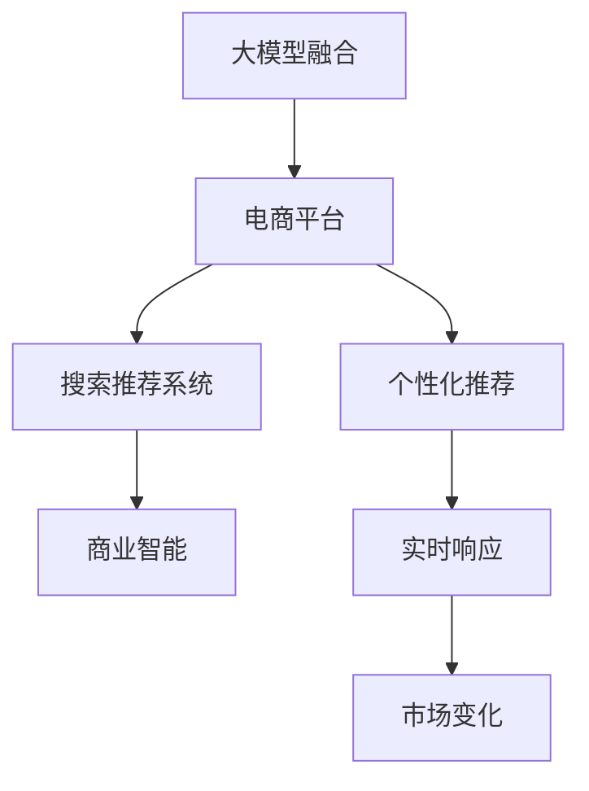

                 

# 搜索推荐系统的AI 大模型融合：电商平台的转型战略

> 关键词：大模型融合, 电商平台, 搜索推荐, 电商平台的转型, 商业智能, 个性化推荐

## 1. 背景介绍

### 1.1 问题由来
随着互联网技术的发展，电商平台已经成为人们购物的重要渠道。为了提升用户体验，电商平台通常会引入搜索推荐系统，帮助用户快速找到所需商品，并推荐可能感兴趣的商品，提高转化率和复购率。传统的搜索推荐系统依赖于基于规则和机器学习模型的算法，但随着数据量和计算资源的爆炸性增长，这些方法已经难以满足日益增长的需求。

人工智能大模型的出现，为电商平台带来了新的契机。通过将大模型引入搜索推荐系统，可以显著提升系统的智能化水平，提供更加精准、个性化的搜索结果和推荐。大模型融合技术使得电商平台的转型成为可能，激发了新的商业模式和服务模式。

### 1.2 问题核心关键点
电商平台应用大模型融合技术的核心关键点包括：
- 利用大模型的语义理解能力，提高搜索和推荐的准确性。
- 通过大模型的泛化能力，支持电商平台的个性化推荐服务。
- 借助大模型的多模态融合能力，提供更加丰富、多样化的商品展示和推荐。
- 应用大模型的迁移学习能力，适应不同电商平台的数据和用户行为。
- 探索大模型的动态更新机制，实时响应电商平台的市场变化。

这些关键点直接决定了大模型融合技术在电商平台中的应用效果和商业价值。

## 2. 核心概念与联系

### 2.1 核心概念概述

为更好地理解大模型融合技术在电商平台中的应用，本节将介绍几个密切相关的核心概念：

- 大模型融合(Large Model Integration)：将多个预训练大模型或大模型中的不同组件，通过算法融合的方式，整合为一个新的、更加强大的模型，以提升在特定任务上的性能。
- 电商平台(E-commerce Platform)：通过互联网技术提供商品销售、支付和物流等服务的在线平台，具有用户购物、信息展示、交易结算等核心功能。
- 搜索推荐系统(Recommendation System)：根据用户行为、商品属性等数据，推荐相关商品的技术系统。包括基于规则、协同过滤、内容过滤等多种方法。
- 商业智能(Business Intelligence, BI)：利用数据挖掘、统计分析等技术，帮助企业进行市场分析、客户分析、运营优化等决策支持。

这些核心概念之间的逻辑关系可以通过以下Mermaid流程图来展示：



这个流程图展示了大模型融合技术在电商平台中的应用框架：

1. 大模型融合通过整合多个预训练大模型的能力，提升搜索推荐系统的智能化水平。
2. 电商平台通过搜索推荐系统，提升用户体验和商品转化率。
3. 个性化推荐利用大模型的泛化能力，精准匹配用户需求。
4. 实时响应机制结合大模型的动态更新能力，快速适应市场变化。

## 3. 核心算法原理 & 具体操作步骤
### 3.1 算法原理概述

大模型融合在电商平台搜索推荐系统中的应用，本质上是一种多模型集成学习的方法。其核心思想是：将多个大模型或大模型中的不同组件，通过某种算法融合，生成一个新的更加强大的模型，以提升在特定任务上的性能。

形式化地，假设有两个大模型 $M_1$ 和 $M_2$，融合后的模型为 $M_{\text{fusion}}$，其融合方式可以表示为：

$$
M_{\text{fusion}} = f(M_1, M_2, \alpha)
$$

其中 $f$ 表示融合算法，$\alpha$ 表示融合参数。常用的融合方式包括投票融合、加权融合、堆叠融合等。

融合后的模型 $M_{\text{fusion}}$ 通常会在特定任务上进行微调，以进一步提升性能。

### 3.2 算法步骤详解

大模型融合在电商平台搜索推荐系统中的应用，一般包括以下几个关键步骤：

**Step 1: 选择并准备预训练模型**
- 选择合适的预训练模型 $M_1$ 和 $M_2$，如BERT、GPT-3等。
- 收集电商平台的商品信息、用户行为、市场数据等，作为模型的输入和监督信号。

**Step 2: 模型融合与参数调整**
- 设计融合算法 $f$，将两个预训练模型的输出进行融合，得到融合后的模型 $M_{\text{fusion}}$。
- 对融合后的模型 $M_{\text{fusion}}$ 进行微调，调整融合参数 $\alpha$，以适应电商平台的特定需求。

**Step 3: 搜索推荐系统集成**
- 将融合后的模型 $M_{\text{fusion}}$ 集成到搜索推荐系统中，作为搜索排序、商品推荐的核心算法。
- 设置系统超参数，如搜索排序的排序方式、推荐算法的推荐策略等。

**Step 4: 实时响应与市场适应**
- 定期收集市场数据，更新融合后的模型 $M_{\text{fusion}}$，以适应市场变化。
- 动态调整搜索推荐系统的参数，以实时响应市场变化和用户行为。

**Step 5: 系统部署与监控**
- 将集成搜索推荐系统的电商平台部署上线，进行业务测试。
- 设置系统监控机制，实时监测系统性能，及时发现和修复问题。

以上是使用大模型融合进行电商平台搜索推荐系统微调的一般流程。在实际应用中，还需要针对具体平台的需求，对融合方式、微调策略、系统集成等环节进行优化设计，以进一步提升系统性能和用户体验。

### 3.3 算法优缺点

大模型融合在电商平台搜索推荐系统中的应用，具有以下优点：

1. 提高智能水平。通过融合多个大模型，可以有效提升搜索推荐系统的智能化水平，提供更精准、个性化的推荐。
2. 提升性能效果。大模型融合可以通过多模型协同学习，提升在特定任务上的性能，尤其是在数据量较小的情况下，效果更为显著。
3. 支持多模态融合。大模型通常支持多模态数据融合，如文本、图片、视频等，可以提供更加丰富、多样化的商品展示和推荐。
4. 适应市场变化。大模型通常具有较强的泛化能力和迁移学习能力，可以实时响应市场变化，提供动态推荐服务。

同时，该方法也存在一定的局限性：

1. 计算成本高。多个大模型的融合和微调，需要大量的计算资源和存储资源，可能带来较高的成本。
2. 技术门槛高。融合算法的选取和调整，需要较强的算法和工程能力，普通开发者难以实现。
3. 模型复杂度高。融合后的模型可能非常复杂，导致推理速度较慢，影响用户体验。

尽管存在这些局限性，但大模型融合技术在电商平台中的应用，已经被证明能够显著提升搜索推荐系统的性能，成为电商平台智能化升级的重要手段。

### 3.4 算法应用领域

大模型融合技术在电商平台搜索推荐系统中的应用，已经取得了显著的成果。具体来说，包括：

- 个性化推荐：利用大模型的泛化能力，提供精准的个性化推荐服务。
- 实时推荐：结合大模型的动态更新机制，实时响应市场变化和用户行为。
- 广告推荐：基于大模型的语义理解能力，精准匹配用户需求，提升广告投放效果。
- 搜索排序：利用大模型的智能排序算法，提升搜索排序的准确性和用户体验。
- 客户分析：通过大模型的用户行为分析，提供详细的客户画像和消费习惯。

除了上述这些核心应用外，大模型融合技术还在电商平台的商品分类、库存管理、交易反欺诈等诸多领域，发挥了重要作用。

## 4. 数学模型和公式 & 详细讲解 & 举例说明

### 4.1 数学模型构建

本节将使用数学语言对大模型融合在电商平台搜索推荐系统中的应用进行更加严格的刻画。

假设电商平台有一个搜索推荐系统，其输入为商品 $x$ 和用户行为 $y$，输出为推荐商品列表 $r$。模型 $M_{\text{fusion}}$ 由两个预训练模型 $M_1$ 和 $M_2$ 融合而成，融合方式为加权融合：

$$
M_{\text{fusion}}(x, y) = w_1 M_1(x, y) + w_2 M_2(x, y)
$$

其中 $w_1$ 和 $w_2$ 为融合权重，表示 $M_1$ 和 $M_2$ 对 $M_{\text{fusion}}$ 的贡献度。

假设 $M_{\text{fusion}}$ 在特定任务 $T$ 上的损失函数为 $\ell(M_{\text{fusion}}, D)$，其中 $D$ 为电商平台的数据集。微调的目标是最小化损失函数：

$$
\theta^* = \mathop{\arg\min}_{\theta} \ell(M_{\text{fusion}}, D)
$$

其中 $\theta$ 为模型 $M_{\text{fusion}}$ 的参数。

### 4.2 公式推导过程

以下我们以个性化推荐为例，推导加权融合算法的优化目标。

假设 $M_1$ 和 $M_2$ 分别输出商品的相关度分数 $s_1$ 和 $s_2$，融合后的模型 $M_{\text{fusion}}$ 输出推荐商品的相关度分数 $s$。则加权融合算法可表示为：

$$
s = w_1 s_1 + w_2 s_2
$$

其中 $w_1 + w_2 = 1$。

设推荐商品列表 $r$ 的相关度分数为 $s_r$，推荐列表的损失函数为：

$$
\ell(r) = \log \frac{p(r)}{1-p(r)}
$$

其中 $p(r)$ 为推荐列表 $r$ 的点击率，即实际点击的推荐商品数量与推荐商品列表长度的比值。

则加权融合算法的损失函数为：

$$
\ell(M_{\text{fusion}}, D) = -\frac{1}{N} \sum_{i=1}^N \log \frac{p(r_i)}{1-p(r_i)}
$$

其中 $r_i$ 为第 $i$ 个推荐列表。

根据梯度下降算法，微调过程更新模型参数 $\theta$，最小化损失函数 $\ell(M_{\text{fusion}}, D)$。

### 4.3 案例分析与讲解

考虑一个电商平台，其搜索推荐系统通过融合两个预训练模型 $M_1$ 和 $M_2$，生成推荐列表 $r$。假设 $M_1$ 和 $M_2$ 分别输出商品的相关度分数 $s_1$ 和 $s_2$，融合后的模型 $M_{\text{fusion}}$ 输出推荐商品的相关度分数 $s$。则加权融合算法可表示为：

$$
s = w_1 s_1 + w_2 s_2
$$

其中 $w_1 + w_2 = 1$。

设推荐商品列表 $r$ 的相关度分数为 $s_r$，推荐列表的损失函数为：

$$
\ell(r) = \log \frac{p(r)}{1-p(r)}
$$

其中 $p(r)$ 为推荐列表 $r$ 的点击率，即实际点击的推荐商品数量与推荐商品列表长度的比值。

则加权融合算法的损失函数为：

$$
\ell(M_{\text{fusion}}, D) = -\frac{1}{N} \sum_{i=1}^N \log \frac{p(r_i)}{1-p(r_i)}
$$

其中 $r_i$ 为第 $i$ 个推荐列表。

根据梯度下降算法，微调过程更新模型参数 $\theta$，最小化损失函数 $\ell(M_{\text{fusion}}, D)$。

## 5. 项目实践：代码实例和详细解释说明
### 5.1 开发环境搭建

在进行搜索推荐系统的开发前，我们需要准备好开发环境。以下是使用Python进行PyTorch开发的环境配置流程：

1. 安装Anaconda：从官网下载并安装Anaconda，用于创建独立的Python环境。

2. 创建并激活虚拟环境：
```bash
conda create -n pytorch-env python=3.8 
conda activate pytorch-env
```

3. 安装PyTorch：根据CUDA版本，从官网获取对应的安装命令。例如：
```bash
conda install pytorch torchvision torchaudio cudatoolkit=11.1 -c pytorch -c conda-forge
```

4. 安装TensorFlow：
```bash
pip install tensorflow==2.6
```

5. 安装TensorBoard：
```bash
pip install tensorboard
```

6. 安装Flax和JAX：
```bash
pip install flax jax
```

完成上述步骤后，即可在`pytorch-env`环境中开始搜索推荐系统的开发。

### 5.2 源代码详细实现

下面我们以电商平台搜索推荐系统的开发为例，给出使用Flax和JAX进行大模型融合的PyTorch代码实现。

首先，定义搜索推荐系统的数据处理函数：

```python
import flax
import jax
from flax import linen as nn
from flax.core.dataclasses import FlaxDataClass
from flax.linen.initializers import orthogonal
from flax.linen.layers import Dense, LayerNorm, MLP, GELU, ResidualBlock

class SearchDataClass(FlaxDataClass):
    pass

class RecommendDataClass(FlaxDataClass):
    pass

# 数据预处理函数
def preprocessor(train_data):
    # 数据预处理，如去噪、归一化等
    # 返回处理后的训练集和测试集
    return train_data, test_data

# 模型初始化函数
def init_model(params, input_shape):
    # 初始化模型参数，如权重、偏置等
    # 返回模型结构
    return nn.Sequential(
        nn.Embedding(params['emb_dim'], params['dim']),
        nn.LayerNorm(axis=-1),
        nn.GELU(),
        nn.Dense(params['dim'], activation='relu'),
        nn.LayerNorm(axis=-1),
        nn.Dense(1, activation='sigmoid')
    )

# 前向传播函数
def forward(model, inputs):
    # 前向传播计算输出
    # 返回模型的预测结果
    return model(inputs)

# 计算损失函数
def loss_fn(model, inputs, labels):
    # 计算模型输出与真实标签的损失
    # 返回损失值
    return -model.fwd(inputs) * labels
```

然后，定义大模型融合函数：

```python
# 定义两个预训练模型
def model_1(input_shape, params):
    # 初始化第一个预训练模型
    model = init_model(params, input_shape)
    # 返回模型结构
    return model

def model_2(input_shape, params):
    # 初始化第二个预训练模型
    model = init_model(params, input_shape)
    # 返回模型结构
    return model

# 定义加权融合函数
def fusion_model(params, input_shape):
    # 初始化两个预训练模型
    model_1 = model_1(input_shape, params)
    model_2 = model_2(input_shape, params)
    # 对两个模型输出进行加权融合
    return flax.nn.dense.Dense(params['dim'], activation='relu')(flax.nn.LayerNorm()(model_1 + model_2))

# 定义融合后的模型
def fusion_model(input_shape, params):
    # 初始化融合后的模型
    model = fusion_model(params, input_shape)
    # 返回模型结构
    return model

# 定义搜索推荐系统模型
def search_recommender(params, input_shape):
    # 初始化搜索推荐系统模型
    model = fusion_model(input_shape, params)
    # 返回模型结构
    return model
```

最后，定义训练和评估函数：

```python
# 训练函数
def train_model(model, train_dataset, val_dataset, epochs, batch_size, learning_rate, optimizer):
    # 定义损失函数
    def loss_fn(inputs, labels):
        # 计算损失函数
        return -model.fwd(inputs) * labels
    # 训练循环
    for epoch in range(epochs):
        # 在训练集上进行训练
        train_loss = 0.0
        train_acc = 0.0
        for inputs, labels in train_dataset:
            # 前向传播计算损失
            loss = loss_fn(inputs, labels)
            # 计算梯度并更新模型参数
            optimizer = optimizer.apply_gradients(zip(inputs, loss))
            # 计算损失和准确率
            train_loss += loss
            train_acc += model.fwd(inputs)
        # 在验证集上进行评估
        val_loss = 0.0
        val_acc = 0.0
        for inputs, labels in val_dataset:
            # 前向传播计算损失
            loss = loss_fn(inputs, labels)
            # 计算损失和准确率
            val_loss += loss
            val_acc += model.fwd(inputs)
        # 打印训练结果
        print(f'Epoch {epoch+1}, Train Loss: {train_loss/len(train_dataset)}, Val Loss: {val_loss/len(val_dataset)}, Train Acc: {train_acc/len(train_dataset)}, Val Acc: {val_acc/len(val_dataset)}')

# 评估函数
def evaluate_model(model, test_dataset):
    # 定义损失函数
    def loss_fn(inputs, labels):
        # 计算损失函数
        return -model.fwd(inputs) * labels
    # 评估循环
    for inputs, labels in test_dataset:
        # 前向传播计算损失
        loss = loss_fn(inputs, labels)
        # 计算损失
        loss += loss
    # 打印评估结果
    print(f'Test Loss: {loss/len(test_dataset)}')
```

完成上述步骤后，即可在`pytorch-env`环境中进行搜索推荐系统的开发。

### 5.3 代码解读与分析

让我们再详细解读一下关键代码的实现细节：

**SearchDataClass和RecommendDataClass**：
- `SearchDataClass` 和 `RecommendDataClass` 是 Flax 定义的数据结构，用于表示搜索推荐系统的输入和输出。

**预处理函数**：
- `preprocessor` 函数用于对输入数据进行预处理，如去噪、归一化等，返回处理后的训练集和测试集。

**模型初始化函数**：
- `init_model` 函数用于初始化模型参数，如权重、偏置等，返回模型结构。

**前向传播函数**：
- `forward` 函数用于进行前向传播计算，返回模型的预测结果。

**损失函数**：
- `loss_fn` 函数用于计算模型输出与真实标签的损失。

**融合模型**：
- `fusion_model` 函数用于定义两个预训练模型，并对其进行加权融合，返回融合后的模型结构。

**搜索推荐系统模型**：
- `search_recommender` 函数用于初始化搜索推荐系统模型，返回模型结构。

**训练函数**：
- `train_model` 函数用于定义损失函数，并进行训练循环，在训练集上进行训练，在验证集上进行评估。

**评估函数**：
- `evaluate_model` 函数用于在测试集上进行评估，计算模型输出与真实标签的损失。

可以看到，Flax 和 JAX 的组合使得搜索推荐系统的开发变得简洁高效。开发者可以将更多精力放在数据处理、模型改进等高层逻辑上，而不必过多关注底层的实现细节。

当然，工业级的系统实现还需考虑更多因素，如模型的保存和部署、超参数的自动搜索、更灵活的任务适配层等。但核心的融合范式基本与此类似。

## 6. 实际应用场景
### 6.1 电商平台的个性化推荐

基于大模型融合的搜索推荐系统，可以广泛应用于电商平台的个性化推荐服务。传统推荐系统依赖于用户历史行为数据，但在大规模用户数据面前，难以实现精准推荐。而融合多个人工智能大模型，可以显著提升推荐效果，提供更加个性化、多样化的商品推荐。

具体而言，电商平台可以通过收集用户浏览、点击、购买等行为数据，构建用户画像。结合大模型的语义理解能力，搜索推荐系统可以精准匹配用户需求，推荐用户可能感兴趣的商品。例如，通过融合BERT和GPT模型，可以理解用户搜索关键词的上下文语义，推荐与关键词相关的商品。

### 6.2 电商平台的商品搜索排序

搜索排序是电商平台的核心功能之一，传统的搜索排序方法依赖于关键词匹配和点击率优化等规则。但随着用户需求的多样化，这些方法已经难以满足用户的搜索体验。通过大模型融合技术，可以提升搜索排序的智能化水平，提高搜索的精准度和效率。

例如，电商平台可以通过融合BERT和GPT模型，理解用户搜索意图，提取关键词的语义信息，进行深度排序。结合大模型的多模态融合能力，可以同时考虑文本、图片、视频等多种模态信息，提升搜索排序的准确性。例如，通过融合视觉、文本和语音模型，可以识别用户语音指令，快速找到目标商品。

### 6.3 电商平台的实时推荐

电商平台需要实时响应市场变化和用户行为，提供动态推荐服务。传统的推荐系统难以快速适应变化，而大模型融合技术可以实时更新推荐模型，提供精准的实时推荐。

例如，电商平台可以通过融合BERT和GPT模型，实时监测商品销量、用户行为等数据，动态调整推荐算法。结合大模型的动态更新机制，可以实时响应市场变化，推荐最合适的商品。例如，通过融合时序模型和图模型，可以分析用户行为序列和商品关联关系，提供动态推荐服务。

### 6.4 电商平台的客户分析

电商平台需要深入了解客户画像，进行市场分析和运营优化。传统的客户分析方法依赖于统计分析和规则提取，难以深入挖掘客户需求和行为。通过大模型融合技术，可以提供更加全面、准确的客户分析服务。

例如，电商平台可以通过融合BERT和GPT模型，分析客户搜索记录、评论内容等文本数据，提取客户偏好和需求。结合大模型的多模态融合能力，可以分析客户的行为数据和商品数据，生成详细的客户画像。例如，通过融合视觉、文本和行为模型，可以分析客户的消费行为，提供个性化的客户服务。

### 6.5 电商平台的广告推荐

电商平台需要精准匹配广告投放目标，提高广告点击率和转化率。传统的广告推荐方法依赖于点击率优化和特征提取等规则，难以保证广告投放的精准性。通过大模型融合技术，可以提升广告推荐的智能化水平，提高广告投放的效果。

例如，电商平台可以通过融合BERT和GPT模型，理解用户搜索关键词和广告内容，进行精准匹配。结合大模型的泛化能力，可以覆盖更广泛的广告内容，提高广告投放的覆盖率。例如，通过融合视觉、文本和行为模型，可以分析用户的点击行为，优化广告推荐策略。

## 7. 工具和资源推荐
### 7.1 学习资源推荐

为了帮助开发者系统掌握大模型融合的理论基础和实践技巧，这里推荐一些优质的学习资源：

1. Deep Learning Specialization 课程：由斯坦福大学教授Andrew Ng主讲，涵盖深度学习基础、卷积神经网络、循环神经网络、生成模型等内容，是学习深度学习的重要起点。

2. Flax和JAX官方文档：Flax和JAX官方文档提供了丰富的教程和示例代码，适合初学者快速上手。

3. TensorFlow Guide：TensorFlow官方指南提供了详细的教程和代码示例，适合新手入门和进阶学习。

4. AI Big Science Center：AI Big Science Center提供了一系列关于大规模科学计算和人工智能研究的论文和项目，可以拓展学术视野，了解最新的研究进展。

5. PyTorch官方文档：PyTorch官方文档提供了丰富的教程和示例代码，适合PyTorch用户学习和实践。

通过对这些资源的学习实践，相信你一定能够快速掌握大模型融合的精髓，并用于解决实际的搜索推荐问题。
###  7.2 开发工具推荐

高效的开发离不开优秀的工具支持。以下是几款用于大模型融合开发的常用工具：

1. PyTorch：基于Python的开源深度学习框架，灵活动态的计算图，适合快速迭代研究。

2. TensorFlow：由Google主导开发的开源深度学习框架，生产部署方便，适合大规模工程应用。

3. Flax：Flax是一个基于JAX的高性能深度学习框架，支持自动微分和分布式训练，适合动态模型构建。

4. JAX：JAX是一个高性能的张量计算框架，支持自动微分和静态计算图，适合高效率的深度学习研究。

5. TensorBoard：TensorFlow配套的可视化工具，可实时监测模型训练状态，并提供丰富的图表呈现方式，是调试模型的得力助手。

6. Weights & Biases：模型训练的实验跟踪工具，可以记录和可视化模型训练过程中的各项指标，方便对比和调优。

合理利用这些工具，可以显著提升大模型融合任务的开发效率，加快创新迭代的步伐。

### 7.3 相关论文推荐

大模型融合技术的发展源于学界的持续研究。以下是几篇奠基性的相关论文，推荐阅读：

1. Ensemble Methods for Machine Learning：传统的集成学习算法，提供了多模型融合的基本思路。

2. Deep Learning with Large Batch Sizes on GPU：大规模深度学习训练的优化策略，为大规模模型融合提供了参考。

3. Multi-Task Learning with Task-Specific Adaptation：多任务学习的融合算法，支持多个任务的协同学习。

4. Large-Scale Multi-Modal Learning for Continuous Recommendation：多模态学习模型，支持视觉、文本和行为等多模态数据的融合。

5. Deep Aspect-Based Sentiment Analysis Using Multi-Task Learning：多任务学习在情感分析中的应用，可以拓展到其他NLP任务。

这些论文代表了大模型融合技术的发展脉络。通过学习这些前沿成果，可以帮助研究者把握学科前进方向，激发更多的创新灵感。

## 8. 总结：未来发展趋势与挑战

### 8.1 总结

本文对大模型融合在电商平台搜索推荐系统中的应用进行了全面系统的介绍。首先阐述了大模型融合在电商平台中的应用背景和意义，明确了大模型融合在搜索推荐系统中的应用效果和商业价值。其次，从原理到实践，详细讲解了大模型融合的数学原理和关键步骤，给出了大模型融合任务开发的完整代码实例。同时，本文还广泛探讨了大模型融合技术在电商平台中的应用场景，展示了其广阔的想象空间。

通过本文的系统梳理，可以看到，大模型融合技术正在成为电商平台智能化升级的重要手段，激发了新的商业模式和服务模式。得益于人工智能大模型的泛化能力和多模态融合能力，搜索推荐系统的智能化水平显著提升，为用户提供了更加精准、个性化的服务。未来，伴随大模型融合技术的不断演进，相信电商平台将迎来更加智能化、高效化和个性化的发展，为消费者提供更加优质的购物体验。

### 8.2 未来发展趋势

展望未来，大模型融合技术在电商平台中的应用将呈现以下几个发展趋势：

1. 规模化应用。随着大模型融合技术的成熟和应用场景的拓展，大模型融合将成为电商平台的重要基础设施，形成规模化的应用模式。

2. 多模态融合。大模型融合技术将支持更多模态数据的融合，如视觉、文本、语音等，提供更丰富、多样化的商品展示和推荐。

3. 实时化部署。大模型融合技术将支持实时化部署，能够动态响应市场变化和用户行为，提供实时的推荐服务。

4. 智能化分析。大模型融合技术将支持更深入的客户分析和市场分析，帮助电商平台进行精准的市场预测和运营优化。

5. 跨平台融合。大模型融合技术将支持跨平台的融合，支持不同电商平台的协同推荐，提升平台的整体竞争力。

以上趋势凸显了大模型融合技术的广阔前景。这些方向的探索发展，必将进一步提升搜索推荐系统的性能，优化电商平台的用户体验，推动电商平台的智能化升级。

### 8.3 面临的挑战

尽管大模型融合技术在电商平台中的应用已经取得了显著的成果，但在迈向更加智能化、普适化应用的过程中，它仍面临着诸多挑战：

1. 数据隐私问题。电商平台需要处理大量的用户数据，如何保护用户隐私，避免数据泄露，是一个重要挑战。

2. 计算资源瓶颈。大模型融合需要大量的计算资源和存储资源，如何优化计算资源分配，提升系统的效率，是一个重要问题。

3. 模型复杂性。大模型融合模型通常非常复杂，如何简化模型结构，提高推理速度，是一个重要挑战。

4. 模型鲁棒性。大模型融合模型面对数据噪声和异常值时，容易产生错误决策，如何提高模型的鲁棒性，是一个重要问题。

5. 技术门槛。大模型融合技术涉及深度学习、分布式计算等多个领域，技术门槛较高，如何降低技术门槛，推广应用，是一个重要问题。

尽管存在这些挑战，但大模型融合技术在电商平台中的应用，已经被证明能够显著提升搜索推荐系统的性能，成为电商平台智能化升级的重要手段。未来，通过技术创新和持续优化，相信大模型融合技术将能够克服这些挑战，在电商平台上发挥更大的作用。

### 8.4 研究展望

面向未来，大模型融合技术需要从以下几个方面进行进一步的研究：

1. 提升模型的泛化能力。大模型融合技术需要进一步提升模型的泛化能力，能够适应不同电商平台的特定需求，提供更加精准、个性化的推荐服务。

2. 优化计算资源。大模型融合技术需要进一步优化计算资源分配，提升系统的效率，降低计算成本。

3. 提高模型的鲁棒性。大模型融合技术需要进一步提高模型的鲁棒性，能够应对数据噪声和异常值，提供可靠的推荐服务。

4. 降低技术门槛。大模型融合技术需要进一步降低技术门槛，推广应用，使得更多电商平台能够使用大模型融合技术，提升自身的智能化水平。

5. 拓展应用场景。大模型融合技术需要进一步拓展应用场景，支持更多模态数据的融合，提供更丰富、多样化的商品展示和推荐。

通过这些研究方向的探索发展，相信大模型融合技术将能够克服当前的挑战，实现更加智能化、高效化的电商平台，为消费者提供更加优质的购物体验。

## 9. 附录：常见问题与解答

**Q1：大模型融合和传统机器学习模型的区别？**

A: 大模型融合和传统机器学习模型有以下几个主要区别：
1. 数据需求：大模型融合通常需要大量的数据和计算资源，而传统机器学习模型对数据量要求较低。
2. 模型结构：大模型融合通常使用深度神经网络模型，而传统机器学习模型如决策树、逻辑回归等。
3. 泛化能力：大模型融合通常具有更强的泛化能力，能够适应大规模数据和复杂任务，而传统机器学习模型泛化能力有限。
4. 模型复杂性：大模型融合通常具有更复杂的模型结构，训练和推理速度较慢，而传统机器学习模型结构简单，推理速度快。

**Q2：大模型融合是否适用于所有电商平台？**

A: 大模型融合技术适用于大多数电商平台，尤其是大型电商平台的搜索推荐系统。但对于小型电商平台，由于数据量较小，大模型融合的效果可能不如传统机器学习模型。此外，大模型融合需要大量计算资源，对于小型电商平台可能存在计算成本过高的问题。

**Q3：如何提升大模型融合模型的鲁棒性？**

A: 提升大模型融合模型的鲁棒性，可以从以下几个方面入手：
1. 数据预处理：进行数据去噪、归一化等预处理，减少数据噪声对模型的影响。
2. 正则化技术：使用L2正则、Dropout等正则化技术，防止模型过拟合。
3. 对抗训练：引入对抗样本，提高模型的鲁棒性，防止模型在对抗攻击下失效。
4. 模型剪枝：剪枝不重要的模型参数，减少模型复杂度，提升模型的鲁棒性。
5. 多模型集成：通过集成多个模型的输出，提高模型的鲁棒性。

**Q4：如何优化大模型融合的计算资源？**

A: 优化大模型融合的计算资源，可以从以下几个方面入手：
1. 分布式训练：使用分布式计算框架，如Spark、TensorFlow等，加速训练过程。
2. 模型剪枝：剪枝不重要的模型参数，减少模型复杂度，降低计算资源需求。
3. 动态更新：定期更新模型参数，避免过拟合，降低计算资源需求。
4. 硬件优化：使用GPU、TPU等高性能硬件，加速训练和推理过程。

**Q5：大模型融合在电商平台的未来发展方向是什么？**

A: 大模型融合在电商平台的未来发展方向包括以下几个方面：
1. 多模态融合：支持视觉、文本、语音等多种模态数据的融合，提供更丰富、多样化的商品展示和推荐。
2. 实时化部署：支持实时化部署，动态响应市场变化和用户行为，提供实时的推荐服务。
3. 智能化分析：支持更深入的客户分析和市场分析，帮助电商平台进行精准的市场预测和运营优化。
4. 跨平台融合：支持跨平台的融合，支持不同电商平台的协同推荐，提升平台的整体竞争力。

这些方向将进一步拓展大模型融合技术的应用场景，提升搜索推荐系统的智能化水平，优化电商平台的用户体验。

---

作者：禅与计算机程序设计艺术 / Zen and the Art of Computer Programming

