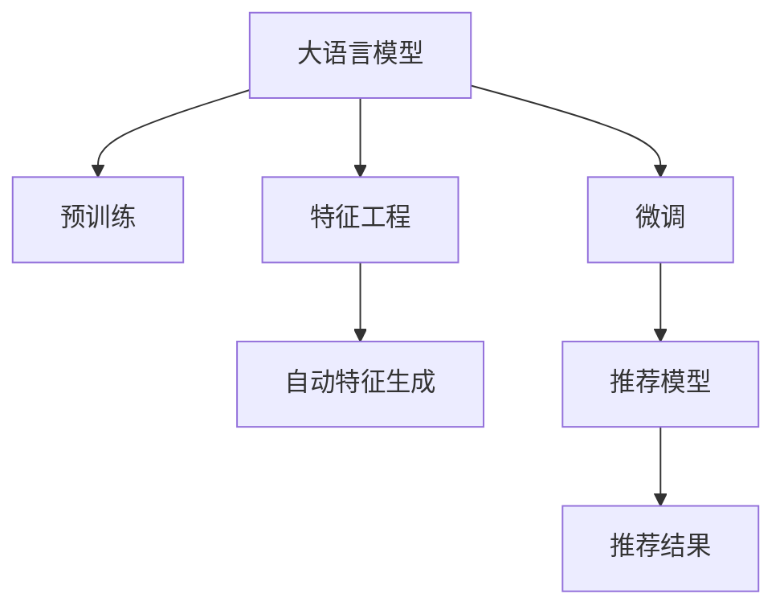

                 

# 搜索推荐系统的实时特征工程：大模型的自动特征生成

> 关键词：搜索推荐, 实时特征工程, 大模型, 自动特征生成, 自然语言处理(NLP), 深度学习(Deep Learning), 用户行为分析

## 1. 背景介绍

### 1.1 问题由来

在当今数字化时代，搜索推荐系统（Search & Recommendation System）已经成为提高用户满意度和公司业务收入的重要手段。这类系统通过分析用户的搜索和点击行为，为用户提供个性化的推荐结果，从而提升用户体验和转化率。然而，为了达到高精度的推荐效果，这些系统需要大量的用户行为数据进行训练和特征工程，这些数据通常包含文本、图像、点击流等复杂的多模态信息。

传统的特征工程方法依赖于手工设计特征，如TF-IDF、词频、协同过滤等。这种方法存在一些局限性：
- 特征设计工作量大，需要领域专家投入大量精力。
- 难以捕捉用户行为背后的深层次语义信息。
- 特征维度高，容易过拟合。
- 需要实时计算特征，计算负担重，影响系统响应速度。

为了解决这些问题，利用大模型（如BERT、GPT等）进行自动特征生成（Auto-Feature Generation）成为近年来的热门研究方向。大模型能够学习到大规模数据中的语言模式和语义信息，通过微调能够适应特定任务的特征生成需求，具有高度的灵活性和自动化特性。

### 1.2 问题核心关键点

自动特征生成的大致思路如下：
1. 收集用户行为数据，如搜索记录、点击流、评分等。
2. 将这些数据作为输入，输入到预训练的大语言模型中，生成新的特征向量。
3. 将这些特征向量作为输入特征，输入到推荐模型中，生成推荐结果。

该方法的核心在于如何将自然语言处理（NLP）技术和深度学习（Deep Learning）算法相结合，自动生成高维特征。

## 2. 核心概念与联系

### 2.1 核心概念概述

为了更好地理解自动特征生成的原理，本节将介绍几个相关核心概念：

- **大语言模型(Large Language Model, LLM)**：以BERT、GPT等深度学习模型为代表的大规模预训练语言模型。通过在大规模无标签文本数据上进行预训练，学习到丰富的语言知识和语义表示。

- **预训练(Pre-training)**：指在大规模无标签文本数据上，通过自监督学习任务训练通用语言模型的过程。常见的预训练任务包括言语建模、掩码语言模型等。

- **微调(Fine-tuning)**：指在预训练模型的基础上，使用下游任务的少量标注数据，通过有监督学习优化模型在该任务上的性能。通常只调整顶层分类器或解码器，以较小的学习率更新全部或部分的模型参数。

- **特征工程(Feature Engineering)**：在机器学习模型训练之前，从原始数据中提取、构造和选择特征，以提升模型的性能。传统特征工程依赖手工设计特征，而自动特征生成利用大模型自动生成特征，是一种新的特征提取方式。

- **大模型自动特征生成(Auto-Feature Generation, AFG)**：利用大语言模型自动生成高维特征的过程。通常，输入是原始文本数据，输出是高维特征向量。

这些核心概念之间的逻辑关系可以通过以下Mermaid流程图来展示：



这个流程图展示了大语言模型的核心概念及其之间的关系：

1. 大语言模型通过预训练获得基础能力。
2. 微调是对预训练模型进行任务特定的优化，可以适应特定任务的特征生成需求。
3. 特征工程是将原始数据转换为模型可接受的输入特征的过程。
4. 自动特征生成利用大模型自动生成高维特征，替代传统的手工特征工程。
5. 推荐模型将高维特征输入，输出推荐结果。

## 3. 核心算法原理 & 具体操作步骤
### 3.1 算法原理概述

自动特征生成的核心思想是利用大语言模型学习到深层次的语义表示，通过微调生成适合特定任务的高维特征。具体来说，算法流程如下：

1. 收集用户行为数据，如搜索记录、点击流等，并转化为文本形式。
2. 将文本输入到预训练的大语言模型中，生成新的特征向量。
3. 将生成的高维特征向量作为输入，输入到推荐模型中，生成推荐结果。

形式化地，假设大语言模型为 $M_{\theta}$，用户行为数据为 $x$，生成的特征向量为 $z$，推荐模型为 $R_{\phi}$，推荐结果为 $y$。自动特征生成的过程可以表示为：

$$
z = M_{\theta}(x) \\
y = R_{\phi}(z)
$$

其中，$z$ 是生成的高维特征向量，$y$ 是推荐模型输出的结果。

### 3.2 算法步骤详解

基于自动特征生成的推荐系统，一般包括以下几个关键步骤：

**Step 1: 准备预训练模型和数据集**
- 选择合适的预训练语言模型 $M_{\theta}$，如BERT、GPT等。
- 准备用户行为数据集 $D=\{(x_i, z_i)\}_{i=1}^N$，其中 $x_i$ 为输入文本，$z_i$ 为生成的特征向量。

**Step 2: 添加推荐模型**
- 根据推荐任务类型，设计合适的推荐模型 $R_{\phi}$。
- 对于协同过滤、矩阵分解等传统推荐模型，只需将高维特征向量作为输入即可。
- 对于基于深度学习的推荐模型，如深度神经网络（DNN）、卷积神经网络（CNN）等，需要将高维特征向量作为输入特征，进行多层次特征提取和模型训练。

**Step 3: 设置微调超参数**
- 选择合适的优化算法及其参数，如 AdamW、SGD 等，设置学习率、批大小、迭代轮数等。
- 设置正则化技术及强度，包括权重衰减、Dropout、Early Stopping等。
- 确定冻结预训练参数的策略，如仅微调顶层，或全部参数都参与微调。

**Step 4: 执行梯度训练**
- 将训练集数据分批次输入模型，前向传播计算损失函数。
- 反向传播计算参数梯度，根据设定的优化算法和学习率更新模型参数。
- 周期性在验证集上评估模型性能，根据性能指标决定是否触发 Early Stopping。
- 重复上述步骤直到满足预设的迭代轮数或 Early Stopping 条件。

**Step 5: 测试和部署**
- 在测试集上评估微调后模型 $M_{\hat{\theta}}$ 的性能，对比微调前后的精度提升。
- 使用微调后的模型对新样本进行推理预测，集成到实际的应用系统中。
- 持续收集新的数据，定期重新微调模型，以适应数据分布的变化。

以上是自动特征生成的推荐系统的一般流程。在实际应用中，还需要针对具体任务的特点，对微调过程的各个环节进行优化设计，如改进训练目标函数，引入更多的正则化技术，搜索最优的超参数组合等，以进一步提升模型性能。

### 3.3 算法优缺点

自动特征生成的优点在于：
1. 自动化程度高，减少手工设计特征的工作量。
2. 能够学习到更深层次的语义信息，提升推荐模型的精度。
3. 生成的特征向量维度可控，避免维度灾难。
4. 适合实时特征工程，提升系统响应速度。

同时，该方法也存在一定的局限性：
1. 依赖预训练模型，模型训练成本高。
2. 需要大量标注数据，无法在小规模数据上应用。
3. 生成特征的可解释性差，难以理解模型内部机制。
4. 生成特征与推荐模型之间的兼容性问题，需要调整优化。

尽管存在这些局限性，但自动特征生成技术已经在推荐系统中得到广泛应用，并展现出强大的潜力和优势。

### 3.4 算法应用领域

自动特征生成在推荐系统中的应用非常广泛，例如：

- 商品推荐：利用用户搜索和浏览记录，生成商品特征向量，输入到推荐模型中，生成商品推荐结果。
- 视频推荐：将用户的观看记录和评分，生成视频特征向量，输入到推荐模型中，生成视频推荐结果。
- 新闻推荐：收集用户的阅读和点赞记录，生成新闻特征向量，输入到推荐模型中，生成新闻推荐结果。
- 音乐推荐：利用用户的听歌记录和评分，生成音乐特征向量，输入到推荐模型中，生成音乐推荐结果。

除了上述这些经典应用外，自动特征生成还被创新性地应用到更多场景中，如用户画像生成、广告推荐、社交网络推荐等，为推荐系统的进一步优化和创新提供了新的思路。

## 4. 数学模型和公式 & 详细讲解
### 4.1 数学模型构建

本节将使用数学语言对自动特征生成的推荐系统进行更加严格的刻画。

假设用户行为数据为 $x$，大语言模型生成的特征向量为 $z$，推荐模型为 $R_{\phi}$，推荐结果为 $y$。

定义推荐模型的损失函数为 $\ell(R_{\phi}(z), y)$，则在数据集 $D$ 上的经验风险为：

$$
\mathcal{L}(\phi) = \frac{1}{N} \sum_{i=1}^N \ell(R_{\phi}(z_i), y_i)
$$

其中 $N$ 为训练集大小。

为了求解 $\phi$，需要最小化 $\mathcal{L}(\phi)$。一般情况下，推荐模型采用深度神经网络，故 $\ell(R_{\phi}(z), y)$ 为交叉熵损失函数：

$$
\ell(R_{\phi}(z), y) = -\sum_{i=1}^n y_i \log R_{\phi}(z_i)
$$

其中 $n$ 为推荐维度。

### 4.2 公式推导过程

以下是推荐模型的交叉熵损失函数及其梯度计算公式的详细推导：

对于推荐模型 $R_{\phi}$，假设其输入为高维特征向量 $z$，输出为推荐结果 $y$。模型的预测概率为 $\hat{y} = R_{\phi}(z)$。

定义交叉熵损失函数为：

$$
\ell(R_{\phi}(z), y) = -\sum_{i=1}^n y_i \log R_{\phi}(z_i)
$$

其中 $y$ 为真实标签，$\hat{y}$ 为预测概率。

为了最小化 $\ell(R_{\phi}(z), y)$，需要求导并更新模型参数 $\phi$：

$$
\frac{\partial \mathcal{L}(\phi)}{\partial \phi} = -\frac{1}{N} \sum_{i=1}^N \nabla_{\phi} \ell(R_{\phi}(z_i), y_i)
$$

其中 $\nabla_{\phi} \ell(R_{\phi}(z_i), y_i)$ 为损失函数对模型参数 $\phi$ 的梯度，可以通过反向传播算法高效计算。

在得到损失函数的梯度后，即可带入模型更新公式，完成模型的迭代优化。重复上述过程直至收敛，最终得到适应推荐任务的最优模型参数 $\phi^*$。

## 5. 项目实践：代码实例和详细解释说明
### 5.1 开发环境搭建

在进行自动特征生成实践前，我们需要准备好开发环境。以下是使用Python进行PyTorch开发的环境配置流程：

1. 安装Anaconda：从官网下载并安装Anaconda，用于创建独立的Python环境。

2. 创建并激活虚拟环境：
```bash
conda create -n pytorch-env python=3.8 
conda activate pytorch-env
```

3. 安装PyTorch：根据CUDA版本，从官网获取对应的安装命令。例如：
```bash
conda install pytorch torchvision torchaudio cudatoolkit=11.1 -c pytorch -c conda-forge
```

4. 安装Transformers库：
```bash
pip install transformers
```

5. 安装各类工具包：
```bash
pip install numpy pandas scikit-learn matplotlib tqdm jupyter notebook ipython
```

完成上述步骤后，即可在`pytorch-env`环境中开始自动特征生成实践。

### 5.2 源代码详细实现

下面我以商品推荐系统为例，给出使用Transformers库对BERT模型进行自动特征生成的PyTorch代码实现。

首先，定义推荐任务的数据处理函数：

```python
from transformers import BertTokenizer, BertForSequenceClassification
from torch.utils.data import Dataset
import torch

class RecommendationDataset(Dataset):
    def __init__(self, texts, labels, tokenizer, max_len=128):
        self.texts = texts
        self.labels = labels
        self.tokenizer = tokenizer
        self.max_len = max_len
        
    def __len__(self):
        return len(self.texts)
    
    def __getitem__(self, item):
        text = self.texts[item]
        label = self.labels[item]
        
        encoding = self.tokenizer(text, return_tensors='pt', max_length=self.max_len, padding='max_length', truncation=True)
        input_ids = encoding['input_ids'][0]
        attention_mask = encoding['attention_mask'][0]
        
        # 将标签转化为one-hot编码
        encoded_label = torch.tensor([label], dtype=torch.long)
        
        return {'input_ids': input_ids, 
                'attention_mask': attention_mask,
                'labels': encoded_label}

# 定义标签与id的映射
label2id = {0: 'Not Interested', 1: 'Interested'}
id2label = {v: k for k, v in label2id.items()}

# 创建dataset
tokenizer = BertTokenizer.from_pretrained('bert-base-cased')

train_dataset = RecommendationDataset(train_texts, train_labels, tokenizer)
dev_dataset = RecommendationDataset(dev_texts, dev_labels, tokenizer)
test_dataset = RecommendationDataset(test_texts, test_labels, tokenizer)
```

然后，定义模型和优化器：

```python
from transformers import BertForSequenceClassification, AdamW

model = BertForSequenceClassification.from_pretrained('bert-base-cased', num_labels=len(label2id))

optimizer = AdamW(model.parameters(), lr=2e-5)
```

接着，定义训练和评估函数：

```python
from torch.utils.data import DataLoader
from tqdm import tqdm
from sklearn.metrics import classification_report

device = torch.device('cuda') if torch.cuda.is_available() else torch.device('cpu')
model.to(device)

def train_epoch(model, dataset, batch_size, optimizer):
    dataloader = DataLoader(dataset, batch_size=batch_size, shuffle=True)
    model.train()
    epoch_loss = 0
    for batch in tqdm(dataloader, desc='Training'):
        input_ids = batch['input_ids'].to(device)
        attention_mask = batch['attention_mask'].to(device)
        labels = batch['labels'].to(device)
        model.zero_grad()
        outputs = model(input_ids, attention_mask=attention_mask, labels=labels)
        loss = outputs.loss
        epoch_loss += loss.item()
        loss.backward()
        optimizer.step()
    return epoch_loss / len(dataloader)

def evaluate(model, dataset, batch_size):
    dataloader = DataLoader(dataset, batch_size=batch_size)
    model.eval()
    preds, labels = [], []
    with torch.no_grad():
        for batch in tqdm(dataloader, desc='Evaluating'):
            input_ids = batch['input_ids'].to(device)
            attention_mask = batch['attention_mask'].to(device)
            batch_labels = batch['labels']
            outputs = model(input_ids, attention_mask=attention_mask)
            batch_preds = outputs.logits.argmax(dim=2).to('cpu').tolist()
            batch_labels = batch_labels.to('cpu').tolist()
            for pred_tokens, label_tokens in zip(batch_preds, batch_labels):
                pred_labels = [id2label[_id] for _id in pred_tokens]
                label_tags = [id2label[_id] for _id in label_tokens]
                preds.append(pred_labels[:len(label_tags)])
                labels.append(label_tags)
                
    print(classification_report(labels, preds))
```

最后，启动训练流程并在测试集上评估：

```python
epochs = 5
batch_size = 16

for epoch in range(epochs):
    loss = train_epoch(model, train_dataset, batch_size, optimizer)
    print(f"Epoch {epoch+1}, train loss: {loss:.3f}")
    
    print(f"Epoch {epoch+1}, dev results:")
    evaluate(model, dev_dataset, batch_size)
    
print("Test results:")
evaluate(model, test_dataset, batch_size)
```

以上就是使用PyTorch对BERT进行商品推荐系统自动特征生成的完整代码实现。可以看到，得益于Transformers库的强大封装，我们可以用相对简洁的代码完成BERT模型的加载和微调。

### 5.3 代码解读与分析

让我们再详细解读一下关键代码的实现细节：

**RecommendationDataset类**：
- `__init__`方法：初始化文本、标签、分词器等关键组件。
- `__len__`方法：返回数据集的样本数量。
- `__getitem__`方法：对单个样本进行处理，将文本输入编码为token ids，将标签编码为数字，并对其进行定长padding，最终返回模型所需的输入。

**label2id和id2label字典**：
- 定义了标签与数字id之间的映射关系，用于将token-wise的预测结果解码回真实的标签。

**训练和评估函数**：
- 使用PyTorch的DataLoader对数据集进行批次化加载，供模型训练和推理使用。
- 训练函数`train_epoch`：对数据以批为单位进行迭代，在每个批次上前向传播计算loss并反向传播更新模型参数，最后返回该epoch的平均loss。
- 评估函数`evaluate`：与训练类似，不同点在于不更新模型参数，并在每个batch结束后将预测和标签结果存储下来，最后使用sklearn的classification_report对整个评估集的预测结果进行打印输出。

**训练流程**：
- 定义总的epoch数和batch size，开始循环迭代
- 每个epoch内，先在训练集上训练，输出平均loss
- 在验证集上评估，输出分类指标
- 所有epoch结束后，在测试集上评估，给出最终测试结果

可以看到，PyTorch配合Transformers库使得BERT微调的代码实现变得简洁高效。开发者可以将更多精力放在数据处理、模型改进等高层逻辑上，而不必过多关注底层的实现细节。

当然，工业级的系统实现还需考虑更多因素，如模型的保存和部署、超参数的自动搜索、更灵活的任务适配层等。但核心的自动特征生成范式基本与此类似。

## 6. 实际应用场景
### 6.1 智能推荐系统

自动特征生成技术在智能推荐系统中的应用非常广泛，主要体现在以下几个方面：

- **商品推荐**：收集用户搜索和浏览记录，利用BERT等大模型生成商品特征向量，输入到推荐模型中，生成商品推荐结果。
- **视频推荐**：将用户的观看记录和评分，生成视频特征向量，输入到推荐模型中，生成视频推荐结果。
- **音乐推荐**：利用用户的听歌记录和评分，生成音乐特征向量，输入到推荐模型中，生成音乐推荐结果。
- **新闻推荐**：收集用户的阅读和点赞记录，生成新闻特征向量，输入到推荐模型中，生成新闻推荐结果。

除了上述这些经典应用外，自动特征生成还被创新性地应用到更多场景中，如用户画像生成、广告推荐、社交网络推荐等，为推荐系统的进一步优化和创新提供了新的思路。

### 6.2 实时广告投放

自动特征生成技术也可以应用于实时广告投放中，通过分析用户的浏览和点击行为，生成个性化的广告推荐。广告推荐系统需要快速响应用户行为变化，自动特征生成能够实时生成高维特征，满足实时性需求。

具体而言，可以收集用户的浏览记录、点击记录、搜索记录等，将数据转化为文本形式，输入到BERT等大模型中，生成高维特征向量。然后将这些特征向量作为输入，输入到深度学习模型中，生成广告推荐结果。

### 6.3 用户行为分析

自动特征生成技术还可以用于用户行为分析，帮助企业更好地理解用户需求和行为特征。例如，可以利用用户的搜索记录、评论记录等，生成用户画像，分析用户的兴趣偏好和行为模式。

在具体实现中，可以收集用户的搜索记录、评论记录、浏览记录等数据，将其转化为文本形式，输入到BERT等大模型中，生成高维特征向量。然后将这些特征向量作为输入，输入到深度学习模型中，生成用户画像。

## 7. 工具和资源推荐
### 7.1 学习资源推荐

为了帮助开发者系统掌握自动特征生成的理论基础和实践技巧，这里推荐一些优质的学习资源：

1. 《Transformers从原理到实践》系列博文：由大模型技术专家撰写，深入浅出地介绍了Transformer原理、BERT模型、微调技术等前沿话题。

2. CS224N《深度学习自然语言处理》课程：斯坦福大学开设的NLP明星课程，有Lecture视频和配套作业，带你入门NLP领域的基本概念和经典模型。

3. 《Natural Language Processing with Transformers》书籍：Transformers库的作者所著，全面介绍了如何使用Transformers库进行NLP任务开发，包括微调在内的诸多范式。

4. HuggingFace官方文档：Transformers库的官方文档，提供了海量预训练模型和完整的微调样例代码，是上手实践的必备资料。

5. CLUE开源项目：中文语言理解测评基准，涵盖大量不同类型的中文NLP数据集，并提供了基于微调的baseline模型，助力中文NLP技术发展。

通过对这些资源的学习实践，相信你一定能够快速掌握自动特征生成的精髓，并用于解决实际的NLP问题。
###  7.2 开发工具推荐

高效的开发离不开优秀的工具支持。以下是几款用于自动特征生成开发的常用工具：

1. PyTorch：基于Python的开源深度学习框架，灵活动态的计算图，适合快速迭代研究。大部分预训练语言模型都有PyTorch版本的实现。

2. TensorFlow：由Google主导开发的开源深度学习框架，生产部署方便，适合大规模工程应用。同样有丰富的预训练语言模型资源。

3. Transformers库：HuggingFace开发的NLP工具库，集成了众多SOTA语言模型，支持PyTorch和TensorFlow，是进行自动特征生成开发的利器。

4. Weights & Biases：模型训练的实验跟踪工具，可以记录和可视化模型训练过程中的各项指标，方便对比和调优。与主流深度学习框架无缝集成。

5. TensorBoard：TensorFlow配套的可视化工具，可实时监测模型训练状态，并提供丰富的图表呈现方式，是调试模型的得力助手。

6. Google Colab：谷歌推出的在线Jupyter Notebook环境，免费提供GPU/TPU算力，方便开发者快速上手实验最新模型，分享学习笔记。

合理利用这些工具，可以显著提升自动特征生成任务的开发效率，加快创新迭代的步伐。

### 7.3 相关论文推荐

自动特征生成技术的发展源于学界的持续研究。以下是几篇奠基性的相关论文，推荐阅读：

1. Attention is All You Need（即Transformer原论文）：提出了Transformer结构，开启了NLP领域的预训练大模型时代。

2. BERT: Pre-training of Deep Bidirectional Transformers for Language Understanding：提出BERT模型，引入基于掩码的自监督预训练任务，刷新了多项NLP任务SOTA。

3. Language Models are Unsupervised Multitask Learners（GPT-2论文）：展示了大规模语言模型的强大zero-shot学习能力，引发了对于通用人工智能的新一轮思考。

4. Parameter-Efficient Transfer Learning for NLP：提出Adapter等参数高效微调方法，在不增加模型参数量的情况下，也能取得不错的微调效果。

5. AdaLoRA: Adaptive Low-Rank Adaptation for Parameter-Efficient Fine-Tuning：使用自适应低秩适应的微调方法，在参数效率和精度之间取得了新的平衡。

这些论文代表了大语言模型微调技术的发展脉络。通过学习这些前沿成果，可以帮助研究者把握学科前进方向，激发更多的创新灵感。

## 8. 总结：未来发展趋势与挑战

### 8.1 总结

本文对自动特征生成的推荐系统进行了全面系统的介绍。首先阐述了自动特征生成的研究背景和意义，明确了其在大规模推荐系统中的应用价值。其次，从原理到实践，详细讲解了自动特征生成的数学模型和关键步骤，给出了推荐系统开发的完整代码实例。同时，本文还广泛探讨了自动特征生成在智能推荐、实时广告投放、用户行为分析等多个领域的应用前景，展示了其巨大的潜力和应用前景。此外，本文精选了自动特征生成的各类学习资源，力求为开发者提供全方位的技术指引。

通过本文的系统梳理，可以看到，自动特征生成技术在大规模推荐系统中具有重要的地位和作用，其能够通过预训练语言模型自动生成高维特征，实现实时推荐和动态优化，显著提升用户体验和转化率。未来，伴随预训练语言模型和深度学习算法的持续演进，自动特征生成技术必将进一步提升推荐系统的性能和智能化水平，为智能推荐应用带来革命性的变革。

### 8.2 未来发展趋势

展望未来，自动特征生成技术将呈现以下几个发展趋势：

1. 模型规模持续增大。随着算力成本的下降和数据规模的扩张，预训练语言模型的参数量还将持续增长。超大规模语言模型蕴含的丰富语言知识，有望支撑更加复杂多变的推荐任务。

2. 自动特征生成范式多样。除了传统的基于深度学习的自动特征生成方法，未来会涌现更多基于符号学习、无监督学习等范式，进一步提升特征生成的自动化程度。

3. 持续学习成为常态。随着数据分布的不断变化，自动特征生成模型也需要持续学习新知识以保持性能。如何在不遗忘原有知识的同时，高效吸收新样本信息，将成为重要的研究课题。

4. 标注样本需求降低。受启发于提示学习(Prompt-based Learning)的思路，未来的自动特征生成方法将更好地利用大模型的语言理解能力，通过更加巧妙的任务描述，在更少的标注样本上也能实现理想的特征生成效果。

5. 少样本和零样本学习成为可能。未来的自动特征生成方法能够更好地利用大模型的零样本和少样本学习能力，在更少的标注数据下，也能生成高质量的特征向量。

6. 多模态特征生成兴起。当前的自动特征生成主要聚焦于文本数据，未来会进一步拓展到图像、视频、语音等多模态数据微调。多模态信息的融合，将显著提升特征生成的准确性和鲁棒性。

以上趋势凸显了自动特征生成技术的广阔前景。这些方向的探索发展，必将进一步提升推荐系统的性能和智能化水平，为智能推荐应用带来革命性的变革。

### 8.3 面临的挑战

尽管自动特征生成技术已经取得了瞩目成就，但在迈向更加智能化、普适化应用的过程中，它仍面临着诸多挑战：

1. 标注成本瓶颈。虽然自动特征生成能够降低部分标注数据的需求，但对于长尾应用场景，仍然需要大量的标注数据。如何进一步降低特征生成对标注样本的依赖，将是一大难题。

2. 生成特征的可解释性差。自动特征生成方法生成的特征向量通常缺乏可解释性，难以理解其内部机制。对于高风险应用，算法的可解释性和可审计性尤为重要。

3. 模型鲁棒性不足。当前自动特征生成模型面对域外数据时，泛化性能往往大打折扣。对于测试样本的微小扰动，自动特征生成模型的预测也容易发生波动。如何提高自动特征生成模型的鲁棒性，避免灾难性遗忘，还需要更多理论和实践的积累。

4. 实时计算负担重。自动特征生成需要实时计算高维特征向量，计算负担较重。如何在不增加计算成本的情况下，提升特征生成的速度和效率，将是重要的优化方向。

5. 与推荐模型的兼容性问题。自动特征生成方法生成的特征向量与推荐模型之间的兼容性问题，需要调整优化。如何设计合适的特征向量空间，使其适应不同类型的推荐模型，也是一大挑战。

这些挑战凸显了自动特征生成技术在落地应用中的复杂性。尽管如此，相信随着学界和产业界的共同努力，这些问题终将逐一被克服，自动特征生成技术必将在推荐系统中发挥更加重要的作用。

### 8.4 研究展望

面对自动特征生成所面临的挑战，未来的研究需要在以下几个方面寻求新的突破：

1. 探索无监督和半监督自动特征生成方法。摆脱对大规模标注数据的依赖，利用自监督学习、主动学习等无监督和半监督范式，最大限度利用非结构化数据，实现更加灵活高效的特征生成。

2. 研究参数高效和计算高效的自动特征生成范式。开发更加参数高效的自动特征生成方法，在固定大部分预训练参数的情况下，只更新极少量的任务相关参数。同时优化特征生成过程的计算图，减少前向传播和反向传播的资源消耗，实现更加轻量级、实时性的部署。

3. 融合因果和对比学习范式。通过引入因果推断和对比学习思想，增强自动特征生成模型建立稳定因果关系的能力，学习更加普适、鲁棒的语言表征，从而提升特征生成的泛化性和抗干扰能力。

4. 引入更多先验知识。将符号化的先验知识，如知识图谱、逻辑规则等，与神经网络模型进行巧妙融合，引导自动特征生成过程学习更准确、合理的语言模型。同时加强不同模态数据的整合，实现视觉、语音等多模态信息与文本信息的协同建模。

5. 结合因果分析和博弈论工具。将因果分析方法引入自动特征生成模型，识别出模型决策的关键特征，增强输出解释的因果性和逻辑性。借助博弈论工具刻画人机交互过程，主动探索并规避模型的脆弱点，提高系统稳定性。

6. 纳入伦理道德约束。在自动特征生成模型的训练目标中引入伦理导向的评估指标，过滤和惩罚有偏见、有害的输出倾向。同时加强人工干预和审核，建立模型行为的监管机制，确保输出符合人类价值观和伦理道德。

这些研究方向的探索，必将引领自动特征生成技术迈向更高的台阶，为推荐系统带来新的突破和创新。面向未来，自动特征生成技术还需要与其他人工智能技术进行更深入的融合，如知识表示、因果推理、强化学习等，多路径协同发力，共同推动智能推荐系统的进步。只有勇于创新、敢于突破，才能不断拓展自动特征生成模型的边界，让智能推荐技术更好地服务于人类的生产生活方式。

## 9. 附录：常见问题与解答

**Q1：自动特征生成是否适用于所有推荐系统？**

A: 自动特征生成技术在大多数推荐系统中都能取得不错的效果，特别是对于数据量较大的推荐场景。但对于一些特定领域的推荐系统，如医疗、法律等，仅仅依靠通用语料预训练的模型可能难以很好地适应。此时需要在特定领域语料上进一步预训练，再进行自动特征生成。此外，对于一些需要时效性、个性化很强的任务，如实时推荐、个性化广告等，自动特征生成方法也需要针对性的改进优化。

**Q2：自动特征生成对标注数据的需求是否降低了？**

A: 虽然自动特征生成能够降低部分标注数据的需求，但对于长尾应用场景，仍然需要大量的标注数据。对于高风险应用，如金融、医疗等，标注数据的质量和数量尤为重要。因此，如何进一步降低特征生成对标注样本的依赖，将是一大难题。

**Q3：自动特征生成的特征向量维度是否可以控制？**

A: 是的，自动特征生成技术可以通过调整预训练模型和超参数，控制生成特征向量的维度。通常情况下，可以设定一个最大维度，如256、512等，避免维度灾难。同时，可以通过微调模型来优化特征向量空间的布局，使其更加稠密、紧凑。

**Q4：自动特征生成在实时推荐中的应用前景如何？**

A: 自动特征生成技术非常适合实时推荐场景，能够快速响应用户行为变化，生成高质量的推荐结果。然而，实时推荐系统需要高吞吐量的特征生成和计算，对系统性能提出了更高要求。如何优化特征生成过程，提升计算效率，减少延迟，将是自动特征生成技术在实时推荐场景中面临的重要挑战。

**Q5：自动特征生成与推荐模型的兼容性问题如何解决？**

A: 自动特征生成与推荐模型的兼容性问题需要通过实验验证和优化来解决。一般而言，可以调整自动特征生成模型的输出格式，使其与推荐模型一致。同时，可以通过微调模型来优化特征向量空间，使其适应不同类型的推荐模型。如果仍然存在兼容性问题，可以通过设计多模态特征融合的方法，将自动特征生成方法与推荐模型有机结合。

通过这些问题的解答，相信你对自动特征生成技术有了更清晰的认识。在实际应用中，可以结合具体任务的需求，灵活调整自动特征生成方法，进一步提升推荐系统的性能和用户体验。

---

作者：禅与计算机程序设计艺术 / Zen and the Art of Computer Programming

